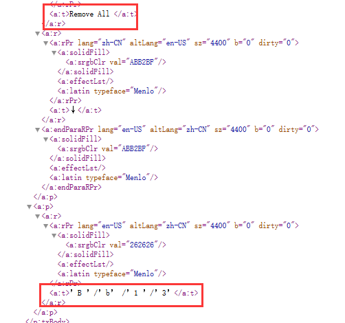
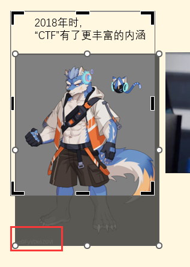

## asm_re

将操作码dump下来，并且把数据也顺便dump下来：

```python
with open("asm_re.txt", "r") as f:
    data = f.read()
asm = []
result = []
datas = data.split("\n")
for l in range(len(datas)):
    d = datas[l].split(" ")
    if l < 310:
        if len(d) > 1:
            index = 1
            while d[index] != "":
                asm += [int(d[index], 16)]
                index += 1
    elif 342 < l < 495:
        result += [int(d[1], 16)]

for i in asm:
    print("%02x" % i, end=" ")
print("\n")
for i in result:
    print("0x%02x" % i, end=", ")
print("\n")
```

把数据填到一个空文件，直接拖进ida arm架构分析：

```C
v21 = *MEMORY[0x1010];
v19 = 0;
v18 = 0xE84ui64;
MEMORY[0x2A4](v20, 0xF10ui64, 152i64);        // memcpy
v17 = MEMORY[0x2BC](0xE84ui64);               // strlen
v16 = v3;
v5 = (4i64 * (unsigned int)(v17 + 1) + 15) & 0xFFFFFFFFFFFFFFF0ui64;
MEMORY[0x1000]();
v6 = &v3[-v5];
v15 = v0;
for ( i = 0; i < v17; ++i )
{
    v13 = *(char *)(v18 + i);
    v12 = ((80 * v13 + 20) ^ 0x4D) + 30;
    *(_DWORD *)&v6[4 * i] = v12;
}
*(_DWORD *)&v6[4 * v17] = 0;
for ( j = 0; j < v17; ++j )
{
    v10 = *(char *)(v18 + j);
    v9 = ((80 * v10 + 20) ^ 0x4D) + 30;
    *(_DWORD *)&v6[4 * j] = v9;
}
MEMORY[0x2B0](0xEABui64);
v8 = 1;
for ( k = 0; k < v17; ++k )
{
    if ( *(_DWORD *)&v6[4 * k] != v20[k] )
    {
      v8 = 0;
      break;
    }
}
```

脚本：

```python
result = bytes(result)
result = [int.from_bytes(result[i:i+4], "little") for i in range(0, len(result), 4)]
print([hex(i) for i in result])
flag = []

for i in range(len(result)):#
    num = (result[i] - 30) & 0xFFFFFFFF
    num = (num ^ 0x4d) & 0xFFFFFFFF
    num = (num - 20) & 0xFFFFFFFF
    num = num // 80 
    flag += [num]
print(bytes(flag))
```

## android_so

DES加密，iv和key都在so中。

```java
public class inspect {
    public static boolean inspect(String input_str) {
        try {
            byte[] input_flag = input_str.getBytes(StandardCharsets.UTF_8);
            byte[] str2 = jni.getkey().getBytes(StandardCharsets.UTF_8);
            Arrays.copyOf(str2, 8);
            SecretKeySpec key = new SecretKeySpec(str2, "AES");
            byte[] ivBytes = jni.getiv().getBytes(StandardCharsets.UTF_8);
            IvParameterSpec iv = new IvParameterSpec(ivBytes);
            Cipher cipher = Cipher.getInstance("DES/CBC/PKCS5Padding");
            cipher.init(1, key, iv);
            byte[] encryptedBytes = cipher.doFinal(input_flag);
            String encryptedFlag = Base64.encodeToString(encryptedBytes, 0).trim();
            boolean bool = encryptedFlag.equals("JqslHrdvtgJrRs2QAp+FEVdwRPNLswrnykD/sZMivmjGRKUMVIC/rw==");
            if (!bool) {
                return true;
            }
            return false;
        } catch (Exception exception) {
            exception.printStackTrace();
            return true;
        }
    }
}
```

frida尝试获取，但只获取成功iv：

```javascript
Java.perform(function() {
    var jni = Java.use('com.example.re11113.jni');
    console.log(jni.getiv()); // Wf3DLups
    console.log(jni.getkey());
});
```

真机动调，获取key：A8UdWaeq

在这下断点。


DES解密：


### 其他解法

使用unidbg，这样就不用真机调试了。

```Java
package com.example.re11113;

import com.github.unidbg.linux.android.AndroidEmulatorBuilder;
import com.github.unidbg.linux.android.AndroidResolver;
import com.github.unidbg.linux.android.dvm.AbstractJni;
import com.github.unidbg.AndroidEmulator;
import com.github.unidbg.Module;
import com.github.unidbg.linux.android.dvm.*;
import com.github.unidbg.memory.Memory;
import com.github.unidbg.linux.android.dvm.DalvikModule;
import com.github.unidbg.linux.android.dvm.DvmClass;
import com.github.unidbg.linux.android.dvm.VM;
import java.io.*;

public class MainActivity extends AbstractJni {
    private final AndroidEmulator emulator;
    private final VM vm;

    public MainActivity(String soFilePath) throws IOException {
        emulator = AndroidEmulatorBuilder
                .for64Bit()
                .build();
        Memory memory = emulator.getMemory();
        memory.setLibraryResolver(new AndroidResolver(23));
        vm = emulator.createDalvikVM();
        vm.setVerbose(false);
        DalvikModule dm = vm.loadLibrary(new File(soFilePath), true);
        dm.callJNI_OnLoad(emulator);
    }

    public String GETKEY() {
        DvmClass dvmClass = vm.resolveClass("com.example.re11113.jni");
        DvmObject<?> object = dvmClass.newObject(null);
        DvmObject object1 = object.callJniMethodObject(emulator, "getkey()Ljava/lang/String;");
        return object1.getValue().toString();
    }

    public String GETIV() {
        DvmClass dvmClass = vm.resolveClass("com.example.re11113.jni");
        DvmObject<?> object = dvmClass.newObject(null);
        DvmObject object1 = object.callJniMethodObject(emulator, "getiv()Ljava/lang/String;");
        return object1.getValue().toString();
    }

    public static void main(String[] args) throws IOException {
        String soFilePath = "D:\\CTF\\Tool\\unidbg-master\\unidbg-android\\src\\test\\java\\com\\example\\re11113\\libSecret_entrance.so";
        //创建一个实例
        MainActivity app = new MainActivity(soFilePath);
        //解出key和iv
        String KEY = app.GETKEY();
        String IV = app.GETIV();
        System.out.println("getKey: " + KEY);
        System.out.println("getIV: " + IV);
    }
}

```


## rust_baby

输入完有加密，rust太难看了。

动调发现其比较的为加密结果的base64，且好像输入flag固定格式之后，前面的密文相同。

猜测为一个字节一个字节加密。

在这里比较：


测信道爆破了：（爆破过程知道字符集为hex字符）

```python
import frida
import subprocess

new_number = 0

def on_message(message, data):
    global new_number
    if message['type'] == 'send':
        new_number = message['payload']
    elif message['type'] == "error":
        print(message["description"])
        print(message["stack"])
        print(message["fileName"], "line:", message["lineNumber"], "colum:", message["columnNumber"])
    else:
        print(message)

jscode = open("hook.js", "rb").read().decode()

def check(flag):
    process = subprocess.Popen("rust_baby.exe",
                                stdin=subprocess.PIPE,
                                stdout=subprocess.PIPE,
                                stderr=subprocess.PIPE,
                                universal_newlines=True)
    session = frida.attach("rust_baby.exe")
    script = session.create_script(jscode)
    script.on('message', on_message)
    script.load()
    process.stdin.write(flag)
    output, error = process.communicate()

# flag{6e2480b
s = "flag{6e2480b3-4f02-4cf1-9bc0-1********************************************************"
index = 30
number = 41
final_number = 0
final_number = 0
new_flag = ''
printable = "0123456789abcdef{}-"
while True:
    print(index, final_number, s)
    for c1 in printable:
        f = s[:index] + c1 + s[index + 1:]
        check(f)
        print(new_number, f)
        if new_number > number:
            number_1 = new_number
            print(new_number, c1, f)
            for c2 in printable:
                f_2 = f[:index+1] + c2 + f[index+2:]
                check(f_2)
                if new_number > number_1:
                    number_2 = new_number
                    print(new_number, c2, f_2)
                    for c3 in printable:
                        f_3 = f_2[:index+2] + c3 + f_2[index+3:]
                        check(f_3)
                        # print(new_number, f_3)
                        if new_number > number_2:
                            print("findit", new_number, c3, f_3)
                            number = new_number
                            if number > final_number:
                                final_number = number
                                new_flag = f_3
    else:
        index += 3
        s = new_flag
        number = final_number
```

```javascript
var number = 0
function main() {
    var base = Module.findBaseAddress("rust_baby.exe")
    if (base) {
        Interceptor.attach(base.add(0x3EC6), {
            onEnter: function (args) {
                number += 1
            }
        });
        Interceptor.attach(base.add(0x3EDF), {
            onEnter: function (args) {
                send(number)
                var a = 0;
                for (var i = 0; i < 9999; i++) {
                    a += 1;
                }
                // 7FF7754B0000
                var f = new NativeFunction(base.add(0x20000), 'void', ['int']);
                f(0);
            }
        });
    }
}
setImmediate(main);
```


## whereThel1b

Python310的so

逆出逻辑：

```python
import base64
import random 

rand_data1 = [35, 8, 6, 6, 49, 31, 9, 6, 25, 39, 48, 6, 33, 15, 30, 39, 54, 45, 11, 14, 19, 18, 30, 39, 0, 12, 17, 33, 49, 37, 41, 33, 55, 26, 52, 54, 43, 54, 51, 14, 3, 55, 52, 35, 14, 27, 3, 55, 1, 0, 8, 13, 22, 47, 36, 53]
rand_data2 = [54, 24, 48, 56, 26, 2, 16, 32, 31, 25, 50, 53, 19, 30, 22, 37, 13, 32, 8, 18, 8, 48, 6, 39, 51, 16, 34, 45, 51, 38, 9, 19, 6, 46, 4, 54, 43, 21, 30, 35, 6, 22, 27, 20, 39, 40, 13, 35, 30, 28, 55, 33, 16, 3, 51, 35]

def whereistheflag(arg):
    arg = base64.b64encode(arg)
    arg = list(arg)
    index = 0
    new_list = []
    while True:
        n = rand_data1[index]
        new_list +=  [arg[index] + n]
        new_list[index] &= 0xFF
        index += 1
        if index == len(arg):
            break
    return arg

def whereistheflag1(arg):
    arg = base64.b64encode(arg)
    arg = list(arg)
    index = 0
    new_list = []
    while True:
        n = rand_data2[index]
        new_list +=  [arg[index] ^ n]
        new_list[index] &= 0xFF
        index += 1
        if index == len(arg):
            break
    return arg

    
def trytry(arg):
    random.seed(0)
    arg = whereistheflag1(arg)
    return arg
```

上面的rand_data是hook出来的：

```python
import whereThel1b
import random

ori_random = random.randint

def new_random(a, b):
    result = ori_random(a, b)
    # print(f"randint({a}, {b}) = {result}")
    print(result, end=", ")
    return result

random.randint = new_random

flag = input("where is my flag:")
flag = flag.encode()
encry = [108, 117, 72, 80, 64, 49, 99, 19, 69, 115, 94, 93, 94, 115, 71, 95, 84, 89, 56, 101, 70, 2, 84, 75, 127, 68, 103, 85, 105, 113, 80, 103, 95, 67, 81, 7, 113, 70, 47, 73, 92, 124, 93, 120, 104, 108, 106, 17, 80, 102, 101, 75, 93, 68, 121, 26]
print("whereisthelag")
whereThel1b.whereistheflag(flag)
print("\ntrytry")
ret = whereThel1b.trytry(flag)

if ret == encry:
    print("rrrrrrrrrrrright")
else:
    print("wwwwwwwwwwwwwwwrong")
```

逆出来是包含whereietheflag，实际没有，只有一个异或：

```python
import base64
rand_data1 = [35, 8, 6, 6, 49, 31, 9, 6, 25, 39, 48, 6, 33, 15, 30, 39, 54, 45, 11, 14, 19, 18, 30, 39, 0, 12, 17, 33, 49, 37, 41, 33, 55, 26, 52, 54, 43, 54, 51, 14, 3, 55, 52, 35, 14, 27, 3, 55, 1, 0, 8, 13, 22, 47, 36, 53]
rand_data2 = [54, 24, 48, 56, 26, 2, 16, 32, 31, 25, 50, 53, 19, 30, 22, 37, 13, 32, 8, 18, 8, 48, 6, 39, 51, 16, 34, 45, 51, 38, 9, 19, 6, 46, 4, 54, 43, 21, 30, 35, 6, 22, 27, 20, 39, 40, 13, 35, 30, 28, 55, 33, 16, 3, 51, 35]
encry = [108, 117, 72, 80, 64, 49, 99, 19, 69, 115, 94, 93, 94, 115, 71, 95, 84, 89, 56, 101, 70, 2, 84, 75, 127, 68, 103, 85, 105, 113, 80, 103, 95, 67, 81, 7, 113, 70, 47, 73, 92, 124, 93, 120, 104, 108, 106, 17, 80, 102, 101, 75, 93, 68, 121, 26]
flag = [0] * 56
# for i in range()
print(len(rand_data1))
print(len(rand_data2))
for i in range(56):
    flag[i] = (encry[i] ^ rand_data2[i])
    # flag[i] &= 0xFF
print(base64.b64decode(bytes(flag)))
# flag{7f9a2d3c-07de-11ef-be5e-cf1e88674c0b}
```

### 其他解法

赛后看网上WP，有一种解法蛮新奇。

由于程序是单字节异或加密，因此爆破是可以做的。

[CISCN 2024 WriteUp by COMPASS](https://wiki.compass.college/Writeup/2024ciscn1/ciscn2024_compass_wp/#androidso_re)👈使用模拟退火算法来爆破，学习一下。

速度很快，基本上几秒就出flag了。

```Python
import random
import math

import whereThel1b

def shared(lhs, rhs):
    return sum([ x == y for x, y in zip(lhs, rhs) ])


encry = [108, 117, 72, 80, 64, 49, 99, 19, 69, 115, 94, 93, 94, 115, 71, 95, 84, 89, 56, 101, 70, 2, 84, 75, 127, 68, 103, 85, 105, 113, 80, 103, 95, 67, 81, 7, 113, 70, 47, 73, 92, 124, 93, 120, 104, 108, 106, 17, 80, 102, 101, 75, 93, 68, 121, 26]

flag = [ 0 ] * 42
ALPHABET = 'abcdefghijklmnopqrstuvwxyzABCDEFGHIJKLMNOPQRSTUVWXYZ0123456789!#$%&()*+,-./:;<=>?@[]^_`{|}~'

t = 0.7
i = 0
flag_val = 0
while True:
    t *= 0.99998
    i += 1
    if i & 511 == 0:
        print(bytes(flag), flag_val, t)

    current = flag[:]
    j = random.randrange(0, len(current))
    current[j] = ord(random.choice(ALPHABET))

    seed = random.randrange(0, 1 << 64)
    current_val = shared(whereThel1b.trytry(bytes(current)), encry)
    random.seed(seed)

    delta = current_val - flag_val
    if math.exp(delta / t) > random.random():
        flag_val = current_val
        flag = current
```


## gdb_debug

逻辑简单，直接动调获取数据，脚本：

```python
result = list("congratulationstoyoucongratulationstoy".encode())

data1 = [0xBF, 0xD7, 0x2E, 0xDA, 0xEE, 0xA8, 0x1A, 0x10, 0x83, 0x73, 0xAC, 0xF1, 0x06, 0xBE, 0xAD, 0x88, 0x04, 0xD7, 0x12, 0xFE, 0xB5, 0xE2, 0x61, 0xB7, 0x3D, 0x07, 0x4A, 0xE8, 0x96, 0xA2, 0x9D, 0x4D, 0xBC, 0x81, 0x8C, 0xE9, 0x88, 0x78]

for i in range(len(result)):
    result[i] ^= data1[i % len(data1)]

rand_data1 = [222, 170, 66, 252, 9, 232, 178, 6, 13, 147, 97, 244, 36, 73, 21, 1, 215, 171, 4, 24, 207, 233, 213, 150, 51, 202, 249, 42, 94, 234, 45, 60, 148, 111, 56, 157, 88, 234]
for i in range(len(result)):
    result[i] ^= rand_data1[i]

table = [0x12, 0x0E, 0x1B, 0x1E, 0x11, 0x05, 0x07, 0x01, 0x10, 0x22, 0x06, 0x17, 0x16, 0x08, 0x19, 0x13, 0x04, 0x0F, 0x02, 0x0D, 0x25, 0x0C, 0x03, 0x15, 0x1C, 0x14, 0x0B, 0x1A, 0x18, 0x09, 0x1D, 0x23, 0x1F, 0x20, 0x24, 0x0A, 0x00, 0x21]
table_r = [i for i in range(len(result))]
new_result = [0] * len(result)
for i in range(len(table)):
    new_result[i] = table_r[table[i]]
table_r = new_result

new_result = [0] * len(result)
for i in range(len(result)):
    new_result[i] = result[(table_r.index(i))]
result = new_result

rand_data2 = [217, 15, 24, 189, 199, 22, 129, 190, 248, 74, 101, 242, 93, 171, 43, 51, 212, 165, 103, 152, 159, 126, 43, 93, 194, 175, 142, 58, 76, 165, 117, 37, 180, 141, 227, 123, 163, 100]
for i in range(len(result)):
    result[i] ^= rand_data2[i]

print(result)
print(bytes(result))
```

## GoReverse

### 异或

```C
for ( i = 0LL; len_input_ > i; ++i )
{
    v13 = *(unsigned __int8 *)(i + file_content);
    if ( !v20 )
    {
        a1 = runtime_panicdivide(result, len_input, i, 0LL, data, file_content, v13);
        goto LABEL_10;
    }
    len_input = result;
    if ( i % v20 >= (unsigned __int64)v20 )
        runtime_panicIndex(i % v20, result, v20);
    *(_BYTE *)(result + i) = data[i % v20] ^ v13;
}
```

### xxtea

```C
// main.zQyveE
unsigned int *__golang main_func2(
    unsigned int *input,
    __int64 input_len,
    __int64 a3,
    __int64 key,
    unsigned __int64 key_len,
    __int64 a6)
{
    while ( &retaddr <= *(v6 + 16) )
    {
        v26 = input;
        v28 = a3;
        v31 = a6;
        runtime_morestack_noctxt(input);
        input = v26;
        a3 = v28;
        a6 = v31;
    }
    if ( input_len >= 2 )
    {
        v27 = input_len;
        input_ = input;
        v30 = key_len;
        v29 = key;
        v7 = input;
        last_input = input[input_len - 1];
        v9 = input_len - 1;
        v23 = input_len - 1;
        v10 = 52 / input_len + 6;
        num = 0;
        while ( v10 > 0 )
        {
            v19 = num + 0x7FAB4CAD;
            num_ = num + 0x7FAB4CAD;
            key_index = ((num + 0x7FAB4CAD) >> 2) & 3;
            v20 = key_index;
            i = 0LL;
            while ( i < v9 )
            {
                if ( input_len <= (i + 1) )
                    runtime_panicIndex(i + 1, input_len, input_len);
                i_ = i;
                v22 = i + 1;
                v17 = main_KjmS3y(num_, v7[i + 1], last_input, i, key_index, key, key_len);
                v7 = input_;
                new_input = input_[i_] + v17;
                input_[i_] = new_input;
                v9 = v23;
                input_len = v27;
                key_len = v30;
                key = v29;
                num_ = v19;
                i = v22;
                last_input = new_input;
                key_index = v20;
            }
            v12 = main_KjmS3y(num_, *v7, last_input, v9, key_index, key, key_len);
            input_len = v27;
            v7 = input_;
            v13 = input_[v27 - 1] + v12;
            input_[v27 - 1] = v13;
            --v10;
            key_len = v30;
            key = v29;
            v9 = v23;
            last_input = v13;
            num = v19;
        }
        return v7;
    }
    return input;
}
// main.KjmS3y
__int64 __golang main_KjmS3y(
    int num,
    unsigned int input,
    unsigned int last_input,
    char i,
    int key_index,
    __int64 key,
    unsigned __int64 key_len)
{
    __int64 v8; // rbx
    unsigned __int64 v9; // rdi

    v8 = (last_input >> 5) ^ (4 * input);
    v9 = key_index ^ i & 3u;
    if ( key_len <= v9 )
        runtime_panicIndex(v9, v8, key_len);
    return (last_input ^ *(key + 4 * v9)) + (num ^ input ^ (((16 * last_input) ^ (input >> 3)) + v8));
}
```

### SM4

使用`CRT`模式加密，计数器应该是`crypto_rand_Read`生成的随机字节作为IV。

最后会使用`runtime_memmove(v33 + 16, v43);`将生成的随机字节与加密结果进行拼接作为最终加密结果。

```C
// main.AkuFrt
char *__golang sm4(
    __int64 input,
    unsigned __int64 input_len,
    __int64 a3,
    int key,
    __int64 key_len,
    __int64 a6,
    int a7,
    int a8,
    int a9)
{
    while ( &retaddr <= *(v9 + 16) )
    {
        v47 = input;
        v49 = a3;
        v50 = a6;
        runtime_morestack_noctxt(input);
        input = v47;
        a3 = v49;
        a6 = v50;
    }
    v48 = a3;
    v46 = input;
    v10 = github_com_tjfoc_gmsm_sm4_NewCipher(key, key_len, a6, key, key_len, a6, a7, a8, a9);
    if ( v15 )
        return 0LL;
    v44 = v10;
    v43 = runtime_makeslice(&RTYPE_uint8, input_len, input_len, key, key_len, v11, v12, v13, v14, v35, v38);
    v42 = runtime_makeslice(&RTYPE_uint8, 16, 16, key, key_len, v16, v17, v18, v19, v36, v39);
    crypto_rand_Read(v42, 16, 16LL, key, key_len, v20, v21, v22, v23);
    v28 = crypto_cipher_NewCTR(v44, key_len, v42, 16, 16, v24, v25, v26, v27, v37, v40);
    (*(v28 + 24))(key_len, v43, input_len, input_len, v46, input_len, v48);
    if ( input_len >= 0xFFFFFFFFFFFFFFF0LL || input_len == 0 )
        v33 = v42;
    else
        v33 = runtime_growslice(&RTYPE_uint8, v42, 16LL, 16LL, input_len + 16, v29, v30, v31, v32);
    v41 = v33;
    runtime_memmove(v33 + 16, v43);
    return v41;
}

// crypto/rand.Read
__int64 __golang crypto_rand_Read(
    __int64 a1,
    int a2,
    __int64 a3,
    _DWORD a4,
    _DWORD a5,
    _DWORD a6,
    int a7,
    int a8,
    int a9)
{
    while ( &retaddr <= *(v9 + 16) )
    {
        v13 = a1;
        v15 = a3;
        runtime_morestack_noctxt(a1);
        a1 = v13;
        a3 = v15;
    }
    return io_ReadFull(io_Reader, dev_urandom, a1, a2, a3, dev_urandom, a7, a8, a9);
}
```

### AES

```C
// main.JrkmHd
__int64 __golang aes(
    __int64 a1,
    __int64 input_len,
    __int64 a3,
    int key,
    __int64 a5,
    unsigned __int64 a6,
    int a7,
    int a8,
    int a9)
{
    while ( (unsigned __int64)&retaddr <= *(_QWORD *)(v9 + 16) )
    {
        input = a1;
        v41 = a3;
        v43 = a6;
        runtime_morestack_noctxt(a1);
        a1 = input;
        a3 = v41;
        a6 = v43;
    }
    input_1 = a1;
    v40 = a3;
    v42 = a6;
    v10 = crypto_aes_NewCipher(key, a5, a6, key, a5, a6, a7, a8, a9);
    if ( v15 )
        return 0LL;
    cipher = v10;
    v35 = main_gJoZv8(input_1, input_len, v40, 16LL, a5, v11, v12, v13, v14);
    v33 = v16;
    v21 = runtime_makeslice((unsigned int)&RTYPE_uint8, input_len, input_len, 16, a5, v17, v18, v19, v20, v28, v30);
    if ( v42 < 0x10 )
        runtime_panicSliceAcap(v21, input_len, 16LL);
    v34 = v21;
    v26 = crypto_cipher_NewCBCEncrypter(cipher, a5, key, 16, v42, v22, v23, v24, v25, v29, v31, v32);
    (*(void (__golang **)(__int64, __int64, __int64, __int64, __int64, __int64, __int64))(v26 + 32))(
        a5,
        v34,
        input_len,
        input_len,
        v35,
        input_len,
        v33);
    return v34;
}
```

`CBC`模式加密，``key``和`IV`是一样的：

```Go
func CBCEncrypter(text []byte,key []byte,iv []byte) []byte{
	block,err:=aes.NewCipher(key)ize())
	blockMode := cipher.NewCBCEncrypter(block,iv)
	result := make([]byte,len(paddText))
	blockMode.CryptBlocks(result,paddText
	return result
}
```

### base32

最后进行base32：

```C
// main.NJVCTq
__int64 __golang main_NJVCTq(__int64 a1, int a2, __int64 a3, __int64 a4, int a5, int a6, int a7, int a8, int a9)
{
    while ( &retaddr <= *(v9 + 16) )
    {
        v15 = a1;
        v20 = a3;
        runtime_morestack_noctxt(a1);
        a1 = v15;
        a3 = v20;
    }
    return encoding_base32__ptr_Encoding_EncodeToString(qword_59E1E8, a1, a2, a3, a5, a6, a7, a8, a9, v11, v12);
}
```

### 解密

有傻子看不到下发赛题这四个字...


用网上看到的flag加密，自己解密看看了...

```Python
import base64
from Crypto.Cipher import AES
from pysm4 import encrypt


def func1(cipher):
    data = [
        0x44, 0x37, 0x42, 0x4A, 0x4C, 0x73, 0x4F, 0x6B, 0x39, 0x40,
        0x66, 0x26, 0x31, 0x64, 0x57, 0x49, 0x6E, 0x35, 0x33, 0x49,
        0x44, 0x6C, 0x4A, 0x71, 0x55, 0x53, 0x36, 0x24, 0x5E, 0x57,
        0x68, 0x6B, 0x41, 0x6B, 0x32, 0x6B, 0x6B, 0x2A, 0x32, 0x47,
        0x61, 0x71, 0x6D, 0x4C, 0x77, 0x69, 0x4C, 0x58, 0x5E, 0x62,
        0x47, 0x47, 0x45, 0x24, 0x26, 0x64, 0x6D, 0x71, 0x52, 0x5E,
        0x67, 0x35, 0x62, 0x4C, 0x33, 0x6C, 0x43, 0x41, 0x35, 0x5E,
        0x48, 0x47, 0x4B, 0x24, 0x39, 0x71, 0x6F, 0x35, 0x54, 0x40,
        0x42, 0x77, 0x6F, 0x6D, 0x39, 0x76, 0x45, 0x58, 0x79, 0x61,
        0x30, 0x48, 0x41, 0x56, 0x33, 0x4C, 0x72, 0x57, 0x57, 0x00
    ]
    for i in range(len(cipher)):
        cipher[i] ^= data[i % len(data)]
    return cipher


def func2(ptext):
    key = "Bs^8*wZ4lu8oR&@kpg5g#k6Qo3L&1EzT/proc/self/auxv"[:16].encode()
    key = [int.from_bytes(key[i:i+4], 'little') for i in range(0, len(key), 4)]
    ptext = bytes(ptext + [0] * (4 - len(ptext) % 4))
    ptext = [int.from_bytes(ptext[i:i+4], 'little') for i in range(0, len(ptext), 4)]
    num = 0
    delta = 0x7FAB4CAD
    for _ in range((52 // len(ptext)) + 6):
        num += delta
        num &= 0xFFFFFFFF
        for i in range(len(ptext)):
            key_index = ((num >> 2) ^ i) & 3
            next_p = ptext[(i + 1) % len(ptext)]
            last_p = ptext[(i - 1) % len(ptext)]
            t = (last_p ^ key[key_index])
            t += num ^ next_p ^ (((last_p << 4) ^ (next_p >> 3)) + ((last_p >> 5) ^ (next_p << 2)))
            ptext[i] = (ptext[i] + t) & 0xFFFFFFFF
    ptext = b''.join([i.to_bytes(4, 'little') for i in ptext])
    ptext = list(ptext)
    return ptext


def func2_decrypt(cipher):
    key = "Bs^8*wZ4lu8oR&@kpg5g#k6Qo3L&1EzT/proc/self/auxv"[:16].encode()
    key = [int.from_bytes(key[i:i+4], 'little') for i in range(0, len(key), 4)]
    cipher = bytes(cipher)
    cipher = [int.from_bytes(cipher[i:i+4], 'little') for i in range(0, len(cipher), 4)]
    delta = 0x7FAB4CAD
    round = (52 // len(cipher)) + 6
    num = (delta * round) & 0xFFFFFFFF
    for _ in range(round):
        for i in range(len(cipher)-1, -1, -1):
            key_index = ((num >> 2) ^ i) & 3
            next_p = cipher[(i + 1) % len(cipher)]
            last_p = cipher[(i - 1) % len(cipher)]
            t = (last_p ^ key[key_index])
            t += num ^ next_p ^ (((last_p << 4) ^ (next_p >> 3)) + ((last_p >> 5) ^ (next_p << 2)))
            cipher[i] = (cipher[i] - t) & 0xFFFFFFFF
        num -= delta
        num &= 0xFFFFFFFF
    cipher = b''.join([i.to_bytes(4, 'little') for i in cipher])
    cipher = list(cipher)
    return cipher


def aes_dec(cipher):
    key = "dPGWgcLpqmxw3uOXhKpKV009Cql@@XE6".encode()
    iv = key[:16]
    aes = AES.new(key, AES.MODE_CBC, iv=iv)
    return aes.decrypt(cipher)


def sm4_dec(cipher, iv):
    key = int.from_bytes(b"pg5g#k6Qo3L&1EzT", 'big')
    iv = int.from_bytes(iv, 'big')
    ptext = b""
    for i in range(0, len(cipher), 16):
        temp = encrypt(iv + (i // 16), key)
        temp = temp ^ int.from_bytes(cipher[i:i+16], 'big')
        ptext += temp.to_bytes(16, 'big')
    return ptext

if __name__ == '__main__':
    # flag{3a4575cf-c85c-4350-90ca-baef8252425e}\nL
    c = "ODU4VJDNMOHMIWUE26WUT5SEQYDMAAKDURULFFEG5AU4BDTGNIDIA5CUSFJ67DPMILEU7Y45Y4N555QM457IJHIPPPFVA45U44SGKLI="
    c = base64.b32decode(c)
    c = aes_dec(c)
    c = sm4_dec(c[16:], c[:16])
    c = func2_decrypt(c[:44])
    c = func1(c)
    print(bytes(c))
```


## 神秘文件


`QFCfpPQ6ZymuM3gq`用Bifid解密`Part1:flag{e`


`这offset:10里原来似乎有什么，后来好像被小Caesar抱走了！mQPinNS6Xtm1JGJs` `part2:675efb`


`PArt3:3-34`


`UGF5dDQ6NmYtNDA=`base64解码`Payt4:6f-40`


`pArt5:5f-90d`


`UGFyVDY6ZC0y`解码`ParT6:d-2`


`PART7=22b3`


`paRt8:87e`





`cGFyVDk6ZGVI`解码`parT9:deH`



`UEFSdDEwOjl9`解密`PARt10:9}`


`flag{e675efb3-346f-405f-90dd-222b387edeH9}`

## p&p

在`static/www.zip`获取源码。

jeb打开`wasm`，有两个函数：

结合访问upload和源码，猜测这里v0为我们的输入。


这一个猜测为读取文件，复制文件内容。


需要想办法让`flag`文件的内容写到`static`目录下。

使用以下脚本测试输入最大值：

```python
for i in range(0x100):
    if os.path.exists("file.txt"):
        os.remove("file.txt")
    payload = "A" * i
    result = os.popen("echo {} | ./wasmtime --dir=. vuln.wasm".format(payload))
    time.sleep(0.1)
    if not os.path.exists("file.txt"):
        print("Crash at {}".format(i))
        print("return value: {}".format(result.read()))
        break
# 164
```

payload：`'1' * 164 + 'static/f'`。

然后访问`/test`执行payload，再去`static/f`获取文件，得到flag。

## OvO

```python
from Crypto.Util.number import *
from secret import flag

nbits = 512
p = getPrime(nbits)
q = getPrime(nbits)
n = p * q
phi = (p-1) * (q-1)
while True:
    kk = getPrime(128)
    rr = kk + 2
    e = 65537 + kk * p + rr * ((p+1) * (q+1)) + 1
    if gcd(e, phi) == 1:
        break
m = bytes_to_long(flag)
c = pow(m, e, n)

e = e >> 200 << 200
print(f'n = {n}')
print(f'e = {e}')
print(f'c = {c}')

"""
n = 111922722351752356094117957341697336848130397712588425954225300832977768690114834703654895285440684751636198779555891692340301590396539921700125219784729325979197290342352480495970455903120265334661588516182848933843212275742914269686197484648288073599387074325226321407600351615258973610780463417788580083967
e = 37059679294843322451875129178470872595128216054082068877693632035071251762179299783152435312052608685562859680569924924133175684413544051218945466380415013172416093939670064185752780945383069447693745538721548393982857225386614608359109463927663728739248286686902750649766277564516226052064304547032760477638585302695605907950461140971727150383104
c = 14999622534973796113769052025256345914577762432817016713135991450161695032250733213228587506601968633155119211807176051329626895125610484405486794783282214597165875393081405999090879096563311452831794796859427268724737377560053552626220191435015101496941337770496898383092414492348672126813183368337602023823
"""
```

`e = 65537 + kk * p + rr * ((p+1) * (q+1)) + 1`可推导出`e = 65537 + (k + 2)n + 2p(k + 1) + (k + 2)q + k + 3`

由`p,q,n`很大可以推出`rr = k + 2 = e // n`从而推出`k`

式子两边乘`p`可得`ep = 65537p + (k + 2)np + 2p^2(k + 1) + (k + 2)n + (k + 3)p`

已知`e`高位，可求未知数`p`高位。

已知`p`高位，再求`p`。

```Python
from Crypto.Util.number import *
def get_full_p(p_high, n, bits):
    PR.<x> = PolynomialRing(Zmod(n))    
    f = x + p_high
    f = f.monic()
    roots = f.small_roots(X=2^(bits + 4), beta=0.4)  
    if roots:
        x0 = roots[0]
        p = gcd(x0 + p_high, n)
        return ZZ(p)
def find_p_high(e, n, bits):
    PR.<x> = PolynomialRing(RealField(1000))
    f = (kk+rr)*x**2 + (rr*(n+1)+65538)*x + rr*n - e*x
    results = f.roots()
    if results:
        for x in results:
            p_high = int(x[0]) 
            p = get_full_p(p_high, n, bits)
            if p and p != 1:
                return p
n = 111922722351752356094117957341697336848130397712588425954225300832977768690114834703654895285440684751636198779555891692340301590396539921700125219784729325979197290342352480495970455903120265334661588516182848933843212275742914269686197484648288073599387074325226321407600351615258973610780463417788580083967
e = 37059679294843322451875129178470872595128216054082068877693632035071251762179299783152435312052608685562859680569924924133175684413544051218945466380415013172416093939670064185752780945383069447693745538721548393982857225386614608359109463927663728739248286686902750649766277564516226052064304547032760477638585302695605907950461140971727150383104
c = 14999622534973796113769052025256345914577762432817016713135991450161695032250733213228587506601968633155119211807176051329626895125610484405486794783282214597165875393081405999090879096563311452831794796859427268724737377560053552626220191435015101496941337770496898383092414492348672126813183368337602023823
rr = e // n
kk = rr - 2
p = find_p_high(e, n, 200)
q = n // p
e = 65537 + kk * p + rr * ((p + 1) * (q + 1)) + 1
d1 = inverse(e,(p - 1) * (q - 1))
m1 = pow(c,int(d1),n)
print(long_to_bytes(int(m1)))
#b'flag{b5f771c6-18df-49a9-9d6d-ee7804f5416c}'
```

