坐牢的一天 /(ㄒoㄒ)/~~

## baby_harmony

[‌⁠‌‍‍‍‌‬‌⁠‌‍‌‌⁠‍‬⁠⁠⁠‍⁠‬2024 05.27 jqctf 初赛 wp - LaoGong](https://ycznkvrmzo.feishu.cn/docx/ZqU0dU0h2oW3eFxZtZMctShFnyh)👈我是真的爱LaoGong

### 分析

没分析过harmony，解压后随便翻翻，看到部分源码：

```java
import hilog from '@ohos:hilog';
import testNapi from '@app:com.example.test/entry/entry';
import batteryInfo from '@ohos:batteryInfo';
...
class Index extends ViewPU {
    constructor(parent, params, __localStorage, elmtId = -1) {
        super(parent, __localStorage, elmtId);
        this.context = getContext(this);
        this.__message = new ObservedPropertySimplePU('请输入flag', this, "message");
        this.__button_name = new ObservedPropertySimplePU('提交', this, "button_name");
        this.__flag = new ObservedPropertySimplePU('', this, "flag");
        this.__result = new ObservedPropertySimplePU('', this, "result");
        this.dialogController = new CustomDialogController({
            builder: () => {
                let jsDialog = new CustomDialogExample(this, {
                    textValue: this.__result,
                });
                jsDialog.setController(this.dialogController);
                ViewPU.create(jsDialog);
            }
        }, this);
        this.setInitiallyProvidedValue(params);
    }
    ...
    aboutToAppear() {
        testNapi.register(0, (a) => {
            var t = batteryInfo.batterySOC - a;
            var f;
            if (t > 0)
                f = 1;
            else if (t == 0)
                f = 0;
            else
                f = -1;
            return f === 0;
        });
        ...
        testNapi.register(256, () => {
            return batteryInfo.batterySOC;
        });
        ...
    }
    initialRender() {
        ...
        this.observeComponentCreation((elmtId, isInitialRender) => {
            ViewStackProcessor.StartGetAccessRecordingFor(elmtId);
            Button.createWithLabel(this.button_name);
            Button.onClick(() => {
                this.context.resourceManager.getRawFileContent("bin").then((value) => {
                    var c = testNapi.check(this.flag, value);
                    if ((c & 0b100) === 0b100) {
                        this.result = '系统环境异常';
                    }
                    else if ((c & 0b10) === 0b10) {
                        this.result = 'flag格式错误';
                    }
                    else if ((c & 0b1) === 0b1) {
                        this.result = 'flag错误或系统环境异常';
                    }
                    else {
                        this.result = 'flag正确';
                    }
                    this.dialogController.open();
                });
            });
            if (!isInitialRender) {
                Button.pop();
            }
            ViewStackProcessor.StopGetAccessRecording();
        });
        Button.pop();
        Column.pop();
        Row.pop();
    }
    rerender() {
        this.updateDirtyElements();
    }
}
...
```

看到`check`逻辑在libentry.so里。

搜索字符串`check`，交叉引用来到这：

字符串下面应该是对应的函数。

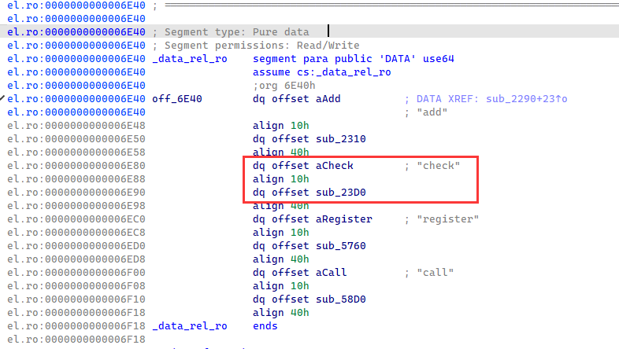

`check`有一堆napi的函数，结合[Node-API | Node.js v22 文档](https://nodejs.cn/api/n-api.html#napi_get_value_string_utf8)看。

首先获取两个参数并判断flag格式：`flag{***}`

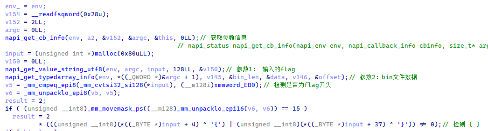

然后是根据`bin`数据来获取调用函数号和获取`key`。

```C
if ( bin_len )
{
    bin = offset + data;
    i = 0LL;
    input_ = input;
    do
    {
        bin_i = *(unsigned __int8 *)(bin + i);
        next = (struct function2call *)methods.next;
        result_ = result;
        i_ = i;
        if ( !next )
        {
            p_next = (struct function2call *)&methods.next;
            next = (struct function2call *)&methods.next;
            goto LABEL_19;
        }
        p_next = (struct function2call *)&methods.next;
        while ( next->functionNum <= bin_i )
        {
            if ( next->functionNum >= bin_i )
                goto LABEL_19;
            p_next = (struct function2call *)&next->next;
            last = (struct function2call *)next->next;
            if ( !last )
                goto LABEL_19;
            LABEL_12:
            next = last;
        }
        last = (struct function2call *)next->last;
        p_next = next;
        if ( next->last )
            goto LABEL_12;
        p_next = next;
        LABEL_19:
        func_1 = (struct function2call *)p_next->last;
        if ( !p_next->last )
        {
            func_1 = (struct function2call *)operator new(0x30uLL);
            func_1->functionNum = bin_i;
            func_1->func_id = 0LL;
            *(_OWORD *)&func_1->last = 0LL;
            func_1->field_10 = (__int64)next;
            p_next->last = (__int64)func_1;
            if ( *(_QWORD *)methods.root )
            {
                methods.root = *(_QWORD *)methods.root;
                v30 = (struct function2call *)p_next->last;
            }
            else
            {
                v30 = func_1;
            }
            std::__n1::__tree_balance_after_insert<std::__n1::__tree_node_base<void *> *>(methods.next, v30);
            ++methods.field_10;
        }
        napi_get_reference_value(env, func_1->func_id, (__int64)&func2call_1);
        bin_i_add_256 = bin_i + 256;
        v32 = (struct function2call *)methods.next;
        if ( v32 )
        {
            v33 = (struct function2call *)&methods.next;
            while ( 1 )
            {
                functionNum = v32->functionNum;
                if ( bin_i_add_256 < functionNum )
                {
                    v34 = (struct function2call *)v32->last;
                    v33 = v32;
                    if ( !v32->last )
                        goto LABEL_33;
                }
                else
                {
                    if ( functionNum >= bin_i_add_256 )
                        goto LABEL_34;
                    v33 = (struct function2call *)&v32->next;
                    v34 = (struct function2call *)v32->next;
                    if ( !v34 )
                        goto LABEL_34;
                }
                v32 = v34;
            }
        }
        v32 = (struct function2call *)&methods.next;
        LABEL_33:
        v33 = v32;
        LABEL_34:
        func_2 = (struct function2call *)v33->last;
        if ( !v33->last )
        {
            func_2 = (struct function2call *)operator new(0x30uLL);
            func_2->functionNum = bin_i_add_256;
            func_2->func_id = 0LL;
            *(_OWORD *)&func_2->last = 0LL;
            func_2->field_10 = (__int64)v32;
            v33->last = (__int64)func_2;
            if ( *(_QWORD *)methods.root )
            {
                methods.root = *(_QWORD *)methods.root;
                v37 = (struct function2call *)v33->last;
            }
            else
            {
                v37 = func_2;
            }
            std::__n1::__tree_balance_after_insert<std::__n1::__tree_node_base<void *> *>(methods.next, v37);
            ++methods.field_10;
        }
        env_ = env;
        napi_get_reference_value(env, func_2->func_id, (__int64)&func2call_2);
        napi_call_function(env, this, func2call_2, 0LL, 0LL, &func_ret_2);
        v38 = malloc(0x80uLL);
        v138 = 0LL;
        bin_i_add_1 = *(_BYTE *)(bin + i_ + 1);
        if ( bin_i_add_1 == 2 )
        {
            napi_create_int32(env, *(unsigned __int8 *)(bin + i_ + 3), &func_arg_1);
            napi_coerce_to_bool(env, func_arg_1, &func_arg_1);
            napi_call_function(env, this, func2call_1, 1LL, &func_arg_1, &func_ret_1);
            napi_get_value_bool(env, func_ret_2, func_ret_2__);
            LOBYTE(key) = func_ret_2__[0];
            v40 = i_ + 4;
        }
        else
        {
            v40 = i_ + 3;
            if ( bin_i_add_1 == 1 )
            {
                v41 = *(unsigned __int8 *)(bin + i_ + 2);
                napi_create_string_utf8(env, bin + v40, v41, &func_arg_1);
                v40 += v41;
                env_ = env;
                napi_call_function(env, this, func2call_1, 1LL, &func_arg_1, &func_ret_1);
                napi_get_value_string_utf8(env, func_ret_2, v38, 128LL, &v138);
                if ( v138 )
                {
                    if ( (unsigned __int64)v138 < 0x20 )
                    {
                        v42 = 0LL;
                        key = 0;
                        goto LABEL_56;
                    }
                    v42 = v138 & 0xFFFFFFFFFFFFFFE0LL;
                    if ( (v138 & 0xFFFFFFFFFFFFFFE0LL) - 32 >= 0x60 )
                    {
                        v46 = -(__int64)(((((v138 & 0xFFFFFFFFFFFFFFE0LL) - 32) >> 5) + 1) & 0xFFFFFFFFFFFFFFFCLL);
                        v43 = 0LL;
                        v44 = 0LL;
                        v45 = 0LL;
                        do
                        {
                            v43 = _mm_xor_si128(
                                _mm_loadu_si128((const __m128i *)&v38[v44 + 96]),
                                _mm_xor_si128(
                                    _mm_xor_si128(
                                        _mm_loadu_si128((const __m128i *)&v38[v44 + 64]),
                                        _mm_loadu_si128((const __m128i *)&v38[v44 + 32])),
                                    _mm_xor_si128(_mm_loadu_si128((const __m128i *)&v38[v44]), v43)));
                            v45 = _mm_xor_si128(
                                _mm_loadu_si128((const __m128i *)&v38[v44 + 112]),
                                _mm_xor_si128(
                                    _mm_xor_si128(
                                        _mm_loadu_si128((const __m128i *)&v38[v44 + 80]),
                                        _mm_loadu_si128((const __m128i *)&v38[v44 + 48])),
                                    _mm_xor_si128(_mm_loadu_si128((const __m128i *)&v38[v44 + 16]), v45)));
                            v44 += 128LL;
                            v46 += 4LL;
                        }
                        while ( v46 );
                    }
                    else
                    {
                        v43 = 0LL;
                        v44 = 0LL;
                        v45 = 0LL;
                    }
                    if ( (((unsigned __int8)(((v138 & 0xFFFFFFFFFFFFFFE0LL) - 32) >> 5) + 1) & 3) != 0 )
                    {
                        v47 = (__int64)&v38[v44 + 16];
                        v48 = 0LL;
                        do
                        {
                            v43 = _mm_xor_si128(v43, _mm_loadu_si128((const __m128i *)(v47 + v48 - 16)));
                            v45 = _mm_xor_si128(v45, _mm_loadu_si128((const __m128i *)(v47 + v48)));
                            v48 += 32LL;
                        }
                        while ( 32LL * (((unsigned __int8)(((v138 & 0xFFFFFFFFFFFFFFE0LL) - 32) >> 5) + 1) & 3) != v48 );
                    }
                    v49 = _mm_xor_si128(v43, v45);
                    v50 = _mm_xor_si128(_mm_shuffle_epi32(v49, 238), v49);
                    v51 = _mm_xor_si128(_mm_shuffle_epi32(v50, 85), v50);
                    v52 = _mm_xor_si128(_mm_srli_epi32(v51, 0x10u), v51);
                    key = _mm_cvtsi128_si32(_mm_xor_si128(_mm_srli_epi16(v52, 8u), v52));
                    while ( v138 != v42 )
                        LABEL_56:
                    LOBYTE(key) = v38[v42++] ^ key;
                }
                else
                {
                    key = 0;
                }
            }
            else if ( !bin_i_add_1 )
            {
                v40 = i_ + 4;
                napi_create_int32(env, *(unsigned __int8 *)(bin + i_ + 3), &func_arg_1);
                napi_call_function(env, this, func2call_1, 1LL, &func_arg_1, &func_ret_1);
                napi_get_value_int32(env, func_ret_2, func_ret_2__);
                LOBYTE(key) = func_ret_2__[0];
            }
        }
        napi_get_value_bool(env_, func_ret_1, &func_ret_1_);
        result = result_;
        if ( !func_ret_1_ )
            result = result_ | 4;
```

看`bin[i]`的逻辑：在`methods`中寻找等于`bin[i]]`的函数：

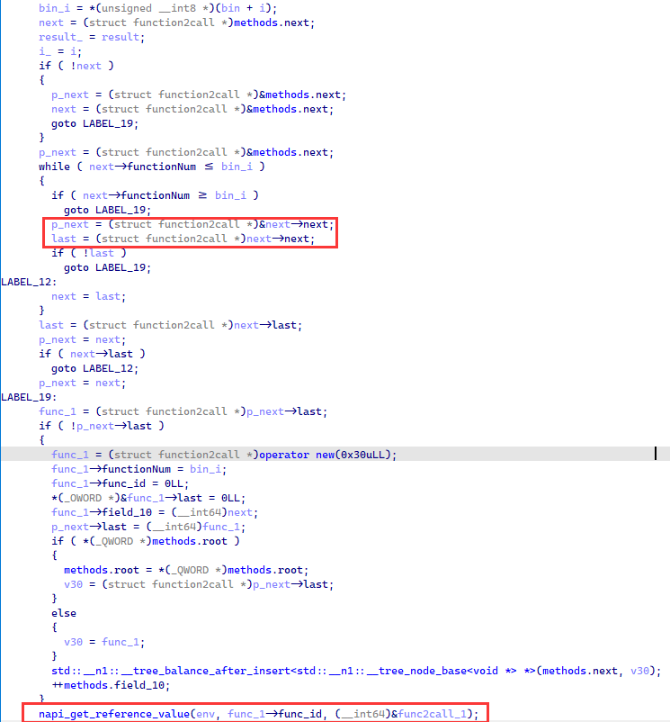

`bin[i+256]`也是同样的：

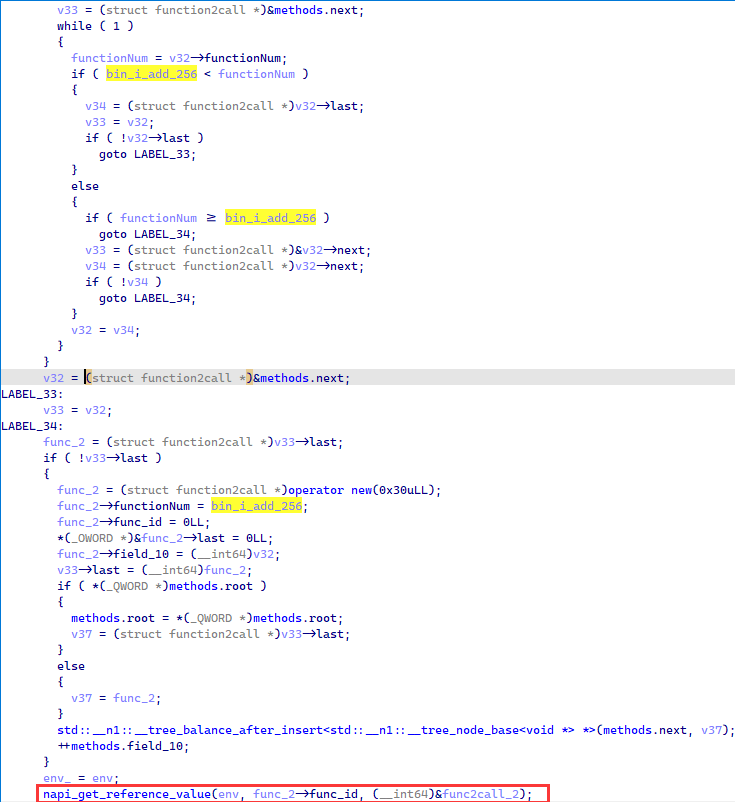

上面获取`bin[i]`和`bin[i+256]`对应的函数在后面调用。

然后根据op：bin_i_add_1来进行不同的操作。

看其中一个case：`bin[i+1] == 2`：

执行`bin[i]`的函数，参数为`bin[i+3]`，然后返回值需要为非零，否则爆`系统环境异常`

执行`bin[i] + 256`的函数，将返回值作为`key`。

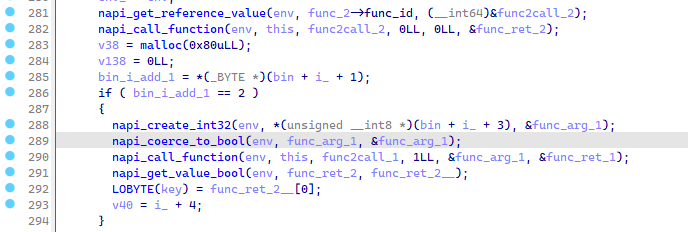

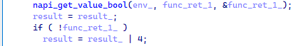

因此，想要不爆`系统环境异常`，则`bin[i]`的函数需要返回`true`。

看看注册的函数，是在上面的源码中注册的：

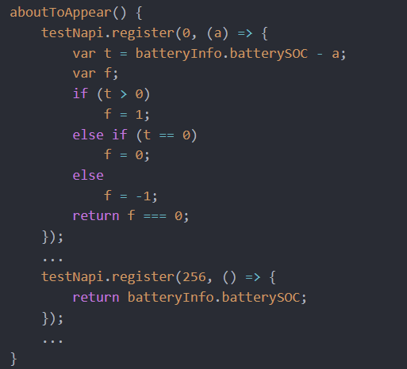

相差`256`的为一对，因此上面放出的两个函数是对应的。

发现如果`x+256`的函数的返回值作为参数调用`x`的函数，就会返回`true`。

爆`系统环境异常`肯定不是我们的问题，所以要让`check`正常运行，`bin[i]`的函数的参数为`bin[i+3]`一定等于`bin[i]+256`的函数的返回值。

因此`key`就为`bin[i+3]`。

case：`bin[i+1] == 0`情况相同。

case：`bin[i+1] == 1`的情况：

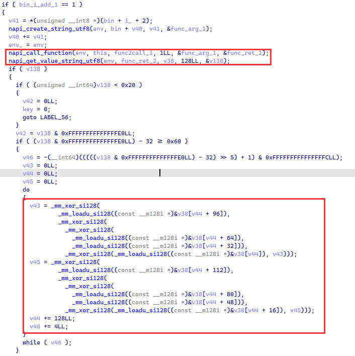

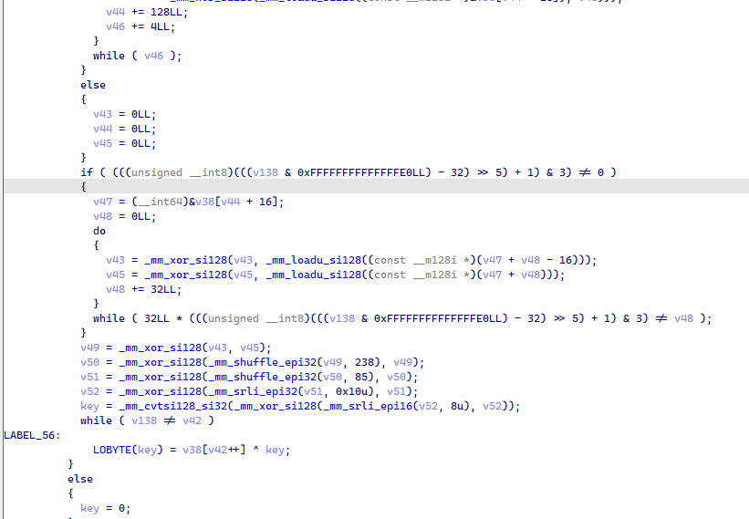

其获取的是`bin[i+3]`的字符串数据，并且`for i in range(len(key)): final_key = key[i] ^ final_key`。

之后便是一长串的操作，会根据key来操作flag的每一位。

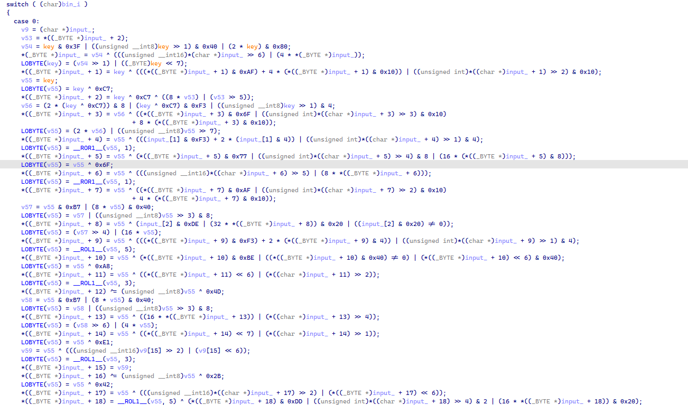

可逆，但是工作量确实有点大......

大致恢复前面一点的逻辑：

```C
temp = ((key >> 1) & 0x40) | ((key << 1) & 0x80) | (key & 0x3F)
flag[0] = temp ^ ((input[0] >> 6) | (input[0] << 2))
key = (temp >> 1) | (key << 7)
flag[1] = key ^ ((flag[1] & 0xAF) | ((flag[i] & 0x10) << 2) | ((flag[i] >> 2) & 0x10))
flag[2] = key ^ 0xC7 ^ ((flag[2] << 3) | (flag[2] >> 5))
temp = (((key ^ 0xC7) << 1) & 8) | (key ^ 0xC7) & 0xF3 | (key >> 1) & 4
```

像Ichild师傅总结的一样，差不多有以下几种逻辑：

> ```C++
> c = ror1(c, x) ^ k;
> c = swap_2_bit(c, m, n) ^ k
> c = c ^ y ^ k;
> ```


### 解题

加密的结果：（x64的so是没有这段的）

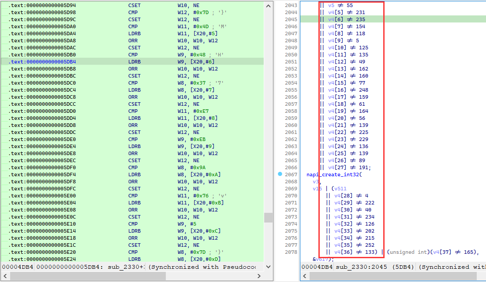

先获取`key`和`opcode`：

```python
def get_key_op():
    with open('./babyharmony/resources/rawfile/bin', 'rb') as f:
        data = f.read()
    idx = 0
    key = []
    op = []
    while idx < len(data):
        op.append(data[idx])
        opcode = data[idx + 1]
        if opcode == 2 or opcode == 0:
            key.append(data[idx + 3])
            idx += 4
        elif opcode == 1:
            l = data[idx + 2]
            s = data[idx + 3: idx + 3 + l]
            t = 0
            for i in range(l):
                t ^= s[i]
            key.append(t)
            idx += 3 + l
        else:
            idx += 3
            key.append(0)
    return key, op
# key: [1, 100, 10, 0, 101, 1, 3, 50, 2]
# op: [3, 0, 4, 7, 5, 8, 1, 6, 2]
```

剩下那堆case的加密，要我去逆，我是真没耐心，还在Ichild师傅弄了出来，这里照搬一下，加上自己的注释和过程。

Ichild师傅的思路其实就是根据输入、输出，来确定使用的哪种方式加密。

利用[IchildYu/load-elf](https://github.com/IchildYu/load-elf)，来跑一次case的加密。

把下面这东西放到`load-elf`的`x64_main.c`中，中文注释是我自己为了理解加上的。

这里我用kali编译` gcc ./x64_main.c -o mylib -g -ldl -masm=intel -shared -fPIC`

使用so的时候，会问依赖相关的，我直接全no了。

```C
__asm__(
    // __round(array, key, entry)
    "__round:\n"
    "sub rsp, 0x10\n"
    "mov [rsp+0x8], rdi\n"  // arg1
    "mov r12, rsi\n"  // arg2
    "call rdx\n"  // arg3
    "add rsp, 0x10\n"
    "ret\n"
);

void __round(unsigned char* array, int key, void* entry);

extern int bf_round(int key, int offset, int index);
extern void setup();

static char* base;

void setup() {
    // SET_LOGE();
    const char* path = "./libentry.so";
    base = load_elf(path);
    *(base + 0x2a07) = 0xc3; // ret
}


unsigned char bit_length(unsigned char x) {
    if (x == 0) return 0;
    for (int i = 8; i > 0; i--) {
        if (x & (1 << (i - 1))) return i;
    }
}
#define XOR 0 // c ^ val0 ^ val1
#define ROT 1 // ror1(c, val0) ^ val1
#define SWP 2 // swapkeep(c, val0) ^ val1
#define MAKE_RET_VAL(type, val0, val1) (((type) << 16) | ((val0) << 8) | (val1))

int bf_round(int key, int offset, int index) {
    if (base == NULL) setup();
    unsigned char array[38];
    array[index] = 0;
    __round(array, key, base + offset);
    // 先输入0，进行加密一次，获取该字节的值
    unsigned char val1 = array[index];

    // 检测在这一轮、这一个input[i]的操作是否为XOR
    // 如果不为XOR，则会在存在输入x，加密x再异或val1不等于x
    // 由于存在换位操作，所以需要检查每一位的情况
    int flag = 0;
    for (int i = 0; i < 7; i++) {
        array[index] = 1 << i;
        __round(array, key, base + offset);
        array[index] ^= val1;
        if (array[index] != (1 << i)) {
            flag = 1;
            break;
        }
    }
    // 如果为XOR，则返回XOR的值
    if (flag == 0) {
        return MAKE_RET_VAL(XOR, 0, val1);
    }

    // 检测在这一轮、这一个input[i]的操作是否为 ror1(c, val0) ^ val1
    // 先输入1，进行加密一次再异或回来，从而获取val0
    array[index] = 1;
    __round(array, key, base + offset);
    array[index] ^= val1;
    unsigned char val0 = bit_length(array[index]);
    assert(val0 != 0);
    // 假设val0为6，
    // 1 >> 6 | x << 2 = 0b100
    // val0 求得的实际为 8 - val0
    // bit_length(array[index])会返回3，因为1 << 2占用3位
    // 因此val0需要减1
    val0--;
    if (val0 != 0) {
        assert(array[index] == (1 << val0));
        // 知道了val0，之后就和XOR类似了
        for (int i = 1; i < 7; i++) {
            array[index] = 1 << i;
            __round(array, key, base + offset);
            array[index] ^= val1;
            if (array[index] != (1 << ((i + val0) % 8))) {
                flag = 0;
                break;
            }
        }
        if (flag == 1) {
            return MAKE_RET_VAL(ROT, 8 - val0, val1);
        }
    }

    // 检测在这一轮、这一个input[i]的操作是否为 swapkeep(c, val0) ^ val1
    // 由于只有两位的位置对调
    // 所以只要检查出一位的位置变化，就可以推出n、m
    // 这里的返回值val0为 ~(1 << m | 1 << n)
    for (int i = 0; i < 7; i++) {
        array[index] = 1 << i;
        __round(array, key, base + offset);
        array[index] ^= val1;
        if (array[index] != (1 << i)) {
            assert(bit_length(array[index]));
            assert(array[index] == (1 << (bit_length(array[index]) - 1)));
            val0 = ~((1 << i) | array[index]);
            return MAKE_RET_VAL(SWP, val0, val1);
        }
    }
    assert(0);
}
```

通过调用这个lib的`bf_round`就可以知道在某一轮、flag某一个字节所做的变化。

再用Z3求解：

```Python
from z3 import *
import ctypes

def g(x, n):
    return (x >> n) & 1

def s(x, n):
    return (x & 1) << n

def swapbit(x, m, n):
    if m == n: return x
    return s(g(x, m), n) | s(g(x, n), m) | (x & ~(s(1, n) | s(1, m)))

def swapkeep(x, mask):
    swapbits = ~mask & 0xff
    m = swapbits.bit_length() - 1
    assert 0 <= m < 8
    swapbits ^= 1 << m
    n = swapbits.bit_length() - 1
    assert 0 <= n < 8
    swapbits ^= 1 << n
    assert swapbits == 0
    return swapbit(x, m, n)

def ror1(x, n):
    n &= 7
    if isinstance(x, int):
        x &= 0xff
        return (x >> n) | (x << (8 - n)) & 0xff
    else:
        return LShR(x, n) | (x << (8 - n)) & 0xff

def get_key_op():
    with open('./bin', 'rb') as f:
        data = f.read()
    idx = 0
    key = []
    op = []
    while idx < len(data):
        op.append(data[idx])
        opcode = data[idx + 1]
        if opcode == 2 or opcode == 0:
            key.append(data[idx + 3])
            idx += 4
        elif opcode == 1:
            l = data[idx + 2]
            s = data[idx + 3: idx + 3 + l]
            t = 0
            for i in range(l):
                t ^= s[i]
            key.append(t)
            idx += 3 + l
        else:
            idx += 3
            key.append(0)
    return key, op

# 不同case的起始地址
entries = [0x2efa, 0x42e9, 0x3428, 0x38fd, 0x2522, 0x480d, 0x4cc6, 0x3df6, 0x51df]
KEY, OP = get_key_op()
lib = ctypes.cdll.LoadLibrary('./mylib')
lib.setup()

def encrypt(array, KEY, OP):
    for key, op in zip(KEY, OP):
        for i in range(38):
            v = lib.bf_round(key, entries[op], i)
            type, val0, val1 = v >> 16, (v >> 8) & 0xff, v & 0xff
            if type == 0:
                assert val0 == 0
                array[i] ^= val1
            elif type == 1:
                array[i] = ror1(array[i], val0) ^ val1
            elif type == 2:
                array[i] = swapkeep(array[i], val0) ^ val1
            else:
                assert False, type

_array = [BitVec('x%d' % i, 8) for i in range(38)]
array = _array[:]
encrypt(array, KEY, OP)
result = [226, 125, 77, 72, 55, 231, 235, 154, 118, 5, 125, 135, 49, 162, 160, 77, 248, 159, 61, 164, 56, 139, 225, 229, 136, 139, 89, 191, 4, 222, 40, 234, 126, 202, 215, 252, 133, 165]
s = Solver()
for i in range(38):
    s.add(array[i] == result[i])
assert s.check() == sat
model = s.model()
flag = []
for i in _array:
    flag.append(model[i].as_long())

print(bytes(flag))
# flag{3da8767cfb9424b9bbcc09008e36642d}
```

## easy-wasm

ghidra看了一圈没看到加密函数在哪 /(ㄒoㄒ)/~~

[京麒CTF 2024 初赛 Writeup](https://mp.weixin.qq.com/s?__biz=MzkwMDY2ODc0MA==&mid=2247483739&idx=1&sn=7ac93b4a70279cb5644e9f3b0f68bceb&chksm=c041cd70f736446603f3532ea68608ee2d59ac5549e2e81ccc912a556288e2d7c7f6e8ae8e8b&mpshare=1&scene=23&srcid=0528J8Mbgmk9hLBBq0VDtNpF&sharer_shareinfo=8683ff4e14a69ef25ce3f69240e0c6e8&sharer_shareinfo_first=8683ff4e14a69ef25ce3f69240e0c6e8#rd)👈认识到了还可以在`window`找加密函数的

看了一圈只有 😘😘❤️😘😘 函数名全是表情。

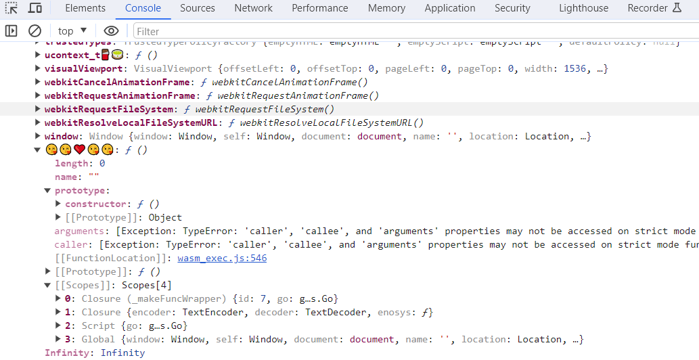

调用一下，也和hint说的一致，字节相关，16个字符一组，可以爆破。

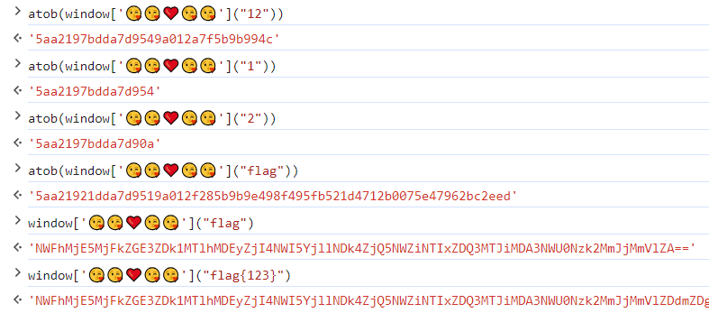

加密`flag`，根据这个密文去搜索，得到整个密文：

`NWFhMjE5MjFkZGE3ZDk1MTlhMDEyZjI4NWI5YjllNDk4ZjQ5NWZiNTIxZDQ3MTJiMDA3NWU0Nzk2MmJjMmVlZDdmZDg0MGNiYTJmMmFiNDg4NzVmZTczYTEyMmQ3YmM3MWE2ZWQ5OTBhMDc2MzE5NjJlNGFjZGUyNmFjYzJiMTEyM2NiNGQ0ZmVhMmE2MjExOWRmOTQwNjExMzk5YzA1ZmM2ZGRjMzcxZTFlODFiNjQ4NDIzZWYyYjRhZDVhMzg0NWI3ZjM3NmUwMDY3Y2QyNzExNmZiYjdkZmNlMDBjOWFhZDI1ODM1NmIwMGE3YTFlNGNhNjBjZTVkNDc1Mzg5OWJjMzFhOTE1MWQ3ZDc5ZTVlZmNhZGZlM2Q1YjZiMTFhOTYyOTE3NTM4OTg3Y2NjZDY1MTZiZTZjNGY5YTI0ZTBjMjhhYjRiNThiYzRjY2JmYmFmOGUzZjVlYjc5OWRjY2E1YmZkYmM3OTQzYWViNGQ2OWFkNDlmMTczZjE4N2QyNmFhZTE0ZGE1MTkwMTg3MWQxNWVhMGNiNzhlY2JiNjY=`

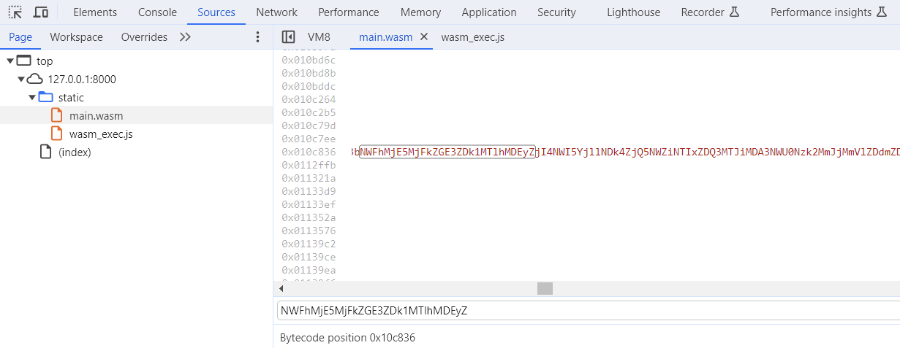

照抄脚本，得到flag：

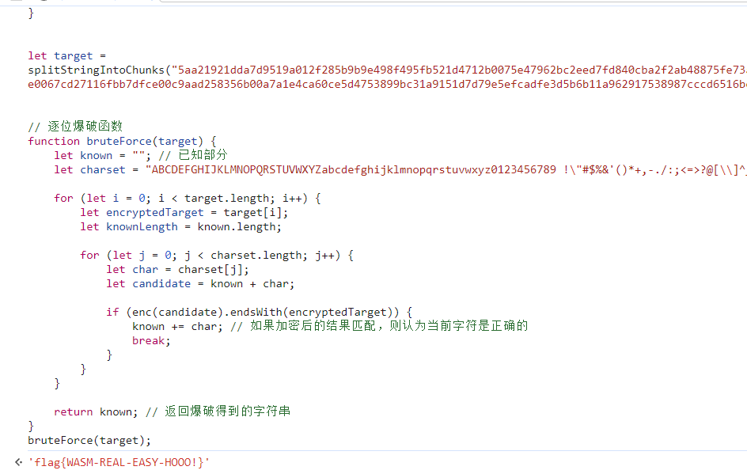

## hot soup

[YSRKEN/HSP-Decompiler](https://github.com/YSRKEN/HSP-Decompiler)👈使用这个工具获取`start.ax`

拖进去就好，看不懂日文，私密马赛

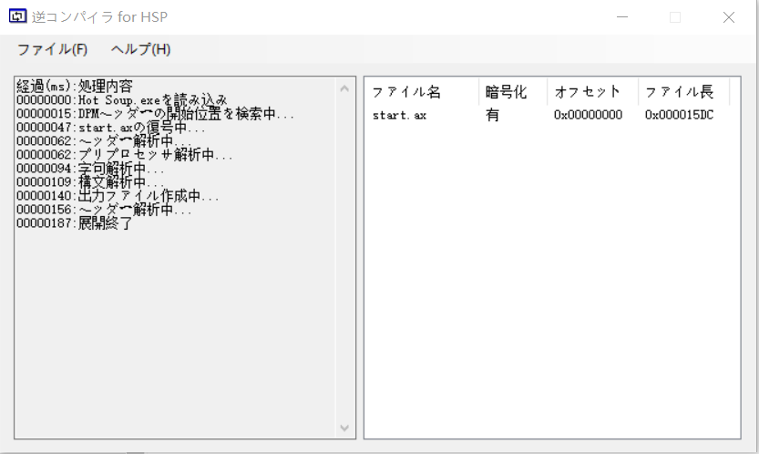

得到`start.ax`再拖进去，得到`start.hsp`

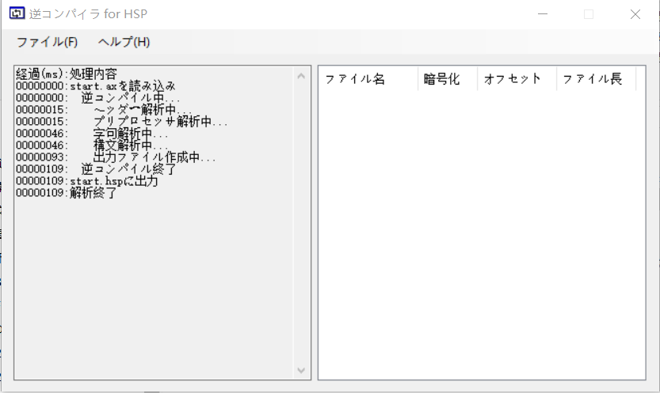

以上得到源码，就可以分析了。

反编译的代码缺少了导入的函数，在start.ax可以看到导入的函数，但对应不上。

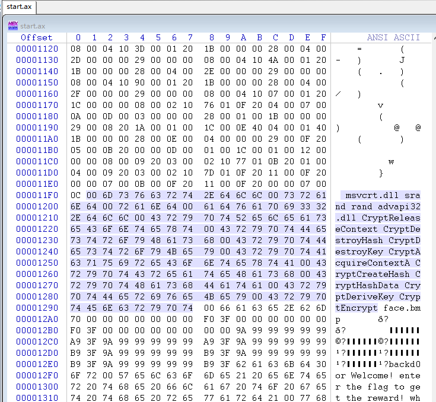

字符串一个个按顺序对应的上。

调用的函数一个个按顺序对应下来倒是也能对应的上。

```C
#uselib "msvcrt.dll"

#uselib "advapi32.dll"

	screen 0, 640, 480, 0
	celload "face.bmp"
	var_0 = stat
	celdiv var_0, 64, 64, 32, 32
	var_1 = 320
	var_2 = 240
	var_3 = 1.0
	var_4 = 1.0
	var_5 = 0.0
*label_0
	redraw 0
	color 0, 0, 64
	boxf
	gmode 2
	pos var_1, var_2
	celput var_0, 0, var_3, var_4, var_5
	color 255, 255, 255
	pos 140, 0
	redraw 1
	await 20x

    // 检查键盘上的方向键状态, 控制图像的旋转
	stick var_6, 15
	if ( var_6 & 1 ) {
		var_5 = var_5 + 0.05
	}
	if ( var_6 & 4 ) {
		var_5 = var_5 - 0.05
	}
	if ( var_6 & 2 ) {
		var_3 = var_3 + 0.1
		var_4 = var_4 + 0.1
	}
	if ( var_6 & 8 ) {
		var_3 = var_3 - 0.1
		var_4 = var_4 - 0.1
	}
    
    // 获取正在运行程序的命名行参数
	var_7 = dirinfo(4)
	var_7 = strtrim(var_7, 0, 32)
	if ( var_7 == "backd0or" ) {
        // 验证flag
		gosub *label_1
	}
	else {
		goto *label_0
	}
*label_1
	mes "Welcome! enter the flag to get the reward!"
	var_8 = "where"
	pos 140, 400
	color 255, 255, 255
	objsize 180, 25

    // 获取用户输入
	input var_8, 374
	button "valid", *label_2
	stop
*label_2
	pos 0, 40
	color 255, 255, 255
	var_9 = str(var_8)
	var_10 = strlen(var_9)

    // flag长度51
	if ( var_10 != 51 ) {
		dialog "wrong:"
		stop
	}

    // 创建 flag{ 字符串
	var_11 = ""
	poke var_11, 0, 102
	poke var_11, 1, 108
	poke var_11, 2, 97
	poke var_11, 3, 103
	poke var_11, 4, 123
	dim var_12, var_13, var_14
	var_15 = 1
	var_16 = 0

    // 验证是否以 flag{ 开头
	repeat 5
		var_12 = peek(var_11, cnt)
		var_13 = peek(var_9, cnt)
		if ( var_12 != var_13 ) {
			var_15 = 0
		}
	loop
	if ( var_15 == 0 ) {
		dialog "wrong:"
		stop
	}

    // 验证是否以 } 结尾
	var_12 = peek(var_9, var_10 - 1)
	if ( var_12 != 125 ) {
		var_15 = 0
	}
	if ( var_15 == 0 ) {
		dialog "wrong:"
		stop
	}


	// /*09 20 004E*/ 1934746
	var_17(0) = ginfo(16)
	var_17(1) = ginfo(17)
	var_17(2) = ginfo(18)
	// /*09 20 004E*/ 8269266
	var_17(3) = 72
	var_17(4) = ginfo(16)
	var_17(5) = ginfo(17)
	var_17(6) = ginfo(18)
	// /*09 20 004E*/ 10419062
	var_17(7) = ginfo(17)
	var_17(8) = ginfo(18)
	var_17(9) = ginfo(16)
	var_17(10) = 238
	var_17(11) = 142
	var_17(12) = 141
	var_17(13) = 188
	var_17(14) = 82
	// /*09 20 004E*/ 15350255
	var_17(15) = ginfo(16)
	var_17(16) = ginfo(18)
	var_17(17) = ginfo(17)
	var_17(18) = 62
	var_17(19) = 184
	var_17(20) = 224
	var_17(21) = 129
	var_17(22) = 8
	// /*09 20 004E*/ 10105471
	var_17(23) = 79
	var_17(24) = 73
	var_17(25) = 164
	var_17(26) = 185
	var_17(27) = 72
	var_17(28) = 209
	var_17(29) = 161
	var_17(30) = 50
	var_17(31) = ginfo(18)
	var_17(32) = 87
	var_17(33) = 219
	var_17(34) = ginfo(17)
	var_17(35) = 207
	var_17(36) = ginfo(16)
	var_17(37) = 190
	var_17(38) = 71
	var_17(39) = 101
	var_17(40) = 76
	var_17(41) = 156
	var_17(42) = 130
	var_17(43) = ginfo(18)
	var_17(44) = 165
	color 255, 255, 255
	sdim var_18, 1024
	memset var_18, 0, 1024
	memcpy var_18, var_9, var_10 - 6, 0, 5
	var_19 = strlen(var_18)

    
    // var_17 与 var_18 异或
	repeat strlen(var_18)
		var_12 = peek(var_18, cnt)
		poke var_18, cnt, peek(var_18, cnt) ^ var_17(cnt)
	loop

    // 创建了一个大小为32的字符串数组
	sdim var_20, 32

    // srand(2333333)
	 2333333

	repeat 32
    // poke var_20, cnt, rand() & 255
		poke var_20, cnt, () & 255
	loop

	var_21 = "Microsoft Enhanced RSA and AES Cryptographic Provider"
	dim var_22, var_23, var_24

    // CryptAcquireContextA
	var_15 = (var_22, var_25, var_21, 24, -268435456)
	if ( var_15 == 0 ) {
		 var_22, 0
		end
	}
    // CryptCreateHash
	var_15 = (var_22, 32780, var_25, var_25, var_23)
	if ( var_15 == 0 ) {
		 var_22, 0
		end
	}
    // CryptHashData
	var_15 = (var_23, var_20, strlen(var_20), 0)
	if ( var_15 == 0 ) {
		 var_22, 0
		end
	}
    // CryptDeriveKey
	var_15 = (var_22, 26126, var_23, 0, var_24)
	if ( var_15 == 0 ) {
		 var_22, 0
		end
	}
	var_26 = 1
    // CryptEncrypt
	var_15 = (var_24, var_25, var_26, 0, var_18, var_19, 1024)
	if ( var_15 == 0 ) {
		 var_22, 0
		end
	}
    // CryptDestroyHash
    // CryptReleaseContext
    // CryptDestroyKey
	 var_23
	 var_24
	 var_22, 0
    
	poke var_18, var_19, 0
	var_27(0) = 170
	var_27(1) = 171
	var_27(2) = 238
	var_27(3) = 146
	var_27(4) = 108
	var_27(5) = 213
	var_27(6) = 219
	var_27(7) = 252
	var_27(8) = 124
	var_27(9) = 214
	var_27(10) = 109
	var_27(11) = 121
	var_27(12) = 137
	var_27(13) = 14
	var_27(14) = 215
	var_27(15) = 200
	var_27(16) = 6
	var_27(17) = 43
	var_27(18) = 199
	var_27(19) = 235
	var_27(20) = 37
	var_27(21) = 127
	var_27(22) = 36
	var_27(23) = 26
	var_27(24) = 26
	var_27(25) = 8
	var_27(26) = 64
	var_27(27) = 90
	var_27(28) = 135
	var_27(29) = 71
	var_27(30) = 236
	var_27(31) = 42
	var_27(32) = 30
	var_27(33) = 3
	var_27(34) = 226
	var_27(35) = 241
	var_27(36) = 42
	var_27(37) = 141
	var_27(38) = 217
	var_27(39) = 58
	var_27(40) = 190
	var_27(41) = 54
	var_27(42) = 192
	var_27(43) = 21
	var_27(44) = 61
	var_27(45) = 74
	var_27(46) = 144
	var_27(47) = 7
	var_28 = ""
	repeat length(var_27)
		poke var_28, cnt, var_27(cnt)
	loop
	if ( var_28 == var_18 ) {
		dialog "win:D"
	}
	else {
		dialog "0ops:("
	}
	stop
```

异或的数据有几个为ginfo，但好像用前面的就行。

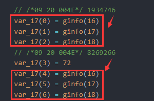

逆完就可以写脚本了。

```C
#include <windows.h>  
#include <wincrypt.h>  
#include <stdio.h> 

int main() {
    unsigned char result[48] = {
        170, 171, 238, 146, 108, 213, 219, 252, 124, 214, 
        109, 121, 137, 14, 215, 200, 6, 43, 199, 235, 
        37, 127, 36, 26, 26, 8, 64, 90, 135, 71, 
        236, 42, 30, 3, 226, 241, 42, 141, 217, 58, 
        190, 54, 192, 21, 61, 74, 144, 7
    };
    unsigned char xor_data[48] = {
        29, 133, 154, 72, 126, 45, 210, 251, 118, 158, 
        238, 142, 141, 188, 82, 234, 239, 57, 62, 184, 
        224, 129, 8, 79, 73, 164, 185, 72, 209, 161, 
        50, 127, 87, 219, 50, 207, 154, 190, 71, 101, 
        76, 156, 130, 127, 165
    };
    unsigned char key[32] = {0};
    srand(2333333);
    for (int i = 0; i < 32; i++) {
        key[i] = rand() % 256;
    }
    HCRYPTPROV hProv = 0;
    HCRYPTHASH hHash = 0;
    HCRYPTKEY hKey = 0;
    DWORD dwDataLen = 48;
    CryptAcquireContext(
        &hProv, NULL, 
        "Microsoft Enhanced RSA and AES Cryptographic Provider", 
        24, -268435456
    );
    CryptCreateHash(hProv, 32780, 0, 0, &hHash);
    CryptHashData(hHash, key, 32, 0);
    CryptDeriveKey(hProv, 26126, hHash, 0, &hKey);
    CryptDecrypt(hKey, 0, 1, 0, result, &dwDataLen);

    for (int i = 0; i < 48; i++) {
        result[i] ^= xor_data[i];
    }

    for (int i = 0; i < 48; i++) {
        printf("%c", result[i]);
    }
    // aMaZ1nG_C4Rd_G4M3_Bu1ld_bY_H0t_s0uP_PrOc3sS0rJ
    // flag{aMaZ1nG_C4Rd_G4M3_Bu1ld_bY_H0t_s0uP_PrOc3sS0r}
}
```

## possible-door

虽然看图标知道大概率是什么框架下的产物，但见识少，还是不知道是Tauri。

[Tauri 框架的静态资源提取方法探究](https://blog.yllhwa.com/2023/05/09/Tauri 框架的静态资源提取方法探究/)👈根据这个获取`index.html`和`index-C9fLaX_M.js`

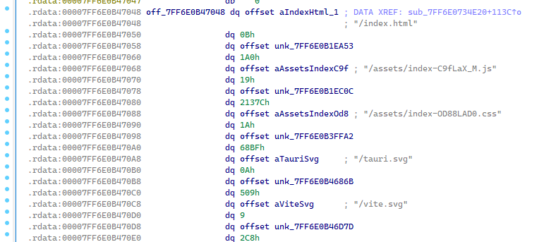
