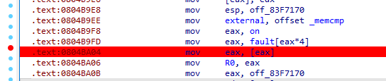

# tuling_complete

movfuscator混淆

系统调用通过`mov eax, [eax]`来实现，一般情况下，`eax`不为`0`，为`0`的时候就是他要触发异常，调用系统调用了。

比如一下就是调用`strlen`：

```assembly
.text:08049E32 mov     external, offset _strlen
.text:08049E3C mov     eax, on
.text:08049E41 mov     eax, fault[eax*4]
.text:08049E48 mov     eax, [eax]
.text:08049E4A mov     R0, eax
```

通过调试，找到这里为结果比较：



且其基本为单字符加密，但位置不同结果不一样，且只加密前11个字符。

直接开始爆破，但Linux环境下，我没环境，且该死的断网。

直接手动输入常见字符，进行换表，来爆破。

```python
result = [0x52, 0x06, 0xFA, 0xDE, 0x5A, 0xDE, 0x59, 0x02, 0x4A, 0x90, 0xD9, 0x5F, 0x63, 0x30, 0x6D, 0x70, 0x31, 0x6C, 0x45, 0x44, 0x42, 0x79, 0x5F, 0x6D, 0x6F, 0x76, 0x66, 0x75, 0x73, 0x63, 0x61, 0x74, 0x6F, 0x72, 0x5F, 0x4F, 0x68, 0x6E, 0x6F, 0x7D]

A = [117, 43, 218, 248, 96, 235, 80, 114, 120, 224, 235]
B =[118, 40, 217, 251, 99, 232, 83, 113, 123, 227, 232]
C =[119, 41, 216, 250, 98, 233, 82, 112, 122, 226, 233]
D =[112, 46, 223, 253, 101, 238, 85, 119, 125, 229, 238]
E =[113, 47, 222, 252, 100, 239, 84, 118, 124, 228, 239]
F =[114, 44, 221, 255, 103, 236, 87, 117, 127, 231, 236]
G =[115, 45, 220, 254, 102, 237, 86, 116, 126, 230, 237]
H =[124, 34, 211, 241, 105, 226, 89, 123, 113, 233, 226]
I =[125, 35, 210, 240, 104, 227, 88, 122, 112, 232, 227]
J =[126, 32, 209, 243, 107, 224, 91, 121, 115, 235, 224]
K =[127, 33, 208, 242, 106, 225, 90, 120, 114, 234, 225]
L =[120, 38, 215, 245, 109, 230, 93, 127, 117, 237, 230]
M =[121, 39, 214, 244, 108, 231, 92, 126, 116, 236, 231]
N =[122, 36, 213, 247, 111, 228, 95, 125, 119, 239, 228]
O =[123, 37, 212, 246, 110, 229, 94, 124, 118, 238, 229]
P =[100, 58, 203, 233, 113, 250, 65, 99, 105, 241, 250]
Q =[101, 59, 202, 232, 112, 251, 64, 98, 104, 240, 251]
R =[102, 56, 201, 235, 115, 248, 67, 97, 107, 243, 248]
S =[103, 57, 200, 234, 114, 249, 66, 96, 106, 242, 249]
T =[96, 62, 207, 237, 117, 254, 69, 103, 109, 245, 254]
U =[97, 63, 206, 236, 116, 255, 68, 102, 108, 244, 255]
V =[98, 60, 205, 239, 119, 252, 71, 101, 111, 247, 252]
W =[99, 61, 204, 238, 118, 253, 70, 100, 110, 246, 253]
X =[108, 50, 195, 225, 121, 242, 73, 107, 97, 249, 242]
Y =[109, 51, 194, 224, 120, 243, 72, 106, 96, 248, 243]
Z =[110, 48, 193, 227, 123, 240, 75, 105, 99, 251, 240]

a = [85, 11, 250, 216, 64, 203, 112, 82, 88, 192, 203]
b = [86, 8, 249, 219, 67, 200, 115, 81, 91, 195, 200]
c = [87, 9, 248, 218, 66, 201, 114, 80, 90, 194, 201]
d = [80, 14, 255, 221, 69, 206, 117, 87, 93, 197, 206]
e = [81, 15, 254, 220, 68, 207, 116, 86, 92, 196, 207]
f = [82, 12, 253, 223, 71, 204, 119, 85, 95, 199, 204]
g = [83, 13, 252, 222, 70, 205, 118, 84, 94, 198, 205]
h = [92, 2, 243, 209, 73, 194, 121, 91, 81, 201, 194]
i = [93, 3, 242, 208, 72, 195, 120, 90, 80, 200, 195]
j = [94, 0, 241, 211, 75, 192, 123, 89, 83, 203, 192]
k = [95, 1, 240, 210, 74, 193, 122, 88, 82, 202, 193]
l = [88, 6, 247, 213, 77, 198, 125, 95, 85, 205, 198]
m = [89, 7, 246, 212, 76, 199, 124, 94, 84, 204, 199]
n = [90, 4, 245, 215, 79, 196, 127, 93, 87, 207, 196]
o = [91, 5, 244, 214, 78, 197, 126, 92, 86, 206, 197]
p = [68, 26, 235, 201, 81, 218, 97, 67, 73, 209, 218]
q = [69, 27, 234, 200, 80, 219, 96, 66, 72, 208, 219]
r = [70, 24, 233, 203, 83, 216, 99, 65, 75, 211, 216]
s = [71, 25, 232, 202, 82, 217, 98, 64, 74, 210, 217]
t = [64, 30, 239, 205, 85, 222, 101, 71, 77, 213, 222]
u = [65, 31, 238, 204, 84, 223, 100, 70, 76, 212, 223]
v = [66, 28, 237, 207, 87, 220, 103, 69, 79, 215, 220]
w = [67, 29, 236, 206, 86, 221, 102, 68, 78, 214, 221]
x = [76, 18, 227, 193, 89, 210, 105, 75, 65, 217, 210]
y = [77, 19, 226, 192, 88, 211, 104, 74, 64, 216, 211]
z = [78, 16, 225, 195, 91, 208, 107, 73, 67, 219, 208]

n0 = [4, 90, 171, 137, 17, 154, 33, 3, 9, 145, 154]
n1 = [5, 91, 170, 136, 16, 155, 32, 2, 8, 144, 155]
n2 = [6, 88, 169, 139, 19, 152, 35, 1, 11, 147, 152]
n3 = [7, 89, 168, 138, 18, 153, 34, 0, 10, 146, 153]
n4 = [0, 94, 175, 141, 21, 158, 37, 7, 13, 149, 158]
n5 = [1, 95, 174, 140, 20, 159, 36, 6, 12, 148, 159]
n6 = [2, 92, 173, 143, 23, 156, 39, 5, 15, 151, 156]
n7 = [3, 93, 172, 142, 22, 157, 38, 4, 14, 150, 157]
n8 = [12, 82, 163, 129, 25, 146, 41, 11, 1, 153, 146]
n9 = [13, 83, 162, 128, 24, 147, 40, 10, 0, 152, 147]

flag = [0] * 11
for idx in range(11):
    for ch in range(ord('a'), ord('z') + 1):
        if result[idx] == eval(chr(ch))[idx]:
            flag[idx] = ch
            print(f"find {idx}:{ch}")
            break
    
    for ch in range(ord('A'), ord('Z') + 1):
        if result[idx] == eval(chr(ch))[idx]:
            flag[idx] = ch
            print(f"find {idx}:{ch}")
            break
    
    for ch in range(ord('0'), ord('9') + 1):
        if result[idx] == eval('n' + chr(ch))[idx]:
            flag[idx] = ch
            print(f"find {idx}:{ch}")
            break
flag[4] = ord('{')
flag += result[11:]
print(bytes(flag))
```

