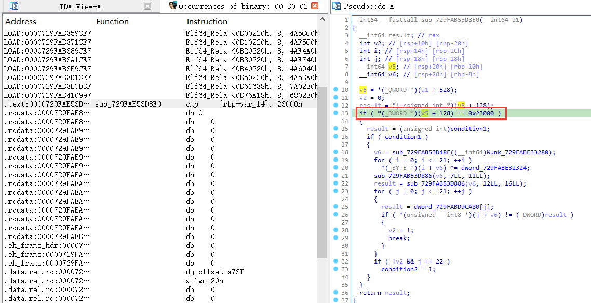
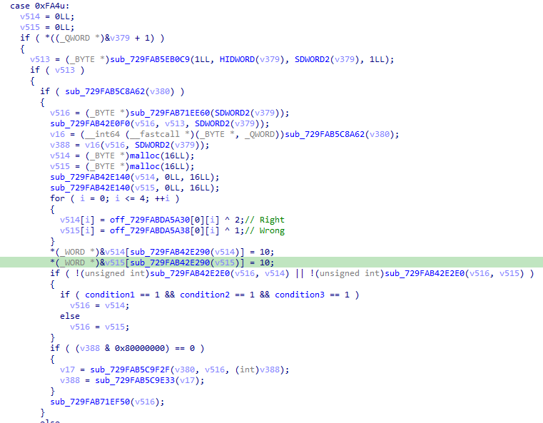
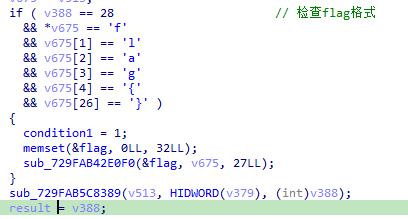
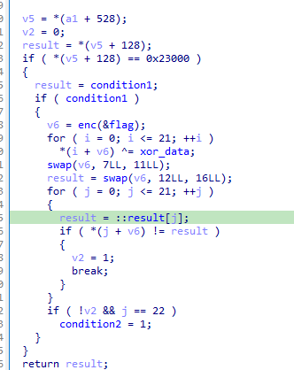
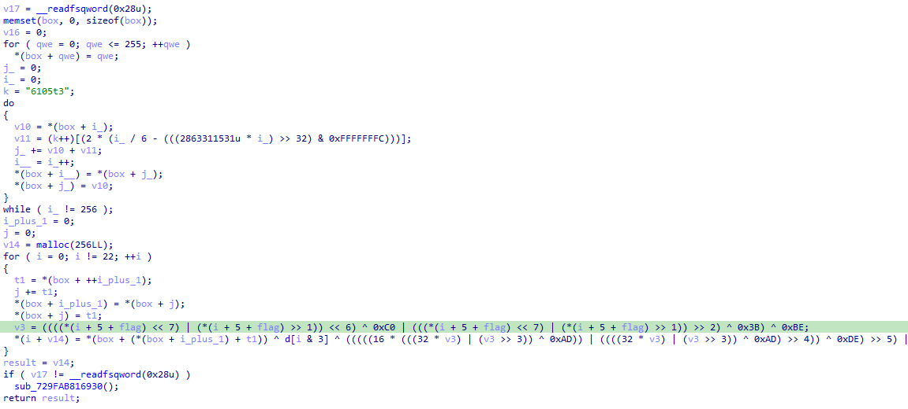
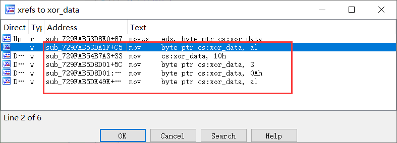
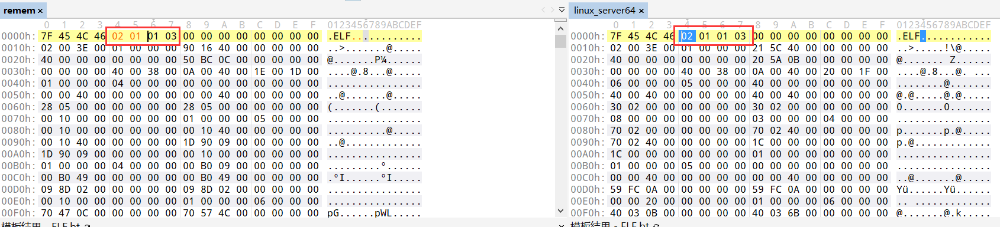

# snake

第一天这题绷不住，第二天才把附件改了

逻辑简单，只是个贪吃蛇，但不增加长度。

根据每次按键更改opcode

```C
hConsoleInput = GetStdHandle(0xFFFFFFF6);
if ( PeekConsoleInputW(hConsoleInput, &Buffer, 1u, NumberOfEventsRead) )
{
    if ( NumberOfEventsRead[0] )
    {
        ReadConsoleInputW(hConsoleInput, &Buffer, 1u, NumberOfEventsRead);
        if ( Buffer.Event.KeyEvent.wVirtualKeyCode != dirCode )
        {
            wVirtualKeyCode = Buffer.Event.KeyEvent.wVirtualKeyCode;
            if ( Buffer.Event.KeyEvent.wVirtualKeyCode == 37 )// left
            {
                ++stepNum;
                dirCode = 37;
                direction = 3;
                for ( j = 0; j < 1152; ++j )
                    *((_BYTE *)opcode + j) = ((int)*((unsigned __int8 *)opcode + j) >> 5) | (8 * *((_BYTE *)opcode + j));
            }
            else
            {
                switch ( wVirtualKeyCode )
                {
                    case 38:                            // up
                        ++stepNum;
                        direction = 0;
                        dirCode = 38;
                        j_memcpy(v7, opcode, 0x480ui64);
                        for ( k = 0; k < 1152; ++k )
                            *((_BYTE *)opcode + k) = v7[(k + 6) % 1152];
                        break;
                    case 39:                            // right
                        ++stepNum;
                        dirCode = 39;
                        direction = 2;
                        for ( m = 0; m < 1152; ++m )
                            *((_BYTE *)opcode + m) -= 102;
                        break;
                    case 40:                            // down
                        ++stepNum;
                        dirCode = 40;
                        direction = 1;
                        for ( n = 0; n < 1152; ++n )
                            *((_BYTE *)opcode + n) += 30;
                        break;
                }
            }
        }
    }
}
```

吃到果子会检验opcode的md5值：

```c
if ( position == fruit )
{
    ++score;
    ++Block->snakeLen;
    v7 = opcode;
    md5((__int64)opcode, 1152i64, (__int64)Buf2);
    if ( !j_memcmp(&unk_14001F480, Buf2, 0x10ui64) )
    {
        v8 = opcode;
        if ( (unsigned __int8)((__int64 (__fastcall *)(char *))opcode)(nickname) )
        {
            printf("Game Over!\n");
            exit(1);
        }
    }
    do
    {
        fruit.left_right = rand() % 20;
        fruit.up_down = rand() % 20;
    }
    while ( fruit == position );
}
```

写个脚本来获取opcode：

```python
from tqdm import tqdm
import hashlib

with open('./data', 'rb') as f:
    data = f.read()

data = list(data)
result = [
    0x9C, 0x06, 0xC0, 0x8F, 0x88, 0x2D, 0x79, 0x81, 
    0xE9, 0x1D, 0x66, 0x33, 0x64, 0xCE, 0x5E, 0x2E
]
print(len(data))
with open('./random_numbers.txt', 'rb') as f:
    randNum = list(eval(f.read().decode()))
dirr = {0: 'left', 1: 'right', 2: 'up', 3: 'down'}
fruitX = randNum[0]
fruitY = randNum[1]
randIdx = 2
x = 10
y = 10
limit = 20
nowdir = 1

def check(d):
    d = hashlib.md5(bytes(d)).digest()
    if list(d) == result:
        # print(list(d))
        return True
    return False

def left(d):
    d = d[6:] + d[:6]
    return d

def right(d):
    for i in range(len(d)):
        d[i] = (d[i] + 30) & 0xff
    return d

def down(d):
    for i in range(len(d)):
        d[i] = ((d[i] >> 5) | (d[i] << 3))& 0xff
    return d

def up(d):
    for i in range(len(d)):
        d[i] = (d[i] - 102) & 0xff
    return d

def noChange(d):
    return d

def getDirection(xx, yy, dir):
    if xx < fruitX and dir == 1:
        xx = fruitX
        return xx, yy, dir, noChange
    if xx > fruitX and dir == 0:
        xx = fruitX
        return xx, yy, dir, noChange
    if yy < fruitY and dir == 3:
        yy = fruitY
        return xx, yy, dir, noChange
    if yy > fruitY and dir == 2:
        yy = fruitY
        return xx, yy, dir, noChange
    if xx < fruitX and yy < fruitY:
        if dir == 0:
            yy = fruitY
            dir = 3
            return xx, yy, dir, down
        elif dir == 2:
            xx = fruitX
            dir = 1
            return xx, yy, dir, right
    if xx < fruitX and yy > fruitY:
        if dir == 0:
            yy = fruitY
            dir = 2
            return xx, yy, dir, up
        elif dir == 3:
            xx = fruitX
            dir = 1
            return xx, yy, dir, right
    if xx > fruitX and yy < fruitY:
        if dir == 1:
            yy = fruitY
            dir = 3
            return xx, yy, dir, down
        elif dir == 2:
            xx = fruitX
            dir = 0
            return xx, yy, dir, left
    if xx > fruitX and yy > fruitY:
        if dir == 1:
            yy = fruitY
            dir = 2
            return xx, yy, dir, up
        elif dir == 3:
            xx = fruitX
            dir = 0
            return xx, yy, dir, left
    if xx == fruitX and yy < fruitY:
        if dir == 2:
            if xx + 1< limit:
                return xx + 1, yy, 1, right
            else:
                return xx - 1, yy, 0, left
        else:
            return xx, fruitY, 3, down
    if xx == fruitX and yy > fruitY:
        if dir == 3:
            if xx + 1 < limit:
                return xx + 1, yy, 1, right
            else:
                return xx - 1, yy, 0, left
        else:
            return xx, fruitY, 2, up
    if yy == fruitY and xx < fruitX:
        if dir == 0:
            if yy + 1 < limit:
                return xx, yy + 1, 3, down
            else:
                return xx, yy - 1, 2, up
        else:
            return fruitX, yy, 1, right
    if yy == fruitY and xx > fruitX:
        if dir == 1:
            if yy + 1 < limit:
                return xx, yy + 1, 3, down
            else:
                return xx, yy - 1, 2, up
        else:
            return fruitX, yy, 0, left
    assert False, "error"

score = 0
while True:
    # print(f"snake: ({x},{y})  fruit: ({fruitX},{fruitY})", end=" -> ")
    x, y, nowdir, change = getDirection(x, y, nowdir)
    # print(f"snake: ({x},{y}) dir: {dirr[nowdir]} {change.__name__}")
    data = change(data)
    if x == fruitX and y == fruitY:
        score += 1
        print('score:', score)
        fruitX = randNum[randIdx]
        fruitY = randNum[randIdx+1]
        randIdx += 2
        if check(data):
            with open('./new_data', 'wb') as f:
                f.write(bytes(data))
            import base64
            print(base64.b64encode(bytes(data)).decode())
            print('success', len(data))
            break

```

发现是个简单的加密：

```c
num = 0;
delta = 0x9E3779B9;
qmemcpy(key, "W31c0m3. 2 QWBs8", 16);
ch0 = *a1;
ch1 = a1[1];
ch2 = a1[2];
ch3 = a1[3];
for ( i_ = 0; i_ < 0x20; ++i_ )
{
    ch0 += (key[num & 3] + num) ^ (ch1 + ((ch1 >> 5) ^ (16 * ch1)));
    num += delta;
    ch1 += (key[(num >> 11) & 3] + num) ^ (ch0 + ((ch0 >> 5) ^ (16 * ch0)));
}
for ( k = 0; k < 0x20; ++k )
{
    ch2 += (key[num & 3] + num) ^ (ch3 + ((ch3 >> 5) ^ (16 * ch3)));
    num += delta;
    ch3 += (key[(num >> 11) & 3] + num) ^ (ch2 + ((ch2 >> 5) ^ (16 * ch2)));
}
ch0 ^= ch2;
ch1 ^= ch3;
ch3 ^= ch0;
ch2 ^= ch1;
v14[0] = 0x98;
v14[1] = 0xA0;
v14[2] = 0xD9;
v14[3] = 0x98;
v14[4] = 0xBA;
v14[5] = 0x97;
v14[6] = 0x1B;
v14[7] = 0x71;
v14[8] = 0x9B;
v14[9] = 0x81;
v14[10] = 0x44;
v14[11] = 0x2F;
v14[12] = 0x55;
v14[13] = 0xB8;
v14[14] = 0x37;
v14[15] = 0xDF;
for ( m = 0; m < 16; ++m )
{
    if ( *((char *)&ch0 + m) != v14[m] )
        return 0;
}
```

写个脚本解：

```python

v14 = [0] * 16
v14[0] = 0x98
v14[1] = 0xA0
v14[2] = 0xD9
v14[3] = 0x98
v14[4] = 0xBA
v14[5] = 0x97
v14[6] = 0x1B
v14[7] = 0x71
v14[8] = 0x9B
v14[9] = 0x81
v14[10] = 0x44
v14[11] = 0x2F
v14[12] = 0x55
v14[13] = 0xB8
v14[14] = 0x37
v14[15] = 0xDF

import struct 

r = list(struct.unpack('4I', bytes(v14)))
k = list(struct.unpack('4I', b"W31c0m3. 2 QWBs8"))
r[2] ^= r[1]
r[3] ^= r[0]
r[1] ^= r[3]
r[0] ^= r[2]

delta = 0x9E3779B9
num = delta * 64
num &= 0xffffffff
for i in range(32):
    r[3] -= (k[(num >> 11) & 3] + num) ^ (r[2] + ((r[2] >> 5) ^ (r[2] << 4)))
    r[3] &= 0xffffffff
    num -= delta
    num &= 0xffffffff
    r[2] -= (k[num & 3] + num) ^ (r[3] + ((r[3] >> 5) ^ (r[3] << 4)))
    r[2] &= 0xffffffff

for i in range(32):
    r[1] -= (k[(num >> 11) & 3] + num) ^ (r[0] + ((r[0] >> 5) ^ (r[0] << 4)))
    r[1] &= 0xffffffff
    num -= delta
    num &= 0xffffffff
    r[0] -= (k[num & 3] + num) ^ (r[1] + ((r[1] >> 5) ^ (r[1] << 4)))
    r[0] &= 0xffffffff
print(num)
print([hex(i) for i in r])
flag = struct.pack('4I', *r)
print(flag)
```

# bbox

一个推箱子游戏

一共有八个图，每个图所有的箱子推到终点，就进入下一个图。

```c
for ( z = 0; (int)z <= 8; ++z )
{
    init(z);
    while ( 1 )
    {
        system("cls");
        if ( !fruit_per_z[z] )
            break;
        v5 = scanf("%c", &v4);
        if ( v4 == 'd' )
        {
            go_right(z);
        }
        else if ( v4 > 'd' )
        {
            if ( v4 == 's' )
            {
                go_down(z);
            }
            else if ( v4 == 'w' )
            {
                go_up(z);
            }
        }
        else if ( v4 == 'a' )
        {
            go_left(z);
        }
    }
    puts(&byte_40A068);
}
```

这是向右走的逻辑：

```c
if ( x_pos != 19 )                            // 边界，不能向右走
{
    next_x_pos = x_pos + 1;
    next_y_pos = y_pos;
    result = (unsigned int)maze[400 * z + 1 + 20 * y_pos + x_pos];// 要走的方格
    if ( (_DWORD)result != 5 )
    {
        result = (unsigned int)maze[400 * z + 20 * y_pos + next_x_pos];
        if ( (_DWORD)result != 1 )
        {
            if ( maze[400 * z + 20 * y_pos + next_x_pos] == 3 )// 如果下一步是箱子
            {
                result = (unsigned int)maze[400 * z + 2 + 20 * y_pos + x_pos];// 要走的方格的下一个方格
                if ( (_DWORD)result == 1 )
                    return result;
                if ( maze[400 * z + 2 + 20 * y_pos + x_pos] == 4 )// 检测下下步是否是箱子终点
                {
                    maze[400 * z + 2 + 20 * y_pos + x_pos] = 5;
                    maze[400 * z + 20 * next_y_pos + next_x_pos] = 0;
                    --fruit_per_z[z];
                }
                else
                {
                    maze[400 * z + 2 + 20 * y_pos + x_pos] = 3;
                }
            }
            maze[400 * z + 20 * y_pos + x_pos] = 0;
            maze[400 * z + 20 * next_y_pos + next_x_pos] = 2;
            result = next_x_pos;
            x_pos = next_x_pos;
        }
    }
}
```

直接获取地图自己走一遍：

```python
with open('maze', 'rb') as f:
    maze = f.read()
import struct
maze = list(struct.unpack(f'{5600}I', maze))
# 推箱子
data = {
    2: "2", # 起点, 我
    3: "3", # 箱子
    4: "4", # 终点
    0: ".", # 路
    1: "X", # 墙
    5: "5", # 箱子被推到终点就不能动了
}
def printMaze(m):
    for i in range(20):
        for j in range(20):
            print(data[m[i * 20 + j]], end='')
        print()
    print('-' * 20)


def go(z):
    ma = maze[z * 400: z * 400 + 400]
    boxNum = 0
    for i in range(400):
        if ma[i] == 2:
            y, x = i // 20, i % 20
        if ma[i] == 3:
            boxNum += 1
    moves = ""
    while boxNum != 0:
        printMaze(ma)
        print("now: ", x, y)
        steps = input()
        # print(step)
        for move in steps:
            print(f"{x},{y} your move: {move}")
            if move == 'w' and y > 0 and ma[(y - 1) * 20 + x] == 0:
                moves += move
                ma[y * 20 + x] = 0
                y -= 1
                ma[y * 20 + x] = 2
                continue
            if move == 's' and y < 19 and ma[(y + 1) * 20 + x] == 0:
                moves += move
                ma[y * 20 + x] = 0
                y += 1
                ma[y * 20 + x] = 2
                continue
            if move == 'a' and x > 0 and ma[y * 20 + x - 1] == 0:
                moves += move
                ma[y * 20 + x] = 0
                x -= 1
                ma[y * 20 + x] = 2
                continue
            if move == 'd' and x < 19 and ma[y * 20 + x + 1] == 0:
                moves += move
                ma[y * 20 + x] = 0
                x += 1
                ma[y * 20 + x] = 2
                continue
            if move == 'w' and y > 0 and ma[(y - 1) * 20 + x] == 3:
                if y > 1 and (ma[(y - 2) * 20 + x] == 0 or ma[(y - 2) * 20 + x] == 4):
                    moves += move
                    ma[y * 20 + x] = 0
                    y -= 1
                    ma[y * 20 + x] = 2
                    if ma[(y - 1) * 20 + x] == 4:
                        boxNum -= 1
                    ma[(y - 1) * 20 + x] = 3
                    continue
            if move == 's' and y < 19 and ma[(y + 1) * 20 + x] == 3:
                if y < 18 and (ma[(y + 2) * 20 + x] == 0 or ma[(y + 2) * 20 + x] == 4):
                    moves += move
                    ma[y * 20 + x] = 0
                    y += 1
                    ma[y * 20 + x] = 2
                    if ma[(y + 1) * 20 + x] == 4:
                        boxNum -= 1
                    ma[(y + 1) * 20 + x] = 3
                    continue
            if move == 'a' and x > 0 and ma[y * 20 + x - 1] == 3:
                if x > 1 and (ma[y * 20 + x - 2] == 0 or ma[y * 20 + x - 2] == 4):
                    moves += move
                    ma[y * 20 + x] = 0
                    x -= 1
                    ma[y * 20 + x] = 2
                    if ma[y * 20 + x - 1] == 4:
                        boxNum -= 1
                    ma[y * 20 + x - 1] = 3
                    continue
            if move == 'd' and x < 19 and ma[y * 20 + x + 1] == 3:
                if x < 18 and (ma[y * 20 + x + 2] == 0 or ma[y * 20 + x + 2] == 4):
                    moves += move
                    ma[y * 20 + x] = 0
                    x += 1
                    ma[y * 20 + x] = 2
                    if ma[y * 20 + x + 1] == 4:
                        boxNum -= 1
                    ma[y * 20 + x + 1] = 3
                    continue
    print("You win: ", moves)
    return moves

go(9)
```

网上看到个算法走，抄一下：

```python

import numpy as np
from collections import deque
import struct

with open('maze', 'rb') as f:
    maze = f.read()
maze = list(struct.unpack(f'{5600}I', maze))
maps = np.array(maze).reshape(14, 20, 20)

direction = [
    (-1, 0, 'Up'),
    (1, 0, 'Down'),
    (0, -1, 'Left'),
    (0, 1, 'Right')
]

def find_pos(map):
    player_pos = np.where(map == 2)
    boxs_pos = np.where(map == 3)
    goals_pos = np.where(map == 4)
    return (
        (player_pos[0][0], player_pos[1][0]),
        set(zip(boxs_pos[0], boxs_pos[1])),
        set(zip(goals_pos[0], goals_pos[1]))
    )

def check(boxs_pos, goals_pos):
    return boxs_pos == goals_pos

def move(player_pos, boxs_pos, d, map):
    dx, dy, d_name= d
    x, y = player_pos
    new_x, new_y = x + dx, y + dy
    if not (0 <= new_x < 20 and 0 <= new_y < 20):
        return None
    if map[new_x][new_y] == 1:
        return None
    new_boxs_pos = set(boxs_pos)
    box_move = None
    if (new_x, new_y) in boxs_pos:
        new_box_x, new_box_y = new_x + dx, new_y + dy
        if not (0 <= new_box_x < 20 and 0 <= new_box_y < 20):
            return None
        if map[new_box_x][new_box_y] in (1, 3):
            return None
        if (new_box_x, new_box_y) in boxs_pos:
            return None
        new_boxs_pos.remove((new_x, new_y))
        new_boxs_pos.add((new_box_x, new_box_y))
        box_move = True    
    return d_name, (new_x, new_y), frozenset(new_boxs_pos), box_move


def solve(map):
    player_pos, boxs_pos, goals_pos = find_pos(map)
    queue = deque([(player_pos, boxs_pos, [], 0)])
    visited = set()
    visited.add((player_pos, frozenset(boxs_pos)))
    while queue:
        player_pos, boxs_pos, path, box_moves = queue.popleft()
        if check(boxs_pos, goals_pos):
            return path, box_moves
        for d in direction:
            result = move(player_pos, boxs_pos, d, map)
            if result:
                d_name, new_player_pos, new_boxs_pos, box_move = result
                new_boxs_move = box_moves + 1 if box_move else box_moves
                state = (new_player_pos, new_boxs_pos)
                if state not in visited:
                    visited.add(state)
                    queue.append((new_player_pos, new_boxs_pos, path + [d_name], new_boxs_move))
    return None, 0

m = ""
for i in range(9):
    path, box_moves = solve(maps[i])
    print(''.join(path), box_moves)
    m += str(box_moves)
print(m)
import hashlib
print(hashlib.md5(m.encode()).hexdigest())
```

# mips

分析mips_bin，有个假flag，没用。

一开始以为emu改了mips_bin中的code或比对结果，将mips_bin中的write输出code和比对结果，发现没变。

敏锐的pwn手发现在mips_bin输出时emu会有操作。


mips_bin的code是存在0x23000上的，在emu搜索0x23000，可以找到段代码，猜测为执行地址为0x2300时执行这个代码（此时参数为输入的flag）。



交叉引用condition1来到这：

有三个条件，如果都满足，就复制v516为Right字符串。



condition1检查flag格式：



condition2是加密检查flag：



enc函数需要去花指令



xor_data在很多地方被赋值：



第一个可以被排除，因为那里检测是否被调试才执行。

剩下三个，有16和3可以试试看，不行还可以解密后暴力xor看。

```c
__int64 __fastcall sub_729FAB53D48E(__int64 a1)
{
    memset(box, 0, sizeof(box));
    v16 = 0;
    for ( qwe = 0; qwe <= 255; ++qwe )
        *(box + qwe) = qwe;
    j = 0;
    i = 0;
    k = "6105t3";
    do
    {
        v10 = *(box + i);
        v11 = (k++)[(2 * (i / 6 - (((2863311531u * i) >> 32) & 0xFFFFFFFC)))];
        j += v10 + v11;
        i__ = i++;
        *(box + i__) = *(box + j);
        *(box + j) = v10;
    }
    while ( i != 256 );
    v7 = 0;
    v8 = 0;
    v14 = sub_729FAB7C6D90(256LL);
    for ( m = 0; m != 22; ++m )
    {
        v12 = *(box + ++v7);
        v8 += v12;
        *(box + v7) = *(box + v8);
        *(box + v8) = v12;
        v3 = ((((*(m + 5 + a1) << 7) | (*(m + 5 + a1) >> 1)) << 6) ^ 0xC0 | (((*(m + 5 + a1) << 7) | (*(m + 5 + a1) >> 1)) >> 2) ^ 0x3B) ^ 0xBE;
        *(m + v14) = *(box + (*(box + v7) + v12)) ^ byte_729FABD9CA60[m & 3] ^ (((((16 * (((32 * v3) | (v3 >> 3)) ^ 0xAD)) | ((((32 * v3) | (v3 >> 3)) ^ 0xAD) >> 4)) ^ 0xDE) >> 5) | (8 * (((16 * (((32 * v3) | (v3 >> 3)) ^ 0xAD)) | ((((32 * v3) | (v3 >> 3)) ^ 0xAD) >> 4)) ^ 0xDE)));
    }
    result = v14;
    if ( v17 != __readfsqword(0x28u) )
        sub_729FAB816930();
    return result;
}
```

脚本解flag

```python
box = list(range(257))
j = 0
k = [ord(i) for i in "6105t3"]
for i in range(256):
    temp = box[i]
    t2 = k[i % 6]
    j += temp + t2
    j &= 0xFF
    box[i], box[j] = box[j], box[i]


result = [
    0xC4, 0xEE, 0x3C, 0xBB, 0xE7, 0xFD, 0x67, 0x1D, 0xF8, 0x97, 0x68,
    0x9D, 0x0B, 0x7F, 0xC7, 0x80, 0xDF, 0xF9, 0x4B, 0xA0, 0x46, 0x91
]
result[7], result[11] = result[11], result[7]
result[12], result[16] = result[16], result[12]
result = [i ^ 0xA for i in result]

def enc(flag):
    c = [0] * 22
    d = [0xDE, 0xAD, 0xBE, 0xEF]
    j = 0
    for i in range(22):
        j += box[i + 1]
        j &= 0xFF
        box[i + 1], box[j] = box[j], box[i + 1]
        v3 = (flag[i] << 7) | (flag[i] >> 1)
        v3 &= 0xFF
        v3 = ((v3 << 6) ^ 0xC0 | (v3 >> 2) ^ 0x3B) ^ 0xBE
        v3 &= 0xFF
        v3 = ((v3 << 5) | (v3 >> 3)) ^ 0xAD
        v3 &= 0xFF
        v3 = ((v3 << 4) | (v3 >> 4)) ^ 0xDE
        v3 &= 0xFF
        v3 = ((v3 << 3) | (v3 >> 5))
        v3 &= 0xFF
        v3 ^= d[i & 3]
        v3 ^= box[(box[i + 1] + box[j]) & 0xFF] 
        c[i] = v3
    return c

def dec(c):
    p = [0] * 22
    d = [0xDE, 0xAD, 0xBE, 0xEF]
    j = 0
    for i in range(22):
        j += box[i + 1]
        j &= 0xFF
        box[i + 1], box[j] = box[j], box[i + 1]
        v3 = c[i]
        v3 ^= box[(box[i + 1] + box[j]) & 0xFF]
        v3 ^= d[i & 3]
        v3 = ((v3 << 5) | (v3 >> 3)) ^ 0xDE
        v3 &= 0xFF
        v3 = ((v3 << 4) | (v3 >> 4)) ^ 0xAD
        v3 &= 0xFF
        v3 = ((v3 << 3) | (v3 >> 5)) ^ 0xBE
        v3 &= 0xFF
        v3 = ((v3 ^ 0x3B) << 2) | ((v3 ^ 0xC0) >> 6)
        v3 &= 0xFF
        v3 = (v3 << 1) | (v3 >> 7)
        v3 &= 0xFF
        p[i] = v3
    return p

flag = dec(result)
print("".join([chr(i) for i in flag]))
# QeMu_r3v3rs3in9_h@ck6}

# z3也许
from z3 import *
s = Solver()
# 位数为8解不出来
flag = [BitVec(f"flag_{i}", 9) for i in range(22)]
r = enc(flag)
for i in range(22):
    s.add(r[i] == result[i])
if s.check() == sat:
    m = s.model()
    print("".join([chr(m[flag[i]].as_long()) for i in range(22)]))
else:
    print("unsat")
```

# remem

ubuntu可以直接执行，但file识别不出来。文件头被改了。

找个对比来修改：



然后看逻辑是个虚拟机。

switch来选择操作，但每个操作都是mmap出空间，写code，去执行，再unmap。

其还会使用opcode的数据在code中，但每个函数写下的指令的操作是固定的。

复制代码输出一下code：

```c
#include <stdio.h>
#include <stdlib.h>

char opcode[127] = {
    0xF2, 0x00, 0xF2, 0x03, 0xF7, 0xF2, 0x03, 0xF2, 0x03, 0xF7,
    0xF2, 0x03, 0xF7, 0xF2, 0x03, 0xF7, 0xF2, 0x00, 0xF2, 0x03,
    0xF7, 0xF2, 0x03, 0xF7, 0xF2, 0x03, 0xF7, 0xF2, 0x03, 0xF2,
    0x03, 0xF7, 0xF2, 0x00, 0xF2, 0x03, 0xF7, 0xF2, 0x03, 0xF7,
    0xF2, 0x03, 0xF2, 0x03, 0xF7, 0xF2, 0x00, 0xF2, 0x03, 0xF7,
    0xF2, 0x03, 0xF7, 0xF2, 0x00, 0xF2, 0x03, 0xF7, 0xF2, 0x03,
    0xF7, 0xF2, 0x00, 0xF2, 0x03, 0xF7, 0xF0, 0x00, 0x03, 0xF1,
    0x00, 0x03, 0xF6, 0x03, 0xF0, 0x00, 0x03, 0xF1, 0x00, 0x03,
    0xF6, 0x03, 0xF0, 0x00, 0x03, 0xF1, 0x00, 0x03, 0xF6, 0x03,
    0xF0, 0x00, 0x03, 0xF0, 0x00, 0x03, 0xF6, 0x03, 0xF0, 0x00,
    0x03, 0xF0, 0x00, 0x03, 0xF1, 0x00, 0x03, 0xF6, 0x03, 0xF7,
    0xF3, 0x00, 0x03, 0xF3, 0x00, 0x03, 0xF3, 0x00, 0x03, 0xF3,
    0x00, 0x03, 0xF3, 0x00, 0x03, 0xF8};

int rip = 66;

unsigned char *sub_401E75(unsigned char *a1, char a2)
{
    *a1++ = 0x48;
    *a1++ = a2 | 0x50;
    return a1;
}

unsigned char *sub_401B59(unsigned char *a1, char a2, char a3)
{
    *a1++ = 0x48;
    *a1++ = 0x89;
    *a1++ = a2 | (8 * a3) | 0xC0;
    return a1;
}

unsigned char *sub_401C4D(unsigned char *a1, char a2, unsigned __int64 a3)
{
    *a1++ = 0x48;
    if (a3 < 0x80000000)
    {
        *a1++ = 0xC7;
        *a1++ = a2 | 0xC0;
        *(unsigned int *)a1 = a3;
        a1 += 4;
    }
    else
    {
        *a1++ = a2 | 0xB8;
        *(unsigned long long *)a1 = a3;
        a1 += 8;
    }
    return a1;
}

unsigned char *sub_4018F7(unsigned char *a1, char a2, char a3)
{
    *a1++ = 0x48;
    *a1++ = 1;
    *a1++ = a2 | (a3 << 3) | 0xC0;
    return a1;
}

unsigned char *sub_401F66(unsigned char *a1)
{
    *a1++ = 0x48;
    *a1++ = 0xC9;
    *a1++ = 0x48;
    *a1++ = 0xC3;
    return a1;
}

long long sub_4021DC(long long opnum1, long long opnum2)
{
    unsigned char *v4 = (unsigned char *)malloc(0x100);
    unsigned char *p = v4;
    v4 = sub_401E75(v4, 5);
    v4 = sub_401B59(v4, 5, 4);
    v4 = sub_401C4D(v4, 0, opnum1);
    v4 = sub_401C4D(v4, 3, opnum2);
    v4 = sub_4018F7(v4, opcode[rip + 1], opcode[rip + 2]);
    v4 = sub_401F66(v4);
    for (int i = 0; i < 0x30; i++) {
        printf("%02X ", p[i]);
    }
    printf("\n");
    return 1ll;
}

int main() {
    long long opnum1 = 0x66;
    long long opnum2 = 0x99;
    sub_4021DC(opnum1, opnum2);
    return 0;
}
```

明显的add操作：

```assembly
push rbp
mov rbp, rsp
mov rax, 0x66
mov rbx, 0x99
add rax, rdx
leave
ret
```

其他类似。

```python
opcode = [
    0xF2, 0x00, 0xF2, 0x03, 0xF7, 0xF2, 0x03, 0xF2, 0x03, 0xF7,
    0xF2, 0x03, 0xF7, 0xF2, 0x03, 0xF7, 0xF2, 0x00, 0xF2, 0x03,
    0xF7, 0xF2, 0x03, 0xF7, 0xF2, 0x03, 0xF7, 0xF2, 0x03, 0xF2,
    0x03, 0xF7, 0xF2, 0x00, 0xF2, 0x03, 0xF7, 0xF2, 0x03, 0xF7,
    0xF2, 0x03, 0xF2, 0x03, 0xF7, 0xF2, 0x00, 0xF2, 0x03, 0xF7,
    0xF2, 0x03, 0xF7, 0xF2, 0x00, 0xF2, 0x03, 0xF7, 0xF2, 0x03,
    0xF7, 0xF2, 0x00, 0xF2, 0x03, 0xF7, 0xF0, 0x00, 0x03, 0xF1,
    0x00, 0x03, 0xF6, 0x03, 0xF0, 0x00, 0x03, 0xF1, 0x00, 0x03,
    0xF6, 0x03, 0xF0, 0x00, 0x03, 0xF1, 0x00, 0x03, 0xF6, 0x03,
    0xF0, 0x00, 0x03, 0xF0, 0x00, 0x03, 0xF6, 0x03, 0xF0, 0x00,
    0x03, 0xF0, 0x00, 0x03, 0xF1, 0x00, 0x03, 0xF6, 0x03, 0xF7,
    0xF3, 0x00, 0x03, 0xF3, 0x00, 0x03, 0xF3, 0x00, 0x03, 0xF3,
    0x00, 0x03, 0xF3, 0x00, 0x03, 0xF8
]
rip = 0
flag = b"11112222333344445555"
flag_int0 = int.from_bytes(flag[:4], "little")
flag_int1 = int.from_bytes(flag[4:8], "little")
flag_int2 = int.from_bytes(flag[8:12], "little")
flag_int3 = int.from_bytes(flag[12:16], "little")
flag_int4 = int.from_bytes(flag[16:], "little")
data1 = 0x5E2F4391
xor_data1 = [0x42DB9F06, 0x35368926, 0x509A3978, 0x1EBFA92F, 0x555CC98C]
xor_data1_idx = 0
xor_data2 = []
xor_data2_idx = -1
eax, ebp, ecx, esp = flag_int0, 1, 0, 0
stack = [0] * 256
stack[0] = flag_int0
stack[1] = flag_int0
stack[2] = flag_int1
stack[3] = flag_int1
stack[4] = flag_int0
stack[5] = flag_int1
stack[6] = flag_int0
stack[7] = flag_int0
stack[8] = flag_int2
stack[9] = flag_int2
stack[10] = flag_int3
stack[11] = flag_int2
stack[12] = flag_int3
stack[13] = flag_int3
stack[14] = flag_int4
stack[15] = flag_int4
stack[16] = 0
stack[17] = 0
mul_queue = [0] * 19
mul_queue_idx = 0
mul_queue[0] = 3
mul_queue[1] = flag_int1
mul_queue[2] = 6
mul_queue[3] = 82
mul_queue[4] = 6
mul_queue[5] = 2
mul_queue[6] = 13
mul_queue[7] = 17
mul_queue[8] = flag_int2
mul_queue[9] = 5
mul_queue[10] = 5
mul_queue[11] = 88
mul_queue[12] = flag_int2
mul_queue[13] = 4
mul_queue[14] = 5
mul_queue[15] = 232
mul_queue[16] = 35
mul_queue[17] = 8
mul_queue[18] = 16

while True:
    match opcode[rip]:
        case 0xF0:
            print(f"add: {hex(stack[(esp - 2) + 18])} + {hex(stack[(esp - 1) + 18])} = ", end="")
            stack[(esp - 2) + 18] = (stack[(esp - 2) + 18] + stack[(esp - 1) + 18]) & 0xFFFFFFFFFFFFFFFF
            print(f"{hex(stack[(esp - 2) + 18])}")
            esp -= 1
            rip += 3
        case 0xF1:
            print(f"sub: {hex(stack[(esp - 2) + 18])} - {hex(stack[(esp - 1) + 18])} = ", end="")
            stack[(esp - 2) + 18] = (stack[(esp - 2) + 18] - stack[(esp - 1) + 18]) & 0xFFFFFFFFFFFFFFFF
            print(f"{hex(stack[(esp - 2) + 18])}")
            esp -= 1
            rip += 3
        case 0xF2:
            if opcode[rip + 1]:
                mul_num = mul_queue[mul_queue_idx]
                print(f"mul_queue: {hex(eax)} * {hex(mul_num)} = ", end="")
                mul_queue_idx += 1
            else:
                print(f"mul: {hex(eax)} * {hex(eax)} = ", end="")
                mul_num = eax
            eax *= eax
            eax &= 0xFFFFFFFFFFFFFFFF
            print(f"{hex(eax)}")
            rip += 2
        case 0xF3:
            print(f"xor: {hex(eax)} ^ ", end="")
            print(f"xor_data2[{xor_data2_idx}]:{hex(xor_data2[xor_data2_idx])} ^ ", end="")
            print(f"{hex(xor_data1[xor_data1_idx])} = ", end="")
            eax = eax ^ xor_data2[xor_data2_idx] ^ xor_data1[xor_data1_idx]
            print(f"{hex(eax)}")
            xor_data1_idx += 1
            xor_data2_idx -= 1
            rip += 3
        case 0xF5:
            print(f"and: {hex(stack[(esp - 1) + 18])} & {hex(stack[(esp - 2) + 18])} = ", end="")
            eax = stack[(esp - 1) + 18] & stack[(esp - 2) + 18]
            print(f"{hex(eax)}")
            esp -= 2
            rip += 3
        case 0xF6:
            print(f"xor_data2 append {hex(stack[(esp - 1) + 18])} % {hex(data1)} = ", end="")
            xor_data2.append(stack[(esp - 1) + 18] % data1)
            print(f"{hex(xor_data2[-1])} -> len: {len(xor_data2)}")
            esp -= 1
            xor_data2_idx += 1
            rip += 2
        case 0xF7:
            print(f"push eax: {hex(eax)}")
            stack[esp + 18] = eax
            esp += 1
            eax = stack[ebp]
            print(f"pop stack[{hex(ebp)}] = {hex(eax)} = eax")
            ebp += 1
            rip += 1
        case 0xF8:
            if eax:
                print("fail")
            else:
                print("success")
            exit()
        case _:
            continue
```

得到逻辑如下：

```python
flag = b"11112222333344445555"
flag_int0 = int.from_bytes(flag[:4], "little")
flag_int1 = int.from_bytes(flag[4:8], "little")
flag_int2 = int.from_bytes(flag[8:12], "little")
flag_int3 = int.from_bytes(flag[12:16], "little")
flag_int4 = int.from_bytes(flag[16:], "little")
xor_data1 = [0x42DB9F06, 0x35368926, 0x509A3978, 0x1EBFA92F, 0x555CC98C]
mod = 0x5e2f4391

# mul: 0x34343434 * 0x34343434 = 0xaa53fda5fc52a90
# mul_queue: 0xaa53fda5fc52a90 * 0x23 = 0x68334ab168b39100
# push eax: 0x68334ab168b39100
# pop stack[0xe] = 0x35353535 = eax
# mul_queue: 0x35353535 * 0x8 = 0xb0f13170500fcf9
# push eax: 0xb0f13170500fcf9
# pop stack[0xf] = 0x35353535 = eax
# mul: 0x35353535 * 0x35353535 = 0xb0f13170500fcf9
# mul_queue: 0xb0f13170500fcf9 * 0x10 = 0x170174a0b3fb2a31
# push eax: 0x170174a0b3fb2a31
# pop stack[0x10] = 0x0 = eax
# add: 0xb0f13170500fcf9 + 0x170174a0b3fb2a31 = 0x221087b7b8fc272a
# sub: 0x68334ab168b39100 - 0x221087b7b8fc272a = 0x4622c2f9afb769d6
# xor_data2 append 0x4622c2f9afb769d6 % 0x5e2f4391 = 0x88fa13a -> len: 1
result4 = (flag_int3 * flag_int3 * 0x23) & 0xFFFFFFFFFFFFFFFF
result4 = result4 - (flag_int4 * flag_int4 * 0x10 + flag_int4 * 0x8) & 0xFFFFFFFFFFFFFFFF
result4 &= 0xFFFFFFFFFFFFFFFF
result4 %= mod


# pop stack[0xa] = 0x34343434 = eax
# mul_queue: 0x34343434 * 0x33333333 = 0xaa53fda5fc52a90
# mul_queue: 0xaa53fda5fc52a90 * 0x4 = 0x68334ab168b39100
# push eax: 0x68334ab168b39100
# pop stack[0xb] = 0x33333333 = eax
# mul: 0x33333333 * 0x33333333 = 0xa3d70a3c28f5c29
# mul_queue: 0xa3d70a3c28f5c29 * 0x5 = 0xe69ad42c3afb7e91
# push eax: 0xe69ad42c3afb7e91
# pop stack[0xc] = 0x34343434 = eax
# mul_queue: 0x34343434 * 0xe8 = 0xaa53fda5fc52a90
# push eax: 0xaa53fda5fc52a90
# add: 0xe69ad42c3afb7e91 + 0xaa53fda5fc52a90 = 0xf14014069ac0a921
# sub: 0x68334ab168b39100 - 0xf14014069ac0a921 = 0x76f336aacdf2e7df
# xor_data2 append 0x76f336aacdf2e7df % 0x5e2f4391 = 0x134f64b -> len: 2
result3 = (flag_int3 * flag_int2 * 0x4) & 0xFFFFFFFFFFFFFFFF
result3 = result3 - (flag_int2 * flag_int2 * 0x5 + flag_int3 * 0xe8) & 0xFFFFFFFFFFFFFFFF
result3 &= 0xFFFFFFFFFFFFFFFF
result3 %= mod

# pop stack[0x7] = 0x31313131 = eax
# mul_queue: 0x31313131 * 0x33333333 = 0x973de48a035cb61
# mul_queue: 0x973de48a035cb61 * 0x5 = 0x5a67ec1717bcfac1
# push eax: 0x5a67ec1717bcfac1
# pop stack[0x8] = 0x33333333 = eax
# mul: 0x33333333 * 0x33333333 = 0xa3d70a3c28f5c29
# mul_queue: 0xa3d70a3c28f5c29 * 0x5 = 0xe69ad42c3afb7e91
# push eax: 0xe69ad42c3afb7e91
# pop stack[0x9] = 0x33333333 = eax
# mul_queue: 0x33333333 * 0x58 = 0xa3d70a3c28f5c29
# push eax: 0xa3d70a3c28f5c29
# add: 0xe69ad42c3afb7e91 + 0xa3d70a3c28f5c29 = 0xf0d844cffd8adaba
# sub: 0x5a67ec1717bcfac1 - 0xf0d844cffd8adaba = 0x698fa7471a322007
# xor_data2 append 0x698fa7471a322007 % 0x5e2f4391 = 0x2548910e -> len: 3
result2 = (flag_int0 * flag_int2 * 0x5) & 0xFFFFFFFFFFFFFFFF
result2 = result2 - (flag_int2 * flag_int2 * 0x5 + flag_int2 * 0x58) & 0xFFFFFFFFFFFFFFFF
result2 &= 0xFFFFFFFFFFFFFFFF
result2 %= mod

# pop stack[0x4] = 0x31313131 = eax
# mul: 0x31313131 * 0x31313131 = 0x973de48a035cb61
# mul_queue: 0x973de48a035cb61 * 0x2 = 0x5a67ec1717bcfac1
# push eax: 0x5a67ec1717bcfac1
# pop stack[0x5] = 0x32323232 = eax
# mul_queue: 0x32323232 * 0xd = 0x9d7a5732d5f91c4
# push eax: 0x9d7a5732d5f91c4
# pop stack[0x6] = 0x31313131 = eax
# mul_queue: 0x31313131 * 0x11 = 0x973de48a035cb61
# push eax: 0x973de48a035cb61
# add: 0x9d7a5732d5f91c4 + 0x973de48a035cb61 = 0x134b83bbcd955d25
# add: 0x5a67ec1717bcfac1 + 0x134b83bbcd955d25 = 0x6db36fd2e55257e6
# xor_data2 append 0x6db36fd2e55257e6 % 0x5e2f4391 = 0x3ab932f7 -> len: 4
result1 = (flag_int0 * flag_int1 * 2 + flag_int1 * 0xd + flag_int0 * 0x11) & 0xFFFFFFFFFFFFFFFF
result1 %= mod

# mul: 0x31313131 * 0x31313131 = 0x973de48a035cb61
# mul_queue: 0x973de48a035cb61 * 0x3 = 0x5a67ec1717bcfac1
# push eax: 0x5a67ec1717bcfac1
# pop stack[0x1] = 0x31313131 = eax
# mul_queue: 0x31313131 * 0x32323232 = 0x973de48a035cb61
# mul_queue: 0x973de48a035cb61 * 0x6 = 0x5a67ec1717bcfac1
# push eax: 0x5a67ec1717bcfac1
# pop stack[0x2] = 0x32323232 = eax
# mul_queue: 0x32323232 * 0x52 = 0x9d7a5732d5f91c4
# push eax: 0x9d7a5732d5f91c4
# pop stack[0x3] = 0x32323232 = eax
# mul_queue: 0x32323232 * 0x6 = 0x9d7a5732d5f91c4
# push eax: 0x9d7a5732d5f91c4
# add: 0x9d7a5732d5f91c4 + 0x9d7a5732d5f91c4 = 0x13af4ae65abf2388
# add: 0x5a67ec1717bcfac1 + 0x13af4ae65abf2388 = 0x6e1736fd727c1e49
# sub: 0x5a67ec1717bcfac1 - 0x6e1736fd727c1e49 = 0xec50b519a540dc78
# xor_data2 append 0xec50b519a540dc78 % 0x5e2f4391 = 0x2987b7b1 -> len: 5
result0 = (flag_int0 * flag_int0 * 3) & 0xFFFFFFFFFFFFFFFF
result0 = result0 - (flag_int0 * flag_int1 * 6) & 0xFFFFFFFFFFFFFFFF
result0 = result0 - (flag_int1 * 6) & 0xFFFFFFFFFFFFFFFF
result0 = result0 - (flag_int1 * 0x52) & 0xFFFFFFFFFFFFFFFF
result0 &= 0xFFFFFFFFFFFFFFFF
result0 %= mod

# push eax: 0x0
# pop stack[0x11] = 0x0 = eax
# xor: 0x0 ^ xor_data2[4]:0x2987b7b1 ^ 0x42db9f06 = 0x6b5c28b7
# xor: 0x6b5c28b7 ^ xor_data2[3]:0x3ab932f7 ^ 0x35368926 = 0x64d39366
# xor: 0x64d39366 ^ xor_data2[2]:0x2548910e ^ 0x509a3978 = 0x11013b10
# xor: 0x11013b10 ^ xor_data2[1]:0x134f64b ^ 0x1ebfa92f = 0xe8a6474
# xor: 0xe8a6474 ^ xor_data2[0]:0x88fa13a ^ 0x555cc98c = 0x53590cc2
# fail

# (f[0] * f[0] * 3 - f[0] * f[1] * 6 - f[1] * 6 - f[1] * 0x52) % 0x5e2f4391 = 0x42DB9F06
# (f[1] * f[0] * 2 + f[1] * 0xd + f[0] * 0x11) % 0x5e2f4391 = 0x35368926
# (f[0] * f[2] * 5 - (f[2] * f[2] * 5 + f[2] * 0x58)) % 0x5e2f4391 = 0x509A3978
# (f[3] * f[2] * 4 - (f[2] * f[2] * 5 + f[3] * 0xe8)) % 0x5e2f4391 = 0x1EBFA92F
# (f[3] * f[3] * 0x23 - (f[4] * f[4] * 16 + f[4] * 8)) % 0x5e2f4391 = 0x555CC98C
```

z3解不出来。

抄一下exp👉[2024强网杯 初赛 N0wayBack战队 Writeup](https://mp.weixin.qq.com/s/NNfJZd6qOfotRi_AvWgISw)

```python
from sage.all import *
from Crypto.Util.number import *

p = 0x5E2F4391
R = PolynomialRing(GF(p), 'x', 5)
a = R.gens()

f1 = (a[1] * 6) + (a[1] * 0x52) + (a[0] * a[1] * 6) - (a[0] * a[0] * 3) - 0x42DB9F06
f2 = (a[0] * 0x11) + (a[1] * 0xd) + (a[0] * a[0] * 2) - 0x35368926
f3 = (a[2] * a[2] * 5) + (a[2] * 0x58) - (a[0] * a[2] * 5) - 0x509A3978
f4 = (a[2] * a[2] * 5) + (a[3] * 0xe8) - (a[3] * a[2] * 4) - 0x1EBFA92F
f5 = (a[4] * 8) + (a[4] * a[4] * 0x10) - (a[3] * a[3] * 35) - 0x555CC98C

# 由f1、f2解方程
g = f2.sylvester_matrix(f1, a[1]).det().univariate_polynomial()
ans = g.roots()
print(f'x0: {ans}')
x0 = ans[0][0]
# 在f1中代入x0 求解x1
g = f2(x0, *a[1:]).univariate_polynomial()
ans = g.roots()
print(f'x1: {ans}')
x1 = ans[0][0]
# 在f3中代入x0、x1 求解x2
g = f3(x0, x1, *a[2:]).univariate_polynomial()
ans = g.roots()
print(f'x2: {ans}')
x2 = ans[0][0]
# 在f4中代入x0、x1、x2 求解x3
g = f4(x0, x1, x2, *a[3:]).univariate_polynomial()
ans = g.roots()
print(f'x3: {ans}')
x3 = ans[0][0]
# 在f5中代入x0、x1、x2、x3 求解x4
g = f5(x0, x1, x2, x3, *a[4:]).univariate_polynomial()
ans = g.roots()
print(f'x4: {ans}')
x4 = ans[1][0]

flag = [x0, x1, x2, x3, x4]
flag = [int(i) for i in flag]
final_flag = ""
# 结果 flag = x + k * p
for x in flag:
    for k in range(2):
        print(x+k*p, long_to_bytes(x + k*p))
        try:
            if long_to_bytes(x + k*p).decode().isprintable():
                final_flag += long_to_bytes(x + k*p).decode()
        except:
            pass
print(final_flag)
```

