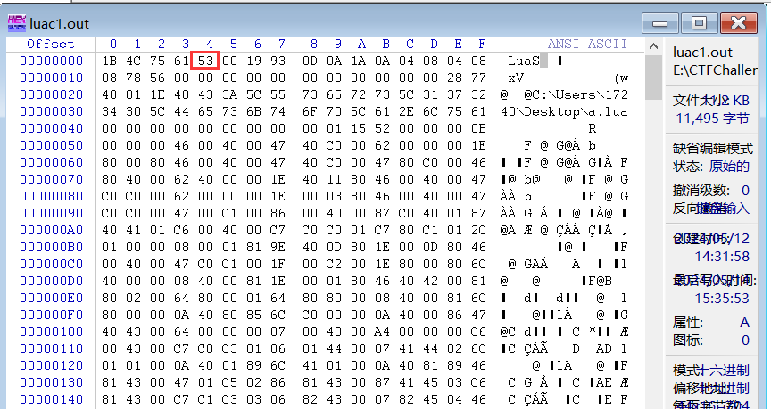
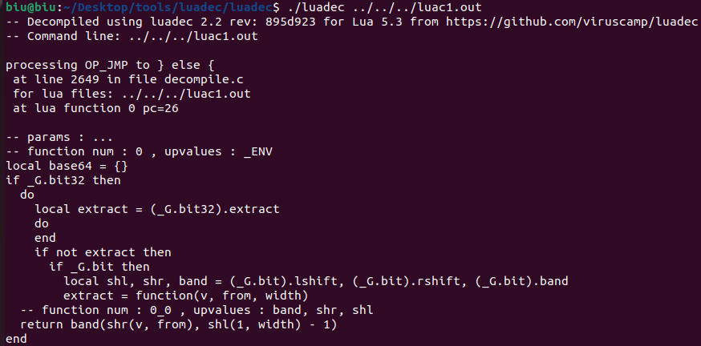

## 喝个茶

很明显的XXTEA：

```C
v40 = 0;
key = xmmword_402010;
v34 = 0x8B9AA58AF2186DF1LL;
s2 = xmmword_402020;
src = input;
v26 = input;
v25 = printf("Please enter your flag:");
v24 = fgets(input, 1000, 0LL);
input[strcspn(input, (const char *)(unsigned int)"\n")] = 0;
input_len = strlen(v26);
...
    v12 = strncpy(dest, &v23[v29], 8uLL);
xxtea_encrypt(dest, 2LL, &key);
s1[v29 >> 2] = *(_DWORD *)dest;
s1[(v29 >> 2) + 1] = v38;
s1[(v29 >> 2) + 2] = key;
s1[(v29 >> 2) + 3] = DWORD1(key);
s1[(v29 >> 2) + 4] = DWORD2(key);
s1[(v29 >> 2) + 5] = HIDWORD(key);
...
    v4 = memcmp(s1, &s2, 0x18uLL) == 0;
v5 = v11;
if ( v4 )
    v5 = v10;
v28 = v5;
v20 = v5;
v19 = v5 + 1849114241;
v18 = v5 + 382345136;
v17 = v5 - 915389114;
while ( 1 )
{
    v16 = v20 - 1176617340;
    if ( v20 == 1176617340 )
    {
        v6 = printf("Corret!\n");
        v28 = 1925268009;
        v9[3] = v6;
        goto LABEL_21;
    }
    ...
}
...


__int64 __fastcall xxtea_encrypt(_DWORD *a1, unsigned int value_2, __int64 key)
{
    int v5; // ecx
    int v6; // ecx
    unsigned int v7; // [rsp+24h] [rbp-34h]
    unsigned int i; // [rsp+28h] [rbp-30h]
    int v9; // [rsp+2Ch] [rbp-2Ch]
    unsigned int num; // [rsp+30h] [rbp-28h]
    unsigned int v11; // [rsp+34h] [rbp-24h]
    unsigned int ptext_2; // [rsp+38h] [rbp-20h]
    unsigned int value_1; // [rsp+3Ch] [rbp-1Ch]

    value_1 = value_2 - 1;
    ptext_2 = a1[value_2 - 1];
    num = 0;
    v7 = 0x34 / value_2 + 6;
    while ( v7-- )
    {
        num -= 0x61C88647;
        v9 = (num >> 2) & 3;
        for ( i = 0; i < value_1; ++i )
        {
            v11 = a1[i + 1];
            v5 = a1[i]
                + (((ptext_2 ^ *(_DWORD *)(key + 4LL * (v9 ^ i & 3))) + (v11 ^ num)) ^ (((16 * ptext_2) ^ (v11 >> 3))
                                                                                        + ((4 * v11) ^ (ptext_2 >> 5))));
            a1[i] = v5;
            ptext_2 = v5;
        }
        v6 = a1[value_1]
            + (((ptext_2 ^ *(_DWORD *)(key + 4LL * (v9 ^ i & 3))) + (*a1 ^ num)) ^ (((16 * ptext_2) ^ (*a1 >> 3))
                                                                                    + ((4 * *a1) ^ (ptext_2 >> 5))));
        a1[value_1] = v6;
        ptext_2 = v6;
    }
    return 0LL;
}
```

脚本解：

```python


def dec(c, key):
    delta = 0x61C88647
    num = (-delta * 32) & 0xFFFFFFFF
    for _ in range(32):
        k_index = (num >> 2) & 3
        t = ((c[0] ^ key[k_index ^ 1 & 3]) + (c[0] ^ num)) 
        t ^= (((c[0] << 4) ^ (c[0] >> 3)) + ((c[0] << 2) ^ (c[0] >> 5)))
        c[1] -= t
        c[1] &= 0xFFFFFFFF
        t = ((c[1] ^ key[k_index ^ 0 & 3]) + (c[1] ^ num))
        t ^= (((c[1] << 4) ^ (c[1] >> 3)) + ((c[1] << 2) ^ (c[1] >> 5)))
        c[0] -= t
        c[0] &= 0xFFFFFFFF
        num += delta
    return c


key = 0x0E2251863F688FD7407B8C08D1D0B84F5
key = [key >> (i * 32) & 0xFFFFFFFF for i in range(4)]
result = 0x9C4C998CED099D9B404E504C23002BCB.to_bytes(16, 'little')
result += 0X8B9AA58AF2186DF1.to_bytes(8, 'little')
result = [int.from_bytes(result[i:i+4], 'little') for i in range(0, 24, 4)]
for i in range(0, len(result), 2):
    p = dec(result[i:i+2], key)
    for j in p:
        print(j.to_bytes(4, 'little').decode(), end="")
# flag{aadfb02ba4bae37e}
```

## babyrust

主要观察enc_1、enc_2：

```C
__int64 sub_7FF7487E1F70()
{
	...
    v27 = -2i64;
    v26 = 0;
    init_data(v9);
    v26 = 1;
    sub_7FF744FE5730(&v10);
    v13 = (PSRWLOCK)sub_7FF744FEA0F0();
    scanf((__int64)v12, &v13, (__int64)&v10);
    if ( _except_get_jumpbuf_sp((__int64)&v10) != 44 )
    {
        printf(Format, &off_7FF7450044D0, 1i64, &unk_7FF7450044E0, 0i64);
        sub_7FF744FEA990(Format);
        sub_7FF744FED260(1i64);
    }
    v26 = 0;
    v19 = v11;
    v18 = v10;
    v17 = v11;
    v16 = v10;
    sub_7FF744FE56E0(v15, &v16);
    detectDebug();
    v0 = sub_7FF744FE4C70(v15);
    enc_1(v20, v9, v0, v1);
    sub_7FF744FE2380(v21);
    enc_2(v21, "IsThisYourKeyerror!\n", 13i64);
    v2 = sub_7FF744FE4C70(v20);
    v4 = enc_2(v21, v2, v3);
    v22[0] = (__int64)&unk_7FF7450044E0;
    v22[1] = 59i64;
    v23[2] = 19i64;
    v23[0] = sub_7FF744FE3CA0(v4, v5, 19i64, &off_7FF745004550);
    v23[1] = v6;
    v8 = sub_7FF744FE2C70(v23, v22);
    if ( (v8 & 1) != 0 )
    {
        printf(v24, &off_7FF745004578, 1i64, &unk_7FF7450044E0, 0i64);
        sub_7FF744FEA990(v24);
    }
    else
    {
        printf(v25, &off_7FF745004598, 1i64, &unk_7FF7450044E0, 0i64);
        sub_7FF744FEA990(v25);
    }
    sub_7FF744FE2E40(v21);
    sub_7FF744FE2DF0(v20);
    sub_7FF744FE2DF0(v15);
    return sub_7FF744FE2EE0(v12);
}
```

enc1将输入进行异或：动调获取异或的数（懒得静态看了）

```C
__int64 __fastcall sub_7FF744FE3730(__int64 a1, __int64 a2, __int64 input, unsigned __int64 a4)
{
	...
    sub_7FF744FE4C00(a1);
    i = 0;
    v18 = 0i64;
    sub_7FF744FE3CC0(input, a4);
    sub_7FF744FE5050(0i64);
    while ( 1 )
    {
        v4 = sub_7FF744FE5040();
        v19 = v5;
        if ( !v4 )
            break;
        v7 = *(unsigned __int8 *)(a2 + ++i);
        v11 = v7 + v18;
        if ( __CFADD__(v7, v18) )
            sub_7FF7450035F0("attempt to add with overflow", 28i64, &off_7FF7450048D8);
        v18 = v11;
        sub_7FF744FE3CE0(a2, 256, i, v11, (__int64)&off_7FF7450048F0);
        v10 = *(unsigned __int8 *)(a2 + i);
        v8 = *(unsigned __int8 *)(a2 + v11);
        if ( __CFADD__(v8, v10) )
            sub_7FF7450035F0("attempt to add with overflow", 28i64, &off_7FF745004938);
        if ( v19 >= a4 )
            sub_7FF745003640(v19, a4, (__int64)&off_7FF745004968);
        v9 = *(_BYTE *)(input + v19) ^ *(_BYTE *)(a2 + (unsigned __int8)(v8 + v10));  // **
        *(_BYTE *)sub_7FF744FE4D30(a1, v19, (__int64)&off_7FF745004980) = i ^ v9;
    }
    return a1;
}
```

enc2对输入进行换表base64：

```C
__int64 __fastcall enc_2(__int64 a1, __int64 key, unsigned __int64 a3)
{
	...
    index = 0i64;
    sub_7FF744FE5050(0i64);
    while ( sub_7FF744FE5040() )
    {
        if ( index >= a3 )
            sub_7FF745003640(index, a3, (__int64)&off_7FF7450045E0);
        v18 = *(_BYTE *)(key + index);
        index_plus_1 = index + 1;
        if ( index == -1i64 )
            sub_7FF7450035F0("attempt to add with overflow", 28i64, &off_7FF7450045F8);
        if ( index_plus_1 >= a3 )
            sub_7FF745003640(index_plus_1, a3, (__int64)&off_7FF745004630);
        v16 = *(_BYTE *)(key + index_plus_1);
        v17 = index + 2;
        if ( index >= 0xFFFFFFFFFFFFFFFEui64 )
            sub_7FF7450035F0("attempt to add with overflow", 28i64, &off_7FF745004648);
        if ( v17 >= a3 )
            sub_7FF745003640(v17, a3, (__int64)&off_7FF745004660);
        v14 = *(_BYTE *)(key + v17);
        memcpy(v25, &unk_7FF745004678, sizeof(v25));
        v15 = (unsigned __int64)(v18 & 0xFC) >> 2;
        if ( v15 >= 0x40 )
            sub_7FF745003640(v15, 64i64, (__int64)&off_7FF7450046B8);
        array_index(a1, (unsigned __int8)v25[v15]);
        memcpy(v26, &unk_7FF745004678, sizeof(v26));
        v13 = ((unsigned __int64)(v16 & 0xF0) >> 4) | (16i64 * (v18 & 3));
        if ( v13 >= 0x40 )
            sub_7FF745003640(v13, 64i64, (__int64)&off_7FF7450046D0);
        array_index(a1, (unsigned __int8)v26[v13]);
        memcpy(v27, &unk_7FF745004678, sizeof(v27));
        v12 = ((unsigned __int64)(v14 & 0xC0) >> 6) | (4i64 * (v16 & 0xF));
        if ( v12 >= 0x40 )
            sub_7FF745003640(v12, 64i64, (__int64)&off_7FF7450046E8);
        array_index(a1, (unsigned __int8)v27[v12]);
        memcpy(v28, &unk_7FF745004678, sizeof(v28));
        v11 = v14 & 0x3F;
        if ( v11 >= 0x40 )
            sub_7FF745003640(v11, 64i64, (__int64)&off_7FF745004700);
        array_index(a1, (unsigned __int8)v28[v11]);
        if ( index >= 0xFFFFFFFFFFFFFFFDui64 )
            sub_7FF7450035F0("attempt to add with overflow", 28i64, &off_7FF745004718);
        index += 3i64;
    }
    v20 = a3 - index;
    if ( a3 < index )
        sub_7FF7450035F0("attempt to subtract with overflow", 33i64, &off_7FF745004730);
    if ( v20 == 1 )
    {
        if ( index >= a3 )
            sub_7FF745003640(index, a3, (__int64)&off_7FF7450047F0);
        v4 = *(_BYTE *)(key + index);
        memcpy(v29, &unk_7FF745004678, sizeof(v29));
        v5 = (unsigned __int64)(v4 & 0xFC) >> 2;
        if ( v5 >= 0x40 )
            sub_7FF745003640(v5, 64i64, (__int64)&off_7FF745004808);
        array_index(a1, (unsigned __int8)v29[v5]);
        array_index(a1, 0x3Du);
        array_index(a1, 0x3Du);
    }
    else if ( v20 == 2 )
    {
        if ( index >= a3 )
            sub_7FF745003640(index, a3, (__int64)&off_7FF745004778);
        v9 = *(_BYTE *)(key + index);
        v10 = index + 1;
        if ( index == -1i64 )
            sub_7FF7450035F0("attempt to add with overflow", 28i64, &off_7FF745004790);
        if ( v10 >= a3 )
            sub_7FF745003640(v10, a3, (__int64)&off_7FF7450047A8);
        v7 = *(_BYTE *)(key + v10);
        memcpy(v30, &unk_7FF745004678, sizeof(v30));
        v8 = (unsigned __int64)(v9 & 0xFC) >> 2;
        if ( v8 >= 0x40 )
            sub_7FF745003640(v8, 64i64, (__int64)&off_7FF7450047C0);
        array_index(a1, (unsigned __int8)v30[v8]);
        memcpy(v31, &unk_7FF745004678, sizeof(v31));
        v6 = ((unsigned __int64)(v7 & 0xF0) >> 4) | (16i64 * (v9 & 3));
        if ( v6 >= 0x40 )
            sub_7FF745003640(v6, 64i64, (__int64)&off_7FF7450047D8);
        array_index(a1, (unsigned __int8)v31[v6]);
        array_index(a1, 0x3Du);
    }
    return sub_7FF744FE5800(a1);
}
```

脚本解：
```python
import base64

def decode(input, new_table):
    STANDARD_ALPHABET = b'ABCDEFGHIJKLMNOPQRSTUVWXYZabcdefghijklmnopqrstuvwxyz0123456789+/'
    CUSTOM_ALPHABET = new_table.encode()
    DECODE_TRANS = bytes.maketrans(CUSTOM_ALPHABET, STANDARD_ALPHABET)
    return base64.b64decode(input.translate(DECODE_TRANS))
r = [
    0x6C, 0x64, 0x67, 0x45, 0x62, 0x2F, 0x63, 0x4D, 0x31, 0x79, 0x53, 0x70, 0x34, 0x6B, 0x46, 0x66, 
    0x67, 0x5A, 0x33, 0x4E, 0x58, 0x59, 0x68, 0x71, 0x72, 0x7A, 0x4A, 0x37, 0x76, 0x53, 0x4B, 0x54, 
    0x42, 0x70, 0x33, 0x35, 0x50, 0x4E, 0x77, 0x76, 0x5A, 0x70, 0x6E, 0x6A, 0x36, 0x47, 0x44, 0x2F, 
    0x4E, 0x34, 0x44, 0x50, 0x42, 0x6B, 0x48, 0x5A
]
data = [43, 81, 212, 88, 212, 130, 28, 193, 15, 201, 14, 189, 194, 68, 246, 187, 235, 152, 127, 132, 109, 102, 173, 87, 232, 92, 186, 158, 250, 248, 102, 58, 16, 61, 202, 174, 110, 129, 189, 218, 117, 81, 248, 111]
base64_table = 0x37, 0x66, 0x44, 0x64, 0x4F, 0x4A, 0x5A, 0x78, 0x6A, 0x38, 0x31, 0x57, 0x74, 0x47, 0x62, 0x73, 0x72, 0x76, 0x46, 0x6C, 0x2B, 0x56, 0x35, 0x30, 0x49, 0x75, 0x7A, 0x69, 0x4E, 0x6F, 0x33, 0x36, 0x6E, 0x32, 0x54, 0x6B, 0x58, 0x42, 0x39, 0x41, 0x52, 0x34, 0x63, 0x77, 0x50, 0x6D, 0x68, 0x79, 0x51, 0x4D, 0x70, 0x61, 0x48, 0x4C, 0x45, 0x65, 0x53, 0x4B, 0x2F, 0x43, 0x59, 0x71, 0x67, 0x55
base64_table = ''.join([chr(_) for _ in base64_table])

flag = decode(bytes(r), base64_table)
flag = list(flag)
for i in range(len(flag)):
    flag[i] ^= (i + 1) ^ data[i]
print(bytes(flag))
```

## easypyc

pycdas获取opcode，然后让gpt翻译为python语句：

```python
import base64
import sys

def check(ininput):
    str1 = 'RitdR+kuGPFoYpX4NVP{PVOx[VSzXhLnO{L2Xkj3[l[8'
    str2 = list(str1)
    list1 = list(ininput)

    for q in range(len(str2)):
        if list1[q] != str2[q]:
            print("Wrong!!!")
            return

    print("All input is correct!")

def encode(eenv):
    env = base64.b64encode(eenv.encode('utf-8')).decode('utf-8')
    str2 = list(env)

    for i in range(len(str2)):
        str2[i] = chr(ord(str2[i]) ^ 2)

    for j in range(11):
        str2[j] -= 6

    for k in range(11, 22):
        str2[k] += 1

    for h in range(22, 33):
        str2[h] = str2[h]

    for l in range(33, 44):
        str2[l] ^= 3

    str3 = ''.join(str2)
    return str3

enc = input("Please input your flag:")
ininput = list(enc)

if len(ininput) != 33:
    print("Wrong length!")
    sys.exit()

env = encode(enc)
check(env)
```

脚本解：

```python
import base64
str1 = 'RitdR+kuGPFoYpX4NVP{PVOx[VSzXhLnO{L2Xkj3[l[8'
str1 = [ord(i) for i in str1]

for i in range(11):
    str1[i] += 6
for i in range(11, 22):
    str1[i] -= 1
for i in range(33, 44):
    str1[i] ^= 3
for i in range(44):
    str1[i] = str1[i] ^ 2
flag = ''.join([chr(i) for i in str1])
flag = base64.b64decode(flag).decode('utf-8')
print(flag)
# flag{293efe59c11c3a41f3e337b96ff}
```

## ezlua

这里改成53：（下面有个Lua 5.1，把我误导了，改成51，去反编译不成功...damn）



[Lua Decompiler (metaworm.site)](https://luadec.metaworm.site/)可以得到源码，但[Luadec](https://github.com/viruscamp/luadec)得到的源码更好看。



不知道为啥解密不出来：

```lua
check_login = function(username, password)
    -- function num : 0_11 , upvalues : base64, enc
    local encoded = (base64.encode)(username)
    if encoded ~= "U0RQQ1NlYw==" then
        return false
    end
    username = username .. "!@#$%^&*("
    local x = enc(username, "cccccccc", password)
    print("flag", x)
    print("flag", (base64.encode)(x))
end
local result = (base64.decode)("67GExo7WTOVphEW2xDaH2O7/q2oGdR2U4WO02siEJmzf1YHlwHRuNdAkFtc=")
check_login("SDPCSec", result)
```

