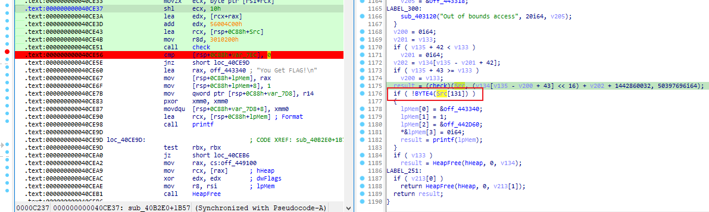
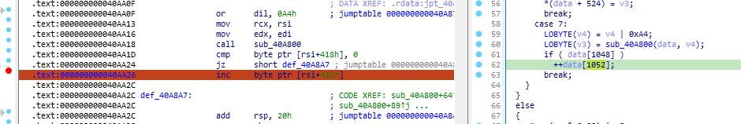
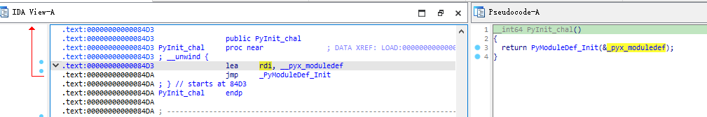
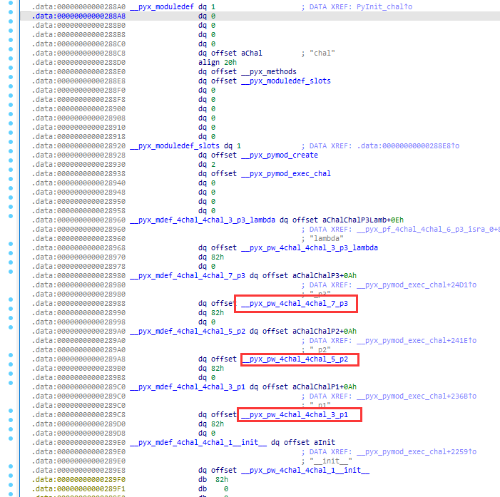

# pic

有点不同的RC4.

多线程爆破五位字符。

```c
#include <stdio.h>
#include <string.h>
#include <pthread.h>

#define THREADNUM 8
#define CHAR_RANGE (127 - 32 + 1) / THREADNUM

unsigned char png_head[8] = {0x89, 0x50, 0x4E, 0x47, 0x0D, 0x0A, 0x1A, 0x0A};

void rc4_init(unsigned char *s, unsigned char *key, unsigned long Len)
{
    int i = 0, j = 0;
    char k[256] = {0};
    unsigned char tmp = 0;
    for (i = 0; i < 256; i++)
    {
        s[i] = i;
        k[i] = key[i % Len];
    }
    for (i = 0; i < 256; i++)
    {
        j = (j + s[i] + k[i]) % 256;
        tmp = s[i];
        s[i] = s[j];
        s[j] = tmp;
    }
}

void rc4_crypt(unsigned char *s, unsigned char *Data, unsigned long Len)
{
    int i = 0, j = 0, t = 0;
    unsigned long k = 0;
    unsigned char tmp;
    for (k = 0; k < Len; k++)
    {
        i = (i + 1) % 256;
        j = (j + s[i]) % 256;
        tmp = s[i];
        s[i] = s[j];
        s[j] = tmp;
        t = (s[i] + s[j]) % 256;
        Data[k] ^= s[t] ^ 0x11;
    }
}

void *brute_force(void *arg)
{
    int start = *(int *)arg;
    start = start * CHAR_RANGE + 32;
    int end = start + CHAR_RANGE;
    printf("Thread %d: %d-%d\n", *(int *)arg, start, end);
    unsigned char key[5];
    for (int k1 = start; k1 < end; k1++)
    {
        key[0] = k1;
        printf("Thread %d: %d\n", *(int *)arg, key[0]);
        for (int k2 = 32; k2 < 127; k2++)
        {
            key[1] = k2;
            for (int k3 = 32; k3 < 127; k3++)
            {
                key[2] = k3;
                for (int k4 = 32; k4 < 127; k4++)
                {
                    key[3] = k4;
                    for (int k5 = 32; k5 < 127; k5++)
                    {
                        key[4] = k5;
                        unsigned char s[256] = {0};
                        unsigned char pData[8] = {0x85, 0x43, 0x72, 0x78, 0x26, 0xC0, 0x2E, 0x6E};
                        for (int i = 0; i < 8; i++)
                            pData[i] ^= key[1];
                        rc4_init(s, key, 5);
                        rc4_crypt(s, pData, 8);
                        if (memcmp(pData, png_head, 8) == 0)
                        {
                            printf("Key found: %02X %02X %02X %02X %02X\n", key[0], key[1], key[2], key[3], key[4]);
                            printf("Key found: %02X%02X%02X%02X%02X\n", key[0], key[1], key[2], key[3], key[4]);
                            printf("Key found: %c%c%c%c%c\n", key[0], key[1], key[2], key[3], key[4]);
                            pthread_exit(NULL);
                        }
                    }
                }
            }
        }
    }
    pthread_exit(NULL);
}

int main()
{
    pthread_t threads[THREADNUM];
    int status;
    int thread_id[THREADNUM];

    for (int i = 0; i < THREADNUM; i++)
    {
        thread_id[i] = i;
        if (pthread_create(&threads[i], NULL, brute_force, (void *)&thread_id[i]) != 0)
        {
            perror("Failed to create thread");
            return 1;
        }
    }

    for (int i = 0; i < CHAR_RANGE; i++)
    {
        if (pthread_join(threads[i], (void **)&status) != 0)
        {
            perror("Failed to join thread");
            return 1;
        }
    }

    return 0;
}
// 0173d
```

# sedRust_happyVm

恐怖rust😱

前面的东西没太看懂在干嘛。

中间有一段类似base64编码的过程，存储对照表替换的过程前的中间数据。

```c
do
{
    v119 = v113 - 2;
    if ( v113 - 2 >= v111 )
    {
        v204 = &off_443350;
        goto LABEL_261;
    }
    v119 = v113 - 1;
    if ( v113 - 1 >= v111 )
    {
        v204 = &off_443368;
        goto LABEL_261;
    }
    if ( v113 >= v111 )
    {
        v119 = v113;
        v204 = &off_443380;
        LABEL_261:
        sub_403550(v119, v111, v204);
    }
    char1 = *(v109 + v113 - 2);
    char2 = *(v109 + v113 - 1);
    char3 = *(v109 + v113);
    if ( v116 == v115 )
    {
        (sub_40A440)(lpMem, v112, v114);
        v116 = lpMem[3];
        v115 = lpMem[0];
        v112 = lpMem[1];
        v114 = lpMem[2];
    }
    v123 = &v114[v116];
    v124 = 0i64;
    if ( v123 >= v115 )
        v124 = v115;
    v125 = v123 - v124;
    *(v112 + v125) = char1 >> 2;
    v126 = (v116 + 1);
    lpMem[3] = v126;
    v115 = lpMem[0];
    if ( v126 == lpMem[0] )
    {
        (sub_40A440)(lpMem, v112, v125);
        v115 = lpMem[0];
        v126 = lpMem[3];
    }
    v127 = ((char2 >> 4) | (16 * char1)) & 0x3F;
    v112 = lpMem[1];
    v114 = lpMem[2];
    v128 = 0i64;
    if ( lpMem[2] + v126 >= v115 )
        v128 = v115;
    *(lpMem[1] + lpMem[2] + v126 - v128) = v127;
    v129 = v126 + 1;
    lpMem[3] = v129;
    if ( v129 == v115 )
    {
        (sub_40A440)(lpMem, v112, v114);
        v129 = lpMem[3];
        v115 = lpMem[0];
        v112 = lpMem[1];
        v114 = lpMem[2];
    }
    v130 = ((char3 >> 6) | (4 * char2)) & 0x3F;
    v131 = 0i64;
    if ( &v114[v129] >= v115 )
        v131 = v115;
    *(v112 + &v114[v129] - v131) = v130;
    v132 = v129 + 1;
    lpMem[3] = v132;
    if ( v132 == v115 )
    {
        (sub_40A440)(lpMem, v112, v114);
        v132 = lpMem[3];
        v115 = lpMem[0];
        v112 = lpMem[1];
        v114 = lpMem[2];
    }
    v117 = char3 & 0x3F;
    v118 = 0i64;
    if ( &v114[v132] >= v115 )
        v118 = v115;
    *(v112 + &v114[v132] - v118) = v117;
    v116 = (v132 + 1);
    lpMem[3] = v116;
    v113 += 3i64;
}
while ( v113 != 35 );
```

然后每次使用两个数进入check函数，这样的函数一共用了22个。

```c
check(Src, (v139 << 8) + (v134[v135 - v137 + 1] << 16) - 0x4EFFFFE8, 0x3000201u);
if ( v116 < 3 )
{
    v205 = &off_443018;
    goto LABEL_300;
}
if ( v116 == 3 )
{
    v205 = &off_443030;
    goto LABEL_300;
}
v140 = 0i64;
v141 = v133;
if ( v135 + 2 < v133 )
    v141 = 0i64;
v142 = v134[v135 - v141 + 2];
if ( v135 + 3 >= v133 )
    v140 = v133;
check(Src, (v134[v135 - v140 + 3] << 8) + v142 - 0x5BF70000, 0x3020100u);
if ( v116 < 6 )
{
    v205 = &off_443048;
    goto LABEL_300;
}
v143 = 0i64;
v144 = v133;
if ( v135 + 5 < v133 )
    v144 = 0i64;
v145 = v134[v135 - v144 + 5];
if ( v135 + 4 >= v133 )
    v143 = v133;
```

最后在这里检测该数据是否为0，为0则flag正确。



在该数据位置下个断点，发现只有这里对其进行了更改：



且每次check函数，如果输入的两个数据是错的，就会加加两次。

直接爆破了。

```python
import frida
import subprocess
from tqdm import tqdm
number = 0
new_number = 0

def on_message(message, data):
    global new_number
    if message['type'] == 'send':
        new_number = message['payload']
    elif message['type'] == "error":
        print(message["description"])
        print(message["stack"])
        print(message["fileName"], "line:", message["lineNumber"], "colum:", message["columnNumber"])
    else:
        print(message)


jscode = open("hook.js", "rb").read().decode()

def check(flag):
    process = subprocess.Popen(
        "80F96BE110F9736464C5328CA22409E1570993AEFAB84BB3F326DF8B2A631027.exe",
        stdin=subprocess.PIPE,
        stdout=subprocess.PIPE,
        stderr=subprocess.PIPE,
        universal_newlines=True
    )
    session = frida.attach("80F96BE110F9736464C5328CA22409E1570993AEFAB84BB3F326DF8B2A631027.exe")
    script = session.create_script(jscode)
    script.on('message', on_message)
    script.load()
    process.stdin.write(flag)
    output, error = process.communicate()

if __name__ == "__main__":
    flag = "DASCTF{c669733af3ce4459b88016420b81cb**}"
    check(flag)
    print(f"try {flag} -> {new_number}")
    number = new_number

    for start in range(31, 37, 3):
        print(f"start: {start}, flag: {flag}, number: {number}")
        for i in range(64):
            if new_number <= number - 4:
                number = number - 4 
                break   
            for j in range(64):
                if new_number <= number - 4:
                    break
                k1 = i << 2 | j >> 4
                k2 = (j & 0xf) << 4
                if (32 <= k1 <= 126) and (32 <= k2 <= 126):
                    flag1 = flag[:start] + chr(k1) + chr(k2) + flag[start+2:]
                    check(flag1)
                    if new_number <= number - 2:
                        number1 = number - 2
                        print(f"first flag: {flag1} -> {new_number}")
                        for x in range(64):
                            if new_number <= number1 - 2:
                                break
                            for y in range(64):
                                k2 = (j & 0xf) << 4 | x >> 2
                                k3 = (x & 0x3) << 6 | y
                                if (32 <= k2 <= 126) and (32 <= k3 <= 126):
                                    flag2 = flag[:start] + chr(k1) + chr(k2) + chr(k3) + flag[start+3:]
                                    check(flag2)
                                    if new_number <= number1 - 2:
                                        print(f"\tsecond flag: {flag2} -> {new_number}")
                                        flag = flag2
                                        break
    for i in range(32, 127):
        for j in range(32, 127):
            flag1 = flag[:37] + chr(i) + chr(j) + flag[39:]
            check(flag1)
            if new_number <= number - 3:
                print(f"final flag: {flag1} -> {new_number}")
```

# 你这主函数保真么

MLM秒了

```c++
void __cdecl __static_initialization_and_destruction_0(int __initialize_p, int __priority)
{
    std::ios_base::Init *v2; // [esp+0h] [ebp-18h]
    std::vector<double> *const v3; // [esp+0h] [ebp-18h]
    Test *const v4; // [esp+0h] [ebp-18h]
    Test2 *const v5; // [esp+0h] [ebp-18h]

    if ( __initialize_p == 1 && __priority == 0xFFFF )
    {
        std::ios_base::Init::Init(v2);
        atexit(__tcf_0);
        std::vector<double>::vector(v3);
        atexit(__tcf_1);
        Test::Test(v4);
        atexit(__tcf_2);
        Test2::Test2(v5);
        atexit(__tcf_3);
    }
}
vector<double> encrypt(const vector<int> &input) {
    int size = input.size();
    vector<double> output(size, 0.0);
    for (int i = 0; i < size; i++) {
        for (int j = 0; j < size; j++) {
            output[i] += input[j] * cos((i * PI * (j + 0.5)) / size);
        }
        if (i == 0)
            output[i] *= sqrt(1.0 / size);
        else
            output[i] *= sqrt(2.0 / size);
    }
    return output;
}
void Test2::~Test2() {
    std::vector<int> input(strlen(flag));
    for (int i = 0; i < strlen(flag); i++) input[i] = flag[i];
    encrypted = encrypt(input);
    int cd = 0;
    for (auto val : encrypted) in[cd++] = val;
}

void Test::Test() {
    printf("Please input your flag~\n");
    scanf("%s", flag);
    len = strlen(flag);
    if (len != 33) {
        printf("Len error!\n");
        exit(0);
    }
}
void __cdecl Test::~Test(Test *const this)
{
    int i; // [esp+2Ch] [ebp-Ch]

    for ( i = 0; i <= 32; ++i )
    {
        if ( std::abs(check[i] - in[i]) > (long double)(double)0.0001 )
        {
            puts("Wrong!!");
            exit(0);
        }
    }
    puts("Right!!");
}
void __cdecl rot13_encrypt(char *input)
{
    char v1; // al

    while ( *input )
    {
        if ( *input > 64 && *input <= 'Z' || *input > 96 && *input <= 'z' )
        {
            if ( *input <= 64 || *input > 90 )
                v1 = 97;
            else
                v1 = 65;
            *input = (*input - v1 + 13) % 26 + v1;
        }
        ++input;
    }
}
```

没有AI我真看不出是DCT。

AI直接逆出算法。

```c++
#include <iostream>
#include <math.h>

#define PI 3.141592653589793
#define N 33

void rot13encrypt(char* str, int len) {
    for (int i = 0; i < len; i++) {
        if (str[i] >= 'a' && str[i] <= 'z') {
            str[i] = (str[i] - 'a' + 13) % 26 + 'a';
        } else if (str[i] >= 'A' && str[i] <= 'Z') {
            str[i] = (str[i] - 'A' + 13) % 26 + 'A';
        }
    }
}

void enc2(char flag[33], double output[33]) {
    int input[33];
    for (int i = 0; i < 33; i++)
        input[i] = flag[i];
    for (int i = 0; i < 33; i++) {
        printf("output[%d] = %ld ", i, output[i]);
        for (int j = 0; j < 33; j++) {
            output[i] += input[j] * cos((i * PI * (j + 0.5)) / 33);
            // printf(" -> %lf ", output[i]);
        }
        if (i == 0)
            output[i] *= sqrt(33.0);
        else
            output[i] *= sqrt(33.0 / 2.0);
        // printf(" -*-> %lf\n", output[i]);
    }
}

void dec2(double input[N], char flag[N]) {
    double output[N];
    for (int j = 0; j < N; j++) {
        output[j] = 0;
        for (int i = 0; i < N; i++) {
            double coefficient = cos((i * PI * (j + 0.5)) / N);
            if (i == 0)
                coefficient *= sqrt(1.0 / N);
            else
                coefficient *= sqrt(2.0 / N);
            output[j] += input[i] * coefficient;
        }
        // printf("output[%d] = %lf\n", j, output[j]);
        flag[j] = round(output[j]);
    }
}


int main() {
    double result[33];
    unsigned char _check[288] = {
        0xA4, 0x70, 0x3D, 0x0A, 0xD7, 0x0A, 0x80, 0x40, 0xF5, 0x4A, 0x59, 0x86, 0x38, 0xE6, 0x42, 0xC0, 
        0xD8, 0x81, 0x73, 0x46, 0x94, 0x76, 0x21, 0x40, 0x54, 0x74, 0x24, 0x97, 0xFF, 0x90, 0x25, 0xC0, 
        0xA3, 0x23, 0xB9, 0xFC, 0x87, 0xF4, 0xF4, 0xBF, 0xC0, 0x5B, 0x20, 0x41, 0xF1, 0x93, 0x34, 0xC0, 
        0x19, 0xCA, 0x89, 0x76, 0x15, 0xF2, 0x1B, 0x40, 0x3F, 0xC6, 0xDC, 0xB5, 0x84, 0x4C, 0x3D, 0xC0, 
        0x18, 0x95, 0xD4, 0x09, 0x68, 0xE2, 0x2F, 0x40, 0xB5, 0x15, 0xFB, 0xCB, 0xEE, 0x69, 0x35, 0x40, 
        0xB6, 0x84, 0x7C, 0xD0, 0xB3, 0x79, 0x3D, 0x40, 0xEA, 0x21, 0x1A, 0xDD, 0x41, 0x2C, 0x06, 0xC0, 
        0x7C, 0x0A, 0x80, 0xF1, 0x0C, 0x5A, 0x1A, 0xC0, 0xBF, 0x2B, 0x82, 0xFF, 0xAD, 0xE4, 0x10, 0xC0, 
        0x69, 0x35, 0x24, 0xEE, 0xB1, 0xD4, 0x1C, 0xC0, 0x41, 0x65, 0xFC, 0xFB, 0x8C, 0xAB, 0x21, 0x40, 
        0xD8, 0x64, 0x8D, 0x7A, 0x88, 0x86, 0x11, 0xC0, 0x16, 0xFB, 0xCB, 0xEE, 0xC9, 0x63, 0x33, 0xC0, 
        0x0E, 0x4F, 0xAF, 0x94, 0x65, 0x58, 0x32, 0x40, 0x48, 0x1B, 0x47, 0xAC, 0xC5, 0x87, 0x1B, 0x40, 
        0x64, 0xCC, 0x5D, 0x4B, 0xC8, 0x87, 0x2D, 0xC0, 0xD5, 0x09, 0x68, 0x22, 0x6C, 0x38, 0x2D, 0x40, 
        0x20, 0x41, 0xF1, 0x63, 0xCC, 0xBD, 0x38, 0x40, 0x74, 0x24, 0x97, 0xFF, 0x90, 0x3E, 0x27, 0xC0, 
        0x6D, 0xA8, 0x18, 0xE7, 0x6F, 0x82, 0x23, 0xC0, 0xCE, 0x19, 0x51, 0xDA, 0x1B, 0x7C, 0x28, 0x40, 
        0x3C, 0x4E, 0xD1, 0x91, 0x5C, 0xDE, 0x2A, 0x40, 0x90, 0x31, 0x77, 0x2D, 0x21, 0x77, 0x41, 0xC0, 
        0xAE, 0x47, 0xE1, 0x7A, 0x14, 0xDE, 0x41, 0xC0, 0x68, 0xB3, 0xEA, 0x73, 0xB5, 0x15, 0x34, 0xC0, 
        0xD5, 0x78, 0xE9, 0x26, 0x31, 0xD8, 0x43, 0x40, 0x1B, 0x2F, 0xDD, 0x24, 0x06, 0xE1, 0x35, 0x40, 
        0xF8, 0xC2, 0x64, 0xAA, 0x60, 0xD4, 0x3A, 0x40, 0x00, 0x00, 0x00, 0x00, 0x00, 0x00, 0x00, 0x00, 
        0x00, 0x00, 0x00, 0x00, 0x00, 0x00, 0x00, 0x00, 0x00, 0x00, 0x00, 0x00, 0x00, 0x00, 0x00, 0x00
    };
    for (int i = 0; i < 33 * 8; i++)
        *((char*)result + i) = _check[i];
    char flag[33] = {0};
    dec2(result, flag);
    for (int i = 0; i < 33; i++)
        printf("%c", flag[i]);
    printf("\n");
    rot13encrypt(flag, 33);
    printf("%s\n", flag);
    return 0;
}
```

# docCrack

[在线Word(.docm,.dotm) vba代码提取工具 - 在线工具 (bugscaner.com)](http://tools.bugscaner.com/office/word-parser-vba.html)获取宏代码

删去一些不必要的代码：

```vba
Attribute VB_Name = "ThisDocument"
Attribute VB_Base = "1Normal.ThisDocument"
Attribute VB_GlobalNameSpace = False
Attribute VB_Creatable = False
Attribute VB_PredeclaredId = True
Attribute VB_Exposed = True
Attribute VB_TemplateDerived = True
Attribute VB_Customizable = True

Sub AutoOpen()
    Set fso = CreateObject("Scripting.FileSystemObject")
    Set objShell = CreateObject("WScript.Shell")
    
    isContinue = 7
    temp = MsgBox("I?am???Vcke?!!!_I???m??Hac?er??!!???_am_Hac?er!!!_I_a?_????ok?r!!!", vbCritical, "Hacked_by_??????")
    Do
        inflag = InputBox("Give me your flag", "Hacked_by_??????")
        If inflag = "" Then
            inflag = "noflag"
        End If
        Result = ""
        For i = 1 To Len(inflag)
            res = Chr(Asc(Mid(inflag, i, 1)) Xor 7)

            Result = Result & res
        Next i

        xpkdb = ...

        tempPath = ThisDocument.Path & "\temp1"
        Set tempfile = fso.CreateTextFile(tempPath, True)
        fso.GetFile(tempPath).Attributes = 2
        tempfile.WriteLine xpkdb
        tempfile.Close
        
        batPath = ThisDocument.Path & "\temp.bat"
        Set batFile = fso.CreateTextFile(batPath, True)
        fso.GetFile(batPath).Attributes = 2
        batFile.WriteLine "@echo off"
        batFile.WriteLine "cd /d " & ThisDocument.Path
        batFile.WriteLine "certutil -decode temp1 temp|certutil -decode temp temp.exe"
        batFile.WriteLine "del temp"
        batFile.WriteLine "temp.exe " & """" & Result & """"
        batFile.WriteLine "del temp.exe"
        batFile.Close
        Set objExec = objShell.Exec(batPath)
        Set objStdOut = objExec.StdOut
        Do While Not objStdOut.AtEndOfStream
            output = Trim(objStdOut.ReadLine)
        Loop
        output = Left(output, Len(output))
        StartTime = Timer
        Do While Timer < StartTime + 1
            DoEvents
        Loop
        fso.DeleteFile batPath
        fso.DeleteFile tempPath
    
        If output = "good" Then
            temp = MsgBox("good!!!", , "congratulations!!!")
            Exit Do
        Else
            temp = MsgBox("Sorry, U are wrong!!!", , "Hacked_by_??????")
            isContinue = MsgBox("Continue?", vbYesNo + vbQuestion, "Warning")
        End If
    Loop While isContinue = 6
End Sub
```

然后两次base64解码数据获取exe文件：

```c
if ( argc == 2 )
{
    for ( j = 0; j < (int)j_strlen(argv[1]) && (unsigned __int64)j < 0x36; ++j )
        result[j + 64] = argv[1][j] << 6;
    for ( j = 0; (unsigned __int64)j < 0x36; ++j )
    {
        if ( result[j] != result[j + 64] )
        {
            sub_140011190("bad");
            return 0;
        }
    }
    sub_140011190("good");
    return 0;
}
else
{
    sub_140011190("no way!!!");
    return 1;
}
```

直接写脚本：

```python
result = [0] * 54
result[0] = 4288;
result[1] = 4480;
result[2] = 5376;
result[3] = 4352;
result[4] = 5312;
result[5] = 4160;
result[6] = 7936;
result[7] = 5184;
result[8] = 6464;
result[9] = 6528;
result[10] = 5632;
result[11] = 3456;
result[12] = 7424;
result[13] = 5632;
result[14] = 6336;
result[15] = 6528;
result[16] = 6720;
result[17] = 6144;
result[18] = 6272;
result[19] = 7488;
result[20] = 6656;
result[21] = 7296;
result[22] = 7424;
result[23] = 2432;
result[24] = 2432;
result[25] = 2432;
result[26] = 5632;
result[27] = 4416;
result[28] = 3456;
result[29] = 7168;
result[30] = 6528;
result[31] = 7488;
result[32] = 6272;
result[33] = 5632;
result[34] = 3520;
result[35] = 6208;
result[36] = 5632;
result[37] = 4736;
result[38] = 6528;
result[39] = 6400;
result[40] = 7488;
result[41] = 3520;
result[42] = 5632;
result[43] = 5184;
result[44] = 3456;
result[45] = 7488;
result[46] = 7296;
result[47] = 3200;
result[48] = 6272;
result[49] = 7424;
result[50] = 2432;
result[51] = 2432;
result[52] = 2432;
result[53] = 7808;
flag = [0] * 54
for i in range(54):
    flag[i] = (result[i] >> 6) ^ 7
print(flag)
print(''.join([chr(i) for i in flag]))
```

# chal

由`PyInit_chal`进入：



`_pyx_moduledef`下面就有定义的方法：



分析`p1`：

```c
v59 = a2[1].m128i_i64[0];
v58 = _mm_loadu_si128(a2);
v16 = v58.m128i_i64[1];
v17 = v59;
v21 = PyNumber_Multiply(v16, v17);
if ( *(_UNKNOWN **)(v21 + 8) == &PyLong_Type )
{
    v22 = *(_DWORD *)(v21 + 24);
    if ( (*(_BYTE *)(v21 + 16) & 3) != 0 )
        LOWORD(v22) = -(__int16)v22;
    v23 = (__int64 *)PyLong_FromLong((unsigned __int16)v22, number_0xFFFF, v19, v20);// 0xFFFFLL
}
else
{
    v23 = (__int64 *)PyNumber_And(v21, number_0xFFFF);
}
v24 = _Pyx_PyInt_RshiftObjC_constprop_0(v21, number_0x10, 16LL);
v26 = PyNumber_Subtract(v23, v24);
v28 = (_DWORD *)PyObject_RichCompare(v26, number_0x0, 0LL);
v30 = v28 == (_DWORD *)&Py_TrueStruct;
if ( v30 || v29 == (_DWORD *)&Py_FalseStruct || v29 == &Py_NoneStruct )
{
    IsTrue = v30;
}
else
{
    IsTrue = PyObject_IsTrue(v29);
}
if ( !IsTrue )
{
    v33 = v27;
    goto LABEL_47;
}
v33 = (_DWORD *)_Pyx_PyInt_AddObjC_constprop_0(v27, number_one, 1LL, 1LL);
```

连蒙带猜得到：

```
def p1(a, b):
    t = a * b
    t1 = t & 0xffff
    t2 = t >> 16
    t = t1 - t2
    if t < 0:
        t += 1
    return t
```

分析`p2`:

```c
v279 = _Pyx_PyInt_RshiftObjC_constprop_0(v19, number_0x18, 24LL);
v281 = (__int64 *)PyNumber_And(v279, number_0xFF);
v286 = _Pyx_PyInt_RshiftObjC_constprop_0(v19, number_0x10, 16LL);
v279 = PyNumber_And(v286, number_0xFF);
v291 = _Pyx_PyInt_RshiftObjC_constprop_0(v19, number_0x8, 8LL);
v286 = PyNumber_And(v291, number_0xFF);
v291 = PyNumber_And(v19, number_0xFF);
Index = (__int64 *)_Pyx_PyObject_GetIndex(mylist, v281);
v303 = _Pyx_PyInt_LshiftObjC_constprop_0(Index, number_0x18, 24LL);
v351 = _Pyx_PyObject_GetIndex(mylist, v279);
v311 = _Pyx_PyInt_LshiftObjC_constprop_0(Index, number_0x10, 16LL);
v314 = PyNumber_Add(v310, v312);
v303 = _Pyx_PyObject_GetIndex(mylist, v286);
v321 = _Pyx_PyInt_LshiftObjC_constprop_0(v303, number_0x8, 8LL);
v312 = (_QWORD *)PyNumber_Add(Index, v322);
v352 = _Pyx_PyObject_GetIndex(mylist, v291);
v332 = PyNumber_Add(v312, v331);
```

得到代码：

```python
def p2(a):
    data = [214, 144, 233, 254, 204, 225, 61, 183, 22, 182, 20, 194, 40, 251, 44, 5, 43, 103, 154, 118, 42, 190, 4, 195, 170, 68, 19, 38, 73, 134, 6, 153, 156, 66, 80, 244, 145, 239, 152, 122, 51, 84, 11, 67, 237, 207, 172, 98, 228, 179, 28, 169, 201, 8, 232, 149, 128, 223, 148, 250, 117, 143, 63, 166, 71, 7, 167, 252, 243, 115, 23, 186, 131, 89, 60, 25, 230, 133, 79, 168, 104, 107, 129, 178, 113, 100, 218, 139, 248, 235, 15, 75, 112, 86, 157, 53, 30, 36, 14, 94, 99, 88, 209, 162, 37, 34, 124, 59, 1, 33, 120, 135, 212, 0, 70, 87, 159, 211, 39, 82, 76, 54, 2, 231, 160, 196, 200, 158, 234, 191, 138, 210, 64, 199, 56, 181, 163, 247, 242, 206, 249, 97, 21, 161, 224, 174, 93, 164, 155, 52, 26, 85, 173, 147, 50, 48, 245, 140, 177, 227, 29, 246, 226, 46, 130, 102, 202, 96, 192, 41, 35, 171, 13, 83, 78, 111, 213, 219, 55, 69, 222, 253, 142, 47, 3, 255, 106, 114, 109, 108, 91, 81, 141, 27, 175, 146, 187, 221, 188, 127, 17, 217, 92, 65, 31, 16, 90, 216, 10, 193, 49, 136, 165, 205, 123, 189, 45, 116, 208, 18, 184, 229, 180, 176, 137, 105, 151, 74, 12, 150, 119, 126, 101, 185, 241, 9, 197, 110, 198, 132, 24, 240, 125, 236, 58, 220, 77, 32, 121, 238, 95, 62, 215, 203, 57, 72]
    b1 = (a >> 24) & 0xff
    b2 = (a >> 16) & 0xff
    b3 = (a >> 8) & 0xff
    b4 = a & 0xff
    c1 = data[b1]
    c2 = data[b2]
    c3 = data[b3]
    c4 = data[b4]
    t = (c1 << 24) | (c2 << 16) | (c3 << 8) | c4
    return t
```

# data-analy2

pyshark过滤包，获取数据：

```python
import pyshark

# 指定 PCAPNG 文件路径
pcapng_file = 'data.pcapng'

# 创建一个捕获对象
capture = pyshark.FileCapture(
    pcapng_file, 
    tshark_path="D:\CommonApp\Wireshark\\tshark.exe",
)

# 遍历所有符合条件的数据包
for packet in capture:
    if 'http' in packet and 'ip' in packet and packet.ip.src == '172.16.38.133':
        http_body = packet.http
        if hasattr(http_body, 'file_data'):
            file_data = http_body.file_data
            print(f"File Data: {file_data}")

# 关闭捕获
capture.close()
```

# ai-2


# ai-3

```python
import glob
import torch
import torch.nn as nn
from torchvision import models, transforms
from PIL import Image
import torch.optim as optim
from skimage.metrics import structural_similarity as ssim
import numpy as np
import shutil
from tqdm import tqdm


aim = "dog"
data = {"cat": 0, "dog": 1, "fox": 2}
target = {"cat": 1, "dog": 2, "fox": 0}
device = torch.device("cuda" if torch.cuda.is_available() else "cpu")
model = models.densenet121(pretrained=True)
num_ftrs = model.classifier.in_features
model.classifier = nn.Sequential(
    nn.Linear(num_ftrs, 500),
    nn.Linear(500, 3)
)
PATH = 'ckpt_densenet121_catdogfox_classify.pth'
model.load_state_dict(torch.load(PATH, map_location=device))
model = model.to(device)
model.eval()

def calculate_ssim(original_image, adversarial_image):
    original_image_np = original_image.squeeze().detach().cpu().numpy().transpose(1, 2, 0)
    adversarial_image_np = adversarial_image.squeeze().detach().cpu().numpy().transpose(1, 2, 0)
    ssim_value = ssim(original_image_np, adversarial_image_np, win_size=3, channel_axis=2, data_range=1.0)
    return ssim_value

def load_image_normalize(path):
    image = Image.open(path)
    preprocess = transforms.Compose([
        transforms.ToTensor(),
        # transforms.Normalize(             # 正则化
        #     mean=[0.485, 0.456, 0.406],   # ImageNet 均值
        #     std=[0.229, 0.224, 0.225]     # ImageNet 标准差
        # )
    ])
    image = preprocess(image).unsqueeze(0)
    return image

def load_image(path):
    image = Image.open(path)
    preprocess = transforms.Compose([
        transforms.ToTensor()
    ])
    image = preprocess(image).unsqueeze(0)
    return image

def denormalize(tensor):
    mean = torch.tensor([0.485, 0.456, 0.406]).view(1, 3, 1, 1).to(tensor.device)
    std = torch.tensor([0.229, 0.224, 0.225]).view(1, 3, 1, 1).to(tensor.device)
    tensor = tensor * std + mean
    return torch.clamp(tensor, 0, 1)

def save_image_denomalize(image, filename):
    # image = denormalize(image).squeeze(0).cpu()
    image = image.squeeze(0).cpu()
    image = transforms.ToPILImage()(image)
    image.save(filename, format='JPEG')

def fgsm_attack(image, epsilon, data_grad):
    sign_data_grad = data_grad.sign()
    perturbed_image = image - epsilon * sign_data_grad
    perturbed_image = torch.clamp(perturbed_image, 0, 1)
    return perturbed_image

def check_ssmi(image, ori_image_path):
    save_image_denomalize(image, 'temp.jpg')
    temp_image = load_image('temp.jpg')
    original_image = load_image(ori_image_path)
    ssmi_value1 = calculate_ssim(original_image, temp_image)
    with torch.no_grad():
        output = model(temp_image.clone().detach().to(device))
    _, predicted = torch.max(output.data, 1)
    # print(f"ssmi_value: {ssmi_value}, predicted: {predicted}")
    if predicted != target[aim]:
        return False
    predicted = predicted.item()
    ssmi_value = calculate_ssim(original_image, temp_image)
    assert ssmi_value1 == ssmi_value, "The ssmi value should be the same"
    if ssmi_value > 0.95:
        return True
    else:
        return False
    
def generate_adversarial_sample_until_success(ori_image_path, target_image_path, max_iterations, epsilon=0.001):
    isSuccess = False
    iteration = 0
    ori_image = load_image_normalize(ori_image_path).to(device)
    perturbed_image = ori_image.clone().detach().to(device)
    perturbed_image.requires_grad = True
    check_ssmi(perturbed_image, ori_image_path)
    while not isSuccess and iteration < max_iterations:
        iteration += 1
        model.zero_grad()
        output_image = model(perturbed_image)
        loss = nn.CrossEntropyLoss()(output_image, torch.tensor([target[aim]]).to(device))
        loss.backward()
        output_image_grad = perturbed_image.grad.data
        perturbed_image = fgsm_attack(perturbed_image, epsilon, output_image_grad)
        if check_ssmi(perturbed_image, ori_image_path):
            isSuccess = True
            save_image_denomalize(perturbed_image.clone().detach(), target_image_path)
        # print(f"iteration: {iteration}, check_ssmi: {isSuccess}")
        perturbed_image = perturbed_image.detach()
        perturbed_image.requires_grad = True
    return isSuccess

            
if __name__ == "__main__":
    original_image_paths = glob.glob('./adv_image/' + aim + '/' + '*.jpg')
    target_image_paths = './new/' + aim + '/'
    # original_image_path = './adv_image/fox/fox_001.jpg'
    # target_image_path = './new/fox/fox_001.jpg'
    count = 0
    success = 0
    for original_image_path in tqdm(original_image_paths):
    # for original_image_path in original_image_paths:
        isSuccess = generate_adversarial_sample_until_success(
            original_image_path, 
            target_image_paths + original_image_path.split('\\')[-1],
            max_iterations=20,
        )
        count += 1
        if isSuccess:
            success += 1
        else:
            shutil.copyfile(original_image_path, target_image_paths + original_image_path.split('\\')[-1])

    print(f"Success: {success}/{count} = {success / count:.2%}")
```

