# 巅峰极客2023

wp1:[巅峰极客 2023 逆向 Writeup - s11nk - 博客园 (cnblogs.com)](https://www.cnblogs.com/gaoyucan/p/17577858.html)

## g0Re

### 还原特征码

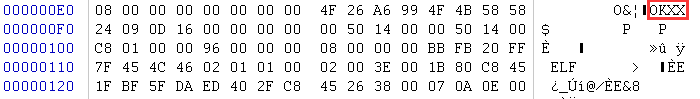


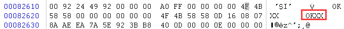

即可upx脱壳。

### 程序逻辑

首先是一个AES加密，调试可以得出加密函数：

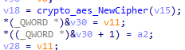

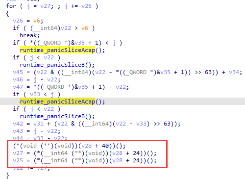

然后一个换表了的base64：

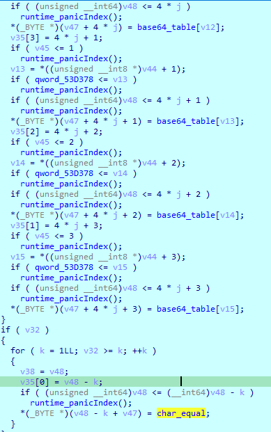

最后与key异或，然后比较：


### exp

```python
import base64
import struct
from Crypto.Cipher import AES
key = [
    0x77, 0x76, 0x67, 0x69, 0x74, 0x62, 0x79, 0x67, 0x77, 0x62,
    0x6B, 0x32, 0x62, 0x34, 0x36, 0x64
]
uni_base64 = '456789}#IJKLMNOPQRSTUVWXYZabcdefghijklmnopqrstuvwxyz0123ABCDEFGH'
std_base64 = 'ABCDEFGHIJKLMNOPQRSTUVWXYZabcdefghijklmnopqrstuvwxyz0123456789+/'
data = [
    0xC9F5C5CFC889CEE6, 0xCCAC7FCE91C0D9D2,
    0x92EAD496C0B7CFE9, 0x93AEA5CB84DFD7E2,
    0xC9F0CEDF97BECAA6, 0xDB65B1C46BAEE1B7,
    0xC3ED8CD69392EDCE, 0xA7B5B2AAA594DAA3
]
result = b''
for i in range(8):
    result += struct.pack('<Q', data[i])
result = list(result)
for i in range(len(result)):
    result[i] -= key[i % 16]
    result[i] ^= 0x1A
result = ''.join(chr(i) for i in result)
result = result.translate(str.maketrans(uni_base64, std_base64))
result = base64.b64decode(result)
result = AES.new(bytearray(key), mode=AES.MODE_ECB).decrypt(result)
print(result)
```

## ezlua

跟着[巅峰极客 2023 逆向 Writeup](https://www.cnblogs.com/gaoyucan/p/17577858.html)走

### 程序逻辑

程序获取输入，验证是否都为十六进制字符，之后每两位输入组成两位十六进制数放入`lua_code[0x59b9:0x59CE]`，

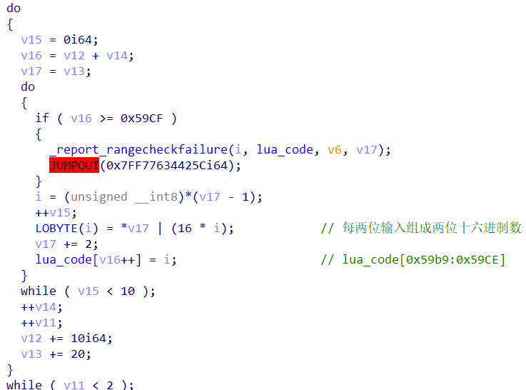

输入后为`lua_code[0x59b9:0x59CE]`下断点，在这里被读取了，是`lj_buf_ruleb128`


来到其上层函数：


现输⼊的数据其实是两个 u64 类型的数字使⽤ uleb128 编码成 4 个 32bit 的值，判断依据是 tp 的值均为 3。


猜测是调用`lua`变化输入，然后再获取结果，进行比较。

### 反编译luajit

将`lua_code`保存为二进制文件，用[luajit-decompiler](https://github.com/Dr-MTN/luajit-decompiler)反编译。


查看结果显示的数据是浮点数，根据wp更改，注释掉两行（`./luajit-decompiler/ljd/rawdump/constants.py`）再次反编译，即可。


反编译后逻辑很简单，但有虚假控制流，可以改为python代码，打印下`slot2`。
每一步操作的逻辑：

```
slot6 = bit.rshift(slot1, 8)
slot7 = bit.lshift(slot1, 56)
slot4 = bit.bor(slot6, slot7)
slot1 = slot0 + slot4
slot1 = bit.bxor(slot1, slot2)

slot6 = bit.lshift(slot0, 3)
slot7 = bit.rshift(slot0, 61)
slot4 = bit.bor(slot6, slot7)
slot0 = bit.xor(slot4, slot1)
```

### exp

```python
import leb128


def u64_to_uleb128(u):
    high = u >> 32
    low = u & 0xffffffff
    return leb128.u.encode(low).hex() + leb128.u.encode(high).hex()


def dec(s0, s1, s2):
    s0 = ((s0 ^ s1) << 61 | (s0 ^ s1) >> 3) & 0xffffffffffffffff
    t = ((s1 ^ s2) - s0) & 0xffffffffffffffff
    s1 = (t >> 56 | t << 8) & 0xffffffffffffffff
    return s0, s1


slot2 = [
    0xdeadbeef12345678,
    0x28539dc5904d8141,
    0xf2ac321ccf237a7b,
    0xf03df21e866b1a36,
    0x584cde754c325b4b,
    0x97407269ac231f8b,
    0xd2960ba60ee82d09,
    0xb34efc0e8d197592,
    0x15011adba4d8613d,
    0x1598470b72677cea,
    0xb497efc6db87c606,
    0xae0f3ba8a4eeb218,
    0xab6036ab64121254,
    0x663ae5cc72c5eb7f,
    0x71af0f7e9c371b0e,
    0xeb97fc6b58f9eb33,
    0x774108a83f7c75f6,
    0x5a6542d5c9968681,
    0x5e6fb973117ccfb1,
    0xea8134ba653ce534,
    0xfc92946aa1cc9678,
    0x38af8cc9553071e4,
    0x99f7a1b258084992,
    0x82e920e890bb99da,
    0xc67f72528ed05d6c,
    0x4cab3a53d2598281,
    0x517358620b3249f9,
    0xcf3d41fd5e5e0786,
    0x626be66ab995efe3,
    0x24d85b01f54e2ab1,
    0xe9cd3a65e3f95992,
    0x4bf5996751882d17
]
s0, s1 = 0xDD26C29515A28396, 0xBD722D4BAF99B9C7
slot2.reverse()
for i in range(len(slot2)):
    s0, s1 = dec(s0, s1, slot2[i])

print(u64_to_uleb128(s1) + u64_to_uleb128(s0))
```


# *CTF2023

wp1:[*CTF2023Reverse逆向详解wp_柒傑的博客-CSDN博客](https://blog.csdn.net/weixin_51280668/article/details/132056750)

wp2:[*CTF 2023 Writeup - 星盟安全团队 (xmcve.com)](http://blog.xmcve.com/2023/07/31/starCTF-2023-Writeup/)

## ezcode

更改文件后缀名为ps1，使用PowerShell ISE调试。

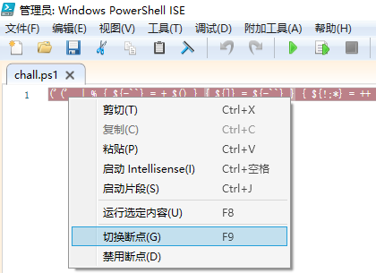

单步调试可以看到：

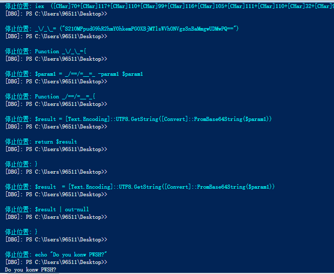

打印前面一长串char可以看到：

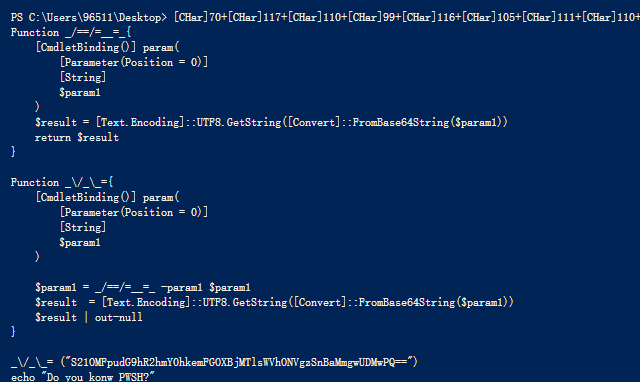

再次调试，在使用shift+f10跳出之后，输入：${@*}

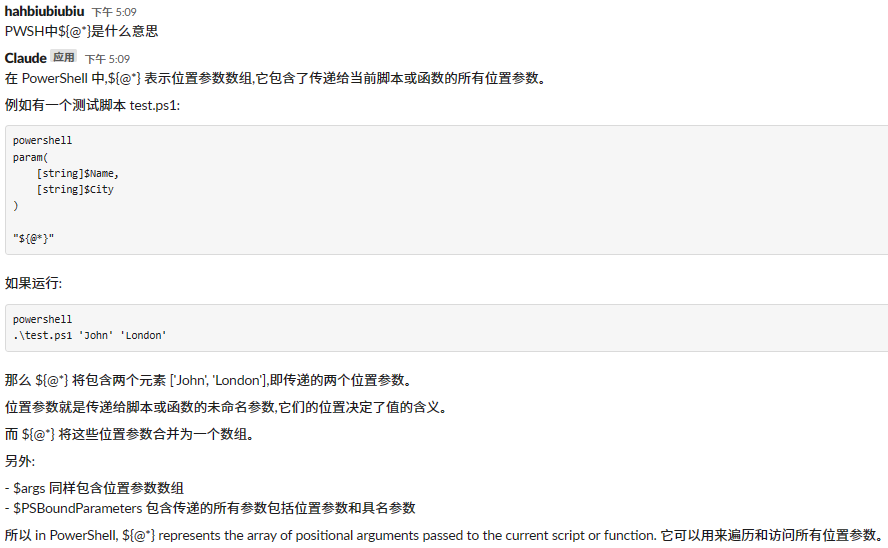

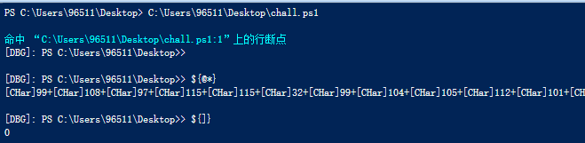

打印获取的一长串char，即可看到主逻辑：

```python
class chiper():
    def __init__(self):
        self.d = 0x87654321
        k0 = 0x67452301
        k1 = 0xefcdab89
        k2 = 0x98badcfe
        k3 = 0x10325476
        self.k = [k0, k1, k2, k3]

    def e(self, n, v):
        from ctypes import c_uint32

        def MX(z, y, total, key, p, e):
            temp1 = (z.value >> 6 ^ y.value << 4) + \
                (y.value >> 2 ^ z.value << 5)
            temp2 = (total.value ^ y.value) + \
                (key[(p & 3) ^ e.value] ^ z.value)
            return c_uint32(temp1 ^ temp2)
        key = self.k
        delta = self.d
        rounds = 6 + 52//n
        total = c_uint32(0)
        z = c_uint32(v[n-1])
        e = c_uint32(0)

        while rounds > 0:
            total.value += delta
            e.value = (total.value >> 2) & 3
            for p in range(n-1):
                y = c_uint32(v[p+1])
                v[p] = c_uint32(v[p] + MX(z, y, total, key, p, e).value).value
                z.value = v[p]
            y = c_uint32(v[0])
            v[n-1] = c_uint32(v[n-1] + MX(z, y, total,
                              key, n-1, e).value).value
            z.value = v[n-1]
            rounds -= 1
        return v

    def bytes2ints(self,cs:bytes)->list:
        new_length=len(cs)+(8-len(cs)%8)%8
        barray=cs.ljust(new_length,b'\x00')
        i=0
        v=[]
        while i < new_length:
            v0 = int.from_bytes(barray[i:i+4], 'little')
            v1 = int.from_bytes(barray[i+4:i+8], 'little')
            v.append(v0)
            v.append(v1)
            i += 8
        return v

def check(instr:str,checklist:list)->int:
    length=len(instr)
    if length%8:
        print("Incorrect format.")
        exit(1)
    c=chiper()
    v = c.bytes2ints(instr.encode())
    output=list(c.e(len(v),v))
    i=0
    while(i<len(checklist)):
        if i<len(output) and output[i]==checklist[i]:
            i+=1
        else:
            break
    if i==len(checklist):
        return 1
    return 0    

if __name__=="__main__":
    ans=[1374278842, 2136006540, 4191056815, 3248881376]
    # generateRes()
    flag=input('Please input flag:')
    res=check(flag,ans)
    if res:
        print("Congratulations, you've got the flag!")
        print("Flag is *ctf{your_input}!")
        exit(0)
    else:
        print('Nope,try again!')
```

## flagfile

#### 方法1

```python
# 使用file -d选项调试检测
import re
import subprocess

f = open('flag', 'w')
f.write('flag{' + '*' * (64 - len('flag{')))
f.close()

for i in range(2, 34):
    text = subprocess.run(['file', '-m', 'flag.mgc', '-d', 'flag'],
                          capture_output=True, text=True, check=True).stderr
    # print("text:\n", text, "\ntext end\n")
    # 2: >> 64 leshort^00000076,=111,""]
    data = re.findall(f'{i}: >* (\d+) leshort\^([\da-f]+),=(\d+),""]', text)
    print(i, "offset:", data[0][0], "data:", data)
    f = open('flag', 'ab')
    f.write((int(data[0][1], 16) ^ int(data[0][2])).to_bytes(2, 'little'))
    f.close()

for i in range(34, 100):
    text = subprocess.run(['file', '-m', 'flag.mgc', '-d', 'flag'],
                          capture_output=True, text=True, check=True).stderr
    # print("text:\n", text, "\ntext end\n")
    # 34: >> 64(byte,&0), byte^ffffffffffffff8a,=-20,""]
    # mget/128 @25:
    data = re.findall(f'{i}: >* \d+\(byte,&0\), byte\^([\da-f]+),=([-\d]+),""]', text)
    off = re.findall(f'mget/128 @(\d+):', text)
    print(i, "offset:", off[-1], "data:", data)
    f = open('flag', 'rb+')
    f.seek(int(off[-1]))
    f.write(((int(data[0][0], 16) ^ int(data[0][1])) & 0xff).to_bytes(1, 'little'))
    f.close()
```

#### 方法2

解析mgc文件：

```C
#include <stdio.h>
#include <string.h>
#include <stdlib.h>
#include <sys/types.h>
#include <sys/stat.h>
#include <stdarg.h>
#include <sys/param.h>
#include <stdio.h>    /* Include that here, to make sure __P gets defined */
#include <errno.h>
#include <fcntl.h>    /* For open and flags */
#include <stdint.h>

#define MAXDESC    64        /* max len of text description/MIME type */
#define MAXMIME    80        /* max len of text MIME type */
#define MAXstring 128    

union VALUETYPE {
    uint8_t b;
    uint16_t h;
    uint32_t l;
    uint64_t q;
    uint8_t hs[2];    /* 2 bytes of a fixed-endian "short" */
    uint8_t hl[4];    /* 4 bytes of a fixed-endian "long" */
    uint8_t hq[8];    /* 8 bytes of a fixed-endian "quad" */
    char s[MAXstring];    /* the search string or regex pattern */
    unsigned char us[MAXstring];
    uint64_t guid[2];
    float f;
    double d;
};

struct magic {
    /* Word 1 */
    uint16_t cont_level;    /* level of ">" */
    uint8_t flag;
#define INDIR        0x01    /* if '(...)' appears */
#define OFFADD        0x02    /* if '>&' or '>...(&' appears */
#define INDIROFFADD    0x04    /* if '>&(' appears */
#define UNSIGNED    0x08    /* comparison is unsigned */
#define NOSPACE        0x10    /* suppress space character before output */
#define BINTEST        0x20    /* test is for a binary type (set only
                   for top-level tests) */
#define TEXTTEST    0x40    /* for passing to file_softmagic */
#define OFFNEGATIVE    0x80    /* relative to the end of file */

    uint8_t factor;

    /* Word 2 */
    uint8_t reln;        /* relation (0=eq, '>'=gt, etc) */
    uint8_t vallen;        /* length of string value, if any */
    uint8_t type;        /* comparison type (FILE_*) */
    uint8_t in_type;    /* type of indirection */
#define             FILE_INVALID    0
#define             FILE_BYTE    1
#define                FILE_SHORT    2
#define                FILE_DEFAULT    3
#define                FILE_LONG    4
#define                FILE_STRING    5
#define                FILE_DATE    6
#define                FILE_BESHORT    7
#define                FILE_BELONG    8
#define                FILE_BEDATE    9
#define                FILE_LESHORT    10
#define                FILE_LELONG    11
#define                FILE_LEDATE    12
#define                FILE_PSTRING    13
#define                FILE_LDATE    14
#define                FILE_BELDATE    15
#define                FILE_LELDATE    16
#define                FILE_REGEX    17
#define                FILE_BESTRING16    18
#define                FILE_LESTRING16    19
#define                FILE_SEARCH    20
#define                FILE_MEDATE    21
#define                FILE_MELDATE    22
#define                FILE_MELONG    23
#define                FILE_QUAD    24
#define                FILE_LEQUAD    25
#define                FILE_BEQUAD    26
#define                FILE_QDATE    27
#define                FILE_LEQDATE    28
#define                FILE_BEQDATE    29
#define                FILE_QLDATE    30
#define                FILE_LEQLDATE    31
#define                FILE_BEQLDATE    32
#define                FILE_FLOAT    33
#define                FILE_BEFLOAT    34
#define                FILE_LEFLOAT    35
#define                FILE_DOUBLE    36
#define                FILE_BEDOUBLE    37
#define                FILE_LEDOUBLE    38
#define                FILE_BEID3    39
#define                FILE_LEID3    40
#define                FILE_INDIRECT    41
#define                FILE_QWDATE    42
#define                FILE_LEQWDATE    43
#define                FILE_BEQWDATE    44
#define                FILE_NAME    45
#define                FILE_USE    46
#define                FILE_CLEAR    47
#define                FILE_DER    48
#define                FILE_GUID    49
#define                FILE_OFFSET    50
#define                FILE_NAMES_SIZE    51 /* size of array to contain all names */

#define IS_STRING(t) \
    ((t) == FILE_STRING || \
     (t) == FILE_PSTRING || \
     (t) == FILE_BESTRING16 || \
     (t) == FILE_LESTRING16 || \
     (t) == FILE_REGEX || \
     (t) == FILE_SEARCH || \
     (t) == FILE_INDIRECT || \
     (t) == FILE_NAME || \
     (t) == FILE_USE)

#define FILE_FMT_NONE 0
#define FILE_FMT_NUM  1 /* "cduxXi" */
#define FILE_FMT_STR  2 /* "s" */
#define FILE_FMT_QUAD 3 /* "ll" */
#define FILE_FMT_FLOAT 4 /* "eEfFgG" */
#define FILE_FMT_DOUBLE 5 /* "eEfFgG" */

    /* Word 3 */
    uint8_t in_op;        /* operator for indirection */
    uint8_t mask_op;    /* operator for mask */
#ifdef ENABLE_CONDITIONALS
    uint8_t cond;        /* conditional type */
#else
    uint8_t dummy;
#endif
    uint8_t factor_op;
#define        FILE_FACTOR_OP_PLUS    '+'
#define        FILE_FACTOR_OP_MINUS    '-'
#define        FILE_FACTOR_OP_TIMES    '*'
#define        FILE_FACTOR_OP_DIV    '/'
#define        FILE_FACTOR_OP_NONE    '\0'

#define                FILE_OPS    "&|^+-*/%"
#define                FILE_OPAND    0
#define                FILE_OPOR    1
#define                FILE_OPXOR    2
#define                FILE_OPADD    3
#define                FILE_OPMINUS    4
#define                FILE_OPMULTIPLY    5
#define                FILE_OPDIVIDE    6
#define                FILE_OPMODULO    7
#define                FILE_OPS_MASK    0x07 /* mask for above ops */
#define                FILE_UNUSED_1    0x08
#define                FILE_UNUSED_2    0x10
#define                FILE_OPSIGNED    0x20
#define                FILE_OPINVERSE    0x40
#define                FILE_OPINDIRECT    0x80

#ifdef ENABLE_CONDITIONALS
#define                COND_NONE    0
#define                COND_IF        1
#define                COND_ELIF    2
#define                COND_ELSE    3
#endif /* ENABLE_CONDITIONALS */

    /* Word 4 */
    int32_t offset;        /* offset to magic number */
    /* Word 5 */
    int32_t in_offset;    /* offset from indirection */
    /* Word 6 */
    uint32_t lineno;    /* line number in magic file */
    /* Word 7,8 */
    union {
        uint64_t _mask;    /* for use with numeric and date types */
        struct {
            uint32_t _count;    /* repeat/line count */
            uint32_t _flags;    /* modifier flags */
        } _s;        /* for use with string types */
    } _u;
#define num_mask _u._mask
#define str_range _u._s._count
#define str_flags _u._s._flags
    /* Words 9-24 */
    union VALUETYPE value;    /* either number or string */
    /* Words 25-40 */
    char desc[MAXDESC];    /* description */
    /* Words 41-60 */
    char mimetype[MAXMIME]; /* MIME type */
    /* Words 61-62 */
    char apple[8];        /* APPLE CREATOR/TYPE */
    /* Words 63-78 */
    char ext[64];        /* Popular extensions */
};

int main(int argc, char *argv[])
{
    int ffff = 0;
    char buf[10000];
    int fd = open("flag.mgc", 0);
    read(fd, buf, 0x170 + 8);
    struct magic a[100];
    int index = 0;
    long long test[1000];
    memset(test, 0, 1000);
    char flag[100];
    while (read(fd, &a[index], sizeof(struct magic)) > 0)
    {
        index += 1;
    }
    for (int i = 0; i < index; i++)
    {
        struct magic temp = a[i];
        printf("lineno: %d\n", temp.lineno);
        printf("type: %d\n", temp.type);
        printf("reln: %c\n", temp.reln);
        printf("in_offset: %d\n", temp.in_offset);
        if (((int)(temp.type)) == 1)
        {
            ffff = (temp.offset - 63) / 2 + 1;
            printf("offset: %d\n", (test[ffff]));
            char ttt = ((temp.value.b) & 0xff) ^ ((temp._u._mask) & 0xff);
            flag[test[ffff]] = ttt;
        }
        else
        {
            printf("offset: %d\n", temp.offset);
        }

        printf("b: %llx\n", temp.value.b);
        printf("q: %llx\n", temp.value.q);
        printf("_mask: %llx\n", temp._u._mask);
        printf("mask_op: %llx\n", temp.mask_op);
        printf("in_op: %llx\n", temp.in_op);
        long long tes = temp._u._mask ^ temp.value.q;
        test[i] = tes;
        if (temp.offset < 64)
        {
            printf("aaaa!!!!!!!!!!!!!\n");
        }
        printf("\n=======================\n");
    }
    for (int i = 0; i < index; i++)
    {
        printf("%llx,", test[i]);
    }
    printf("\n\n\n");
    for (int i = 0; i < 40; i++)
    {
        printf("%c", flag[i]);
    }
}
```


# NepCTF2023

## eeeeerte

### 安装易语言反编译模块

更改ida.cfg文件，使其可显示中文字符：

> NameChars =
>         "$?@"           // asm specific character
>         "_0123456789"
>         "ABCDEFGHIJKLMNOPQRSTUVWXYZ"
>         "abcdefghijklmnopqrstuvwxyz",
>         // This would enable common Chinese characters in identifiers:
>         Culture_CJK_Unified_Ideographs,
>         CURRENT_CULTURE;

更改ida64.dll和ida.dll，使其可在反编译代码中显示中文字符：（nop掉该语句）


### 主逻辑

由参数名，来进行逆向，对点击数判断的地方下断点。


#### 加密函数

第一个点击数判断，是一个加密函数，需要输入key，然后加密其给出的数据。

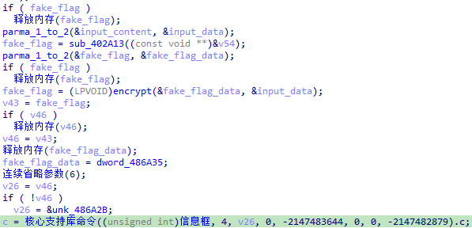

encrypt函数先将fake_flag分为几组四个字的数组，进行SKIPJACK解密：

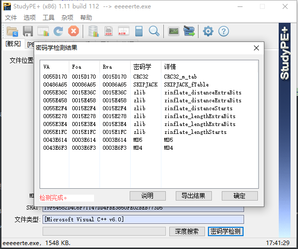

具体加密逻辑，通过调试可知：

```python
import base64
def enc(f, k, d):
    for i in range(32):
        if 0 <= i < 8 or 16 <= i < 24:
            temp = [f[1], f[0]]
            for j in range(4 * i, 4 * i + 4):
                t = k[j % 10] ^ temp[j & 1]
                temp[(j + 1) & 1] = temp[(j + 1) & 1] ^ d[t]
            f[7] ^= (i + 1)
            f = f[6:8] + f[0:6]
            f[3], f[2] = temp[0], temp[1]
            f[0] ^= f[2]
            f[1] ^= f[3]
        else:
            temp = [f[1], f[0]]
            tp = temp
            for j in range(4 * i, 4 * i + 4):
                t = k[j % 10] ^ temp[j & 1]
                temp[(j + 1) & 1] = temp[(j + 1) & 1] ^ d[t]
            f = f[6:8] + [temp[1], temp[0]] + [f[2] ^ f[0], f[3] ^ f[1] ^ (i + 1)] + f[4:6]
    return f
if __name__ == '__main__':
    fake_flag = [0x66, 0x6C, 0x61, 0x67, 0x7B, 0x4D, 0x69, 0x73, 0x64, 0x69, 0x72, 0x65, 0x63, 0x74, 0x69, 0x6F, 0x6E,
                 0x3F, 0x4D, 0x79, 0x73, 0x74, 0x65, 0x72, 0x69, 0x6F, 0x75, 0x73, 0x4A, 0x61, 0x63, 0x6B, 0x3F, 0x46,
                 0x41, 0x41, 0x41, 0x4B, 0x45, 0x7D]
    key = [ord(i) for i in "1234567890"]
    data = [0xA3, 0xD7, 0x09, 0x83, 0xF8, 0x48, 0xF6, 0xF4, 0xB3 ...]
    a = []
    for i in range(len(fake_flag) // 8):
        a += enc(fake_flag[i * 8:i * 8 + 8], key, data)
    result = base64.b64encode(bytearray(a))
    print(result)
```

#### 提供了密文

第二个点击数判断，直接该判断即可获取密文：

`[0, 210, 114, 206, 231, 30, 77, 164, 142, 14, 221, 165, 158, 132, 69, 180, 38, 41, 54, 87, 225, 45, 192, 204, 188, 253, 143, 85, 21, 169, 162, 191, 234, 150, 35, 74, 100, 173, 175, 176]`

#### 画密钥

第三个点击数判断，获取密钥。

##### 方法一

出题师傅说的，在`CreateWindowExA`下断点，更改其长和宽的参数。

```C
HWND CreateWindowExW(
  [in]           DWORD     dwExStyle,
  [in, optional] LPCWSTR   lpClassName,
  [in, optional] LPCWSTR   lpWindowName,
  [in]           DWORD     dwStyle,
  [in]           int       X,
  [in]           int       Y,
  [in]           int       nWidth,
  [in]           int       nHeight,
  [in, optional] HWND      hWndParent,
  [in, optional] HMENU     hMenu,
  [in, optional] HINSTANCE hInstance,
  [in, optional] LPVOID    lpParam
);
```

`CreateWindowExA`一共被调用了四次，大概试一试，知道第四个是有关画密钥的窗口。


将其都改为0，即可。

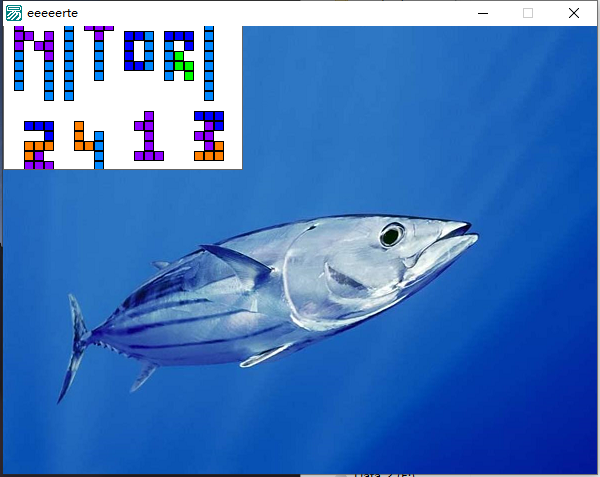

##### 方法二

根据参数，自行画图：

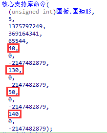

### exp

```python
import base64
def dec(f, k, d):
    for i in range(31, -1, -1):
        if 0 <= i < 8 or 16 <= i < 24:
            temp = [f[3], f[2]]
            for j in range(4 * i + 3, 4 * i - 1, -1):
                t = k[j % 10] ^ temp[j & 1]
                temp[(j + 1) & 1] ^= d[t]
            new_f = [temp[1], temp[0]] + f[4:6] + f[6:8] + [f[2] ^ f[0], f[3] ^ f[1] ^ (i + 1)]
            f = new_f
        else:
            temp = [f[3], f[2]]
            for j in range(4 * i + 3, 4 * i - 1, -1):
                t = k[j % 10] ^ temp[j & 1]
                temp[(j + 1) & 1] ^= d[t]
            new_f = [temp[1], temp[0]] + [f[4] ^ temp[1], f[5] ^ temp[0] ^ (i + 1)] + f[6:8] + f[0:2]
            f = new_f
    return f

if __name__ == '__main__':
    data = [0xA3, 0xD7, 0x09, 0x83, 0xF8, 0x48, 0xF6, 0xF4, 0xB3, 0x21, 0x15, 0x78, 0x99, 0xB1, 0xAF, 0xF9, 0xE7, 0x2D,
            0x4D, 0x8A, 0xCE, 0x4C, 0xCA, 0x2E, 0x52, 0x95, 0xD9, 0x1E, 0x4E, 0x38, 0x44, 0x28, 0x0A, 0xDF, 0x02, 0xA0,
            0x17, 0xF1, 0x60, 0x68, 0x12, 0xB7, 0x7A, 0xC3, 0xE9, 0xFA, 0x3D, 0x53, 0x96, 0x84, 0x6B, 0xBA, 0xF2, 0x63,
            0x9A, 0x19, 0x7C, 0xAE, 0xE5, 0xF5, 0xF7, 0x16, 0x6A, 0xA2, 0x39, 0xB6, 0x7B, 0x0F, 0xC1, 0x93, 0x81, 0x1B,
            0xEE, 0xB4, 0x1A, 0xEA, 0xD0, 0x91, 0x2F, 0xB8, 0x55, 0xB9, 0xDA, 0x85, 0x3F, 0x41, 0xBF, 0xE0, 0x5A, 0x58,
            0x80, 0x5F, 0x66, 0x0B, 0xD8, 0x90, 0x35, 0xD5, 0xC0, 0xA7, 0x33, 0x06, 0x65, 0x69, 0x45, 0x00, 0x94, 0x56,
            0x6D, 0x98, 0x9B, 0x76, 0x97, 0xFC, 0xB2, 0xC2, 0xB0, 0xFE, 0xDB, 0x20, 0xE1, 0xEB, 0xD6, 0xE4, 0xDD, 0x47,
            0x4A, 0x1D, 0x42, 0xED, 0x9E, 0x6E, 0x49, 0x3C, 0xCD, 0x43, 0x27, 0xD2, 0x07, 0xD4, 0xDE, 0xC7, 0x67, 0x18,
            0x89, 0xCB, 0x30, 0x1F, 0x8D, 0xC6, 0x8F, 0xAA, 0xC8, 0x74, 0xDC, 0xC9, 0x5D, 0x5C, 0x31, 0xA4, 0x70, 0x88,
            0x61, 0x2C, 0x9F, 0x0D, 0x2B, 0x87, 0x50, 0x82, 0x54, 0x64, 0x26, 0x7D, 0x03, 0x40, 0x34, 0x4B, 0x1C, 0x73,
            0xD1, 0xC4, 0xFD, 0x3B, 0xCC, 0xFB, 0x7F, 0xAB, 0xE6, 0x3E, 0x5B, 0xA5, 0xAD, 0x04, 0x23, 0x9C, 0x14, 0x51,
            0x22, 0xF0, 0x29, 0x79, 0x71, 0x7E, 0xFF, 0x8C, 0x0E, 0xE2, 0x0C, 0xEF, 0xBC, 0x72, 0x75, 0x6F, 0x37, 0xA1,
            0xEC, 0xD3, 0x8E, 0x62, 0x8B, 0x86, 0x10, 0xE8, 0x08, 0x77, 0x11, 0xBE, 0x92, 0x4F, 0x24, 0xC5, 0x32, 0x36,
            0x9D, 0xCF, 0xF3, 0xA6, 0xBB, 0xAC, 0x5E, 0x6C, 0xA9, 0x13, 0x57, 0x25, 0xB5, 0xE3, 0xBD, 0xA8, 0x3A, 0x01,
            0x05, 0x59, 0x2A, 0x46, 0xAB, 0xAB, 0xAB, 0xAB, 0xAB, 0xAB, 0xAB]
    # 解密
    secret = 'xmxO93Sn8YjfoWqaFS6poLf6n1q7bWrIyXbLAdcSjygWfs/jAVc4leFrTDZYdFoL'
    secret = base64.b64decode(secret)
    secret = list(secret)
    key = [ord(i) for i in "NITORI2413"]
    flag = []
    for i in range(len(secret) // 8):
        flag += dec(secret[i * 8:i * 8 + 8], key, data)
    print(bytearray(flag))
    # NepCTF{3456789TQKA2,Jack_was_skipped_by_EPL}
```


## 九龙拉棺

跟着[出题师傅的wp](https://m1n9yu3.github.io/2023/08/14/NepCTF2023-%E4%B9%9D%E9%BE%99%E6%8B%89%E6%A3%BAwp)走的。

UPX壳，直接脱壳。

### 文件映射对象

创建文件映射对象，存储输入的字符串，使之后创建的进程可以获取输入。

此操作先于main执行。


### 反调试

1. 每个线程都或多或少执行了一个反调试的函数。

2. 检测调式寄存器Dr7是否为正常值。

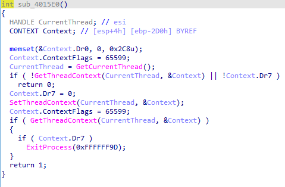

3. 子进程中也有反调试：`NtCurrentPeb()->BeingDebugged`

### 八个线程

main中启动了八个线程。


每个进程依靠全局变量`CriticalLevel`来控制执行顺序，`CriticalLevel`初始值为0。

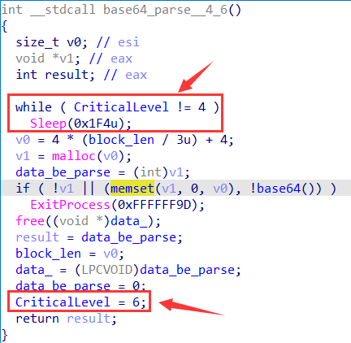

main中获取完输入，将其写入文件映射对象中，然后将`CriticalLevel`置为1，等待其他线程。

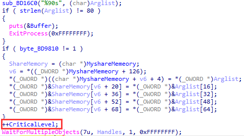

#### 第一个线程：Rc4解密

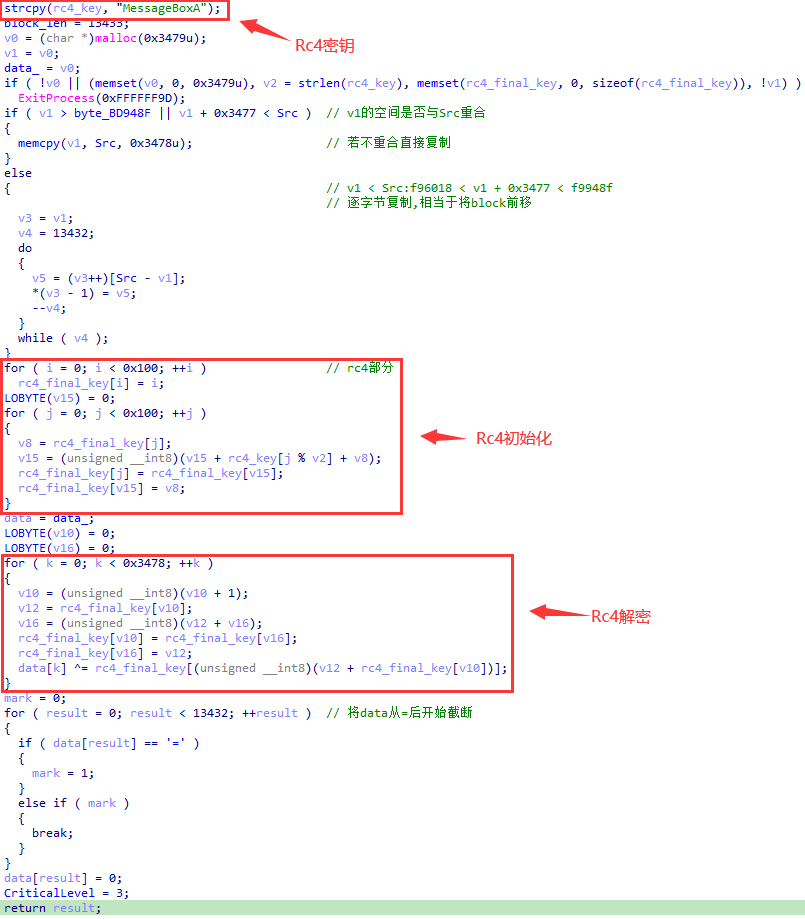

#### 第二个线程：base32解析

主要依靠base32表和字符串看出是base32，前面更新数据长度的部分也可以联想到base32（但有点疑惑为什么是除五乘八）。

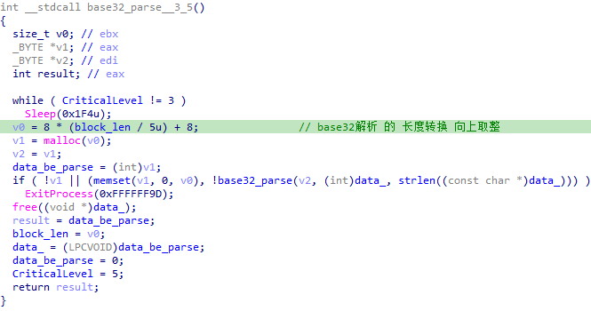

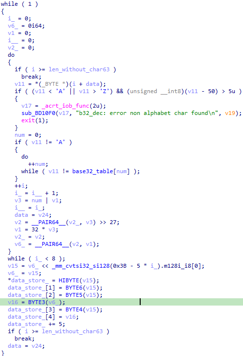

#### 第三个线程：base58

主要转化式子可以辨认。

也可以依靠长度变化来辨别。


#### 第四个线程：base64


#### 第五个线程：StartAddress

前面四个线程处理的数据得到的是一个可执行文件数据，本线程就是将其写入exe，并执行。

具体细节还得再搞搞。

#### 第六个线程：tea、compare

明显的tea和比较：

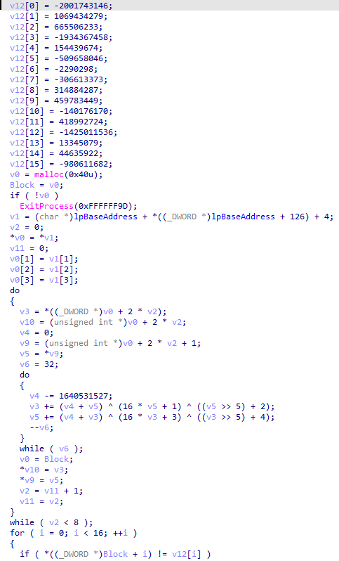

这里解密tea可得到一部分的输入数据：NepCTF{c9cdnwdi3iu41m0pv3x7kllzu8pdq6mt9n2nwjdp6kat8ent4dhn5r158

#### 第七个线程：最终结果


注意到`MyshareMemory`的位置在主程序中一直只存放了输入，且输入的位置为`MyshareMemoroy+随机数的位置`，因此判断成功的条件在子程序中写入。

#### 第八个线程：反调试

> - 1个线程用于反调试
>   - 反调试动态读取.text(第一个段)并通过累加的方式，不断读取对比的方式，来实现反调试。如果程序一开始就存在断点，则该反调试无效，若在调试中突然增加int3断点，则该程序直接退出。

##### 获取text段地址

+ ModuleHandle = GetModuleHandleW(0)  获取exe基地址：0x100000

+ 0x100000 + 0x3C：AddressOfNewExeHeader（0xF8）

+ 0x100000 + AddressOfNewExeHeader：NtHeader

+ NtHeader + 0x14：SizeOfOptionalHeader（0xE0）

+ NtHeader + SizeOfOptionnalHeader + 0x28：SectionHeader[0]（即`.text`段）->Misc->SizeofRawData

+ ModuleHandleW + AddressOfNewHeader + SizeOfOptionnalHeader：DelayLoadImportDescriptors

+ ModuleHandleW + DelayLoadImportDescriptors + 0x24：VirtualAddress（0x101000）此时指向了.text`段

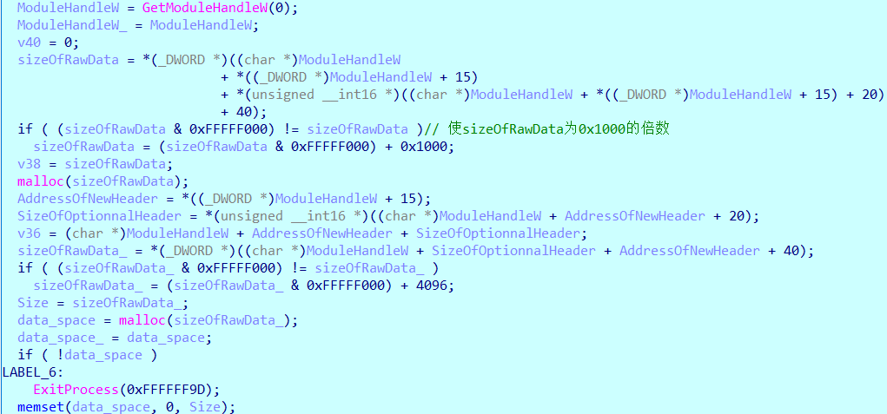

##### 压缩数据，形成一个整数（类似校验码）

对text段的数据生成校验码。

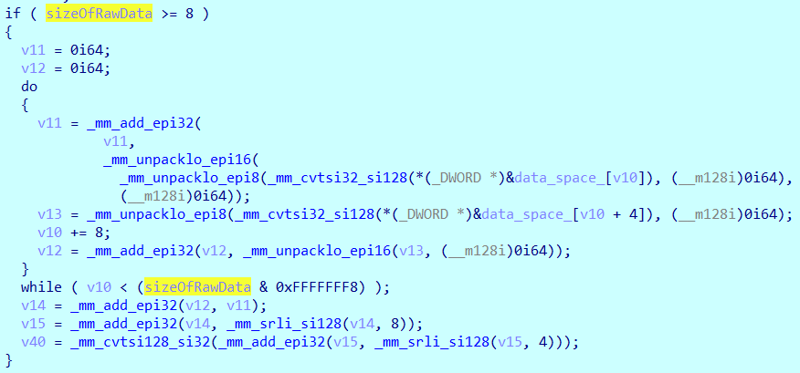

 ##### 循环比对

生成校验码后，线程进入死循环，不断重复生成校验码，并与之前的校验码进行比对。

如果不同，则意味着text段被修改了，可能是在程序中下了int3断点导致，就结束。

### 子进程

看着wp里的变量命名大概看懂了。

#### FindFunction

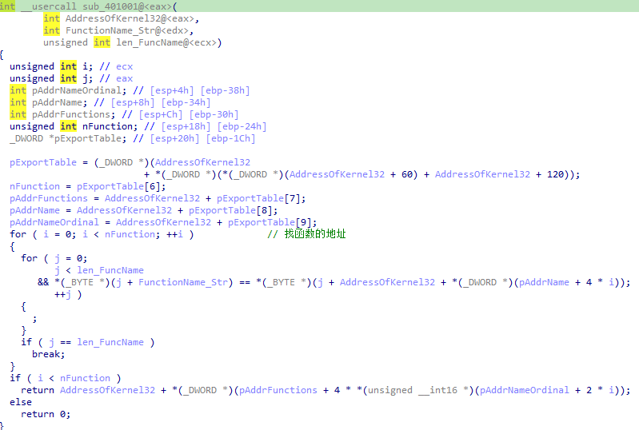

#### tea

类似的一个tea解密函数，直接解密可得：iu41m0pv3x7kllzu8pdq6mt9n2nwjdp6kat8ent4dhn5r158iz2f0cmr0u7yxyq}，与之前的明文结合一下就是flag了。

#### main

通过获取kernel32的地址，来获取所需函数的地址

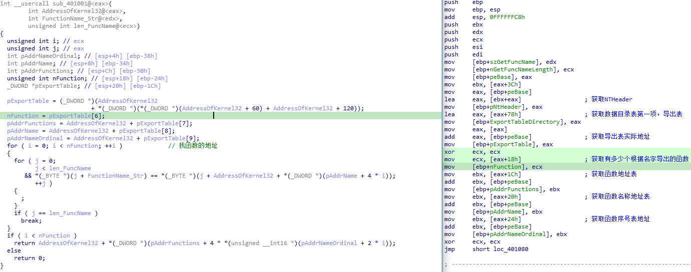

子进程通过文件映射对象获取`MyshareMemory`然后将其中的输入进去与tea函数解密比对，

最后，比对成功，将成功条件写入`MyshareMemory`中。


# WMCTF2023

## RightBack

### 反编译pyc

用pycdas看一下pyc字节码，主要是这里的字节码导致无法正确反编译：

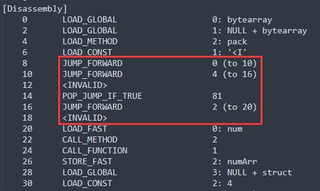

把所有这样的部分都patch掉（直接更改那部分代码的二进制数据）：

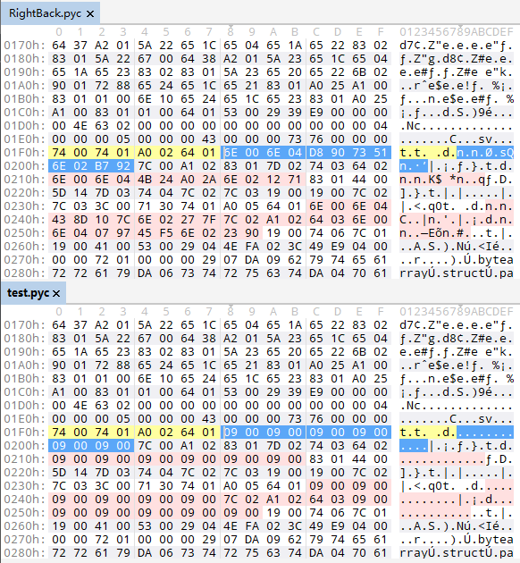

获取字节码的二进制数据：

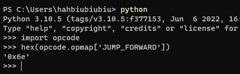

用pycdc获取反编译：

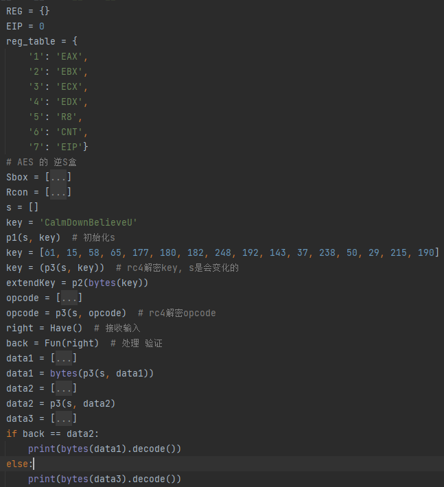

### 分析逻辑

1. p1：RC4密钥初始化；
2. p3：RC4解密；
3. p2：类似AES的密钥初始化；
4. Have：获取输入；
5. 执行虚拟机，验证。

执行以下获取opcode、extendKey。

模拟执行一下：

```python
def F1(part1, part2):
    global REG
    REG = {'EAX': part1, 'EBX': part2, 'ECX': 0, 'EDX': 0, 'R8': 0, 'CNT': 0, 'EIP': 0}


# 根据v1的值来更改v2（值由v3决定）
def F2(v1, v2, v3):
    print(opcode[REG['EIP']], end=' : ')
    if v1 == 1:
        print(f'{reg_table[str(v2)]} = extendKey[{reg_table[str(v3)]}]:{extendKey[REG[reg_table[str(v3)]]]}')
        REG[reg_table[str(v2)]] = extendKey[REG[reg_table[str(v3)]]]
    elif v1 == 2:
        print(f'{reg_table[str(v2)]} = {reg_table[str(v3)]}')
        REG[reg_table[str(v2)]] = REG[reg_table[str(v3)]]
    elif v1 == 3:
        print(f'{reg_table[str(v2)]} = {str(v3)}')
        REG[reg_table[str(v2)]] = v3
    REG['EIP'] += 4


# 根据v1的值使 v2 加上 由v3决定的值
def F3(v1, v2, v3):
    print(opcode[REG['EIP']], end=' : ')
    if v1 == 1:
        print(f'{reg_table[str(v2)]} += extendKey[{reg_table[str(v3)]}]:{extendKey[REG[reg_table[str(v3)]]]}')
        REG[reg_table[str(v2)]] = REG[reg_table[str(v2)]] + extendKey[REG[reg_table[str(v3)]]] & 0xFFFFFFFF
    elif v1 == 2:
        print(f'{reg_table[str(v2)]} += {reg_table[str(v3)]}')
        REG[reg_table[str(v2)]] = REG[reg_table[str(v2)]] + REG[reg_table[str(v3)]] & 0xFFFFFFFF
    elif v1 == 3:
        print(f'{reg_table[str(v2)]} += {str(v3)}')
        REG[reg_table[str(v2)]] = REG[reg_table[str(v2)]] + v3 & 0xFFFFFFFF
    REG['EIP'] += 4


def F4(v1, v2):
    print(opcode[REG['EIP']], end=' : ')
    print(f'{reg_table[str(v1)]} ^= {reg_table[str(v2)]}:{REG[reg_table[str(v2)]]}')
    REG[reg_table[str(v1)]] ^= REG[reg_table[str(v2)]]
    REG['EIP'] += 3


def F5(v1, v2):
    print(opcode[REG['EIP']], end=' : ')
    print(f'{reg_table[str(v1)]} &= {v2}')
    REG[reg_table[str(v1)]] &= v2
    REG['EIP'] += 3


# 根据v1的值使 v2 减去 由v3决定的值
def F6(v1, v2, v3):
    print(opcode[REG['EIP']], end=' : ')
    if v1 == 1:
        print(f'{reg_table[str(v2)]} -= extendKey[{reg_table[str(v3)]}]:{extendKey[REG[reg_table[str(v3)]]]}')
        REG[reg_table[str(v2)]] -= extendKey[v3]
    elif v1 == 2:
        print(f'{reg_table[str(v2)]} -= {reg_table[str(v3)]}')
        REG[reg_table[str(v2)]] -= REG[reg_table[str(v3)]]
    elif v1 == 3:
        print(f'{reg_table[str(v2)]} -= {str(v3)}')
        REG[reg_table[str(v2)]] -= v3
    REG['EIP'] += 4


def F7(v1, v2):
    print(opcode[REG['EIP']], end=' : ')
    print(f'{reg_table[str(v1)]} |= {reg_table[str(v2)]}')
    REG[reg_table[str(v1)]] |= REG[reg_table[str(v2)]]
    REG['EIP'] += 3


def F8(v1, v2):
    print(opcode[REG['EIP']], end=' : ')
    print(f'{reg_table[str(v1)]} >>= {reg_table[str(v2)]}')
    REG[reg_table[str(v1)]] = REG[reg_table[str(v1)]] >> REG[reg_table[str(v2)]] & 0xFFFFFFFF
    REG['EIP'] += 3


def F9(v1, v2):
    print(opcode[REG['EIP']], end=' : ')
    print(f'{reg_table[str(v1)]} <<= {reg_table[str(v2)]}')
    REG[reg_table[str(v1)]] = REG[reg_table[str(v1)]] << REG[reg_table[str(v2)]] & 0xFFFFFFFF
    REG['EIP'] += 3


def FA(v1, v2, v3):
    print(opcode[REG['EIP']], end=' : ')
    if v1 == 1:
        print(f'{reg_table[str(v2)]} *= extendKey[{reg_table[str(v3)]}]:{extendKey[REG[reg_table[str(v3)]]]}')
        REG[reg_table[str(v2)]] *= extendKey[v3]
    elif v1 == 2:
        print(f'{reg_table[str(v2)]} *= {reg_table[str(v3)]}')
        REG[reg_table[str(v2)]] *= REG[reg_table[str(v3)]]
    elif v1 == 3:
        print(f'{reg_table[str(v2)]} *= {str(v3)}')
        REG[reg_table[str(v2)]] *= v3
    REG['EIP'] += 4


def FB():
    print(opcode[REG['EIP']], end=' : ')
    print(REG['CNT'], 'test CNT')
    REG['R8'] = REG['CNT'] == 21
    REG['EIP'] += 1


def WC():
    print(opcode[REG['EIP']], end=' : ')
    if not REG['R8']:
        REG['EIP'] = 16
        print("R8:", REG['R8'])
        print('eip = 16')
    else:
        print("R8:", REG['R8'], 'go')
        REG['EIP'] += 1
        print()


opcode = [
    80, 3, 3, 0,
    29, 1, 1, 3,
    80, 3, 3, 1,
    29, 1, 2, 3,
    29, 3, 6, 1,
    113, 1, 2,
    80, 2, 3, 1,
    80, 2, 5, 2,
    114, 2, 31,
    41, 1, 2,
    80, 3, 4, 32,
    150, 2, 4, 2,
    116, 3, 4,
    87, 1, 3,
    80, 2, 2, 6,
    220, 3, 2, 2,
    80, 1, 3, 2,
    29, 2, 1, 3,
    80, 2, 2, 5,
    113, 2, 1,
    80, 2, 3, 2,
    80, 2, 4, 1,
    114, 4, 31,
    41, 2, 4,
    80, 3, 5, 32,
    150, 2, 5, 4,
    116, 3, 5,
    87, 2, 3,
    80, 2, 3, 6,
    220, 3, 3, 2,
    29, 3, 3, 1,
    80, 1, 4, 3,
    29, 2, 2, 4,
    7, 153, 255]
EIP = 0
extendKey = [1835819331, 1853321028, 1768711490, 1432712805, 2177920767, 4020699579, 2261476601, 3551400604, 711874531, 3318306392, 1124217505, 2427199549, 3099853672, 2098025776, 1041196945, 2929936300, 246748610, 1941455090, 1303848803, 3809763535, 1395557789, 546751855, 1830937100, 2385871555, 2516030638, 3043054017, 3628118989, 1450520846, 1825094265, 3651791800, 32069749, 1469868411, 919887482, 4017993154, 4002737591, 3104343244, 4134211933, 420914335, 4152510760, 1317719524, 1990496755, 1873950060, 2553314372, 3602559392]
reg_table = {
        '1': 'EAX',
        '2': 'EBX',
        '3': 'ECX',
        '4': 'EDX',
        '5': 'R8',
        '6': 'CNT',
        '7': 'EIP'}
REG = {}
while EIP < len(opcode):
    F1(0x31323334, 0x35363738)
    while 1:
        EIP = REG['EIP']
        if opcode[EIP] == 80:
            # 根据v1的值来更改v2（值由v3决定）
            F2(opcode[EIP + 1], opcode[EIP + 2], opcode[EIP + 3])
            continue
        if opcode[EIP] == 29:
            # 根据v1的值使 v2 加上 由v3决定的值
            F3(opcode[EIP + 1], opcode[EIP + 2], opcode[EIP + 3])
            continue
        if opcode[EIP] == 113:
            # 异或
            F4(opcode[EIP + 1], opcode[EIP + 2])
            continue
        if opcode[EIP] == 114:
            # 相与
            F5(opcode[EIP + 1], opcode[EIP + 2])
            continue
        if opcode[EIP] == 150:
            # 根据v1的值使 v2 减去 由v3决定的值
            F6(opcode[EIP + 1], opcode[EIP + 2], opcode[EIP + 3])
            continue
        if opcode[EIP] == 87:
            # 相或
            F7(opcode[EIP + 1], opcode[EIP + 2])
            continue
        if opcode[EIP] == 116:
            # 右移
            F8(opcode[EIP + 1], opcode[EIP + 2])
            continue
        if opcode[EIP] == 41:
            # 左移
            F9(opcode[EIP + 1], opcode[EIP + 2])
            continue
        if opcode[EIP] == 220:
            # 根据v1的值使 v2 乘上 由v3决定的值
            FA(opcode[EIP + 1], opcode[EIP + 2], opcode[EIP + 3])
            continue
        if opcode[EIP] == 7:
            # 检测CNt == 21，结果在R8
            FB()
            continue
        if opcode[EIP] == 153:
            # 根据R8 判断是要跳去地址16
            WC()
            continue
```

得到验证逻辑：

```
eax = input[0] + extendKey[0]
ebx = input[1] + extendKey[1]
while CNT != 21 
	CNT += 1
	r8 = ebx
	temp = eax ^ ebx
	# 交换temp前后位
	ebx = ebx & 31
	ebx = temp << ebx | temp >> (32 - ebx)
	eax += extendKey[CNT * 2]
	ebx = r8
	temp = eax ^ ebx
	edx = eax & 31
	ebx = temp << edx | temp >> (32 - edx)
	ebx += extendKey[CNT * 2 + 1]
```

### exp

```python
import struct
result = [4, 58, 242, 54, 86, 177, 154, 252, 247, 30, 33, 220, 219, 143, 142, 148, 77, 52, 231, 157, 156, 82, 12, 110, 251, 250, 213, 253, 50, 249, 120, 44, 187, 190, 57, 193, 217, 133, 117, 182, 40, 248, 204, 120, 164, 228, 133, 146, 14, 189, 114, 197, 175, 135, 145, 42, 139, 241, 239, 150, 22, 96, 209, 18]
extendKey = [1835819331, 1853321028, 1768711490, 1432712805, 2177920767, 4020699579, 2261476601, 3551400604, 711874531, 3318306392, 1124217505, 2427199549, 3099853672, 2098025776, 1041196945, 2929936300, 246748610, 1941455090, 1303848803, 3809763535, 1395557789, 546751855, 1830937100, 2385871555, 2516030638, 3043054017, 3628118989, 1450520846, 1825094265, 3651791800, 32069749, 1469868411, 919887482, 4017993154, 4002737591, 3104343244, 4134211933, 420914335, 4152510760, 1317719524, 1990496755, 1873950060, 2553314372, 3602559392]
flag = bytes()
for j in range(0, 64, 8):
    part1 = struct.unpack('>I', bytes(result[j + 0:j + 4]))[0]
    part2 = struct.unpack('>I', bytes(result[j + 4:j + 8]))[0]
    for i in range(21, 0, -1):
        part2 = (part2 - extendKey[i * 2 + 1]) & 0xFFFFFFFF
        num = part1 & 31
        temp = ((part2 >> num) & 0xFFFFFFFF) | ((part2 << (32 - num)) & 0xFFFFFFFF)
        part2 = temp ^ part1

        part1 = (part1 - extendKey[i * 2]) & 0xFFFFFFFF
        num = part2 & 31
        temp = ((part1 >> num) & 0xFFFFFFFF) | ((part1 << (32 - num)) & 0xFFFFFFFF)
        part1 = temp ^ part2
    part1 = (part1 - extendKey[0]) & 0xFFFFFFFF
    part2 = (part2 - extendKey[1]) & 0xFFFFFFFF
    if j != 0:
        part1 ^= struct.unpack('>I', bytes(result[j - 8:j - 4]))[0]
        part2 ^= struct.unpack('>I', bytes(result[j - 4:j]))[0]
    flag += struct.pack('>I', part1) + struct.pack('>I', part2)
print(flag)
# b'WMCTF{G00dEv3ning!Y0uAreAwes0m3!!RightBackFromB1ackM1rr0r!WOW!!}'
```

### 其他师傅的patch脚本

PZ师傅是将花指令删除，并且更改了代码段中跳转指令的参数，使其逻辑正确。

```python
import struct


def sliceCode(code):
    code_attribute = []
    for i in range(len(code)):
        # 检测到0x73开头的部分，即代码段部分
        if code[i] == 0x73:
            # 获取代码段长度
            size = int(struct.unpack("<I", bytes(code[i + 1:i + 5]))[0])
            try:
                num = 3 + i
                # 代码段一般以 53 00 结尾（即 RETURN_VALUE），此时检测是否倒数第二个位置为53
                if code[size + num] == 0x53:
                    # 添加代码段起始位置和长度
                    code_attribute.append({
                        'index': i + 5,
                        'len': size
                    })
            except:
                pass
    code_list = []
    for i in range(len(code_attribute)):
        # 添加代码段数据
        code_list.append(code[code_attribute[i]['index']: code_attribute[i]['index'] + code_attribute[i]['len']])
    return code_attribute, code_list


def repairJump(code):
    flower_target = [0x6E, 0x0]  # 花指令开头的两个字节
    relative_jump_list = [0x6E, 0x78, 0x5D]  # 相对跳转指令 字节码
    # JUMP_FORWARD 0x6e
    absolute_jump_list = [0x6F, 0x70, 0x71, 0x72, 0x73, 0x77]  # 绝对跳转指令 字节码
    # JUMP_IF_FALSE_OR_POP 0x6f
    # JUMP_IF_TRUE_OR_POP 0x70
    # JUMP_ABSOLUTE 0x71
    # POP_JUMP_IF_FALSE 0x72
    # POP_JUMP_IF_TRUE 0x73
    # RERAISE 0x77

    for i in range(len(code)):
        if code[i] in relative_jump_list:
            cnt = 0
            # 跳转位置
            jmp_range = code[i + 1] + i + 2
            if jmp_range > len(code):
                continue
            for j in range(i + 2, jmp_range):
                # 检测是否是无效的跳转指令
                if code[j] == flower_target[0] and code[j + 1] == flower_target[1] and j % 2 == 0:
                    cnt += 1
            # 由于本题的花指令为12个字节，因此需要消除后并减去12
            code[i + 1] -= cnt * 12
        elif code[i] in absolute_jump_list:
            cnt = 0
            # 跳转位置
            jmp_range = code[i + 1]
            if jmp_range > len(code):
                continue
            for j in range(jmp_range):
                # 检测是否是无效的跳转指令
                if code[j] == flower_target[0] and code[j + 1] == flower_target[1] and j % 2 == 0:
                    cnt += 1
            code[i + 1] -= cnt * 12

    return code


def removeFlower(code):
    org_code = b''
    flowerTarget = [0x6E, 0x0]
    flower_index = []
    # 检测无用跳转位置
    for i in range(len(code)):
        if code[i] == flowerTarget[0] and code[i + 1] == flowerTarget[1] and i % 2 == 0:
            flower_index.append(i)

    try:
        # 去掉花指令，并拼接正确指令
        org_code += bytes(code[:flower_index[0]])
        for i in range(1, len(flower_index)):
            org_code += bytes(code[flower_index[i - 1] + 12:flower_index[i]])
        else:
            org_code += bytes(code[flower_index[i] + 12:])
    except:
        org_code = bytes(code)

    return org_code


def main():
    filename = "obf_RightBack.pyc"
    f = list(open(filename, "rb").read())

    code_attribute, code_list = sliceCode(f)
    file = b''
    for i in range(len(code_attribute)):
        if len(code_list[i]) <= 0x100:
            code_list[i] = repairJump(code_list[i])
            code_list[i] = removeFlower(code_list[i])
        if i == 0:
            # 拼接更改后的代码段：前面的数据 + 更改后的代码段长度 + 更改后的代码段
            file += bytes(f[:code_attribute[i]['index'] - 4]) + struct.pack('<I', len(code_list[i])) + bytes(
                code_list[i])
        else:
            file += bytes(
                f[code_attribute[i - 1]['index'] + code_attribute[i - 1]['len']:code_attribute[i]['index'] - 4]
            ) + struct.pack('<I', len(code_list[i])) + bytes(code_list[i])
    else:
        file += bytes(f[code_attribute[i]['index'] + code_attribute[i]['len']:])

    filename = 'rev_' + filename
    with open(filename, 'wb') as f:
        f.write(file)
    print("OK!")


if __name__ == "__main__":
    main()
```

## ezAndroid

### apk逻辑

apk逻辑很简单，主要看两个so的函数：`check2、ChechUsername`


ida查看so没有看见这两个函数，wp说是JNI动态注册，可以使用frida将其hook。

### 反frida

#### 大致逻辑

在`.init_array`中有一个函数为反frida。

```python
a1 = [0xCF, 0xC3, 0xAD, 0xA8, 0x7A, 0x41, 0x6E, 0x9E, 0x61, 0x0F, 0x02, 0x03, 0x55, 0xB5, 0x2D, 0x26, 0x60, 0x7F, 0xA4,
      0xFC, 0xCF, 0xB7, 0x5F, 0x33, 0xFF, 0x65, 0x02, 0x17, 0xBF, 0x95, 0x47, 0x6D, 0xC4, 0xAE, 0x5E, 0xC8, 0x4D, 0x54,
      0xD4, 0x69, 0xD8, 0xEE, 0x70, 0x43, 0x8D, 0x0A, 0x61, 0x38, 0xCC, 0xF0, 0x2B, 0x0B, 0xEB, 0xC3, 0x3F, 0xB8, 0x3E,
      0x54, 0xDA, 0xEF, 0xB3, 0x4A, 0x1F, 0x00, 0x6B, 0x5D, 0xA0, 0xB5, 0xF1, 0xC3, 0xBA, 0xB0, 0x1F, 0x6D, 0xE4, 0x23,
      0x1E, 0xCC, 0x83, 0xFE, 0xA3, 0x86, 0xF0, 0xB0, 0xDA, 0x8A, 0xBF, 0xB1, 0x43, 0x2C, 0xF6, 0x50, 0x5F, 0xBB, 0x0C,
      0xA8, 0x69, 0x29, 0x3A, 0x08, 0xE4, 0x1B, 0xFE, 0x8B, 0x08, 0x2F, 0x86, 0x06, 0x5E, 0x1E, 0xFA, 0xC2, 0xDA, 0x93,
      0xE5, 0xDD, 0x45, 0x4E, 0x4A, 0x31, 0xB5, 0x5D, 0x94, 0x33, 0x38, 0x3F, 0x42, 0xFF, 0x27, 0x3D, 0x7F, 0x74, 0x3B,
      0xF4, 0x8A, 0x61, 0xF4, 0xBF, 0x8C, 0xD6, 0x6C, 0x81, 0x2D, 0xE2, 0x42, 0x09, 0xCD, 0xC6, 0xF2, 0x12, 0x49, 0x9D,
      0xEE, 0x00, 0xf4]
a2 = []
for i in range(16):
    a2.append(a1[22 + i % 0x14] ^ a1[22 + 20 + i])
print(bytearray(a2))
a3 = []
for i in range(2):
    a3.append((a1[83 + i % 0x1C] ^ a1[83 + 28 + i]))
print(bytearray(a3))
a4 = []
for i in range(6):
    a4.append((a1[0x83 + i % 0x12] ^ a1[0x83 + 18 + i]))
print(bytearray(a4))
# bytearray(b'/proc/self/maps\x00')
# bytearray(b'r\x00')
# bytearray(b'frida\x00')
```

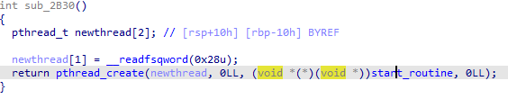


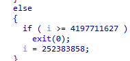

i与v3有关，因此当判断出maps含有frida则程序退出。

#### frida hook

frida hook掉pthread_create函数。

逻辑为：当第四个参数为0时，将第三个参数替换为自定义的函数。

```js
# frida -U -f com.wmctf.ezandroid -l .\frida.js
function hook_AntiFrida_func() {
    var pthread_create_addr = Module.findExportByName("libc.so", "pthread_create");
    Interceptor.attach(pthread_create_addr, {
        onEnter(args) {
            let func_addr = args[2];
            if (args[3] == 0) {
                Interceptor.replace(func_addr, new NativeCallback(function () {
                    console.log("[*] Replace antiFrida success!");
                }, 'void', []))
            }
        }
    });
}
```

### native函数

frida hook脚本：

```js
function hook_RegisterNatives() {
    var symbols = Process.getModuleByName('libart.so').enumerateSymbols();
    var RegisterNatives_addr = null;
    for (let i = 0; i < symbols.length; i++) {
        var symbol = symbols[i];
        if (symbol.name.indexOf("RegisterNatives") != -1 && symbol.name.indexOf("CheckJNI") == -1) {
            RegisterNatives_addr = symbol.address;
        }
    }
    console.log("RegisterNatives_addr: ", RegisterNatives_addr);
    Interceptor.attach(RegisterNatives_addr, {
        onEnter: function (args) {
            var env = Java.vm.tryGetEnv();
            var className = env.getClassName(args[1]);
            var methodCount = args[3].toInt32();
            for (let i = 0; i < methodCount; i++) {
                var methodName = args[2].add(Process.pointerSize * 3 * i).add(Process.pointerSize * 0).readPointer().readCString();
                var signature = args[2].add(Process.pointerSize * 3 * i).add(Process.pointerSize * 1).readPointer().readCString();
                var fnPtr =
                    args[2].add(Process.pointerSize * 3 * i).add(Process.pointerSize * 2).readPointer();
                var module = Process.findModuleByAddress(fnPtr);
                console.log(className, methodName, signature, fnPtr, module.name, fnPtr.sub(module.base));
            }

        }, onLeave: function (retval) {
        }
    })
}
```

得到结果：

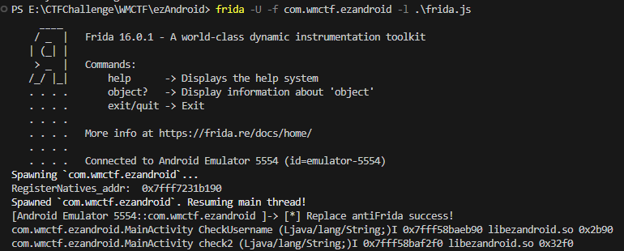

`CheckUsername: 0x2b90`

`check2: 0x32f0`

### SO函数

#### CheckUsername

被混淆了，主要逻辑在这里：

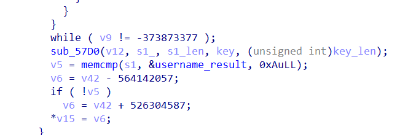

sub_57D0可以明显看出是RC4。

手动分析后，逻辑如下：


RC4初始化一：1-3 -> 1-2 -> 2 -> 1-3

RC4初始化二：7 -> 4 -> 3 -> 7

RC4解密：5 -> 1-1 -> 5

##### 还原代码

知道逻辑就可以了，但这里尝试手动patch还原一下代码。

主要有两类代码需要patch，先展示结果：


###### 第一种

将两段代码之间添加了一条jmp语句，使其去往分发器。

直接去掉jmp语句即可。

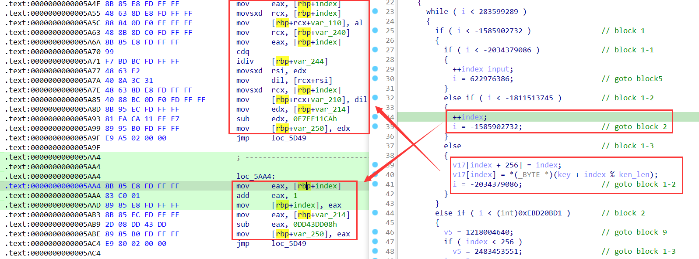

###### 第二种

这就是判断index是否大于256。


看看block7的地址，就在判断的下面：

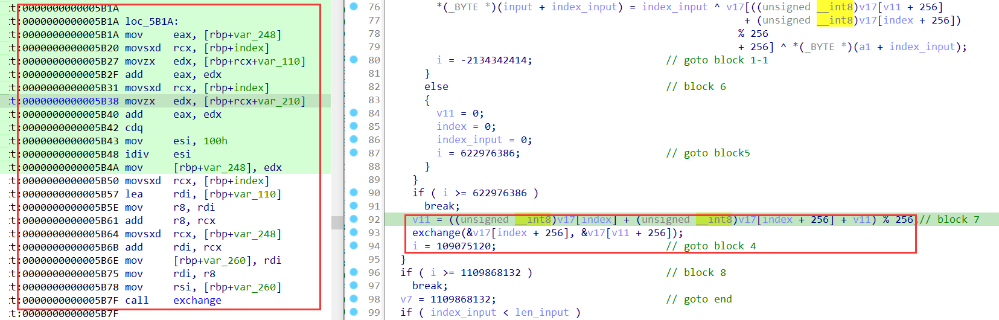

因此直接将汇编：

```assembly
mov     eax, [rbp+index]
mov     ecx, [rbp+var_214]
sub     ecx, 6DD586C3h
mov     edx, [rbp+var_214]
sub     edx, 15E1168Ah
cmp     eax, 100h
cmovl   edx, ecx
loc_5B0F:
mov     [rbp+var_250], edx
jmp     loc_5D49
```

改成：

```assembly
mov     eax, [rbp+index]
cmp     eax, 100h
jge 	loc_5BC0
```

##### frida hook RC4函数的参数

脚本：

```js
function hook_sub_57D0() {
    var soAddr = Module.findBaseAddress("libezandroid.so");
    var sub_57D0 = soAddr.add(0x57D0);
    Interceptor.attach(sub_57D0, {
        onEnter: function (args) {
            console.log("[*] sub_57D0 called!");
            console.log("arg0: " + args[0].readCString());
            console.log("arg1: " + args[1].readCString());
            console.log("arg2: " + args[2]);
            console.log("arg3: " + args[3].readCString());
            console.log("arg4: " + args[4]);
        }, onLeave: function (retval) {
        }
    });
}
```

结果：


可见密钥是：`12345678`

注意到加密的时候还异或了index：


因此解密：

```python
from Crypto.Cipher import ARC4
def rc4_decrypt(key, ciphertext):
    cipher = ARC4.new(key.encode('utf-8'))
    plaintext = cipher.decrypt(ciphertext)
    return plaintext
key = "12345678"
ciphertext = bytearray([0xE9, 0x97, 0x64, 0xE6, 0x7E, 0xEB, 0xBD, 0xC1, 0xAB, 0x43])
plaintext = list(rc4_decrypt(key, ciphertext))
for i in range(len(plaintext)):
    plaintext[i] ^= i
print(bytearray(plaintext))
# Re_1s_eaSy
```

#### check2

同样是被混淆了，主题逻辑在这：

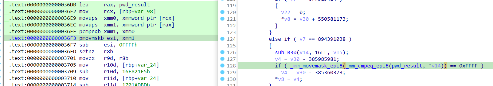

> 1. `movups xmm0, xmmword ptr [rcx]`: 将`rcx`寄存器指向的内存中的128位数据加载到`xmm0`寄存器中。
> 2. `movups xmm1, xmmword ptr [rax]`: 将`rax`寄存器指向的内存中的128位数据加载到`xmm1`寄存器中。
> 3. `pcmpeqb xmm1, xmm0`: 执行128位数据的比较操作，将比较结果保存在`xmm1`寄存器中。这里的`pcmpeqb`指令是用于比较两个XMM寄存器中的数据是否相等，结果是每个字节的比较结果（相等为0xFF，不等为0x00）。
> 4. `pmovmskb esi, xmm1`: 将`xmm1`寄存器中的比较结果按位转换成一个32位整数，并将结果保存在`esi`寄存器中。这个操作通常用于提取比较结果的掩码，其中每个位表示一个字节是否相等。

因此，也是一个加密，比对的过程。

##### 分析加密过程

由findcrypt找到AES特征，交叉引用看一下各个函数：

字节代换：

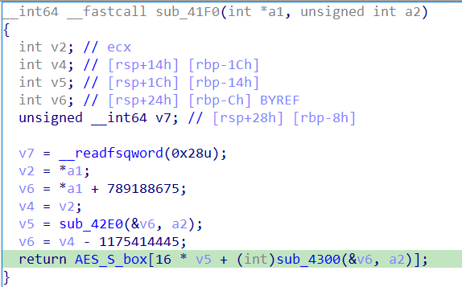

轮密钥生成的T函数：

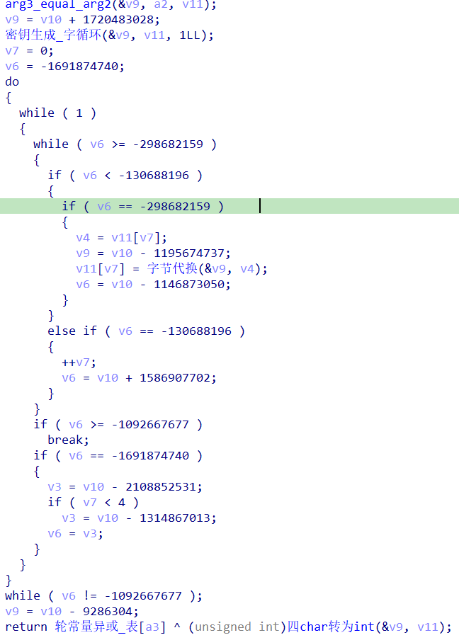

大概猜测其为AES。

注意到AES的Sbox盒在看交叉引用时有被赋值的操作，且`sub_2690`在`.init_array`中，表明SBOX表被更换了：

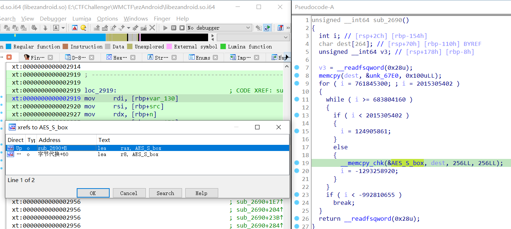

这里同样使用frida获取其参数：

```js
function hook_sub_B30() {
    var soAddr = Module.findBaseAddress("libezandroid.so");
    var sub_B30 = soAddr.add(0xB30);
    Interceptor.attach(sub_B30, {
        onEnter: function (args) {
            console.log("[*] sub_AFC called!");
            console.log("arg0: " + args[0].readCString());
            console.log("arg1: " + args[1]);
            console.log("arg2: " + args[2].readCString());
        }, onLeave:function (retval) {

        }
    })
}
```

结果：


故解密：

```C
#include <stdio.h>
#include <string.h>
#include <time.h>
#include <windows.h>

#define Nb 4  // 数据块行数
#define Nk 4  // 密码块行数
#define Nr 10 // 轮加密次数

unsigned char RoundKey[4 * Nb * (Nr + 1)]; // 轮密钥
unsigned char Key[17];                     // 密钥
unsigned char state[4][4];                 // 明文加密状态

// 实际上只需要用Rocn[1-10] 
// 轮常量
int Rcon[255] = {
    0x8d, 0x01, 0x02, 0x04, 0x08, 0x10, 0x20, 0x40, 0x80, 0x1b, 0x36, 0x6c, 0xd8, 0xab, 0x4d, 0x9a,
    0x2f, 0x5e, 0xbc, 0x63, 0xc6, 0x97, 0x35, 0x6a, 0xd4, 0xb3, 0x7d, 0xfa, 0xef, 0xc5, 0x91, 0x39,
    0x72, 0xe4, 0xd3, 0xbd, 0x61, 0xc2, 0x9f, 0x25, 0x4a, 0x94, 0x33, 0x66, 0xcc, 0x83, 0x1d, 0x3a,
    0x74, 0xe8, 0xcb, 0x8d, 0x01, 0x02, 0x04, 0x08, 0x10, 0x20, 0x40, 0x80, 0x1b, 0x36, 0x6c, 0xd8,
    0xab, 0x4d, 0x9a, 0x2f, 0x5e, 0xbc, 0x63, 0xc6, 0x97, 0x35, 0x6a, 0xd4, 0xb3, 0x7d, 0xfa, 0xef,
    0xc5, 0x91, 0x39, 0x72, 0xe4, 0xd3, 0xbd, 0x61, 0xc2, 0x9f, 0x25, 0x4a, 0x94, 0x33, 0x66, 0xcc,
    0x83, 0x1d, 0x3a, 0x74, 0xe8, 0xcb, 0x8d, 0x01, 0x02, 0x04, 0x08, 0x10, 0x20, 0x40, 0x80, 0x1b,
    0x36, 0x6c, 0xd8, 0xab, 0x4d, 0x9a, 0x2f, 0x5e, 0xbc, 0x63, 0xc6, 0x97, 0x35, 0x6a, 0xd4, 0xb3,
    0x7d, 0xfa, 0xef, 0xc5, 0x91, 0x39, 0x72, 0xe4, 0xd3, 0xbd, 0x61, 0xc2, 0x9f, 0x25, 0x4a, 0x94,
    0x33, 0x66, 0xcc, 0x83, 0x1d, 0x3a, 0x74, 0xe8, 0xcb, 0x8d, 0x01, 0x02, 0x04, 0x08, 0x10, 0x20,
    0x40, 0x80, 0x1b, 0x36, 0x6c, 0xd8, 0xab, 0x4d, 0x9a, 0x2f, 0x5e, 0xbc, 0x63, 0xc6, 0x97, 0x35,
    0x6a, 0xd4, 0xb3, 0x7d, 0xfa, 0xef, 0xc5, 0x91, 0x39, 0x72, 0xe4, 0xd3, 0xbd, 0x61, 0xc2, 0x9f,
    0x25, 0x4a, 0x94, 0x33, 0x66, 0xcc, 0x83, 0x1d, 0x3a, 0x74, 0xe8, 0xcb, 0x8d, 0x01, 0x02, 0x04,
    0x08, 0x10, 0x20, 0x40, 0x80, 0x1b, 0x36, 0x6c, 0xd8, 0xab, 0x4d, 0x9a, 0x2f, 0x5e, 0xbc, 0x63,
    0xc6, 0x97, 0x35, 0x6a, 0xd4, 0xb3, 0x7d, 0xfa, 0xef, 0xc5, 0x91, 0x39, 0x72, 0xe4, 0xd3, 0xbd,
    0x61, 0xc2, 0x9f, 0x25, 0x4a, 0x94, 0x33, 0x66, 0xcc, 0x83, 0x1d, 0x3a, 0x74, 0xe8, 0xcb};

// s盒
int SBOX[256] = {
    // 0     1    2      3     4    5     6     7      8    9     A      B    C     D     E     F
    0x29, 0x40, 0x57, 0x6E, 0x85, 0x9C, 0xB3, 0xCA, 0xE1, 0xF8, 0x0F, 0x26, 0x3D, 0x54, 0x6B, 0x82,
    0x99, 0xB0, 0xC7, 0xDE, 0xF5, 0x0C, 0x23, 0x3A, 0x51, 0x68, 0x7F, 0x96, 0xAD, 0xC4, 0xDB, 0xF2,
    0x09, 0x20, 0x37, 0x4E, 0x65, 0x7C, 0x93, 0xAA, 0xC1, 0xD8, 0xEF, 0x06, 0x1D, 0x34, 0x4B, 0x62,
    0x79, 0x90, 0xA7, 0xBE, 0xD5, 0xEC, 0x03, 0x1A, 0x31, 0x48, 0x5F, 0x76, 0x8D, 0xA4, 0xBB, 0xD2,
    0xE9, 0x00, 0x17, 0x2E, 0x45, 0x5C, 0x73, 0x8A, 0xA1, 0xB8, 0xCF, 0xE6, 0xFD, 0x14, 0x2B, 0x42,
    0x59, 0x70, 0x87, 0x9E, 0xB5, 0xCC, 0xE3, 0xFA, 0x11, 0x28, 0x3F, 0x56, 0x6D, 0x84, 0x9B, 0xB2,
    0xC9, 0xE0, 0xF7, 0x0E, 0x25, 0x3C, 0x53, 0x6A, 0x81, 0x98, 0xAF, 0xC6, 0xDD, 0xF4, 0x0B, 0x22,
    0x39, 0x50, 0x67, 0x7E, 0x95, 0xAC, 0xC3, 0xDA, 0xF1, 0x08, 0x1F, 0x36, 0x4D, 0x64, 0x7B, 0x92,
    0xA9, 0xC0, 0xD7, 0xEE, 0x05, 0x1C, 0x33, 0x4A, 0x61, 0x78, 0x8F, 0xA6, 0xBD, 0xD4, 0xEB, 0x02,
    0x19, 0x30, 0x47, 0x5E, 0x75, 0x8C, 0xA3, 0xBA, 0xD1, 0xE8, 0xFF, 0x16, 0x2D, 0x44, 0x5B, 0x72,
    0x89, 0xA0, 0xB7, 0xCE, 0xE5, 0xFC, 0x13, 0x2A, 0x41, 0x58, 0x6F, 0x86, 0x9D, 0xB4, 0xCB, 0xE2,
    0xF9, 0x10, 0x27, 0x3E, 0x55, 0x6C, 0x83, 0x9A, 0xB1, 0xC8, 0xDF, 0xF6, 0x0D, 0x24, 0x3B, 0x52,
    0x69, 0x80, 0x97, 0xAE, 0xC5, 0xDC, 0xF3, 0x0A, 0x21, 0x38, 0x4F, 0x66, 0x7D, 0x94, 0xAB, 0xC2,
    0xD9, 0xF0, 0x07, 0x1E, 0x35, 0x4C, 0x63, 0x7A, 0x91, 0xA8, 0xBF, 0xD6, 0xED, 0x04, 0x1B, 0x32,
    0x49, 0x60, 0x77, 0x8E, 0xA5, 0xBC, 0xD3, 0xEA, 0x01, 0x18, 0x2F, 0x46, 0x5D, 0x74, 0x8B, 0xA2,
    0xB9, 0xD0, 0xE7, 0xFE, 0x15, 0x2C, 0x43, 0x5A, 0x71, 0x88, 0x9F, 0xB6, 0xCD, 0xE4, 0xFB, 0x12

};

// 逆s盒
int R_SBOX[256] = {
    0x41, 0xe8, 0x8f, 0x36, 0xdd, 0x84, 0x2b, 0xd2, 0x79, 0x20, 0xc7, 0x6e, 0x15, 0xbc, 0x63, 0xa, 0xb1, 0x58, 0xff, 0xa6, 0x4d, 0xf4, 0x9b, 0x42, 0xe9, 0x90, 0x37, 0xde, 0x85, 0x2c, 0xd3, 0x7a, 0x21, 0xc8, 0x6f, 0x16, 0xbd, 0x64, 0xb, 0xb2, 0x59, 0x0, 0xa7, 0x4e, 0xf5, 0x9c, 0x43, 0xea, 0x91, 0x38, 0xdf, 0x86, 0x2d, 0xd4, 0x7b, 0x22, 0xc9, 0x70, 0x17, 0xbe, 0x65, 0xc, 0xb3, 0x5a, 0x1, 0xa8, 0x4f, 0xf6, 0x9d, 0x44, 0xeb, 0x92, 0x39, 0xe0, 0x87, 0x2e, 0xd5, 0x7c, 0x23, 0xca, 0x71, 0x18, 0xbf, 0x66, 0xd, 0xb4, 0x5b, 0x2, 0xa9, 0x50, 0xf7, 0x9e, 0x45, 0xec, 0x93, 0x3a, 0xe1, 0x88, 0x2f, 0xd6, 0x7d, 0x24, 0xcb, 0x72, 0x19, 0xc0, 0x67, 0xe, 0xb5, 0x5c, 0x3, 0xaa, 0x51, 0xf8, 0x9f, 0x46, 0xed, 0x94, 0x3b, 0xe2, 0x89, 0x30, 0xd7, 0x7e, 0x25, 0xcc, 0x73, 0x1a, 0xc1, 0x68, 0xf, 0xb6, 0x5d, 0x4, 0xab, 0x52, 0xf9, 0xa0, 0x47, 0xee, 0x95, 0x3c, 0xe3, 0x8a, 0x31, 0xd8, 0x7f, 0x26, 0xcd, 0x74, 0x1b, 0xc2, 0x69, 0x10, 0xb7, 0x5e, 0x5, 0xac, 0x53, 0xfa, 0xa1, 0x48, 0xef, 0x96, 0x3d, 0xe4, 0x8b, 0x32, 0xd9, 0x80, 0x27, 0xce, 0x75, 0x1c, 0xc3, 0x6a, 0x11, 0xb8, 0x5f, 0x6, 0xad, 0x54, 0xfb, 0xa2, 0x49, 0xf0, 0x97, 0x3e, 0xe5, 0x8c, 0x33, 0xda, 0x81, 0x28, 0xcf, 0x76, 0x1d, 0xc4, 0x6b, 0x12, 0xb9, 0x60, 0x7, 0xae, 0x55, 0xfc, 0xa3, 0x4a, 0xf1, 0x98, 0x3f, 0xe6, 0x8d, 0x34, 0xdb, 0x82, 0x29, 0xd0, 0x77, 0x1e, 0xc5, 0x6c, 0x13, 0xba, 0x61, 0x8, 0xaf, 0x56, 0xfd, 0xa4, 0x4b, 0xf2, 0x99, 0x40, 0xe7, 0x8e, 0x35, 0xdc, 0x83, 0x2a, 0xd1, 0x78, 0x1f, 0xc6, 0x6d, 0x14, 0xbb, 0x62, 0x9, 0xb0, 0x57, 0xfe, 0xa5, 0x4c, 0xf3, 0x9a};

// 在一行上进位移
void rotWord(unsigned char temp[])
{
    int i, k = temp[0];
    for (i = 1; i < 4; i++)
        temp[i - 1] = temp[i];
    temp[3] = k;
}

// 在一行上进行s盒替换
void subWord(unsigned char temp[])
{
    int i;
    for (i = 0; i < 4; i++)
        temp[i] = SBOX[temp[i]];
}

// 密钥扩展，最终得到Nr+1个轮密钥，用于轮次加密
void keyExpansion()
{
    int i, j;
    unsigned char temp[5];
    memset(RoundKey, 0, sizeof(RoundKey));

    for (i = 0; i < Nk; i++)
    {
        for (j = 0; j < 4; j++)
        {
            RoundKey[i * 4 + j] = Key[i * 4 + j];
        }
    }

    while (i < (Nb * (Nr + 1)))
    {
        for (j = 0; j < 4; j++)
        {
            temp[j] = RoundKey[(i - 1) * 4 + j];
        }
        if (i % Nk == 0)
        {
            rotWord(temp);
            subWord(temp);
            temp[0] ^= Rcon[i / Nk];
        }

        for (j = 0; j < 4; j++)
            RoundKey[i * 4 + j] = RoundKey[(i - Nk) * 4 + j] ^ temp[j];
        i++;
    }
}

// 轮密钥加函数，将明文加密状态与轮密钥简单异或
void addRoundKey(int round)
{
    int i, j;
    for (i = 0; i < 4; i++)
    {
        for (j = 0; j < 4; j++)
        {
            state[i][j] ^= RoundKey[round * Nb * 4 + i * Nb + j];
        }
    }
}

// s盒替换函数
void subBytes()
{
    int i, j;
    for (i = 0; i < 4; i++)
    {
        for (j = 0; j < 4; j++)
        {
            state[i][j] = SBOX[state[i][j]];
        }
    }
}

// 逆s盒替换函数
void invSubBytes()
{
    int i, j;
    for (i = 0; i < 4; i++)
    {
        for (j = 0; j < 4; j++)
        {
            state[i][j] = R_SBOX[state[i][j]];
        }
    }
}

// 行位移函数
void shiftRows()
{
    int i, j, k;
    int shiftnum = 1;
    unsigned char tmp;
    for (j = 1; j < 4; j++)
    {
        for (i = 0; i < shiftnum; i++)
        {
            tmp = state[0][j];
            for (k = 0; k < 3; k++)
                state[k][j] = state[k + 1][j];
            state[3][j] = tmp;
        }
        shiftnum++;
    }
}

// 逆行位移函数
void invShiftRows()
{
    int i, j, k;
    int shiftnum = 1;
    unsigned char tmp;
    for (j = 1; j < 4; j++)
    {
        for (i = 0; i < shiftnum; i++)
        {
            tmp = state[3][j];
            for (k = 3; k > 0; k--)
                state[k][j] = state[k - 1][j];
            state[0][j] = tmp;
        }
        shiftnum++;
    }
}

// 列混淆函数
#define xtime(x) ((x << 1) ^ (((x >> 7) & 1) * 0x1b))
void mixColumns()
{
    int i, j;
    unsigned char tmp, t, p;
    for (i = 0; i < 4; i++)
    {
        p = state[i][0];
        tmp = state[i][0] ^ state[i][1] ^ state[i][2] ^ state[i][3];
        for (j = 0; j < 3; j++)
        {
            t = state[i][j] ^ state[i][j + 1];
            t = xtime(t);
            state[i][j] ^= t ^ tmp;
        }
        t = state[i][3] ^ p;
        t = xtime(t);
        state[i][3] ^= t ^ tmp;
    }
}

// 逆列混淆函数
#define Multiply(x, y) (((y & 1) * x) ^ ((y >> 1 & 1) * xtime(x)) ^ ((y >> 2 & 1) * xtime(xtime(x))) ^ ((y >> 3 & 1) * xtime(xtime(xtime(x)))) ^ ((y >> 4 & 1) * xtime(xtime(xtime(xtime(x))))))
void invMixColumns()
{
    int i;
    unsigned char a, b, c, d;
    for (i = 0; i < 4; i++)
    {
        a = state[i][0];
        b = state[i][1];
        c = state[i][2];
        d = state[i][3];

        state[i][0] = Multiply(a, 0x0e) ^ Multiply(b, 0x0b) ^ Multiply(c, 0x0d) ^ Multiply(d, 0x09);
        state[i][1] = Multiply(a, 0x09) ^ Multiply(b, 0x0e) ^ Multiply(c, 0x0b) ^ Multiply(d, 0x0d);
        state[i][2] = Multiply(a, 0x0d) ^ Multiply(b, 0x09) ^ Multiply(c, 0x0e) ^ Multiply(d, 0x0b);
        state[i][3] = Multiply(a, 0x0b) ^ Multiply(b, 0x0d) ^ Multiply(c, 0x09) ^ Multiply(d, 0x0e);
    }
}

// aes加密函数，key为密钥，input为需要加密的128位明文，output为输出128位密文
void aes_enc(unsigned char *key, unsigned char *input, unsigned char *output)
{
    int i, j, round = 0;
    memset(Key, 0, sizeof(Key));
    for (i = 0; i < Nk * 4; i++)
    {
        Key[i] = key[i];
    }

    keyExpansion();

    memset(state, 0, sizeof(state));
    for (i = 0; i < 4; i++)
    {
        for (j = 0; j < 4; j++)
            state[i][j] = input[i * 4 + j];
    }
    addRoundKey(0);
    for (round = 1; round < Nr; round++)
    {
        subBytes();
        shiftRows();
        mixColumns();
        addRoundKey(round);
    }

    subBytes();
    shiftRows();
    addRoundKey(Nr);

    for (i = 0; i < 4; i++)
    {
        for (j = 0; j < 4; j++)
            output[i * 4 + j] = state[i][j];
    }
}

// aes解密函数，key为密钥，input为需要解密的128位密文，output为输出128位明文
void aes_dec(unsigned char *key, unsigned char *input, unsigned char *output)
{
    int i, j, round = 0;
    memset(Key, 0, sizeof(Key));
    for (i = 0; i < Nk * 4; i++)
    {
        Key[i] = key[i];
    }

    keyExpansion();

    memset(state, 0, sizeof(state));
    for (i = 0; i < 4; i++)
    {
        for (j = 0; j < 4; j++)
            state[i][j] = input[i * 4 + j];
    }
    addRoundKey(Nr);
    for (round = Nr - 1; round > 0; round--)
    {
        invSubBytes();
        invShiftRows();
        addRoundKey(round);
        invMixColumns();
    }

    invSubBytes();
    invShiftRows();
    addRoundKey(0);

    for (i = 0; i < 4; i++)
    {
        for (j = 0; j < 4; j++)
            output[i * 4 + j] = state[i][j];
    }
}

void gets_t(unsigned char *str)
{
    char fin_input;
    scanf("%66s", str);
    do
        fin_input = getchar();
    while (fin_input != '\n');
}

int main()
{   
    // Re_1s_eaSy123456
    unsigned char key[17] = {82, 101, 95, 49, 115, 95, 101, 97, 83, 121, 49, 50, 51, 52, 53, 54};
    unsigned char input[17] = "1111222233334444";
    unsigned char enc[17] = {
        43,
        200,
        32,
        139,
        92,
        13,
        167,
        155,
        42,
        81,
        58,
        210,
        113,
        113,
        202,
        80,
    };
    unsigned char dec[17] = {0};
    printf("dec-----\n");
    aes_dec(key, enc, dec);
    for (int i = 0; i < 16; i++)
    {
        printf("%c", dec[i]);
    }
    return 0;
}
```

## BabyAnti-2.0

[2023 WMCTF writeup by W4ntY0u (qq.com)](https://mp.weixin.qq.com/s/hpLSfXtc1pYPtvz3734iLA)

[WMCTF 2023 wp - LaoGong - 飞书云文档 (feishu.cn)](https://pmxq1w80w6.feishu.cn/docx/RxBpdtPkHopGnLxXVNQcUrl5nhd)

[WMCTF2023-REVERSE_Blu3e的博客-CSDN博客](https://blog.csdn.net/m0_68757308/article/details/132794842)

### patch libanticheat.so

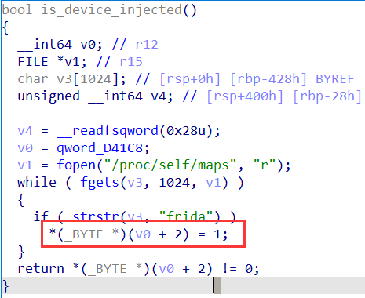

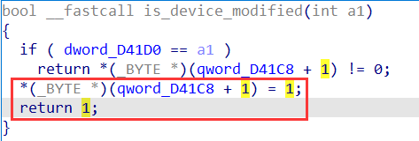


### 方法一 —— patch libapp.so

直接搜索5000（0x1388），将两个cmp改为个位数：

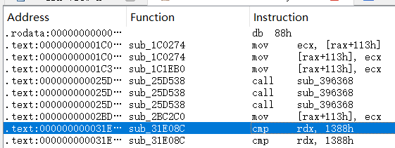

随便玩玩就有flag。

### 方法二 —— patch smali代码后用CE

由于apk中也有检测是否更改的分的方法，也需要更改：

> `const/4 p1, 0`：这行代码将值 0 存储到参数寄存器 p1 中

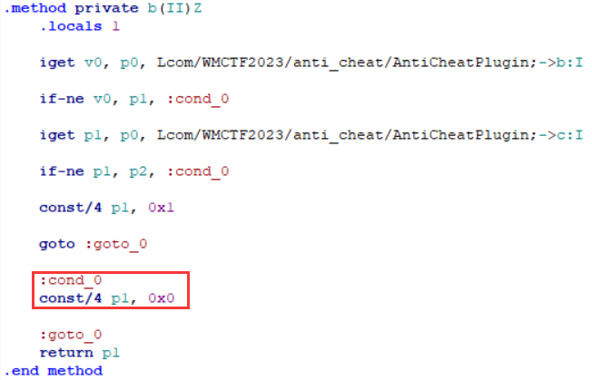

然后CE（进程为Ld9BoxHeadless.exe）搜索，得分改为5000。

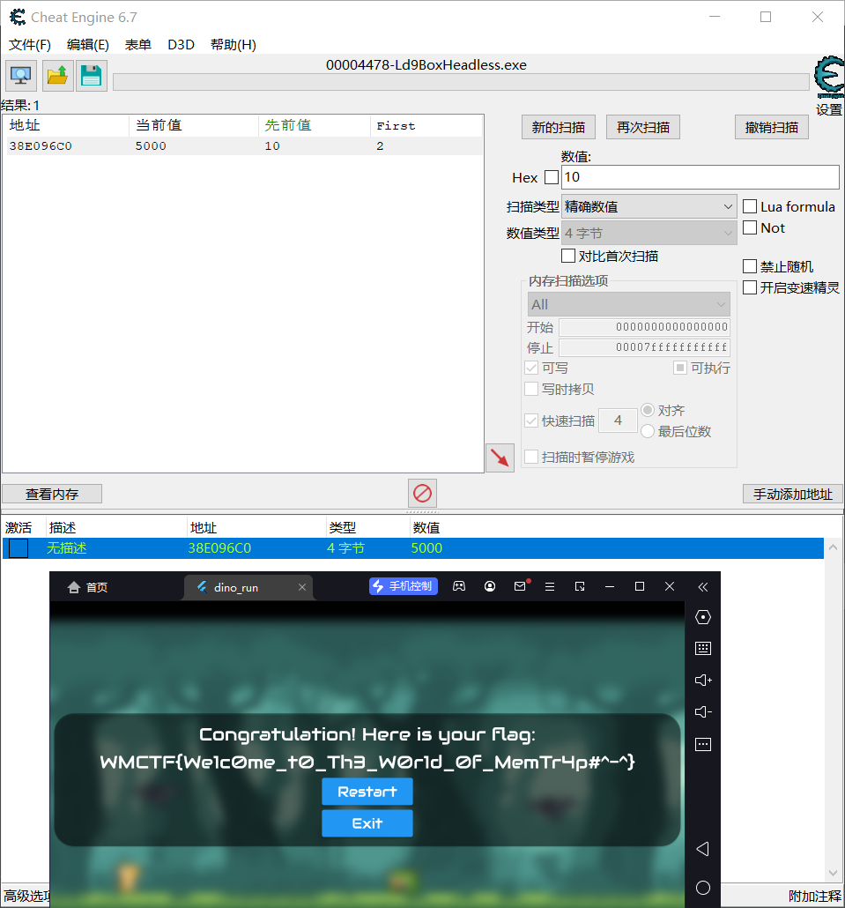

# 羊城杯

## babyobfu

### 去混淆

动调可以看出大概逻辑，主要靠一个函数修复代码段，之后还会还原。

设置条件断点进行patch：

```python
def repair_code(start, l, num):
	s = []
	for i in range(4):
		s.append((num >> (8 * i)) & 0xFF)
	for i in range(l):
		data = Byte(start + i)
		PatchByte(start + i, data ^ ((i + 0xCE) & 0xFF) ^ s[i % 4])


rsp = GetRegValue("rsp")
retrun_addr = Qword(GetRegValue("rsp"))
if retrun_addr == 0x403783:
	retrun_addr = Qword(rsp + 0x30)
FunAddr = retrun_addr - 0x5
CodeAddress = GetRegValue("rdi")
Length = GetRegValue("rsi")
XorNum = GetRegValue("edx")
if retrun_addr == CodeAddress:
	for j in range(5):
		PatchByte(FunAddr + j, 0x90)
	repair_code(CodeAddress, Length, XorNum)
	SetRegValue(0x40375F, "EIP")
else:
	for j in range(5):
		PatchByte(FunAddr + j, 0x90)
	SetRegValue(0x40375F, "EIP")
print(f"[+] Repair Date from {hex(FunAddr) = }:{hex(CodeAddress) = }")
```

多输入，执行几次，main函数就可以反编译了。

对于这样子的剩余混淆，分析的时候手动patch一下就好，很好辨认。


### 逻辑分析

检测输入长度以及格式为0-9，a-f。

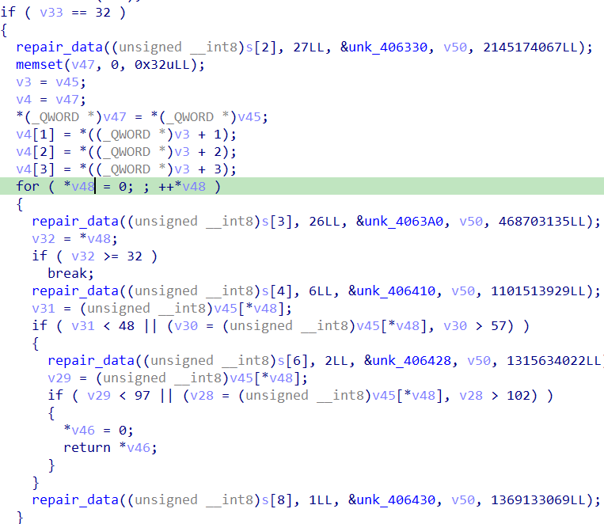

sub_401980是将输入进行更改，后面的循环为更改的输入两个Byte拼接为一个Byte。

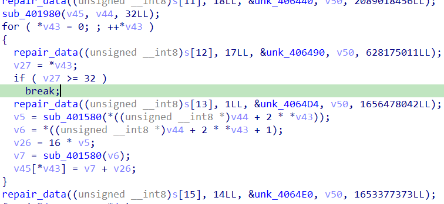

sub_401980：其中的数据可以动态获取


加密过程：

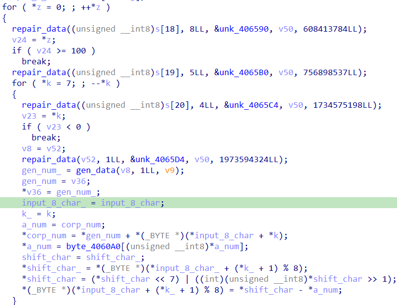

最后比较：


### exp

```python
import struct

def change(num):
    if 0 <= num <= 9:
        return num + 0x30
    elif 10 <= num <= 15:
        return num + 97 - 10
    return 0


def add(a, b):
    if a + b >= 0x256:
        return (a + b - 1) & 0xFF
    else:
        return (a + b) & 0xFF

data = [
    0xd4, 0xfd, 0x80, 0xc4, 0x50, 0x10, 0xde, 0x6d, 0xe8, 0xf0, 0xc, 0x52, 0x9, 0x40, 0x24, 0x97, 0xde, 0x77, 0x14,
    0x5f, 0x69, 0xf6, 0xc0, 0x74, 0x8e, 0x6d, 0x80, 0xce, 0xcc, 0x7, 0xc0, 0xf4, 0xa0, 0x4, 0xf0, 0x1c, 0xc6, 0x0, 0xa2,
    0x58, 0xf4, 0x34, 0x40, 0xb0, 0x4c, 0xa0, 0xa8, 0x56, 0x59, 0xe9, 0x38, 0x28, 0xd0, 0x68, 0x40, 0x66, 0x96, 0x45,
    0xd2, 0x67, 0x40, 0xd0, 0x24, 0x0, 0x13, 0x4c, 0xca, 0x78, 0x4c, 0xbc, 0xc0, 0x42, 0x0, 0x10, 0x6d, 0xc0, 0x0, 0x38,
    0xb0, 0x4, 0xc4, 0x48, 0x80, 0xe8, 0x71, 0xff, 0x40, 0x84, 0x46, 0x54, 0x25, 0x7a, 0x38, 0x20, 0xf8, 0xc0, 0x38,
    0x94, 0xf9, 0x70, 0xe4, 0xfa, 0x70, 0x8, 0x40, 0x33, 0xe7, 0x68, 0xb0, 0xd6, 0x20, 0xfb, 0x81, 0x4c, 0x2e, 0x8a,
    0x1b, 0x3a, 0x92, 0x78, 0xe8, 0x24, 0x22, 0x27, 0x5c, 0xd2, 0x14, 0x8a, 0xb0, 0x60, 0x64, 0x20, 0x10, 0xe5, 0xd1,
    0x5c, 0xe9, 0x79, 0x52, 0x34, 0x67, 0x80, 0x4c, 0xe2, 0x20, 0xa0, 0x54, 0xdf, 0x28, 0x30, 0xf0, 0x86, 0xad, 0xc5,
    0x85, 0x71, 0xc0, 0x4e, 0xba, 0xcc, 0x98, 0x23, 0x56, 0x12, 0x90, 0xc9, 0x5b, 0x54, 0x54, 0x48, 0xba, 0xac, 0x2c,
    0xdc, 0x22, 0x90, 0xe8, 0x18, 0x8c, 0x81, 0x44, 0x31, 0x84, 0x80, 0xe8, 0x8a, 0xe0, 0x8c, 0xba, 0xfa, 0xbc, 0xe6,
    0xf0, 0x9e, 0x66, 0xda, 0x54, 0xa1, 0xc8, 0x1e, 0x90, 0xf0, 0x93, 0x39, 0x50, 0x18, 0x99, 0x95, 0x48, 0x81, 0xa0,
    0x4a, 0xb0, 0x6a, 0x80, 0x7b, 0xb0, 0xc8, 0x9d, 0x39, 0xfb, 0x7e, 0x74, 0x40, 0x80, 0x2a, 0x90, 0x60, 0x4a, 0xe2,
    0xda, 0x0, 0xe, 0xc0, 0xe0, 0xbe, 0x6, 0xc5, 0x61, 0xd4, 0x9c, 0x33, 0x88, 0x40, 0x70, 0x78, 0xf2, 0x7c, 0xac, 0xb0,
    0xf8, 0xcb, 0xcc, 0x3e, 0xea, 0x64, 0xa0, 0xbe, 0xac, 0xa, 0xd4, 0x30, 0x58, 0x4d, 0x74, 0x48, 0x90, 0x18, 0xea,
    0x10, 0xc0, 0x0, 0x5, 0xa0, 0x4e, 0xdd, 0xec, 0xa8, 0x10, 0xe0, 0x20, 0x42, 0x9, 0x64, 0x40, 0x94, 0x93, 0x90, 0x61,
    0x2, 0x3a, 0x39, 0xdf, 0x9a, 0x3c, 0x29, 0x6f, 0xe7, 0x10, 0xb3, 0x4b, 0xd3, 0x9d, 0xb2, 0x5b, 0x7, 0x84, 0xf0,
    0x3b, 0xbe, 0xce, 0xb6, 0xbc, 0xa, 0x48, 0xb8, 0x63, 0x48, 0xfa, 0x68, 0x74, 0xe4, 0xf8, 0xac, 0x16, 0x97, 0x8e,
    0x2a, 0xe9, 0x4c, 0x2c, 0xeb, 0x68, 0x82, 0xb8, 0x24, 0x92, 0x6, 0xb9, 0xa2, 0xf0, 0x90, 0xea, 0xaa, 0xe4, 0xa,
    0x7b, 0x40, 0x5c, 0xfc, 0xbe, 0x54, 0x90, 0x81, 0x44, 0xf4, 0x37, 0xa0, 0x93, 0x65, 0x20, 0x16, 0x82, 0xcd, 0xae,
    0x24, 0x0, 0x29, 0xa0, 0x8b, 0x44, 0xfb, 0xe4, 0x58, 0xd5, 0xc0, 0x9c, 0x84, 0xd, 0x8d, 0xcf, 0x50, 0x28, 0x8, 0x8c,
    0xbe, 0x6c, 0xbc, 0x18, 0x8, 0x9, 0x59, 0xad, 0xcc, 0xf8, 0x1c, 0x78, 0x28, 0xbd, 0x5a, 0x31, 0xde, 0x0, 0x6c, 0x61,
    0x8b, 0x23, 0xb0, 0x85, 0x8d, 0x14, 0x3f, 0x98, 0x68, 0x3, 0xac, 0xc0, 0x73, 0x96, 0x20, 0x3a, 0xc2, 0x6c, 0x40,
    0x31, 0x70, 0x98, 0x2e, 0x90, 0x16, 0xba, 0xfe, 0xc3, 0x81, 0x98, 0x77, 0xc4, 0xbb, 0x73, 0xf8, 0x3a, 0x11, 0x70,
    0x11, 0x7c, 0x1d, 0x98, 0x84, 0xc, 0x1f, 0x5a, 0x4d, 0xb3, 0xc0, 0x31, 0xb0, 0x21, 0x4c, 0x9c, 0x20, 0xe6, 0x6c,
    0x89, 0xc0, 0x79, 0xbf, 0x35, 0xa8, 0x66, 0x89, 0xc8, 0x22, 0x76, 0xc0, 0x8a, 0xc1, 0x70, 0xd8, 0x2d, 0xd9, 0xb6,
    0x80, 0x38, 0x8c, 0x80, 0xd0, 0x2e, 0x23, 0x40, 0xab, 0x7b, 0xc7, 0xdd, 0x34, 0x4b, 0xf4, 0xc0, 0x3f, 0xb2, 0xcd,
    0x61, 0x91, 0x30, 0xd8, 0xbc, 0xe4, 0xcb, 0x48, 0xa5, 0xcc, 0x82, 0xb2, 0x18, 0xf3, 0x1e, 0x96, 0x71, 0x59, 0x1e,
    0x9c, 0x68, 0x3b, 0xe8, 0x41, 0xa8, 0x8, 0x75, 0xd0, 0x84, 0xf8, 0xd6, 0xc, 0xdd, 0x40, 0x6b, 0x33, 0xa4, 0x7c,
    0x20, 0x96, 0x4f, 0x2f, 0xb8, 0x12, 0xc8, 0x16, 0x40, 0xe8, 0xa0, 0x2d, 0x70, 0x10, 0xbd, 0x60, 0x4c, 0xdc, 0x39,
    0xab, 0x59, 0x61, 0x71, 0xd0, 0xc0, 0xeb, 0xf0, 0xfe, 0xaa, 0xd4, 0x5c, 0xfc, 0x93, 0xf8, 0xf9, 0x44, 0x61, 0x40,
    0x18, 0xe6, 0x86, 0x7e, 0x3, 0x50, 0x17, 0xb8, 0xab, 0x10, 0x82, 0x42, 0x9, 0x44, 0xe0, 0x96, 0xca, 0xd4, 0xa, 0x46,
    0x9c, 0x6b, 0xd2, 0x92, 0xcd, 0x90, 0x40, 0x2e, 0x6b, 0x10, 0x53, 0x60, 0xa7, 0x97, 0x63, 0xda, 0x82, 0x29, 0xc6,
    0x0, 0x70, 0xac, 0xbc, 0x4a, 0x40, 0x4, 0xe0, 0x74, 0xb0, 0xb0, 0x80, 0x30, 0xdc, 0x70, 0x6c, 0x40, 0x7e, 0xd0,
    0x90, 0x9d, 0x2d, 0x87, 0xb8, 0xc5, 0x64, 0xd, 0xdc, 0x5e, 0x60, 0xd7, 0xc, 0xdb, 0x0, 0x80, 0x21, 0x17, 0xdd, 0xb8,
    0x20, 0xfd, 0x8f, 0x0, 0xb8, 0x18, 0x1c, 0x4, 0xff, 0xb1, 0x68, 0xc4, 0xe9, 0xab, 0x84, 0x6b, 0x82, 0x80, 0x14,
    0x44, 0xc8, 0x6a, 0x21, 0xfa, 0x34, 0xa6, 0xf9, 0x5b, 0xd8, 0x5e, 0xf0, 0xd3, 0xef, 0x92, 0xf6, 0xf3, 0xc6, 0x7e,
    0xe3, 0x88, 0x2d, 0xe5, 0xf6, 0xbf, 0x90, 0xbe, 0xe4, 0x30, 0xa8, 0x3b, 0x8c, 0xc8, 0xec, 0x36, 0xec, 0x0, 0xb0,
    0x4, 0xf8, 0xb8, 0x4f, 0x40, 0xc2, 0xf8, 0x7c, 0xd1, 0x7b, 0x30, 0xb4, 0x88, 0x6b, 0xa0, 0x0, 0x70, 0x59, 0x14,
    0x85, 0xd7, 0x8c, 0x44, 0x29, 0xa3, 0xe9, 0xc0, 0x2f, 0xa6, 0xe4, 0xe6, 0xfb, 0xb9, 0xbc, 0xb4, 0x36, 0xd4, 0x9c,
    0xd0, 0x28, 0x64, 0x4, 0x84, 0x10, 0x35, 0x60, 0xc8, 0x1a, 0xc0, 0xed, 0x13, 0x5f, 0x9a, 0xf0, 0xea, 0x60, 0xdb,
    0x80, 0x4b, 0xef, 0xce, 0x9f, 0x70, 0xff, 0x0, 0x23, 0x9d, 0x8a, 0xa4, 0xb0, 0xd0, 0x62, 0x68, 0x2f, 0x80, 0x75,
    0x74, 0xd, 0xde, 0x0, 0x60, 0x31, 0x40, 0xc3, 0x90, 0x94, 0x86, 0x31, 0xff, 0x22, 0x78, 0x34, 0x20, 0x89, 0x37,
    0x31, 0x83, 0x2e, 0xb1, 0x71, 0x40, 0x9, 0xc0, 0xc4, 0x4e, 0xe2, 0x52, 0x5e, 0x90, 0xa0, 0x26, 0x57, 0x47, 0x4e,
    0x90, 0x54, 0xbc, 0x52, 0x43, 0xca, 0xd1, 0x90, 0x20, 0x24, 0x19, 0x8c, 0x5e, 0x94, 0xa8, 0xc, 0xa8, 0xc4, 0xdd,
    0x91, 0x47, 0x80, 0x60, 0x38, 0x40, 0xb8, 0x65, 0x70, 0x20, 0x91, 0x48, 0x47, 0x0, 0x6c, 0x70, 0xa6, 0xfe, 0x24,
    0x44, 0x0, 0x84, 0xbc, 0xd6, 0x7d, 0x3c, 0xc8, 0x71, 0x2e, 0x1c, 0x95, 0x93, 0x30, 0xa9, 0x8a, 0xef, 0x65, 0xb8,
    0x49, 0xc0, 0x20, 0x33, 0x68, 0x70, 0x68, 0x10, 0xb0, 0x6e, 0xea, 0x8, 0xdb, 0x62, 0xc0, 0x8b, 0x66, 0x3e, 0x50,
    0x60, 0x79, 0x18, 0xd4, 0x69, 0x96, 0x1c, 0x3f, 0x1a, 0x50, 0x6c, 0x57, 0x0, 0x4, 0xd8, 0x7c, 0x61, 0x7f, 0xa4, 0x4,
    0x7, 0x74, 0x50, 0x77, 0x29, 0xa0, 0x8c, 0xe0, 0x5c, 0x4, 0xf8, 0xe0, 0xc3, 0xde, 0x2c, 0xd2, 0x9e, 0xf1, 0x40,
    0x5c, 0x50, 0xdc, 0x2d, 0x0, 0xc1, 0xd0, 0xd0, 0x7, 0x14, 0x6c, 0xfd, 0x9e, 0x6e, 0xc9, 0x5e, 0x30, 0xa8, 0x3a,
    0x21, 0xa8, 0x95, 0x58, 0x87, 0x40, 0x75, 0x6c, 0xc, 0x68, 0xd8, 0x9e, 0xe6, 0xc2, 0x70, 0x79, 0x0, 0x67, 0x29,
    0xfc, 0x1, 0xf2, 0x16, 0xec, 0xfa, 0x60, 0xaf, 0x60, 0x1d, 0xec, 0xb8, 0xfc, 0x9d, 0x48, 0x60, 0xe8, 0xac, 0x1e,
    0x88, 0x97, 0x20, 0x3d, 0x80, 0x50, 0x10, 0xc6, 0x98, 0x60, 0xeb, 0x90, 0x46, 0x12, 0x0, 0x20, 0x60, 0x8, 0x54,
    0xec, 0x7b, 0x0, 0x2, 0xb0, 0x7, 0xf0, 0x9c, 0x58, 0xc8, 0xd8, 0xc, 0x9, 0xb8, 0x39, 0x68, 0xa0, 0x10, 0xb6, 0x63,
    0x0, 0x38, 0xc8, 0x80, 0xdf, 0xe6, 0x3a, 0xdc, 0x58, 0x58, 0x94, 0x5c, 0x63, 0x60, 0x8c, 0x93, 0xc1, 0xd0, 0xe0,
    0x44, 0x56, 0x60, 0xc8, 0xbb, 0x7a, 0x7e, 0x73, 0x1b, 0xab, 0xb8, 0xb, 0x8c, 0x23, 0x1c, 0xf0, 0x18, 0x7b, 0xf,
    0x93, 0xfa, 0x66, 0xe0, 0x4c, 0x0, 0xe8, 0xb4, 0x31, 0x30, 0xf0, 0x82, 0x18, 0x40, 0xfe, 0x8c, 0xf0, 0xfc, 0x1f,
    0x71, 0x8c, 0x7e, 0xc8, 0x80, 0xce, 0x0, 0x0, 0xa0, 0xd5, 0x23, 0x27, 0x4, 0x0, 0xed, 0xd9, 0x90, 0x82, 0x6c, 0x7d,
    0x4, 0x0, 0xc0, 0x12, 0xd3, 0x18, 0x5d, 0x86, 0xe0, 0x53, 0x41, 0x9f, 0xd8, 0xdd, 0xb, 0xe0, 0xe6, 0xef, 0x82, 0x64,
    0x77, 0x53, 0x7b, 0x5b, 0xdc, 0x14, 0x84, 0x56, 0x80, 0x20, 0xa8, 0x39, 0x50, 0xe8, 0x60, 0x58, 0x46, 0xf0, 0xf2,
    0x6, 0xc0, 0xe6, 0x4, 0xd0, 0xbe, 0x79, 0xcd, 0xa8, 0x3e, 0xa0, 0x1e, 0x89, 0x24, 0x38, 0xfb, 0x3a, 0x58, 0x7e,
    0x26, 0xa4, 0x0, 0x38, 0x98, 0x83, 0xe8, 0x64, 0x78, 0xb0, 0xd5, 0xf9, 0xf6, 0x16, 0x63, 0x88, 0xa1, 0xa0, 0x60,
    0xf5, 0x24, 0xf6, 0xe0, 0x30, 0xe4, 0xa4, 0x26, 0x10, 0xbf, 0x9d, 0xdc, 0xf4, 0xd0, 0x38, 0xcd, 0xa, 0x26, 0x29,
    0xc, 0xd0, 0x78, 0xe3, 0xb0, 0x9a, 0x73, 0x80, 0x43, 0xa7, 0xa3, 0x9c, 0xc5, 0x7c, 0x29, 0x4a, 0x70, 0x28, 0xac,
    0x87, 0xf1, 0x50, 0xd4, 0x11, 0xe8, 0x32, 0xb8, 0xb4, 0x4c, 0x15, 0xb4, 0x7c, 0x51, 0x29, 0xac, 0x90, 0x9e, 0x12,
    0xd8, 0xbe, 0xbf, 0x10, 0x4, 0x84, 0xe6, 0x88, 0xdc, 0xdb, 0xe0, 0x0, 0x49, 0x60, 0xc4, 0x10, 0x72, 0x92, 0xee,
    0x8c, 0x16, 0x75, 0x6e, 0x7e, 0x40, 0x8, 0x94, 0x41, 0x40, 0x60, 0x88, 0xb, 0x0, 0x5a, 0x2c, 0x2e, 0xa, 0xa, 0x4e,
    0x30, 0x2a, 0x88, 0x4e, 0x11, 0x23, 0xbe, 0x70, 0x80, 0xed, 0x50, 0xb9, 0xbb, 0x38, 0x50, 0x1c, 0x6c, 0x23, 0x20,
    0xca, 0xa2, 0xe6, 0x70, 0xf8, 0x93, 0x45, 0x80, 0x65, 0x5f, 0x7b, 0xcc, 0xa0, 0xdc, 0x30, 0xee, 0x56, 0x86, 0xaf,
    0x10, 0xfd, 0x79, 0xdd, 0xec, 0x91, 0x18, 0xb0, 0x2c, 0xa8, 0xc0, 0x38, 0xf1, 0x1f, 0x80, 0x15, 0x62, 0x29, 0x60,
    0xea, 0x90, 0x97, 0x86, 0x61, 0xe2, 0x7c, 0x43, 0xd5, 0xe, 0xa8, 0x0, 0xe4, 0x8c, 0x10, 0xc6, 0x10, 0x34, 0x44,
    0xd8, 0xf2, 0x18, 0xc0, 0xd9, 0x5c, 0xac, 0xb6, 0xe5, 0xd, 0xf, 0xdd, 0x94, 0x88, 0xa7, 0x58, 0xfe, 0xe2, 0xd5,
    0xb0, 0x68, 0x8a, 0x14, 0x98, 0xa, 0x46, 0x16, 0xe6, 0x60, 0x3f, 0xc8, 0x48, 0xa4, 0x3a, 0x3d, 0xd2, 0x18, 0xd6,
    0x3f, 0xff, 0x24, 0x4d, 0x8a, 0x0, 0xac, 0x60, 0xf6, 0xb6, 0xe8, 0x0, 0xf8, 0xcc, 0xf8, 0x0, 0x74, 0xe, 0xfc, 0xc0,
    0xf8, 0x8b, 0xc8, 0x55, 0x5d, 0x1c, 0x20, 0x4b, 0xf8, 0x10, 0x80, 0xb0, 0x0, 0x4e, 0x9c, 0x89, 0x98, 0xda, 0x30,
    0x12, 0x4c, 0xcd, 0xda, 0xab, 0x3f, 0x50, 0x28, 0xe0, 0x0, 0x6, 0xf0, 0x57, 0x80, 0xf, 0xe9, 0x34, 0x44, 0x31, 0xf8,
    0x86, 0xc1, 0x2f, 0x0, 0x80, 0x1e, 0xc2, 0x60, 0xa7, 0xb6, 0xe0, 0x70, 0xca, 0xa1, 0xce, 0x4f, 0xbb, 0xb0, 0xc6,
    0xd4, 0x2c, 0xc6, 0x8b, 0x0, 0xb0, 0x10, 0xba, 0x8d, 0x8b, 0x18, 0xc, 0xfd, 0x59, 0xc3, 0xa0, 0xaf, 0x17, 0x82,
    0x61, 0xfe, 0x80, 0x60, 0xeb, 0xc0, 0x46, 0x90, 0x42, 0x40, 0xee, 0x48, 0xbc, 0x40, 0xd8, 0x58, 0x60, 0x50, 0x97,
    0x44, 0xd2, 0xe0, 0xa1, 0x4d, 0x16, 0x50, 0x84, 0xf0, 0x54, 0x15, 0x9, 0xad, 0xc, 0x80, 0x80, 0x44, 0x70, 0xe0,
    0x51, 0xca, 0x34, 0x86, 0x88, 0x12, 0x14, 0xc7, 0x20, 0xf4, 0xf3, 0x6b, 0x6c, 0x10, 0xdc, 0x54, 0x48, 0xec, 0x7d,
    0x94, 0xb8, 0x40, 0xb9, 0x31, 0x58, 0x9c, 0xf0, 0xdd, 0xa8, 0x50, 0x57, 0x18, 0xd0, 0x6c, 0xfe, 0x20, 0x6b, 0xb9,
    0x17, 0x82, 0x4e, 0xd9, 0x68, 0x0, 0x93, 0x3c, 0x52, 0xa0, 0xe2, 0xbb, 0x40, 0x24, 0xe8, 0xc4, 0x55, 0xb6, 0x27,
    0xca, 0x3f, 0x76, 0x58, 0xc0, 0xa9, 0x0, 0x46, 0x8, 0x20, 0xa6, 0x90, 0x8b, 0x56, 0x34, 0x11, 0x9d, 0x1d, 0xa0,
    0xe0, 0x18, 0x7e, 0x93, 0x94, 0xbd, 0x9c, 0xfa, 0xb, 0xbd, 0x6e, 0x44, 0x2b, 0xb3, 0x94, 0xfd, 0xa7, 0xa8, 0xf0,
    0x64, 0xbe, 0x8c, 0xfa, 0xdd, 0x5c, 0xe, 0x8f, 0x80, 0x5c, 0xa8, 0x12, 0x77, 0x70, 0x99, 0xdc, 0x4a, 0x76, 0x8,
    0x2e, 0x54, 0x60, 0xba, 0xe0, 0xad, 0xc7, 0x99, 0x9a, 0x0, 0x8, 0x0, 0xb8, 0x62, 0x94, 0x41, 0x80, 0x9a, 0xc4, 0x26,
    0xed, 0xbf, 0x90, 0xf5, 0x74, 0x5b, 0x2d, 0x49, 0x57, 0xc0, 0x44, 0xd0, 0x9f, 0xf2, 0x5e, 0x60, 0xb3, 0x40, 0x86,
    0x68, 0x6a, 0x20, 0x30, 0x16, 0xd0, 0xbc, 0x60, 0x7, 0x90, 0x88, 0x31, 0xb9, 0x7d, 0x8b, 0x10, 0xf9, 0x70, 0x42,
    0x29, 0x62, 0xe8, 0x37, 0x50, 0xc5, 0x90, 0x28, 0xa7, 0x84, 0x46, 0x34, 0x68, 0x40, 0x6b, 0xe4, 0x40, 0x19, 0x20,
    0x90, 0x26, 0x94, 0xae, 0xc4, 0xe1, 0x32, 0x7e, 0xaf, 0xfd, 0x60, 0x10, 0x64, 0xc4, 0x98, 0x8, 0xc0, 0xe9, 0xdb,
    0x34, 0xb, 0x70, 0x96, 0x64, 0x4, 0xe2, 0x32, 0xba, 0x99, 0x30, 0xe8, 0xaa, 0x1e, 0x8e, 0xbd, 0xd3, 0x8e, 0x30,
    0x37, 0x7d, 0x34, 0x49, 0xf8, 0x0, 0x3b, 0x5e, 0xd3, 0x7c, 0xc8, 0x85, 0xb3, 0xf3, 0x40, 0x70, 0x80, 0x40, 0xd3,
    0xc5, 0x90, 0xa8, 0xa2, 0xb7, 0x80, 0x0, 0xcc, 0xb9, 0x28, 0xc6, 0x85, 0xbe, 0xc, 0x98, 0xfa, 0xb4, 0x79, 0x76,
    0xef, 0xb0, 0x80, 0xcb, 0x81, 0x0, 0x48, 0x7f, 0xf0, 0xc8, 0x90, 0x4e, 0x7c, 0xf0, 0x6b, 0x54, 0x59, 0xd6, 0x4b,
    0xe4, 0x79, 0x51, 0x20, 0x0, 0xc0, 0xf6, 0xa9, 0xd4, 0xd4, 0xe0, 0xfe, 0xef, 0x1c, 0xb2, 0xd4, 0x72, 0x80, 0xc2,
    0xea, 0xf6, 0xdf, 0xf0, 0x76, 0xef, 0x78, 0xd4, 0x98, 0xd7, 0x72, 0x4d, 0xeb, 0x40, 0x47, 0x18, 0xa8, 0x71, 0x52,
    0x57, 0xa0, 0x77, 0xc5, 0x86, 0x0, 0xb0, 0xa, 0x2d, 0xa8, 0x90, 0xdb, 0xe8, 0xeb, 0xf7, 0x8, 0x44, 0x92, 0x64, 0x61,
    0xfa, 0x66, 0x22, 0xdc, 0xf8, 0x0, 0x5d, 0x1a, 0xd6, 0xb5, 0x18, 0x0, 0xf8, 0x7f, 0xd8, 0x68, 0x7, 0x9c, 0xdc, 0xa0,
    0xf9, 0xe, 0x88, 0x25, 0xb0, 0x90, 0x60, 0xf1, 0x29, 0x88, 0xcf, 0x84, 0x3e, 0x20, 0x98, 0x28, 0x3a, 0x50, 0x87,
    0x33, 0x2d, 0xb0, 0x84, 0x84, 0xd0, 0xa4, 0x40, 0x0, 0x78, 0xaa, 0xfa, 0x20, 0xda, 0xc5, 0x2d, 0xf, 0x38, 0x20,
    0x38, 0x3, 0xdc, 0x43, 0x62, 0x71, 0xb, 0xaf, 0x20, 0x6b, 0x0, 0xe4, 0x58, 0xeb, 0xc6, 0xb8, 0xa0, 0xa0, 0x70, 0x10,
    0x76, 0x46, 0xa0, 0xb4, 0xd8, 0xe2, 0x78, 0x47, 0xe, 0x4f, 0xc8, 0xd4, 0x30, 0xe4, 0x84, 0x4c, 0xb0, 0x91, 0xc2,
    0xa0, 0xfe, 0x70, 0xef, 0x10, 0x40, 0x68, 0x83, 0xd2, 0xb4, 0x20, 0xcd, 0xd0, 0x0, 0xfe, 0xb3, 0x33, 0x37, 0x80,
    0x97, 0xd7, 0xa0, 0xc7, 0x62, 0xbe, 0x40, 0xff, 0xd0, 0xc0, 0x44, 0x94, 0xda, 0x32, 0xb0, 0x9c, 0xd8, 0x5a, 0x34,
    0x72, 0xe, 0x15, 0xc, 0x80, 0xd0, 0xc2, 0x1a, 0xcf, 0xfa, 0xb2, 0x20, 0x48, 0xc8, 0x5e, 0x5d, 0x62, 0xbb, 0x26,
    0xa4, 0x6b, 0x73, 0x0, 0x8, 0xf2, 0x8f, 0xbb, 0x13, 0xb6, 0x40, 0xb, 0xf1, 0xe9, 0xf1, 0xf9, 0x80, 0xf8, 0x4c, 0xca,
    0x3d, 0x60, 0xe7, 0x9a, 0x3e, 0xd, 0x77, 0x83, 0x96, 0x60, 0xa0, 0xc4, 0x81, 0xc4, 0xf6, 0x20, 0x79, 0x30, 0x40,
    0x42, 0x95, 0xe4, 0xb, 0x4a, 0x30, 0x40, 0xaa, 0x73, 0x91, 0xbc, 0xa7, 0xe8, 0xed, 0x20, 0x4e, 0xbc, 0x6d, 0xbc,
    0xf5, 0x22, 0xae, 0x6b, 0x79, 0x38, 0x81, 0x5c, 0x88, 0x59, 0xbc, 0x50, 0x54, 0x6b, 0x84, 0x61, 0xb8, 0x20, 0xc1,
    0xec, 0x8, 0xc3, 0x9c, 0x3a, 0x32, 0x7, 0xd0, 0xfb, 0xd1, 0xd3, 0xab, 0xbf, 0x1c, 0xc0, 0x93, 0x9a, 0xe2, 0x90,
    0x28, 0xa0, 0xe0, 0xe8, 0xf0, 0xd1, 0xa0, 0xcc, 0xe0, 0xa8, 0x5a, 0xa0, 0x61, 0x1a, 0xae, 0x2e, 0xb1, 0x19, 0x26,
    0x5e, 0x0, 0xf4, 0x5e, 0x9c, 0xdd, 0xb3, 0xd0, 0x8e, 0x80, 0x5e, 0x6f, 0x22, 0x28, 0x60, 0x3e, 0xe8, 0x9b, 0x97,
    0x14, 0xe, 0xca, 0x50, 0xc, 0x0, 0xf, 0x40, 0x24, 0xff, 0xf0, 0xeb, 0xe, 0xfa, 0x7c, 0x74, 0x1b, 0x6c, 0x21, 0xb7,
    0xd7, 0xb0, 0x1b, 0x30, 0x82, 0xbb, 0xfa, 0x5c, 0x3, 0xb0, 0xc8, 0xa0, 0x55, 0xe1, 0xe0, 0xb1, 0x83, 0x34, 0xc0,
    0xba, 0x50, 0xdb, 0x44, 0x8d, 0xd6, 0xb1, 0x8a, 0xbe, 0xe7, 0x77, 0x2, 0x88, 0x98, 0xdd, 0x0, 0xe1, 0xb, 0x10, 0x18,
    0x4f, 0x1, 0xc2, 0x10, 0x70, 0x80, 0xb3, 0x2a, 0xc6, 0x40, 0x4f, 0xf9, 0x72, 0xe, 0x21, 0xe0, 0x7a, 0x2c, 0xd4,
    0xbc, 0x3c, 0xf0, 0xf2, 0xca, 0x0, 0x72, 0x14, 0xf0, 0xba, 0x7f, 0x70, 0x98, 0x80, 0x8d, 0xa7, 0x41, 0x54, 0x3f,
    0x4d, 0xbf, 0xc6, 0x0, 0xc0, 0x10, 0x30, 0x75, 0xd6, 0x0, 0xc0, 0x32, 0x28, 0xe4, 0x3f, 0xa5, 0x94, 0x58, 0xc8,
    0xd4, 0xb6, 0x4, 0x85, 0x38, 0x8a, 0x49, 0x1c, 0x26, 0xa1, 0xec, 0xc8, 0x86, 0x19, 0x0, 0x58, 0x70, 0xd1, 0xc2,
    0x24, 0x6d, 0x37, 0x2e, 0xc0, 0x80, 0x1c, 0x20, 0xd5, 0x11, 0x11, 0x44, 0x98, 0x99, 0x40, 0x80, 0x15, 0x1a, 0xde,
    0x98, 0x0, 0x0, 0x7c, 0x6b, 0x0, 0xed, 0x44, 0xc3, 0xca, 0xd8, 0xe8, 0x80, 0x16, 0xc4, 0xb0, 0xd9, 0xb8, 0xe4, 0x5d,
    0xef, 0xd3, 0x4c, 0x60, 0xcb, 0xdd, 0x50, 0x91, 0xb2, 0x40, 0x17, 0x6c, 0xdc, 0x20, 0x7, 0xdc, 0x6e, 0xff, 0xf8,
    0x9d, 0x60, 0x2f, 0xc0, 0x94, 0x3c, 0x9a, 0xc0, 0x90, 0x1a, 0x6d, 0x70, 0x88, 0x80, 0xae, 0x0, 0xc8, 0x1, 0xc0,
    0xd3, 0xa5, 0xc8, 0xa4, 0xb6, 0x98, 0xe0, 0x80, 0x4c, 0x26, 0xf0, 0x60, 0x51, 0x3c, 0x55, 0x78, 0x36, 0x5a, 0x9e,
    0xf1, 0x58, 0xd5, 0x9, 0xd2, 0xa6, 0xb7, 0x7c, 0x79, 0x8a, 0x50, 0x13, 0x95, 0xb3, 0x9e, 0x32, 0x38, 0xdd, 0xbd,
    0xe4, 0xdc, 0x8f, 0xa0, 0x2e, 0x40, 0xc8, 0x34, 0x9a, 0xff, 0xe0, 0x49, 0x90, 0x72, 0xd9, 0xa4, 0xc8, 0xaa, 0x7c,
    0x41, 0x20, 0x40, 0x0, 0x4c, 0xf, 0xc0, 0xee, 0x7c, 0x61, 0xbc, 0xd0, 0x0, 0x94, 0x42, 0x78, 0xc5, 0x98, 0xb9, 0x1f,
    0x68, 0x9b, 0x91, 0xd7, 0x4, 0x8, 0xbe, 0x66, 0x0, 0xe8, 0xfc, 0x70, 0x40, 0x9c, 0x3e, 0xc0, 0xa, 0x3c, 0x35, 0x58,
    0xb7, 0xff, 0x2d, 0x60, 0x9a, 0x88, 0xbe, 0x6f, 0xd4, 0x10, 0x9b, 0xa0, 0x7a, 0xee, 0xa6, 0x56, 0x6a, 0x7, 0x55,
    0x0, 0x87, 0xd4, 0xc5, 0x3c, 0xef, 0xd0, 0xfc, 0xd6, 0x30, 0x0, 0xf6, 0x0, 0x6d, 0x72, 0x18, 0x87, 0xd8, 0xaa, 0x98,
    0x96, 0x95, 0x48, 0xb1, 0x79, 0xf0, 0x9e, 0x20, 0xd7, 0x40, 0x70, 0x50, 0xe4, 0x54, 0x7c, 0xcc, 0xce, 0x10, 0x16,
    0xa2, 0xfd, 0x36, 0x86, 0x50, 0x9a, 0xe0, 0x9c, 0xa4, 0x5a, 0x62, 0xce, 0xb1, 0x77, 0xea, 0x45, 0x40, 0x53, 0xaa,
    0x86, 0xf0, 0xb, 0x4, 0xb2, 0x3b, 0x50, 0x10, 0xf8, 0x62, 0xd0, 0xb6, 0xac, 0x70, 0x80, 0x66, 0xd8, 0x10, 0x28,
    0x38, 0x89, 0x5, 0xf9, 0x69, 0x98, 0x5b, 0xe0, 0x68, 0xf2, 0xf5, 0xa7, 0xab, 0x90, 0xa8, 0xcb, 0x40, 0xa8, 0xb8,
    0xd0, 0x8d, 0x28, 0x53, 0x9c, 0x52, 0xcc, 0xfe, 0xc0, 0x47, 0x30, 0xff, 0x1c, 0x58, 0xe6, 0x69, 0x87, 0xc0, 0x98,
    0x8c, 0xc0, 0x90, 0x8c, 0xf9, 0xee, 0xbe, 0x10, 0xd0, 0x98, 0x20, 0xa6, 0x8e, 0xe8, 0xd6, 0x10, 0x32, 0x70, 0x7e,
    0x42, 0xb9, 0x14, 0x6c, 0xe5, 0xe, 0xc8, 0x6c, 0x0, 0x1, 0xca, 0x46, 0x74, 0x98, 0x12, 0xc7, 0xd8, 0x60, 0x9c, 0xd4,
    0xc6, 0xf8, 0xfc, 0x2, 0x60, 0xc0, 0xc4, 0x10, 0x1a, 0xba, 0xac, 0x23, 0x40, 0xdf, 0x82, 0x47, 0x7d, 0x86, 0x6,
    0xd0, 0xf2, 0x8, 0x3, 0x9e, 0x98, 0x70, 0xd0, 0x9a, 0xe, 0x35, 0x58, 0xb1, 0x62, 0xd0, 0x3f, 0xe1, 0x83, 0xb, 0x50,
    0x6c, 0x3c, 0xd1, 0xe3, 0x48, 0x14, 0xe0, 0x82, 0xe9, 0x90, 0x3e, 0x20, 0x4b, 0x7a, 0xb2, 0x13, 0x24, 0x99, 0x3c,
    0x5c, 0x13, 0xb0, 0x49, 0xbc, 0x7, 0xb9, 0x50, 0xaa, 0xf4, 0x20, 0x79, 0x88, 0x17, 0x23, 0x55, 0x28, 0xe3, 0xb3,
    0x50, 0xb, 0xf3, 0x4d, 0x40, 0xc0, 0xd8, 0xb1, 0x16, 0x90, 0x54, 0x53, 0x60, 0x49, 0xf8, 0x60, 0xb, 0xa9, 0xde,
    0xe4, 0x0, 0xb8, 0x70, 0x94, 0xaf, 0x99, 0x4, 0x38, 0xd8, 0x1e, 0x0, 0xc4, 0x9c, 0x40, 0x4, 0x4b, 0xd9, 0xf8, 0x70,
    0xc8, 0x84, 0x34, 0x97, 0xf7, 0xea, 0xce, 0x3c, 0xc0, 0x53, 0x7c, 0xfa, 0x78, 0xf, 0x93, 0xda, 0x10, 0x48, 0x4f,
    0xf8, 0x2c, 0x8e, 0x5a, 0xe0, 0x40, 0x55, 0x4c, 0x9f, 0xb8, 0x8f, 0x57, 0x80, 0x61, 0xe5, 0x3, 0x87, 0x10, 0x82,
    0xc2, 0xc2, 0x45, 0xc6, 0xe9, 0x60, 0x0, 0xdb, 0x18, 0xa8, 0xb8, 0xf6, 0xea, 0xee, 0xe0, 0x34, 0x30, 0x7e, 0x14,
    0x9e, 0x92, 0x9c, 0xb3, 0x8a, 0xf0, 0x64, 0x91, 0x90, 0x52, 0x28, 0xb8, 0x4f, 0x0, 0x4c, 0x74, 0x0, 0xa0, 0xaa,
    0xbe, 0x30, 0x78, 0x5d, 0x4c, 0x30, 0xec, 0xd2, 0x7a, 0x98, 0xcc, 0xfd, 0xf1, 0x38, 0xa6, 0xf2, 0x78, 0xfc, 0x40,
    0x80, 0x20, 0x40, 0xd4, 0xc8, 0xfb, 0xd0, 0x6c, 0x9c, 0x78, 0x52, 0x4, 0xb, 0xf7, 0x88, 0x11, 0x62, 0xf6, 0x28,
    0xf2, 0x40, 0x90, 0x54, 0x8e, 0xaf, 0x2e, 0xd4, 0xb9, 0x2a, 0x1f, 0xb0, 0xdb, 0xcd, 0x34, 0x90, 0xd8, 0x45, 0x80,
    0x5c, 0xf0, 0x19, 0xa9, 0xc2, 0xd0, 0x73, 0xb9, 0xe, 0x6, 0xf, 0x34, 0x4b, 0xd4, 0x28, 0xe0, 0xa, 0xdc, 0x63, 0x2a,
    0xb7, 0xc4, 0xf0, 0x40, 0x62, 0x17, 0x6d, 0x14, 0xcb, 0x6f, 0xe8, 0x4d, 0x40, 0xfb, 0x2, 0xc2, 0xf3, 0x70, 0x40,
    0xc7, 0x69, 0xa8, 0x9d, 0xd5, 0x33, 0xa8, 0x1c, 0xdf, 0x64, 0x98, 0xb8, 0x9d, 0xe0, 0x84, 0xe8, 0xe, 0x21, 0x73,
    0x87, 0x2, 0xa3, 0x6, 0x10, 0x8f, 0x54, 0x48, 0x65, 0x20, 0x38, 0x54, 0xb6, 0x2f, 0x70, 0xa0, 0xf4, 0x8b, 0x27,
    0x20, 0x28, 0x7, 0xe4, 0x69, 0x3e, 0xb0, 0x95, 0x70, 0x78, 0xda, 0x22, 0x50, 0x62, 0x7, 0x8a, 0x90, 0x1, 0x4f, 0x1e,
    0x78, 0xfd, 0x44, 0x1c, 0x20, 0x1b, 0x64, 0xde, 0xdb, 0x3, 0xd8, 0xcd, 0x34, 0xcf, 0x42, 0xf0, 0xff, 0xbc, 0xa2,
    0x2c, 0x98, 0x7d, 0xb5, 0x70, 0x6e, 0xb8, 0xa4, 0x24, 0xea, 0x50, 0x80, 0x10, 0x8, 0x5f, 0x90, 0x35, 0xb2, 0xc4,
    0x54, 0x38, 0xac, 0xa6, 0x68, 0xec, 0x40, 0xe4, 0x2d, 0x92, 0xb6, 0x8, 0xa9, 0xe0, 0x6, 0xe4, 0xb0, 0x48, 0x7f,
    0xd0, 0xad, 0xf6, 0xbc, 0x14, 0xba, 0x59, 0x2d, 0x0, 0xe8, 0x3f, 0xd8, 0x2f, 0x20, 0xc0, 0x64, 0x29, 0xd6, 0x65,
    0xd0, 0x88, 0x6, 0x3c, 0x21, 0xa4, 0x43, 0xd0, 0xf0, 0xe6, 0xdc, 0x0, 0xbc, 0x87, 0x78, 0xd7, 0x53, 0xd4, 0xe, 0xf0,
    0x38, 0xf8, 0x40, 0xfc, 0x31, 0x1, 0x62, 0xc6, 0x74, 0x77, 0x80, 0x0, 0x48, 0x2e, 0xd2, 0xd, 0x1c, 0x25, 0xdc, 0x13,
    0x43, 0x0, 0x9f, 0x99, 0x3d, 0xab, 0x37, 0x7c, 0xdb, 0x7f, 0x2a, 0xed, 0xdc, 0xfa, 0x4d, 0x90, 0xee, 0xd8, 0x19,
    0xde, 0xb7, 0x4c, 0x89, 0x43, 0x28, 0xb0, 0x9f, 0x78, 0x4e, 0x48, 0x3a, 0x98, 0x20, 0x80, 0xd0, 0xa2, 0xf8, 0x40,
    0x5b, 0x98, 0xc0, 0x88, 0x45, 0xbc, 0x60, 0x11, 0xf8, 0x48, 0xbf, 0xe4, 0xb2, 0x55, 0xcf, 0x9d, 0xb, 0xf4, 0x12,
    0xca, 0x0, 0xdc, 0xe0, 0xfc, 0x74, 0xdd, 0x8e, 0xb2, 0x9e, 0x40, 0xfc, 0x80, 0x7e, 0x67, 0x50, 0x2e, 0x4e, 0xce,
    0x1d, 0x21, 0x8a, 0x98, 0x9b, 0x24, 0x20, 0xe0, 0xa2, 0x64, 0x24, 0xa3, 0xa2,
]
data.reverse()
array = [
    0x63, 0x7C, 0x77, 0x7B, 0xF2, 0x6B, 0x6F, 0xC5, 0x30, 0x01,
    0x67, 0x2B, 0xFE, 0xD7, 0xAB, 0x76, 0xCA, 0x82, 0xC9, 0x7D,
    0xFA, 0x59, 0x47, 0xF0, 0xAD, 0xD4, 0xA2, 0xAF, 0x9C, 0xA4,
    0x72, 0xC0, 0xB7, 0xFD, 0x93, 0x26, 0x36, 0x3F, 0xF7, 0xCC,
    0x34, 0xA5, 0xE5, 0xF1, 0x71, 0xD8, 0x31, 0x15, 0x04, 0xC7,
    0x23, 0xC3, 0x18, 0x96, 0x05, 0x9A, 0x07, 0x12, 0x80, 0xE2,
    0xEB, 0x27, 0xB2, 0x75, 0x09, 0x83, 0x2C, 0x1A, 0x1B, 0x6E,
    0x5A, 0xA0, 0x52, 0x3B, 0xD6, 0xB3, 0x29, 0xE3, 0x2F, 0x84,
    0x53, 0xD1, 0x00, 0xED, 0x20, 0xFC, 0xB1, 0x5B, 0x6A, 0xCB,
    0xBE, 0x39, 0x4A, 0x4C, 0x58, 0xCF, 0xD0, 0xEF, 0xAA, 0xFB,
    0x43, 0x4D, 0x33, 0x85, 0x45, 0xF9, 0x02, 0x7F, 0x50, 0x3C,
    0x9F, 0xA8, 0x51, 0xA3, 0x40, 0x8F, 0x92, 0x9D, 0x38, 0xF5,
    0xBC, 0xB6, 0xDA, 0x21, 0x10, 0xFF, 0xF3, 0xD2, 0xCD, 0x0C,
    0x13, 0xEC, 0x5F, 0x97, 0x44, 0x17, 0xC4, 0xA7, 0x7E, 0x3D,
    0x64, 0x5D, 0x19, 0x73, 0x60, 0x81, 0x4F, 0xDC, 0x22, 0x2A,
    0x90, 0x88, 0x46, 0xEE, 0xB8, 0x14, 0xDE, 0x5E, 0x0B, 0xDB,
    0xE0, 0x32, 0x3A, 0x0A, 0x49, 0x06, 0x24, 0x5C, 0xC2, 0xD3,
    0xAC, 0x62, 0x91, 0x95, 0xE4, 0x79, 0xE7, 0xC8, 0x37, 0x6D,
    0x8D, 0xD5, 0x4E, 0xA9, 0x6C, 0x56, 0xF4, 0xEA, 0x65, 0x7A,
    0xAE, 0x08, 0xBA, 0x78, 0x25, 0x2E, 0x1C, 0xA6, 0xB4, 0xC6,
    0xE8, 0xDD, 0x74, 0x1F, 0x4B, 0xBD, 0x8B, 0x8A, 0x70, 0x3E,
    0xB5, 0x66, 0x48, 0x03, 0xF6, 0x0E, 0x61, 0x35, 0x57, 0xB9,
    0x86, 0xC1, 0x1D, 0x9E, 0xE1, 0xF8, 0x98, 0x11, 0x69, 0xD9,
    0x8E, 0x94, 0x9B, 0x1E, 0x87, 0xE9, 0xCE, 0x55, 0x28, 0xDF,
    0x8C, 0xA1, 0x89, 0x0D, 0xBF, 0xE6, 0x42, 0x68, 0x41, 0x99,
    0x2D, 0x0F, 0xB0, 0x54, 0xBB, 0x16
]
charset = [0x31, 0x32, 0x33, 0x34, 0x35, 0x36, 0x37, 0x38, 0x39, 0x30, 0x61, 0x62, 0x63, 0x64, 0x65, 0x66]
num_array_1 = [
    0x03, 0x02, 0x03, 0x01, 0x03, 0x02, 0x03, 0x03, 0x03, 0x02, 0x02,
    0x02, 0x02, 0x02, 0x03, 0x03, 0x02, 0x01, 0x03, 0x01, 0x03, 0x02,
    0x01, 0x02, 0x03, 0x02, 0x02, 0x01, 0x01, 0x02, 0x02, 0x02
]

num_array_2 = [
    0x61, 0x63, 0x32, 0x30, 0x31, 0x38, 0x63, 0x39, 0x63, 0x34,
    0x39, 0x34, 0x33, 0x36, 0x65, 0x63, 0x33, 0x31, 0x35, 0x34,
    0x36, 0x39, 0x31, 0x65, 0x61, 0x35, 0x31, 0x64, 0x65, 0x35,
    0x32, 0x63, 0x61, 0x39, 0x31, 0x32, 0x35, 0x31, 0x63, 0x33,
    0x38, 0x63, 0x31, 0x33, 0x37, 0x32, 0x32, 0x64, 0x31, 0x31,
    0x61, 0x33, 0x32, 0x35, 0x61, 0x31, 0x38, 0x31, 0x39, 0x38,
    0x34, 0x31, 0x31, 0x65, 0x39, 0x31, 0x63, 0x61, 0x39, 0x65,
    0x34, 0x63
]
result = [
    0x376856ABEED8592A, 0x3CCF537F7ECA40AB,
    0x92CC25F6240A7A19, 0x2DA210592DCCFF78
]
r = b''
for i in result:
    r += struct.pack('<Q', i)
result = list(r)

index = 0
for j in range(3, -1, -1):
    for z in range(100):
        for k in range(8):
            new = result[8 * j + ((k + 1) % 8)]
            input_char = result[8 * j + k]
            gen_num = data[index]
            index += 1
            corp_num = add(gen_num, input_char)
            a_num = array[corp_num]
            shift_num = add(a_num, new)
            shift_num = (shift_num >> 7) | ((shift_num << 1) & 0xFF)
            result[8 * j + ((k + 1) % 8)] = shift_num
flag = ""
for i in range(len(result)):
    num2 = result[i] & 0xF
    num1 = result[i] >> 4
    num1 = change(num1)
    num2 = change(num2)
    num2 = charset.index(num2)
    for j in range(16):
        if num2 == (num1 + 3 * j) % 16:
            flag += hex(j)[2:]
            break
print(flag)
```

## Blast

### 去混淆

对于这样的混淆，python脚本去掉一下：


```python
def patch(start, end):
	i = start
	while i < end:
		if GetMnem(i) == 'jnz' and GetMnem(i + 6) == 'jmp' and GetOpnd(i + 0xb, 0) == '$+5' and GetMnem(i + 0xb) == 'jmp':
			print(hex(i))
			for j in range(i, i + 0x10):
				PatchByte(j, 0x90)
				i += 0xf
		i += 1
for seg in Segments():
	if SegName(seg) == '.text':
		patch(seg, 0x40B7E4)
```

### 主要逻辑

Findcrypt发现md5特征，都在一个函数中：


主逻辑通过动调猜测是md5，且是单个字符的md5：

init_key函数就是上面的md5特征的函数。

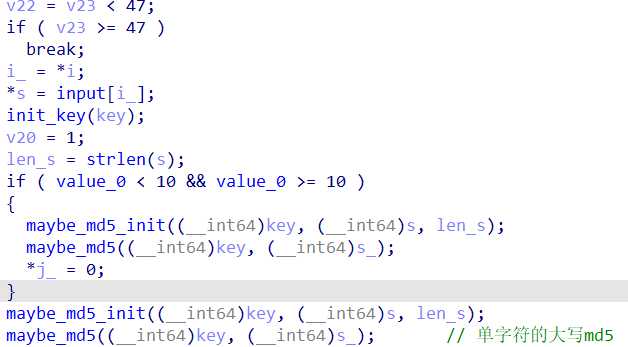

这里估计是双重md5：


最后和一堆md5值进行比较：


### exp

```python
# 计算字符串的 MD5 散列值
import hashlib
def calculate_md5_string(input_string):
    md5_hash = hashlib.md5()
    md5_hash.update(input_string.encode('utf-8'))
    return md5_hash.hexdigest()
md5 = []
for i in range(30, 128):
    md5_str = calculate_md5_string(calculate_md5_string(chr(i)))
    md5.append(md5_str)
result = [
    '14d89c38cd0fb23a14be2798d449c182',
    'a94837b18f8f43f29448b40a6e7386ba',
    'af85d512594fc84a5c65ec9970956ea5',
    'af85d512594fc84a5c65ec9970956ea5',
    '10e21da237a4a1491e769df6f4c3b419',
    'a705e8280082f93f07e3486636f3827a',
    '297e7ca127d2eef674c119331fe30dff',
    'b5d2099e49bdb07b8176dff5e23b3c14',
    '83be264eb452fcf0a1c322f2c7cbf987',
    'a94837b18f8f43f29448b40a6e7386ba',
    '71b0438bf46aa26928c7f5a371d619e1',
    'a705e8280082f93f07e3486636f3827a',
    'ac49073a7165f41c57eb2c1806a7092e',
    'a94837b18f8f43f29448b40a6e7386ba',
    'af85d512594fc84a5c65ec9970956ea5',
    'ed108f6919ebadc8e809f8b86ef40b05',
    '10e21da237a4a1491e769df6f4c3b419',
    '3cfd436919bc3107d68b912ee647f341',
    'a705e8280082f93f07e3486636f3827a',
    '65c162f7c43612ba1bdf4d0f2912bbc0',
    '10e21da237a4a1491e769df6f4c3b419',
    'a705e8280082f93f07e3486636f3827a',
    '3cfd436919bc3107d68b912ee647f341',
    '557460d317ae874c924e9be336a83cbe',
    'a705e8280082f93f07e3486636f3827a',
    '9203d8a26e241e63e4b35b3527440998',
    '10e21da237a4a1491e769df6f4c3b419',
    'f91b2663febba8a884487f7de5e1d249',
    'a705e8280082f93f07e3486636f3827a',
    'd7afde3e7059cd0a0fe09eec4b0008cd',
    '488c428cd4a8d916deee7c1613c8b2fd',
    '39abe4bca904bca5a11121955a2996bf',
    'a705e8280082f93f07e3486636f3827a',
    '3cfd436919bc3107d68b912ee647f341',
    '39abe4bca904bca5a11121955a2996bf',
    '4e44f1ac85cd60e3caa56bfd4afb675e',
    '45cf8ddfae1d78741d8f1c622689e4af',
    '3cfd436919bc3107d68b912ee647f341',
    '39abe4bca904bca5a11121955a2996bf',
    '4e44f1ac85cd60e3caa56bfd4afb675e',
    '37327bb06c83cb29cefde1963ea588aa',
    'a705e8280082f93f07e3486636f3827a',
    '23e65a679105b85c5dc7034fded4fb5f',
    '10e21da237a4a1491e769df6f4c3b419',
    '71b0438bf46aa26928c7f5a371d619e1',
    'af85d512594fc84a5c65ec9970956ea5',
    '39abe4bca904bca5a11121955a2996bf',
]
for i in range(len(result)):
    for j in range(len(md5)):
        if result[i] == md5[j]:
            print(chr(j + 30), end='')
```

## CSGO

动调发现是换表base64.


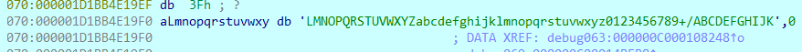


## vm_wo

根据指令码解释一下：

```
# 26 0 input    body[0] = input
# 25 1 1        body[1] = body[0] >> 1
# 13 2 7        body[2] = body[0] << 7
# 24 1 2        body[0] = body[1] | body[2]
# 1 0 3         body[0] = body[0] ^ body[3]
# 26 0 body[0]  body[0] = body[0]
# 25 1 2        body[1] = body[0] >> 2
# 13 2 6        body[2] = body[0] << 6
# 24 1 2        body[0] = body[1] | body[2]
# 1 0 4         body[0] = body[0] ^ body[4]
# 26 0 body[0]  body[0] = body[0]
# 25 1 3        body[1] = body[0] >> 3
# 13 2 5        body[2] = body[0] << 5
# 24 1 2        body[0] = body[1] | body[2]
# 1 0 5         body[0] = body[0] ^ body[5]
# 26 0 body[0]  body[0] = body[0]
# 25 1 4        body[1] = body[0] >> 4
# 13 2 4        body[2] = body[0] << 4
# 24 1 2        body[0] = body[1] | body[2]
# 1 0 6         body[0] = body[0] ^ body[6]
```

### exp

```python
result = [0xDF, 0xD5, 0xF1, 0xD1, 0xFF, 0xDB, 0xA1, 0xA5, 0x89, 0xBD, 0xE9, 0x95, 0xB3, 0x9D, 0xE9, 0xB3, 0x85, 0x99, 0x87, 0xBF, 0xE9, 0xB1, 0x89, 0xE9, 0x91, 0x89, 0x89, 0x8F, 0xAD]
key = struct.pack('<I', 0xBEEDBEEF)
print(key)
for i in range(len(result)):
    num = result[i]
    num = (num >> 3) | ((num << 5) & 0xFF)
    num ^= key[3]
    num = (num >> 4) | ((num << 4) & 0xFF)
    num ^= key[2]
    num = (num >> 5) | ((num << 3) & 0xFF)
    num ^= key[1]
    num = (num >> 6) | ((num << 2) & 0xFF)
    num ^= key[0]
    num = (num >> 7) | ((num << 1) & 0xFF)
    result[i] = num
print(bytearray(result))
```

## Ez加密器

### 去混淆

#### 代码1

a = a + b

```C
args: a, b
do
{
    t = a & b;
    a ^= b;
    b = 2 * t;
}
while ( 2 * t );
```

对应汇编：

```assembly
loc_7FF73D0A1AF8:
mov     ebp, ecx
and     ebp, eax
xor     eax, ecx
mov     ecx, ebp
add     ecx, ecx  // add：如果加法结果为0，更改zf寄存器为1
jnz     short loc_7FF73D0A1AF8
```

可简化为：

```assembly
add		eax, ecx
```

#### 代码2

eax = ~(eax % 8)

汇编：

```assembly
// eax = eax % 8
mov     ecx, eax
sar     ecx, 1Fh
shr     ecx, 1Dh
add     eax, ecx
and     eax, 7
sub     eax, ecx

// eax = ~eax
not     eax
```

#### 代码3

```C
args: v10

v9 = 1;
do // v10 = v10 + v9
{
    v11 = v9;
    v12 = v10;
    v13 = v9 & v10;
    v10 ^= v11;
    v9 = 2 * v13;
}
while ( v9 );
v14 = 7;
if ( v12 != v11 ) // 即 上面循环结果 v10 != 0
{
    do // v14 = v14 + v10
    {
        v15 = v14 & v10;
        v14 ^= v10;
        v10 = 2 * v15;
    }
    while ( 2 * v15 );
}
```

汇编：

```assembly
loc_7FF7F3181B28:              
mov     r12d, ecx
mov     ecx, eax
mov     r13d, eax
and     ecx, r12d
xor     eax, r12d
add     ecx, ecx
jnz     short loc_7FF7F3181B28
mov     ecx, 7
cmp     r13d, r12d
jz      short loc_7FF7F3181B57
nop     dword ptr [rax+00h]
loc_7FF7F3181B48:              
mov     r12d, eax
and     r12d, ecx
xor     ecx, eax
mov     eax, r12d
add     eax, eax
jnz     short loc_7FF7F3181B48
loc_7FF7F3181B57:
xxxxxx
```

可转化为：

```c
args: v10, v9, v14
if v10 + v9 != 0:
	v14 = v14 + v10 + v9
else:
	v14 = v14
```

汇编：

```assembly
add     eax, ecx
mov     ecx, 7
cmp     eax, 0
jz      short loc_7FF73D0A1B57
add     ecx, eax
loc_7FF73D0A1B57:
xxxxxx
```

#### 代码4

```C
args: v17
v16 = 1;
do // v17 = v17 + v16
{
    v19 = v16;
    v20 = v17 & v16;
    v21 = v17;
    v17 ^= v19;
    v16 = 2 * v20;
}
while ( v16 );
if ( v19 == v21 ) // v17 == 0
{
    LOBYTE(v24) = 0x80; // v24 = 1 << 7
    				  // 也是：v24 = 1 << (7 + 1 + v17)
}
else
{
    v22 = 7;
    do // v22 = v22 + v17
    {
        v23 = v22 & v17;
        v22 ^= v17;
        v17 = 2 * v23;
    }
    while ( 2 * v23 );
    v24 = 1 << v22; // v24 = 1 << (7 + 1 + v17)
}
```

可转化为：

```C
v24 = 1 << (7 + 1 + v17)
```

#### 代码5

```c
~(a % 8) + 1 等于 -(a & 8)
```

#### 脚本去混淆

对单个函数的以上混淆去掉。

```Python
from keystone import *
import re


def get_asm(code):
    ks = Ks(KS_ARCH_X86, KS_MODE_64)
    asm, cnt = ks.asm(code)
    return asm


def handle(addr, add_bias, jnz_bias):
    add_num = GetOpnd(addr + add_bias, 1)
    for i in range(2, add_bias):
        if GetMnem(addr + i) == "xor":
            result = GetOpnd(addr + i, 0)
            break
    if add_num and result:
        Jump(addr)
        mnem = f"add {result}, {add_num}"
        print(mnem)
        asm = get_asm(mnem)
        print(asm)
        for i in range(len(asm)):
            PatchByte(addr + i, asm[i])
        for i in range(len(asm), jnz_bias + 2):
            PatchByte(addr + i, 0x90)
        if GetMnem(addr + jnz_bias + 2) == "cmp":
            cmp_bias = jnz_bias + 2
            mnem = f"cmp {result},0"
            print(mnem)
            asm = get_asm(mnem)
            print(f"{[hex(_) for _ in asm]}")
            print(f"{idaapi.get_item_size(addr + cmp_bias) == len(asm)}")
            if len(asm) == idaapi.get_item_size(addr + cmp_bias):
                print(f"hahahahahahahh")
                for i in range(len(asm)):
                    print("patch")
                    PatchByte(addr + cmp_bias + i, asm[i])
            elif len(asm) < idaapi.get_item_size(addr + cmp_bias):
                for i in range(len(asm)):
                    PatchByte(addr + cmp_bias + i, asm[i])
                for i in range(len(asm), idaapi.get_item_size(addr + cmp_bias)):
                    PatchByte(addr + cmp_bias + i, 0x90)
            elif len(asm) > idaapi.get_item_size(addr + cmp_bias):
                cmp_len = idaapi.get_item_size(addr + cmp_bias)
                code1_len = idaapi.get_item_size(addr + cmp_bias + cmp_len)
                code2_len = idaapi.get_item_size(addr + cmp_bias + cmp_len + code1_len)
                if GetMnem(addr + cmp_bias + cmp_len) == "nop":
                    for i in range(len(asm)):
                        PatchByte(addr + cmp_bias + i, asm[i])
                    for i in range(len(asm), cmp_len + code1_len):
                        PatchByte(addr + cmp_bias + i, 0x90)
                elif GetMnem(addr + cmp_bias + cmp_len + code1_len) == "nop":
                    if GetMnem(addr + cmp_bias + cmp_len) == "jz":
                        if code1_len == 6:
                            ori_jmp = Dword(addr + cmp_bias + cmp_len + 2)
                            new_jmp = ori_jmp - code2_len
                            jmp_data = struct.pack('<I', new_jmp)
                            for i in range(len(jmp_data)):
                                PatchByte(addr + cmp_bias + cmp_len + 2 + i, jmp_data[i])
                        elif code1_len == 2:
                            ori_jmp = Byte(addr + cmp_bias + cmp_len + 1)
                            new_jmp = ori_jmp - code2_len
                            PatchByte(addr + cmp_bias + cmp_len + 1, new_jmp)
                    for i in range(cmp_len + code1_len, cmp_len + code1_len + code2_len):
                        PatchByte(addr + cmp_bias + i, 0x90)
                    for i in range(cmp_len + code1_len + code2_len - 1, cmp_len + code2_len - 1, -1):
                        PatchByte(addr + cmp_bias + i, Byte(addr + cmp_bias + i - code2_len))
                    for i in range(len(asm)):
                        PatchByte(addr + cmp_bias + i, asm[i])
                    for i in range(len(asm), cmp_len + code2_len):
                        PatchByte(addr + cmp_bias + i, 0x90)
                elif GetMnem(addr + cmp_bias + cmp_len + code1_len + code2_len) == "nop":
                    code3_len = idaapi.get_item_size(addr + cmp_bias + cmp_len + code1_len + code2_len)
                    if GetMnem(addr + cmp_bias + cmp_len) == "jz":
                        if code1_len == 6:
                            ori_jmp = Dword(addr + cmp_bias + cmp_len + 2)
                            new_jmp = ori_jmp - code3_len
                            jmp_data = struct.pack('<I', new_jmp)
                            for i in range(len(jmp_data)):
                                PatchByte(addr + cmp_bias + cmp_len + 2 + i, jmp_data[i])
                        elif code1_len == 2:
                            ori_jmp = Byte(addr + cmp_bias + cmp_len + 1)
                            new_jmp = ori_jmp - code3_len
                            PatchByte(addr + cmp_bias + cmp_len + 1, new_jmp)
                    elif GetMnem(addr + cmp_bias + cmp_len + code1_len) == "jz":
                        if code2_len == 6:
                            ori_jmp = Dword(addr + cmp_bias + cmp_len + code1_len + 2)
                            new_jmp = ori_jmp - code3_len
                            jmp_data = struct.pack('<I', new_jmp)
                            for i in range(len(jmp_data)):
                                PatchByte(addr + cmp_bias + cmp_len + code1_len + 2 + i, jmp_data[i])
                        elif code2_len == 2:
                            ori_jmp = Byte(addr + cmp_bias + cmp_len + code1_len + 1)
                            new_jmp = ori_jmp - code3_len
                            PatchByte(addr + cmp_bias + cmp_len + code1_len + 1, new_jmp)
                    for i in range(cmp_len + code1_len + code2_len, cmp_len + code1_len + code2_len + code3_len):
                        PatchByte(addr + cmp_bias + i, 0x90)
                        print(f"nop {hex(addr + cmp_bias + i)}")
                    for i in range(cmp_len + code1_len + code2_len + code3_len - 1, cmp_len + code3_len - 1, -1):
                        print(
                            f"{hex(addr + cmp_bias + i - code3_len)}:{Byte(addr + cmp_bias + i - code3_len)} -> {hex(addr + cmp_bias + i)}:{Byte(addr + cmp_bias + i)}")
                        PatchByte(addr + cmp_bias + i, Byte(addr + cmp_bias + i - code3_len))
                    for i in range(len(asm)):
                        print(f"{asm[i]} -> {hex(addr + cmp_bias + i)}:{Byte(addr + cmp_bias + i)}")
                        PatchByte(addr + cmp_bias + i, asm[i])
                    for i in range(len(asm), cmp_len + code3_len):
                        print(f"nop {hex(addr + cmp_bias + i)}")
                        PatchByte(addr + cmp_bias + i, 0x90)
        elif GetMnem(addr + jnz_bias + 7) == "cmp":
            cmp_bias = jnz_bias + 7
            mnem = f"cmp {result},0"
            print(mnem)
            asm = get_asm(mnem)
            if len(asm) == idaapi.get_item_size(addr + cmp_bias):
                for i in range(len(asm)):
                    PatchByte(addr + cmp_bias + i, asm[i])
            elif len(asm) < idaapi.get_item_size(addr + cmp_bias):
                for i in range(len(asm)):
                    PatchByte(addr + cmp_bias + i, asm[i])
                for i in range(len(asm), idaapi.get_item_size(addr + cmp_bias)):
                    PatchByte(addr + cmp_bias + i, 0x90)
            elif len(asm) > idaapi.get_item_size(addr + cmp_bias):
                cmp_len = idaapi.get_item_size(addr + cmp_bias)
                code1_len = idaapi.get_item_size(addr + cmp_bias + cmp_len)
                code2_len = idaapi.get_item_size(addr + cmp_bias + cmp_len + code1_len)
                if GetMnem(addr + cmp_bias + cmp_len) == "nop":
                    for i in range(len(asm)):
                        PatchByte(addr + cmp_bias + i, asm[i])
                    for i in range(len(asm), cmp_len + code1_len):
                        PatchByte(addr + cmp_bias + i, 0x90)
                elif GetMnem(addr + cmp_bias + cmp_len + code1_len) == "nop":
                    if GetMnem(addr + cmp_bias + cmp_len) == "jz":
                        if code1_len == 6:
                            ori_jmp = Dword(addr + cmp_bias + cmp_len + 2)
                            new_jmp = ori_jmp - code2_len
                            jmp_data = struct.pack('<I', new_jmp)
                            for i in range(len(jmp_data)):
                                PatchByte(addr + cmp_bias + cmp_len + 2 + i, jmp_data[i])
                        elif code1_len == 2:
                            ori_jmp = Byte(addr + cmp_bias + cmp_len + 1)
                            new_jmp = ori_jmp - code2_len
                            PatchByte(addr + cmp_bias + cmp_len + 1, new_jmp)
                    for i in range(cmp_len + code1_len, cmp_len + code1_len + code2_len):
                        PatchByte(addr + cmp_bias + i, 0x90)
                    for i in range(cmp_len + code1_len + code2_len - 1, cmp_len + code2_len - 1, -1):
                        PatchByte(addr + cmp_bias + i, Byte(addr + cmp_bias + i - code2_len))
                    for i in range(len(asm)):
                        PatchByte(addr + cmp_bias + i, asm[i])
                    for i in range(len(asm), cmp_len + code2_len):
                        PatchByte(addr + cmp_bias + i, 0x90)
                elif GetMnem(addr + cmp_bias + cmp_len + code1_len + code2_len) == "nop":
                    code3_len = idaapi.get_item_size(addr + cmp_bias + cmp_len + code1_len + code2_len)
                    if GetMnem(addr + cmp_bias + cmp_len) == "jz":
                        if code1_len == 6:
                            ori_jmp = Dword(addr + cmp_bias + cmp_len + 2)
                            new_jmp = ori_jmp - code3_len
                            jmp_data = struct.pack('<I', new_jmp)
                            for i in range(len(jmp_data)):
                                PatchByte(addr + cmp_bias + cmp_len + 2 + i, jmp_data[i])
                        elif code1_len == 2:
                            ori_jmp = Byte(addr + cmp_bias + cmp_len + 1)
                            new_jmp = ori_jmp - code3_len
                            PatchByte(addr + cmp_bias + cmp_len + 1, new_jmp)
                    elif GetMnem(addr + cmp_bias + cmp_len + code1_len) == "jz":
                        if code2_len == 6:
                            ori_jmp = Dword(addr + cmp_bias + cmp_len + code1_len + 2)
                            new_jmp = ori_jmp - code3_len
                            jmp_data = struct.pack('<I', new_jmp)
                            for i in range(len(jmp_data)):
                                PatchByte(addr + cmp_bias + cmp_len + code1_len + 2 + i, jmp_data[i])
                        elif code2_len == 2:
                            ori_jmp = Byte(addr + cmp_bias + cmp_len + code1_len + 1)
                            new_jmp = ori_jmp - code3_len
                            PatchByte(addr + cmp_bias + cmp_len + code1_len + 1, new_jmp)
                    for i in range(cmp_len + code1_len + code2_len, cmp_len + code1_len + code2_len + code3_len):
                        PatchByte(addr + cmp_bias + i, 0x90)
                        print(f"nop {hex(addr + cmp_bias + i)}")
                    for i in range(cmp_len + code1_len + code2_len + code3_len - 1, cmp_len + code3_len - 1, -1):
                        print(
                            f"{hex(addr + cmp_bias + i - code3_len)}:{Byte(addr + cmp_bias + i - code3_len)} -> {hex(addr + cmp_bias + i)}:{Byte(addr + cmp_bias + i)}")
                        PatchByte(addr + cmp_bias + i, Byte(addr + cmp_bias + i - code3_len))
                    for i in range(len(asm)):
                        print(f"{asm[i]} -> {hex(addr + cmp_bias + i)}:{Byte(addr + cmp_bias + i)}")
                        PatchByte(addr + cmp_bias + i, asm[i])
                    for i in range(len(asm), cmp_len + code3_len):
                        print(f"nop {hex(addr + cmp_bias + i)}")
                        PatchByte(addr + cmp_bias + i, 0x90)


seg_addr = idc.here()
fun_start = idc.get_func_off_str(seg_addr)
# print(fun_start)
fun_start = seg_addr - int(fun_start.split("+")[1], 16)
# fun_start = int(re.search(r'sub_(\w+):', fun_start)[1],16)
fun_end = idc.find_func_end(seg_addr)
print(hex(fun_start), hex(fun_end))
for addr in range(fun_start, fun_end):
    if GetMnem(addr + 0xb) == "add" and GetMnem(addr + 0xd) == "jnz" and GetMnem(addr) == "mov":
        print(hex(addr))
        handle(addr, 0xb, 0xd)
    elif GetMnem(addr + 0x9) == "add" and GetMnem(addr + 0xb) == "jnz" and GetMnem(addr) == "mov":
        print(hex(addr))
        handle(addr, 0x9, 0xb)
    elif GetMnem(addr + 0x8) == "add" and GetMnem(addr + 0xa) == "jnz" and GetMnem(addr) == "mov":
        print(hex(addr))
        handle(addr, 0x8, 0xa)
    elif GetMnem(addr + 0x8) == "add" and GetMnem(addr + 0xd) == "jnz" and GetMnem(addr) == "mov":
        print(hex(addr))
        handle(addr, 0x8, 0xd)
    elif GetMnem(addr + 0x6) == "add" and GetMnem(addr + 0xa) == "jnz" and GetMnem(addr) == "mov":
        print(hex(addr))
        handle(addr, 0x6, 0xa)
    elif GetMnem(addr + 12) == "add" and GetMnem(addr + 15) == "jnz" and GetMnem(addr) == "mov":
        print(hex(addr))
        handle(addr, 12, 15)
    elif GetMnem(addr + 12) == "add" and GetMnem(addr + 14) == "jnz" and GetMnem(addr) == "mov":
        print(hex(addr))
        handle(addr, 12, 14)
    elif GetMnem(addr + 10) == "add" and GetMnem(addr + 12) == "jnz" and GetMnem(addr) == "mov":
        print(hex(addr))
        handle(addr, 10, 12)
```

### 思路

网上大伙的wp都说是DES，但说实话除了找到数据特征是DES，以及最后对输入处理都是与和或，没看出大概DES /(ㄒoㄒ)/。

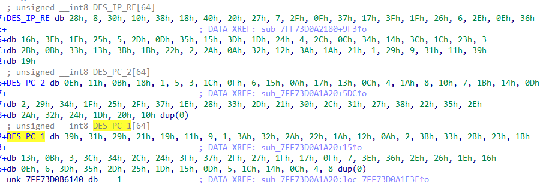

爆破6位code（0-999999），进行换表base64作为DES密钥。

这里给出网上的exp：

```python
flag = "DASCTF{1234567890abcdef1234567890abcdef}"
from Crypto.Cipher import DES
import base64
key = bytes([0x6D, 0x74, 0x69, 0x50, 0x6E, 0x64, 0x75, 0x53 ])
print(key)
def base64_encode(data):
    oldtable='ABCDEFGHIJKLMNOPQRSTUVWXYZabcdefghijklmnopqrstuvwxyz0123456789+/'#老表
    newtable='abcdefghijklmnopqrstuvwxyz0123456789ABCDEFGHIJKLMNOPQRSTUVWXYZ+/'#这里输入魔改变表
    tmp = base64.b64encode(data.encode()).decode()
    result=''
    for ch in tmp:
        result +=newtable[oldtable.index(ch)]
    return result

## key = base64_encode("123456")
## print(key)
for i in range(0,1000000):
    tmp_key = str(i).rjust(6,"0")
    tmp_key = base64_encode(tmp_key)
    #print(tmp_key)
    des = DES.new(tmp_key.encode(),mode=DES.MODE_ECB)
    c = bytes.fromhex("0723105D5C12217DCDC3601F5ECB54DA9CCEC2279F1684A13A0D716D17217F4C9EA85FF1A42795731CA3C55D3A4D7BEA")
    m = des.decrypt(c)
    if(b"DAS" in m):
        print(i)
        print(m)
```

