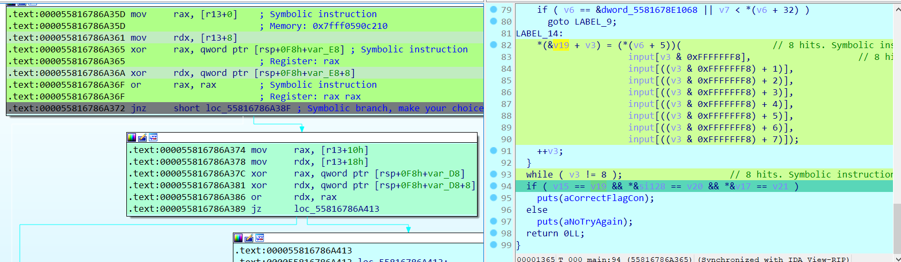
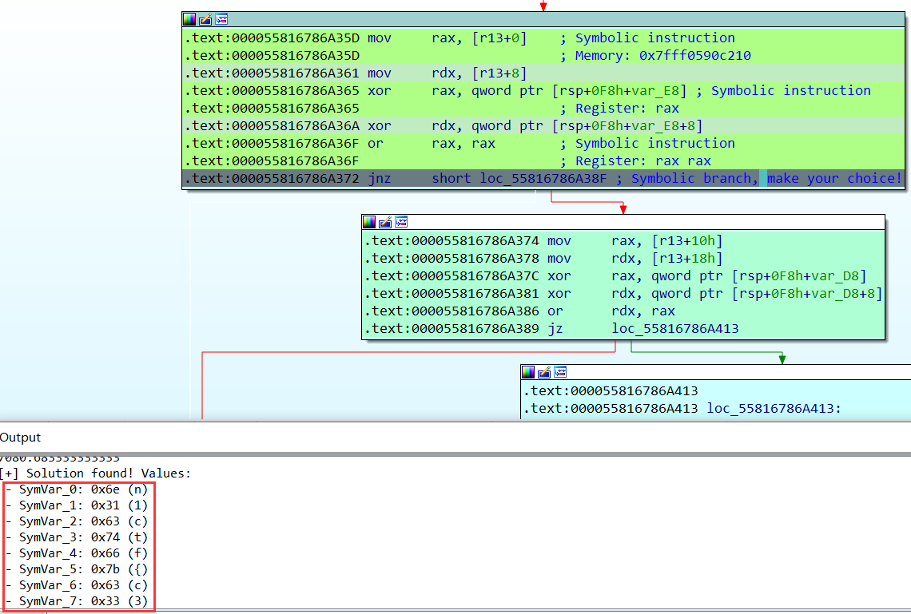
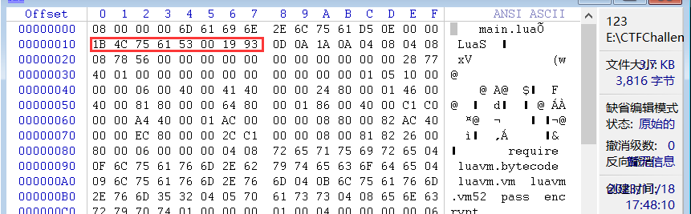
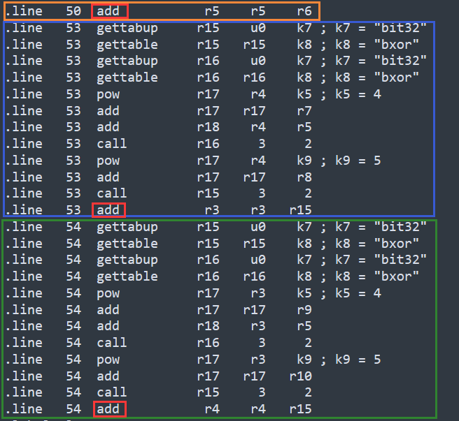
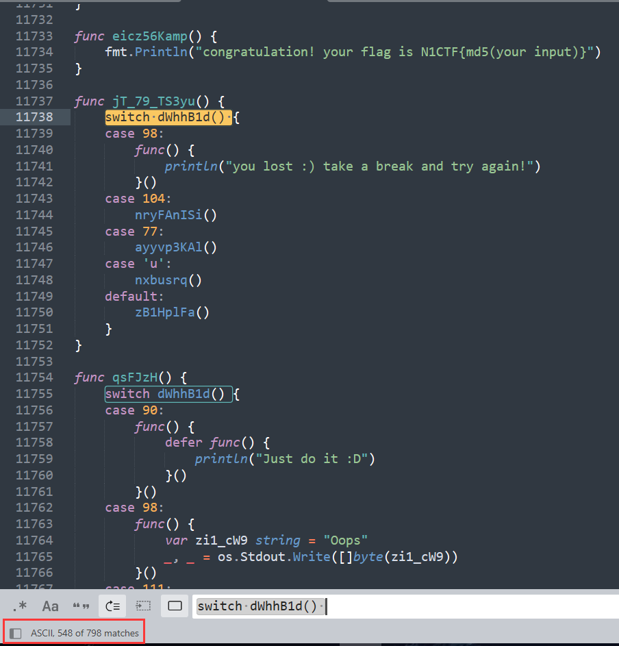
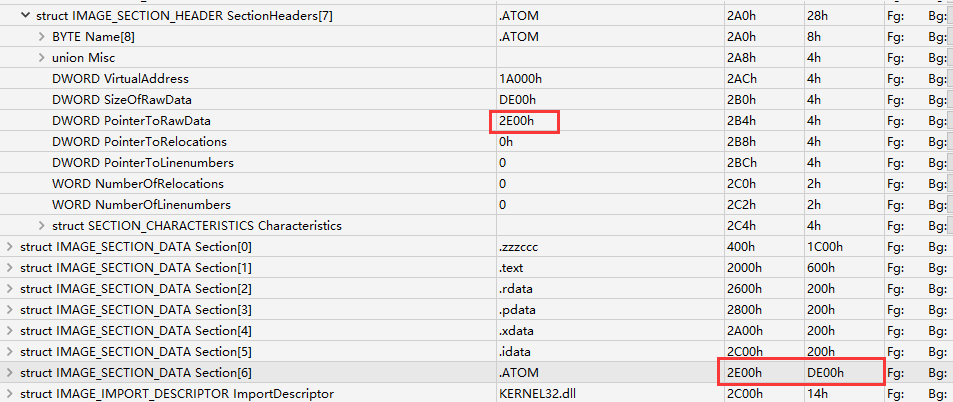
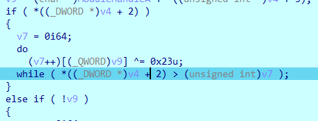
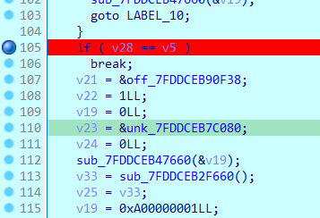
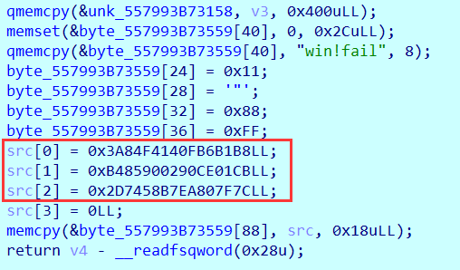
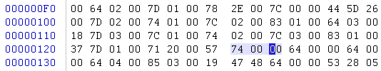

# N1CTF2023

## AdditionPlus

程序获取输入，然后八个字节八个字节的加密。

八个字节的加密方式是分别经过八个函数，每个函数得到一个字节的运算结果，然后进行比对。

每个函数有一堆运算由与、异或、左移1位组成。

```C
__int64 __fastcall main(int a1, char **a2, char **a3)
{
    __int64 v3; // r15
    __int64 v4; // rax
    __int64 v5; // r12
    int *v6; // r14
    char v7; // cl
    char v8; // al
    __int64 v9; // rax
    __int64 v10; // rdx
    _BOOL8 v11; // rdi
    int *v13; // [rsp+8h] [rbp-F0h]
    int *v14; // [rsp+8h] [rbp-F0h]
    unsigned __int64 v15; // [rsp+10h] [rbp-E8h]
    __m128i si128; // [rsp+20h] [rbp-D8h]
    __m128i v17; // [rsp+30h] [rbp-C8h]
    char input[64]; // [rsp+40h] [rbp-B8h] BYREF
    __int128 v19; // [rsp+80h] [rbp-78h]
    __int128 v20; // [rsp+90h] [rbp-68h]
    __int128 v21; // [rsp+A0h] [rbp-58h]
    __int16 v22; // [rsp+B0h] [rbp-48h]
    unsigned __int64 v23; // [rsp+B8h] [rbp-40h]

    v3 = 0LL;
    v23 = __readfsqword(0x28u);
    v22 = 0;
    v15 = _mm_load_si128(&xmmword_5581678DF060).m128i_u64[0]; // 加密结果
    si128 = _mm_load_si128(&xmmword_5581678DF070);
    v17 = _mm_load_si128(&xmmword_5581678DF080);
    v19 = 0LL;
    v20 = 0LL;
    v21 = 0LL;
    puts("flag>>");
    __isoc99_scanf("%48s", input);
    do
    {
        ...
            
        LABEL_14:
        // 分别调用八个加密函数
        *(&v19 + v3) = (*(v6 + 5))(			// 8 hits. Symbolic instruction
            input[v3 & 0xFFFFFFF8],			// 8 hits. Symbolic instruction
            input[((v3 & 0xFFFFFFF8) + 1)],			// 8 hits. Symbolic instruction
            input[((v3 & 0xFFFFFFF8) + 2)],			// 8 hits. Symbolic instruction
            input[((v3 & 0xFFFFFFF8) + 3)],			// 8 hits. Symbolic instruction
            input[((v3 & 0xFFFFFFF8) + 4)],			// 8 hits. Symbolic instruction
            input[((v3 & 0xFFFFFFF8) + 5)],			// 8 hits. Symbolic instruction
            input[((v3 & 0xFFFFFFF8) + 6)],			// 8 hits. Symbolic instruction
            input[((v3 & 0xFFFFFFF8) + 7)]);			// 8 hits. Symbolic instruction
        ++v3;
    }
    while ( v3 != 48 );			// 8 hits. Symbolic instruction
    if ( v15 == v19 && *&si128 == v20 && *&v17 == v21 )			// Symbolic instruction
        puts(aCorrectFlagCon);
    else
        puts(aNoTryAgain);
    return 0LL;
}
```

### 解法一——Ponce

这里看了师傅的WP复现一下👉[2023 N1CTF writeup by Arr3stY0u](https://cn-sec.com/archives/2140081.html)

顺便了解一下Ponce这个工具的使用。

首先，[illera88/Ponce](https://github.com/illera88/Ponce)获取两个`DLL`直接放在`plugins`目录下即可。

进入IDA，由Ponce配置设置，这里红框中有时间的设置，在这题得设大一些。


这里每次八个字节进行符号执行，以前八个字节为例，先对程序进行Patch。

前八个字节，就先将index上限到8。

然后比对的时候，程序是十六个字节进行比对的，这里将`or rdx, rax`改为`or rax, rax`，即可改为只比对前八个字节。


在程序获取输入后，为前八字节进行操作：


接下来可以直接运行到判断前八字节比对结果的跳转指令处：



在这里，如果比对失败会走`0x000055816786A38F`，比对成功会走`0x000055816786A374`，这里由于输入的不是flag，会走`0x000055816786A38F`，这里让Ponce解出走`0x000055816786A374`的输入：


跑了小久，成功解出前八个字节的flag：



尝试一次跑十六个字节的，也是可以的：


之后就是如法炮制解出剩余flag：`n1ctf{c327b78b-8ead-425H1N09d-89fb-1d2d0a8f3e7c}`

## N1LLua

[N1CTF2023-N1LLua | OrientalGlass](https://orientalglass.github.io/2023/10/25/比赛/N1CTF2023/N1CTF2023-N1LLua/) 👈 看这位师傅的WP

使用AssetBundleExtractor导出`main.lua`:


根据`luac`的文件头删去多余的前十六个字节：



使用`unluac`来反编译：`java -jar .\unluac.jar .\main.lua-resources.assets-13.dat > main.lua`

```lua
local L0_1, L1_1, L2_1, L3_1, L4_1
L0_1 = require
L1_1 = "luavm.bytecode"
L0_1 = L0_1(L1_1)
L1_1 = require
L2_1 = "luavm.vm"
L1_1 = L1_1(L2_1)
L2_1 = require
L3_1 = "luavm.vm52"
L2_1(L3_1)

function L2_1(...)
  local L0_2, L1_2
  L0_2, L1_2 = ...
  return L0_2, L1_2
end

pass = L2_1

function L2_1(A0_2)
  local L1_2, L2_2, L3_2, L4_2
  L2_2 = A0_2
  L1_2 = A0_2.gsub
  L3_2 = "%x%x"
  
  function L4_2(A0_3)
    local L1_3, L2_3, L3_3, L4_3
    L1_3 = string
    L1_3 = L1_3.char
    L2_3 = tonumber
    L3_3 = A0_3
    L4_3 = 16
    L2_3, L3_3, L4_3 = L2_3(L3_3, L4_3)
    return L1_3(L2_3, L3_3, L4_3)
  end
  
  L1_2 = L1_2(L2_2, L3_2, L4_2)
  return L1_2
end

function L3_1(A0_2)
  local L1_2, L2_2, L3_2, L4_2
  L2_2 = A0_2
  L1_2 = A0_2.gsub
  L3_2 = "."
  
  function L4_2(A0_3)
    local L1_3, L2_3, L3_3, L4_3
    L1_3 = string
    L1_3 = L1_3.format
    L2_3 = "%02x"
    L4_3 = A0_3
    L3_3 = A0_3.byte
    L3_3, L4_3 = L3_3(L4_3)
    return L1_3(L2_3, L3_3, L4_3)
  end
  
  L1_2 = L1_2(L2_2, L3_2, L4_2)
  return L1_2
end

function L4_1(A0_2)
  local L1_2, L2_2, L3_2, L4_2
  L1_2 = L2_1
  L2_2 = "1b4c7561520001040804080019930d0a1a0a0a0000005f000000000102090000002500000008000080254000000800808006404000660000001e0000001f0000001f00800002000000040800000000000000656e6372797074000405000000000000006d61696e00020000002b0000003a0000000300132e000000cd004001c7c000000d414001070101004181000081c10000c701c0000742c0004702c1008742c100c10200000183010041030000e10206804d818102c6c34100c703c20706c4410007044208524441024dc481088d4401021d848001524442024d048208dd838001cdc08301c6c34100c703c20706c44100070442085244c1014d4482088d4481011d8480015244c2014d848208dd8380010dc10302e042f97fcd0240010d434001400380010a0001060a4083051f0080000a00000003000000000000f03f0300000000000000400300000000000000000300002037efc6e34103000000000000084003000000000000104003000000000000404004060000000000000062697433320004050000000000000062786f7200030000000000001440000000000100000000000a0000000000000040746573742e6c7561002e0000002c0000002c0000002c0000002c0000002d0000002e0000002f0000002f0000002f0000002f00000031000000310000003100000031000000320000003500000035000000350000003500000035000000350000003500000035000000350000003500000035000000350000003600000036000000360000003600000036000000360000003600000036000000360000003600000036000000360000003100000039000000390000003900000039000000390000003a0000000f00000002000000000000007600000000002e00000002000000000000006b00000000002e00000002000000000000007000000000002e0000000300000000000000763000040000002e0000000300000000000000763100040000002e000000040000000000000073756d00050000002e000000060000000000000064656c746100060000002e00000003000000000000006b30000a0000002e00000003000000000000006b31000a0000002e00000003000000000000006b32000a0000002e00000003000000000000006b33000a0000002e0000000c0000000000000028666f7220696e64657829000d000000280000000c0000000000000028666f72206c696d697429000d000000280000000b0000000000000028666f72207374657029000d00000028000000020000000000000069000e000000270000000100000005000000000000005f454e56004d0000005c00000001000b140000004b00000281000000c14000000181000041c100006440000280000000c1000100150100010e41410241810100e1000180c6c14100000200014002800080020003dd410002e040fe7f9f0000011f00800008000000030000e0dfb7d5eb41030000c057d75fe941030000c01bb8d5eb41030000e01f0200e84103000000000000000003000000000000f03f030000000000000040040800000000000000656e637279707400000000000100000000000a0000000000000040746573742e6c756100140000005000000050000000500000005000000050000000500000005100000053000000530000005300000053000000530000005400000054000000540000005400000054000000530000005b0000005c0000000700000002000000000000007800000000001400000002000000000000006b0006000000140000000200000000000000760007000000140000000c0000000000000028666f7220696e64657829000b000000120000000c0000000000000028666f72206c696d697429000b000000120000000b0000000000000028666f72207374657029000b00000012000000020000000000000069000c000000110000000100000005000000000000005f454e56000100000000000a0000000000000040746573742e6c756100090000003a0000002b0000005c0000004d0000005e0000005e0000005e0000005e0000005f000000000000000100000005000000000000005f454e5600"
  L1_2 = L1_2(L2_2)
  dump = L1_2
  L1_2 = L1_1.lua52
  L1_2 = L1_2.run
  L2_2 = L0_1.load
  L3_2 = dump
  L2_2 = L2_2(L3_2)
  L3_2 = {}
  L4_2 = A0_2
  L3_2[1] = L4_2
  L1_2 = L1_2(L2_2, L3_2)
  v = L1_2
  L1_2 = v
  return L1_2
end

encrypt = L4_1
```

根据GPT的解释：

> 所以总体来说,这段代码通过 Lua 虚拟机实现对一段密文的解密,利用 luavm 模块解析并运行字节码来还原明文。流程就是将密文解析为字节码->运行解析->返回结果。

再把代码中的字节码dump成一个`luac`文件，再次反编译：`java -jar .\unluac.jar .\new_code.luac > new_code.lua`

这是一段非标准的TEA加密：

**Lua中`^`是乘幂符号**

但知道了也没用，写解密函数半天写不出来，看WP才知道乘幂操作被改了😫😫

```lua
function encrypt(v, k, p)
  local v0, v1 = v[p + 1], v[p + 2]
  
  local sum = 0
  local delta = 2654435769
  local k0, k1, k2, k3 = k[1], k[2], k[3], k[4]
  for i = 1, 32 do
    sum = sum + delta
    v0 = v0 + bit32.bxor(bit32.bxor(v1 ^ 4 + k0, v1 + sum), v1 ^ 5 + k1)
    v1 = v1 + bit32.bxor(bit32.bxor(v0 ^ 4 + k2, v0 + sum), v0 ^ 5 + k3)
  end
  v[p + 1], v[p + 2] = v0, v1
end

function main(x)
  local k = {
    3735928575,
    3405691582,
    3735929054,
    3221229823
  }
  local v = x
  for i = 0, #v - 1, 2 do
    encrypt(v, k, i)
  end
  return v
end

return main(...)
```

不知道是怎么改的，就只好改加密函数为解密函数，让程序自己解密了。

首先更改加密函数的Lua：`java -jar .\unluac.jar --disassemble .\new_code.luac > .\new_code.luaasm`获取Lua的字节码

```assembly
.version	5.2

.format	0
.endianness	LITTLE
.int_size	4
.size_t_size	8
.instruction_size	4
.number_format	float	8

.function	main

.linedefined	10
.lastlinedefined	95
.numparams	0
.is_vararg	1
.maxstacksize	2
.source	"@test.lua"

.upvalue	"_ENV"	0	false

.constant	k0	"encrypt"
.constant	k1	"main"

.line	58	closure       r0    f0
.line	43	settabup      u0    k0    r0 ; k0 = "encrypt"
.line	92	closure       r0    f1
.line	77	settabup      u0    k1    r0 ; k1 = "main"
.line	94	gettabup      r0    u0    k1 ; k1 = "main"
.line	94	vararg        r1     0
.line	94	tailcall      r0     0
.line	94	return        r0     0
.line	95	return        r0     1

.function	main/f0

.linedefined	43
.lastlinedefined	58
.numparams	3
.is_vararg	0
.maxstacksize	19
.source	"@test.lua"

.local	"v"	0	46
.local	"k"	0	46
.local	"p"	0	46
.local	"v0"	4	46
.local	"v1"	4	46
.local	"sum"	5	46
.local	"delta"	6	46
.local	"k0"	10	46
.local	"k1"	10	46
.local	"k2"	10	46
.local	"k3"	10	46
.local	"(for index)"	13	40
.local	"(for limit)"	13	40
.local	"(for step)"	13	40
.local	"i"	14	39

.upvalue	"_ENV"	0	false

.constant	k0	1
.constant	k1	2
.constant	k2	0
.constant	k3	2654435769
.constant	k4	3
.constant	k5	4
.constant	k6	32
.constant	k7	"bit32"
.constant	k8	"bxor"
.constant	k9	5

.line	44	add           r3    r2    k0 ; k0 = 1
.line	44	gettable      r3    r0    r3
.line	44	add           r4    r2    k1 ; k1 = 2
.line	44	gettable      r4    r0    r4
.line	45	loadk         r5    k2 ; k2 = 0
.line	46	loadk         r6    k3 ; k3 = 2654435769
.line	47	gettable      r7    r1    k0 ; k0 = 1
.line	47	gettable      r8    r1    k1 ; k1 = 2
.line	47	gettable      r9    r1    k4 ; k4 = 3
.line	47	gettable     r10    r1    k5 ; k5 = 4
.line	49	loadk        r11    k0 ; k0 = 1
.line	49	loadk        r12    k6 ; k6 = 32
.line	49	loadk        r13    k0 ; k0 = 1
.line	49	forprep      r11   l40
.label	l15
.line	50	add           r5    r5    r6
.line	53	gettabup     r15    u0    k7 ; k7 = "bit32"
.line	53	gettable     r15   r15    k8 ; k8 = "bxor"
.line	53	gettabup     r16    u0    k7 ; k7 = "bit32"
.line	53	gettable     r16   r16    k8 ; k8 = "bxor"
.line	53	pow          r17    r4    k5 ; k5 = 4
.line	53	add          r17   r17    r7
.line	53	add          r18    r4    r5
.line	53	call         r16     3     2
.line	53	pow          r17    r4    k9 ; k9 = 5
.line	53	add          r17   r17    r8
.line	53	call         r15     3     2
.line	53	add           r3    r3   r15
.line	54	gettabup     r15    u0    k7 ; k7 = "bit32"
.line	54	gettable     r15   r15    k8 ; k8 = "bxor"
.line	54	gettabup     r16    u0    k7 ; k7 = "bit32"
.line	54	gettable     r16   r16    k8 ; k8 = "bxor"
.line	54	pow          r17    r3    k5 ; k5 = 4
.line	54	add          r17   r17    r9
.line	54	add          r18    r3    r5
.line	54	call         r16     3     2
.line	54	pow          r17    r3    k9 ; k9 = 5
.line	54	add          r17   r17   r10
.line	54	call         r15     3     2
.line	54	add           r4    r4   r15
.label	l40
.line	49	forloop      r11   l15
.line	57	add          r11    r2    k0 ; k0 = 1
.line	57	add          r12    r2    k1 ; k1 = 2
.line	57	move         r13    r3
.line	57	settable      r0   r12    r4
.line	57	settable      r0   r11   r13
.line	58	return        r0     1

.function	main/f1

.linedefined	77
.lastlinedefined	92
.numparams	1
.is_vararg	0
.maxstacksize	11
.source	"@test.lua"

.local	"x"	0	20
.local	"k"	6	20
.local	"v"	7	20
.local	"(for index)"	11	18
.local	"(for limit)"	11	18
.local	"(for step)"	11	18
.local	"i"	12	17

.upvalue	"_ENV"	0	false

.constant	k0	3735928575
.constant	k1	3405691582
.constant	k2	3735929054
.constant	k3	3221229823
.constant	k4	0
.constant	k5	1
.constant	k6	2
.constant	k7	"encrypt"

.line	80	newtable      r1     4     0
.line	80	loadk         r2    k0 ; k0 = 3735928575
.line	80	loadk         r3    k1 ; k1 = 3405691582
.line	80	loadk         r4    k2 ; k2 = 3735929054
.line	80	loadk         r5    k3 ; k3 = 3221229823
.line	80	setlist       r1     4     1
.line	81	move          r2    r0
.line	83	loadk         r3    k4 ; k4 = 0
.line	83	len           r4    r2
.line	83	sub           r4    r4    k5 ; k5 = 1
.line	83	loadk         r5    k6 ; k6 = 2
.line	83	forprep       r3   l18
.label	l13
.line	84	gettabup      r7    u0    k7 ; k7 = "encrypt"
.line	84	move          r8    r2
.line	84	move          r9    r1
.line	84	move         r10    r6
.line	84	call          r7     4     1
.label	l18
.line	83	forloop       r3   l13
.line	91	return        r2     2
.line	92	return        r0     1
```

红框里为`sum = 0`的操作，因此需要改`k2=2654435769*32`


从上到下分别对应循环中的三个加法，解密应该逆序，所以直接调换位置，`add`也要改为`sub`

1. `sum = sum + delta`
2. `v0 = v0 + bit32.bxor(bit32.bxor(v1 ^ 4 + k0, v1 + sum), v1 ^ 5 + k1)`
3. `v1 = v1 + bit32.bxor(bit32.bxor(v0 ^ 4 + k2, v0 + sum), v0 ^ 5 + k3)`



改完后，`java -jar .\unluac.jar --assemble .\new_code.luaasm --output .\new_code_dec.luac`编译会Luac文件，然后将其二进制字符串patch到`main.luac`中：


使用AssetBundleExtractor将更改的`main.luac`patch回去：


然后更改Assembly-CSharp.dll里的check方法的逻辑，使其使用密文作为输入进行解密。

```C#
// Token: 0x06000002 RID: 2
public void Check()
{
    this.luaenv = new LuaEnv();
    this.luaenv.DoString("require 'main'", "chunk", null);
    ByFile.FDelegate fdelegate = this.luaenv.Global.Get<ByFile.FDelegate>("encrypt");
    LuaTable luaTable = this.luaenv.NewTable();
    string text = this.input.text;
    if (text.Length == 23 && text.Substring(0, 6) == "n1ctf{" && text.Substring(22, 1) == "}")
    {
        string s = text.Substring(6, 16);
        Encoding.ASCII.GetBytes(s);
        ulong[] array = new ulong[]
        {
            0UL,
            75405591852UL,
            78071625542UL,
            69577277816UL,
            57193980063UL
        };
        for (int i = 0; i < 4; i++)
        {
            luaTable.Set<int, ulong>(i + 1, array[i+1]);
        }
        LuaTable luaTable2 = fdelegate(luaTable);
        luaTable2.Cast<ArrayList>();
        bool flag = true;
        this.text2 += "\n";
        this.text2 += "\n";
        this.text2 += "\n";
        this.text2 += "\n";
        this.text2 += "\n";
        for (int j = 1; j < array.Length; j++)
        {
            this.text2 += j.ToString();
            this.text2 += ":";
            this.text2 += Encoding.UTF8.GetString(
                BitConverter.GetBytes(luaTable2.Get<int, ulong>(j))
            ).Substring(0, 4);
            this.text2 += "\n";
            if (array[j] != luaTable2.Get<int, ulong>(j))
            {
                flag = false;
            }
        }
        if (flag)
        {
            this.result.text = "Congratulations!";
            this.luaenv.Dispose();
            this.luaenv = null;
            return;
        }
    }
    this.result.text = this.text2;
    this.luaenv.Dispose();
    this.luaenv = null;
}

```

然后运行程序获取flag：` n1ctf{E5c4p3_N1Lva7ua!}`


## N1go

[NeSE Team](https://nese.team/posts/n1ctf2023/)👈👈

给了GO的源码，但混淆了，且一堆字符串需要运行时才能知道，用WP里的脚本（稍微改了一下可以在Windows下运行）解一下，思路是获取`func() string`里的函数内容，配合Go的`print`模板写入到一个go文件中，执行获取输出结果，替换回去。

```python
import os
import subprocess


def run_cmd(cmd):
    p = subprocess.Popen(
        cmd, shell=True, stdout=subprocess.PIPE, stderr=subprocess.PIPE)
    stdout, stderr = p.communicate()
    return stdout, stderr


def get_constant_func_range(codes):
    i = -1
    try:
        while True:
            start = codes.index('func() string {', i + 1)
            i = start + 15
            b_cnt = 1
            while b_cnt:
                if codes[i] == '}':
                    b_cnt -= 1
                elif codes[i] == '{':
                    b_cnt += 1
                elif codes[i] == '"':
                    i += 1
                    while codes[i] != '"':
                        if codes[i] == '\\':
                            i += 2
                        else:
                            i += 1
                i += 1
            if codes[i] == '(' and codes[i + 1] == ')':
                end = i + 2
                # print(codes[start: end])
                return start, end
    except:
        return None, None


def get_constant_func_result(func_codes):
    open('aaa.go', 'w', encoding="utf-8").write(
        '''
        package main

        func main() {
            print(%s);
        }
        ''' 
        % func_codes
    )
    assert os.system('go build aaa.go') == 0
    stdout, stderr = run_cmd('aaa.exe')
    assert stdout == b'', stdout
    print(stderr.decode(encoding="GBK"))
    return stderr.decode(encoding="GBK")


codes = open('./N1G0.go', 'r', encoding="utf-8").read()
while True:
    start, end = get_constant_func_range(codes)
    if start == None and end == None:
        break
    result = get_constant_func_result(codes[start: end])
    print(start)
    codes = codes[: start] + '"' + result + '"' + codes[end:]

open('./N1G0_out.go', 'w', encoding="utf-8").write(codes)
```

生成的新的Go文件从四万多行变到了一万六千多行，还行。

其逻辑主体大概如下：

```Go
func main() {
	var qaQbPkAEKC string
	qaQbPkAEKC = "ckh47fcp3bslge52qs30"
	for qaQbPkAEKC != "ckh47fcp3bslge52qs3g" {
		switch qaQbPkAEKC {
		case "ckh47fcp3bslge52qs30":
			fmt.Println("Welcome to N1CTF 2023!")
			fmt.Print("Please input secret: ")
			qaQbPkAEKC = "ckh47fcp3bslge52qs40"
			break
		case "ckh47fcp3bslge52qs40":
			cMpCg2IkJ95()
			qaQbPkAEKC = "ckh47fcp3bslge52qs3g"
			break
		}
	}
}

func dWhhB1d() byte {
	var _bQdQE80pC []byte = make([]byte, 1)
	_, z7BBrnp6VaCz := os.Stdin.Read(_bQdQE80pC)
	if z7BBrnp6VaCz != nil {
		panic(z7BBrnp6VaCz)
	}
	return _bQdQE80pC[0]
}

func cMpCg2IkJ95() {
	switch dWhhB1d() {
	case 'o':
		hq5elFu7TI()
	case 89:
		u8X9_w()
	case 76:
		l9RBlu4JE()
	case 'D':
		ns7jsUASz2_1()
	default:
		zB1HplFa()
	}
}

......

func eicz56Kamp() {
	fmt.Println("congratulation! your flag is N1CTF{md5(your input)}")
}
```

大概就是根据输入进入了不同的函数，如果输入的是flag则最后进入的是`eicz56Kamp`，解法就是构造输入让程序一直走到成功。

有798个函数，如果用DFS遇到有几个函数可以绕圈圈的情况就出不来了，如果用BFS情况也不少，但想来出题师傅应该不会这么狠吧🙁



WP里用了`networkx`，这个东西没见过但看上去蛮厉害的，把每个函数看成节点，flag执行路径就是找`cMpCg2IkJ95`到`eicz56Kamp`的路径。

这里贴一下：

```Go
import re


def parse_func(func_code):
    lines = func_code.strip().splitlines()
    if not re.match('^func (.+)\(\) \{$', lines[0]):
        return None, None
    funcname = re.findall('^func (.+)\(\) \{$', lines[0])[0]
    if 'switch dWhhB1d() {' != lines[1].strip():
        return None, None
    edges = {}
    i = 2
    while True:
        line = lines[i].strip()
        if line.startswith('default'):
            break
        assert line.startswith('case'), line
        v = eval(re.findall('^case (.*):$', line)[0])
        if type(v) == int:
            v = chr(v)
        i += 1
        line = lines[i].strip()
        if not line.endswith('()'):
            while not lines[i].strip().startswith('case') and not lines[i].strip().startswith('default'):
                i += 1
            continue
        f = re.findall('^(.*)\(\)$', line)[0]
        # print('%s %s %s' % (funcname, v, f))
        edges[f] = v
        i += 1
    if not edges:
        return None, None
    return funcname, edges


def get_funcs(codes):
    try:
        i = -1
        while True:
            start = codes.index('func ', i + 1)
            i = start + 5
            while codes[i] != '{': i += 1
            i += 1
            b_cnt = 1
            while b_cnt:
                if codes[i] == '}':
                    b_cnt -= 1
                elif codes[i] == '{':
                    b_cnt += 1
                elif codes[i] == '"':
                    i += 1
                    while codes[i] != '"':
                        if codes[i] == '\\':
                            i += 2
                        else:
                            i += 1
                i += 1
            end = i
            yield codes[start: end]
    except:
        pass


codes = open('./N1G0_out.go', 'r').read()
import networkx as nx

G = nx.DiGraph()

graph = {}
for func in get_funcs(codes):
    name, edges = parse_func(func)
    if name == None and edges == None:
        continue
    graph[name] = edges
    for f in edges:
        G.add_edge(name, f)

p = nx.shortest_path(G, 'cMpCg2IkJ95', 'eicz56Kamp')
# print(p)
flag = ''
for i in range(len(p) - 1):
    flag += graph[p[i]][p[i + 1]]

print(flag)
import hashlib

print('N1CTF{%s}' % hashlib.md5(flag.encode()).hexdigest())
```

这里借用了WP里的两个辅助函数，写一下DFS的解法：

```Python
import hashlib
import re
def parse_func(func_code):
    lines = func_code.strip().splitlines()
    if not re.match('^func (.+)\(\) \{$', lines[0]):
        return None, None
    funcname = re.findall('^func (.+)\(\) \{$', lines[0])[0]
    if 'switch dWhhB1d() {' != lines[1].strip():
        return None, None
    edges = {}
    i = 2
    while True:
        line = lines[i].strip()
        if line.startswith('default'):
            break
        assert line.startswith('case'), line
        v = eval(re.findall('^case (.*):$', line)[0])
        if type(v) == int:
            v = chr(v)
        i += 1
        line = lines[i].strip()
        if not line.endswith('()'):
            while not lines[i].strip().startswith('case') and not lines[i].strip().startswith('default'):
                i += 1
            continue
        f = re.findall('^(.*)\(\)$', line)[0]
        edges[f] = v
        i += 1
    if not edges:
        return None, None
    return funcname, edges
def get_funcs(codes):
    try:
        i = -1
        while True:
            start = codes.index('func ', i + 1)
            i = start + 5
            while codes[i] != '{': i += 1
            i += 1
            b_cnt = 1
            while b_cnt:
                if codes[i] == '}':
                    b_cnt -= 1
                elif codes[i] == '{':
                    b_cnt += 1
                elif codes[i] == '"':
                    i += 1
                    while codes[i] != '"':
                        if codes[i] == '\\':
                            i += 2
                        else:
                            i += 1
                i += 1
            end = i
            yield codes[start: end]
    except:
        pass
codes = open('./N1G0_out.go', 'r').read()
nodes = {}
for func in get_funcs(codes):
    name, edges = parse_func(func)
    nodes[name] = edges

def dfs(graph, start, end, path=[]):
    path = path + [start]
    if start == end:
        return path
    if start not in graph:
        return None
    for node in graph[start]:
        if node not in path:
            new_path = dfs(graph, node, end, path)
            if new_path:
                return new_path
    return None

# 调用DFS函数查找路径
start_node = 'cMpCg2IkJ95'
end_node = 'eicz56Kamp'
path = dfs(nodes, start_node, end_node)

if path:
    print("找到路径：", "->".join(path))
else:
    print("未找到路径")

flag = ''
for i in range(len(path) - 1):
    print(nodes[path[i]][path[i + 1]], end='')
    flag += nodes[path[i]][path[i + 1]]

print(flag)
print(hashlib.md5(flag.encode()).hexdigest())
```

# 鹏程杯

## bad_pe

ida打开提示有对不齐的节指针，去010editor中看下，把.ATOM修改正确：



修改之后，程序可以运行了，调试以下，发现以下异或：



异或出来的结果为MZ开头：


可知.ATOM为PE程序，dump出来，手动异或得到PE程序。

发现是个RC4加密：


调试一下，得到比较的结果，再当作自己的输入让其进行一次加密，得到flag：


## 安全编程

调试程序：

在sub_7FDDCEB2EC70中，有程序逻辑。

检测是否猜对数字：



如果猜对了次数加一，然后和100比较，若达到一百次，就解密图片：


直接该right_times为100就可以直接跑出来了。


## babyre

用条件断点获取rand数据。

逻辑很清晰，直接脚本：

```python
import numpy as np
import struct

rand_num = [
    19954, 28965, 14137, 3558, 10069, 31251, 32362, 11940, 3430, 27969, 14847, 11465, 12175, 9021, 27614, 8175, 12050,
    16408, 20581, 6478, 17749, 4203, 22364, 2272, 9340, 14232, 10535, 32196, 17981, 4946, 3136, 17889, 7408, 30816,
    16101, 12491, 23270, 11421, 6414, 31210, 17404, 16964, 2722, 7641, 15728, 14442, 18922, 7948, 4083, 1228, 17990,
    32182, 4095, 27339, 13087, 26345, 8298, 17333, 16156, 24319, 17212, 7238, 19353, 27450, 11454, 19311, 14421, 32423,
    3283, 26197, 5994, 11848, 651, 13725, 23939, 28785, 28150, 4071, 25161, 27507, 5174, 15768, 17694, 6008, 18904,
    18909, 2574, 14254, 5989, 25837, 770, 28328, 3123, 15246, 22839, 29185, 13185, 26586, 19183, 8514, 24515, 24387,
    29031, 1029, 16443, 469, 8968, 29531, 29897, 11963, 17889, 29292, 5124, 517, 9813, 31325, 22409, 8104, 9745, 15735,
    25236, 12230, 22338, 9605, 22221, 28720, 22532, 4477, 11108, 32554, 541, 5731, 31327, 17262, 17131, 18283, 14387,
    5491, 12187, 18782, 2450, 3566, 10652, 13630, 11141, 7578, 10067, 3629, 8634, 21044, 29969, 20107, 7967, 27850, 578,
    20575, 23728, 11574, 3815, 5368, 21132, 30438, 19782, 12244, 1871, 13022, 19423, 22720, 27036, 4863, 15267, 26945,
    26617, 6793, 26209, 18739, 15072, 4063, 27009, 3760, 5394, 15242, 2292, 21811, 11823, 6273, 11883, 4093, 23428,
    22951, 26823, 23480
]
rand_index = 0


def rand():
    global rand_num
    global rand_index
    num = rand_num[rand_index % len(rand_num)]
    rand_index += 1
    # print(num)
    return num


def fun1(num):
    for i in range(256):
        if (i * 0x17 + 0x42) & 0xff == num:
            return i
    return None


def decrtyp(data):
    num1 = data[0]
    num2 = data[1]
    num3 = data[2]

    for i in range(32):
        num3 -= (((rand() ^ (((num1 >> 15) ^ (num1 << 10)) | 3)) + ((num1 >> 7) + rand())) & 0xffffffff)
        num3 &= 0xffffffff
        num2 -= (((rand() ^ (((num3 >> 15) ^ (num3 << 10)) | 3)) + ((num3 >> 7) + rand())) & 0xffffffff)
        num2 &= 0xffffffff
        num1 -= (((rand() ^ (((num2 >> 15) ^ (num2 << 10)) | 3)) + ((num2 >> 7) + rand())) & 0xffffffff)
        num1 &= 0xffffffff

        num1_byte1 = num1 & 0xff
        num1_byte2 = (num1 >> 8) & 0xff
        num1_byte3 = (num1 >> 16) & 0xff
        num1_byte4 = (num1 >> 24) & 0xff
        num1_byte = [num1_byte1, num1_byte2, num1_byte3, num1_byte4]
        num2_byte1 = num2 & 0xff
        num2_byte2 = (num2 >> 8) & 0xff
        num2_byte3 = (num2 >> 16) & 0xff
        num2_byte4 = (num2 >> 24) & 0xff
        num2_byte = [num2_byte1, num2_byte2, num2_byte3, num2_byte4]
        num3_byte1 = num3 & 0xff
        num3_byte2 = (num3 >> 8) & 0xff
        num3_byte3 = (num3 >> 16) & 0xff
        num3_byte4 = (num3 >> 24) & 0xff
        num3_byte = [num3_byte1, num3_byte2, num3_byte3, num3_byte4]

        for j in range(4):
            num1_byte[j] = fun1(num1_byte[j])
            num2_byte[j] = fun1(num2_byte[j])
            num3_byte[j] = fun1(num3_byte[j])

        num1 = num1_byte[0] | (num1_byte[1] << 8) | (num1_byte[2] << 16) | (num1_byte[3] << 24)
        num2 = num2_byte[0] | (num2_byte[1] << 8) | (num2_byte[2] << 16) | (num2_byte[3] << 24)
        num3 = num3_byte[0] | (num3_byte[1] << 8) | (num3_byte[2] << 16) | (num3_byte[3] << 24)

    return [num1, num2, num3]


def encrypt(data):
    num1 = data[0]
    num2 = data[1]
    num3 = data[2]

    for i in range(32):
        num1_byte1 = num1 & 0xff
        num1_byte2 = (num1 >> 8) & 0xff
        num1_byte3 = (num1 >> 16) & 0xff
        num1_byte4 = (num1 >> 24) & 0xff
        num1_byte = [num1_byte1, num1_byte2, num1_byte3, num1_byte4]
        num2_byte1 = num2 & 0xff
        num2_byte2 = (num2 >> 8) & 0xff
        num2_byte3 = (num2 >> 16) & 0xff
        num2_byte4 = (num2 >> 24) & 0xff
        num2_byte = [num2_byte1, num2_byte2, num2_byte3, num2_byte4]
        num3_byte1 = num3 & 0xff
        num3_byte2 = (num3 >> 8) & 0xff
        num3_byte3 = (num3 >> 16) & 0xff
        num3_byte4 = (num3 >> 24) & 0xff
        num3_byte = [num3_byte1, num3_byte2, num3_byte3, num3_byte4]

        for j in range(4):
            num1_byte[j] = num1_byte[j] * 23 + 66
            num1_byte[j] = num1_byte[j] & 0xff
            num2_byte[j] = num2_byte[j] * 23 + 66
            num2_byte[j] = num2_byte[j] & 0xff
            num3_byte[j] = num3_byte[j] * 23 + 66
            num3_byte[j] = num3_byte[j] & 0xff

        num1 = num1_byte[0] | (num1_byte[1] << 8) | (num1_byte[2] << 16) | (num1_byte[3] << 24)
        num2 = num2_byte[0] | (num2_byte[1] << 8) | (num2_byte[2] << 16) | (num2_byte[3] << 24)
        num3 = num3_byte[0] | (num3_byte[1] << 8) | (num3_byte[2] << 16) | (num3_byte[3] << 24)

        num1 += (((num2 >> 7) + rand())) + ((rand() ^ (((num2 >> 15) ^ (num2 << 10)) | 3))) & 0xffffffff
        num1 &= 0xffffffff
        num2 += (((num3 >> 7) + rand())) + ((rand() ^ (((num3 >> 15) ^ (num3 << 10)) | 3))) & 0xffffffff
        num2 &= 0xffffffff
        num3 += (((num1 >> 7) + rand())) + ((rand() ^ (((num1 >> 15) ^ (num1 << 10)) | 3))) & 0xffffffff
        num3 &= 0xffffffff
    return [num1, num2, num3]

result = [
    0x48, 0x4D, 0x3B, 0xA0, 0x27, 0x31, 0x28, 0x54, 0x6D, 0xF1,
    0x21, 0x35, 0x18, 0x73, 0x6A, 0x4C, 0x71, 0x3B, 0xBD, 0x98,
    0xB6, 0x5A, 0x77, 0x2D, 0x0B, 0x2B, 0xCB, 0x9B, 0xE4, 0x8A,
    0x4C, 0xA9, 0x5C, 0x4F, 0x1B, 0xF1, 0x98, 0x3D, 0x30, 0x59,
    0x3F, 0x14, 0xFC, 0x7A, 0xF4, 0x64, 0x02, 0x2B
]
flag = []
rand_num.reverse()
for i in range(0, len(result) // 12):
    c = []
    for j in range(3):
        c.append(result[0 + j * 4 + i * 12] | (result[1 + j * 4 + i * 12] << 8) | (result[2 + j * 4 + i * 12] << 16) | (
                    result[3 + j * 4 + i * 12] << 24))
    c = decrtyp(c)
    flag += c
print(struct.pack('I' * 12, *flag))
```

## ezapk

Apk里的逻辑很简单，加密逻辑都在so中。

进so逻辑都呈现出来了，但是需要分析，比赛的时候只看出来了XXTEA，没看出来DES😫

### 逻辑

获取输入，分为四个32bit数，进行XXTEA加密

```C
sscanf((const char *)input, "%8x%8x%8x%8x", &c0, &c1, &p2_, &c3);
p3 = c3;
p0 = c0;
p1 = c1;
v16 = -19;
v17 = 0x98654782;
p2 = p2_;
do
{
    v19 = (v17 >> 2) & 3;
    p0 += (((p3 >> 5) ^ (4 * p1)) + ((p1 >> 3) ^ (16 * p3))) ^ ((v17 ^ p1) + (p3 ^ key[v19]));
    p1 += (((p0 >> 5) ^ (4 * p2)) + ((p2 >> 3) ^ (16 * p0))) ^ ((v17 ^ p2) + (p0 ^ key[(v17 >> 2) & 3 ^ 1]));
    p2 += (((p1 >> 5) ^ (4 * p3)) + ((p3 >> 3) ^ (16 * p1))) ^ ((v17 ^ p3) + (p1 ^ key[(v17 >> 2) & 3 ^ 2]));
    p3 += (((p2 >> 5) ^ (4 * p0)) + ((p0 >> 3) ^ (16 * p2))) ^ ((v17 ^ p0) + (p2 ^ key[(unsigned int)v19 ^ 3]));
    v17 -= 0x679AB87E;
    ++v16;
}
while ( v16 );
```

之后每两个数为一组进入`sub_22B0`，根据`a1`，进入不同模式的DES加密

```C
_QWORD *__fastcall sub_22B0(unsigned __int64 a1, __int64 a2)
{
    _QWORD *v3; // r14
    int i; // ebx
    unsigned int *v5; // rax
    unsigned __int64 v6; // rax
    unsigned int *v7; // rax
    __int64 j; // rax
    _QWORD *result; // rax
    char v10[168]; // [rsp+0h] [rbp-A8h] BYREF

    v3 = malloc(0x11uLL);
    v3[1] = 0LL;
    *((_BYTE *)v3 + 16) = 0;
    *v3 = a2;
    for ( i = 0; i != 64; ++i )
    {
        v6 = a1;
        a1 *= 2LL;
        if ( a1 < v6 )
        {
            a1 ^= 0x4A2E3FEAC2675AB3uLL;
            v5 = (unsigned int *)malloc(9uLL);
            *((_BYTE *)v5 + 8) = 0;
            *(_QWORD *)v5 = a1;
            DES_cbc_enc((__int64)v3, (__int64)v3, 8u, v5);
        }
        else
        {
            v7 = (unsigned int *)malloc(9uLL);
            *((_BYTE *)v7 + 8) = 0;
            *(_QWORD *)v7 = a1;
            sub_16A0((__int64)v10, v7);
            sub_1B90((__int64)v10, (unsigned int *)v3, v3);
            for ( j = 0LL; j != 128; j += 8LL )
            {
                v10[j] = 0;
                v10[j + 1] = 0;
                v10[j + 2] = 0;
                v10[j + 3] = 0;
                v10[j + 4] = 0;
                v10[j + 5] = 0;
                v10[j + 6] = 0;
                v10[j + 7] = 0;
            }
        }
    }
    result = malloc(0x10uLL);
    *result = a1;
    result[1] = *v3;
    return result;
}
```

#### DES_cbc_enc

第一个条件分支，将a1异或后就进入了该函数

```C
__int64 __fastcall DES_cbc_enc(__int64 c2_, __int64 c2, unsigned int value_8, unsigned int *c1)
{
	...
    sub_16A0((__int64)v19, c1);
    v18 = value_8;
    if ( value_8 && (value_8 & 7) == 0 )
    {
        LOBYTE(v7) = 'w';
        LOBYTE(v8) = 'v';
        LOBYTE(v9) = 'z';
        LOBYTE(v10) = 'm';
        LOBYTE(v11) = 'x';
        LOBYTE(v12) = 'r';
        v13 = 0LL;
        LOBYTE(v14) = 'r';
        LOBYTE(v15) = 'r';
        do
        {
            *(_BYTE *)(c2_ + v13) = *(_BYTE *)(c2 + v13) ^ v15;
            *(_BYTE *)(c2_ + v13 + 1) = *(_BYTE *)(c2 + v13 + 1) ^ v7;
            *(_BYTE *)(c2_ + v13 + 2) = *(_BYTE *)(c2 + v13 + 2) ^ v8;
            *(_BYTE *)(c2_ + v13 + 3) = *(_BYTE *)(c2 + v13 + 3) ^ v14;
            *(_BYTE *)(c2_ + v13 + 4) = *(_BYTE *)(c2 + v13 + 4) ^ v9;
            *(_BYTE *)(c2_ + v13 + 5) = *(_BYTE *)(c2 + v13 + 5) ^ v10;
            *(_BYTE *)(c2_ + v13 + 6) = *(_BYTE *)(c2 + v13 + 6) ^ v11;
            *(_BYTE *)(c2_ + v13 + 7) = *(_BYTE *)(c2 + v13 + 7) ^ v12;
            sub_1B90((__int64)v19, (unsigned int *)(c2_ + v13), (_BYTE *)(c2_ + v13));
            v15 = *(_QWORD *)(c2_ + v13);
            v7 = v15 >> 8;
            v8 = v15 >> 16;
            v14 = v15 >> 24;
            v9 = HIDWORD(v15);
            v10 = v15 >> 40;
            v11 = HIWORD(v15);
            v12 = HIBYTE(v15);
            v13 += 8LL;
        }
        while ( v18 != v13 );
    }
    ...
    return v18;
}
```

while循环只执行了一次，里面有一个异或，猜测是模式的异或，猜测异或的是IV，那`sub_16A0`应该是使用`c1`生成密钥，存储在`v19`，然后使用`sub_1B90`加密`c2`

##### 子密钥生成

猜测一下函数是子密钥生成，但逻辑上有些理不清

```C

Dword dword_750[16] = {0, 0x1, 0x100, 0x101, 0x10000, 0x10001, 0x10100, 0x10101, 0x1000000, 0x1000001, 0x1000100, 0x1000101, 0x1010000, 0x1010001, 0x1010100, 0x1010101};
Dword dword_790[16] = {0, 0x1000000, 0x10000, 0x1010000, 0x100, 0x1000100, 0x10100, 0x1010100, 0x1, 1000001, 0x10001, 0x1010001, 0x101, 0x1000101, 0x10101, 0x1010101};

__int64 __fastcall sub_16A0(__int64 a1, unsigned int *c1)
{
	...
    // 将字节倒转
    v2 = _byteswap_ulong(*c1);
    v3 = _byteswap_ulong(c1[1]);
    // v4, v5, v6, v7的操作 猜测是子密钥的第一个置换
    v4 = v2 ^ (v2 ^ (v3 >> 4)) & 0xF0F0F0F;
    v5 = v2 & 0x10101010 | (v3 ^ (16 * ((v2 ^ (v3 >> 4)) & 0xF0F0F0F))) & 0xEFEFEFEF;
    v6 = (
          (dword_750[HIBYTE(v4) & 0xF]) | \
          (8 * dword_750[((unsigned __int8)v2 ^ ((unsigned __int8)v2 ^ (unsigned __int8)(v3 >> 4)) & 0xF) & 0xF]) | \
          (4 * dword_750[(v4 >> 8) & 0xF]) | \
          (2 * dword_750[HIWORD(v4) & 0xF]) | \
          (dword_750[(v4 >> 5) & 0xF] << 7) | \
          (dword_750[(v4 >> 13) & 0xF] << 6) | \
          (32 * dword_750[(v4 >> 21) & 0xF]) | \
          (16 * *(_DWORD *)((char *)dword_750 + ((*(unsigned __int8 *)c1 >> 3) & 0x1C)))
    	) & 0xFFFFFFF;
    
    v7 = (dword_790[(v5 >> 25) & 0xF] | \
          (8 * *(_DWORD *)((char *)dword_790 + 2 * (v5 & 0x1E))) |\
          (4 * dword_790[(v5 >> 9) & 0xF]) | (2 * dword_790[(v5 >> 17) & 0xF]) | \
          (dword_790[(unsigned __int8)v5 >> 4] << 7) | \
          (dword_790[(unsigned __int16)v5 >> 12] << 6) | \
          (32 * dword_790[(v5 >> 20) & 0xF]) | \
          (16 * dword_790[v5 >> 28])) & 0xFFFFFFF;
    
    v8 = 0LL;
    do
    {
        // 检测当前轮次是否为0，1，8，15
        // 若是，则左右密钥移位step为2，否则为1
        if ( (unsigned int)v8 <= 0xF && (v22 = 33027, _bittest(&v22, v8)) )
        {
            v9 = 0xFFFFFFE;
            v10 = 27;
            v11 = 1;
        }
        else
        {
            v9 = 0xFFFFFFC;
            v10 = 26;
            v11 = 2;
        }
        v12 = v6 << v11;
        v13 = v6 >> v10;
        v14 = v9 & v12;
        v15 = v13 | v9 & v12;
        v16 = v7 << v11;
        v17 = v7 >> v10;
        v18 = v16 & v9;
        v19 = v17 | v18;
        v20 = ((((unsigned __int8)v17 | (unsigned __int8)v18) & 0x20) << 6) | (v16 >> 1) & 0x400;
        v18 >>= 14;
        
        // 上面是分组移位，下面就应该是密钥置换2了
        *(_DWORD *)(a1 + 8 * v8) = (16 * v14) & 0x24000000 | \
            ((v13 & 1) << 28) | \
            (v12 << 14) & 0x8000000 | \
            (v15 << 18) & 0x2080000 | \
            (v12 << 6) & 0x1000000 | \
            (v12 << 9) & 0x200000 | \
            (v12 >> 1) & 0x100000 | \
            (v16 >> 4) & 0x1000 | \
            (v16 >> 13) & 0x2000 | \
            (v15 << 10) & 0x40000 | \
            (4 * v14) & 0x20000 | \
            (v12 >> 10) & 0x10000 | \
            v16 & 0x100 | \
            v20 | \
            v18 & 0x200 | \
            (v16 >> 5) & 0x20 | \
            (v16 >> 10) & 0x10 | \
            (v19 >> 3) & 8 | \
            (v16 >> 18) & 4 | \
            (v16 >> 26) & 2 | \
            HIBYTE(v16) & 1;
        
        result = (((v15 << 15) & 0x20000000 | \
                   (v12 << 17) & 0x10000000 | \
                   (v15 << 10) & 0x8000000 | \
                   ((v15 & 0x10) << 22) | \
                   (v12 >> 2) & 0x2000000) + 2 * (v14 & 0x800000)) | \
            ((v15 & 0x20) << 16) | \
            ((v19 & 0x10) << 8) | \
            (v16 >> 2) & 0x2000 | \
            (v12 << 11) & 0x100000 | \
            (8 * v14) & 0x80000 | \
            (v12 >> 6) & 0x40000 | \
            (v15 << 15) & 0x20000 | \
            (v12 >> 4) & 0x10000 | \
            v16 & 0x200;
        
        *(_DWORD *)(a1 + 8 * v8 + 4) = result | v18 & 0x808 | (v16 >> 9) & 0x400 |\
            ((v19 & 2) << 7) | (v16 >> 7) & 0x20 | (v19 >> 3) & 0x11 | \
            (4 * (_BYTE)v17) & 4 | (v16 >> 21) & 2;
        
        v7 = v19;
        v6 = v15;
        ++v8;
    }
    while ( (_DWORD)v8 != 16 );
    return result;
}
```

##### DES 64bit 加密

```C
__int64 __fastcall sub_1B90(__int64 a1, unsigned int *a2, _BYTE *a3)
{
	...
    // 字节倒转
    // 拆成左右块
    v3 = _byteswap_ulong(*a2);
    v4 = _byteswap_ulong(a2[1]);
    v5 = (v4 ^ (v3 >> 4)) & 0xF0F0F0F;
    v6 = v5 ^ v4;
    v7 = v3 ^ (16 * v5);
    v8 = HIWORD(v7) ^ (unsigned __int16)v6;
    v9 = v8 ^ v6;
    v10 = v7 ^ (v8 << 16);
    v11 = (v10 ^ (v9 >> 2)) & 0x33333333;
    v12 = v11 ^ v10;
    v13 = v9 ^ (4 * v11);
    v14 = (v12 ^ (v13 >> 8)) & 0xFF00FF;
    v15 = v14 ^ v12;
    v16 = __ROL4__(v13 ^ (v14 << 8), 1);
    v17 = (v15 ^ v16) & 0xAAAAAAAA;
    v18 = v17 ^ v16;
    v19 = __ROL4__(v15 ^ v17, 1);
    v20 = 0LL;
    
    // 这里的while循环应该是加密操作了，但不知道为什么是8轮
    do
    {
        v21 = *(_DWORD *)(a1 + v20 + 4) ^ __ROL4__(v18, 28);
        v19 ^= DES_sbox_ED0[HIBYTE(v21) & 0x3F] ^ dword_DD0[HIWORD(v21) & 0x3F] ^ dword_CD0[(v21 >> 8) & 0x3F] ^ dword_BD0[v21 & 0x3F] ^ dword_AD0[(((unsigned int)v18 ^ *(_DWORD *)(a1 + v20)) >> 24) & 0x3F] ^ dword_9D0[(((unsigned int)v18 ^ *(_DWORD *)(a1 + v20)) >> 16) & 0x3F] ^ dword_8D0[(((unsigned int)v18 ^ *(_DWORD *)(a1 + v20)) >> 8) & 0x3F] ^ dword_7D0[((unsigned __int8)v18 ^ *(_BYTE *)(a1 + v20)) & 0x3F];
        
        v22 = *(_DWORD *)(a1 + v20 + 12) ^ __ROL4__(v19, 28);
        
        v18 ^= DES_sbox_ED0[HIBYTE(v22) & 0x3F] ^ dword_DD0[HIWORD(v22) & 0x3F] ^ dword_CD0[(v22 >> 8) & 0x3F] ^ dword_BD0[v22 & 0x3F] ^ dword_AD0[((v19 ^ *(_DWORD *)(a1 + v20 + 8)) >> 24) & 0x3F] ^ dword_9D0[((v19 ^ *(_DWORD *)(a1 + v20 + 8)) >> 16) & 0x3F] ^ dword_8D0[((v19 ^ *(_DWORD *)(a1 + v20 + 8)) >> 8) & 0x3F] ^ dword_7D0[((unsigned __int8)v19 ^ *(_BYTE *)(a1 + v20 + 8)) & 0x3F];
        
        v20 += 16LL;
    }
    while ( (_DWORD)v20 != 128 );
    v23 = __ROR4__(v18, 1);
    v24 = (v19 ^ v23) & 0xAAAAAAAA;
    v25 = v24 ^ v23;
    LODWORD(v26) = v19 ^ v24;
    HIDWORD(v26) = v19;
    v27 = (v25 ^ ((unsigned int)(v26 >> 1) >> 8)) & 0xFF00FF;
    v28 = v27 ^ v25;
    v29 = (v26 >> 1) ^ (v27 << 8);
    v30 = (v28 ^ (v29 >> 2)) & 0x33333333;
    v31 = v30 ^ v28;
    v32 = v29 ^ (4 * v30);
    v33 = HIWORD(v31) ^ (unsigned __int16)v32;
    v34 = v33 ^ v32;
    v35 = v31 ^ (v33 << 16);
    v36 = (v34 ^ (v35 >> 4)) & 0xF0F0F0F;
    v37 = v36 ^ v34;
    v38 = v35 ^ (16 * v36);
    *a3 = HIBYTE(v38);
    a3[1] = BYTE2(v38);
    a3[2] = BYTE1(v38);
    a3[3] = v38;
    a3[4] = HIBYTE(v37);
    a3[5] = BYTE2(v37);
    a3[6] = BYTE1(v37);
    a3[7] = v37;
    return 0LL;
}
```

#### DES_ecb_enc

另一个条件分支的加密和上面差不多，只是少了明文一开始的异或

`sub_16A0`初始化密钥，`sub_1B90`进行加密。

### exp

知道以上逻辑就可以写脚本解密flag了，借鉴了其他师傅WP的一部分👉[2023第三届“鹏城杯”线上初赛WriteUp](https://mp.weixin.qq.com/s/tjz3urSdsQac30JiqVN62Q)

```python
from Crypto.Cipher import DES

dst = [[0x3B3B082ADFEFF15B, 0x39A4E7E46830C917], [0x699BB6FB1FF1E699, 0x8A25934CD21D7C9A]]
des_res = []
iv = b'rwvrzmxr'
for num in range(2):
    res = dst[num]
    res[1] = res[1].to_bytes(8, 'little')
    for i in range(64):
        if res[0] & 1 == 1:
            des = DES.new(res[0].to_bytes(8, 'little'), DES.MODE_ECB)
            res[1] = des.decrypt(res[1])
            res[1] = bytes([x ^ y for x, y in zip(res[1], iv)])
            res[0] ^= 0x4A2E3FEAC2675AB3
            res[0] = (res[0] // 2) + 0x8000000000000000
        else:
            des = DES.new(res[0].to_bytes(8, 'little'), DES.MODE_ECB)
            res[1] = des.decrypt(res[1])
            res[0] //= 2
    res[1] = int.from_bytes(res[1], 'little')
    des_res += res
print(des_res)


res = des_res
key = [0x0E0C7E0C7, 0x0C6F1D3D7, 0x0C6D3C6D3, 0x0C4D0D2CE]

delta = 0x679AB87E
num = (0x98654782 - delta * 19) & 0xFFFFFFFF
for i in range(19):
    num += delta
    num &= 0xFFFFFFFF
    k_index = (num >> 2) & 3
    res[3] -= ((((res[2] >> 5) ^ (res[0] << 2)) & 0xFFFFFFFF) + (((res[0] >> 3) ^ (res[2] << 4)) & 0xFFFFFFFF)) ^ ((num ^ res[0]) + (res[2] ^ key[k_index ^ 3]) & 0xFFFFFFFF)
    res[3] &= 0xFFFFFFFF
    res[2] -= ((((res[1] >> 5) ^ (res[3] << 2)) & 0xFFFFFFFF) + (((res[3] >> 3) ^ (res[1] << 4)) & 0xFFFFFFFF)) ^ ((num ^ res[3]) + (res[1] ^ key[k_index ^ 2]) & 0xFFFFFFFF)
    res[2] &= 0xFFFFFFFF
    res[1] -= ((((res[0] >> 5) ^ (res[2] << 2)) & 0xFFFFFFFF) + (((res[2] >> 3) ^ (res[0] << 4)) & 0xFFFFFFFF)) ^ ((num ^ res[2]) + (res[0] ^ key[k_index ^ 1]) & 0xFFFFFFFF)
    res[1] &= 0xFFFFFFFF
    res[0] -= ((((res[3] >> 5) ^ (res[1] << 2)) & 0xFFFFFFFF) + (((res[1] >> 3) ^ (res[3] << 4)) & 0xFFFFFFFF)) ^ ((num ^ res[1]) + (res[3] ^ key[k_index]) & 0xFFFFFFFF)
    res[0] &= 0xFFFFFFFF

print("".join([hex(x)[2:] for x in res]))
```

## StateMachine

看了网上师傅的WP👉[2023 11.04 鹏城杯 wp - LaoGong](https://ycznkvrmzo.feishu.cn/docx/SBPWd7UWTo6OH3xqIM6cyMtznWd)

### 逻辑

先看获取`opcode`的函数：

```C
__int64 __fastcall get_opcode(int index, unsigned int unk_5150_indexMul329)
{
    unsigned int v3; // [rsp+Ch] [rbp-Ch]
    unsigned int v4; // [rsp+10h] [rbp-8h]

    v3 = unk_5150_indexMul329 >> 3;
    v4 = unk_5150_indexMul329 & 7;
    if ( v4 > 3 )
        return ((int)*((unsigned __int8 *)&unk_557993B73158 + 1316 * index + v3) >> v4) 
        	| ((((1 << ((unk_5150_indexMul329 & 7) - 3)) - 1) & (unsigned int)*((unsigned __int8 *)&unk_557993B73158 + 1316 * index + v3 + 1)) << (8 - v4));
    else
        return ((int)*((unsigned __int8 *)&unk_557993B73158 + 1316 * index + v3) >> v4) & 0x1F;
}

// 让代码好看一点
__int64 __fastcall get_opcode(int index, unsigned int unk_5150_indexMul329)
{
    unsigned int v3; // [rsp+Ch] [rbp-Ch]
    unsigned int v4; // [rsp+10h] [rbp-8h]

    int num2 = *((_DWORD *)&unk_557993B73150 + 329 * index)
    v3 = num2 >> 3;
    v4 = num2 & 7;
    void * num1 = ((unsigned __int8 *)&unk_557993B73158 + 1316 * index + v3)；
    
    if ( v4 > 3 )
        return ((int)*(num1) >> v4) | ((((1 << ((v4) - 3)) - 1) & (int)*(num1 + 1)) << (8 - v4));
    else
        return ((int)*(num1) >> v4) & 0x1F;
}
```

再看获取`op_num`的函数：

```C
__int64 __fastcall get_op_num(int a1, unsigned int a2)
{
    unsigned int v3; // [rsp+Ch] [rbp-Ch]
    unsigned int v4; // [rsp+10h] [rbp-8h]

    v3 = a2 >> 3;
    v4 = a2 & 7;
    if ( v4 > 4 )
        return ((int)*((unsigned __int8 *)&unk_557993B73158 + 1316 * a1 + v3) >> v4) | ((((1 << ((a2 & 7) - 4)) - 1) & (unsigned int)*((unsigned __int8 *)&unk_557993B73158 + 1316 * a1 + v3 + 1)) << (8 - v4));
    else
        return ((int)*((unsigned __int8 *)&unk_557993B73158 + 1316 * a1 + v3) >> v4) & 0xF;
}

// 让代码好看一点
__int64 __fastcall get_op_num(int index, unsigned int a2=num2)
{
    unsigned int v3; // [rsp+Ch] [rbp-Ch]
    unsigned int v4; // [rsp+10h] [rbp-8h]

    int num2 = *((_DWORD *)&unk_557993B73150 + 329 * index) + 5
    void * num1 = ((unsigned __int8 *)&unk_557993B73158 + 1316 * index + v3)
    v3 = num2 >> 3;
    v4 = num2 & 7;
    if ( v4 > 4 )
        return ((int)*num1 >> v4) | ((((1 << ((v4) - 4)) - 1) & (unsigned int)*(num1 + 1)) << (8 - v4));
    else
        return ((int)*((unsigned __int8 *)&unk_557993B73158 + 1316 * a1 + v3) >> v4) & 0xF;
}
```

`get_opcode`和`get_op_num`都是获取同一个数据里的数据，且最后返回的时候，经过了移位变换。

调试可以获取数据：


再来看其他函数，应该是控制流进行操作的函数了

```C
void __fastcall __noreturn start_routine(int *a1)
{
	...
        
    v3 = *a1; // &unk_5020 + 4 * i (i: 0~9)
    for ( i = 1; i <= &unk_F423F; ++i )
    {
        *(&unk_5100 + 329 * i + 2 * v3) = *(&unk_5100 + 329 * i + 2 * v3 - 329);
        while ( !byte_5154[1316 * i - 1316] )	    // 等待其他线程完成任务
            ;
        while ( !byte_5558[1316 * i - 1316] )       // 等待其他线程完成任务
            ;
        v4 = get_opcode((i - 1), *(&unk_5150 + 329 * i - 329)); // 获取opcode
        if ( v4 != 29 || v3 )
        {
            if ( v4 == 31 )
                break;
            if ( v3 == get_op_num((i - 1), (*(&unk_5150 + 329 * i - 329) + 5)) )
            {
                if ( (v4 & 0x18) != 0 )
                {
                    if ( (v4 & 0x18) == 8 )
                    {
                        v6 = sub_13F9((i - 1), (*(&unk_5150 + 329 * i - 329) + 9));
                        switch ( v4 & 7 )
                        {
                            case 0:
                                *(&unk_5100 + 329 * i + 2 * v3) = v6 + *(&unk_5100 + 329 * i + 2 * v3 - 329);
                                break;
                            case 1:
                                *(&unk_5100 + 329 * i + 2 * v3) = *(&unk_5100 + 329 * i + 2 * v3 - 329) - v6;
                                break;
                            case 2:
                                *(&unk_5100 + 329 * i + 2 * v3) = v6;
                                break;
                            case 3:
                                *(&unk_5100 + 329 * i + 2 * v3) = *(&unk_5100 + 329 * i + 2 * v3 - 329) << v6;
                                break;
                            case 4:
                                *(&unk_5100 + 329 * i + 2 * v3) = *(&unk_5100 + 329 * i + 2 * v3 - 329) >> v6;
                                break;
                            default:
                                break;
                        }
                    }
                    else if ( v4 == 16 )
                    {
                        // opcode == 16: mov
                        v5 = get_op_num((i - 1), (*(&unk_5150 + 329 * i - 329) + 9));
                        do
                        {
                            while ( !*(&byte_5104 + 1316 * i + 8 * v5 - 1316) )
                                ;
                        }
                        while ( !byte_5621[1316 * i - 1316] );
                        *(&unk_5100 + 329 * i + 2 * v3) = *(&byte_5559 + 1316 * i + *(&unk_5100 + 329 * i + 2 * v5 - 329) - 1316);
                    }
                }
                else
                {
                    // opcode & 0x18 == 0
                    v7 = get_op_num((i - 1), (*(&unk_5150 + 329 * i - 329) + 9));
                    while ( !*(&byte_5104 + 1316 * i + 8 * v7 - 1316) )
                        ;
                    v1 = v4 & 7;
                    if ( v1 == 3 )
                    {
                        // opcode & 7 == 3: xor
                        *(&unk_5100 + 329 * i + 2 * v3) = *(&unk_5100 + 329 * i + 2 * v7 - 329)
                                ^ *(&unk_5100 + 329 * i + 2 * v3 - 329);
                    }
                    else if ( (v4 & 7u) <= 3 )
                    {
                        if ( v1 == 2 )
                        {
                            // opcode & 7 == 2: 
                            *(&unk_5100 + 329 * i + 2 * v3) = *(&unk_5100 + 329 * i + 2 * v7 - 329);
                        }
                        else if ( (v4 & 7) != 0 )
                        {
                            // opcode & 7 == 1: sub
                            *(&unk_5100 + 329 * i + 2 * v3) = *(&unk_5100 + 329 * i + 2 * v3 - 329)
                                - *(&unk_5100 + 329 * i + 2 * v7 - 329);
                        }
                        else
                        {
                            // opcode & 7 == 0: add
                            *(&unk_5100 + 329 * i + 2 * v3) = *(&unk_5100 + 329 * i + 2 * v3 - 329)
                                + *(&unk_5100 + 329 * i + 2 * v7 - 329);
                        }
                    }
                }
            }
        }
        else
        {
            // opcode == 29: getchar
            *(&unk_5100 + 329 * i) = getchar();
        }
        *(&byte_5104 + 1316 * i + 8 * v3) = 1;
    }
    pthread_exit(0LL);
}

void __fastcall __noreturn sub_1C41(void *a1)
{
    int i; // [rsp+4h] [rbp-Ch]
    int v2; // [rsp+8h] [rbp-8h]
    int v3; // [rsp+Ch] [rbp-4h]

    for ( i = 1; i <= &unk_1869F; ++i )
    {
        *(&unk_5150 + 329 * i) = *(&unk_5150 + 329 * i - 329);
        while ( !byte_5558[1316 * i - 1316] )
            ;
        v2 = get_opcode(i - 1, *(&unk_5150 + 329 * i - 329));
        if ( (v2 & 0x18) != 0 && (v2 & 0x18) != 0x10 )
        {
            if ( (v2 & 0x18) == 24 )
            {
                *(&unk_5150 + 329 * i) = *(&unk_5150 + 329 * i - 329) + 5;
                if ( v2 == 28 )
                {
                    // opcode == 28: putchar
                    while ( !*(&byte_5104 + 1316 * i - 1316) )
                        ;
                    putchar(*(&unk_5100 + 329 * i - 329));
                }
                if ( v2 == 31 )
                    break;
            }
            else if ( (v2 & 0x18) == 8 )
            {
                *(&unk_5150 + 329 * i) = *(&unk_5150 + 329 * i - 329) + 25;
                if ( v2 == 15 )
                {
                    // opcode == 15: jnz
                    v3 = get_op_num((i - 1), (*(&unk_5150 + 329 * i - 329) + 5));
                    while ( !*(&byte_5104 + 1316 * i + 8 * v3 - 1316) )
                        ;
                    if ( *(&unk_5100 + 329 * i + 2 * v3 - 329) )
                        *(&unk_5150 + 329 * i) = sub_13F9((i - 1), (*(&unk_5150 + 329 * i - 329) + 9));
                }
            }
        }
        else
        {
            *(&unk_5150 + 329 * i) = *(&unk_5150 + 329 * i - 329) + 13;
        }
        byte_5154[1316 * i] = 1;
    }
    pthread_exit(0LL);
}

void __fastcall __noreturn sub_1F91(void *a1)
{
    int i; // [rsp+0h] [rbp-10h]
    int v2; // [rsp+4h] [rbp-Ch]
    int v3; // [rsp+8h] [rbp-8h]
    int v4; // [rsp+Ch] [rbp-4h]

    for ( i = 1; i <= &unk_1869F; ++i )
    {
        memcpy(&unk_5100 + 1316 * i + 1113, &unk_5100 + 1316 * i - 203, 0xC8uLL);
        while ( !byte_5154[1316 * i - 1316] )
            ;
        while ( !byte_5558[1316 * i - 1316] )
            ;
        v2 = get_opcode(i - 1, *(&unk_5150 + 329 * i - 329));
        if ( v2 == 17 )
        {
            // opcode= == 17: mov
            v3 = get_op_num((i - 1), (*(&unk_5150 + 329 * i - 329) + 5));
            v4 = get_op_num((i - 1), (*(&unk_5150 + 329 * i - 329) + 9));
            do
            {
                while ( !*(&byte_5104 + 1316 * i + 8 * v3 - 1316) );
            }
            while ( !*(&byte_5104 + 1316 * i + 8 * v4 - 1316) );
            *(&byte_5559 + 1316 * i + *(&unk_5100 + 329 * i + 2 * v4 - 329)) = *(&unk_5100 + 329 * i + 2 * v3 - 329);
        }
        else if ( v2 == 31 )
        {
            break;
        }
        byte_5621[1316 * i] = 1;
    }
    pthread_exit(0LL);
}
```

利用网上师傅WP里的脚本可以讲逻辑输出，对于`codes`为什么要二进制然后倒转这点我暂时没搞懂😭

```python
codes = open('./vm', 'rb').read()[0x3020: 0x3020 + 0x157]
codes = ''.join(bin(i)[2: ].rjust(8, '0')[:: -1] for i in codes)

def fetch_imm(codes, pc, size):
    assert pc + size <= len(codes)
    value = int(codes[pc: pc + size][:: -1], 2)
    return value, pc + size

def fetch_opcode(codes, pc):
    return fetch_imm(codes, pc, 5)

def fetch_reg_index(codes, pc):
    return fetch_imm(codes, pc, 4)

def fetch_imm16(codes, pc):
    return fetch_imm(codes, pc, 16)

regs = ['rax', 'rbp', 'r8', 'r9', 'r10', 'r11', 'r12', 'r13', 'r14', 'r15']

print('.intel_syntax noprefix')
pc = 0
while pc < len(codes):
    print('_0x%04x: ' % pc, end='')
    opcode, pc = fetch_opcode(codes, pc)
    if opcode == 15:
        dreg, pc = fetch_reg_index(codes, pc)
        imm, pc = fetch_imm16(codes, pc)
        print('cmp %s, 0\n  jnz _0x%04x' % (regs[dreg], imm))
    elif opcode == 17:
        dreg, pc = fetch_reg_index(codes, pc)
        sreg, pc = fetch_reg_index(codes, pc)
        print('mov [%s + 0x2000], %s' % (regs[sreg], regs[dreg]))
    elif opcode == 28:
        print('call m_putchar')
    elif opcode == 29:
        print('call m_getchar')
    elif opcode == 31:
        print('ret')
    elif opcode == 16:
        dreg, pc = fetch_reg_index(codes, pc)
        sreg, pc = fetch_reg_index(codes, pc)
        print('mov %s, [%s + 0x2000]' % (regs[dreg], regs[sreg]))
    elif opcode & 0x18 == 8:
        dreg, pc = fetch_reg_index(codes, pc)
        imm, pc = fetch_imm16(codes, pc)
        op = ['add', 'sub', 'mov', 'shl', 'shr'][opcode & 7]
        print('%s %s, 0x%x' % (op, regs[dreg], imm))
    elif opcode & 0x18 == 0:
        dreg, pc = fetch_reg_index(codes, pc)
        sreg, pc = fetch_reg_index(codes, pc)
        op = ['add', 'sub', 'mov', 'xor'][opcode & 7]
        print('%s %s, %s' % (op, regs[dreg], regs[sreg]))
    else:
        assert False, hex(opcode)

```

使用`gcc -c ./main.s -o main.o`可以将输出的汇编代码转成二进制文件，更好分析。

先获取输入，然后将输入分为三组，每组两个四字节数进行TEA加密，最后进行比较。

```C
__int64 __fastcall 0x0000(__int64 a1, __int64 a2)
{
    ...
    v2 = 24i64;
    v3 = 0i64;
    do
    {
        v4 = m_getchar(a1, a2, v3);
        *(_QWORD *)(v5 + 0x2000) = v4;
        --v2;
        v3 = v5 + 1;
    }
    while ( v2 );
    do
    {
        v6 = 4i64;
        v7 = 8i64 * MEMORY[0x2030];
        input_8char1 = 0i64;
        do
        {
            input_8char1 = *(_QWORD *)(v7 + 0x2000) ^ (input_8char1 << 8);
            ++v7;
            --v6;
        }
        while ( v6 );
        v9 = 4i64;
        input_8char2 = 0i64;
        do
        {
            input_8char2 = *(_QWORD *)(v7 + 0x2000) ^ (input_8char2 << 8);
            ++v7;
            --v9;
        }
        while ( v9 );
        v11 = 32i64;
        do
        {
            v9 += 0x43217856i64;
            v12 = 4i64;
            key0 = 0i64;
            do
            {
                v14 = v12 + 23;
                key0 = *(_QWORD *)(v14 + 0x2000) ^ (key0 << 8);
                v12 = v14 - 24;
            }
            while ( v12 );
            v15 = 4i64;
            key1 = 0i64;
            do
            {
                v17 = v15 + 27;
                key1 = *(_QWORD *)(v17 + 0x2000) ^ (key1 << 8);
                v15 = v17 - 28;
            }
            while ( v15 );
            input_8char1 += (key1 + (input_8char2 >> 5)) ^ (input_8char2 + v9) ^ (key0 + 16 * input_8char2);
            v18 = 4i64;
            key2 = 0i64;
            do
            {
                v20 = v18 + 31;
                key2 = *(_QWORD *)(v20 + 0x2000) ^ (key2 << 8);
                v18 = v20 - 32;
            }
            while ( v18 );
            v21 = 4i64;
            key3 = 0i64;
            do
            {
                v23 = v21 + 35;
                key3 = *(_QWORD *)(v23 + 0x2000) ^ (key3 << 8);
                v21 = v23 - 36;
            }
            while ( v21 );
            input_8char2 += (key3 + (input_8char1 >> 5)) ^ (input_8char1 + v9) ^ (key2 + 16 * input_8char1);
            --v11;
        }
        while ( v11 );
        v24 = 8i64 * MEMORY[0x2030] + 64;
        v25 = 8i64 * MEMORY[0x2030] + 68;
        v26 = 4i64;
        do
        {
            --v26;
            *(_QWORD *)(v24 + 0x2000) = input_8char1;
            *(_QWORD *)(v25 + 0x2000) = input_8char2;
            ++v24;
            ++v25;
            input_8char1 >>= 8;
            input_8char2 >>= 8;
        }
        while ( v26 );
        ++MEMORY[0x2030];
    }
    while ( MEMORY[0x2030] != 3i64 );
    if ( MEMORY[0x2058] != MEMORY[0x2040] )
        m_putchar(a1, a2, 88i64, 24i64);
    else
        m_putchar(a1, a2, 89i64, 23i64);
    m_putchar(v28, v27, v29, v30);
    m_putchar(v32, v31, v33, v34);
    return m_putchar(v36, v35, v37, v38);
}
```

密文在之前有一个初始化函数中：



### exp

懒得写解密脚本了，借鉴一下网上师傅的，阿里嘎多

主要是前面的逻辑或多或少没理清

```C
#include <stdio.h>
#include <stdlib.h>

void encrypt(char* data) {
    unsigned int* _data = (unsigned int*) data;
    for (int i = 0; i < 3; i++) {
        unsigned int _data0 = __builtin_bswap32(_data[2 * i + 0]);
        unsigned int _data1 = __builtin_bswap32(_data[2 * i + 1]);
        unsigned int sum = 0, delta = 0x43217856;
        unsigned int key[] = { 0x11, 0x22, 0x88, 0xff };
        for (int j = 0; j < 32; j++) {
            sum += delta;
            _data0 += (key[1] + (_data1 >> 5)) ^ (_data1 + sum) ^ (key[0] + (_data1 << 4));
            _data1 += (key[3] + (_data0 >> 5)) ^ (_data0 + sum) ^ (key[2] + (_data0 << 4));
        }
        _data[2 * i + 0] = _data0;
        _data[2 * i + 1] = _data1;
    }
}

void decrypt(char* data) {
    unsigned int* _data = (unsigned int*) data;
    for (int i = 0; i < 3; i++) {
        unsigned int _data0 = _data[2 * i + 0];
        unsigned int _data1 = _data[2 * i + 1];
        unsigned int sum = 0, delta = 0x43217856;
        unsigned int key[] = { 0x11, 0x22, 0x88, 0xff };
        sum = delta * 32;
        for (int j = 0; j < 32; j++) {
            _data1 -= (key[3] + (_data0 >> 5)) ^ (_data0 + sum) ^ (key[2] + (_data0 << 4));
            _data0 -= (key[1] + (_data1 >> 5)) ^ (_data1 + sum) ^ (key[0] + (_data1 << 4));
            sum -= delta;
        }
        _data[2 * i + 0] = __builtin_bswap32(_data0);
        _data[2 * i + 1] = __builtin_bswap32(_data1);
    }
}

int main() {
    char data[25] = { 0 };
    ((unsigned long long*) data)[0] = 0x3a84f4140fb6b1b8l;
    ((unsigned long long*) data)[1] = 0xb485900290ce01cbl;
    ((unsigned long long*) data)[2] = 0x2d7458b7ea807f7cl;
    // encrypt(data);
    decrypt(data);
    puts(data);
    return 0;
}
```


# ACTF2023

## native-app

👉[flutter逆向 ACTF native app](https://bbs.kanxue.com/thread-279403.htm)

👉[blutter使用+ACTF习题](https://zhuanlan.zhihu.com/p/671753808)

### blutter

```shell
git clone https://github.com/worawit/blutter --depth=1
cd blutter/
python .\scripts\init_env_win.py
```

在`x64 Native Tools Command Prompt for VS 2022`中：

```shell
python ./blutter.py E:\CTFChallenge\攻防世界\ACTF2023\native_app\chall\lib\arm64-v8a ./out
```

`out`目录下：

```shell
│  blutter_frida.js
│  objs.txt
│  pp.txt
│
├─asm
│  ├─characters
│  │  └─src
│  │      │  characters.dart
│  │      │  characters_impl.dart
│  │      │
│  │      └─grapheme_clusters
│  │              breaks.dart
│  │
│  ├─collection
│  │  └─src
│  │          priority_queue.dart
│  │
│  ├─flutter
│  │  └─src
│  │      ......
│  │
│  └─flutter_application_1
│          main.dart
│
└─ida_script
        addNames.py
        ida_dart_struct.h
```

`IDA`打开`libapp.so`，使用`addNames.py`恢复符号。


# DASCTF X 0psu3十一月挑战赛

## ezpython

PYC文件将前十六个字节换成Python11的文件头，原来是由Key的`yuanshen`。

反编译以下，发现有些错误，但根据字节码让GPT反编译就可以补齐逻辑了：

```Python
# Source Generated with Decompyle++
# File: ezpython.pyc (Python 3.11)

import pyDes

def adjust_length(str):
    if len(str) < 8:
        str = str.ljust(8, '0')
    elif len(str) > 8:
        str = str[:8]
    return str

# Wrong
def yuanshen(array, start, end):
    num = len(array)
    dis = [float('inf')] * num
    tree = [False] * num
    parent = [-1] * num
    dis[start] = 0
# WARNING: Decompyle incomplete


import math

def yuanshen(array, start, end):
    num = len(array)
    inf = math.inf
    dis = [inf] * num
    tree = [False] * num 
    parent = [-1] * num
    
    dis[start] = 0
    
    for i in range(num):
        min_dis = inf
        min_index = -1
        for v in range(num):
            if not tree[v]:
                if dis[v] < min_dis:
                    min_dis = dis[v]  
                    min_index = v
                
        if min_index == -1:
            continue
            
        tree[min_index] = True
            
        for v in range(num):
            if tree[v]:
                continue
            if array[min_index] != math.inf and array[min_index][v] != math.inf:
                if dis[min_index] + array[min_index][v] < dis[v]:
                    dis[v] = dis[min_index] + array[min_index][v] 
                    parent[v] = min_index
                    
    if dis[end] == math.inf:
        return None
        
    t = []
    current = end
    
    while current != -1:
        t.append(current)
        current = parent[current]
        
    return t[::-1]


def qidong(input, key, IV):
    cipher = pyDes.des(key, pyDes.CBC, IV, pad = None, padmode = pyDes.PAD_PKCS5)
    encrypted_data = cipher.encrypt(input)
    encrypted_hex_list = encrypted_data()
    return encrypted_hex_list

# Wrong
def main():
    data = [159,...123]
    key = input('请输入key: ')
    if len(key) != 8:
        print('wrong key lenth!')
        exit()
    flag = input('请输入flag: ')
    array = [
        [0,...float('inf')],
        ...,
        [float('inf'),...0]
    ]
    t = yuanshen(array, 1, 8)
    IV = (lambda .0: pass# WARNING: Decompyle incomplete
)(t())
    IV = adjust_length(IV)
    check = qidong(flag, key, IV)
    if check == data:
        print('yes,yes,yes!!')
        return None
    ''.join('bad,bad,bad!!')

import sys
from ezpython import yuanshen, adjust_length, qidong

def main():
    data = (159, 41, 201, 125, 67, 60, 44, 34, 203, 56, 116, 186, 13, 71, 125, 30, 84, 123, 109, 54, 106, 56, 17, 124, 87, 236, 25, 12, 80, 178, 165, 123)
    
    key = input("请输入key: ")
    if len(key) != 8:
        print("wrong key lenth!")
        sys.exit()
        
    flag = input("请输入flag: ")
        
    array = [
        [0, float('inf'), float('inf'), 1, 3, 4, float('inf'), float('inf'), float('inf')],
        [float('inf'),0,float('inf'),float('inf'),float('inf'),2,float('inf'),4,float('inf')],
        [float('inf'),float('inf'),0,8,1,float('inf'),float('inf'),float('inf'),1],
        [1,float('inf'),8,0,3,5,1,2,float('inf')],
        [3,float('inf'),1,3,0,float('inf'),1,5,3],
        [4,2,float('inf'),5,float('inf'),0,float('inf'),1,float('inf')],
        [float('inf'),float('inf'),float('inf'),1,1,float('inf'),0,float('inf'),5],
        [float('inf'),4,float('inf'),2,5,1,5,0,float('inf')],
        [float('inf'),float('inf'),1,float('inf'),3,float('inf'),float('inf'),float('inf'),0]
    ]
             
    t = yuanshen(array, 1, 8)
    IV = "".join(str(i) for i in t)
    IV = adjust_length(IV)
    
    check = qidong(flag, key, IV)
    
    if check == data:
        print("yes,yes,yes!!")
    else:
        print("bad,bad,bad!!")
        
if __name__ == "__main__":
    main()

```

一个简单的DES加密，运行代码就可以获取IV。

```python
import pyDes
import math

def adjust_length(str):
    if len(str) < 8:
        str = str.ljust(8, '0')
    elif len(str) > 8:
        str = str[:8]
    return str

def yuanshen(array, start, end):
    num = len(array)
    inf = math.inf
    dis = [inf] * num
    tree = [False] * num 
    parent = [-1] * num
    
    dis[start] = 0
    
    for i in range(num):
        min_dis = inf
        min_index = -1
        for v in range(num):
            if not tree[v]:
                if dis[v] < min_dis:
                    min_dis = dis[v]  
                    min_index = v
                
        if min_index == -1:
            continue
            
        tree[min_index] = True
            
        for v in range(num):
            if tree[v]:
                continue
            if array[min_index] != math.inf and array[min_index][v] != math.inf:
                if dis[min_index] + array[min_index][v] < dis[v]:
                    dis[v] = dis[min_index] + array[min_index][v] 
                    parent[v] = min_index
                    
    if dis[end] == math.inf:
        return None
        
    t = []
    current = end
    
    while current != -1:
        t.append(current)
        current = parent[current]
        
    return t[::-1]


def qidong(input, key, IV):
    cipher = pyDes.des(key, pyDes.CBC, IV, pad = None, padmode = pyDes.PAD_PKCS5)
    encrypted_data = cipher.decrypt(input)
    return encrypted_data

def main():
    data = (159, 41, 201, 125, 67, 60, 44, 34, 203, 56, 116, 186, 13, 71, 125, 30, 84, 123, 109, 54, 106, 56, 17, 124, 87, 236, 25, 12, 80, 178, 165, 123)  
    key = "yuanshen"
    array = [
        [0, float('inf'), float('inf'), 1, 3, 4, float('inf'), float('inf'), float('inf')],
        [float('inf'),0,float('inf'),float('inf'),float('inf'),2,float('inf'),4,float('inf')],
        [float('inf'),float('inf'),0,8,1,float('inf'),float('inf'),float('inf'),1],
        [1,float('inf'),8,0,3,5,1,2,float('inf')],
        [3,float('inf'),1,3,0,float('inf'),1,5,3],
        [4,2,float('inf'),5,float('inf'),0,float('inf'),1,float('inf')],
        [float('inf'),float('inf'),float('inf'),1,1,float('inf'),0,float('inf'),5],
        [float('inf'),4,float('inf'),2,5,1,5,0,float('inf')],
        [float('inf'),float('inf'),1,float('inf'),3,float('inf'),float('inf'),float('inf'),0]
    ]
             
    t = yuanshen(array, 1, 8)
    IV = "".join(str(i) for i in t)
    IV = adjust_length(IV)
    
    check = qidong(data, key, IV)
    print(check)
        
if __name__ == "__main__":
    main()
```

## Tetris

两段加密函数，分别构成整个FLAG：

```C
int __cdecl sub_E3B030(unsigned int *a1)
{
    int j; // [esp+D0h] [ebp-70h]
    int i; // [esp+DCh] [ebp-64h]
    int v4; // [esp+E8h] [ebp-58h]
    unsigned int input_3; // [esp+E8h] [ebp-58h]
    int v6; // [esp+F4h] [ebp-4Ch]
    unsigned int input_2; // [esp+F4h] [ebp-4Ch]
    unsigned int v8; // [esp+100h] [ebp-40h]
    int input_1; // [esp+100h] [ebp-40h]
    unsigned int input_1_; // [esp+10Ch] [ebp-34h]
    int input_2_; // [esp+110h] [ebp-30h]
    int input_3_; // [esp+114h] [ebp-2Ch]
    unsigned int v13; // [esp+120h] [ebp-20h]
    unsigned int v14; // [esp+12Ch] [ebp-14h]
    unsigned int v15; // [esp+138h] [ebp-8h]

    __CheckForDebuggerJustMyCode(byte_E4D0FB);
    v8 = *a1;
    v6 = a1[1];
    v4 = a1[2];
    srand(0xABCDEF12);
    for ( i = 0; i < 32; ++i )
    {
        input_1_ = v8;
        input_2_ = v6;
        input_3_ = v4;
        for ( j = 0; j < 12; ++j )
        *((_BYTE *)&input_1_ + j) = 17 * *((_BYTE *)&input_1_ + j) + 113;
        input_1 = (unsigned __int8)input_1_ | (BYTE1(input_1_) << 8) | (BYTE2(input_1_) << 16) | (HIBYTE(input_1_) << 24);
        input_2 = (unsigned __int8)input_2_ | (BYTE1(input_2_) << 8) | (BYTE2(input_2_) << 16) | (HIBYTE(input_2_) << 24);
        input_3 = (unsigned __int8)input_3_ | (BYTE1(input_3_) << 8) | (BYTE2(input_3_) << 16) | (HIBYTE(input_3_) << 24);
        v15 = input_2 >> 7;
        v14 = (input_2 >> 7) + rand();
        v13 = (input_2 << 10) ^ (input_2 >> 15) | 3;
        v8 = input_1 + v14 + (v13 ^ rand());
        v15 = input_3 >> 7;
        v14 = (input_3 >> 7) + rand();
        v13 = (input_3 << 10) ^ (input_3 >> 15) | 3;
        v6 = input_2 + v14 + (v13 ^ rand());
        v15 = v8 >> 7;
        v14 = (v8 >> 7) + rand();
        v13 = (v8 << 10) ^ (v8 >> 15) | 3;
        v4 = input_3 + v14 + (v13 ^ rand());
    }
    *a1 = v8;
    a1[1] = v6;
    a1[2] = v4;
    return 0;
}

// 俄罗斯方块程序按I键进入一个函数，这个函数在那个函数里
// I键没有任何作用，很可疑
int __cdecl sub_E38A00(int a1, int a2, int unk_30A00C__, int unk_30A034__, int output)
{
    int k; // [esp+D0h] [ebp-20h]
    int j; // [esp+DCh] [ebp-14h]
    int i; // [esp+E8h] [ebp-8h]

    __CheckForDebuggerJustMyCode(byte_E4D0FB);
    for ( i = 0; i < 5; ++i )
    {
        if ( *(_DWORD *)(output + 8 * i + 52) * a1 + a2 * *(_DWORD *)(output + 8 * i + 48) * *(_DWORD *)(output + 4 * i) != *(_DWORD *)(unk_30A00C__ + 4 * i) * a2 )
        return 1;
    }
    for ( j = 0; j < 5; ++j )
    {
        if ( *(_DWORD *)(output + 8 * j + 92) * a1 + a2 * *(_DWORD *)(output + 8 * j + 88) * *(_DWORD *)(output + 4 * j) != *(_DWORD *)(unk_30A00C__ + 4 * j + 20) * a2 )
        return 1;
    }
    for ( k = 0; k < 9; ++k )
    {
        if ( (*(_DWORD *)(output + 4 * (2 * k + 2) + 48) ^ *(_DWORD *)(output + 8 * k + 48)) != *(_DWORD *)(unk_30A034__ + 4 * k) )
        return 1;
    }
    return 0;
}
```

第一段解密脚本：

```Python
# DASCTF{we1c0###################}
#  ABCDEFGHIJKLMNOPQRSTUVWXYZabcdefghijklmnopqrstuvwxyz0123456789=#{}
import struct


def inverse(mul, mod):
    inverse = -1
    for i in range(256):
        if (i * mul) % mod == 1:
            inverse = i
            break
    return inverse


def dec1():
    result1 = [0xE266C86B, 0xED8632A1, 0x121540FF]
    randnum1 = [32115, 2364, 14693, 27985, 1927, 19812, 23296, 32389, 12568, 31600, 2532, 6912, 25453, 17238, 12991, 18185, 29384, 17699, 24313, 27061, 24567, 7232, 8937, 21072, 22566, 12276, 15432, 11518, 26359, 27947, 29926, 10914, 3797, 19830, 7579, 24575, 15237, 20306, 13697, 8222, 17149, 17325, 4448, 21999, 26746, 5286, 5994, 8498, 5581, 27029, 25385, 15000, 16117, 19531, 26037, 25382, 9203, 13211, 22058, 25307, 25818, 5913, 1625, 23186, 7206, 28705, 28606, 27946, 29518, 19483, 3251, 995, 26013, 21502, 20962, 12811, 9533, 27923, 23552, 31707, 22165, 22268, 9657, 1180, 5589, 27380, 23014, 26637, 31438, 24664, 5638, 17161, 3848, 14951, 12524, 12133, 27150, 17222, 22965, 14104, 26637, 14406, 8957, 670, 11933, 2922, 20051, 18078, 29663, 24100, 27625, 13514, 15304, 6496, 8848, 29702, 32700, 18115, 13284, 25549, 29791, 3893, 4292, 11985, 25000, 669, 4614, 28898, 16695, 3307, 10600, 29713, 5864, 15452, 7881, 18709, 14248, 15609, 11673, 16110, 29319, 11618, 5774, 32200, 20495, 12489, 31128, 18721, 23508, 25153, 3096, 11566, 11341, 3385, 32589, 7035, 7394, 20291, 11022, 15059, 28230, 1819, 20671, 28255, 16647, 13540, 2686, 22545, 7780, 12212, 15005, 23108, 862, 21587, 3925, 23708, 8722, 4416, 28344, 22580, 19781, 29685, 24296, 28408, 16961, 7020, 16007, 4687, 17632, 13282, 24942, 31998]
    randnum1.reverse()
    rand_index = 0
    r1, r2, r3 = result1[0], result1[1], result1[2]
    inv = inverse(17, 256)
    for _ in range(0, 32):
        t = ((r1 << 10) ^ (r1 >> 15) | 3) & 0xffffffff
        r3 = (r3 - (t ^ randnum1[rand_index])) & 0xffffffff
        rand_index += 1
        t = ((r1 >> 7) + randnum1[rand_index]) & 0xffffffff
        rand_index += 1
        r3 = (r3 - t) & 0xffffffff

        t = ((r3 << 10) ^ (r3 >> 15) | 3) & 0xffffffff
        r2 = (r2 - (t ^ randnum1[rand_index])) & 0xffffffff
        rand_index += 1
        t = ((r3 >> 7) + randnum1[rand_index]) & 0xffffffff
        rand_index += 1
        r2 = (r2 - t) & 0xffffffff

        t = ((r2 << 10) ^ (r2 >> 15) | 3) & 0xffffffff
        r1 = (r1 - (t ^ randnum1[rand_index])) & 0xffffffff
        rand_index += 1
        t = ((r2 >> 7) + randnum1[rand_index]) & 0xffffffff
        rand_index += 1
        r1 = (r1 - t) & 0xffffffff

        r1_8bit = [(r1 >> j) & 0xFF for j in range(0, 32, 8)]
        r1_8bit = [(j * inv - 113 * inv) % 256 for j in r1_8bit]
        r1 = 0
        for j in range(4):
            r1 += r1_8bit[j] << (8 * j)
        r2_8bit = [(r2 >> j) & 0xFF for j in range(0, 32, 8)]
        r2_8bit = [(j * inv - 113 * inv) % 256 for j in r2_8bit]
        r2 = 0
        for j in range(4):
            r2 += r2_8bit[j] << (8 * j)
        r3_8bit = [(r3 >> j) & 0xFF for j in range(0, 32, 8)]
        r3_8bit = [(j * inv - 113 * inv) % 256 for j in r3_8bit]
        r3 = 0
        for j in range(4):
            r3 += r3_8bit[j] << (8 * j)
    return r1, r2, r3
        

if __name__ == "__main__":
    flag = ""
    flag1 = dec1()
    flag1 = [struct.pack("<I", i) for i in flag1]
    flag1 = b"".join(flag1)
    print(flag1)
```

第二段解密脚本，直接那WP里的了：

```Python
from z3 import *
flag_length = 32
flag=[i for i in range(flag_length)]

for i in range(flag_length):
    flag[i] = BitVec("v{}".format(i), 32)
key1=[0x00000147, 0x00000098, 0x00000335, 0x00000099, 0x0000041C, 0x0000013A, 0x00000057, 0x00000442, 0x000000F6, 0x0000031E]
key2=[0x00000029, 0x00000027, 0x0000003D, 0x0000003A, 0x0000000D, 0x0000000E, 0x0000001C, 0x0000001D, 0x00000032]
s=Solver()
flag1=[4,1,0x13,3,0x14,6,0x41,0x31,0x1F,0x36,0x1D,0x35]
# s.add(flag[0:12]==[4,1,0x13,3,0x14,6,0x41,0x31,0x1F,0x36,0x1D,0x35])
for i in range(12):
    s.add(flag[i]==flag1[i])
s.add(flag[31]==0x42)

for i in range(5):
    s.add((flag[13+i*2]*3+flag[12+i*2]*flag[i])==key1[i])
for j in range(5):
    s.add((flag[23+j*2]*3+flag[22+j*2]*flag[j])==key1[j+5])
for k in range(9):
    s.add((flag[2*k+2+12]^flag[2*k+12])==key2[k])
if s.check()==sat:
    print(s.model())
```

## letsgo

在`exe`的`hookmain`中，有一个函数，检测按键按下，如果都被按下了调用`r`，即DLL的加密函数：

```C
LRESULT __fastcall KeyboardHookProc(int code, WPARAM wParam, _DWORD *lParam)
{
    if ( !code && wParam == 256 )
    {
        if ( *lParam == 'T' )
            flag = 1; // 0x408030
        if ( *lParam == 'O' )
            dword_408034 = 1;
        if ( *lParam == 'U' )
            dword_408038 = 1;
        if ( *lParam == 'F' )
            dword_40803C = 1;
        if ( *lParam == 'U' )
            dword_408040 = 1;
        if ( *lParam == 'L' )
            dword_408044 = 1;
    }
    if ( (unsigned int)sum(&flag) == 6 )
    {
        r();
        exit(0);
    }
    return CallNextHookEx(0i64, code, wParam, (LPARAM)lParam);
}
__int64 r()
{
    FARPROC ProcAddress; // [rsp+30h] [rbp-10h]
    HMODULE hModule; // [rsp+38h] [rbp-8h]

    hModule = LoadLibraryA("test1.dll");
    if ( !hModule )
        exit(0);
    ProcAddress = GetProcAddress(hModule, "Enc");
    if ( !ProcAddress )
        exit(0);
    return ((__int64 (__fastcall *)(__int64))ProcAddress)(42i64);
}
```

DLL进行UPX脱壳：


在`main_Enc`中，

```C
// main.Enc
// local variable allocation has failed, the output may be wrong!
void __golang main_Enc()
{
   	.......
    // 获取加密的key和明文
    v51.str = (uint8 *)"touful";
    v51.len = 6LL;
    v1 = os_Getenv(v51);
    plainText.str = v1.str;
    qmemcpy(ptr, "A^=IadV[P2K.Nw:)", sizeof(ptr));
    v43 = 0x4C650A692B391345LL;
    v61 = runtime_stringtoslicebyte((runtime_tmpBuf *)buf, v1);
    cap = v61.cap;
    v61.cap = v61.len;
    v61.len = (int)v61.array;
    v3 = encoding_base64__ptr_Encoding_EncodeToString(encoding_base64_StdEncoding, *(__uint8 *)&v61.len);
    plainText.len = (int)v3.str;
    s = v3.len;
    
    ......
    
    // 循环 count += (pow(math_rand_Float64(), 2) + pow(math_rand_Float64(), 2) <= 1)
    // 利用随机点在圆内外的不同概率来求 pi/4，作为随机种子
    v13 = 0LL;
    v14 = 0LL;
    while ( v13 < 0xE8D4A50FFFLL )
    {
        v35 = v13;
        for ( j = 0LL; j < 0xE8D4A50FFFLL; ++j )
        {
            v33 = j;
            for ( k = 0LL; k < 0xE8D4A50FFFLL; ++k )
            {
                v32 = k;
                for ( m = 0LL; m < 0xE8D4A50FFFLL; ++m )
                {
                    v29 = m;
                    for ( n = 0LL; n < 0xE8D4A50FFFLL; ++n )
                    {
                        v31 = n;
                        v24 = 0LL;
                        while ( v24 < 0xE8D4A50FFFLL )
                        {
                            v30 = v24;
                            v41 = v14;
                            x = math_rand_Float64();
                            v27 = math_rand_Float64();
                            v26 = math_pow(x, 2.0);
                            v25 = math_pow(v27, 2.0);
                            v14 = v41;
                            if ( v26 + v25 <= 1.0 )
                                v14 = v41 + 1;
                            v24 = v30 + 1;
                            v13 = v35;
                            j = v33;
                            k = v32;
                            m = v29;
                            n = v31;
                        }
                    }
                }
            }
        }
        ++v13;
    }
    v40 = v14;
    // 上面的循环一共有 9999999999 ** 6 次
    v16 = math_pow(9.99999999999e11, 6.0);
    // pi/4作为随机种子，异或ptr（math_rand_Int()结果被修改会异或0xA），即key
    math_rand__ptr_Rand_Seed(math_rand_globalRand, COERCE_UNSIGNED_INT64(4.0 * (double)(int)v40 / v16) % 0x5F5E100);
    for ( ii = 0LL; ii < 24; ii = v34 + 1 )
    {
        v34 = ii;
        ptr[ii] ^= math_rand_Int() % 100;
    }
    
    // 加密1
    if ( v1.len < 0x10uLL )
        runtime_panicSliceAlen();
    v53 = runtime_slicebytetostring((runtime_tmpBuf *)v45, ptr, 24LL);
    v57.str = plainText.str;
    v57.len = 16LL;
    v62 = main_encrypt(v53, v57);
    if ( v1.len < 0x20uLL )
        runtime_panicSliceAlen();
    
    // 加密2
    v39 = v62._r0.len;
    str = v62._r0.str;
    v54 = runtime_slicebytetostring((runtime_tmpBuf *)v44, ptr, 24LL);
    v58.str = plainText.str + 16;
    v58.len = 16LL;
    v63 = main_encrypt(v54, v58);
    
    // 比较1
    if ( v39 == 32 )
    {
        v48 = v63._r0.str;
        v38 = v63._r0.len;
        runtime_memequal();
        v63._r0.len = v38;
        v18 = v19;
    }
    else
    {
        v18 = 0;
    }
    if ( !v18 )
        goto LABEL_28;
    
    // 比较2
    if ( v63._r0.len == 32 )
        runtime_memequal();
    else
        v20 = 0;
    if ( v20 )
    {
        v55.str = (uint8 *)"TOUFUL";
        v55.len = 6LL;
        v59.str = (uint8 *)"yes you are right";
        v59.len = 17LL;
        os_Setenv(v55, v59);
    }
    else
    {
        LABEL_28:
        v56.str = (uint8 *)"TOUFUL";
        v56.len = 6LL;
        v60.str = (uint8 *)"no no no~~~";
        v60.len = 11LL;
        os_Setenv(v56, v60);
    }
}

// math/rand.Int
int __golang math_rand_Int()
{
    ......
    return (*((__int64 (__golang **)(void *))math_rand_globalRand->src.tab + 3))(math_rand_globalRand->src.data) & 0x7FFFFFFFFFFFFFFFLL ^ 0xA;
}

// AES加密
// main.encrypt
retval_37F67C700 __golang main_encrypt(string key, string plainText)
{
    ......
    plainText_8 = plainText.len;
    plainTexta = plainText.str;
    len = key.len;
    v21.str = key.str;
    v21.len = len;
    v23 = runtime_stringtoslicebyte((runtime_tmpBuf *)buf, v21);
    result = (retval_37F67C700)crypto_aes_NewCipher(v23);
    if ( result._r1.tab )
    {
        v9 = 0LL;
        v10 = 0LL;
    }
    else
    {
        v16 = result._r0.len;
        str = result._r0.str;
        v17 = runtime_makeslice((runtime__type *)&RTYPE_uint8_0, plainText_8, plainText_8);
        v22.str = plainTexta;
        v22.len = plainText_8;
        v24 = runtime_stringtoslicebyte(0LL, v22);
        (*((void (__golang **)(int, _BYTE *, int, int, uint8 *, int, int))str + 5))(
            v16,
            v17,
            plainText_8,
            plainText_8,
            v24.array,
            v24.len,
            v24.cap);
        v4 = (uint8 *)runtime_makeslice((runtime__type *)&RTYPE_uint8_0, 2 * plainText_8, 2 * plainText_8);
        v5 = 2 * plainText_8;
        v6 = v17;
        v7 = 0LL;
        v8 = 0LL;
        while ( plainText_8 > v7 )
        {
            v11 = v6[v7];
            if ( v8 >= v5 )
                runtime_panicIndex();
            v4[v8] = a0123456789abcd_0[v11 >> 4];
            v12 = a0123456789abcd_0[v11 & 0xF];
            if ( v5 <= v8 + 1 )
                runtime_panicIndex();
            v4[v8 + 1] = v12;
            ++v7;
            v8 += 2LL;
        }
        v13 = runtime_slicebytetostring(0LL, v4, v5);
        v10 = v13.len;
        v9 = v13.str;
        result._r1.tab = 0LL;
        result._r1.data = 0LL;
    }
    result._r0.len = v10;
    result._r0.str = v9;
    return result;
}
```

以上可知计算出来的`pi/4`就是种子，这里直接patch掉计算的部分，将`rand_seed`的参数直接设置为计算好的：`0x31a2818'`

这里用的是WP里获取种子的大小，这个脚本其他不知道为啥，计算的key和flag不对。

```Go
func hello()  {
    aeskey:=[]byte{65,94,61,73,97,100,86,91,80,50,75,46,78,119,58,41,69,19,57,43,105,10,101,76}
    key1:=(math.Float64bits(3.141592653589793238462643383279502884197)%100000000)//
    rand.Seed(int64(key1))
    for i:=0;i<len(aeskey);i++ {
        aeskey[i] = byte((rand.Int())%100 ^ int(aeskey[i]))
    }
    a1,_:=DecryptAES(string(aeskey),"ff44ac7700732a16589f7ff8bdbaa923")
    a2,_:=DecryptAES(string(aeskey),"57c29c367a781ead5fb143469d75f319")
    fmt.Println("seed is:",key1)
    fmt.Println("key is:",string(aeskey))
    fmt.Printf("flag is:%s%s",a1,a2)
}
func DecryptAES(key string, encryptText string) (string, error) {
    decodeText, _ := hex.DecodeString(encryptText)
    cipher, err := aes.NewCipher([]byte(key))
    if err != nil {
        return "", err
    }
    out := make([]byte, len(decodeText))
    cipher.Decrypt(out, decodeText)
    return string(out[:]), nil
}
```

然后获取加密的`key`：`[100, 111, 95, 121, 111, 117, 95, 116, 104, 105, 110, 107, 95, 116, 104, 105, 115, 95, 105, 115, 95, 107, 101, 121]`

然后就可以进行AES解密了：

```Python
import base64
# key = [0x5B566461493D5E41, 0x293A774E2E4B3250, 0x4C650A692B391345]
# key = b''.join([i.to_bytes(8, "little") for i in key])
# # key = base64.b64encode(key.encode()).decode()
# print(key)
# key = [i ^ j for i, j in zip(key, rand_num)]
key = [100, 111, 95, 121, 111, 117, 95, 116, 104, 105, 110, 107, 95, 116, 104, 105, 115, 95, 105, 115, 95, 107, 101, 121]
from Crypto.Cipher import AES
data = bytes.fromhex('ff44ac7700732a16589f7ff8bdbaa923' + '57c29c367a781ead5fb143469d75f319')
print(AES.new(bytearray(key), AES.MODE_ECB).decrypt(data))
```

# 古剑杯

## re2

`v3`解密数据，数据以`ELF`开头，后面程序会自动dump出来的。

```C
__int64 __fastcall main(int a1, char **a2, char **a3)
{
    void *v3; // rdi
    sub_400A26("\x1B[31mUse emergency communication password: help me!", a2, a3);
    v3 = mmap(0LL, 0x10000uLL, 7, 34, 0, 0LL);
    memcpy(v3, sub_400EF0, 0xE9uLL);
    ((void (*)(void))v3)();
    sub_400CFC();
    sub_400BAE();
    return 0LL;
}
```

开启子进程执行`ELF`，同时给父进程调式，父进程将`0x6020AC`的数据改为`7`，即子进程的密钥位置。

```C
__int64 sub_400BAE()
{
    v5 = __readfsqword(0x28u);
    memset(&v3[224], 0, 0x58uLL);
    v4 = 0;
    pid__ = fork();
    pid = pid__;
    if ( pid__ == -1 )
        exit(1);
    if ( pid__ )
    {
        wait(0LL);
        if ( ptrace(PTRACE_GETREGS, pid, 0LL, v3) < 0 )
        {
            perror("ptrace(GETREGS):");
            exit(1);
        }
        ptrace(PTRACE_POKEDATA, pid, &unk_6020AC, 7LL); // 写入数据
        ptrace(PTRACE_CONT, pid, 0LL, 0LL); // 子进程恢复执行
        wait(0LL);
    }
    else
    {
        ptrace(PTRACE_TRACEME, 0LL, 0LL, 0LL);
        execl("./core", "./core", 0LL);
    }
    return 0LL;
}
```

子进程解flag逻辑，是个TEA解密，只是密钥需要父进程写入一下。

```C
__int64 sub_400914()
{
    v2 = (unsigned int *)byte_6020C0;
    for ( i = 0; i <= 3; ++i )
    {
        TEA(v2, dword_6020A0);
        result = 8LL;
        v2 += 2;
    }
    return result;
}
```

### exp

```Python
def tea_dec(cipher, key):
    num = 0xE3779B90
    for i in range(16):
        cipher[1] -= ((num + cipher[0]) ^ ((cipher[0] << 4) + key[2]) ^ ((cipher[0] >> 5) + key[3])) & 0xFFFFFFFF
        cipher[1] &= 0xFFFFFFFF
        cipher[0] -= ((num + cipher[1]) ^ ((cipher[1] << 4) + key[0]) ^ ((cipher[1] >> 5) + key[1])) & 0xFFFFFFFF
        cipher[0] &= 0xFFFFFFFF
        num = (num + 0x61C88647) & 0xFFFFFFFF
    return cipher


cipher = [
    0xF7, 0xBE, 0x1D, 0xC1, 0x95, 0xB3, 0xC2, 0x62, 0x16, 0x33,
    0x9B, 0x3B, 0xBB, 0x54, 0xE2, 0x69, 0xA6, 0xCC, 0x20, 0xC1,
    0x4E, 0x44, 0x79, 0x37, 0x6B, 0x6E, 0x93, 0x6B, 0xB5, 0x77,
    0xC2, 0x35
]
key = [6, 9, 0, 7, 0, 0, 0, 0]
import struct 
cipher = list(struct.unpack('<8I', bytes(cipher)))
for i in range(len(cipher) // 2):
    cipher[i * 2:i * 2 + 2] = tea_dec(cipher[i * 2:i * 2 + 2], key)
print(struct.pack('<8I', *cipher))
```

## re3

`pyc`文件反编译出字节码让GPT去生成代码：

```Python
#!/usr/bin/env python
# visit https://tool.lu/pyc/ for more information
# Version: Python 2.7
import base64

def flag1():
    code = str[::-3]
    result = ''
    for i in code:
        ss = ord(i) - 1
        result += chr(ss)
    print result[::-1]


def flag2():
    code = str[::-2]
    result = ''
    for i in code:
        ss = ord(i) - 1
        result += chr(ss)
    
    print result[::-2]


def flag3():
    code = base64.b64decode(str[::-1])
    result = ''
    for i in code:
        ss = ord(i) - 1
        result += chr(ss)
    print result[::-1]


str = '=cWbihGfyMzNllzZ' + '0cjZzMW'+'N5cTM4Y'+'jYygTOy'+'cmNycWNyYmM1Ujf'
flag = '0cjZzMW'+'N5cTM4Y'+'jYygTOy'+'cmNycWNyYmM1Ujf'
flag1()
```

有点不太对劲的，改改字节码，尝试执行：

```shell
┌──(biu㉿Biu)-[~/Desktop]
└─$ python2 op.py | grep CALL_FUNCTION
0x83 CALL_FUNCTION
0x8d CALL_FUNCTION_KW
0x8c CALL_FUNCTION_VAR
0x8e CALL_FUNCTION_VAR_KW
                                                        
┌──(biu㉿Biu)-[~/Desktop]
└─$ python2 op.py | grep LOAD_NAME    
0x65 LOAD_NAME

# 65 02 就是CALL flag1
# 把 02 修改成 03 即可执行 CALL flag2
```


```Python
flag1输出：ifxMVX0e
flag2输出：XNMMLe
flag3报错，输出不出来...
```

更改字节码，把`flag1`的`LOAD_FAST 1: result`改为`LOAD_GLOBAL 0: str`，输出str的逆序：`fjU1MmYyNWcyNmcyOTgyYj`



然后，就看不懂了......

```Python
# str = '=cWbi' + 'hGfyM' + 'zNllzZ' + '0cjZzMW' + 'N5cTM4Y' + 'jYygTOy' + 'cmNycWNyYmM1Ujf'
# print(base64.b64decode(str[::-1]))
# b'~552f25g26g2982b681795c3f74g9e732|hbmg'
# 552f25g26g2982b681795c3f74g9e732

import base64

def flag1():
    code = str[::-3]
    result = ''
    for i in code:
        ss = ord(i) - 1
        result += chr(ss)
    return result[::-1]


def flag2():
    code = str[::-2]
    result = ''
    for i in code:
        ss = ord(i) - 1
        result += chr(ss)
    return result[::-2]


def flag3():
    code = base64.b64decode(str[::-1])
    result = ''
    for i in code:
        ss = ord(i) - 1
        result += chr(ss)
    return result[::-1]

str = "jYygTOycmNycWNyYmM1Ujf"
print(flag1()) #  ifxMVX0e
print(flag2()) #  XNMMLe
print(flag3()) #  
```


