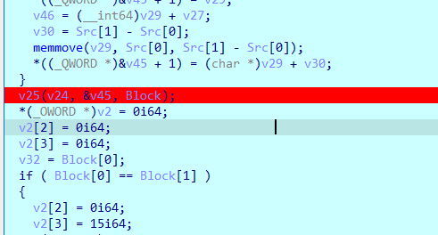
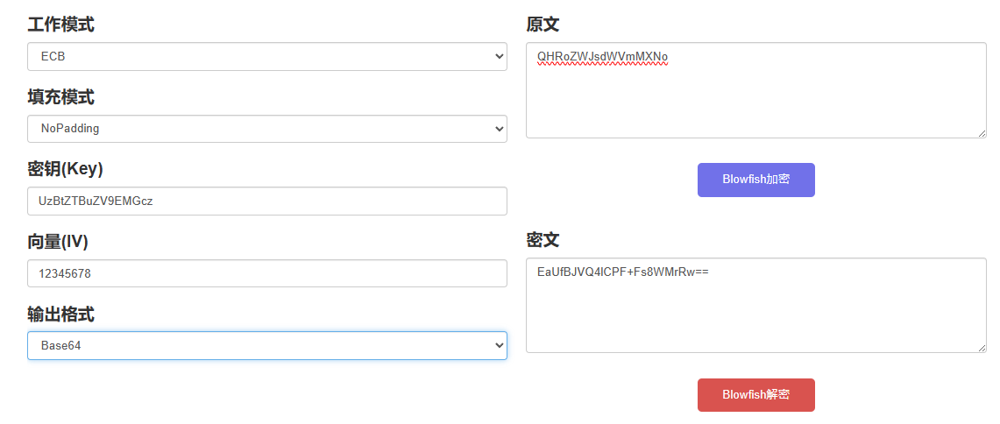
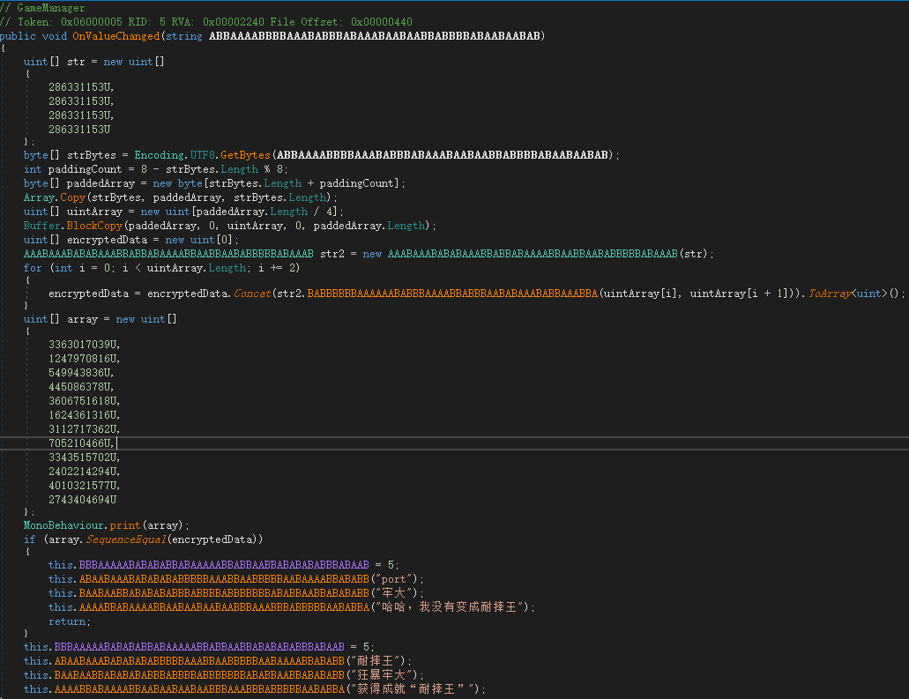

# 强网拟态

## fisher

### 逻辑

有异常，所有的逻辑基本都在catch那里。


处理输入的逻辑都在图中断点call的函数中。

这个函数具体可以分为三段：

1. 第一段感觉就是把输入从一个地方换到另一个地方

   ```C
     if ( *(_DWORD *)(a1 + 56) )
     {
       v6 = 0i64;
       v7 = (_QWORD *)(a1 + 40);
       v8 = *(_DWORD *)(a1 + 56);
       do
       {
         v9 = v7;
         v10 = v7[3];
         if ( v10 >= 0x10 )
           v9 = (_QWORD *)*v7;
         if ( *((_BYTE *)v9 + v6) == 10 )
           break;
         v11 = v7;
         if ( v10 >= 0x10 )
           v11 = (_QWORD *)*v7;
         if ( *((_BYTE *)v11 + v6) != 32 )
         {
           v12 = (const __m128i *)(a1 + 8);
           v13 = v7;
           if ( v10 >= 0x10 )
             v13 = (_QWORD *)*v7;
           v14 = *(_QWORD *)(a1 + 24);
           if ( *(_QWORD *)(a1 + 32) >= 0x10ui64 )
             v12 = (const __m128i *)v12->m128i_i64[0];
           if ( v14 )
           {
             input_index_on_table = sub_7FF64CFDF630(v12, *((_BYTE *)v13 + v6), v14);
             if ( input_index_on_table && input_index_on_table - (_QWORD)v12 != -1 )
             {
               v16 = v7;
               if ( v10 >= 0x10 )
                 v16 = (_QWORD *)*v7;
               v17 = (char *)v16 + v6;
               if ( v4 == v50 )
               {
                 sub_7FF64CFD9B10((const void **)&v49, v4, v17);
                 v4 = (_BYTE *)*((_QWORD *)&v49 + 1);
               }
               else
               {
                 *v4 = *v17;
                 v4 = (_BYTE *)++*((_QWORD *)&v49 + 1);
               }
             }
             a1 = v42;
           }
         }
         ++v5;
         ++v6;
       }
       while ( v5 < v8 );
       v3 = (_BYTE *)v49;
       v2 = v43;
     }
   ```

2. 第二段是将输入分为两个字符一组，每一组两个字符相同的在中间插入一个X

   ```C
     if ( v4 != v3 )
     {
       while ( 1 )
       {
         v21 = &v3[(unsigned int)index];
         if ( v20 == v48 )
         {
           sub_7FF64CFD9B10((const void **)Src, v20, v21);
           v22 = Src[1];
         }
         else
         {
           *v20 = *v21;
           v22 = ++Src[1];
         }
         index = (unsigned int)(index + 1);
         a1 = v49;
         if ( (unsigned int)index == *((_QWORD *)&v49 + 1) - (_QWORD)v49 )
           break;
         v23 = *(_BYTE *)(v49 + index);
         if ( v23 == *((_BYTE *)Src[0] + v19) )
         {
           v41[0] = 'X';
           if ( v22 == v48 )
           {
             sub_7FF64CFD9B10((const void **)Src, v22, v41);
             v20 = Src[1];
           }
           else
           {
             *v22 = 88;
             v20 = ++Src[1];
           }
         }
         else
         {
           if ( v22 == v48 )
           {
             sub_7FF64CFD9B10((const void **)Src, v22, (_BYTE *)(v49 + index));
             v20 = Src[1];
           }
           else
           {
             *v22 = v23;
             v20 = ++Src[1];
           }
           LODWORD(index) = index + 1;
         }
         v19 += 2;
         v3 = (_BYTE *)v49;
         a1 = *((_QWORD *)&v49 + 1) - v49;
         if ( (unsigned __int64)(unsigned int)index >= *((_QWORD *)&v49 + 1) - (_QWORD)v49 )
           goto LABEL_42;
       }
       v41[0] = 88;
       if ( v22 == v48 )
       {
         sub_7FF64CFD9B10((const void **)Src, v22, v41);
         v20 = Src[1];
       }
       else
       {
         *v22 = 88;
         v20 = ++Src[1];
       }
     }
   ```

3. 第三段就是利用一个表加密

   

   ```C
   void __fastcall sub_7FF64CFD3CA0(__int64 *a1, _QWORD *a2, __int64 a3)
   {
     _QWORD *str; // r15
     unsigned int v6; // esi
     unsigned int char1_mod_8; // ebp
     int char2_div_8; // r12d
     int char2_mod_8; // r13d
     char v10; // bl
     unsigned int v11; // r9d
     __int64 v12; // r8
     __int64 *v13; // rdx
     unsigned int v14; // ecx
     __int64 i; // rax
     unsigned int v16; // esi
     char v17; // bl
     int v18; // r9d
     __int64 v19; // r8
     __int64 *v20; // rdx
     int v21; // ecx
     __int64 j; // rax
     __int64 v23; // rbx
     _BYTE *v24; // r8
     _BYTE *v25; // rdx
     _BYTE *v26; // r8
     __int64 v27; // rax
     _QWORD *v28; // rcx
     unsigned int char1_div_8; // [rsp+30h] [rbp-68h]
     __int64 char1_div_8__; // [rsp+38h] [rbp-60h]
     __int64 v31; // [rsp+40h] [rbp-58h]
   
     str = a2;
     v31 = a2[1] - *a2;
     v6 = 0;
     char1_div_8 = 0;
     char1_mod_8 = 0;
     char2_div_8 = 0;
     char2_mod_8 = 0;
     if ( (_DWORD)v31 )
     {
       char1_div_8__ = 0i64;
       do
       {
         v10 = *(_BYTE *)(*str + v6);
         sub_7FF64CFDA6D3(2i64, (__int64)a2);
         v11 = 0;
         v12 = 0i64;
         v13 = a1 + 9;
         while ( 2 )
         {
           v14 = 0;
           for ( i = 0i64; i < 8; ++i )
           {
             if ( v10 == *((_BYTE *)v13 + i) )
             {
               char1_div_8 = v11;
               char1_div_8__ = v12;
               char1_mod_8 = v14;
               goto LABEL_10;
             }
             ++v14;
           }
           ++v11;
           ++v12;
           ++v13;
           if ( v12 < 8 )
             continue;
           break;
         }
   LABEL_10:
         v16 = v6 + 1;
         v17 = *(_BYTE *)(*str + v16);
         sub_7FF64CFDA6D3(2i64, (__int64)v13);
         v18 = 0;
         v19 = 0i64;
         v20 = a1 + 9;
         while ( 2 )
         {
           v21 = 0;
           for ( j = 0i64; j < 8; ++j )
           {
             if ( v17 == *((_BYTE *)v20 + j) )
             {
               char2_div_8 = v18;
               char2_mod_8 = v21;
               goto LABEL_17;
             }
             ++v21;
           }
           ++v18;
           ++v19;
           ++v20;
           if ( v19 < 8 )
             continue;
           break;
         }
   LABEL_17:
         if ( char1_div_8 == char2_div_8 )
         {
           v23 = 8 * char1_div_8__ + 72;
           v24 = (char *)a1 + v23 + (int)(char1_mod_8 + 1) % 8;
           v25 = *(_BYTE **)(a3 + 8);
           if ( v25 == *(_BYTE **)(a3 + 16) )
           {
             sub_7FF64CFD9B10((const void **)a3, v25, v24);
           }
           else
           {
             *v25 = *v24;
             ++*(_QWORD *)(a3 + 8);
           }
           sub_7FF64CFDA6D3(2i64, (__int64)v25);
           v26 = (char *)a1 + v23 + (char2_mod_8 + 1) % 8;
           a2 = *(_QWORD **)(a3 + 8);
           if ( a2 == *(_QWORD **)(a3 + 16) )
           {
             sub_7FF64CFD9B10((const void **)a3, a2, v26);
           }
           else
           {
             *(_BYTE *)a2 = *v26;
             ++*(_QWORD *)(a3 + 8);
           }
         }
         else
         {
           v27 = *a1;
           if ( char1_mod_8 == char2_mod_8 )
             (*(void (__fastcall **)(__int64 *, _QWORD, __int64, _QWORD, int))v27)(
               a1,
               char1_mod_8,
               a3,
               char1_div_8,
               char2_div_8);
           else
             (*(void (__fastcall **)(__int64 *, _QWORD, _QWORD, __int64, int, int))(v27 + 8))(
               a1,
               char1_div_8,
               char1_mod_8,
               a3,
               char2_div_8,
               char2_mod_8);
         }
         v6 = v16 + 1;
       }
       while ( v6 < (unsigned int)v31 );
     }
     v28 = (_QWORD *)*str;
     if ( *str )
     {
       if ( str[2] - (_QWORD)v28 >= 0x1000ui64 )
       {
         if ( (unsigned __int64)v28 - *(v28 - 1) - 8 > 0x1F )
           invalid_parameter_noinfo_noreturn();
         v28 = (_QWORD *)*(v28 - 1);
       }
       j_j_free(v28);
       *str = 0i64;
       str[1] = 0i64;
       str[2] = 0i64;
     }
   }
   
   // char1_mod_8 == char2_mod_8的分支
   __int64 __fastcall sub_7FF64CFD3B40(__int64 a1, int char1_mod_8, __int64 a3, int char1_div_8, int char2_div_8)
   {
     __int64 char1_mod_8_; // rsi
     _BYTE *v8; // rdx
     _BYTE *v9; // r8
     _BYTE *v10; // rdx
     _BYTE *v11; // r8
     __int64 result; // rax
   
     char1_mod_8_ = char1_mod_8;
     v8 = *(_BYTE **)(a3 + 8);
     v9 = (_BYTE *)(a1 + char1_mod_8_ + 8 * ((char1_div_8 + 1) % 8 + 9i64));
     if ( v8 == *(_BYTE **)(a3 + 16) )
     {
       sub_7FF64CFD9B10((const void **)a3, v8, v9);
     }
     else
     {
       *v8 = *v9;
       ++*(_QWORD *)(a3 + 8);
     }
     v10 = *(_BYTE **)(a3 + 8);
     v11 = (_BYTE *)(a1 + char1_mod_8_ + 8 * ((char2_div_8 + 1) % 8 + 9i64));
     if ( v10 == *(_BYTE **)(a3 + 16) )
       return (__int64)sub_7FF64CFD9B10((const void **)a3, v10, v11);
     result = (unsigned __int8)*v11;
     *v10 = result;
     ++*(_QWORD *)(a3 + 8);
     return result;
   }
   
   // else的分支
   unsigned __int64 __fastcall sub_7FF64CFD3C00(
           __int64 a1,
           int div_num1,
           int mod_num1,
           __int64 a4,
           int div_num2,
           int mod_num2)
   {
     __int64 v6; // rsi
     _BYTE *v9; // r8
     _BYTE *v10; // rdx
     _BYTE *v11; // r8
     _BYTE *v12; // rdx
     unsigned __int64 result; // rax
   
     v6 = mod_num1;
     v9 = (_BYTE *)(a1 + mod_num2 + 72i64 + 8i64 * div_num1);
     v10 = *(_BYTE **)(a4 + 8);
     if ( v10 == *(_BYTE **)(a4 + 16) )
     {
       sub_7FF64CFD9B10((const void **)a4, v10, v9);
     }
     else
     {
       *v10 = *v9;
       ++*(_QWORD *)(a4 + 8);
     }
     v11 = (_BYTE *)(a1 + v6 + 8 * (div_num2 + 9i64));
     v12 = *(_BYTE **)(a4 + 8);
     if ( v12 == *(_BYTE **)(a4 + 16) )
       return (unsigned __int64)sub_7FF64CFD9B10((const void **)a4, v12, v11);
     result = (unsigned __int8)*v11;
     *v12 = result;
     ++*(_QWORD *)(a4 + 8);
     return result;
   }
   ```
   

最后将结果与`N17EHf1DWHD40DWH/f79E05EfIH1E179E1`比较。

### exp

```python
table = "ghijklpqrstuvwxyzABCabcDEFdef0123GHI4567JKL+/MNOmnoPQRSXYZ8TUVW9"
stand_num = 0x2E8 - 0x2A0
r = "N17EHf1DWHD40DWH/f79E05EfIH1E179E1"
flag_hash = "2e95a5c5f9643df668d3965a6cdf19541bc0496b"
# 加密逻辑
# a = "1a3rGs"
# flag = ""
# for i in range(len(a) // 2):
#     num1 = table.index(a[i * 2])
#     div_num1 = num1 // 8
#     mod_num1 = num1 % 8
#     num2 = table.index(a[i * 2 + 1])
#     div_num2 = num2 // 8
#     mod_num2 = num2 % 8
#     if div_num1 == div_num2:
#         char1 = 8 * div_num1 + 72 + (mod_num1 + 1) % 8
#         char2 = 8 * div_num2 + 72 + (mod_num2 + 1) % 8
#     elif mod_num1 == mod_num2:
#         char1 = mod_num1 + 8 * ((div_num1 + 1) % 8 + 9)
#         char2 = mod_num2 + 8 * ((div_num2 + 1) % 8 + 9)
#     else:
#         char1 = mod_num2 + 72 + 8 * div_num1
#         char2 = mod_num1 + 72 + 8 * div_num2
#     flag += table[char1 - stand_num] + table[char2 - stand_num]
# print(flag)

# 解密逻辑
for i in range(len(r) // 2):
    char1 = r[i * 2]
    char2 = r[i * 2 + 1]
    num1 = table.index(char1) + stand_num
    num2 = table.index(char2) + stand_num

    for x in range(64):
        for y in range(64):
            div_x, mod_x = x // 8, x % 8
            div_y, mod_y = y // 8, y % 8
            if div_x == div_y:
                if (mod_x + 1) % 8 + 72 + 8 * div_x == num1 and (mod_y + 1) % 8 + 72 + 8 * div_y == num2:
                    print(table[x] + table[y], end="")
            elif mod_x == mod_y:
                if mod_x + 8 * ((div_x + 1) % 8 + 9) == num1 and mod_y + 8 * ((div_y + 1) % 8 + 9) == num2:
                    print(table[x] + table[y], end="")
            else:
                if mod_y + 72 + 8 * div_x == num1 and mod_x + 72 + 8 * div_y == num2:
                    print(table[x] + table[y], end="")
# 6c324d2c86a72b864a22f30e46d20220
```

最后解密的flag有两个X，根据处理输入第二段的逻辑，试一试，然后由前面有一段SHA1的哈希值`2e95a5c5f9643df668d3965a6cdf19541bc0496b`来确定flag。

看网上其他师傅的WP，可以直接解，无语了：[SOMD5](https://www.somd5.com/)


# 第六届安洵杯网络安全挑战赛

## mobilego

Go写的so文件，调试可以发现，`checkflag`就是字符换位：

```C
// mobile_go.Checkflag
__int64 __golang mobile_go_Checkflag(unsigned __int64 a1, __int64 a2, __int64 a3, __int64 a4, __int64 a5)
{
	......
    while ( (unsigned __int64)&v36.src.data <= *(_QWORD *)(v5 + 16) )
    {
        v38 = a1;
        runtime_morestack_noctxt(a1, a2, a3, a4, a5);
        a1 = v38;
    }
    v39 = a2;
    len_input = a1;
    v30 = qword_7FFF57234EB0;
    p_rand_rngSource = (rand_rngSource *)runtime_newobject(&RTYPE_rand_rngSource);
    math_rand__ptr_rngSource_Seed(p_rand_rngSource, v30);
    v11 = (void *)runtime_assertI2I2(
        (unsigned int)&RTYPE_rand_Source64,
        (unsigned int)off_7FFF571880C0,
        (_DWORD)p_rand_rngSource,
        a4,
        a5,
        v7,
        v8,
        v9,
        v10);
    *(_OWORD *)&v36.readVal = v6;
    v36.src.tab = off_7FFF571880C0;
    v36.src.data = p_rand_rngSource;
    v36.s64.tab = v11;
    v36.s64.data = off_7FFF571880C0;
    v12 = len_input;
    v17 = runtime_stringtoslicebyte((unsigned int)&v33, len_input, v39, a4, a5, v13, v14, v15, v16);
    v34 = v17;
    v22 = 0LL;
    while ( v12 > v22 )
    {
        index = v22;
        v31 = math_rand__ptr_Rand_Intn(&v36, v12, v22, a4, a5, v18, v19, v20, v21);
        v17 = math_rand__ptr_Rand_Intn(&v36, len_input, v23, a4, a5, v24, v25, v26, v27);
        v12 = len_input;
        if ( v31 >= len_input )
            runtime_panicIndex(v31, len_input, len_input);
        v28 = v34;
        a5 = *(unsigned __int8 *)(v31 + v34);
        if ( v17 >= len_input )
            runtime_panicIndex(v17, len_input, len_input);
        a4 = *(unsigned __int8 *)(v17 + v34);
        *(_BYTE *)(v34 + v31) = a4;
        *(_BYTE *)(v28 + v17) = a5;
        v22 = index + 1;
        LODWORD(v17) = v28;
    }
    return runtime_slicebytetostring(0, v17, v12, a4, a5, v18, v19, v20, v21);
}
```

写个`frida`把`equal`HOOK掉，看参数是什么，然后输入`abcdefghijklmnopqrstuvwxyz0123456789AB`得到表`v8l3oBjt4pk2myzfqbshucxwi0agA51d679ner`以及结果。

脚本：

```Python
ori = "abcdefghijklmnopqrstuvwxyz0123456789AB"
new = "v8l3oBjt4pk2myzfqbshucxwi0agA51d679ner"
result = "49021}5f919038b440139g74b7Dc88330e5d{6"
flag = ""
for i in range(len(ori)):
    flag += result[new.index(ori[i])]
print(flag)
```

## 你见过蓝色的小鲸鱼

程序有很明显的`Blowfish`加密算法的特征，第一次见。

`v8[8]`是PBOX。

```C
void __thiscall init_blowfish__(_DWORD *this)
{
    v8 = this;
    __CheckForDebuggerJustMyCode(&unk_521016);
    Block = 0;
    v4[0] = 0;
    v3[0] = 0;
    Sizea = v8[2];
    Block = j__malloc(Sizea);
    j__memset(Block, 0, v8[2]);
    Size = Sizea >> 2;
    for ( i = 0; i < Size; ++i )
        *((_DWORD *)Block + i) = j___byteswap_ulong(*(_DWORD *)(v8[1] + 4 * i));
    for ( i = 0; i < 18; ++i )
        *(_DWORD *)(v8[8] + 4 * i) ^= *((_DWORD *)Block + i % Size);
    v3[0] = 0;
    v4[0] = 0;
    for ( i = 0; i < 18; i += 2 )
    {
        blow_fish_enc_block(v4, v3);
        *(_DWORD *)(v8[8] + 4 * i) = v4[0];
        *(_DWORD *)(v8[8] + 4 * i + 4) = v3[0];
    }
    for ( i = 0; i < 4; ++i )
    {
        for ( j = 0; j < 256; j += 2 )
        {
            blow_fish_enc_block(v4, v3);
            *(_DWORD *)(v8[7] + (i << 10) + 4 * j) = v4[0];
            *(_DWORD *)(v8[7] + (i << 10) + 4 * j + 4) = v3[0];
        }
    }
    j__free(Block);
}
int *__thiscall enc_block(_DWORD *this, int *cl_, int *cr_)
{
    for ( i = 0; i < 8; ++i )
    {
        *cl_ ^= *(_DWORD *)(this[8] + 8 * i);
        *cr_ ^= F(*cl_);
        *cr_ ^= *(_DWORD *)(this[8] + 8 * i + 4);
        *cl_ ^= F(*cr_);
    }
    *cl_ ^= *(_DWORD *)(this[8] + 64);
    *cr_ ^= *(_DWORD *)(this[8] + 68);
    v4 = *cl_;
    *cl_ = *cr_;
    result = cr_;
    *cr_ = v4;
    return result;
}
int __thiscall sub_456EE0(void *this)
{
    ...
    v5 = this;
    __CheckForDebuggerJustMyCode(&unk_52102F);
    strcpy(Caption, "tip");
    strcpy(Text, "You Get It!");
    strcpy(v2, "Wrong user/passwd");
    if ( *((_DWORD *)v5 + 2) != *((_DWORD *)v5 + 3)
        || j__memcmp(*(const void **)v5, *((const void **)v5 + 1), *((_DWORD *)v5 + 3)) )
    {
        return MessageBoxA(0, v2, Caption, 0);
    }
    else
    {
        return MessageBoxA(0, Text, Caption, 0);
    }
}
```

用户名有提示是`UzBtZTBuZV9EMGcz`（Cyberchef提示我密钥8个字节，坑人），动调到比较处获取密文。

找了好几个网站才解密出来😭[在线Blowfish加密解密工具 (config.net.cn)](https://config.net.cn/tools/Blowfish.html)



拼接得到flag：`D0g3{UzBtZTBuZV9EMGczQHRoZWJsdWVmMXNo}`

## 感觉有点点简单

代码确实简单，出题人太好了

```C
__int64 __fastcall change_table_base64(__int64 a1, __int64 ori, int a3)
{
    strcpy(v6, "4KBbSzwWClkZ2gsr1qA+Qu0FtxOm6/iVcJHPY9GNp7EaRoDf8UvIjnL5MydTX3eh");
    ori_index = 0;
    v5 = 0;
    while ( ori_index < a3 )
    {
        *(a1 + v5) = v6[*(ori + ori_index) & 0x3F];
        *(a1 + v5 + 1) = v6[(4 * (*(ori + ori_index + 1) & 0xF)) | ((*(ori + ori_index) & 0xC0) >> 6)];
        *(a1 + v5 + 2) = v6[(16 * (*(ori + ori_index + 2) & 3)) | ((*(ori + ori_index + 1) & 0xF0) >> 4)];
        *(a1 + v5 + 3) = v6[(*(ori + ori_index + 2) & 0xFC) >> 2];
        ori_index += 3;
        v5 += 4;
    }
    if ( a3 % 3 == 1 )
    {
        *(a1 + v5 - 2) = 61;
        *(a1 + v5 - 1) = 61;
    }
    else if ( a3 % 3 == 2 )
    {
        *(a1 + v5 - 1) = 61;
    }
    return 0i64;
}

__int64 sub_1400016F0()
{
    NumberOfBytes[0] = 4096;
    memset(&v6, 0, sizeof(v6));
    RtlInitUnicodeString(&DestinationString, L"\\??\\C:\\Users\\Public\\flag.txt");
    *&NumberOfBytes[1] = ExAllocatePool(NonPagedPool, 0x1000ui64);
    P = ExAllocatePool(NonPagedPool, 0x1000ui64);
    if ( *&NumberOfBytes[1] && P )
    {
        v4 = NumberOfBytes[0];
        memset(P, 0, NumberOfBytes[0]);
        v5 = NumberOfBytes[0];
        memset(*&NumberOfBytes[1], 0, NumberOfBytes[0]);
        qmemcpy(v10, &DestinationString, 0x10ui64);
        if ( sub_140001040(v10, v6, *&NumberOfBytes[1], NumberOfBytes) )
        {
            if ( NumberOfBytes[0] <= 0xC00 )
            {
                rc4_enc(*&NumberOfBytes[1], NumberOfBytes[0], "the_key_", 8u);
                change_table_base64(P, *&NumberOfBytes[1], NumberOfBytes[0]);
                v1 = compare(P, 56i64);
                v8 = "tips: YES, RIGHT FLAG.   you got it!";
                v7 = "tips: NO , WRONG ANSWER. try again !";
                if ( v1 )
                    DbgPrint("tips: %s\n", v8);
                else
                    DbgPrint("tips: %s\n", v7);
            }
            else
            {
                DbgPrint("tips: file to long \n");
            }
        }
        else
        {
            DbgPrint("tips: can not read|open file\n");
        }
    }
    else
    {
        DbgPrint("tips: can not malloc\n");
    }
    if ( *&NumberOfBytes[1] )
    {
        ExFreePoolWithTag(*&NumberOfBytes[1], 0);
        *&NumberOfBytes[1] = 0i64;
    }
    if ( P )
    {
        ExFreePoolWithTag(P, 0);
        P = 0i64;
    }
    return 0i64;
}
bool __fastcall compare(const void *a1, int a2)
{
    return a2 == 56 && !memcmp(a1, "6zviISn2McHsa4b108v29tbKMtQQXQHA+2+sTYLlg9v2Q2Pq8SP24Uw=", 0x38ui64);
}
__int64 __fastcall rc4_enc(__int64 content, unsigned int content_len, __int64 key_str, int len_key)
{
    index = 0;
    v6 = 0;
    init_table(key_str, len_key);
    for ( i = 0; ; ++i )
    {
        result = content_len;
        if ( i >= content_len )
            break;
        index = (index + 1) % 64;
        v6 = (table[index] + v6) % 64;
        UGC::UGCompactFile::SwapByte_uchar___uchar___(&table[index], &table[v6]);
        *(content + i) ^= (v6 ^ index) & table[(((v6 ^ index) + table[v6] + table[index]) % 64)];
    }
    return result;
}
```

BASE64应该是有更改的，问题不大。

```Python
def a_dec_RC4(cipher, key):
    table = [i for i in range(64)]
    key_list = [ord(key[i % len(key)]) for i in range(64)]
    v6 = 0
    for i in range(64):
        v6 = (v6 + table[i] + key_list[i]) % 64
        table[i], table[v6] = table[v6], table[i]
    
    v6, index = 0, 0
    for i in range(len(cipher)):
        index = (index + 1) % 64
        v6 = (table[index] + v6) % 64
        table[index], table[v6] = table[v6], table[index]
        cipher[i] ^= (v6 ^ index) & table[((v6 ^ index) + table[v6] + table[index]) % 64]
    return cipher

def dec_base64(ss):
    base64table1 = "4KBbSzwWClkZ2gsr1qA+Qu0FtxOm6/iVcJHPY9GNp7EaRoDf8UvIjnL5MydTX3eh"
    result = []
    ori_index = 0
    new_index = 0
    while ori_index < len(ss):
        ch1, ch2, ch3, ch4 = ss[ori_index:ori_index+4]
        if ch4 == '=':
            ch4 = 'A'
        ch1, ch2, ch3, ch4 = base64table1.index(ch1), base64table1.index(ch2), base64table1.index(ch3), base64table1.index(ch4)
        result.append(ch1 | ((ch2 << 6) & 0xFF))
        result.append(((ch2 >> 2) & 0xF) | ((ch3 & 0xF) << 4))
        result.append(((ch3 >> 4) & 0x3) | ((ch4 << 2) & 0xFF))
        ori_index += 4
    return result

if __name__ == '__main__':
    c = "6zviISn2McHsa4b108v29tbKMtQQXQHA+2+sTYLlg9v2Q2Pq8SP24Uw="
    c = dec_base64(c)
    print(bytes(c))
    c = a_dec_RC4(c, "the_key_")
    print(bytes(c))
    # D0g3{608292C4-15400BA4-B3299A5C-704C292D}X
```

## 你好,PE

一堆函数通过PE文件一个个找赋值出来的，过程不会，直接调试了。

```C
int sub_1005F820()
{
    _DWORD *v1; // [esp+D0h] [ebp-8h]

    ((void (__thiscall *)(void *))unk_1005B16F)(&unk_1014000F);
    ((void (__stdcall *)(_DWORD, int, int, int))kernel32_VirtualAlloc)(0, 65548, 12288, 4);
    v1 = (_DWORD *)((int (*)(void))loc_1005A260)();
    if ( !v1 )
        return -1;
    v1[1] = 0x10000;
    *v1 = 0;
    v1[2] = v1 + 3;
    ((void (__cdecl *)(_DWORD, _DWORD, _DWORD))unk_10059572)(v1[2], 0, v1[1]);
    ((void (__cdecl *)(const char *))printf_0)("[out]: PLZ Input FLag \n");
    ((void (__cdecl *)(const char *))printf_0)("[in ]: ");
    ((void (__cdecl *)(void *, _DWORD))scanf)(&unk_10114B68, v1[2]);
    *v1 = ((int (__cdecl *)(_DWORD))unk_1005B5BB)(v1[2]); // 检测长度
    if ( *v1 == 0x29 )
    {
        *v1 = 0x30;
        ((void (__cdecl *)(_DWORD *))loc_1005A242)(v1); // 加密
        if ( ((int (__cdecl *)(_DWORD, void *, int))loc_10058AA0)(v1[2], &unk_1013C008, 48) ) // 比较
            ((void (__cdecl *)(const char *))printf_0)("[out]: WRONG FLAG\n");
        else
            ((void (__cdecl *)(const char *))printf_0)("[out]: RIGHT FLAG\n");
        ((void (__stdcall *)(_DWORD *, _DWORD, int))kernel32_VirtualFree)(v1, 0, 49152);
        ((void (*)(void))loc_1005A260)();
        return 0;
    }
    else
    {
        ((void (__cdecl *)(const char *))printf_0)("[out]: len error\n");
        ((void (__stdcall *)(_DWORD *, _DWORD, int))kernel32_VirtualFree)(v1, 0, 49152);
        ((void (*)(void))loc_1005A260)();
        return -1;
    }
}
// 加密逻辑
_DWORD *__cdecl sub_1005F6F0(_DWORD *a1)
{
    _DWORD *result; // eax
    int input_0_4; // ecx
    int j; // [esp+D0h] [ebp-30h]
    unsigned int i; // [esp+DCh] [ebp-24h]
    __int64 input_4_8; // [esp+E8h] [ebp-18h]
    int *v6; // [esp+F8h] [ebp-8h]

    ((void (__thiscall *)(void *))unk_1005B16F)(&unk_1014000F);
    for ( i = 0; ; ++i )
    {
        result = a1;
        if ( i >= *a1 >> 3 )
            break;
        v6 = (int *)(a1[2] + 8 * i);                // a1[2]为input
        input_0_4 = *v6;
        input_4_8 = *(_QWORD *)v6;
        for ( j = 0; j < 64; ++j )
        {
            LOBYTE(input_0_4) = 1;
            if ( input_4_8 < 0 )
                input_4_8 = dword_1013C000 ^ ((__int64 (__fastcall *)(int, _DWORD))loc_10059F9F)(input_0_4, HIDWORD(input_4_8));
            else
                input_4_8 = ((__int64 (__fastcall *)(int, _DWORD))loc_10059F9F)(input_0_4, HIDWORD(input_4_8));
        }
        *(_QWORD *)v6 = input_4_8;
    }
    return result;
}
// loc_10059F9F
int __usercall sub_1005FDE0@<eax>(__int64 a1@<edx:eax>, unsigned __int8 a2@<cl>)
{
    __int64 v2; // rax

    if ( a2 >= 0x40u )
    {
        LODWORD(v2) = 0;
    }
    else if ( a2 >= 0x20u )
    {
        LODWORD(v2) = 0;
    }
    else
    {
        return a1 << (a2 & 0x1F);
    }
    return v2;
}
```

比较没有细看，直接猜`unk_1013C008`是密文了。

脚本：

```Python
import struct
# 移位后 num1末尾一定为0
def shld(num1, num2, count=1):
    return ((num1 << count) & 0xffffffff), (((num2 << count) & 0xffffffff) | (num1 >> (32 - count)))

# enc
def enc():
    input = b"1234567890123456789012345678901234567890"
    input = list(struct.unpack('<10I', input))
    # input = [0x36353433, 0x30393837]
    for i in range(len(input) // 2):
        num1, num2 = input[i * 2], input[i * 2 + 1]
        for _ in range(64):
            if num2 >> 31:
                num1, num2 = shld(num1, num2)
                num1 = num1 ^ 0x54AA4A9
            else:
                num1, num2 = shld(num1, num2)
        input[i * 2], input[i * 2 + 1] = num1, num2
    print([hex(i) for i in input])


def decshld(num1, num2, pad, count=1):
    return ((num1 >> count) | ((num2 & 1) << (32 - count))), ((num2 >> count) | (pad << (32 - count)))

# dec
result = [0x2976B84D, 0x599EA9F5, 0xC4B15655, 0x302C212F, 0x177879B3, 0xDBF7EDA8, 0xDBF053E1, 0x5E5103E9, 0xDF00C109, 0xC1FC96F0, 0x9562E6B5, 0x00000001]
for i in range(len(result) // 2):
    num1, num2 = result[i * 2], result[i * 2 + 1]
    for _ in range(64):
        # 如果 num1末位不为0，则说明异或过了
        if num1 & 1 != 0:
            num1 ^= 0x54AA4A9
            num1, num2 = decshld(num1, num2, 1)
        else:
            num1, num2 = decshld(num1, num2, 0)
    result[i * 2], result[i * 2 + 1] = num1, num2
print([hex(i) for i in result])
result = b''.join([struct.pack('<I', i) for i in result])
print(result)
# b'D0g3{60E1E72A-576A8BF0-7701CBB9-B02415EC}\x00\x00\x00\x00\x00\x00\x00'
```

## 牢大想你了

没太懂这些逻辑到底干嘛。

但是找到个这个，说实话有点抽象了



脚本：

```Python
# public uint[] BABBBBBBAAAAAABABBBAAAABBABBBAABABAAABABBAAABBA(uint ABBAABAAAAAABAAAABBBBBBABAABAAAABBBABBBAABBABBA, uint BAABBAAAAABABBAABBABBAABABABABABABAAABABBBABABA)
# 	{
# 		uint v0 = ABBAABAAAAAABAAAABBBBBBABAABAAAABBBABBBAABBABBA;
# 		uint v = BAABBAAAAABABBAABBABBAABABABABABABAAABABBBABABA;
# 		uint sum = 0U;
# 		uint delta = 2654435769U;
# 		uint[] key = this.BBABABBBABBABABAAABBBAABBAAAAAAABBBBBAABBAAAAAA;
# 		for (int i = 0; i < 32; i++)
# 		{
# 			sum += delta;
# 			v0 += ((v << 4) + key[0] ^ v + sum ^ (v >> 5) + key[1]);
# 			v += ((v0 << 4) + key[2] ^ v0 + sum ^ (v0 >> 5) + key[3]);
# 		}
# 		return new uint[]
# 		{
# 			v0,
# 			v
# 		};
# 	}
import struct 
def tea_dec(cipher, key):  
    num = (2654435769 * 32) & 0xFFFFFFFF
    for i in range(32):  
        cipher[1] -= ((num + cipher[0]) ^ ((cipher[0] << 4) + key[2]) ^ ((cipher[0] >> 5) + key[3])) & 0xFFFFFFFF  
        cipher[1] &= 0xFFFFFFFF  
        cipher[0] -= ((num + cipher[1]) ^ ((cipher[1] << 4) + key[0]) ^ ((cipher[1] >> 5) + key[1])) & 0xFFFFFFFF  
        cipher[0] &= 0xFFFFFFFF  
        num = (num - 2654435769) & 0xFFFFFFFF  
    return cipher  
result = [  
    3363017039, 1247970816, 549943836, 445086378, 3606751618, 1624361316, 3112717362, 705210466, 3343515702, 2402214294, 4010321577, 2743404694
]  
flag = [] 
key = [
    286331153, 286331153, 286331153, 286331153
]
content = []  
for i in range(0, len(result), 2):  
    content += tea_dec(result[i:i + 2], key)  
for i in range(len(content)):  
    flag += struct.pack('<i', content[i])  
print(bytes(flag))
# b'it_is_been_a_long_day_without_you_my_friend\x00\x00\x00\x00\x00'
```

