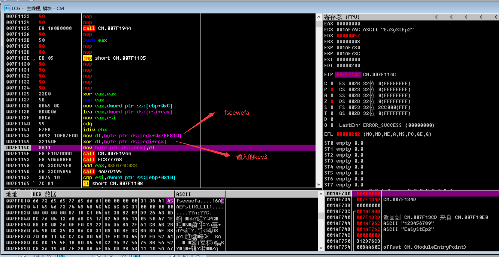

## VMP2.07题目

VMP2.07的壳

### 脱壳

1. 右键 -> FKVMP -> start
   1. 记录`retn`地址：`0x96166E` (在Log data窗口)
   2. 
2. `Ctrl+G`搜索`VirtualProtect`，下断点
3. `F9`运行到堆栈区出现`NewProtect=PAGE_READONLY`
   1. 
4. 取消`VirtualProtect`断点，对代码段下内存访问断点（`ALT+M`打开Mamory map窗口），F9运行
   1. 
5. `Ctrl+G`搜索`retn`地址：`0x96166E`，下断点，F9运行
6. 取消代码段的内存访问断点，F9运行
7. 取消`retn`地址的断点
8. 给代码段下内存访问断点
9. F9运行来到OEP
   1. 

### 分析

#### key1

```assembly
.text:007F11B9                 push    offset aInputKey1 ; "Input Key1: "
.text:007F11BE                 call    printf
.text:007F11C3                 lea     eax, [ebp-11Ch]
.text:007F11C9                 push    eax
.text:007F11CA                 push    offset a250s    ; "%250s"
.text:007F11CF                 call    scanf
.text:007F11D4                 push    9
.text:007F11D6                 push    offset aEasystep1 ; "EaSyStEp1"
.text:007F11DB                 lea     ecx, [ebp-11Ch]
.text:007F11E1                 push    ecx
.text:007F11E2                 call    sub_7F2569
.text:007F11E7                 add     esp, 18h
.text:007F11EA                 test    eax, eax
.text:007F11EC                 jnz     loc_7F146C
```

输入后`key1`后，与`EaSyStEp1`一起进入`sub_7F2569`，第三个参数为9

```C
int __cdecl sub_7F2569(char *a1, _BYTE *a2, unsigned int a3)
{
    v13 = 0;
    if ( !a3 )
        return 0;
    if ( a3 < 5 )
    {...}
    else
    {
        v4 = a2;
        v5 = a1;
        while ( 1 )
        {
            v6 = *v5;
            v5 += 4;
            v4 += 4;
            if ( !v6 || v6 != *(v4 - 4) )
                break;
            v7 = *(v5 - 3);
            if ( !v7 || v7 != *(v4 - 3) )
            {
                v10 = (unsigned __int8)*(v5 - 3);
                v11 = (unsigned __int8)*(v4 - 3);
                return v10 - v11;
            }
            v8 = *(v5 - 2);
            if ( !v8 || v8 != *(v4 - 2) )
            {
                v10 = (unsigned __int8)*(v5 - 2);
                v11 = (unsigned __int8)*(v4 - 2);
                return v10 - v11;
            }
            v9 = *(v5 - 1);
            if ( !v9 || v9 != *(v4 - 1) )
            {
                v10 = (unsigned __int8)*(v5 - 1);
                v11 = (unsigned __int8)*(v4 - 1);
                return v10 - v11;
            }
            v13 += 4;
            if ( v13 >= a3 - 4 )
                goto LABEL_20;
        }
        v10 = (unsigned __int8)*(v5 - 4);
        v11 = (unsigned __int8)*(v4 - 4);
    }
    return v10 - v11;
}
```

一个字节一个字节的比较。`key1: EaSyStEp1`

#### key2

```assembly
.text:007F11FC                 lea     edx, [ebp-11Ch]
.text:007F1202                 push    edx
.text:007F1203                 push    offset a250s    ; "%250s"
.text:007F1208                 call    scanf
.text:007F120D                 add     esp, 0Ch
.text:007F1210                 lea     eax, [ebp-11Ch]
.text:007F1216                 lea     edx, [eax+1]
.text:007F1219                 lea     esp, [esp+0]
.text:007F1220
.text:007F1220 loc_7F1220:                             ; CODE XREF: .text:007F1225↓j
.text:007F1220                 mov     cl, [eax]
.text:007F1222                 inc     eax
.text:007F1223                 test    cl, cl
.text:007F1225                 jnz     short loc_7F1220
.text:007F1227                 sub     eax, edx
.text:007F1229                 lea     ecx, [ebp-11Ch]
.text:007F122F                 push    ecx
.text:007F1230                 lea     esi, [ebp-31Ch]
.text:007F1236                 mov     edx, eax
.text:007F1238                 call    base64
.text:007F123D                 push    9
.text:007F123F                 push    offset aEasystep2 ; "EaSyStEp2"
.text:007F1244                 mov     edx, esi
.text:007F1246                 push    edx
.text:007F1247                 call    memcmp
.text:007F124C                 add     esp, 10h
.text:007F124F                 test    eax, eax
.text:007F1251                 jnz     loc_7F146C
```

`EaSyStEp2`的base64编码：`RWFTeVN0RXAy`

#### key3

0x7F26C3 printf

0x7F26A6 scanf


key3部分还是无法正常看的，就动调了。

调出来OEP后，搜索`Next Key:`，下内存断点，F9运行，断在程序逻辑中。


程序key3逻辑部分有很多花指令，需要修改。

有些call是更改了返回地址的，单步步过会直接飞了。

可以在`0x7F26A6`即获取输入函数下断点（key1、key2逻辑很容易判断出哪一个是获取输入的函数），然后根据栈中的返回地址找到执行获取key3输入的地址。


进一步调试，来到这里，就是变化和验证key3的位置了。

验证比对的函数与key1逻辑中的是一样的。


循环异或key3：



故key3逻辑：

```Python
s1 = 'fseewefa'
s2 = 'EaSyStEp3'
flag = []
for i in range(9):
    flag.append(ord(s1[i % 8]) ^ ord(s2[i]))
print(flag)
print(bytes(flag))
# [35, 18, 54, 28, 36, 17, 35, 17, 85]
# b'#\x126\x1c$\x11#\x11U'
```

## ptrace题目


`orig_rax`字段是一个特别的字段，保存了发起系统调用的原始编号。

[linux 系统调用号表](https://blog.csdn.net/qq_29343201/article/details/52209588): `#define __NR_read 0`


在执行系统调用之前，内核会先检查当前进程是否处于被“跟踪”(traced)的状态。如果是的话，内核暂停当前进程并将控制权交给跟踪进程，使跟踪进程得以察看或者修改被跟踪进程的寄存器。


### 分析

```C
#include <sys/types.h>
#include <sys/wait.h>
#include <sys/user.h>
#include <sys/ptrace.h>
#include <unistd.h>
#include <stdio.h>
#include <string.h>
#include "./defs.h"
#include <sys/syscall.h>

int main(int argc, const char **argv, const char **envp)
{
    pid_t child;
    long long int status;
    struct user_regs_struct regs;
    child = fork();
    if (child == 0)
    {
        ptrace(PTRACE_TRACEME, 0, 0, 0);
        execl("puppet", "puppet", NULL);
    }
    printf("PID: %d\n", child);
    wait(&status);
    if (WIFEXITED(status))
        return 0;
    // 给系统调用下断点  在进入或退出都会断
    ptrace(PTRACE_SYSCALL, child, 0, 0);
    // HIDWORD(status)与wait(&status)无关，wait只会影响status的低八位
    // HIDWORD(status)其实为一个标志位，用来标记是否是系统调用退出
    // 0 为 进入，1 为 退出
    HIDWORD(status) = 0;
    unsigned long long int rsi = 0;
    // 开启循环，获取trace进程的用户输入的数据
    while (1)
    {
        wait(&status);
        if (WIFEXITED(status))
            break;
        // 获取系统调用号, 120为orig_rax的偏移量
        long int orig_rax = ptrace(PTRACE_PEEKUSER, child, 120, 0);
        // SYS_read
        if (!orig_rax) // 如果系统调用号为0 -> read
        {
            // 获取寄存器的值
            ptrace(PTRACE_GETREGS, child, 0, &regs);
            // 判断HIDWORD(status) 是否为系统调用退出状态
            // 只有系统调用退出,用户才输入完数据的
            if (HIDWORD(status)) {
                // 如果rax(调用返回值)不为0，说明读取到的数据长度大于0
                // 如果rsi不为0，说明读取到的数据存放在rsi中
                if (rsi && regs.rax)
                {
                    size_t size = 8 * ((regs.rax >> 3) + 1);
                    for (size_t i = 0; i <= (size + 6); i += 8)
                    {
                        // 获取用户输入的数据(8字节)
                        long data = ptrace(PTRACE_PEEKDATA, child, rsi + i, 0);
                        long temp = data;
                        *((char *)&temp) = *((char *)&data + 5);
                        *((char *)&temp + 1) = *((char *)&data + 7);
                        *((char *)&temp + 2) = *((char *)&data + 6);
                        *((char *)&temp + 5) = *((char *)&data);
                        *((char *)&temp + 6) = *((char *)&data + 2);
                        *((char *)&temp + 7) = *((char *)&data + 1);
                        for (size_t j = 0; i + j < regs.rax && j <= 7; j++)
                            *((char *)&temp + j) -= i + j;
                        *((char *)&temp + 3) = *((char *)&data + 4);
                        *((char *)&temp + 4) = *((char *)&data + 3);
                        printf("Data: %lx\n", temp);
                        // 将更改的数据放回原来的位置
                        ptrace(PTRACE_POKEDATA, child, rsi + i, temp);
                    }
                    rsi = 0;
                    break;
                }
                // 标志变量翻转
                HIDWORD(status) = 0;
            } else {
                // 标志变量翻转
                HIDWORD(status) = 1;
                // 如果rdi为0，说明从标准输入获取数据
                // 则将rsi设置为rsi的值
                if (!regs.rdi)
                    rsi = regs.rsi;
            }
        } 
        // else if (orig_rax == 1) 
        // {
        //     // 这里是用来测试PTRACE_SYSCALL是否是在进入或退出时下断的
        //     // 通过输出可以看出，其输出了两次一模一样的内容
        //     printf("syscall write\n");
        //     ptrace(PTRACE_GETREGS, child, 0, &regs);
        //     printf("rax: 0x%lx\n", regs.rax);
        //     printf("rdi: 0x%lx\n", regs.rdi);
        //     long data = ptrace(PTRACE_PEEKDATA, child, regs.rsi, 0);
        //     printf("write data: %lx\n", data);
        // }
        ptrace(PTRACE_SYSCALL, child, 0, 0);
    }
    ptrace(PTRACE_SINGLESTEP, child, 0, 0);
    int v9 = 0;
    long key[6] = {
        0xA39C3E6994313F40, 0x17872470565B9B60, 0x11A918AABA97CA68, 
        0xB8F1B0AB9B3DD3B0, 0x488749FB6A1835E4, 0x82926F78FE98158
    };
    while (1)
    {
        wait(&status);
        if (WIFEXITED(status))
            break;
        struct user_regs_struct regs;
        long rip = ptrace(PTRACE_PEEKUSER, child, 128LL, 0LL);
        long instruction = ptrace(PTRACE_PEEKDATA, child, rip, 0LL);
        // 判断是否执行到如下指令(**)
        // 对用户输入数据进行异或0x28的部分
        // .text:0000000000001285 8B 45 A4          mov     eax, [rbp+var_5C]
        // .text:0000000000001288 48 98             cdqe
        // .text:000000000000128A 0F B6 44 05 B0    movzx   eax, [rbp+rax+buf]
        // .text:000000000000128F 83 F0 28          xor     eax, 28h
        // .text:0000000000001292 89 C2             mov     edx, eax            ** 
        // .text:0000000000001294 8B 45 A4          mov     eax, [rbp+var_5C]   ** 将index放入rax
        // .text:0000000000001297 48 98             dqe
        // .text:0000000000001299 88 54 05 B0       mov     [rbp+rax+buf], dl
        // .text:000000000000129D 83 45 A4 01       add     [rbp+var_5C], 1
        if (
            (rip & 0xFFF) == 0x292 && 
            (instruction & 0xFFFFFFFFFFLL) == 0xA4458BC289LL
        )
        {
            ptrace(PTRACE_GETREGS, child, 0LL, &regs);
            unsigned int index = \
                (unsigned int)ptrace(PTRACE_PEEKDATA, child, regs.rbp - 0x5C, 0LL);
            // 异或结果 + key[index]
            regs.rax += (unsigned int)key[index];
            ptrace(PTRACE_SETREGS, child, 0LL, &regs);
            v9 = 1;
        }
        ptrace(PTRACE_SINGLESTEP, child, 0LL, 0LL);
    }
    do
    {
        ptrace(PTRACE_CONT, child, 0, 0);
        wait(&status);
    }
    while (!WIFEXITED(status));
    return 0;
}
```

### exp

```Python

import struct
key = [
    0xA39C3E6994313F40, 0x17872470565B9B60, 0x11A918AABA97CA68, 
    0xB8F1B0AB9B3DD3B0, 0x488749FB6A1835E4, 0x082926F78FE98158
]
key = struct.pack('Q'*6, *key)
key = list(key)
ct = [
    0x9C, 0x56, 0x89, 0xF3, 0xC1, 0x41, 0xDE, 0xE3, 
    0xD1, 0x9B, 0x6C, 0xA4, 0xB1, 0xA2, 0x00, 0x35, 
    0x81, 0xD4, 0x10, 0xD0, 0xF3, 0x29, 0x0A, 0x89, 
    0x13, 0x45, 0xA0, 0x08, 0xCA, 0x1F, 0x0F, 0x20, 
    0x00, 0x4F, 0x56, 0x81, 0x03, 0x5B, 0xAB, 0xC3, 
    0xC7, 0xFD, 0xF7, 0xBB, 0x09, 0x3B, 0x95, 0x08
]
flag = []
for i in range(48):
    # ct[i] = ((input[i] ^ 0x28) + key[i]) & 0xFF
    flag.append(((ct[i] - key[i]) & 0xFF) ^ 0x28)
for i in range(0, 48, 8):
    t = [0] * 8
    flag[i + 3], flag[i + 4] = flag[i + 4], flag[i + 3]
    for j in range(8):
        flag[i + j] += i + j
    t[0] = flag[i + 5]
    t[1] = flag[i + 7]
    t[2] = flag[i + 6]
    t[5] = flag[i + 0]
    t[6] = flag[i + 2]
    t[7] = flag[i + 1]
    flag[i:i+3] = t[0:3]
    flag[i+5:i+8] = t[5:8]
print(''.join([chr(i) for i in flag]))
```

