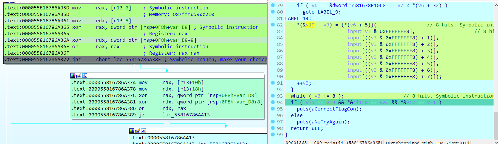
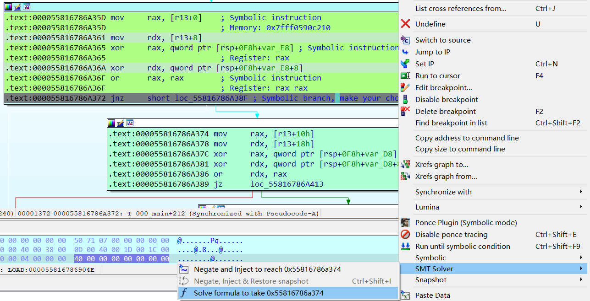
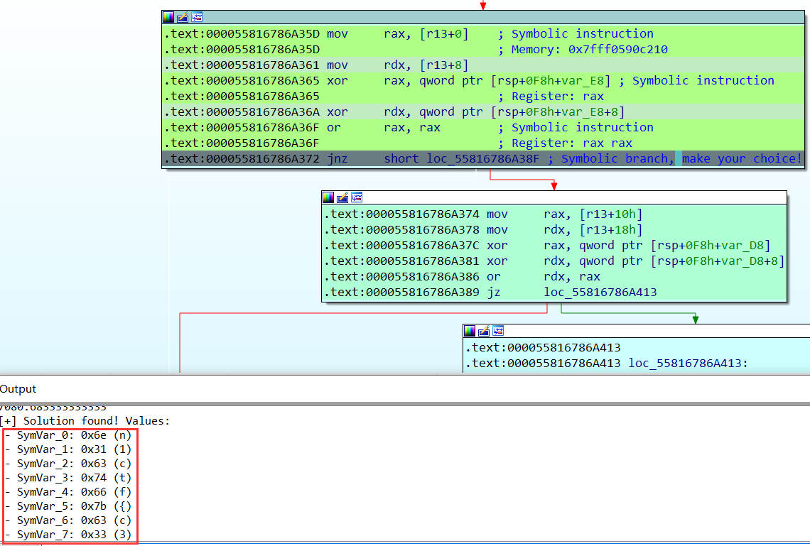
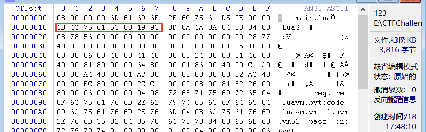
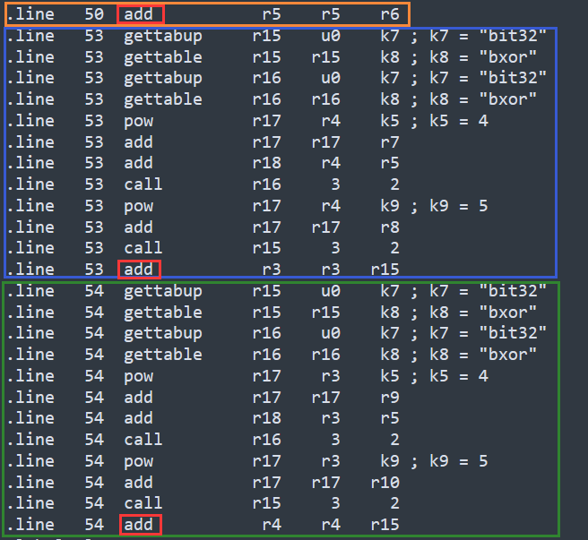
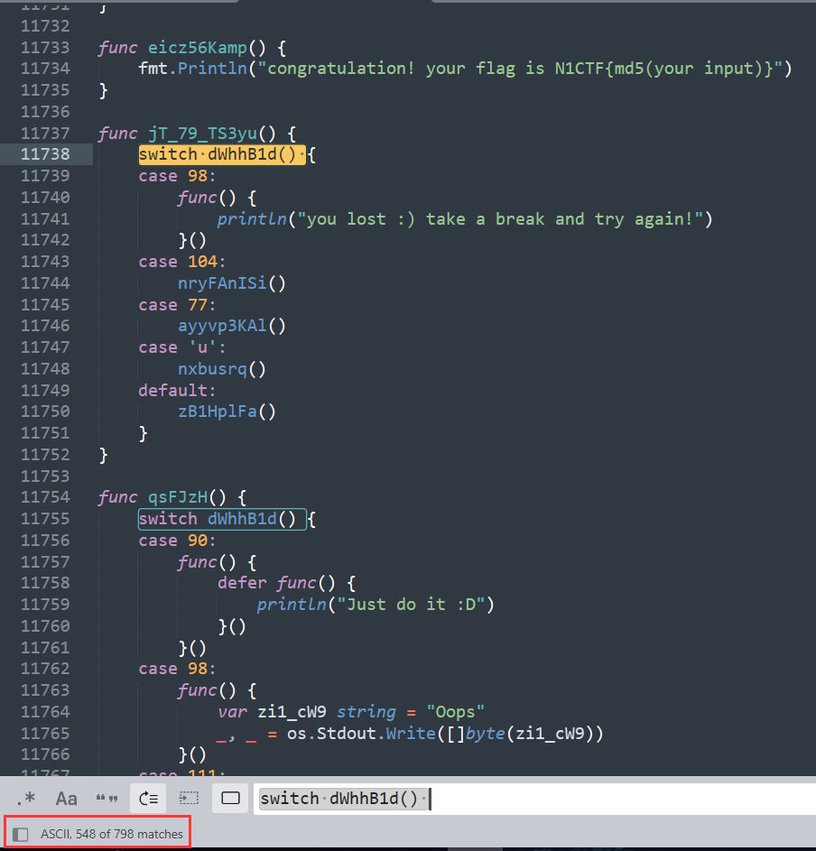

## AdditionPlus

程序获取输入，然后八个字节八个字节的加密。

八个字节的加密方式是分别经过八个函数，每个函数得到一个字节的运算结果，然后进行比对。

每个函数有一堆运算由与、异或、左移1位组成。

```C
__int64 __fastcall main(int a1, char **a2, char **a3)
{
    __int64 v3; // r15
    __int64 v4; // rax
    __int64 v5; // r12
    int *v6; // r14
    char v7; // cl
    char v8; // al
    __int64 v9; // rax
    __int64 v10; // rdx
    _BOOL8 v11; // rdi
    int *v13; // [rsp+8h] [rbp-F0h]
    int *v14; // [rsp+8h] [rbp-F0h]
    unsigned __int64 v15; // [rsp+10h] [rbp-E8h]
    __m128i si128; // [rsp+20h] [rbp-D8h]
    __m128i v17; // [rsp+30h] [rbp-C8h]
    char input[64]; // [rsp+40h] [rbp-B8h] BYREF
    __int128 v19; // [rsp+80h] [rbp-78h]
    __int128 v20; // [rsp+90h] [rbp-68h]
    __int128 v21; // [rsp+A0h] [rbp-58h]
    __int16 v22; // [rsp+B0h] [rbp-48h]
    unsigned __int64 v23; // [rsp+B8h] [rbp-40h]

    v3 = 0LL;
    v23 = __readfsqword(0x28u);
    v22 = 0;
    v15 = _mm_load_si128(&xmmword_5581678DF060).m128i_u64[0]; // 加密结果
    si128 = _mm_load_si128(&xmmword_5581678DF070);
    v17 = _mm_load_si128(&xmmword_5581678DF080);
    v19 = 0LL;
    v20 = 0LL;
    v21 = 0LL;
    puts("flag>>");
    __isoc99_scanf("%48s", input);
    do
    {
        ...
            
        LABEL_14:
        // 分别调用八个加密函数
        *(&v19 + v3) = (*(v6 + 5))(			// 8 hits. Symbolic instruction
            input[v3 & 0xFFFFFFF8],			// 8 hits. Symbolic instruction
            input[((v3 & 0xFFFFFFF8) + 1)],			// 8 hits. Symbolic instruction
            input[((v3 & 0xFFFFFFF8) + 2)],			// 8 hits. Symbolic instruction
            input[((v3 & 0xFFFFFFF8) + 3)],			// 8 hits. Symbolic instruction
            input[((v3 & 0xFFFFFFF8) + 4)],			// 8 hits. Symbolic instruction
            input[((v3 & 0xFFFFFFF8) + 5)],			// 8 hits. Symbolic instruction
            input[((v3 & 0xFFFFFFF8) + 6)],			// 8 hits. Symbolic instruction
            input[((v3 & 0xFFFFFFF8) + 7)]);			// 8 hits. Symbolic instruction
        ++v3;
    }
    while ( v3 != 48 );			// 8 hits. Symbolic instruction
    if ( v15 == v19 && *&si128 == v20 && *&v17 == v21 )			// Symbolic instruction
        puts(aCorrectFlagCon);
    else
        puts(aNoTryAgain);
    return 0LL;
}
```

### 解法一——Ponce

这里看了师傅的WP复现一下👉[2023 N1CTF writeup by Arr3stY0u](https://cn-sec.com/archives/2140081.html)

顺便了解一下Ponce这个工具的使用。

首先，[illera88/Ponce](https://github.com/illera88/Ponce)获取两个`DLL`直接放在`plugins`目录下即可。

进入IDA，由Ponce配置设置，这里红框中有时间的设置，在这题得设大一些。


这里每次八个字节进行符号执行，以前八个字节为例，先对程序进行Patch。

前八个字节，就先将index上限到8。

然后比对的时候，程序是十六个字节进行比对的，这里将`or rdx, rax`改为`or rax, rax`，即可改为只比对前八个字节。


在程序获取输入后，为前八字节进行操作：


接下来可以直接运行到判断前八字节比对结果的跳转指令处：



在这里，如果比对失败会走`0x000055816786A38F`，比对成功会走`0x000055816786A374`，这里由于输入的不是flag，会走`0x000055816786A38F`，这里让Ponce解出走`0x000055816786A374`的输入：



跑了小久，成功解出前八个字节的flag：



尝试一次跑十六个字节的，也是可以的：


之后就是如法炮制解出剩余flag：`n1ctf{c327b78b-8ead-425H1N09d-89fb-1d2d0a8f3e7c}`

## N1LLua

[N1CTF2023-N1LLua | OrientalGlass](https://orientalglass.github.io/2023/10/25/比赛/N1CTF2023/N1CTF2023-N1LLua/) 👈 看这位师傅的WP

使用AssetBundleExtractor导出`main.lua`:


根据`luac`的文件头删去多余的前十六个字节：



使用`unluac`来反编译：`java -jar .\unluac.jar .\main.lua-resources.assets-13.dat > main.lua`

```lua
local L0_1, L1_1, L2_1, L3_1, L4_1
L0_1 = require
L1_1 = "luavm.bytecode"
L0_1 = L0_1(L1_1)
L1_1 = require
L2_1 = "luavm.vm"
L1_1 = L1_1(L2_1)
L2_1 = require
L3_1 = "luavm.vm52"
L2_1(L3_1)

function L2_1(...)
  local L0_2, L1_2
  L0_2, L1_2 = ...
  return L0_2, L1_2
end

pass = L2_1

function L2_1(A0_2)
  local L1_2, L2_2, L3_2, L4_2
  L2_2 = A0_2
  L1_2 = A0_2.gsub
  L3_2 = "%x%x"
  
  function L4_2(A0_3)
    local L1_3, L2_3, L3_3, L4_3
    L1_3 = string
    L1_3 = L1_3.char
    L2_3 = tonumber
    L3_3 = A0_3
    L4_3 = 16
    L2_3, L3_3, L4_3 = L2_3(L3_3, L4_3)
    return L1_3(L2_3, L3_3, L4_3)
  end
  
  L1_2 = L1_2(L2_2, L3_2, L4_2)
  return L1_2
end

function L3_1(A0_2)
  local L1_2, L2_2, L3_2, L4_2
  L2_2 = A0_2
  L1_2 = A0_2.gsub
  L3_2 = "."
  
  function L4_2(A0_3)
    local L1_3, L2_3, L3_3, L4_3
    L1_3 = string
    L1_3 = L1_3.format
    L2_3 = "%02x"
    L4_3 = A0_3
    L3_3 = A0_3.byte
    L3_3, L4_3 = L3_3(L4_3)
    return L1_3(L2_3, L3_3, L4_3)
  end
  
  L1_2 = L1_2(L2_2, L3_2, L4_2)
  return L1_2
end

function L4_1(A0_2)
  local L1_2, L2_2, L3_2, L4_2
  L1_2 = L2_1
  L2_2 = "1b4c7561520001040804080019930d0a1a0a0a0000005f000000000102090000002500000008000080254000000800808006404000660000001e0000001f0000001f00800002000000040800000000000000656e6372797074000405000000000000006d61696e00020000002b0000003a0000000300132e000000cd004001c7c000000d414001070101004181000081c10000c701c0000742c0004702c1008742c100c10200000183010041030000e10206804d818102c6c34100c703c20706c4410007044208524441024dc481088d4401021d848001524442024d048208dd838001cdc08301c6c34100c703c20706c44100070442085244c1014d4482088d4481011d8480015244c2014d848208dd8380010dc10302e042f97fcd0240010d434001400380010a0001060a4083051f0080000a00000003000000000000f03f0300000000000000400300000000000000000300002037efc6e34103000000000000084003000000000000104003000000000000404004060000000000000062697433320004050000000000000062786f7200030000000000001440000000000100000000000a0000000000000040746573742e6c7561002e0000002c0000002c0000002c0000002c0000002d0000002e0000002f0000002f0000002f0000002f00000031000000310000003100000031000000320000003500000035000000350000003500000035000000350000003500000035000000350000003500000035000000350000003600000036000000360000003600000036000000360000003600000036000000360000003600000036000000360000003100000039000000390000003900000039000000390000003a0000000f00000002000000000000007600000000002e00000002000000000000006b00000000002e00000002000000000000007000000000002e0000000300000000000000763000040000002e0000000300000000000000763100040000002e000000040000000000000073756d00050000002e000000060000000000000064656c746100060000002e00000003000000000000006b30000a0000002e00000003000000000000006b31000a0000002e00000003000000000000006b32000a0000002e00000003000000000000006b33000a0000002e0000000c0000000000000028666f7220696e64657829000d000000280000000c0000000000000028666f72206c696d697429000d000000280000000b0000000000000028666f72207374657029000d00000028000000020000000000000069000e000000270000000100000005000000000000005f454e56004d0000005c00000001000b140000004b00000281000000c14000000181000041c100006440000280000000c1000100150100010e41410241810100e1000180c6c14100000200014002800080020003dd410002e040fe7f9f0000011f00800008000000030000e0dfb7d5eb41030000c057d75fe941030000c01bb8d5eb41030000e01f0200e84103000000000000000003000000000000f03f030000000000000040040800000000000000656e637279707400000000000100000000000a0000000000000040746573742e6c756100140000005000000050000000500000005000000050000000500000005100000053000000530000005300000053000000530000005400000054000000540000005400000054000000530000005b0000005c0000000700000002000000000000007800000000001400000002000000000000006b0006000000140000000200000000000000760007000000140000000c0000000000000028666f7220696e64657829000b000000120000000c0000000000000028666f72206c696d697429000b000000120000000b0000000000000028666f72207374657029000b00000012000000020000000000000069000c000000110000000100000005000000000000005f454e56000100000000000a0000000000000040746573742e6c756100090000003a0000002b0000005c0000004d0000005e0000005e0000005e0000005e0000005f000000000000000100000005000000000000005f454e5600"
  L1_2 = L1_2(L2_2)
  dump = L1_2
  L1_2 = L1_1.lua52
  L1_2 = L1_2.run
  L2_2 = L0_1.load
  L3_2 = dump
  L2_2 = L2_2(L3_2)
  L3_2 = {}
  L4_2 = A0_2
  L3_2[1] = L4_2
  L1_2 = L1_2(L2_2, L3_2)
  v = L1_2
  L1_2 = v
  return L1_2
end

encrypt = L4_1
```

根据GPT的解释：

> 所以总体来说,这段代码通过 Lua 虚拟机实现对一段密文的解密,利用 luavm 模块解析并运行字节码来还原明文。流程就是将密文解析为字节码->运行解析->返回结果。

再把代码中的字节码dump成一个`luac`文件，再次反编译：`java -jar .\unluac.jar .\new_code.luac > new_code.lua`

这是一段非标准的TEA加密：

**Lua中`^`是乘幂符号**

但知道了也没用，写解密函数半天写不出来，看WP才知道乘幂操作被改了😫😫

```lua
function encrypt(v, k, p)
  local v0, v1 = v[p + 1], v[p + 2]
  
  local sum = 0
  local delta = 2654435769
  local k0, k1, k2, k3 = k[1], k[2], k[3], k[4]
  for i = 1, 32 do
    sum = sum + delta
    v0 = v0 + bit32.bxor(bit32.bxor(v1 ^ 4 + k0, v1 + sum), v1 ^ 5 + k1)
    v1 = v1 + bit32.bxor(bit32.bxor(v0 ^ 4 + k2, v0 + sum), v0 ^ 5 + k3)
  end
  v[p + 1], v[p + 2] = v0, v1
end

function main(x)
  local k = {
    3735928575,
    3405691582,
    3735929054,
    3221229823
  }
  local v = x
  for i = 0, #v - 1, 2 do
    encrypt(v, k, i)
  end
  return v
end

return main(...)
```

不知道是怎么改的，就只好改加密函数为解密函数，让程序自己解密了。

首先更改加密函数的Lua：`java -jar .\unluac.jar --disassemble .\new_code.luac > .\new_code.luaasm`获取Lua的字节码

```assembly
.version	5.2

.format	0
.endianness	LITTLE
.int_size	4
.size_t_size	8
.instruction_size	4
.number_format	float	8

.function	main

.linedefined	10
.lastlinedefined	95
.numparams	0
.is_vararg	1
.maxstacksize	2
.source	"@test.lua"

.upvalue	"_ENV"	0	false

.constant	k0	"encrypt"
.constant	k1	"main"

.line	58	closure       r0    f0
.line	43	settabup      u0    k0    r0 ; k0 = "encrypt"
.line	92	closure       r0    f1
.line	77	settabup      u0    k1    r0 ; k1 = "main"
.line	94	gettabup      r0    u0    k1 ; k1 = "main"
.line	94	vararg        r1     0
.line	94	tailcall      r0     0
.line	94	return        r0     0
.line	95	return        r0     1

.function	main/f0

.linedefined	43
.lastlinedefined	58
.numparams	3
.is_vararg	0
.maxstacksize	19
.source	"@test.lua"

.local	"v"	0	46
.local	"k"	0	46
.local	"p"	0	46
.local	"v0"	4	46
.local	"v1"	4	46
.local	"sum"	5	46
.local	"delta"	6	46
.local	"k0"	10	46
.local	"k1"	10	46
.local	"k2"	10	46
.local	"k3"	10	46
.local	"(for index)"	13	40
.local	"(for limit)"	13	40
.local	"(for step)"	13	40
.local	"i"	14	39

.upvalue	"_ENV"	0	false

.constant	k0	1
.constant	k1	2
.constant	k2	0
.constant	k3	2654435769
.constant	k4	3
.constant	k5	4
.constant	k6	32
.constant	k7	"bit32"
.constant	k8	"bxor"
.constant	k9	5

.line	44	add           r3    r2    k0 ; k0 = 1
.line	44	gettable      r3    r0    r3
.line	44	add           r4    r2    k1 ; k1 = 2
.line	44	gettable      r4    r0    r4
.line	45	loadk         r5    k2 ; k2 = 0
.line	46	loadk         r6    k3 ; k3 = 2654435769
.line	47	gettable      r7    r1    k0 ; k0 = 1
.line	47	gettable      r8    r1    k1 ; k1 = 2
.line	47	gettable      r9    r1    k4 ; k4 = 3
.line	47	gettable     r10    r1    k5 ; k5 = 4
.line	49	loadk        r11    k0 ; k0 = 1
.line	49	loadk        r12    k6 ; k6 = 32
.line	49	loadk        r13    k0 ; k0 = 1
.line	49	forprep      r11   l40
.label	l15
.line	50	add           r5    r5    r6
.line	53	gettabup     r15    u0    k7 ; k7 = "bit32"
.line	53	gettable     r15   r15    k8 ; k8 = "bxor"
.line	53	gettabup     r16    u0    k7 ; k7 = "bit32"
.line	53	gettable     r16   r16    k8 ; k8 = "bxor"
.line	53	pow          r17    r4    k5 ; k5 = 4
.line	53	add          r17   r17    r7
.line	53	add          r18    r4    r5
.line	53	call         r16     3     2
.line	53	pow          r17    r4    k9 ; k9 = 5
.line	53	add          r17   r17    r8
.line	53	call         r15     3     2
.line	53	add           r3    r3   r15
.line	54	gettabup     r15    u0    k7 ; k7 = "bit32"
.line	54	gettable     r15   r15    k8 ; k8 = "bxor"
.line	54	gettabup     r16    u0    k7 ; k7 = "bit32"
.line	54	gettable     r16   r16    k8 ; k8 = "bxor"
.line	54	pow          r17    r3    k5 ; k5 = 4
.line	54	add          r17   r17    r9
.line	54	add          r18    r3    r5
.line	54	call         r16     3     2
.line	54	pow          r17    r3    k9 ; k9 = 5
.line	54	add          r17   r17   r10
.line	54	call         r15     3     2
.line	54	add           r4    r4   r15
.label	l40
.line	49	forloop      r11   l15
.line	57	add          r11    r2    k0 ; k0 = 1
.line	57	add          r12    r2    k1 ; k1 = 2
.line	57	move         r13    r3
.line	57	settable      r0   r12    r4
.line	57	settable      r0   r11   r13
.line	58	return        r0     1

.function	main/f1

.linedefined	77
.lastlinedefined	92
.numparams	1
.is_vararg	0
.maxstacksize	11
.source	"@test.lua"

.local	"x"	0	20
.local	"k"	6	20
.local	"v"	7	20
.local	"(for index)"	11	18
.local	"(for limit)"	11	18
.local	"(for step)"	11	18
.local	"i"	12	17

.upvalue	"_ENV"	0	false

.constant	k0	3735928575
.constant	k1	3405691582
.constant	k2	3735929054
.constant	k3	3221229823
.constant	k4	0
.constant	k5	1
.constant	k6	2
.constant	k7	"encrypt"

.line	80	newtable      r1     4     0
.line	80	loadk         r2    k0 ; k0 = 3735928575
.line	80	loadk         r3    k1 ; k1 = 3405691582
.line	80	loadk         r4    k2 ; k2 = 3735929054
.line	80	loadk         r5    k3 ; k3 = 3221229823
.line	80	setlist       r1     4     1
.line	81	move          r2    r0
.line	83	loadk         r3    k4 ; k4 = 0
.line	83	len           r4    r2
.line	83	sub           r4    r4    k5 ; k5 = 1
.line	83	loadk         r5    k6 ; k6 = 2
.line	83	forprep       r3   l18
.label	l13
.line	84	gettabup      r7    u0    k7 ; k7 = "encrypt"
.line	84	move          r8    r2
.line	84	move          r9    r1
.line	84	move         r10    r6
.line	84	call          r7     4     1
.label	l18
.line	83	forloop       r3   l13
.line	91	return        r2     2
.line	92	return        r0     1
```

红框里为`sum = 0`的操作，因此需要改`k2=2654435769*32`


从上到下分别对应循环中的三个加法，解密应该逆序，所以直接调换位置，`add`也要改为`sub`

1. `sum = sum + delta`
2. `v0 = v0 + bit32.bxor(bit32.bxor(v1 ^ 4 + k0, v1 + sum), v1 ^ 5 + k1)`
3. `v1 = v1 + bit32.bxor(bit32.bxor(v0 ^ 4 + k2, v0 + sum), v0 ^ 5 + k3)`



改完后，`java -jar .\unluac.jar --assemble .\new_code.luaasm --output .\new_code_dec.luac`编译会Luac文件，然后将其二进制字符串patch到`main.luac`中：


使用AssetBundleExtractor将更改的`main.luac`patch回去：


然后更改Assembly-CSharp.dll里的check方法的逻辑，使其使用密文作为输入进行解密。

```C#
// Token: 0x06000002 RID: 2
public void Check()
{
    this.luaenv = new LuaEnv();
    this.luaenv.DoString("require 'main'", "chunk", null);
    ByFile.FDelegate fdelegate = this.luaenv.Global.Get<ByFile.FDelegate>("encrypt");
    LuaTable luaTable = this.luaenv.NewTable();
    string text = this.input.text;
    if (text.Length == 23 && text.Substring(0, 6) == "n1ctf{" && text.Substring(22, 1) == "}")
    {
        string s = text.Substring(6, 16);
        Encoding.ASCII.GetBytes(s);
        ulong[] array = new ulong[]
        {
            0UL,
            75405591852UL,
            78071625542UL,
            69577277816UL,
            57193980063UL
        };
        for (int i = 0; i < 4; i++)
        {
            luaTable.Set<int, ulong>(i + 1, array[i+1]);
        }
        LuaTable luaTable2 = fdelegate(luaTable);
        luaTable2.Cast<ArrayList>();
        bool flag = true;
        this.text2 += "\n";
        this.text2 += "\n";
        this.text2 += "\n";
        this.text2 += "\n";
        this.text2 += "\n";
        for (int j = 1; j < array.Length; j++)
        {
            this.text2 += j.ToString();
            this.text2 += ":";
            this.text2 += Encoding.UTF8.GetString(
                BitConverter.GetBytes(luaTable2.Get<int, ulong>(j))
            ).Substring(0, 4);
            this.text2 += "\n";
            if (array[j] != luaTable2.Get<int, ulong>(j))
            {
                flag = false;
            }
        }
        if (flag)
        {
            this.result.text = "Congratulations!";
            this.luaenv.Dispose();
            this.luaenv = null;
            return;
        }
    }
    this.result.text = this.text2;
    this.luaenv.Dispose();
    this.luaenv = null;
}

```

然后运行程序获取flag：` n1ctf{E5c4p3_N1Lva7ua!}`


## N1go

[NeSE Team](https://nese.team/posts/n1ctf2023/)👈👈

给了GO的源码，但混淆了，且一堆字符串需要运行时才能知道，用WP里的脚本（稍微改了一下可以在Windows下运行）解一下，思路是获取`func() string`里的函数内容，配合Go的`print`模板写入到一个go文件中，执行获取输出结果，替换回去。

```python
import os
import subprocess


def run_cmd(cmd):
    p = subprocess.Popen(
        cmd, shell=True, stdout=subprocess.PIPE, stderr=subprocess.PIPE)
    stdout, stderr = p.communicate()
    return stdout, stderr


def get_constant_func_range(codes):
    i = -1
    try:
        while True:
            start = codes.index('func() string {', i + 1)
            i = start + 15
            b_cnt = 1
            while b_cnt:
                if codes[i] == '}':
                    b_cnt -= 1
                elif codes[i] == '{':
                    b_cnt += 1
                elif codes[i] == '"':
                    i += 1
                    while codes[i] != '"':
                        if codes[i] == '\\':
                            i += 2
                        else:
                            i += 1
                i += 1
            if codes[i] == '(' and codes[i + 1] == ')':
                end = i + 2
                # print(codes[start: end])
                return start, end
    except:
        return None, None


def get_constant_func_result(func_codes):
    open('aaa.go', 'w', encoding="utf-8").write(
        '''
        package main

        func main() {
            print(%s);
        }
        ''' 
        % func_codes
    )
    assert os.system('go build aaa.go') == 0
    stdout, stderr = run_cmd('aaa.exe')
    assert stdout == b'', stdout
    print(stderr.decode(encoding="GBK"))
    return stderr.decode(encoding="GBK")


codes = open('./N1G0.go', 'r', encoding="utf-8").read()
while True:
    start, end = get_constant_func_range(codes)
    if start == None and end == None:
        break
    result = get_constant_func_result(codes[start: end])
    print(start)
    codes = codes[: start] + '"' + result + '"' + codes[end:]

open('./N1G0_out.go', 'w', encoding="utf-8").write(codes)
```

生成的新的Go文件从四万多行变到了一万六千多行，还行。

其逻辑主体大概如下：

```Go
func main() {
	var qaQbPkAEKC string
	qaQbPkAEKC = "ckh47fcp3bslge52qs30"
	for qaQbPkAEKC != "ckh47fcp3bslge52qs3g" {
		switch qaQbPkAEKC {
		case "ckh47fcp3bslge52qs30":
			fmt.Println("Welcome to N1CTF 2023!")
			fmt.Print("Please input secret: ")
			qaQbPkAEKC = "ckh47fcp3bslge52qs40"
			break
		case "ckh47fcp3bslge52qs40":
			cMpCg2IkJ95()
			qaQbPkAEKC = "ckh47fcp3bslge52qs3g"
			break
		}
	}
}

func dWhhB1d() byte {
	var _bQdQE80pC []byte = make([]byte, 1)
	_, z7BBrnp6VaCz := os.Stdin.Read(_bQdQE80pC)
	if z7BBrnp6VaCz != nil {
		panic(z7BBrnp6VaCz)
	}
	return _bQdQE80pC[0]
}

func cMpCg2IkJ95() {
	switch dWhhB1d() {
	case 'o':
		hq5elFu7TI()
	case 89:
		u8X9_w()
	case 76:
		l9RBlu4JE()
	case 'D':
		ns7jsUASz2_1()
	default:
		zB1HplFa()
	}
}

......

func eicz56Kamp() {
	fmt.Println("congratulation! your flag is N1CTF{md5(your input)}")
}
```

大概就是根据输入进入了不同的函数，如果输入的是flag则最后进入的是`eicz56Kamp`，解法就是构造输入让程序一直走到成功。

有798个函数，如果用DFS遇到有几个函数可以绕圈圈的情况就出不来了，如果用BFS情况也不少，但想来出题师傅应该不会这么狠吧🙁



WP里用了`networkx`，这个东西没见过但看上去蛮厉害的，把每个函数看成节点，flag执行路径就是找`cMpCg2IkJ95`到`eicz56Kamp`的路径。

这里贴一下：

```Go
import re


def parse_func(func_code):
    lines = func_code.strip().splitlines()
    if not re.match('^func (.+)\(\) \{$', lines[0]):
        return None, None
    funcname = re.findall('^func (.+)\(\) \{$', lines[0])[0]
    if 'switch dWhhB1d() {' != lines[1].strip():
        return None, None
    edges = {}
    i = 2
    while True:
        line = lines[i].strip()
        if line.startswith('default'):
            break
        assert line.startswith('case'), line
        v = eval(re.findall('^case (.*):$', line)[0])
        if type(v) == int:
            v = chr(v)
        i += 1
        line = lines[i].strip()
        if not line.endswith('()'):
            while not lines[i].strip().startswith('case') and not lines[i].strip().startswith('default'):
                i += 1
            continue
        f = re.findall('^(.*)\(\)$', line)[0]
        # print('%s %s %s' % (funcname, v, f))
        edges[f] = v
        i += 1
    if not edges:
        return None, None
    return funcname, edges


def get_funcs(codes):
    try:
        i = -1
        while True:
            start = codes.index('func ', i + 1)
            i = start + 5
            while codes[i] != '{': i += 1
            i += 1
            b_cnt = 1
            while b_cnt:
                if codes[i] == '}':
                    b_cnt -= 1
                elif codes[i] == '{':
                    b_cnt += 1
                elif codes[i] == '"':
                    i += 1
                    while codes[i] != '"':
                        if codes[i] == '\\':
                            i += 2
                        else:
                            i += 1
                i += 1
            end = i
            yield codes[start: end]
    except:
        pass


codes = open('./N1G0_out.go', 'r').read()
import networkx as nx

G = nx.DiGraph()

graph = {}
for func in get_funcs(codes):
    name, edges = parse_func(func)
    if name == None and edges == None:
        continue
    graph[name] = edges
    for f in edges:
        G.add_edge(name, f)

p = nx.shortest_path(G, 'cMpCg2IkJ95', 'eicz56Kamp')
# print(p)
flag = ''
for i in range(len(p) - 1):
    flag += graph[p[i]][p[i + 1]]

print(flag)
import hashlib

print('N1CTF{%s}' % hashlib.md5(flag.encode()).hexdigest())
```

这里借用了WP里的两个辅助函数，写一下DFS的解法：

```Python
import hashlib
import re
def parse_func(func_code):
    lines = func_code.strip().splitlines()
    if not re.match('^func (.+)\(\) \{$', lines[0]):
        return None, None
    funcname = re.findall('^func (.+)\(\) \{$', lines[0])[0]
    if 'switch dWhhB1d() {' != lines[1].strip():
        return None, None
    edges = {}
    i = 2
    while True:
        line = lines[i].strip()
        if line.startswith('default'):
            break
        assert line.startswith('case'), line
        v = eval(re.findall('^case (.*):$', line)[0])
        if type(v) == int:
            v = chr(v)
        i += 1
        line = lines[i].strip()
        if not line.endswith('()'):
            while not lines[i].strip().startswith('case') and not lines[i].strip().startswith('default'):
                i += 1
            continue
        f = re.findall('^(.*)\(\)$', line)[0]
        edges[f] = v
        i += 1
    if not edges:
        return None, None
    return funcname, edges
def get_funcs(codes):
    try:
        i = -1
        while True:
            start = codes.index('func ', i + 1)
            i = start + 5
            while codes[i] != '{': i += 1
            i += 1
            b_cnt = 1
            while b_cnt:
                if codes[i] == '}':
                    b_cnt -= 1
                elif codes[i] == '{':
                    b_cnt += 1
                elif codes[i] == '"':
                    i += 1
                    while codes[i] != '"':
                        if codes[i] == '\\':
                            i += 2
                        else:
                            i += 1
                i += 1
            end = i
            yield codes[start: end]
    except:
        pass
codes = open('./N1G0_out.go', 'r').read()
nodes = {}
for func in get_funcs(codes):
    name, edges = parse_func(func)
    nodes[name] = edges

def dfs(graph, start, end, path=[]):
    path = path + [start]
    if start == end:
        return path
    if start not in graph:
        return None
    for node in graph[start]:
        if node not in path:
            new_path = dfs(graph, node, end, path)
            if new_path:
                return new_path
    return None

# 调用DFS函数查找路径
start_node = 'cMpCg2IkJ95'
end_node = 'eicz56Kamp'
path = dfs(nodes, start_node, end_node)

if path:
    print("找到路径：", "->".join(path))
else:
    print("未找到路径")

flag = ''
for i in range(len(path) - 1):
    print(nodes[path[i]][path[i + 1]], end='')
    flag += nodes[path[i]][path[i + 1]]

print(flag)
print(hashlib.md5(flag.encode()).hexdigest())
```
