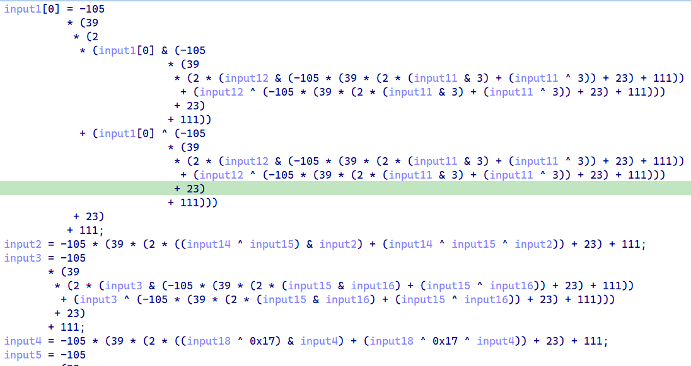

## REEZ

```C
__int64 sub_401740()
{
    FILE *s; // [rsp+28h] [rbp-3F88h]
    char ptr[16208]; // [rsp+30h] [rbp-3F80h] BYREF
    __int64 v3[6]; // [rsp+3F80h] [rbp-30h] BYREF

    qmemcpy(v3, "do_you_like_what_you_see?", 25);
    sub_4013D0(&unk_404070, ptr, v3, 16208LL, 25LL);
    s = fopen("outputfile", "wb");
    v3[5] = (__int64)s;
    fwrite(ptr, 1uLL, 0x3F50uLL, s);
    fclose(s);
    sub_4015F0(off_407FD0);                       // chmod +x outputfile
    sub_4015F0(off_407FC8);                       // ./outputfile
    return sub_4015F0(off_407FC0);                // rm outputfile
}
```

写一个文件，直接运行，不输入，就可以在目录下看到`outputfile`

首先对每一个输入进行变化



操作实际上是加法

```Python
# Add
def op(v13, v3):
    return ((2 * (v13 & v3) + (v13 ^ v3))) & 0xFF
```

整理式子

```Python
input1 = input1 + input12 + input11 + 3
input2 = (input14 ^ input15) + input2
input3 = input3 + input15 + input16
input4 = (input18 ^ 0x17) + input4
input5 = (input5 + (input21 + (input10 - 5)))
input6 = (input6 + input22 - input24)
input7 = (input7 + (input9 + input8))
input8 = (input8 + (input24 - input21 + 17))
input9 = (input9 + (input20 ^ ((input19 + 1))))
input10 = (input18 + input10) - input17
input11 = (input11 + (input15 + input16))
input12 = (input13 + (input14 + (input12 - 7)))
input13 = (input13 + input12)
input14 = (input14 + (input8 ^ input9))
input15 = (input6 + (input5 + (input15 + 12)))
input16 = (input4 + (input16 + 8))
input17 = ((input3 ^ 0x4D) + input17)
input18 = (input18 + (2 * (input2 & 0xF9 ^ 0x11) + (input2 ^ 0xEE)))
input19 = ((input18 ^ input16) + input19)
input20 = (input13 + (input15 + input20))
input21 = (input21 + input12)
input22 = (input9 + (input22 + input7))
input23 = (input6 + input23)
input24 = ((input1 ^ input3) + input24)
input25 = (input25 + (input2 + 24))
```

然后这一段明显的矩阵乘法

```C
do
{
    x_ = x;
    y = 0LL;
    do
    {
        v10 = y;
        v11 = &input1[5 * x + 33 + y];
        *v11 = 0;
        z = 0LL;
        v13 = 0;
        do
        {
            v3 = dword_55BC33F7D010[5 * x + z] * input1[5 * z + 1 + y];
            v9 = -105 * (39 * (2 * (v13 & v3) + (v13 ^ v3)) + 23) + 111;
            v4 = z++ == 4;
            v13 = v9;
        }
        while ( !v4 );                            // z != 4
        *v11 = v9;
        ++y;
    }
    while ( v10 != 4 );                         // y != 4
    ++x;
    v14 = 0LL;
}
while ( x_ != 4 );                            // x != 4
```

还有异或检查结果

```C
while ( 1 )
{
    v8 = v14;
    if ( (byte_55BC33F7D080[v14] ^ (unsigned __int8)input1[v14 + 33]) != byte_55BC33F7D0A0[v14] )
    break;
    ++v14;
    v7 = 25;
    if ( v8 == 24 )
    goto LABEL_19;
}
```

### exp

结果少了个K，但影响不大

```Python
from z3 import *
array1 = [0x32, 0x44, 0xAA, 0x56, 0x63, 0x3D, 0x2B, 0x09, 0xCD, 0x34, 0x99, 0x3C, 0x56, 0xB8, 0x99, 0xDE, 0x26, 0x1F, 0x7E, 0x0B, 0x42, 0xC2, 0x1B, 0xEB, 0xF5]
array2 = [0x44, 0x30, 0x5F, 0x79, 0x30, 0x75, 0x5F, 0x4C, 0x69, 0x6B, 0x65, 0x5F, 0x57, 0x68, 0x61, 0x74, 0x5F, 0x59, 0x6F, 0x75, 0x5F, 0x53, 0x65, 0x65, 0x3F]
array3 = [i ^ j for i, j in zip(array1, array2)]
array4 = [0x00000000, 0xFFFFFFFE, 0xFFFFFFFF, 0x00000004, 0x00000001, 0xFFFFFFFF, 0x00000001, 0x00000000, 0x00000000, 0xFFFFFFFF, 0xFFFFFFFD, 0xFFFFFFFE, 0x00000000, 0xFFFFFFF6, 0xFFFFFFFF, 0xFFFFFFFF, 0xFFFFFFFE, 0x00000001, 0xFFFFFFF3, 0xFFFFFFFF, 0xFFFFFFFA, 0xFFFFFFFF, 0xFFFFFFFE, 0x00000001, 0xFFFFFFFE, 0x00000000, 0x00000000, 0x00000000]
array4 = [i & 0xFF for i in array4]
s = Solver()
flag = [BitVec(f'flag[{i}]', 8) for i in range(25)]
temp = [0] * 25
for z in range(5):
    for i in range(5):
        for j in range(5):
            temp[z * 5 + i] += array4[z * 5 + j] * flag[j * 5 + i]

for i in range(25):
    s.add(temp[i] == array3[i])

if s.check() == sat:
    real_flag = []
    model = s.model()
    for i in range(25):
        real_flag.append(model[flag[i]].as_long())
    print(real_flag)


result = [225, 119, 21, 156, 40, 140, 17, 78, 156, 147, 49, 240, 67, 69, 31, 23, 152, 184, 20, 163, 99, 38, 244, 92, 12]
result.insert(0, None)
result[25] = (result[25] - result[2] - 24) & 0xFF
result[24] = (result[24] - (result[1] ^ result[3])) & 0xFF
result[23] = (result[23] - result[6]) & 0xFF
result[22] = (result[22] - result[9] - result[7]) & 0xFF
result[21] = (result[21] - result[12]) & 0xFF
result[20] = (result[20] - result[13] - result[15]) & 0xFF
result[19] = (result[19] - (result[18] ^ result[16])) & 0xFF
result[18] = (result[18] - (2 * (result[2] & 0xF9 ^ 0x11) + (result[2] ^ 0xEE))) & 0xFF
result[17] = (result[17] - (result[3] ^ 0x4D)) & 0xFF
result[16] = (result[16] - result[4] - 8) & 0xFF
result[15] = (result[15] - (result[6] + result[5] + 12)) & 0xFF
result[14] = (result[14] - (result[8] ^ result[9])) & 0xFF
result[13] = (result[13] - result[12]) & 0xFF
result[12] = (result[12] - (result[13] + result[14] - 7)) & 0xFF
result[11] = (result[11] - (result[15] + result[16])) & 0xFF
result[10] = (result[10] + result[17] - result[18]) & 0xFF
result[9] = (result[9] - (result[20] ^ ((result[19] + 1))) & 0xFF)
result[8] = (result[8] - (result[24] - result[21] + 17)) & 0xFF
result[7] = (result[7] - (result[9] + result[8])) & 0xFF
result[6] = (result[6] - (result[22] - result[24])) & 0xFF
result[5] = (result[5] - (result[21] + (result[10] - 5))) & 0xFF
result[4] = (result[4] - (result[18] ^ 0x17)) & 0xFF
result[3] = (result[3] - (result[15] + result[16])) & 0xFF
result[2] = (result[2] - (result[12] ^ result[11]) & 0xFF)
result[1] = (result[1] - (result[12] + result[11] + 3)) & 0xFF
print(result)
print(bytes(result[1:]).decode('utf-8'))
# NKCTF{THut_1Ss_s@_eAsyhh}
```
