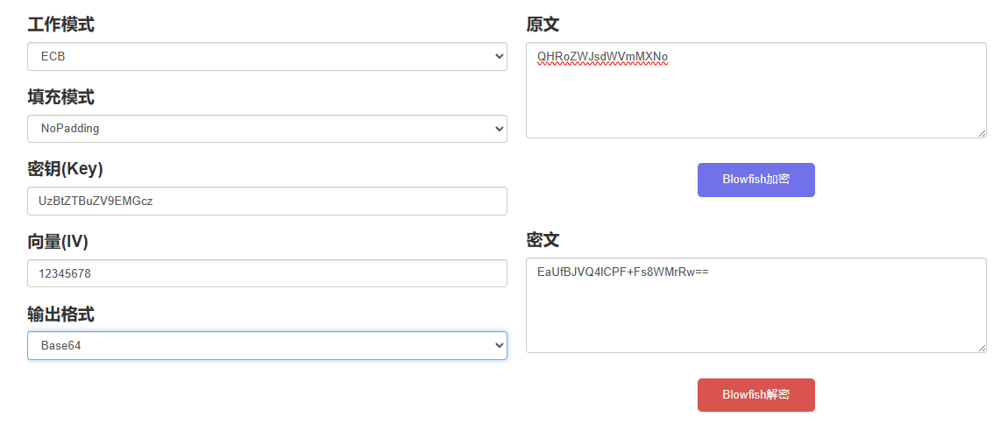
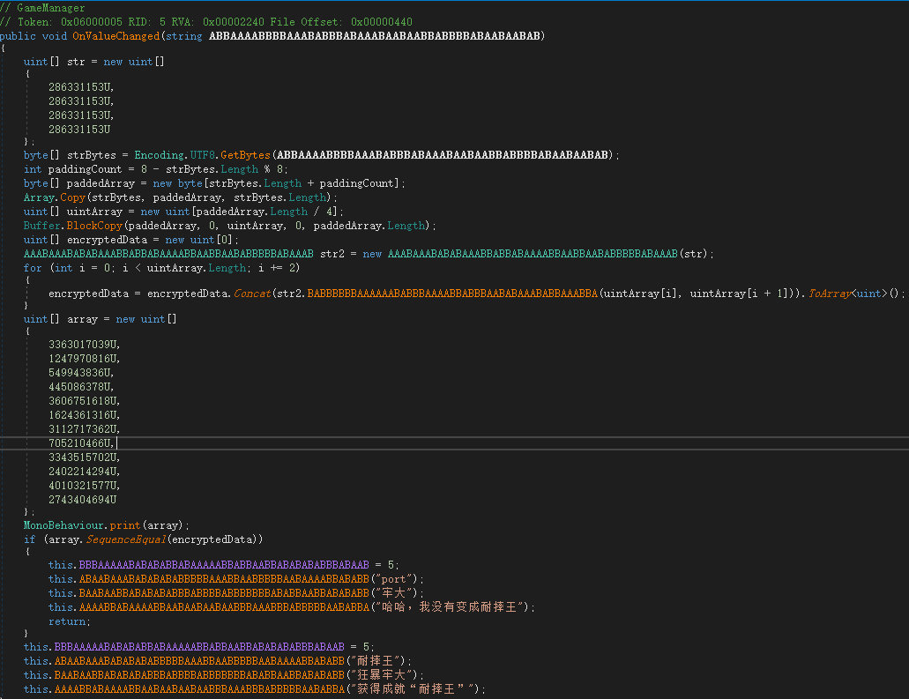

## mobilego

Go写的so文件，调试可以发现，`checkflag`就是字符换位：

```C
// mobile_go.Checkflag
__int64 __golang mobile_go_Checkflag(unsigned __int64 a1, __int64 a2, __int64 a3, __int64 a4, __int64 a5)
{
	......
    while ( (unsigned __int64)&v36.src.data <= *(_QWORD *)(v5 + 16) )
    {
        v38 = a1;
        runtime_morestack_noctxt(a1, a2, a3, a4, a5);
        a1 = v38;
    }
    v39 = a2;
    len_input = a1;
    v30 = qword_7FFF57234EB0;
    p_rand_rngSource = (rand_rngSource *)runtime_newobject(&RTYPE_rand_rngSource);
    math_rand__ptr_rngSource_Seed(p_rand_rngSource, v30);
    v11 = (void *)runtime_assertI2I2(
        (unsigned int)&RTYPE_rand_Source64,
        (unsigned int)off_7FFF571880C0,
        (_DWORD)p_rand_rngSource,
        a4,
        a5,
        v7,
        v8,
        v9,
        v10);
    *(_OWORD *)&v36.readVal = v6;
    v36.src.tab = off_7FFF571880C0;
    v36.src.data = p_rand_rngSource;
    v36.s64.tab = v11;
    v36.s64.data = off_7FFF571880C0;
    v12 = len_input;
    v17 = runtime_stringtoslicebyte((unsigned int)&v33, len_input, v39, a4, a5, v13, v14, v15, v16);
    v34 = v17;
    v22 = 0LL;
    while ( v12 > v22 )
    {
        index = v22;
        v31 = math_rand__ptr_Rand_Intn(&v36, v12, v22, a4, a5, v18, v19, v20, v21);
        v17 = math_rand__ptr_Rand_Intn(&v36, len_input, v23, a4, a5, v24, v25, v26, v27);
        v12 = len_input;
        if ( v31 >= len_input )
            runtime_panicIndex(v31, len_input, len_input);
        v28 = v34;
        a5 = *(unsigned __int8 *)(v31 + v34);
        if ( v17 >= len_input )
            runtime_panicIndex(v17, len_input, len_input);
        a4 = *(unsigned __int8 *)(v17 + v34);
        *(_BYTE *)(v34 + v31) = a4;
        *(_BYTE *)(v28 + v17) = a5;
        v22 = index + 1;
        LODWORD(v17) = v28;
    }
    return runtime_slicebytetostring(0, v17, v12, a4, a5, v18, v19, v20, v21);
}
```

写个`frida`把`equal`HOOK掉，看参数是什么，然后输入`abcdefghijklmnopqrstuvwxyz0123456789AB`得到表`v8l3oBjt4pk2myzfqbshucxwi0agA51d679ner`以及结果。

脚本：

```Python
ori = "abcdefghijklmnopqrstuvwxyz0123456789AB"
new = "v8l3oBjt4pk2myzfqbshucxwi0agA51d679ner"
result = "49021}5f919038b440139g74b7Dc88330e5d{6"
flag = ""
for i in range(len(ori)):
    flag += result[new.index(ori[i])]
print(flag)
```

## 你见过蓝色的小鲸鱼

程序有很明显的`Blowfish`加密算法的特征，第一次见。

`v8[8]`是PBOX。

```C
void __thiscall init_blowfish__(_DWORD *this)
{
    v8 = this;
    __CheckForDebuggerJustMyCode(&unk_521016);
    Block = 0;
    v4[0] = 0;
    v3[0] = 0;
    Sizea = v8[2];
    Block = j__malloc(Sizea);
    j__memset(Block, 0, v8[2]);
    Size = Sizea >> 2;
    for ( i = 0; i < Size; ++i )
        *((_DWORD *)Block + i) = j___byteswap_ulong(*(_DWORD *)(v8[1] + 4 * i));
    for ( i = 0; i < 18; ++i )
        *(_DWORD *)(v8[8] + 4 * i) ^= *((_DWORD *)Block + i % Size);
    v3[0] = 0;
    v4[0] = 0;
    for ( i = 0; i < 18; i += 2 )
    {
        blow_fish_enc_block(v4, v3);
        *(_DWORD *)(v8[8] + 4 * i) = v4[0];
        *(_DWORD *)(v8[8] + 4 * i + 4) = v3[0];
    }
    for ( i = 0; i < 4; ++i )
    {
        for ( j = 0; j < 256; j += 2 )
        {
            blow_fish_enc_block(v4, v3);
            *(_DWORD *)(v8[7] + (i << 10) + 4 * j) = v4[0];
            *(_DWORD *)(v8[7] + (i << 10) + 4 * j + 4) = v3[0];
        }
    }
    j__free(Block);
}
int *__thiscall enc_block(_DWORD *this, int *cl_, int *cr_)
{
    for ( i = 0; i < 8; ++i )
    {
        *cl_ ^= *(_DWORD *)(this[8] + 8 * i);
        *cr_ ^= F(*cl_);
        *cr_ ^= *(_DWORD *)(this[8] + 8 * i + 4);
        *cl_ ^= F(*cr_);
    }
    *cl_ ^= *(_DWORD *)(this[8] + 64);
    *cr_ ^= *(_DWORD *)(this[8] + 68);
    v4 = *cl_;
    *cl_ = *cr_;
    result = cr_;
    *cr_ = v4;
    return result;
}
int __thiscall sub_456EE0(void *this)
{
    ...
    v5 = this;
    __CheckForDebuggerJustMyCode(&unk_52102F);
    strcpy(Caption, "tip");
    strcpy(Text, "You Get It!");
    strcpy(v2, "Wrong user/passwd");
    if ( *((_DWORD *)v5 + 2) != *((_DWORD *)v5 + 3)
        || j__memcmp(*(const void **)v5, *((const void **)v5 + 1), *((_DWORD *)v5 + 3)) )
    {
        return MessageBoxA(0, v2, Caption, 0);
    }
    else
    {
        return MessageBoxA(0, Text, Caption, 0);
    }
}
```

用户名有提示是`UzBtZTBuZV9EMGcz`（Cyberchef提示我密钥8个字节，坑人），动调到比较处获取密文。

找了好几个网站才解密出来😭[在线Blowfish加密解密工具 (config.net.cn)](https://config.net.cn/tools/Blowfish.html)



拼接得到flag：`D0g3{UzBtZTBuZV9EMGczQHRoZWJsdWVmMXNo}`

## 感觉有点点简单

代码确实简单，出题人太好了

```C
__int64 __fastcall change_table_base64(__int64 a1, __int64 ori, int a3)
{
    strcpy(v6, "4KBbSzwWClkZ2gsr1qA+Qu0FtxOm6/iVcJHPY9GNp7EaRoDf8UvIjnL5MydTX3eh");
    ori_index = 0;
    v5 = 0;
    while ( ori_index < a3 )
    {
        *(a1 + v5) = v6[*(ori + ori_index) & 0x3F];
        *(a1 + v5 + 1) = v6[(4 * (*(ori + ori_index + 1) & 0xF)) | ((*(ori + ori_index) & 0xC0) >> 6)];
        *(a1 + v5 + 2) = v6[(16 * (*(ori + ori_index + 2) & 3)) | ((*(ori + ori_index + 1) & 0xF0) >> 4)];
        *(a1 + v5 + 3) = v6[(*(ori + ori_index + 2) & 0xFC) >> 2];
        ori_index += 3;
        v5 += 4;
    }
    if ( a3 % 3 == 1 )
    {
        *(a1 + v5 - 2) = 61;
        *(a1 + v5 - 1) = 61;
    }
    else if ( a3 % 3 == 2 )
    {
        *(a1 + v5 - 1) = 61;
    }
    return 0i64;
}

__int64 sub_1400016F0()
{
    NumberOfBytes[0] = 4096;
    memset(&v6, 0, sizeof(v6));
    RtlInitUnicodeString(&DestinationString, L"\\??\\C:\\Users\\Public\\flag.txt");
    *&NumberOfBytes[1] = ExAllocatePool(NonPagedPool, 0x1000ui64);
    P = ExAllocatePool(NonPagedPool, 0x1000ui64);
    if ( *&NumberOfBytes[1] && P )
    {
        v4 = NumberOfBytes[0];
        memset(P, 0, NumberOfBytes[0]);
        v5 = NumberOfBytes[0];
        memset(*&NumberOfBytes[1], 0, NumberOfBytes[0]);
        qmemcpy(v10, &DestinationString, 0x10ui64);
        if ( sub_140001040(v10, v6, *&NumberOfBytes[1], NumberOfBytes) )
        {
            if ( NumberOfBytes[0] <= 0xC00 )
            {
                rc4_enc(*&NumberOfBytes[1], NumberOfBytes[0], "the_key_", 8u);
                change_table_base64(P, *&NumberOfBytes[1], NumberOfBytes[0]);
                v1 = compare(P, 56i64);
                v8 = "tips: YES, RIGHT FLAG.   you got it!";
                v7 = "tips: NO , WRONG ANSWER. try again !";
                if ( v1 )
                    DbgPrint("tips: %s\n", v8);
                else
                    DbgPrint("tips: %s\n", v7);
            }
            else
            {
                DbgPrint("tips: file to long \n");
            }
        }
        else
        {
            DbgPrint("tips: can not read|open file\n");
        }
    }
    else
    {
        DbgPrint("tips: can not malloc\n");
    }
    if ( *&NumberOfBytes[1] )
    {
        ExFreePoolWithTag(*&NumberOfBytes[1], 0);
        *&NumberOfBytes[1] = 0i64;
    }
    if ( P )
    {
        ExFreePoolWithTag(P, 0);
        P = 0i64;
    }
    return 0i64;
}
bool __fastcall compare(const void *a1, int a2)
{
    return a2 == 56 && !memcmp(a1, "6zviISn2McHsa4b108v29tbKMtQQXQHA+2+sTYLlg9v2Q2Pq8SP24Uw=", 0x38ui64);
}
__int64 __fastcall rc4_enc(__int64 content, unsigned int content_len, __int64 key_str, int len_key)
{
    index = 0;
    v6 = 0;
    init_table(key_str, len_key);
    for ( i = 0; ; ++i )
    {
        result = content_len;
        if ( i >= content_len )
            break;
        index = (index + 1) % 64;
        v6 = (table[index] + v6) % 64;
        UGC::UGCompactFile::SwapByte_uchar___uchar___(&table[index], &table[v6]);
        *(content + i) ^= (v6 ^ index) & table[(((v6 ^ index) + table[v6] + table[index]) % 64)];
    }
    return result;
}
```

BASE64应该是有更改的，问题不大。

```Python
def a_dec_RC4(cipher, key):
    table = [i for i in range(64)]
    key_list = [ord(key[i % len(key)]) for i in range(64)]
    v6 = 0
    for i in range(64):
        v6 = (v6 + table[i] + key_list[i]) % 64
        table[i], table[v6] = table[v6], table[i]
    
    v6, index = 0, 0
    for i in range(len(cipher)):
        index = (index + 1) % 64
        v6 = (table[index] + v6) % 64
        table[index], table[v6] = table[v6], table[index]
        cipher[i] ^= (v6 ^ index) & table[((v6 ^ index) + table[v6] + table[index]) % 64]
    return cipher

def dec_base64(ss):
    base64table1 = "4KBbSzwWClkZ2gsr1qA+Qu0FtxOm6/iVcJHPY9GNp7EaRoDf8UvIjnL5MydTX3eh"
    result = []
    ori_index = 0
    new_index = 0
    while ori_index < len(ss):
        ch1, ch2, ch3, ch4 = ss[ori_index:ori_index+4]
        if ch4 == '=':
            ch4 = 'A'
        ch1, ch2, ch3, ch4 = base64table1.index(ch1), base64table1.index(ch2), base64table1.index(ch3), base64table1.index(ch4)
        result.append(ch1 | ((ch2 << 6) & 0xFF))
        result.append(((ch2 >> 2) & 0xF) | ((ch3 & 0xF) << 4))
        result.append(((ch3 >> 4) & 0x3) | ((ch4 << 2) & 0xFF))
        ori_index += 4
    return result

if __name__ == '__main__':
    c = "6zviISn2McHsa4b108v29tbKMtQQXQHA+2+sTYLlg9v2Q2Pq8SP24Uw="
    c = dec_base64(c)
    print(bytes(c))
    c = a_dec_RC4(c, "the_key_")
    print(bytes(c))
    # D0g3{608292C4-15400BA4-B3299A5C-704C292D}X
```

## 你好,PE

一堆函数通过PE文件一个个找赋值出来的，过程不会，直接调试了。

```C
int sub_1005F820()
{
    _DWORD *v1; // [esp+D0h] [ebp-8h]

    ((void (__thiscall *)(void *))unk_1005B16F)(&unk_1014000F);
    ((void (__stdcall *)(_DWORD, int, int, int))kernel32_VirtualAlloc)(0, 65548, 12288, 4);
    v1 = (_DWORD *)((int (*)(void))loc_1005A260)();
    if ( !v1 )
        return -1;
    v1[1] = 0x10000;
    *v1 = 0;
    v1[2] = v1 + 3;
    ((void (__cdecl *)(_DWORD, _DWORD, _DWORD))unk_10059572)(v1[2], 0, v1[1]);
    ((void (__cdecl *)(const char *))printf_0)("[out]: PLZ Input FLag \n");
    ((void (__cdecl *)(const char *))printf_0)("[in ]: ");
    ((void (__cdecl *)(void *, _DWORD))scanf)(&unk_10114B68, v1[2]);
    *v1 = ((int (__cdecl *)(_DWORD))unk_1005B5BB)(v1[2]); // 检测长度
    if ( *v1 == 0x29 )
    {
        *v1 = 0x30;
        ((void (__cdecl *)(_DWORD *))loc_1005A242)(v1); // 加密
        if ( ((int (__cdecl *)(_DWORD, void *, int))loc_10058AA0)(v1[2], &unk_1013C008, 48) ) // 比较
            ((void (__cdecl *)(const char *))printf_0)("[out]: WRONG FLAG\n");
        else
            ((void (__cdecl *)(const char *))printf_0)("[out]: RIGHT FLAG\n");
        ((void (__stdcall *)(_DWORD *, _DWORD, int))kernel32_VirtualFree)(v1, 0, 49152);
        ((void (*)(void))loc_1005A260)();
        return 0;
    }
    else
    {
        ((void (__cdecl *)(const char *))printf_0)("[out]: len error\n");
        ((void (__stdcall *)(_DWORD *, _DWORD, int))kernel32_VirtualFree)(v1, 0, 49152);
        ((void (*)(void))loc_1005A260)();
        return -1;
    }
}
// 加密逻辑
_DWORD *__cdecl sub_1005F6F0(_DWORD *a1)
{
    _DWORD *result; // eax
    int input_0_4; // ecx
    int j; // [esp+D0h] [ebp-30h]
    unsigned int i; // [esp+DCh] [ebp-24h]
    __int64 input_4_8; // [esp+E8h] [ebp-18h]
    int *v6; // [esp+F8h] [ebp-8h]

    ((void (__thiscall *)(void *))unk_1005B16F)(&unk_1014000F);
    for ( i = 0; ; ++i )
    {
        result = a1;
        if ( i >= *a1 >> 3 )
            break;
        v6 = (int *)(a1[2] + 8 * i);                // a1[2]为input
        input_0_4 = *v6;
        input_4_8 = *(_QWORD *)v6;
        for ( j = 0; j < 64; ++j )
        {
            LOBYTE(input_0_4) = 1;
            if ( input_4_8 < 0 )
                input_4_8 = dword_1013C000 ^ ((__int64 (__fastcall *)(int, _DWORD))loc_10059F9F)(input_0_4, HIDWORD(input_4_8));
            else
                input_4_8 = ((__int64 (__fastcall *)(int, _DWORD))loc_10059F9F)(input_0_4, HIDWORD(input_4_8));
        }
        *(_QWORD *)v6 = input_4_8;
    }
    return result;
}
// loc_10059F9F
int __usercall sub_1005FDE0@<eax>(__int64 a1@<edx:eax>, unsigned __int8 a2@<cl>)
{
    __int64 v2; // rax

    if ( a2 >= 0x40u )
    {
        LODWORD(v2) = 0;
    }
    else if ( a2 >= 0x20u )
    {
        LODWORD(v2) = 0;
    }
    else
    {
        return a1 << (a2 & 0x1F);
    }
    return v2;
}
```

比较没有细看，直接猜`unk_1013C008`是密文了。

脚本：

```Python
import struct
# 移位后 num1末尾一定为0
def shld(num1, num2, count=1):
    return ((num1 << count) & 0xffffffff), (((num2 << count) & 0xffffffff) | (num1 >> (32 - count)))

# enc
def enc():
    input = b"1234567890123456789012345678901234567890"
    input = list(struct.unpack('<10I', input))
    # input = [0x36353433, 0x30393837]
    for i in range(len(input) // 2):
        num1, num2 = input[i * 2], input[i * 2 + 1]
        for _ in range(64):
            if num2 >> 31:
                num1, num2 = shld(num1, num2)
                num1 = num1 ^ 0x54AA4A9
            else:
                num1, num2 = shld(num1, num2)
        input[i * 2], input[i * 2 + 1] = num1, num2
    print([hex(i) for i in input])


def decshld(num1, num2, pad, count=1):
    return ((num1 >> count) | ((num2 & 1) << (32 - count))), ((num2 >> count) | (pad << (32 - count)))

# dec
result = [0x2976B84D, 0x599EA9F5, 0xC4B15655, 0x302C212F, 0x177879B3, 0xDBF7EDA8, 0xDBF053E1, 0x5E5103E9, 0xDF00C109, 0xC1FC96F0, 0x9562E6B5, 0x00000001]
for i in range(len(result) // 2):
    num1, num2 = result[i * 2], result[i * 2 + 1]
    for _ in range(64):
        # 如果 num1末位不为0，则说明异或过了
        if num1 & 1 != 0:
            num1 ^= 0x54AA4A9
            num1, num2 = decshld(num1, num2, 1)
        else:
            num1, num2 = decshld(num1, num2, 0)
    result[i * 2], result[i * 2 + 1] = num1, num2
print([hex(i) for i in result])
result = b''.join([struct.pack('<I', i) for i in result])
print(result)
# b'D0g3{60E1E72A-576A8BF0-7701CBB9-B02415EC}\x00\x00\x00\x00\x00\x00\x00'
```

## 牢大想你了

没太懂这些逻辑到底干嘛。

但是找到个这个，说实话有点抽象了



脚本：

```Python
# public uint[] BABBBBBBAAAAAABABBBAAAABBABBBAABABAAABABBAAABBA(uint ABBAABAAAAAABAAAABBBBBBABAABAAAABBBABBBAABBABBA, uint BAABBAAAAABABBAABBABBAABABABABABABAAABABBBABABA)
# 	{
# 		uint v0 = ABBAABAAAAAABAAAABBBBBBABAABAAAABBBABBBAABBABBA;
# 		uint v = BAABBAAAAABABBAABBABBAABABABABABABAAABABBBABABA;
# 		uint sum = 0U;
# 		uint delta = 2654435769U;
# 		uint[] key = this.BBABABBBABBABABAAABBBAABBAAAAAAABBBBBAABBAAAAAA;
# 		for (int i = 0; i < 32; i++)
# 		{
# 			sum += delta;
# 			v0 += ((v << 4) + key[0] ^ v + sum ^ (v >> 5) + key[1]);
# 			v += ((v0 << 4) + key[2] ^ v0 + sum ^ (v0 >> 5) + key[3]);
# 		}
# 		return new uint[]
# 		{
# 			v0,
# 			v
# 		};
# 	}
import struct 
def tea_dec(cipher, key):  
    num = (2654435769 * 32) & 0xFFFFFFFF
    for i in range(32):  
        cipher[1] -= ((num + cipher[0]) ^ ((cipher[0] << 4) + key[2]) ^ ((cipher[0] >> 5) + key[3])) & 0xFFFFFFFF  
        cipher[1] &= 0xFFFFFFFF  
        cipher[0] -= ((num + cipher[1]) ^ ((cipher[1] << 4) + key[0]) ^ ((cipher[1] >> 5) + key[1])) & 0xFFFFFFFF  
        cipher[0] &= 0xFFFFFFFF  
        num = (num - 2654435769) & 0xFFFFFFFF  
    return cipher  
result = [  
    3363017039, 1247970816, 549943836, 445086378, 3606751618, 1624361316, 3112717362, 705210466, 3343515702, 2402214294, 4010321577, 2743404694
]  
flag = [] 
key = [
    286331153, 286331153, 286331153, 286331153
]
content = []  
for i in range(0, len(result), 2):  
    content += tea_dec(result[i:i + 2], key)  
for i in range(len(content)):  
    flag += struct.pack('<i', content[i])  
print(bytes(flag))
# b'it_is_been_a_long_day_without_you_my_friend\x00\x00\x00\x00\x00'
```
