## babyobfu

### 去混淆

动调可以看出大概逻辑，主要靠一个函数修复代码段，之后还会还原。

设置条件断点进行patch：

```python
def repair_code(start, l, num):
	s = []
	for i in range(4):
		s.append((num >> (8 * i)) & 0xFF)
	for i in range(l):
		data = Byte(start + i)
		PatchByte(start + i, data ^ ((i + 0xCE) & 0xFF) ^ s[i % 4])


rsp = GetRegValue("rsp")
retrun_addr = Qword(GetRegValue("rsp"))
if retrun_addr == 0x403783:
	retrun_addr = Qword(rsp + 0x30)
FunAddr = retrun_addr - 0x5
CodeAddress = GetRegValue("rdi")
Length = GetRegValue("rsi")
XorNum = GetRegValue("edx")
if retrun_addr == CodeAddress:
	for j in range(5):
		PatchByte(FunAddr + j, 0x90)
	repair_code(CodeAddress, Length, XorNum)
	SetRegValue(0x40375F, "EIP")
else:
	for j in range(5):
		PatchByte(FunAddr + j, 0x90)
	SetRegValue(0x40375F, "EIP")
print(f"[+] Repair Date from {hex(FunAddr) = }:{hex(CodeAddress) = }")
```

多输入，执行几次，main函数就可以反编译了。

对于这样子的剩余混淆，分析的时候手动patch一下就好，很好辨认。

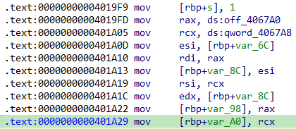

### 逻辑分析

检测输入长度以及格式为0-9，a-f。

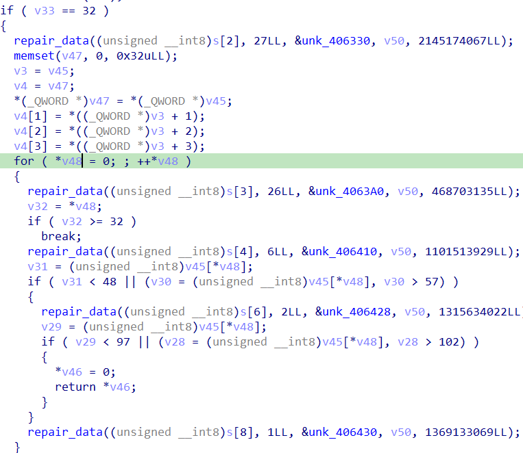

sub_401980是将输入进行更改，后面的循环为更改的输入两个Byte拼接为一个Byte。

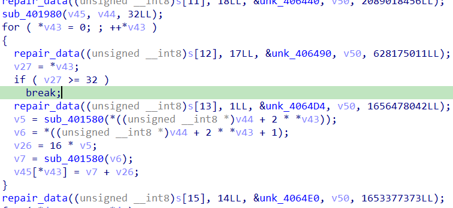

sub_401980：其中的数据可以动态获取


加密过程：

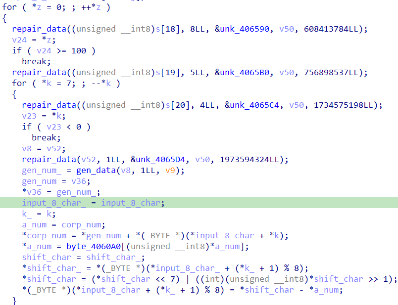

最后比较：

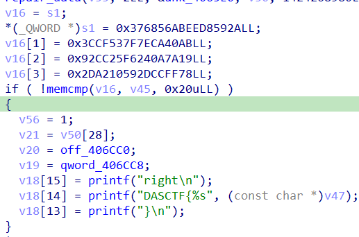

### exp

```python
import struct

def change(num):
    if 0 <= num <= 9:
        return num + 0x30
    elif 10 <= num <= 15:
        return num + 97 - 10
    return 0


def add(a, b):
    if a + b >= 0x256:
        return (a + b - 1) & 0xFF
    else:
        return (a + b) & 0xFF

data = [
    0xd4, 0xfd, 0x80, 0xc4, 0x50, 0x10, 0xde, 0x6d, 0xe8, 0xf0, 0xc, 0x52, 0x9, 0x40, 0x24, 0x97, 0xde, 0x77, 0x14,
    0x5f, 0x69, 0xf6, 0xc0, 0x74, 0x8e, 0x6d, 0x80, 0xce, 0xcc, 0x7, 0xc0, 0xf4, 0xa0, 0x4, 0xf0, 0x1c, 0xc6, 0x0, 0xa2,
    0x58, 0xf4, 0x34, 0x40, 0xb0, 0x4c, 0xa0, 0xa8, 0x56, 0x59, 0xe9, 0x38, 0x28, 0xd0, 0x68, 0x40, 0x66, 0x96, 0x45,
    0xd2, 0x67, 0x40, 0xd0, 0x24, 0x0, 0x13, 0x4c, 0xca, 0x78, 0x4c, 0xbc, 0xc0, 0x42, 0x0, 0x10, 0x6d, 0xc0, 0x0, 0x38,
    0xb0, 0x4, 0xc4, 0x48, 0x80, 0xe8, 0x71, 0xff, 0x40, 0x84, 0x46, 0x54, 0x25, 0x7a, 0x38, 0x20, 0xf8, 0xc0, 0x38,
    0x94, 0xf9, 0x70, 0xe4, 0xfa, 0x70, 0x8, 0x40, 0x33, 0xe7, 0x68, 0xb0, 0xd6, 0x20, 0xfb, 0x81, 0x4c, 0x2e, 0x8a,
    0x1b, 0x3a, 0x92, 0x78, 0xe8, 0x24, 0x22, 0x27, 0x5c, 0xd2, 0x14, 0x8a, 0xb0, 0x60, 0x64, 0x20, 0x10, 0xe5, 0xd1,
    0x5c, 0xe9, 0x79, 0x52, 0x34, 0x67, 0x80, 0x4c, 0xe2, 0x20, 0xa0, 0x54, 0xdf, 0x28, 0x30, 0xf0, 0x86, 0xad, 0xc5,
    0x85, 0x71, 0xc0, 0x4e, 0xba, 0xcc, 0x98, 0x23, 0x56, 0x12, 0x90, 0xc9, 0x5b, 0x54, 0x54, 0x48, 0xba, 0xac, 0x2c,
    0xdc, 0x22, 0x90, 0xe8, 0x18, 0x8c, 0x81, 0x44, 0x31, 0x84, 0x80, 0xe8, 0x8a, 0xe0, 0x8c, 0xba, 0xfa, 0xbc, 0xe6,
    0xf0, 0x9e, 0x66, 0xda, 0x54, 0xa1, 0xc8, 0x1e, 0x90, 0xf0, 0x93, 0x39, 0x50, 0x18, 0x99, 0x95, 0x48, 0x81, 0xa0,
    0x4a, 0xb0, 0x6a, 0x80, 0x7b, 0xb0, 0xc8, 0x9d, 0x39, 0xfb, 0x7e, 0x74, 0x40, 0x80, 0x2a, 0x90, 0x60, 0x4a, 0xe2,
    0xda, 0x0, 0xe, 0xc0, 0xe0, 0xbe, 0x6, 0xc5, 0x61, 0xd4, 0x9c, 0x33, 0x88, 0x40, 0x70, 0x78, 0xf2, 0x7c, 0xac, 0xb0,
    0xf8, 0xcb, 0xcc, 0x3e, 0xea, 0x64, 0xa0, 0xbe, 0xac, 0xa, 0xd4, 0x30, 0x58, 0x4d, 0x74, 0x48, 0x90, 0x18, 0xea,
    0x10, 0xc0, 0x0, 0x5, 0xa0, 0x4e, 0xdd, 0xec, 0xa8, 0x10, 0xe0, 0x20, 0x42, 0x9, 0x64, 0x40, 0x94, 0x93, 0x90, 0x61,
    0x2, 0x3a, 0x39, 0xdf, 0x9a, 0x3c, 0x29, 0x6f, 0xe7, 0x10, 0xb3, 0x4b, 0xd3, 0x9d, 0xb2, 0x5b, 0x7, 0x84, 0xf0,
    0x3b, 0xbe, 0xce, 0xb6, 0xbc, 0xa, 0x48, 0xb8, 0x63, 0x48, 0xfa, 0x68, 0x74, 0xe4, 0xf8, 0xac, 0x16, 0x97, 0x8e,
    0x2a, 0xe9, 0x4c, 0x2c, 0xeb, 0x68, 0x82, 0xb8, 0x24, 0x92, 0x6, 0xb9, 0xa2, 0xf0, 0x90, 0xea, 0xaa, 0xe4, 0xa,
    0x7b, 0x40, 0x5c, 0xfc, 0xbe, 0x54, 0x90, 0x81, 0x44, 0xf4, 0x37, 0xa0, 0x93, 0x65, 0x20, 0x16, 0x82, 0xcd, 0xae,
    0x24, 0x0, 0x29, 0xa0, 0x8b, 0x44, 0xfb, 0xe4, 0x58, 0xd5, 0xc0, 0x9c, 0x84, 0xd, 0x8d, 0xcf, 0x50, 0x28, 0x8, 0x8c,
    0xbe, 0x6c, 0xbc, 0x18, 0x8, 0x9, 0x59, 0xad, 0xcc, 0xf8, 0x1c, 0x78, 0x28, 0xbd, 0x5a, 0x31, 0xde, 0x0, 0x6c, 0x61,
    0x8b, 0x23, 0xb0, 0x85, 0x8d, 0x14, 0x3f, 0x98, 0x68, 0x3, 0xac, 0xc0, 0x73, 0x96, 0x20, 0x3a, 0xc2, 0x6c, 0x40,
    0x31, 0x70, 0x98, 0x2e, 0x90, 0x16, 0xba, 0xfe, 0xc3, 0x81, 0x98, 0x77, 0xc4, 0xbb, 0x73, 0xf8, 0x3a, 0x11, 0x70,
    0x11, 0x7c, 0x1d, 0x98, 0x84, 0xc, 0x1f, 0x5a, 0x4d, 0xb3, 0xc0, 0x31, 0xb0, 0x21, 0x4c, 0x9c, 0x20, 0xe6, 0x6c,
    0x89, 0xc0, 0x79, 0xbf, 0x35, 0xa8, 0x66, 0x89, 0xc8, 0x22, 0x76, 0xc0, 0x8a, 0xc1, 0x70, 0xd8, 0x2d, 0xd9, 0xb6,
    0x80, 0x38, 0x8c, 0x80, 0xd0, 0x2e, 0x23, 0x40, 0xab, 0x7b, 0xc7, 0xdd, 0x34, 0x4b, 0xf4, 0xc0, 0x3f, 0xb2, 0xcd,
    0x61, 0x91, 0x30, 0xd8, 0xbc, 0xe4, 0xcb, 0x48, 0xa5, 0xcc, 0x82, 0xb2, 0x18, 0xf3, 0x1e, 0x96, 0x71, 0x59, 0x1e,
    0x9c, 0x68, 0x3b, 0xe8, 0x41, 0xa8, 0x8, 0x75, 0xd0, 0x84, 0xf8, 0xd6, 0xc, 0xdd, 0x40, 0x6b, 0x33, 0xa4, 0x7c,
    0x20, 0x96, 0x4f, 0x2f, 0xb8, 0x12, 0xc8, 0x16, 0x40, 0xe8, 0xa0, 0x2d, 0x70, 0x10, 0xbd, 0x60, 0x4c, 0xdc, 0x39,
    0xab, 0x59, 0x61, 0x71, 0xd0, 0xc0, 0xeb, 0xf0, 0xfe, 0xaa, 0xd4, 0x5c, 0xfc, 0x93, 0xf8, 0xf9, 0x44, 0x61, 0x40,
    0x18, 0xe6, 0x86, 0x7e, 0x3, 0x50, 0x17, 0xb8, 0xab, 0x10, 0x82, 0x42, 0x9, 0x44, 0xe0, 0x96, 0xca, 0xd4, 0xa, 0x46,
    0x9c, 0x6b, 0xd2, 0x92, 0xcd, 0x90, 0x40, 0x2e, 0x6b, 0x10, 0x53, 0x60, 0xa7, 0x97, 0x63, 0xda, 0x82, 0x29, 0xc6,
    0x0, 0x70, 0xac, 0xbc, 0x4a, 0x40, 0x4, 0xe0, 0x74, 0xb0, 0xb0, 0x80, 0x30, 0xdc, 0x70, 0x6c, 0x40, 0x7e, 0xd0,
    0x90, 0x9d, 0x2d, 0x87, 0xb8, 0xc5, 0x64, 0xd, 0xdc, 0x5e, 0x60, 0xd7, 0xc, 0xdb, 0x0, 0x80, 0x21, 0x17, 0xdd, 0xb8,
    0x20, 0xfd, 0x8f, 0x0, 0xb8, 0x18, 0x1c, 0x4, 0xff, 0xb1, 0x68, 0xc4, 0xe9, 0xab, 0x84, 0x6b, 0x82, 0x80, 0x14,
    0x44, 0xc8, 0x6a, 0x21, 0xfa, 0x34, 0xa6, 0xf9, 0x5b, 0xd8, 0x5e, 0xf0, 0xd3, 0xef, 0x92, 0xf6, 0xf3, 0xc6, 0x7e,
    0xe3, 0x88, 0x2d, 0xe5, 0xf6, 0xbf, 0x90, 0xbe, 0xe4, 0x30, 0xa8, 0x3b, 0x8c, 0xc8, 0xec, 0x36, 0xec, 0x0, 0xb0,
    0x4, 0xf8, 0xb8, 0x4f, 0x40, 0xc2, 0xf8, 0x7c, 0xd1, 0x7b, 0x30, 0xb4, 0x88, 0x6b, 0xa0, 0x0, 0x70, 0x59, 0x14,
    0x85, 0xd7, 0x8c, 0x44, 0x29, 0xa3, 0xe9, 0xc0, 0x2f, 0xa6, 0xe4, 0xe6, 0xfb, 0xb9, 0xbc, 0xb4, 0x36, 0xd4, 0x9c,
    0xd0, 0x28, 0x64, 0x4, 0x84, 0x10, 0x35, 0x60, 0xc8, 0x1a, 0xc0, 0xed, 0x13, 0x5f, 0x9a, 0xf0, 0xea, 0x60, 0xdb,
    0x80, 0x4b, 0xef, 0xce, 0x9f, 0x70, 0xff, 0x0, 0x23, 0x9d, 0x8a, 0xa4, 0xb0, 0xd0, 0x62, 0x68, 0x2f, 0x80, 0x75,
    0x74, 0xd, 0xde, 0x0, 0x60, 0x31, 0x40, 0xc3, 0x90, 0x94, 0x86, 0x31, 0xff, 0x22, 0x78, 0x34, 0x20, 0x89, 0x37,
    0x31, 0x83, 0x2e, 0xb1, 0x71, 0x40, 0x9, 0xc0, 0xc4, 0x4e, 0xe2, 0x52, 0x5e, 0x90, 0xa0, 0x26, 0x57, 0x47, 0x4e,
    0x90, 0x54, 0xbc, 0x52, 0x43, 0xca, 0xd1, 0x90, 0x20, 0x24, 0x19, 0x8c, 0x5e, 0x94, 0xa8, 0xc, 0xa8, 0xc4, 0xdd,
    0x91, 0x47, 0x80, 0x60, 0x38, 0x40, 0xb8, 0x65, 0x70, 0x20, 0x91, 0x48, 0x47, 0x0, 0x6c, 0x70, 0xa6, 0xfe, 0x24,
    0x44, 0x0, 0x84, 0xbc, 0xd6, 0x7d, 0x3c, 0xc8, 0x71, 0x2e, 0x1c, 0x95, 0x93, 0x30, 0xa9, 0x8a, 0xef, 0x65, 0xb8,
    0x49, 0xc0, 0x20, 0x33, 0x68, 0x70, 0x68, 0x10, 0xb0, 0x6e, 0xea, 0x8, 0xdb, 0x62, 0xc0, 0x8b, 0x66, 0x3e, 0x50,
    0x60, 0x79, 0x18, 0xd4, 0x69, 0x96, 0x1c, 0x3f, 0x1a, 0x50, 0x6c, 0x57, 0x0, 0x4, 0xd8, 0x7c, 0x61, 0x7f, 0xa4, 0x4,
    0x7, 0x74, 0x50, 0x77, 0x29, 0xa0, 0x8c, 0xe0, 0x5c, 0x4, 0xf8, 0xe0, 0xc3, 0xde, 0x2c, 0xd2, 0x9e, 0xf1, 0x40,
    0x5c, 0x50, 0xdc, 0x2d, 0x0, 0xc1, 0xd0, 0xd0, 0x7, 0x14, 0x6c, 0xfd, 0x9e, 0x6e, 0xc9, 0x5e, 0x30, 0xa8, 0x3a,
    0x21, 0xa8, 0x95, 0x58, 0x87, 0x40, 0x75, 0x6c, 0xc, 0x68, 0xd8, 0x9e, 0xe6, 0xc2, 0x70, 0x79, 0x0, 0x67, 0x29,
    0xfc, 0x1, 0xf2, 0x16, 0xec, 0xfa, 0x60, 0xaf, 0x60, 0x1d, 0xec, 0xb8, 0xfc, 0x9d, 0x48, 0x60, 0xe8, 0xac, 0x1e,
    0x88, 0x97, 0x20, 0x3d, 0x80, 0x50, 0x10, 0xc6, 0x98, 0x60, 0xeb, 0x90, 0x46, 0x12, 0x0, 0x20, 0x60, 0x8, 0x54,
    0xec, 0x7b, 0x0, 0x2, 0xb0, 0x7, 0xf0, 0x9c, 0x58, 0xc8, 0xd8, 0xc, 0x9, 0xb8, 0x39, 0x68, 0xa0, 0x10, 0xb6, 0x63,
    0x0, 0x38, 0xc8, 0x80, 0xdf, 0xe6, 0x3a, 0xdc, 0x58, 0x58, 0x94, 0x5c, 0x63, 0x60, 0x8c, 0x93, 0xc1, 0xd0, 0xe0,
    0x44, 0x56, 0x60, 0xc8, 0xbb, 0x7a, 0x7e, 0x73, 0x1b, 0xab, 0xb8, 0xb, 0x8c, 0x23, 0x1c, 0xf0, 0x18, 0x7b, 0xf,
    0x93, 0xfa, 0x66, 0xe0, 0x4c, 0x0, 0xe8, 0xb4, 0x31, 0x30, 0xf0, 0x82, 0x18, 0x40, 0xfe, 0x8c, 0xf0, 0xfc, 0x1f,
    0x71, 0x8c, 0x7e, 0xc8, 0x80, 0xce, 0x0, 0x0, 0xa0, 0xd5, 0x23, 0x27, 0x4, 0x0, 0xed, 0xd9, 0x90, 0x82, 0x6c, 0x7d,
    0x4, 0x0, 0xc0, 0x12, 0xd3, 0x18, 0x5d, 0x86, 0xe0, 0x53, 0x41, 0x9f, 0xd8, 0xdd, 0xb, 0xe0, 0xe6, 0xef, 0x82, 0x64,
    0x77, 0x53, 0x7b, 0x5b, 0xdc, 0x14, 0x84, 0x56, 0x80, 0x20, 0xa8, 0x39, 0x50, 0xe8, 0x60, 0x58, 0x46, 0xf0, 0xf2,
    0x6, 0xc0, 0xe6, 0x4, 0xd0, 0xbe, 0x79, 0xcd, 0xa8, 0x3e, 0xa0, 0x1e, 0x89, 0x24, 0x38, 0xfb, 0x3a, 0x58, 0x7e,
    0x26, 0xa4, 0x0, 0x38, 0x98, 0x83, 0xe8, 0x64, 0x78, 0xb0, 0xd5, 0xf9, 0xf6, 0x16, 0x63, 0x88, 0xa1, 0xa0, 0x60,
    0xf5, 0x24, 0xf6, 0xe0, 0x30, 0xe4, 0xa4, 0x26, 0x10, 0xbf, 0x9d, 0xdc, 0xf4, 0xd0, 0x38, 0xcd, 0xa, 0x26, 0x29,
    0xc, 0xd0, 0x78, 0xe3, 0xb0, 0x9a, 0x73, 0x80, 0x43, 0xa7, 0xa3, 0x9c, 0xc5, 0x7c, 0x29, 0x4a, 0x70, 0x28, 0xac,
    0x87, 0xf1, 0x50, 0xd4, 0x11, 0xe8, 0x32, 0xb8, 0xb4, 0x4c, 0x15, 0xb4, 0x7c, 0x51, 0x29, 0xac, 0x90, 0x9e, 0x12,
    0xd8, 0xbe, 0xbf, 0x10, 0x4, 0x84, 0xe6, 0x88, 0xdc, 0xdb, 0xe0, 0x0, 0x49, 0x60, 0xc4, 0x10, 0x72, 0x92, 0xee,
    0x8c, 0x16, 0x75, 0x6e, 0x7e, 0x40, 0x8, 0x94, 0x41, 0x40, 0x60, 0x88, 0xb, 0x0, 0x5a, 0x2c, 0x2e, 0xa, 0xa, 0x4e,
    0x30, 0x2a, 0x88, 0x4e, 0x11, 0x23, 0xbe, 0x70, 0x80, 0xed, 0x50, 0xb9, 0xbb, 0x38, 0x50, 0x1c, 0x6c, 0x23, 0x20,
    0xca, 0xa2, 0xe6, 0x70, 0xf8, 0x93, 0x45, 0x80, 0x65, 0x5f, 0x7b, 0xcc, 0xa0, 0xdc, 0x30, 0xee, 0x56, 0x86, 0xaf,
    0x10, 0xfd, 0x79, 0xdd, 0xec, 0x91, 0x18, 0xb0, 0x2c, 0xa8, 0xc0, 0x38, 0xf1, 0x1f, 0x80, 0x15, 0x62, 0x29, 0x60,
    0xea, 0x90, 0x97, 0x86, 0x61, 0xe2, 0x7c, 0x43, 0xd5, 0xe, 0xa8, 0x0, 0xe4, 0x8c, 0x10, 0xc6, 0x10, 0x34, 0x44,
    0xd8, 0xf2, 0x18, 0xc0, 0xd9, 0x5c, 0xac, 0xb6, 0xe5, 0xd, 0xf, 0xdd, 0x94, 0x88, 0xa7, 0x58, 0xfe, 0xe2, 0xd5,
    0xb0, 0x68, 0x8a, 0x14, 0x98, 0xa, 0x46, 0x16, 0xe6, 0x60, 0x3f, 0xc8, 0x48, 0xa4, 0x3a, 0x3d, 0xd2, 0x18, 0xd6,
    0x3f, 0xff, 0x24, 0x4d, 0x8a, 0x0, 0xac, 0x60, 0xf6, 0xb6, 0xe8, 0x0, 0xf8, 0xcc, 0xf8, 0x0, 0x74, 0xe, 0xfc, 0xc0,
    0xf8, 0x8b, 0xc8, 0x55, 0x5d, 0x1c, 0x20, 0x4b, 0xf8, 0x10, 0x80, 0xb0, 0x0, 0x4e, 0x9c, 0x89, 0x98, 0xda, 0x30,
    0x12, 0x4c, 0xcd, 0xda, 0xab, 0x3f, 0x50, 0x28, 0xe0, 0x0, 0x6, 0xf0, 0x57, 0x80, 0xf, 0xe9, 0x34, 0x44, 0x31, 0xf8,
    0x86, 0xc1, 0x2f, 0x0, 0x80, 0x1e, 0xc2, 0x60, 0xa7, 0xb6, 0xe0, 0x70, 0xca, 0xa1, 0xce, 0x4f, 0xbb, 0xb0, 0xc6,
    0xd4, 0x2c, 0xc6, 0x8b, 0x0, 0xb0, 0x10, 0xba, 0x8d, 0x8b, 0x18, 0xc, 0xfd, 0x59, 0xc3, 0xa0, 0xaf, 0x17, 0x82,
    0x61, 0xfe, 0x80, 0x60, 0xeb, 0xc0, 0x46, 0x90, 0x42, 0x40, 0xee, 0x48, 0xbc, 0x40, 0xd8, 0x58, 0x60, 0x50, 0x97,
    0x44, 0xd2, 0xe0, 0xa1, 0x4d, 0x16, 0x50, 0x84, 0xf0, 0x54, 0x15, 0x9, 0xad, 0xc, 0x80, 0x80, 0x44, 0x70, 0xe0,
    0x51, 0xca, 0x34, 0x86, 0x88, 0x12, 0x14, 0xc7, 0x20, 0xf4, 0xf3, 0x6b, 0x6c, 0x10, 0xdc, 0x54, 0x48, 0xec, 0x7d,
    0x94, 0xb8, 0x40, 0xb9, 0x31, 0x58, 0x9c, 0xf0, 0xdd, 0xa8, 0x50, 0x57, 0x18, 0xd0, 0x6c, 0xfe, 0x20, 0x6b, 0xb9,
    0x17, 0x82, 0x4e, 0xd9, 0x68, 0x0, 0x93, 0x3c, 0x52, 0xa0, 0xe2, 0xbb, 0x40, 0x24, 0xe8, 0xc4, 0x55, 0xb6, 0x27,
    0xca, 0x3f, 0x76, 0x58, 0xc0, 0xa9, 0x0, 0x46, 0x8, 0x20, 0xa6, 0x90, 0x8b, 0x56, 0x34, 0x11, 0x9d, 0x1d, 0xa0,
    0xe0, 0x18, 0x7e, 0x93, 0x94, 0xbd, 0x9c, 0xfa, 0xb, 0xbd, 0x6e, 0x44, 0x2b, 0xb3, 0x94, 0xfd, 0xa7, 0xa8, 0xf0,
    0x64, 0xbe, 0x8c, 0xfa, 0xdd, 0x5c, 0xe, 0x8f, 0x80, 0x5c, 0xa8, 0x12, 0x77, 0x70, 0x99, 0xdc, 0x4a, 0x76, 0x8,
    0x2e, 0x54, 0x60, 0xba, 0xe0, 0xad, 0xc7, 0x99, 0x9a, 0x0, 0x8, 0x0, 0xb8, 0x62, 0x94, 0x41, 0x80, 0x9a, 0xc4, 0x26,
    0xed, 0xbf, 0x90, 0xf5, 0x74, 0x5b, 0x2d, 0x49, 0x57, 0xc0, 0x44, 0xd0, 0x9f, 0xf2, 0x5e, 0x60, 0xb3, 0x40, 0x86,
    0x68, 0x6a, 0x20, 0x30, 0x16, 0xd0, 0xbc, 0x60, 0x7, 0x90, 0x88, 0x31, 0xb9, 0x7d, 0x8b, 0x10, 0xf9, 0x70, 0x42,
    0x29, 0x62, 0xe8, 0x37, 0x50, 0xc5, 0x90, 0x28, 0xa7, 0x84, 0x46, 0x34, 0x68, 0x40, 0x6b, 0xe4, 0x40, 0x19, 0x20,
    0x90, 0x26, 0x94, 0xae, 0xc4, 0xe1, 0x32, 0x7e, 0xaf, 0xfd, 0x60, 0x10, 0x64, 0xc4, 0x98, 0x8, 0xc0, 0xe9, 0xdb,
    0x34, 0xb, 0x70, 0x96, 0x64, 0x4, 0xe2, 0x32, 0xba, 0x99, 0x30, 0xe8, 0xaa, 0x1e, 0x8e, 0xbd, 0xd3, 0x8e, 0x30,
    0x37, 0x7d, 0x34, 0x49, 0xf8, 0x0, 0x3b, 0x5e, 0xd3, 0x7c, 0xc8, 0x85, 0xb3, 0xf3, 0x40, 0x70, 0x80, 0x40, 0xd3,
    0xc5, 0x90, 0xa8, 0xa2, 0xb7, 0x80, 0x0, 0xcc, 0xb9, 0x28, 0xc6, 0x85, 0xbe, 0xc, 0x98, 0xfa, 0xb4, 0x79, 0x76,
    0xef, 0xb0, 0x80, 0xcb, 0x81, 0x0, 0x48, 0x7f, 0xf0, 0xc8, 0x90, 0x4e, 0x7c, 0xf0, 0x6b, 0x54, 0x59, 0xd6, 0x4b,
    0xe4, 0x79, 0x51, 0x20, 0x0, 0xc0, 0xf6, 0xa9, 0xd4, 0xd4, 0xe0, 0xfe, 0xef, 0x1c, 0xb2, 0xd4, 0x72, 0x80, 0xc2,
    0xea, 0xf6, 0xdf, 0xf0, 0x76, 0xef, 0x78, 0xd4, 0x98, 0xd7, 0x72, 0x4d, 0xeb, 0x40, 0x47, 0x18, 0xa8, 0x71, 0x52,
    0x57, 0xa0, 0x77, 0xc5, 0x86, 0x0, 0xb0, 0xa, 0x2d, 0xa8, 0x90, 0xdb, 0xe8, 0xeb, 0xf7, 0x8, 0x44, 0x92, 0x64, 0x61,
    0xfa, 0x66, 0x22, 0xdc, 0xf8, 0x0, 0x5d, 0x1a, 0xd6, 0xb5, 0x18, 0x0, 0xf8, 0x7f, 0xd8, 0x68, 0x7, 0x9c, 0xdc, 0xa0,
    0xf9, 0xe, 0x88, 0x25, 0xb0, 0x90, 0x60, 0xf1, 0x29, 0x88, 0xcf, 0x84, 0x3e, 0x20, 0x98, 0x28, 0x3a, 0x50, 0x87,
    0x33, 0x2d, 0xb0, 0x84, 0x84, 0xd0, 0xa4, 0x40, 0x0, 0x78, 0xaa, 0xfa, 0x20, 0xda, 0xc5, 0x2d, 0xf, 0x38, 0x20,
    0x38, 0x3, 0xdc, 0x43, 0x62, 0x71, 0xb, 0xaf, 0x20, 0x6b, 0x0, 0xe4, 0x58, 0xeb, 0xc6, 0xb8, 0xa0, 0xa0, 0x70, 0x10,
    0x76, 0x46, 0xa0, 0xb4, 0xd8, 0xe2, 0x78, 0x47, 0xe, 0x4f, 0xc8, 0xd4, 0x30, 0xe4, 0x84, 0x4c, 0xb0, 0x91, 0xc2,
    0xa0, 0xfe, 0x70, 0xef, 0x10, 0x40, 0x68, 0x83, 0xd2, 0xb4, 0x20, 0xcd, 0xd0, 0x0, 0xfe, 0xb3, 0x33, 0x37, 0x80,
    0x97, 0xd7, 0xa0, 0xc7, 0x62, 0xbe, 0x40, 0xff, 0xd0, 0xc0, 0x44, 0x94, 0xda, 0x32, 0xb0, 0x9c, 0xd8, 0x5a, 0x34,
    0x72, 0xe, 0x15, 0xc, 0x80, 0xd0, 0xc2, 0x1a, 0xcf, 0xfa, 0xb2, 0x20, 0x48, 0xc8, 0x5e, 0x5d, 0x62, 0xbb, 0x26,
    0xa4, 0x6b, 0x73, 0x0, 0x8, 0xf2, 0x8f, 0xbb, 0x13, 0xb6, 0x40, 0xb, 0xf1, 0xe9, 0xf1, 0xf9, 0x80, 0xf8, 0x4c, 0xca,
    0x3d, 0x60, 0xe7, 0x9a, 0x3e, 0xd, 0x77, 0x83, 0x96, 0x60, 0xa0, 0xc4, 0x81, 0xc4, 0xf6, 0x20, 0x79, 0x30, 0x40,
    0x42, 0x95, 0xe4, 0xb, 0x4a, 0x30, 0x40, 0xaa, 0x73, 0x91, 0xbc, 0xa7, 0xe8, 0xed, 0x20, 0x4e, 0xbc, 0x6d, 0xbc,
    0xf5, 0x22, 0xae, 0x6b, 0x79, 0x38, 0x81, 0x5c, 0x88, 0x59, 0xbc, 0x50, 0x54, 0x6b, 0x84, 0x61, 0xb8, 0x20, 0xc1,
    0xec, 0x8, 0xc3, 0x9c, 0x3a, 0x32, 0x7, 0xd0, 0xfb, 0xd1, 0xd3, 0xab, 0xbf, 0x1c, 0xc0, 0x93, 0x9a, 0xe2, 0x90,
    0x28, 0xa0, 0xe0, 0xe8, 0xf0, 0xd1, 0xa0, 0xcc, 0xe0, 0xa8, 0x5a, 0xa0, 0x61, 0x1a, 0xae, 0x2e, 0xb1, 0x19, 0x26,
    0x5e, 0x0, 0xf4, 0x5e, 0x9c, 0xdd, 0xb3, 0xd0, 0x8e, 0x80, 0x5e, 0x6f, 0x22, 0x28, 0x60, 0x3e, 0xe8, 0x9b, 0x97,
    0x14, 0xe, 0xca, 0x50, 0xc, 0x0, 0xf, 0x40, 0x24, 0xff, 0xf0, 0xeb, 0xe, 0xfa, 0x7c, 0x74, 0x1b, 0x6c, 0x21, 0xb7,
    0xd7, 0xb0, 0x1b, 0x30, 0x82, 0xbb, 0xfa, 0x5c, 0x3, 0xb0, 0xc8, 0xa0, 0x55, 0xe1, 0xe0, 0xb1, 0x83, 0x34, 0xc0,
    0xba, 0x50, 0xdb, 0x44, 0x8d, 0xd6, 0xb1, 0x8a, 0xbe, 0xe7, 0x77, 0x2, 0x88, 0x98, 0xdd, 0x0, 0xe1, 0xb, 0x10, 0x18,
    0x4f, 0x1, 0xc2, 0x10, 0x70, 0x80, 0xb3, 0x2a, 0xc6, 0x40, 0x4f, 0xf9, 0x72, 0xe, 0x21, 0xe0, 0x7a, 0x2c, 0xd4,
    0xbc, 0x3c, 0xf0, 0xf2, 0xca, 0x0, 0x72, 0x14, 0xf0, 0xba, 0x7f, 0x70, 0x98, 0x80, 0x8d, 0xa7, 0x41, 0x54, 0x3f,
    0x4d, 0xbf, 0xc6, 0x0, 0xc0, 0x10, 0x30, 0x75, 0xd6, 0x0, 0xc0, 0x32, 0x28, 0xe4, 0x3f, 0xa5, 0x94, 0x58, 0xc8,
    0xd4, 0xb6, 0x4, 0x85, 0x38, 0x8a, 0x49, 0x1c, 0x26, 0xa1, 0xec, 0xc8, 0x86, 0x19, 0x0, 0x58, 0x70, 0xd1, 0xc2,
    0x24, 0x6d, 0x37, 0x2e, 0xc0, 0x80, 0x1c, 0x20, 0xd5, 0x11, 0x11, 0x44, 0x98, 0x99, 0x40, 0x80, 0x15, 0x1a, 0xde,
    0x98, 0x0, 0x0, 0x7c, 0x6b, 0x0, 0xed, 0x44, 0xc3, 0xca, 0xd8, 0xe8, 0x80, 0x16, 0xc4, 0xb0, 0xd9, 0xb8, 0xe4, 0x5d,
    0xef, 0xd3, 0x4c, 0x60, 0xcb, 0xdd, 0x50, 0x91, 0xb2, 0x40, 0x17, 0x6c, 0xdc, 0x20, 0x7, 0xdc, 0x6e, 0xff, 0xf8,
    0x9d, 0x60, 0x2f, 0xc0, 0x94, 0x3c, 0x9a, 0xc0, 0x90, 0x1a, 0x6d, 0x70, 0x88, 0x80, 0xae, 0x0, 0xc8, 0x1, 0xc0,
    0xd3, 0xa5, 0xc8, 0xa4, 0xb6, 0x98, 0xe0, 0x80, 0x4c, 0x26, 0xf0, 0x60, 0x51, 0x3c, 0x55, 0x78, 0x36, 0x5a, 0x9e,
    0xf1, 0x58, 0xd5, 0x9, 0xd2, 0xa6, 0xb7, 0x7c, 0x79, 0x8a, 0x50, 0x13, 0x95, 0xb3, 0x9e, 0x32, 0x38, 0xdd, 0xbd,
    0xe4, 0xdc, 0x8f, 0xa0, 0x2e, 0x40, 0xc8, 0x34, 0x9a, 0xff, 0xe0, 0x49, 0x90, 0x72, 0xd9, 0xa4, 0xc8, 0xaa, 0x7c,
    0x41, 0x20, 0x40, 0x0, 0x4c, 0xf, 0xc0, 0xee, 0x7c, 0x61, 0xbc, 0xd0, 0x0, 0x94, 0x42, 0x78, 0xc5, 0x98, 0xb9, 0x1f,
    0x68, 0x9b, 0x91, 0xd7, 0x4, 0x8, 0xbe, 0x66, 0x0, 0xe8, 0xfc, 0x70, 0x40, 0x9c, 0x3e, 0xc0, 0xa, 0x3c, 0x35, 0x58,
    0xb7, 0xff, 0x2d, 0x60, 0x9a, 0x88, 0xbe, 0x6f, 0xd4, 0x10, 0x9b, 0xa0, 0x7a, 0xee, 0xa6, 0x56, 0x6a, 0x7, 0x55,
    0x0, 0x87, 0xd4, 0xc5, 0x3c, 0xef, 0xd0, 0xfc, 0xd6, 0x30, 0x0, 0xf6, 0x0, 0x6d, 0x72, 0x18, 0x87, 0xd8, 0xaa, 0x98,
    0x96, 0x95, 0x48, 0xb1, 0x79, 0xf0, 0x9e, 0x20, 0xd7, 0x40, 0x70, 0x50, 0xe4, 0x54, 0x7c, 0xcc, 0xce, 0x10, 0x16,
    0xa2, 0xfd, 0x36, 0x86, 0x50, 0x9a, 0xe0, 0x9c, 0xa4, 0x5a, 0x62, 0xce, 0xb1, 0x77, 0xea, 0x45, 0x40, 0x53, 0xaa,
    0x86, 0xf0, 0xb, 0x4, 0xb2, 0x3b, 0x50, 0x10, 0xf8, 0x62, 0xd0, 0xb6, 0xac, 0x70, 0x80, 0x66, 0xd8, 0x10, 0x28,
    0x38, 0x89, 0x5, 0xf9, 0x69, 0x98, 0x5b, 0xe0, 0x68, 0xf2, 0xf5, 0xa7, 0xab, 0x90, 0xa8, 0xcb, 0x40, 0xa8, 0xb8,
    0xd0, 0x8d, 0x28, 0x53, 0x9c, 0x52, 0xcc, 0xfe, 0xc0, 0x47, 0x30, 0xff, 0x1c, 0x58, 0xe6, 0x69, 0x87, 0xc0, 0x98,
    0x8c, 0xc0, 0x90, 0x8c, 0xf9, 0xee, 0xbe, 0x10, 0xd0, 0x98, 0x20, 0xa6, 0x8e, 0xe8, 0xd6, 0x10, 0x32, 0x70, 0x7e,
    0x42, 0xb9, 0x14, 0x6c, 0xe5, 0xe, 0xc8, 0x6c, 0x0, 0x1, 0xca, 0x46, 0x74, 0x98, 0x12, 0xc7, 0xd8, 0x60, 0x9c, 0xd4,
    0xc6, 0xf8, 0xfc, 0x2, 0x60, 0xc0, 0xc4, 0x10, 0x1a, 0xba, 0xac, 0x23, 0x40, 0xdf, 0x82, 0x47, 0x7d, 0x86, 0x6,
    0xd0, 0xf2, 0x8, 0x3, 0x9e, 0x98, 0x70, 0xd0, 0x9a, 0xe, 0x35, 0x58, 0xb1, 0x62, 0xd0, 0x3f, 0xe1, 0x83, 0xb, 0x50,
    0x6c, 0x3c, 0xd1, 0xe3, 0x48, 0x14, 0xe0, 0x82, 0xe9, 0x90, 0x3e, 0x20, 0x4b, 0x7a, 0xb2, 0x13, 0x24, 0x99, 0x3c,
    0x5c, 0x13, 0xb0, 0x49, 0xbc, 0x7, 0xb9, 0x50, 0xaa, 0xf4, 0x20, 0x79, 0x88, 0x17, 0x23, 0x55, 0x28, 0xe3, 0xb3,
    0x50, 0xb, 0xf3, 0x4d, 0x40, 0xc0, 0xd8, 0xb1, 0x16, 0x90, 0x54, 0x53, 0x60, 0x49, 0xf8, 0x60, 0xb, 0xa9, 0xde,
    0xe4, 0x0, 0xb8, 0x70, 0x94, 0xaf, 0x99, 0x4, 0x38, 0xd8, 0x1e, 0x0, 0xc4, 0x9c, 0x40, 0x4, 0x4b, 0xd9, 0xf8, 0x70,
    0xc8, 0x84, 0x34, 0x97, 0xf7, 0xea, 0xce, 0x3c, 0xc0, 0x53, 0x7c, 0xfa, 0x78, 0xf, 0x93, 0xda, 0x10, 0x48, 0x4f,
    0xf8, 0x2c, 0x8e, 0x5a, 0xe0, 0x40, 0x55, 0x4c, 0x9f, 0xb8, 0x8f, 0x57, 0x80, 0x61, 0xe5, 0x3, 0x87, 0x10, 0x82,
    0xc2, 0xc2, 0x45, 0xc6, 0xe9, 0x60, 0x0, 0xdb, 0x18, 0xa8, 0xb8, 0xf6, 0xea, 0xee, 0xe0, 0x34, 0x30, 0x7e, 0x14,
    0x9e, 0x92, 0x9c, 0xb3, 0x8a, 0xf0, 0x64, 0x91, 0x90, 0x52, 0x28, 0xb8, 0x4f, 0x0, 0x4c, 0x74, 0x0, 0xa0, 0xaa,
    0xbe, 0x30, 0x78, 0x5d, 0x4c, 0x30, 0xec, 0xd2, 0x7a, 0x98, 0xcc, 0xfd, 0xf1, 0x38, 0xa6, 0xf2, 0x78, 0xfc, 0x40,
    0x80, 0x20, 0x40, 0xd4, 0xc8, 0xfb, 0xd0, 0x6c, 0x9c, 0x78, 0x52, 0x4, 0xb, 0xf7, 0x88, 0x11, 0x62, 0xf6, 0x28,
    0xf2, 0x40, 0x90, 0x54, 0x8e, 0xaf, 0x2e, 0xd4, 0xb9, 0x2a, 0x1f, 0xb0, 0xdb, 0xcd, 0x34, 0x90, 0xd8, 0x45, 0x80,
    0x5c, 0xf0, 0x19, 0xa9, 0xc2, 0xd0, 0x73, 0xb9, 0xe, 0x6, 0xf, 0x34, 0x4b, 0xd4, 0x28, 0xe0, 0xa, 0xdc, 0x63, 0x2a,
    0xb7, 0xc4, 0xf0, 0x40, 0x62, 0x17, 0x6d, 0x14, 0xcb, 0x6f, 0xe8, 0x4d, 0x40, 0xfb, 0x2, 0xc2, 0xf3, 0x70, 0x40,
    0xc7, 0x69, 0xa8, 0x9d, 0xd5, 0x33, 0xa8, 0x1c, 0xdf, 0x64, 0x98, 0xb8, 0x9d, 0xe0, 0x84, 0xe8, 0xe, 0x21, 0x73,
    0x87, 0x2, 0xa3, 0x6, 0x10, 0x8f, 0x54, 0x48, 0x65, 0x20, 0x38, 0x54, 0xb6, 0x2f, 0x70, 0xa0, 0xf4, 0x8b, 0x27,
    0x20, 0x28, 0x7, 0xe4, 0x69, 0x3e, 0xb0, 0x95, 0x70, 0x78, 0xda, 0x22, 0x50, 0x62, 0x7, 0x8a, 0x90, 0x1, 0x4f, 0x1e,
    0x78, 0xfd, 0x44, 0x1c, 0x20, 0x1b, 0x64, 0xde, 0xdb, 0x3, 0xd8, 0xcd, 0x34, 0xcf, 0x42, 0xf0, 0xff, 0xbc, 0xa2,
    0x2c, 0x98, 0x7d, 0xb5, 0x70, 0x6e, 0xb8, 0xa4, 0x24, 0xea, 0x50, 0x80, 0x10, 0x8, 0x5f, 0x90, 0x35, 0xb2, 0xc4,
    0x54, 0x38, 0xac, 0xa6, 0x68, 0xec, 0x40, 0xe4, 0x2d, 0x92, 0xb6, 0x8, 0xa9, 0xe0, 0x6, 0xe4, 0xb0, 0x48, 0x7f,
    0xd0, 0xad, 0xf6, 0xbc, 0x14, 0xba, 0x59, 0x2d, 0x0, 0xe8, 0x3f, 0xd8, 0x2f, 0x20, 0xc0, 0x64, 0x29, 0xd6, 0x65,
    0xd0, 0x88, 0x6, 0x3c, 0x21, 0xa4, 0x43, 0xd0, 0xf0, 0xe6, 0xdc, 0x0, 0xbc, 0x87, 0x78, 0xd7, 0x53, 0xd4, 0xe, 0xf0,
    0x38, 0xf8, 0x40, 0xfc, 0x31, 0x1, 0x62, 0xc6, 0x74, 0x77, 0x80, 0x0, 0x48, 0x2e, 0xd2, 0xd, 0x1c, 0x25, 0xdc, 0x13,
    0x43, 0x0, 0x9f, 0x99, 0x3d, 0xab, 0x37, 0x7c, 0xdb, 0x7f, 0x2a, 0xed, 0xdc, 0xfa, 0x4d, 0x90, 0xee, 0xd8, 0x19,
    0xde, 0xb7, 0x4c, 0x89, 0x43, 0x28, 0xb0, 0x9f, 0x78, 0x4e, 0x48, 0x3a, 0x98, 0x20, 0x80, 0xd0, 0xa2, 0xf8, 0x40,
    0x5b, 0x98, 0xc0, 0x88, 0x45, 0xbc, 0x60, 0x11, 0xf8, 0x48, 0xbf, 0xe4, 0xb2, 0x55, 0xcf, 0x9d, 0xb, 0xf4, 0x12,
    0xca, 0x0, 0xdc, 0xe0, 0xfc, 0x74, 0xdd, 0x8e, 0xb2, 0x9e, 0x40, 0xfc, 0x80, 0x7e, 0x67, 0x50, 0x2e, 0x4e, 0xce,
    0x1d, 0x21, 0x8a, 0x98, 0x9b, 0x24, 0x20, 0xe0, 0xa2, 0x64, 0x24, 0xa3, 0xa2,
]
data.reverse()
array = [
    0x63, 0x7C, 0x77, 0x7B, 0xF2, 0x6B, 0x6F, 0xC5, 0x30, 0x01,
    0x67, 0x2B, 0xFE, 0xD7, 0xAB, 0x76, 0xCA, 0x82, 0xC9, 0x7D,
    0xFA, 0x59, 0x47, 0xF0, 0xAD, 0xD4, 0xA2, 0xAF, 0x9C, 0xA4,
    0x72, 0xC0, 0xB7, 0xFD, 0x93, 0x26, 0x36, 0x3F, 0xF7, 0xCC,
    0x34, 0xA5, 0xE5, 0xF1, 0x71, 0xD8, 0x31, 0x15, 0x04, 0xC7,
    0x23, 0xC3, 0x18, 0x96, 0x05, 0x9A, 0x07, 0x12, 0x80, 0xE2,
    0xEB, 0x27, 0xB2, 0x75, 0x09, 0x83, 0x2C, 0x1A, 0x1B, 0x6E,
    0x5A, 0xA0, 0x52, 0x3B, 0xD6, 0xB3, 0x29, 0xE3, 0x2F, 0x84,
    0x53, 0xD1, 0x00, 0xED, 0x20, 0xFC, 0xB1, 0x5B, 0x6A, 0xCB,
    0xBE, 0x39, 0x4A, 0x4C, 0x58, 0xCF, 0xD0, 0xEF, 0xAA, 0xFB,
    0x43, 0x4D, 0x33, 0x85, 0x45, 0xF9, 0x02, 0x7F, 0x50, 0x3C,
    0x9F, 0xA8, 0x51, 0xA3, 0x40, 0x8F, 0x92, 0x9D, 0x38, 0xF5,
    0xBC, 0xB6, 0xDA, 0x21, 0x10, 0xFF, 0xF3, 0xD2, 0xCD, 0x0C,
    0x13, 0xEC, 0x5F, 0x97, 0x44, 0x17, 0xC4, 0xA7, 0x7E, 0x3D,
    0x64, 0x5D, 0x19, 0x73, 0x60, 0x81, 0x4F, 0xDC, 0x22, 0x2A,
    0x90, 0x88, 0x46, 0xEE, 0xB8, 0x14, 0xDE, 0x5E, 0x0B, 0xDB,
    0xE0, 0x32, 0x3A, 0x0A, 0x49, 0x06, 0x24, 0x5C, 0xC2, 0xD3,
    0xAC, 0x62, 0x91, 0x95, 0xE4, 0x79, 0xE7, 0xC8, 0x37, 0x6D,
    0x8D, 0xD5, 0x4E, 0xA9, 0x6C, 0x56, 0xF4, 0xEA, 0x65, 0x7A,
    0xAE, 0x08, 0xBA, 0x78, 0x25, 0x2E, 0x1C, 0xA6, 0xB4, 0xC6,
    0xE8, 0xDD, 0x74, 0x1F, 0x4B, 0xBD, 0x8B, 0x8A, 0x70, 0x3E,
    0xB5, 0x66, 0x48, 0x03, 0xF6, 0x0E, 0x61, 0x35, 0x57, 0xB9,
    0x86, 0xC1, 0x1D, 0x9E, 0xE1, 0xF8, 0x98, 0x11, 0x69, 0xD9,
    0x8E, 0x94, 0x9B, 0x1E, 0x87, 0xE9, 0xCE, 0x55, 0x28, 0xDF,
    0x8C, 0xA1, 0x89, 0x0D, 0xBF, 0xE6, 0x42, 0x68, 0x41, 0x99,
    0x2D, 0x0F, 0xB0, 0x54, 0xBB, 0x16
]
charset = [0x31, 0x32, 0x33, 0x34, 0x35, 0x36, 0x37, 0x38, 0x39, 0x30, 0x61, 0x62, 0x63, 0x64, 0x65, 0x66]
num_array_1 = [
    0x03, 0x02, 0x03, 0x01, 0x03, 0x02, 0x03, 0x03, 0x03, 0x02, 0x02,
    0x02, 0x02, 0x02, 0x03, 0x03, 0x02, 0x01, 0x03, 0x01, 0x03, 0x02,
    0x01, 0x02, 0x03, 0x02, 0x02, 0x01, 0x01, 0x02, 0x02, 0x02
]

num_array_2 = [
    0x61, 0x63, 0x32, 0x30, 0x31, 0x38, 0x63, 0x39, 0x63, 0x34,
    0x39, 0x34, 0x33, 0x36, 0x65, 0x63, 0x33, 0x31, 0x35, 0x34,
    0x36, 0x39, 0x31, 0x65, 0x61, 0x35, 0x31, 0x64, 0x65, 0x35,
    0x32, 0x63, 0x61, 0x39, 0x31, 0x32, 0x35, 0x31, 0x63, 0x33,
    0x38, 0x63, 0x31, 0x33, 0x37, 0x32, 0x32, 0x64, 0x31, 0x31,
    0x61, 0x33, 0x32, 0x35, 0x61, 0x31, 0x38, 0x31, 0x39, 0x38,
    0x34, 0x31, 0x31, 0x65, 0x39, 0x31, 0x63, 0x61, 0x39, 0x65,
    0x34, 0x63
]
result = [
    0x376856ABEED8592A, 0x3CCF537F7ECA40AB,
    0x92CC25F6240A7A19, 0x2DA210592DCCFF78
]
r = b''
for i in result:
    r += struct.pack('<Q', i)
result = list(r)

index = 0
for j in range(3, -1, -1):
    for z in range(100):
        for k in range(8):
            new = result[8 * j + ((k + 1) % 8)]
            input_char = result[8 * j + k]
            gen_num = data[index]
            index += 1
            corp_num = add(gen_num, input_char)
            a_num = array[corp_num]
            shift_num = add(a_num, new)
            shift_num = (shift_num >> 7) | ((shift_num << 1) & 0xFF)
            result[8 * j + ((k + 1) % 8)] = shift_num
flag = ""
for i in range(len(result)):
    num2 = result[i] & 0xF
    num1 = result[i] >> 4
    num1 = change(num1)
    num2 = change(num2)
    num2 = charset.index(num2)
    for j in range(16):
        if num2 == (num1 + 3 * j) % 16:
            flag += hex(j)[2:]
            break
print(flag)
```

## Blast

### 去混淆

对于这样的混淆，python脚本去掉一下：

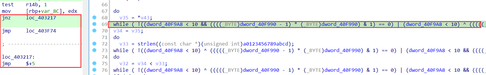

```python
def patch(start, end):
	i = start
	while i < end:
		if GetMnem(i) == 'jnz' and GetMnem(i + 6) == 'jmp' and GetOpnd(i + 0xb, 0) == '$+5' and GetMnem(i + 0xb) == 'jmp':
			print(hex(i))
			for j in range(i, i + 0x10):
				PatchByte(j, 0x90)
				i += 0xf
		i += 1
for seg in Segments():
	if SegName(seg) == '.text':
		patch(seg, 0x40B7E4)
```

### 主要逻辑

Findcrypt发现md5特征，都在一个函数中：

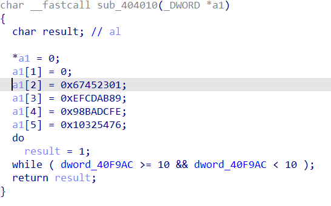

主逻辑通过动调猜测是md5，且是单个字符的md5：

init_key函数就是上面的md5特征的函数。

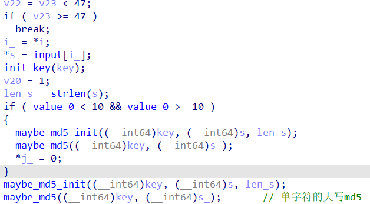

这里估计是双重md5：

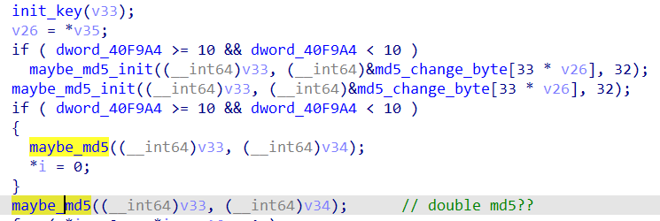

最后和一堆md5值进行比较：

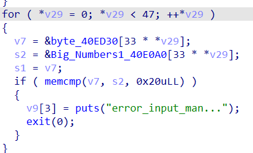

### exp

```python
# 计算字符串的 MD5 散列值
import hashlib
def calculate_md5_string(input_string):
    md5_hash = hashlib.md5()
    md5_hash.update(input_string.encode('utf-8'))
    return md5_hash.hexdigest()
md5 = []
for i in range(30, 128):
    md5_str = calculate_md5_string(calculate_md5_string(chr(i)))
    md5.append(md5_str)
result = [
    '14d89c38cd0fb23a14be2798d449c182',
    'a94837b18f8f43f29448b40a6e7386ba',
    'af85d512594fc84a5c65ec9970956ea5',
    'af85d512594fc84a5c65ec9970956ea5',
    '10e21da237a4a1491e769df6f4c3b419',
    'a705e8280082f93f07e3486636f3827a',
    '297e7ca127d2eef674c119331fe30dff',
    'b5d2099e49bdb07b8176dff5e23b3c14',
    '83be264eb452fcf0a1c322f2c7cbf987',
    'a94837b18f8f43f29448b40a6e7386ba',
    '71b0438bf46aa26928c7f5a371d619e1',
    'a705e8280082f93f07e3486636f3827a',
    'ac49073a7165f41c57eb2c1806a7092e',
    'a94837b18f8f43f29448b40a6e7386ba',
    'af85d512594fc84a5c65ec9970956ea5',
    'ed108f6919ebadc8e809f8b86ef40b05',
    '10e21da237a4a1491e769df6f4c3b419',
    '3cfd436919bc3107d68b912ee647f341',
    'a705e8280082f93f07e3486636f3827a',
    '65c162f7c43612ba1bdf4d0f2912bbc0',
    '10e21da237a4a1491e769df6f4c3b419',
    'a705e8280082f93f07e3486636f3827a',
    '3cfd436919bc3107d68b912ee647f341',
    '557460d317ae874c924e9be336a83cbe',
    'a705e8280082f93f07e3486636f3827a',
    '9203d8a26e241e63e4b35b3527440998',
    '10e21da237a4a1491e769df6f4c3b419',
    'f91b2663febba8a884487f7de5e1d249',
    'a705e8280082f93f07e3486636f3827a',
    'd7afde3e7059cd0a0fe09eec4b0008cd',
    '488c428cd4a8d916deee7c1613c8b2fd',
    '39abe4bca904bca5a11121955a2996bf',
    'a705e8280082f93f07e3486636f3827a',
    '3cfd436919bc3107d68b912ee647f341',
    '39abe4bca904bca5a11121955a2996bf',
    '4e44f1ac85cd60e3caa56bfd4afb675e',
    '45cf8ddfae1d78741d8f1c622689e4af',
    '3cfd436919bc3107d68b912ee647f341',
    '39abe4bca904bca5a11121955a2996bf',
    '4e44f1ac85cd60e3caa56bfd4afb675e',
    '37327bb06c83cb29cefde1963ea588aa',
    'a705e8280082f93f07e3486636f3827a',
    '23e65a679105b85c5dc7034fded4fb5f',
    '10e21da237a4a1491e769df6f4c3b419',
    '71b0438bf46aa26928c7f5a371d619e1',
    'af85d512594fc84a5c65ec9970956ea5',
    '39abe4bca904bca5a11121955a2996bf',
]
for i in range(len(result)):
    for j in range(len(md5)):
        if result[i] == md5[j]:
            print(chr(j + 30), end='')
```

## CSGO

动调发现是换表base64.

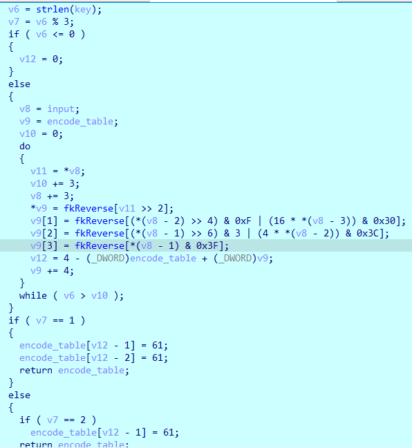

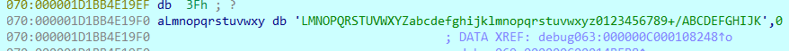

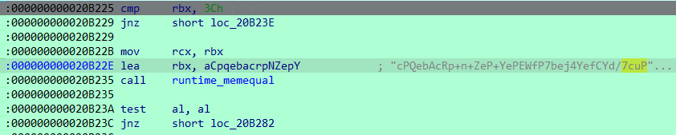

## vm_wo

根据指令码解释一下：

```
# 26 0 input    body[0] = input
# 25 1 1        body[1] = body[0] >> 1
# 13 2 7        body[2] = body[0] << 7
# 24 1 2        body[0] = body[1] | body[2]
# 1 0 3         body[0] = body[0] ^ body[3]
# 26 0 body[0]  body[0] = body[0]
# 25 1 2        body[1] = body[0] >> 2
# 13 2 6        body[2] = body[0] << 6
# 24 1 2        body[0] = body[1] | body[2]
# 1 0 4         body[0] = body[0] ^ body[4]
# 26 0 body[0]  body[0] = body[0]
# 25 1 3        body[1] = body[0] >> 3
# 13 2 5        body[2] = body[0] << 5
# 24 1 2        body[0] = body[1] | body[2]
# 1 0 5         body[0] = body[0] ^ body[5]
# 26 0 body[0]  body[0] = body[0]
# 25 1 4        body[1] = body[0] >> 4
# 13 2 4        body[2] = body[0] << 4
# 24 1 2        body[0] = body[1] | body[2]
# 1 0 6         body[0] = body[0] ^ body[6]
```

### exp

```python
result = [0xDF, 0xD5, 0xF1, 0xD1, 0xFF, 0xDB, 0xA1, 0xA5, 0x89, 0xBD, 0xE9, 0x95, 0xB3, 0x9D, 0xE9, 0xB3, 0x85, 0x99, 0x87, 0xBF, 0xE9, 0xB1, 0x89, 0xE9, 0x91, 0x89, 0x89, 0x8F, 0xAD]
key = struct.pack('<I', 0xBEEDBEEF)
print(key)
for i in range(len(result)):
    num = result[i]
    num = (num >> 3) | ((num << 5) & 0xFF)
    num ^= key[3]
    num = (num >> 4) | ((num << 4) & 0xFF)
    num ^= key[2]
    num = (num >> 5) | ((num << 3) & 0xFF)
    num ^= key[1]
    num = (num >> 6) | ((num << 2) & 0xFF)
    num ^= key[0]
    num = (num >> 7) | ((num << 1) & 0xFF)
    result[i] = num
print(bytearray(result))
```

## Ez加密器

### 去混淆

#### 代码1

a = a + b

```C
args: a, b
do
{
    t = a & b;
    a ^= b;
    b = 2 * t;
}
while ( 2 * t );
```

对应汇编：

```assembly
loc_7FF73D0A1AF8:
mov     ebp, ecx
and     ebp, eax
xor     eax, ecx
mov     ecx, ebp
add     ecx, ecx  // add：如果加法结果为0，更改zf寄存器为1
jnz     short loc_7FF73D0A1AF8
```

可简化为：

```assembly
add		eax, ecx
```

#### 代码2

eax = ~(eax % 8)

汇编：

```assembly
// eax = eax % 8
mov     ecx, eax
sar     ecx, 1Fh
shr     ecx, 1Dh
add     eax, ecx
and     eax, 7
sub     eax, ecx

// eax = ~eax
not     eax
```

#### 代码3

```C
args: v10

v9 = 1;
do // v10 = v10 + v9
{
    v11 = v9;
    v12 = v10;
    v13 = v9 & v10;
    v10 ^= v11;
    v9 = 2 * v13;
}
while ( v9 );
v14 = 7;
if ( v12 != v11 ) // 即 上面循环结果 v10 != 0
{
    do // v14 = v14 + v10
    {
        v15 = v14 & v10;
        v14 ^= v10;
        v10 = 2 * v15;
    }
    while ( 2 * v15 );
}
```

汇编：

```assembly
loc_7FF7F3181B28:              
mov     r12d, ecx
mov     ecx, eax
mov     r13d, eax
and     ecx, r12d
xor     eax, r12d
add     ecx, ecx
jnz     short loc_7FF7F3181B28
mov     ecx, 7
cmp     r13d, r12d
jz      short loc_7FF7F3181B57
nop     dword ptr [rax+00h]
loc_7FF7F3181B48:              
mov     r12d, eax
and     r12d, ecx
xor     ecx, eax
mov     eax, r12d
add     eax, eax
jnz     short loc_7FF7F3181B48
loc_7FF7F3181B57:
xxxxxx
```

可转化为：

```c
args: v10, v9, v14
if v10 + v9 != 0:
	v14 = v14 + v10 + v9
else:
	v14 = v14
```

汇编：

```assembly
add     eax, ecx
mov     ecx, 7
cmp     eax, 0
jz      short loc_7FF73D0A1B57
add     ecx, eax
loc_7FF73D0A1B57:
xxxxxx
```

#### 代码4

```C
args: v17
v16 = 1;
do // v17 = v17 + v16
{
    v19 = v16;
    v20 = v17 & v16;
    v21 = v17;
    v17 ^= v19;
    v16 = 2 * v20;
}
while ( v16 );
if ( v19 == v21 ) // v17 == 0
{
    LOBYTE(v24) = 0x80; // v24 = 1 << 7
    				  // 也是：v24 = 1 << (7 + 1 + v17)
}
else
{
    v22 = 7;
    do // v22 = v22 + v17
    {
        v23 = v22 & v17;
        v22 ^= v17;
        v17 = 2 * v23;
    }
    while ( 2 * v23 );
    v24 = 1 << v22; // v24 = 1 << (7 + 1 + v17)
}
```

可转化为：

```C
v24 = 1 << (7 + 1 + v17)
```

#### 代码5

```c
~(a % 8) + 1 等于 -(a & 8)
```

#### 脚本去混淆

对单个函数的以上混淆去掉。

```Python
from keystone import *
import re


def get_asm(code):
    ks = Ks(KS_ARCH_X86, KS_MODE_64)
    asm, cnt = ks.asm(code)
    return asm


def handle(addr, add_bias, jnz_bias):
    add_num = GetOpnd(addr + add_bias, 1)
    for i in range(2, add_bias):
        if GetMnem(addr + i) == "xor":
            result = GetOpnd(addr + i, 0)
            break
    if add_num and result:
        Jump(addr)
        mnem = f"add {result}, {add_num}"
        print(mnem)
        asm = get_asm(mnem)
        print(asm)
        for i in range(len(asm)):
            PatchByte(addr + i, asm[i])
        for i in range(len(asm), jnz_bias + 2):
            PatchByte(addr + i, 0x90)
        if GetMnem(addr + jnz_bias + 2) == "cmp":
            cmp_bias = jnz_bias + 2
            mnem = f"cmp {result},0"
            print(mnem)
            asm = get_asm(mnem)
            print(f"{[hex(_) for _ in asm]}")
            print(f"{idaapi.get_item_size(addr + cmp_bias) == len(asm)}")
            if len(asm) == idaapi.get_item_size(addr + cmp_bias):
                print(f"hahahahahahahh")
                for i in range(len(asm)):
                    print("patch")
                    PatchByte(addr + cmp_bias + i, asm[i])
            elif len(asm) < idaapi.get_item_size(addr + cmp_bias):
                for i in range(len(asm)):
                    PatchByte(addr + cmp_bias + i, asm[i])
                for i in range(len(asm), idaapi.get_item_size(addr + cmp_bias)):
                    PatchByte(addr + cmp_bias + i, 0x90)
            elif len(asm) > idaapi.get_item_size(addr + cmp_bias):
                cmp_len = idaapi.get_item_size(addr + cmp_bias)
                code1_len = idaapi.get_item_size(addr + cmp_bias + cmp_len)
                code2_len = idaapi.get_item_size(addr + cmp_bias + cmp_len + code1_len)
                if GetMnem(addr + cmp_bias + cmp_len) == "nop":
                    for i in range(len(asm)):
                        PatchByte(addr + cmp_bias + i, asm[i])
                    for i in range(len(asm), cmp_len + code1_len):
                        PatchByte(addr + cmp_bias + i, 0x90)
                elif GetMnem(addr + cmp_bias + cmp_len + code1_len) == "nop":
                    if GetMnem(addr + cmp_bias + cmp_len) == "jz":
                        if code1_len == 6:
                            ori_jmp = Dword(addr + cmp_bias + cmp_len + 2)
                            new_jmp = ori_jmp - code2_len
                            jmp_data = struct.pack('<I', new_jmp)
                            for i in range(len(jmp_data)):
                                PatchByte(addr + cmp_bias + cmp_len + 2 + i, jmp_data[i])
                        elif code1_len == 2:
                            ori_jmp = Byte(addr + cmp_bias + cmp_len + 1)
                            new_jmp = ori_jmp - code2_len
                            PatchByte(addr + cmp_bias + cmp_len + 1, new_jmp)
                    for i in range(cmp_len + code1_len, cmp_len + code1_len + code2_len):
                        PatchByte(addr + cmp_bias + i, 0x90)
                    for i in range(cmp_len + code1_len + code2_len - 1, cmp_len + code2_len - 1, -1):
                        PatchByte(addr + cmp_bias + i, Byte(addr + cmp_bias + i - code2_len))
                    for i in range(len(asm)):
                        PatchByte(addr + cmp_bias + i, asm[i])
                    for i in range(len(asm), cmp_len + code2_len):
                        PatchByte(addr + cmp_bias + i, 0x90)
                elif GetMnem(addr + cmp_bias + cmp_len + code1_len + code2_len) == "nop":
                    code3_len = idaapi.get_item_size(addr + cmp_bias + cmp_len + code1_len + code2_len)
                    if GetMnem(addr + cmp_bias + cmp_len) == "jz":
                        if code1_len == 6:
                            ori_jmp = Dword(addr + cmp_bias + cmp_len + 2)
                            new_jmp = ori_jmp - code3_len
                            jmp_data = struct.pack('<I', new_jmp)
                            for i in range(len(jmp_data)):
                                PatchByte(addr + cmp_bias + cmp_len + 2 + i, jmp_data[i])
                        elif code1_len == 2:
                            ori_jmp = Byte(addr + cmp_bias + cmp_len + 1)
                            new_jmp = ori_jmp - code3_len
                            PatchByte(addr + cmp_bias + cmp_len + 1, new_jmp)
                    elif GetMnem(addr + cmp_bias + cmp_len + code1_len) == "jz":
                        if code2_len == 6:
                            ori_jmp = Dword(addr + cmp_bias + cmp_len + code1_len + 2)
                            new_jmp = ori_jmp - code3_len
                            jmp_data = struct.pack('<I', new_jmp)
                            for i in range(len(jmp_data)):
                                PatchByte(addr + cmp_bias + cmp_len + code1_len + 2 + i, jmp_data[i])
                        elif code2_len == 2:
                            ori_jmp = Byte(addr + cmp_bias + cmp_len + code1_len + 1)
                            new_jmp = ori_jmp - code3_len
                            PatchByte(addr + cmp_bias + cmp_len + code1_len + 1, new_jmp)
                    for i in range(cmp_len + code1_len + code2_len, cmp_len + code1_len + code2_len + code3_len):
                        PatchByte(addr + cmp_bias + i, 0x90)
                        print(f"nop {hex(addr + cmp_bias + i)}")
                    for i in range(cmp_len + code1_len + code2_len + code3_len - 1, cmp_len + code3_len - 1, -1):
                        print(
                            f"{hex(addr + cmp_bias + i - code3_len)}:{Byte(addr + cmp_bias + i - code3_len)} -> {hex(addr + cmp_bias + i)}:{Byte(addr + cmp_bias + i)}")
                        PatchByte(addr + cmp_bias + i, Byte(addr + cmp_bias + i - code3_len))
                    for i in range(len(asm)):
                        print(f"{asm[i]} -> {hex(addr + cmp_bias + i)}:{Byte(addr + cmp_bias + i)}")
                        PatchByte(addr + cmp_bias + i, asm[i])
                    for i in range(len(asm), cmp_len + code3_len):
                        print(f"nop {hex(addr + cmp_bias + i)}")
                        PatchByte(addr + cmp_bias + i, 0x90)
        elif GetMnem(addr + jnz_bias + 7) == "cmp":
            cmp_bias = jnz_bias + 7
            mnem = f"cmp {result},0"
            print(mnem)
            asm = get_asm(mnem)
            if len(asm) == idaapi.get_item_size(addr + cmp_bias):
                for i in range(len(asm)):
                    PatchByte(addr + cmp_bias + i, asm[i])
            elif len(asm) < idaapi.get_item_size(addr + cmp_bias):
                for i in range(len(asm)):
                    PatchByte(addr + cmp_bias + i, asm[i])
                for i in range(len(asm), idaapi.get_item_size(addr + cmp_bias)):
                    PatchByte(addr + cmp_bias + i, 0x90)
            elif len(asm) > idaapi.get_item_size(addr + cmp_bias):
                cmp_len = idaapi.get_item_size(addr + cmp_bias)
                code1_len = idaapi.get_item_size(addr + cmp_bias + cmp_len)
                code2_len = idaapi.get_item_size(addr + cmp_bias + cmp_len + code1_len)
                if GetMnem(addr + cmp_bias + cmp_len) == "nop":
                    for i in range(len(asm)):
                        PatchByte(addr + cmp_bias + i, asm[i])
                    for i in range(len(asm), cmp_len + code1_len):
                        PatchByte(addr + cmp_bias + i, 0x90)
                elif GetMnem(addr + cmp_bias + cmp_len + code1_len) == "nop":
                    if GetMnem(addr + cmp_bias + cmp_len) == "jz":
                        if code1_len == 6:
                            ori_jmp = Dword(addr + cmp_bias + cmp_len + 2)
                            new_jmp = ori_jmp - code2_len
                            jmp_data = struct.pack('<I', new_jmp)
                            for i in range(len(jmp_data)):
                                PatchByte(addr + cmp_bias + cmp_len + 2 + i, jmp_data[i])
                        elif code1_len == 2:
                            ori_jmp = Byte(addr + cmp_bias + cmp_len + 1)
                            new_jmp = ori_jmp - code2_len
                            PatchByte(addr + cmp_bias + cmp_len + 1, new_jmp)
                    for i in range(cmp_len + code1_len, cmp_len + code1_len + code2_len):
                        PatchByte(addr + cmp_bias + i, 0x90)
                    for i in range(cmp_len + code1_len + code2_len - 1, cmp_len + code2_len - 1, -1):
                        PatchByte(addr + cmp_bias + i, Byte(addr + cmp_bias + i - code2_len))
                    for i in range(len(asm)):
                        PatchByte(addr + cmp_bias + i, asm[i])
                    for i in range(len(asm), cmp_len + code2_len):
                        PatchByte(addr + cmp_bias + i, 0x90)
                elif GetMnem(addr + cmp_bias + cmp_len + code1_len + code2_len) == "nop":
                    code3_len = idaapi.get_item_size(addr + cmp_bias + cmp_len + code1_len + code2_len)
                    if GetMnem(addr + cmp_bias + cmp_len) == "jz":
                        if code1_len == 6:
                            ori_jmp = Dword(addr + cmp_bias + cmp_len + 2)
                            new_jmp = ori_jmp - code3_len
                            jmp_data = struct.pack('<I', new_jmp)
                            for i in range(len(jmp_data)):
                                PatchByte(addr + cmp_bias + cmp_len + 2 + i, jmp_data[i])
                        elif code1_len == 2:
                            ori_jmp = Byte(addr + cmp_bias + cmp_len + 1)
                            new_jmp = ori_jmp - code3_len
                            PatchByte(addr + cmp_bias + cmp_len + 1, new_jmp)
                    elif GetMnem(addr + cmp_bias + cmp_len + code1_len) == "jz":
                        if code2_len == 6:
                            ori_jmp = Dword(addr + cmp_bias + cmp_len + code1_len + 2)
                            new_jmp = ori_jmp - code3_len
                            jmp_data = struct.pack('<I', new_jmp)
                            for i in range(len(jmp_data)):
                                PatchByte(addr + cmp_bias + cmp_len + code1_len + 2 + i, jmp_data[i])
                        elif code2_len == 2:
                            ori_jmp = Byte(addr + cmp_bias + cmp_len + code1_len + 1)
                            new_jmp = ori_jmp - code3_len
                            PatchByte(addr + cmp_bias + cmp_len + code1_len + 1, new_jmp)
                    for i in range(cmp_len + code1_len + code2_len, cmp_len + code1_len + code2_len + code3_len):
                        PatchByte(addr + cmp_bias + i, 0x90)
                        print(f"nop {hex(addr + cmp_bias + i)}")
                    for i in range(cmp_len + code1_len + code2_len + code3_len - 1, cmp_len + code3_len - 1, -1):
                        print(
                            f"{hex(addr + cmp_bias + i - code3_len)}:{Byte(addr + cmp_bias + i - code3_len)} -> {hex(addr + cmp_bias + i)}:{Byte(addr + cmp_bias + i)}")
                        PatchByte(addr + cmp_bias + i, Byte(addr + cmp_bias + i - code3_len))
                    for i in range(len(asm)):
                        print(f"{asm[i]} -> {hex(addr + cmp_bias + i)}:{Byte(addr + cmp_bias + i)}")
                        PatchByte(addr + cmp_bias + i, asm[i])
                    for i in range(len(asm), cmp_len + code3_len):
                        print(f"nop {hex(addr + cmp_bias + i)}")
                        PatchByte(addr + cmp_bias + i, 0x90)


seg_addr = idc.here()
fun_start = idc.get_func_off_str(seg_addr)
# print(fun_start)
fun_start = seg_addr - int(fun_start.split("+")[1], 16)
# fun_start = int(re.search(r'sub_(\w+):', fun_start)[1],16)
fun_end = idc.find_func_end(seg_addr)
print(hex(fun_start), hex(fun_end))
for addr in range(fun_start, fun_end):
    if GetMnem(addr + 0xb) == "add" and GetMnem(addr + 0xd) == "jnz" and GetMnem(addr) == "mov":
        print(hex(addr))
        handle(addr, 0xb, 0xd)
    elif GetMnem(addr + 0x9) == "add" and GetMnem(addr + 0xb) == "jnz" and GetMnem(addr) == "mov":
        print(hex(addr))
        handle(addr, 0x9, 0xb)
    elif GetMnem(addr + 0x8) == "add" and GetMnem(addr + 0xa) == "jnz" and GetMnem(addr) == "mov":
        print(hex(addr))
        handle(addr, 0x8, 0xa)
    elif GetMnem(addr + 0x8) == "add" and GetMnem(addr + 0xd) == "jnz" and GetMnem(addr) == "mov":
        print(hex(addr))
        handle(addr, 0x8, 0xd)
    elif GetMnem(addr + 0x6) == "add" and GetMnem(addr + 0xa) == "jnz" and GetMnem(addr) == "mov":
        print(hex(addr))
        handle(addr, 0x6, 0xa)
    elif GetMnem(addr + 12) == "add" and GetMnem(addr + 15) == "jnz" and GetMnem(addr) == "mov":
        print(hex(addr))
        handle(addr, 12, 15)
    elif GetMnem(addr + 12) == "add" and GetMnem(addr + 14) == "jnz" and GetMnem(addr) == "mov":
        print(hex(addr))
        handle(addr, 12, 14)
    elif GetMnem(addr + 10) == "add" and GetMnem(addr + 12) == "jnz" and GetMnem(addr) == "mov":
        print(hex(addr))
        handle(addr, 10, 12)
```

### 思路

网上大伙的wp都说是DES，但说实话除了找到数据特征是DES，以及最后对输入处理都是与和或，没看出大概DES /(ㄒoㄒ)/。

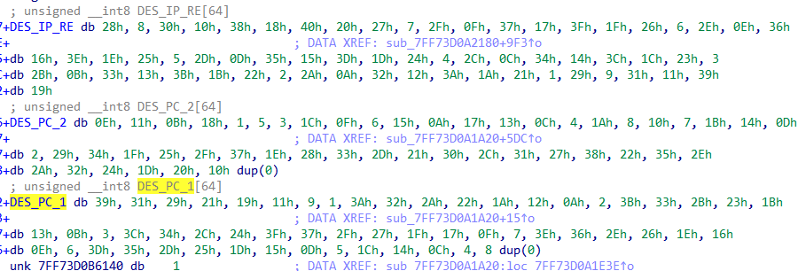

爆破6位code（0-999999），进行换表base64作为DES密钥。

这里给出网上的exp：

```python
flag = "DASCTF{1234567890abcdef1234567890abcdef}"
from Crypto.Cipher import DES
import base64
key = bytes([0x6D, 0x74, 0x69, 0x50, 0x6E, 0x64, 0x75, 0x53 ])
print(key)
def base64_encode(data):
    oldtable='ABCDEFGHIJKLMNOPQRSTUVWXYZabcdefghijklmnopqrstuvwxyz0123456789+/'#老表
    newtable='abcdefghijklmnopqrstuvwxyz0123456789ABCDEFGHIJKLMNOPQRSTUVWXYZ+/'#这里输入魔改变表
    tmp = base64.b64encode(data.encode()).decode()
    result=''
    for ch in tmp:
        result +=newtable[oldtable.index(ch)]
    return result

## key = base64_encode("123456")
## print(key)
for i in range(0,1000000):
    tmp_key = str(i).rjust(6,"0")
    tmp_key = base64_encode(tmp_key)
    #print(tmp_key)
    des = DES.new(tmp_key.encode(),mode=DES.MODE_ECB)
    c = bytes.fromhex("0723105D5C12217DCDC3601F5ECB54DA9CCEC2279F1684A13A0D716D17217F4C9EA85FF1A42795731CA3C55D3A4D7BEA")
    m = des.decrypt(c)
    if(b"DAS" in m):
        print(i)
        print(m)
```
