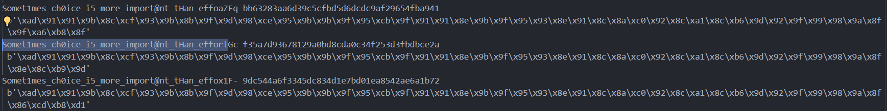

## MZ

逻辑较为简单

```C
int __cdecl main(int argc, const char **argv, const char **envp)
{
    char v4; // [esp+0h] [ebp-26Ch]
    int v5; // [esp+D0h] [ebp-19Ch]
    unsigned __int8 v6; // [esp+DFh] [ebp-18Dh]
    int i; // [esp+E8h] [ebp-184h]
    char Buf1[52]; // [esp+F4h] [ebp-178h] BYREF
    char v9[264]; // [esp+128h] [ebp-144h] BYREF
    char input[56]; // [esp+230h] [ebp-3Ch] BYREF

    __CheckForDebuggerJustMyCode(&unk_AA4018);
    memset(input, 0, 0x31u);
    memset(v9, 0, 0x100u);
    memset(Buf1, 0, 0x29u);
    sub_A61020(); // 填充 A99000
    sub_A94D00("%48s", (char)input);
    if ( strlen(input) != 48 )
    {
        printf("Wrong length\n", v4);
        exit(0);
    }
    // 主要是这里 需要跑一下脚本
    for ( i = 0; i < 48; ++i )
    {
        v6 = input[i];
        v5 = off_A99000[2 * v6];
        if ( v6 - 5 == v5 )
        {
            v9[i] = ~(v6 + 1);
        }
        else
        {
            if ( v6 + 5 != v5 )
            {
                printf("Wrong flag\n", v4);
                exit(0);
            }
            v9[i] = ~(v6 - 1);
        }
        off_A99000 = (int *)off_A99000[2 * v6 + 1];
    }
    // 对转变的v9进行sha1
    sha1((int)v9, 48i64, Buf1);
    if ( !memcmp(Buf1, aDc0562f86bec0a, 0x28u) )
        printf("Right, the flag is DASCTF{%s}\n", (char)input);
    else
        printf("Wrong flag\n", v4);
    return 0;
}
```

不知道为什么，写出来的脚本卡在了最后两个没出来，只有：



手动试了一下，得到flag。

```Python
import struct
import hashlib
printable = 'abcdefghijklmnopqrstuvwxyzABCDEFGHIJKLMNOPQRSTUVWXYZ0123456789!@#$%^&*()+_-=[]{}|\\'
base = 0xA99000
begin = 0xA99078
with open('all_data', 'rb') as f:
    data = f.read()
length = len(data)
data = struct.unpack(f'{length // 4}i', data)
data_num = []
data_addr = []
for i in range(0, length // 4, 2):
    data_num.append(data[i])
    data_addr.append(data[i + 1])

def sha1_hash(flag):
    sha1 = hashlib.sha1()
    sha1.update(flag)
    hashed_flag = sha1.hexdigest()
    return hashed_flag

# def trans(flag):


def getindex(addr):
    # print((addr - base) // 8)
    return (addr - base) // 8

def get_char(flag, tranStr, begin):
    if len(flag) == 48:
        shash = sha1_hash(bytes(tranStr))
        print(flag, shash, '\n', bytes(tranStr))
        if shash == 'dc0562f86bec0a38508e704aa9faa347101e1fdb':
            print(flag)
            exit(0)
        return
    for i in range(127):
        # if i == ord('S'):
            # print(flag, i, chr(i))
        if getindex(begin + i * 8) >= length // 8:
            continue
        if i + 5 == data_num[getindex(begin + i * 8)] and chr(i) in printable:
            get_char(
                flag + chr(i), 
                tranStr + [(i - 1) ^ 0xFF],
                data_addr[getindex(begin + i * 8)]
            )
        if i - 5 == data_num[getindex(begin + i * 8)] and chr(i) in printable:
            get_char(
                flag + chr(i), 
                tranStr + [(i + 1) ^ 0xFF],
                data_addr[getindex(begin + i * 8)]
            )


if __name__ == '__main__':
    get_char('', [],begin)
```
