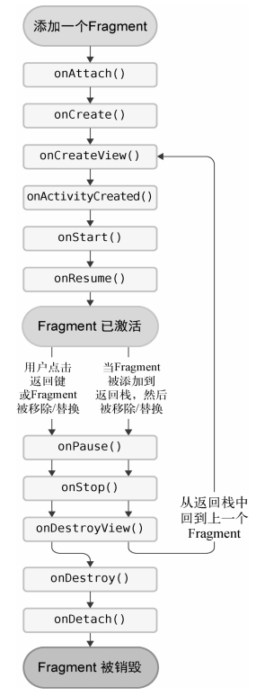

## Fragment

Fragment是一种可以嵌入在Activity当中的UI片段，它能让程序更加合理和充分地利用大屏幕的空间。

### 简单的fragment

定义两个Fragment：

left_fragment：

```xml
<?xml version="1.0" encoding="utf-8"?>
<LinearLayout xmlns:android="http://schemas.android.com/apk/res/android"
              android:layout_width="match_parent"
              android:layout_height="match_parent"
              android:orientation="vertical">

    <Button
            android:layout_width="wrap_content"
            android:layout_height="wrap_content"
            android:id="@+id/button"
            android:layout_gravity="center_horizontal"
            android:text="Button"/>

</LinearLayout>
```

```kotlin
package com.example.fragmenttest1

import android.os.Bundle
import android.view.LayoutInflater
import android.view.View
import android.view.ViewGroup
import androidx.fragment.app.Fragment

class LeftFragment : Fragment() {
    override fun onCreateView(inflater: LayoutInflater, container: ViewGroup?, savedInstanceState: Bundle?): View? {
        return inflater.inflate(R.layout.left_fragment, container, false)
    }
}
```

right_frament：

```xml
<?xml version="1.0" encoding="utf-8"?>
<LinearLayout xmlns:android="http://schemas.android.com/apk/res/android"
              android:layout_width="match_parent"
              android:layout_height="match_parent"
              android:background="#00ff00"
              android:orientation="vertical">
    <TextView
              android:layout_width="wrap_content"
              android:layout_height="wrap_content"
              android:layout_gravity="center_horizontal"
              android:textSize="20sp"
              android:text="This is right fragment"/>

</LinearLayout>
```

```kotlin
package com.example.fragmenttest1

import android.os.Bundle
import android.view.LayoutInflater
import android.view.View
import android.view.ViewGroup
import androidx.fragment.app.Fragment

class RightFragment : Fragment() {
    override fun onCreateView(inflater: LayoutInflater, container: ViewGroup?, savedInstanceState: Bundle?): View? {
        return inflater.inflate(R.layout.right_fragment, container, false)
    }
}

```

activity_main：

```xml
<?xml version="1.0" encoding="utf-8"?>
<LinearLayout xmlns:android="http://schemas.android.com/apk/res/android"
              android:orientation="horizontal"
              android:layout_width="match_parent"
              android:layout_height="match_parent">
    <fragment
              android:layout_width="0dp"
              android:layout_height="match_parent"
              android:layout_weight="1"
              android:id="@+id/left_fragment"
              android:name="com.example.fragmenttest1.LeftFragment" />
    <fragment
              android:layout_width="0dp"
              android:layout_height="match_parent"
              android:layout_weight="1"
              android:id="@+id/right_fragment"
              android:name="com.example.fragmenttest1.RightFragment" />

</LinearLayout>
```

```kotlin
package com.example.fragmenttest1

import android.os.Bundle
import androidx.appcompat.app.AppCompatActivity

class MainActivity : AppCompatActivity() {
    override fun onCreate(savedInstanceState: Bundle?) {
        super.onCreate(savedInstanceState)
        setContentView(R.layout.activity_main)
    }
}
```

AndroidManifest.xml：

```xml
<?xml version="1.0" encoding="utf-8"?>
<manifest xmlns:android="http://schemas.android.com/apk/res/android"
          xmlns:tools="http://schemas.android.com/tools">
    <application
                 android:allowBackup="true"
                 android:dataExtractionRules="@xml/data_extraction_rules"
                 android:fullBackupContent="@xml/backup_rules"
                 android:icon="@mipmap/ic_launcher"
                 android:label="@string/app_name"
                 android:roundIcon="@mipmap/ic_launcher_round"
                 android:supportsRtl="true"
                 android:theme="@style/Theme.FragmentTest1"
                 tools:targetApi="31">
        <activity
                  android:name=".MainActivity"
                  android:exported="true"
                  android:label="@string/app_name">
            <intent-filter>
                <action android:name="android.intent.action.MAIN" />
                <category android:name="android.intent.category.LAUNCHER" />
            </intent-filter>
        </activity>
    </application>
</manifest>
```

#### 动态添加Fragment

新建一个another_right_fragment：

```xml
<LinearLayout xmlns:android="http://schemas.android.com/apk/res/android"
              android:orientation="vertical"
              android:background="#ffff00"
              android:layout_width="match_parent"
              android:layout_height="match_parent">
    <TextView
              android:layout_width="wrap_content"
              android:layout_height="wrap_content"
              android:layout_gravity="center_horizontal"
              android:textSize="24sp"
              android:text="This is another right fragment"
              />
</LinearLayout>
```

```kotlin
class AnotherRightFragment : Fragment() {
    override fun onCreateView(inflater: LayoutInflater, container: ViewGroup?, savedInstanceState: Bundle?): View? {
        return inflater.inflate(R.layout.another_right_fragment, container, false)
    }
}
```

activity_main：

```xml
<LinearLayout xmlns:android="http://schemas.android.com/apk/res/android"
              android:orientation="horizontal"
              android:layout_width="match_parent"
              android:layout_height="match_parent" >
    <fragment
              android:id="@+id/leftFrag"
              android:name="com.example.fragmenttest.LeftFragment"
              android:layout_width="0dp"
              android:layout_height="match_parent"
              android:layout_weight="1" />
    <FrameLayout
                 android:id="@+id/rightLayout"
                 android:layout_width="0dp"
                 android:layout_height="match_parent"
                 android:layout_weight="1" >
    </FrameLayout>
</LinearLayout>
```

MainActivity：

```kotlin
class MainActivity : AppCompatActivity() {
    override fun onCreate(savedInstanceState: Bundle?) {
        super.onCreate(savedInstanceState)
        setContentView(R.layout.activity_main)
        button.setOnClickListener {
            replaceFragment(AnotherRightFragment())
        }
        replaceFragment(RightFragment())
    }
    private fun replaceFragment(fragment: Fragment) {
        val fragmentManager = supportFragmentManager
        val transaction = fragmentManager.beginTransaction()
        transaction.replace(R.id.rightLayout, fragment)
        transaction.commit()
    }
}
```

由于`kotlin-android-extensions`插件已弃用，上面MainActivity无法使用。

把代码改成这样：让LeftFragment提供接口给MainActivity把button绑定事件。

LeftFragment：

```kotlin
package com.example.fragmenttest1

import android.os.Bundle
import android.view.LayoutInflater
import android.view.View
import android.view.ViewGroup
import androidx.fragment.app.Fragment
import com.example.fragmenttest1.databinding.LeftFragmentBinding

class LeftFragment : Fragment() {
    var buttonClickListener: ButtonClickListener? = null
    private var _binding: LeftFragmentBinding? = null
    private val binding get() = _binding!!

    override fun onCreateView(
        inflater: LayoutInflater,
        container: ViewGroup?,
        savedInstanceState: Bundle?
    ): View? {
        _binding = LeftFragmentBinding.inflate(inflater, container, false)
        return binding.root
    }

    override fun onViewCreated(view: View, savedInstanceState: Bundle?) {
        super.onViewCreated(view, savedInstanceState)
        binding.button.setOnClickListener {
            buttonClickListener?.onButtonClick()
        }
    }

    override fun onDestroyView() {
        super.onDestroyView()
        _binding = null
    }

    interface ButtonClickListener {
        fun onButtonClick()
    }
}
```

MainActivity：

```kotlin
package com.example.fragmenttest1

import android.os.Bundle
import androidx.appcompat.app.AppCompatActivity
import androidx.fragment.app.Fragment
import com.example.fragmenttest1.databinding.ActivityMainBinding


class MainActivity : AppCompatActivity() {
    override fun onCreate(savedInstanceState: Bundle?) {
        super.onCreate(savedInstanceState)
        setContentView(R.layout.activity_main)
        replaceFragment(RightFragment())
        // Create/Get the instance of your LeftFragment
        val leftFragment = supportFragmentManager.findFragmentById(R.id.left_fragment) as LeftFragment?
        // check if leftFragment is not null
        leftFragment?.let {
            // Set the listener for the button.
            it.buttonClickListener = object: LeftFragment.ButtonClickListener {
                override fun onButtonClick() {
                    // Handle button click event here
                    replaceFragment(AnotherRightFragment())
                }
            }
        }

    }
    private fun replaceFragment(fragment: Fragment) {
        val fragmentManager = supportFragmentManager
        val transaction = fragmentManager.beginTransaction()
        transaction.replace(R.id.right_layout, fragment)
        transaction.addToBackStack(null)
        transaction.commit()
    }
}
```

#### Fragment和Activity之间的交互

在Activity中调用Fragment里的方法：

```kotlin
val fragment = supportFragmentManager.findFragmentById(R.id.leftFrag) as LeftFragment
```

在Fragment中又该怎样调用Activity 里的方法：

在每个Fragment中都可以通过调用`getActivity()`方法来得到和当前Fragment相关联的Activity实例，`getActivity()`方法有可能返回`null`。

```kotlin
if (activity != null) {
    val mainActivity = activity as MainActivity
}
```

### Fragment的生命周期

#### Fragment的状态

1. 运行状态
   1. 当一个Fragment所关联的Activity正处于运行状态时，该Fragment也处于运行状态。
2. 暂停状态
   1. 当一个Activity进入暂停状态时（由于另一个未占满屏幕的Activity被添加到了栈顶），与它相关联的Fragment就会进入暂停状态。
3. 停止状态
   1. 当一个Activity进入停止状态时，与它相关联的Fragment就会进入停止状态，或者通过调用FragmentTransaction的remove()、replace()方法将Fragment从Activity中移除，但在事务提交之前调用了addToBackStack()方法，这时的Fragment也会进入停止状态。
   2. 进入停止状态的Fragment对用户来说是完全不可见的，有可能会被系统回收。
4. 销毁状态
   1. Fragment总是依附于Activity而存在，因此当Activity被销毁时，与它相关联的 Fragment就会进入销毁状态。
   2. 或者通过调用FragmentTransaction的remove()、 replace()方法将Fragment从Activity中移除，但在事务提交之前并没有调用addToBackStack()方法，这时的Fragment也会进入销毁状态。

#### Fragment的回调方法

1. `onAttach()`：当Fragment和Activity建立关联时调用。
2. `onCreateView()`：为Fragment创建视图（加载布局）时调用。
3. `onActivityCreated()`：确保与Fragment相关联的Activity已经创建完毕时调用。
4. `onDestroyView()`：当与Fragment关联的视图被移除时调用。
5. `onDetach()`：当Fragment和Activity解除关联时调用。



在Fragment中也可以通过`onSaveInstanceState()`方法来保存数据，因为进入停止状态的Fragment有可能在系统内存不足的时候被回收。

保存下来的数据在`onCreate()`、`onCreateView()`和`onActivityCreated()`这3个方法中都可以重新得到，它们都含有一个`Bundle`类型的`savedInstanceState`参数。

### 动态加载布局

#### 限定符（qualifier）

在运行时判断程序应该是使用双页模式还是单页模式。

> `layout/activity_main`布局只包含了一个Fragment，即单页模式
>
> `layout-large/activity_main`布局包含了两个Fragment，即双页模式。

| 屏幕特征 | 限定符 | 描述                                        |
| -------- | ------ | ------------------------------------------- |
| 大小     | small  | 提供给小屏幕设备的资源                      |
|          | normal | 提供给中等屏幕设备的资源                    |
|          | large  | 提供给大屏幕设备的资源                      |
|          | xlarge | 提供给超大屏幕设备的资源                    |
| 分辨率   | ldpi   | 提供给低分辨率设备的资源（＜120dpi）        |
|          | mdpi   | 提供给中分辨率设备的资源（120~160 dpi）     |
|          | hdpi   | 提供给高分辨率设备的资源（160~240 dpi）     |
|          | xhdpi  | 提供给超高分辨率设备的资源（240~320 dpi）   |
|          | xxhdpi | 提供给超超高分辨率设备的资源（320~480 dpi） |
| 方向     | land   | 提供给横屏设备的资源                        |
|          | port   | 提供给竖屏设备的资源                        |

#### 最小宽度限定符

最小宽度限定符允许我们对屏幕的宽度指定一个最小值（以dp为单位），然后以这个最小值为临界点，屏幕宽度大于这个值的设备就加载一个布局，屏幕宽度小于这个值的设备就加载另一个布局。

> 在res目录下新建`layout-sw600dp`文件夹，然后在这个文件夹下新建activity_main.xml布局。
>
> 这就意味着，当程序运行在屏幕宽度大于等于600 dp的设备上时，会加载`layout-sw600dp/activity_main`布局，当程序运行在屏幕宽度小于600 dp的设备上时，则仍然加载 默认的`layout/activity_main`布局。